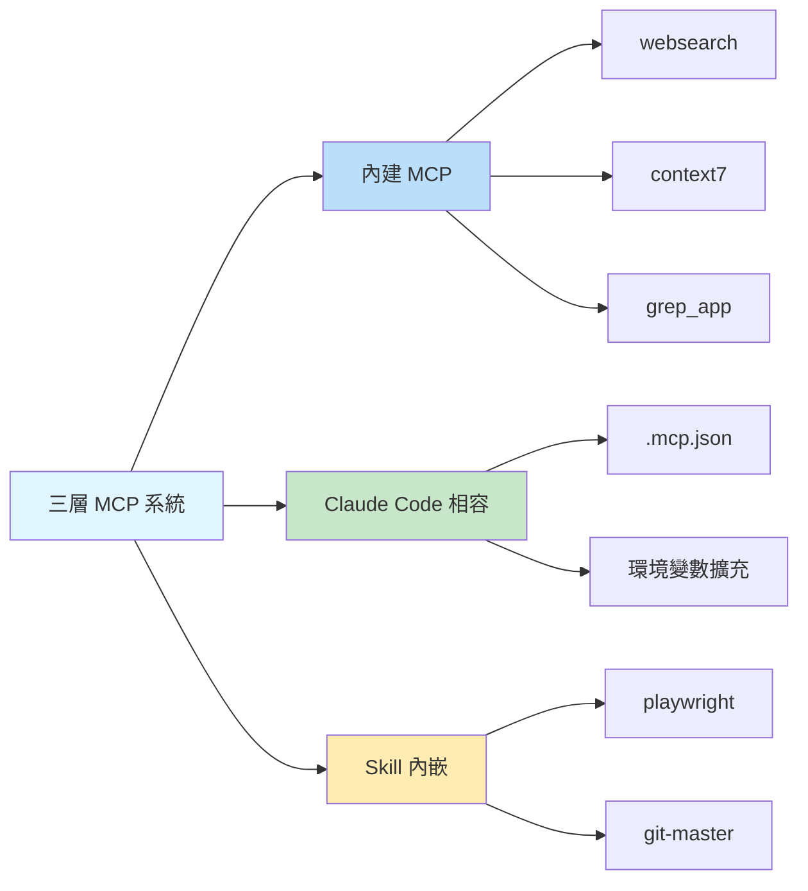

# 內建 MCP 伺服器：網路搜尋、文件查詢和程式碼搜尋

## 學完你能做什麼

- 理解 3 個內建 MCP 伺服器的功能和使用場景
- 知道如何配置 Exa Websearch 的 API Key
- 學會停用不需要的 MCP 服務
- 了解三層 MCP 系統的架構和工作原理

## 你現在的困境

AI 代理只能存取本機檔案和網路請求，但缺乏專業的搜尋和文件查詢能力。你希望代理能夠：
- 即時搜尋網路獲取最新資訊
- 查閱官方文件獲取準確的 API 說明
- 在 GitHub 儲存庫中搜尋實作範例

但這些功能需要手動實作，增加了開發複雜度。

## 什麼時候用這一招

當你需要擴充 AI 代理的能力時：

| 場景 | 推薦使用的 MCP |
| --- | --- |
| 需要獲取最新技術資訊、新聞、產業動態 | **websearch** (Exa) |
| 查詢函式庫或框架的官方 API 文件 | **context7** |
| 在 GitHub 儲存庫中尋找實作範例 | **grep_app** (Grep.app) |

## 核心思路：什麼是 MCP？

**MCP (Model Context Protocol)** 是一種標準協定，讓 AI 代理能夠存取外部工具和資料來源。簡單理解：

::: info 什麼是 MCP？
MCP 就像給 AI 代理配備了一個「工具箱」，裡面裝著各種專業工具（搜尋、資料庫、API 等）。代理可以按需呼叫這些工具，獲取本機無法提供的能力。
:::

Oh-My-OpenCode 提供了**三層 MCP 系統**：



**本課重點介紹第一層：內建 MCP 伺服器**。

---

## 三個內建 MCP 伺服器

Oh-My-OpenCode 內建了 3 個遠端 MCP 伺服器，無需額外配置即可使用（部分需要 API Key）。

### 1. websearch (Exa AI)

**功能**：即時網路搜尋，由 [Exa AI](https://exa.ai) 提供支援。

**適用場景**：
- 搜尋最新技術文章和新聞
- 尋找特定問題的解決方案
- 獲取產業趨勢和最佳實務

**配置要求**：

需要設定 `EXA_API_KEY` 環境變數：

::: code-group

```bash [macOS/Linux]
export EXA_API_KEY="your-api-key-here"
```

```powershell [Windows]
setx EXA_API_KEY "your-api-key-here"
```

:::

::: tip 獲取 Exa API Key
1. 造訪 [Exa AI](https://exa.ai)
2. 註冊帳號
3. 在 Dashboard 中建立 API Key
4. 將 Key 新增到環境變數
:::

**原始碼位置**：`src/mcp/websearch.ts`（第 1-11 行）

---

### 2. context7

**功能**：官方文件查詢，支援任何程式設計函式庫或框架。

**適用場景**：
- 查詢 React、Vue、Next.js 等函式庫的 API 文件
- 獲取 Node.js、Python 等執行環境的官方說明
- 查閱開源專案的使用指南

**配置要求**：無需配置，開箱即用。

**原始碼位置**：`src/mcp/context7.ts`（第 1-7 行）

---

### 3. grep_app (Grep.app)

**功能**：超快速的 GitHub 程式碼搜尋，用於尋找實作範例。

**適用場景**：
- 在開源專案中尋找特定模式的實作
- 學習別人的程式碼寫法
- 尋找解決特定問題的程式碼片段

**配置要求**：無需配置，開箱即用。

**原始碼位置**：`src/mcp/grep-app.ts`（第 1-7 行）

---

## 配置與停用 MCP

### 預設行為

所有內建 MCP 伺服器**預設啟用**。Oh-My-OpenCode 會在啟動時自動註冊這些服務。

### 停用不需要的 MCP

如果某些 MCP 服務不需要，可以在配置檔案中停用：

```jsonc
// ~/.config/opencode/oh-my-opencode.json 或 .opencode/oh-my-opencode.json
{
  "$schema": "./assets/oh-my-opencode.schema.json",

  // 停用不需要的 MCP 伺服器
  "disabled_mcps": [
    "websearch",    // 停用網路搜尋（如果不需要 Exa API Key）
    "grep_app"      // 停用 GitHub 程式碼搜尋
  ]
}
```

::: warning 為什麼停用 MCP？
停用不需要的 MCP 可以：
1. **節省資源**：減少不必要的連線和請求
2. **簡化配置**：避免提示需要未設定的 API Key
3. **提高穩定性**：減少潛在的網路故障點
:::

### 配置優先順序

內建 MCP 的停用配置優先順序：

| 配置位置 | 優先順序 |
| --- | --- |
| 使用者配置 `~/.config/opencode/oh-my-opencode.json` | 高（覆蓋專案配置） |
| 專案配置 `.opencode/oh-my-opencode.json` | 中 |
| 程式碼預設值 | 低（全部啟用） |

---

## 工作原理：遠端 MCP 配置

所有內建 MCP 伺服器都使用**遠端（remote）模式**，透過 HTTP/SSE 協定連線到外部服務。

**配置模式**（原始碼定義）：

```typescript
// src/mcp/websearch.ts
export const websearch = {
  type: "remote" as const,        // 固定為 "remote"
  url: "https://mcp.exa.ai/mcp?tools=web_search_exa",  // MCP 伺服器位址
  enabled: true,                   // 啟用狀態（會被 disabled_mcps 覆蓋）
  headers: process.env.EXA_API_KEY  // 可選的請求標頭（API Key）
    ? { "x-api-key": process.env.EXA_API_KEY }
    : undefined,
  oauth: false as const,            // 停用 OAuth 自動偵測
}
```

**配置欄位說明**：

| 欄位 | 類型 | 說明 |
| --- | --- | --- |
| `type` | `"remote"` | 固定值，表示遠端 MCP |
| `url` | `string` | MCP 伺服器的 HTTP 位址 |
| `enabled` | `boolean` | 是否啟用（程式碼中固定為 `true`，由 `disabled_mcps` 控制） |
| `headers` | `object` | 可選的 HTTP 請求標頭（用於認證） |
| `oauth` | `false` | 停用 OAuth 自動偵測（Exa 使用 API Key） |

---

## 踩坑提醒

### 問題 1：websearch 需要 API Key

**症狀**：代理嘗試使用 websearch 時失敗，提示缺少 API Key。

**解決方法**：

```bash
# 檢查環境變數是否設定
echo $EXA_API_KEY

# 如果為空，設定 API Key
export EXA_API_KEY="your-actual-api-key"

# 或永久新增到 shell 配置（~/.bashrc, ~/.zshrc 等）
echo 'export EXA_API_KEY="your-actual-api-key"' >> ~/.zshrc
```

::: tip 驗證 API Key
設定後，可以重新啟動 OpenCode 或執行診斷命令驗證：
```bash
oh-my-opencode doctor --verbose
```
:::

### 問題 2：停用後仍提示 MCP

**症狀**：即使停用了某個 MCP，代理仍嘗試使用它。

**解決方法**：

1. 檢查配置檔案路徑是否正確：
   - 使用者配置：`~/.config/opencode/oh-my-opencode.json`
   - 專案配置：`.opencode/oh-my-opencode.json`

2. 確認 JSON 格式正確（注意逗號、引號）：

```jsonc
{
  "disabled_mcps": ["websearch"]  // ✅ 正確
  // "disabled_mcps": ["websearch"],  // ❌ 錯誤：末尾不能有逗號
}
```

3. 重新啟動 OpenCode 使配置生效。

### 問題 3：Grep.app 結果不準確

**症狀**：grep_app 傳回的結果與預期不符。

**可能原因**：
- 搜尋關鍵詞太泛化
- 目標儲存庫不活躍或已刪除
- 搜尋語法不正確

**解決方法**：
- 使用更具體的搜尋詞
- 在搜尋時指定檔案類型或語言
- 直接造訪 [Grep.app](https://grep.app) 手動驗證

---

## 本課小結

本課介紹了 Oh-My-OpenCode 的 3 個內建 MCP 伺服器：

| MCP | 功能 | 配置要求 | 主要用途 |
| --- | --- | --- | --- |
| **websearch** | 即時網路搜尋 | EXA_API_KEY | 獲取最新資訊 |
| **context7** | 官方文件查詢 | 無 | 查閱 API 文件 |
| **grep_app** | GitHub 程式碼搜尋 | 無 | 尋找實作範例 |

**關鍵要點**：

1. **三層 MCP 系統**：內建 → Claude Code 相容 → Skill 內嵌
2. **預設啟用**：所有內建 MCP 預設開啟，可透過 `disabled_mcps` 停用
3. **遠端模式**：所有內建 MCP 使用 HTTP/SSE 協定連線外部服務
4. **Exa 需要 Key**：websearch 需要 `EXA_API_KEY` 環境變數

這些 MCP 伺服器大大擴充了 AI 代理的能力，讓它們能夠存取即時資訊和專業知識庫。

---

## 附錄：原始碼參考

<details>
<summary><strong>點擊展開檢視原始碼位置</strong></summary>

> 更新時間：2026-01-26

| 功能 | 檔案路徑 | 行號 |
| --- | --- | --- |
| MCP 工廠函式 | [`src/mcp/index.ts`](https://github.com/code-yeongyu/oh-my-opencode/blob/main/src/mcp/index.ts) | 22-32 |
| websearch 配置 | [`src/mcp/websearch.ts`](https://github.com/code-yeongyu/oh-my-opencode/blob/main/src/mcp/websearch.ts) | 1-11 |
| context7 配置 | [`src/mcp/context7.ts`](https://github.com/code-yeongyu/oh-my-opencode/blob/main/src/mcp/context7.ts) | 1-7 |
| grep_app 配置 | [`src/mcp/grep-app.ts`](https://github.com/code-yeongyu/oh-my-opencode/blob/main/src/mcp/grep-app.ts) | 1-7 |
| McpNameSchema | [`src/mcp/types.ts`](https://github.com/code-yeongyu/oh-my-opencode/blob/main/src/mcp/types.ts) | 1-10 |
| disabled_mcps 欄位 | [`src/config/schema.ts`](https://github.com/code-yeongyu/oh-my-opencode/blob/main/src/config/schema.ts) | 331 |

**關鍵常數**：
- `allBuiltinMcps`：內建 MCP 配置物件，包含 websearch、context7、grep_app（`src/mcp/index.ts:16-20`）

**關鍵函式**：
- `createBuiltinMcps(disabledMcps)`：建立啟用的 MCP 清單，過濾掉被停用的 MCP（`src/mcp/index.ts:22-32`）

</details>
