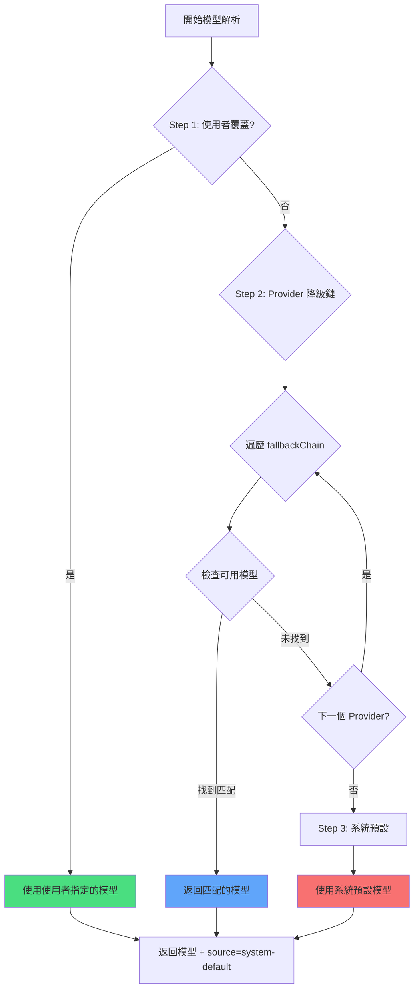

# 多模型策略：自動降級與優先級

## 學完你能做什麼

- 理解 oh-my-opencode 如何為每個代理自動選擇最合適的 AI 模型
- 掌握三步模型解析機制（使用者覆蓋 → Provider 降級 → 系統預設）
- 學會配置代理和 Category 的模型覆蓋
- 使用 `doctor` 命令驗證模型解析結果
- 根據任務需求手動指定模型，優化成本和效能

## 你現在的困境

在配置多個 AI Provider（Anthropic、OpenAI、Google 等）後，你可能遇到這些困惑：

- **模型選擇不明確**：Sisyphus、Oracle、Librarian 等代理到底用哪個模型？
- **手動配置繁瑣**：每個代理都要單獨指定模型，Provider 變化時要全部調整
- **成本不可控**：不知道哪些任務用了昂貴的模型（如 Claude Opus）
- **Provider 故障影響體驗**：某個 Provider API 掛了，整個系統無法工作
- **多模型協作不透明**：並行任務中不同代理用了什麼模型不清楚

這些都在阻礙你發揮多模型編排的真正威力。

## 核心思路

**模型解析系統**是 oh-my-opencode 的"智慧模型選擇器"，它根據你的配置和可用模型，動態決定每個代理和 Category 使用哪個模型。

::: info 什麼是模型解析？
模型解析（Model Resolution）是在執行時為每個代理或 Category 選擇具體 AI 模型的過程。它不是硬編碼的，而是根據你的配置、可用的 Provider、模型名稱等動態計算結果。
:::

### 三步解析流程

模型解析通過三個優先級步驟實現：



**Step 1: User Override（使用者覆蓋）**
- 如果你在 `oh-my-opencode.json` 中明確指定了代理或 Category 的 `model`，系統直接使用該模型
- 跳過 Provider 降級鏈
- 這是最高的優先級

**Step 2: Provider Fallback（Provider 降級）**
- 如果沒有使用者覆蓋，系統按預定義的 Provider 優先級鏈嘗試
- 對於每個代理或 Category，都有一個 `fallbackChain`，定義了它偏好的 Provider 順序
- 系統依次嘗試每個 Provider，直到找到可用的模型

**Step 3: System Default（系統預設）**
- 如果所有 Provider 都沒有可用模型，使用 OpenCode 的預設模型
- 這是最後的兜底方案

### 代理的 Provider 優先級鏈

每個代理都有自己偏好的 Provider 順序，這取決於代理的任務類型和所需能力：

| 代理 | 推薦模型（無前綴） | Provider 優先級鏈 | 變體 |
|--- | --- | --- | ---|
| **Sisyphus** | `claude-opus-4-5` | anthropic → github-copilot → opencode → zai-coding-plan | max |
| **Oracle** | `gpt-5.2` | openai → anthropic → google | high |
| **Librarian** | `big-pickle` | zai-coding-plan → opencode → anthropic | - |
| **Explore** | `claude-haiku-4-5` | anthropic → opencode → github-copilot | - |
| **Multimodal Looker** | `gemini-3-flash` | google → openai → zai-coding-plan → anthropic → opencode | - |
| **Prometheus** | `claude-opus-4-5` | anthropic → github-copilot → opencode → google | max |
| **Metis** | `claude-opus-4-5` | anthropic → github-copilot → opencode → google | max |
| **Momus** | `gpt-5.2` | openai → anthropic → google | medium |
| **Atlas** | `claude-sonnet-4-5` | anthropic → github-copilot → opencode → google | - |

::: tip 為什麼 Sisyphus 偏好 Anthropic？
Sisyphus 是主編排器，需要強大的推理能力。Claude Opus 是最適合複雜編排任務的模型，所以 Anthropic 在其優先級鏈中排第一。如果你的 Anthropic 配額不足，系統會自動降級到其他 Provider。
:::

### Category 的 Provider 優先級鏈

Categories 也遵循相同的解析邏輯：

| Category | 推薦模型（無前綴） | Provider 優先級鏈 | 變體 |
|--- | --- | --- | ---|
| **visual-engineering** | `gemini-3-pro` | google → anthropic → openai | - |
| **ultrabrain** | `gpt-5.2-codex` | openai → anthropic → google | xhigh |
| **artistry** | `gemini-3-pro` | google → anthropic → openai | max |
| **quick** | `claude-haiku-4-5` | anthropic → google → opencode | - |
| **unspecified-low** | `claude-sonnet-4-5` | anthropic → openai → google | - |
| **unspecified-high** | `claude-opus-4-5` | anthropic → openai → google | max |
| **writing** | `gemini-3-flash` | google → anthropic → zai-coding-plan → openai | - |

::: tip Category 的優勢
通過 `delegate_task(category="quick", ...)` 委託任務時，系統會自動使用 quick Category 的 Provider 優先級鏈。這意味著你不需要記住每個代理的配置，只需要根據任務型別選擇合適的 Category。
:::

## 跟我做

### 第 1 步：檢視當前模型解析狀態

使用 `doctor` 命令檢視每個代理和 Category 的模型解析結果：

```bash
bunx oh-my-opencode doctor --verbose
```

**你應該看到**類似這樣的輸出：

```
✅ Model Resolution Check
━━━━━━━━━━━━━━━━━━━━━━━━━━━━━━━━━━━━━━━━━━━━━━━━━━━

Agent: sisyphus
  Requirement: claude-opus-4-5 (variant: max)
  Fallback Chain: anthropic → github-copilot → opencode → zai-coding-plan → openai → google
  User Override: (none)
  Resolved Model: anthropic/claude-opus-4-5
  Source: provider-fallback
  Variant: max

Agent: oracle
  Requirement: gpt-5.2 (variant: high)
  Fallback Chain: openai → anthropic → google
  User Override: (none)
  Resolved Model: openai/gpt-5.2
  Source: provider-fallback
  Variant: high

Category: quick
  Requirement: claude-haiku-4-5
  Fallback Chain: anthropic → google → opencode
  User Override: (none)
  Resolved Model: anthropic/claude-haiku-4-5
  Source: provider-fallback
```

這個輸出展示了：
- 每個代理/Category 的模型需求
- Provider 優先級鏈的順序
- 是否有使用者覆蓋配置
- 最終解析的模型和來源（override/provider-fallback/system-default）

### 第 2 步：手動覆蓋代理模型

假設你想讓 Oracle 使用 OpenAI 的最新模型，而不是預設的 GPT-5.2：

編輯 `~/.config/opencode/oh-my-opencode.json` 或 `.opencode/oh-my-opencode.json`：

```jsonc
{
  "$schema": "https://raw.githubusercontent.com/code-yeongyu/oh-my-opencode/master/assets/oh-my-opencode.schema.json",

  "agents": {
    "oracle": {
      "model": "openai/o3"  // 覆蓋為 o3 模型
    },
    "explore": {
      "model": "opencode/gpt-5-nano"  // 使用免費模型
    }
  }
}
```

::: info Step 1 優先級
當你設定 `agents.oracle.model` 時，系統會在 Step 1 直接使用這個模型，跳過 Provider 降級鏈。即使 Anthropic 的 Claude Opus 可用，Oracle 也會使用你指定的 OpenAI o3。
:::

**你應該看到**：再次執行 `doctor` 命令時，Oracle 的解析結果變為：

```
Agent: oracle
  Requirement: gpt-5.2 (variant: high)
  Fallback Chain: openai → anthropic → google
  User Override: openai/o3  // ← 使用者覆蓋生效
  Resolved Model: openai/o3
  Source: override  // ← 來源變為 override
  Variant: high
```

### 第 3 步：手動覆蓋 Category 模型

假設你想讓 `quick` Category 使用免費的 GPT-5 Nano：

```jsonc
{
  "$schema": "https://raw.githubusercontent.com/code-yeongyu/oh-my-opencode/master/assets/oh-my-opencode.schema.json",

  "categories": {
    "quick": {
      "model": "opencode/gpt-5-nano"  // 覆蓋為免費模型
    },
    "visual-engineering": {
      "model": "anthropic/claude-opus-4-5"  // 強制使用 Opus
    }
  }
}
```

**你應該看到**：當你使用 `delegate_task(category="quick", ...)` 時，系統會使用 `opencode/gpt-5-nano`，即使 Anthropic 的 Haiku 可用。

### 第 4 步：模擬 Provider 故障

理解 Provider 降級機制的最佳方式是模擬故障場景。

假設你只配置了 OpenAI，但想看 Sisyphus（偏好 Anthropic）會使用哪個模型：

**當前配置**：
```jsonc
{
  // oh-my-opencode.json
  // 只配置了 openai provider
}
```

**執行 doctor**：

```
Agent: sisyphus
  Requirement: claude-opus-4-5 (variant: max)
  Fallback Chain: anthropic → github-copilot → opencode → zai-coding-plan → openai → google
  User Override: (none)
  
  // 第 1 輪嘗試：anthropic/claude-opus-4-5
  // 結果：不可用（未配置）
  
  // 第 2 輪嘗試：github-copilot/claude-opus-4-5
  // 結果：不可用（未配置）
  
  // 第 3 輪嘗試：opencode/claude-opus-4-5
  // 結果：不可用（未配置）
  
  // 第 4 輪嘗試：zai-coding-plan/glm-4.7
  // 結果：不可用（未配置）
  
  // 第 5 輪嘗試：openai/gpt-5.2-codex (從 fallbackChain 的第 5 個入口)
  // 結果：找到！
  
  Resolved Model: openai/gpt-5.2-codex
  Source: provider-fallback
  Variant: medium
```

**你應該看到**：雖然 Sisyphus 偏好 Claude Opus，但因為 Anthropic 不可用，系統降級到了 OpenAI 的 GPT-5.2 Codex。

::: tip 自動降級的優勢
Provider 降級機制確保了系統的穩健性。即使某個 Provider 故障或配額耗盡，系統也能自動切換到備用 Provider，無需你手動干預。
:::

### 第 5 步：驗證系統預設兜底

假設你一個 Provider 都沒配置，或者所有 Provider 都故障：

**執行 doctor**：

```
Agent: sisyphus
  Requirement: claude-opus-4-5
  Fallback Chain: anthropic → github-copilot → ...
  
  // 所有 Provider 嘗試都失敗
  
  Resolved Model: anthropic/claude-opus-4-5  // 使用系統預設
  Source: system-default  // ← 來源為 system-default
  Variant: max
```

**你應該看到**：系統使用 OpenCode 配置的預設模型。這是最後的安全網。

## 檢查點 ✅

完成上述步驟後，確認：

- [ ] 執行 `doctor --verbose` 能看到所有代理和 Category 的模型解析結果
- [ ] 手動覆蓋代理模型後，`Source` 變為 `override`
- [ ] 手動覆蓋 Category 模型後，`delegate_task` 使用指定模型
- [ ] 模擬 Provider 故障時，系統能正確降級到下一個可用 Provider
- [ ] 所有 Provider 都不可用時，系統使用 `system-default`

如果任何一項未通過，檢查：
- 配置檔案路徑是否正確（`~/.config/opencode/oh-my-opencode.json` 或 `.opencode/oh-my-opencode.json`）
- Provider 是否正確配置（API Key、環境變數等）
- 模型名稱是否正確（包括 Provider 前綴，如 `anthropic/claude-opus-4-5`）

## 什麼時候用這一招

| 場景 | 手動覆蓋模型 | 使用 Provider 降級 |
|--- | --- | ---|
| **成本敏感任務** | ✅ 指定廉價模型 | ❌ 可能選擇昂貴模型 |
| **效能敏感任務** | ✅ 指定最強模型 | ❌ 可能降級到弱模型 |
| **測試新模型** | ✅ 指定實驗性模型 | ❌ 不會自動選擇 |
| **日常開發** | ❌ 過度配置 | ✅ 自動選擇最優 |
| **Provider 故障** | ❌ 需要手動修改 | ✅ 自動降級 |
| **多 Provider 環境** | ❌ 過度配置 | ✅ 自動負載平衡 |

**經驗法則**：
- 只在需要精確控制模型時才使用手動覆蓋
- 其他情況讓系統自動選擇，享受 Provider 降級的穩健性
- 對於成本敏感的任務，可以覆蓋為 `quick` Category 或指定廉價模型
- 對於需要最高效能的任務，可以覆蓋為 `claude-opus-4-5` 或 `gpt-5.2`

## 踩坑提醒

::: warning 常見錯誤

**1. 模型名稱缺少 Provider 前綴**

```jsonc
// ❌ 錯誤：缺少 Provider 前綴
{
  "agents": {
    "oracle": {
      "model": "gpt-5.2"  // 缺少 openai/ 前綴
    }
  }
}

// ✅ 正確：包含完整路徑
{
  "agents": {
    "oracle": {
      "model": "openai/gpt-5.2"  // 完整的模型路徑
    }
  }
}
```

**2. 覆蓋不存在的模型**

```jsonc
// ❌ 錯誤：模型名稱拼寫錯誤
{
  "agents": {
    "oracle": {
      "model": "openai/gpt-6"  // GPT-6 不存在
    }
  }
}

// ✅ 正確：使用真實模型
{
  "agents": {
    "oracle": {
      "model": "openai/gpt-5.2"  // 真實模型
    }
  }
}
```

**3. 忽略 Variant 配置**

某些代理和 Category 有推薦的 Variant（如 `max`、`high`、`medium`），這些會影響模型的推理能力。手動覆蓋時要注意：

```jsonc
// ✅ 推薦：保留預設 Variant
{
  "agents": {
    "oracle": {
      "model": "openai/gpt-5.2"
      // Variant 會從 fallbackChain 繼承：high
    }
  }
}

// ✅ 可選：手動指定 Variant
{
  "agents": {
    "oracle": {
      "model": "openai/gpt-5.2",
      "variant": "max"  // 覆蓋預設值
    }
  }
}
```

**4. 依賴系統預設但未配置 Provider**

系統預設模型來自 OpenCode 的配置。如果你一個 Provider 都沒配置，OpenCode 也可能使用預設模型，但這個模型可能不是你想要的。

**建議**：
- 至少配置一個 Provider（Anthropic、OpenAI、Google 等）
- 使用 `doctor` 命令定期檢查模型解析結果
:::

## 本課小結

模型解析系統通過三步優先級機制，實現了智慧的模型選擇：

- **Step 1: User Override**：你指定的模型最高優先級，完全可控
- **Step 2: Provider Fallback**：按預定義的優先級鏈自動降級，保證穩健性
- **Step 3: System Default**：最後的兜底方案，確保系統始終有模型可用

每個代理和 Category 都有自己的 Provider 優先級鏈，這是基於代理的任務類型和所需能力設計的。Sisyphus 偏好 Anthropic（複雜推理），Oracle 偏好 OpenAI（戰略諮詢），Librarian 偏好 zai-coding-plan（多倉庫研究）。

記住：
- **日常開發**：讓系統自動選擇，享受 Provider 降級
- **精確控制**：手動覆蓋模型，優化成本和效能
- **故障恢復**：Provider 降級自動處理，無需人工干預
- **驗證工具**：使用 `doctor` 命令檢查模型解析結果

## 下一課預告

> 下一課我們學習 **[AI 代理團隊：10 位專家介紹](../../advanced/ai-agents-overview/)**。
>
> 你會學到：
> - 10 個內建代理的功能、使用場景和許可權配置
> - 如何根據任務型別選擇合適的代理
> - 代理之間的協作模式和最佳實踐

---

## 附錄：原始碼參考

<details>
<summary><strong>點選展開檢視原始碼位置</strong></summary>

> 更新時間：2026-01-26

| 功能 | 檔案路徑 | 行號 |
|--- | --- | ---|
| 模型解析核心函式 | [`src/shared/model-resolver.ts`](https://github.com/code-yeongyu/oh-my-opencode/blob/main/src/shared/model-resolver.ts) | 43-98 |
| 代理模型需求定義 | [`src/shared/model-requirements.ts`](https://github.com/code-yeongyu/oh-my-opencode/blob/main/src/shared/model-requirements.ts) | 12-79 |
| Category 模型需求定義 | [`src/shared/model-requirements.ts`](https://github.com/code-yeongyu/oh-my-opencode/blob/main/src/shared/model-requirements.ts) | 81-133 |
| 代理建立時的模型解析 | [`src/agents/utils.ts`](https://github.com/code-yeongyu/oh-my-opencode/blob/main/src/agents/utils.ts) | 203-208, 245-250, 284-289 |
| Category 委託時的模型解析 | [`src/tools/delegate-task/tools.ts`](https://github.com/code-yeongyu/oh-my-opencode/blob/main/src/tools/delegate-task/tools.ts) | 532-540 |
| doctor 命令的模型解析檢查 | [`src/cli/doctor/checks/model-resolution.ts`](https://github.com/code-yeongyu/oh-my-opencode/blob/main/src/cli/doctor/checks/model-resolution.ts) | 130-160 |

**關鍵型別定義**：
- `ModelResolutionInput`：模型解析輸入引數（`src/shared/model-resolver.ts:6-10`）
- `ExtendedModelResolutionInput`：擴充套件模型解析輸入，包含 fallbackChain 和 availableModels（`src/shared/model-resolver.ts:23-28`）
- `ModelResolutionResult`：模型解析結果，包含 model、source、variant（`src/shared/model-resolver.ts:17-21`）
- `ModelSource`：模型來源列舉（`override`/`provider-fallback`/`system-default`）（`src/shared/model-resolver.ts:12-16`）
- `FallbackEntry`：Provider 降級鏈條目，包含 providers、model、variant（`src/shared/model-requirements.ts:1-5`）
- `ModelRequirement`：模型需求定義，包含 fallbackChain 和預設 variant（`src/shared/model-requirements.ts:7-10`）

**關鍵常量**：
- `AGENT_MODEL_REQUIREMENTS`：所有代理的模型需求定義，包含 fallbackChain（`src/shared/model-requirements.ts:12-79`）
- `CATEGORY_MODEL_REQUIREMENTS`：所有 Category 的模型需求定義（`src/shared/model-requirements.ts:81-133`）

**關鍵函式**：
- `resolveModelWithFallback()`：核心模型解析函式，實現三步優先級機制（`src/shared/model-resolver.ts:43-98`）
- `resolveModel()`：簡單模型解析，用於沒有 fallbackChain 的情況（`src/shared/model-resolver.ts:35-41`）
- `normalizeModel()`：規範化模型名稱，去除前後空格（`src/shared/model-resolver.ts:30-33`）
- `createBuiltinAgents()`：建立所有內建代理時，呼叫模型解析器確定模型（`src/agents/utils.ts:143-313`）

**業務規則**：
| 規則ID | 規則描述 | 標記 |
|--- | --- | ---|
| BR-4.1-7 | 模型解析優先級：使用者覆蓋 > Provider 降級 > 系統預設 | 【事實】 |
| BR-4.1-7-1 | 使用者覆蓋時直接返回，跳過 Provider 降級鏈 | 【事實】 |
| BR-4.1-7-2 | Provider 降級時按 fallbackChain 順序嘗試每個 Provider | 【事實】 |
| BR-4.1-7-3 | Provider 降級時檢查 availableModels 快取，如果為空則檢查 connectedProviders | 【事實】 |
| BR-4.1-7-4 | 所有 Provider 都不可用時，使用 systemDefaultModel | 【事實】 |
| BR-4.1-7-5 | Sisyphus 的 fallbackChain：anthropic → github-copilot → opencode → zai-coding-plan → openai → google | 【事實】 |
| BR-4.1-7-6 | Oracle 的 fallbackChain：openai → anthropic → google | 【事實】 |
| BR-4.1-7-7 | Librarian 的 fallbackChain：zai-coding-plan → opencode → anthropic | 【事實】 |
| BR-4.1-7-8 | Explore 的 fallbackChain：anthropic → opencode → github-copilot | 【事實】 |
| BR-4.1-7-9 | Multimodal Looker 的 fallbackChain：google → openai → zai-coding-plan → anthropic → opencode | 【事實】 |

</details>
