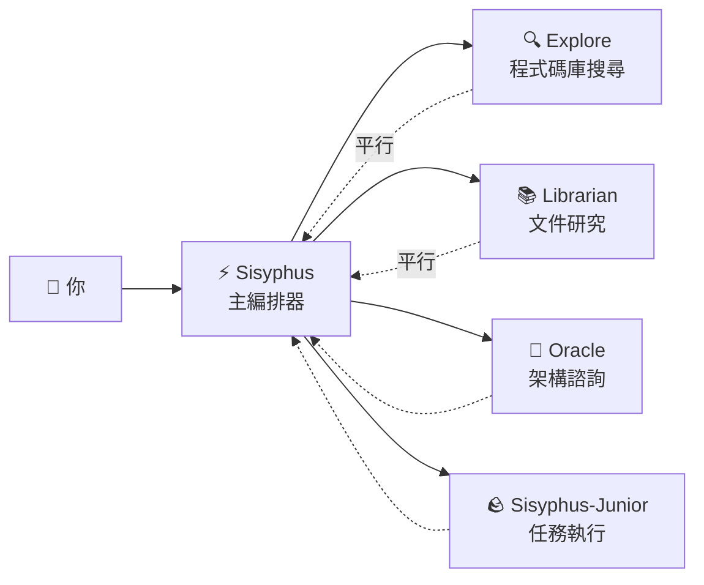

# 主編排器：像資深工程師一樣思考和執行

## 學完你能做什麼

- 理解 Sisyphus 如何像真實開發團隊一樣協調工作
- 掌握任務委派的最佳實踐，讓不同專家代理協同完成複雜任務
- 學會透過平行背景任務大幅提升開發效率
- 知道什麼時候該讓代理自己幹，什麼時候該委派給專家

## 你現在的困境

你可能遇到過這些問題：

- AI 代理「半途而廢」，寫著寫著就忘了目標
- 同一個檔案改來改去，每次都要重新讀一遍上下文
- 想讓 AI 幹很多事，但只能一個一個排隊等
- 代理寫了程式碼，但你自己還得去驗證對不對、有沒有破壞其他功能

**根本原因**：你讓一個「萬能助手」幹所有活，但專家才懂專業事。

## 什麼時候用這一招

Sisyphus 是你的主編排器，適合這些場景：

| 場景 | 是否適合 | 替代方案 |
| --- | --- | ---|
| 複雜功能開發（3+ 步驟） | ✅ 強烈推薦 | Prometheus + Atlas（需要詳細規劃） |
| 快速修復已知 Bug | ✅ 合適 | 直接讓 Sisyphus 做 |
| 需要調研多個倉庫/文件 | ✅ 強烈推薦 | 使用 Sisyphus 平行委派 |
| 單檔案簡單修改 | ✅ 可以 | 直接編輯（更簡單） |
| 需要詳細專案規劃 | ⚠️ 不推薦 | 先用 Prometheus 生成計劃 |

## 核心思路

**Sisyphus** 是主編排器代理，像真實開發團隊一樣協調多個 AI 專家。它透過職責分離和平行委派機制，讓專業子代理各自發揮所長，實現高效協作。

Sisyphus 不是「更聰明的 AI」，它是一個**編排系統**。

### 職責分離



**Sisyphus 不寫程式碼**，它負責：

1. **理解你的真實需求**（不只聽表面意思）
2. **判斷誰最擅長這件事**（不是什麼都自己幹）
3. **平行委派任務**（讓多個專家同時工作）
4. **驗證結果**（絕不輕信「我完成了」）

### 為什麼叫 Sisyphus？

希臘神話中的 Sisyphus 被懲罰永無止境地推石頭上山。

這個系統的設計哲學：**代理必須推完石頭（完成所有 TODO）才能停下**。

::: info
這不是懲罰，是品質保證機制。你不會希望 AI 半途而廢留下爛攤子。
:::

### 32k Thinking Budget

Sisyphus 使用 **Claude Opus 4.5 + 32k thinking budget**。

這有什麼用？

| 低預算（無 thinking） | 32k thinking budget |
| --- | ---|
| 直接開始寫程式碼 | 先深度分析需求、評估複雜度、拆解任務 |
| 容易遺漏邊界情況 | 提前發現潛在問題和風險 |
| 寫到一半發現不對路 | 一開始就選擇最優方案 |

::: tip
強烈推薦給 Sisyphus 配置 **Opus 4.5** 模型。用其他模型體驗會顯著下降。
:::

## 跟我做

### 第 1 步：建立一個測試專案

**為什麼**
你需要一個可執行的專案來觀察 Sisyphus 的行為。
```bash
mkdir my-app && cd my-app
npm create next-app@latest . -- --typescript --tailwind --eslint --no-src-dir
npm install
```

**你應該看到**：專案初始化完成，可執行 `npm run dev` 啟動。

### 第 2 步：給 Sisyphus 一個複雜任務

在 OpenCode 中開啟專案，輸入：

```
新增使用者登入功能，包括：
- 信箱密碼登入
- JWT token 儲存
- 受保護的路由
- 登入狀態檢查
```

觀察 Sisyphus 的反應。

**你應該看到**：

1. Sisyphus 不會直接開始寫程式碼
2. 它先建立 TODO 列表（詳細拆解任務）
3. 評估程式碼庫模式（檢查配置、檔案結構）
4. 可能會問你幾個澄清問題

**檢查點 ✅**：檢視 OpenCode 的 TODO 面板，應該看到類似：

```
□ 安裝必要的相依套件（bcrypt, jsonwebtoken）
□ 建立使用者模型和型別定義
□ 實作登入 API 端點
□ 建立 JWT 簽章和驗證工具
□ 新增受保護路由中介軟體
□ 實作前端登入表單
□ 新增登入狀態管理
```

### 第 3 步：觀察平行委派（關鍵時刻）

Sisyphus 在實作過程中，可能會：

```
[Background Task Started]
- Task ID: bg_abc123
- Agent: explore
- Prompt: "Find existing auth patterns in this codebase..."

[Background Task Started]
- Task ID: bg_def456
- Agent: librarian
- Prompt: "Research JWT best practices for Next.js..."
```

**這是關鍵**：Sisyphus **沒有等待**這些任務完成，它繼續工作。

當你需要結果時，它會呼叫 `background_output(task_id="...")` 取得。

**為什麼這樣快？**

| 串列方式（傳統） | 平行方式（Sisyphus） |
| --- | ---|
| 程式碼庫搜尋（2 分鐘） | ⏳ 程式碼庫搜尋（2 分鐘） |
| 等待... | ⏳ 文件研究（2 分鐘，同時進行） |
| 文件研究（2 分鐘） | 開始實作（總耗時 2 分鐘） |
| 開始實作（2 分鐘） |  |
| **總耗時 6 分鐘** | **總耗時 4 分鐘（省 33%）** |

### 第 4 步：驗證機制

當 Sisyphus 聲稱「任務完成」時，它會：

1. 執行 `lsp_diagnostics` 檢查錯誤
2. 執行 `npm run build` 確保建置通過
3. 如果有測試，執行測試套件
4. 標記 TODO 為 `completed`

**檢查點 ✅**：檢視終端機輸出，應該看到類似：

```
✓ Running diagnostics on changed files...
✓ No errors found
✓ Build passed (exit code 0)
✓ All tests passed
```

如果任何驗證失敗，Sisyphus 會立即修復，從不留下爛攤子。

### 第 5 步：踩坑提醒

#### ❌ 錯誤做法：打斷 Sisyphus 的 TODO 追蹤

你看到 Sisyphus 在做任務，你急著催：

```
快點寫程式碼！別做計劃了！
```

**問題**：Sisyphus 會跳過 TODO，直接寫程式碼，但可能遺漏邊界情況。

**正確做法**：

```
等 Sisyphus 完成規劃。如果覺得規劃不對，提具體的改進建議：
"TODO 第 3 步應該先考慮資料庫遷移方案。"
```

#### ❌ 錯誤做法：不讓 Sisyphus 委派

你在配置中禁用了所有專家代理，只留 Sisyphus。

**問題**：Sisyphus 會嘗試自己幹所有活，但可能不夠專業。

**正確做法**：

保持預設配置，讓 Sisyphus 自動委派給專家：

| 任務 | Sisyphus 自己做 | 委派給專家 |
| --- | --- | ---|
| 單檔案簡單修改 | ✅ 可以 | 不需要 |
| 程式碼庫搜尋 | ⚠️ 慢 | ✅ Explore（更快） |
| 文件研究 | ⚠️ 可能不準確 | ✅ Librarian（更專業） |
| 架構決策 | ❌ 不建議 | ✅ Oracle（更權威） |

## 本課小結

Sisyphus 的威力不在於「更聰明」，而在於：

1. **職責分離**：主編排器 + 專業團隊，不是單打獨鬥
2. **深度思考**：32k thinking budget 確保不遺漏細節
3. **平行執行**：背景任務讓多個專家同時工作
4. **強制驗證**：沒有證據 = 任務未完成
5. **TODO 追蹤**：半途而廢是不允許的

**核心原則**：

::: tip
**預設委派**：除非任務極其簡單（單檔案、已知位置），否則優先考慮委派給專家或使用 Category+Skill。
:::

## 下一課預告

> 下一課我們學習 **[Ultrawork 模式](../ultrawork-mode/)**，一鍵啟動全部功能，讓 Sisyphus 全力以赴完成複雜任務。
>
> 你會學到：
> - 如何用 `ultrawork` 關鍵詞快速啟動任務
> - Ultrawork 模式啟動了哪些額外能力
> - 什麼時候該用 Ultrawork，什麼時候該用 Prometheus

---

## 附錄：原始碼參考

<details>
<summary><strong>點選展開檢視原始碼位置</strong></summary>

> 更新時間：2026-01-26

| 功能 | 檔案路徑 | 行號 |
| --- | --- | ---|
| Sisyphus 代理工廠 | [`src/agents/sisyphus.ts`](https://github.com/code-yeongyu/oh-my-opencode/blob/main/src/agents/sisyphus.ts) | 419-450 |
| Sisyphus 核心提示詞 | [`src/agents/sisyphus.ts`](https://github.com/code-yeongyu/oh-my-opencode/blob/main/src/agents/sisyphus.ts) | 17-416 |
| 代理中繼資料和模型配置 | [`src/agents/AGENTS.md`](https://github.com/code-yeongyu/oh-my-opencode/blob/main/src/agents/AGENTS.md) | 24-36 |
| 工具權限限制 | [`src/agents/AGENTS.md`](https://github.com/code-yeongyu/oh-my-opencode/blob/main/src/agents/AGENTS.md) | 44-51 |

**關鍵配置**：
- **Thinking Budget**：32k tokens（僅 Anthropic 模型）
- **Temperature**：0.1（程式碼代理固定低溫度）
- **Max Tokens**：64000
- **推薦模型**：anthropic/claude-opus-4-5

**核心工作流程**（來自原始碼）：
- **Phase 0**: Intent Gate（意圖分類，第 53-103 行）
- **Phase 1**: Codebase Assessment（程式碼庫評估，第 107-130 行）
- **Phase 2A**: Exploration & Research（探索研究，第 132-172 行）
- **Phase 2B**: Implementation（實作，第 176-263 行）
- **Phase 2C**: Failure Recovery（失敗恢復，第 266-283 行）
- **Phase 3**: Completion（完成，第 286-302 行）

**關鍵限制**：
- **非平凡任務必須建立 TODO**（第 311 行）
- **背景任務必須平行**（第 144-162 行）
- **必須驗證結果**（第 254-262 行）

</details>
