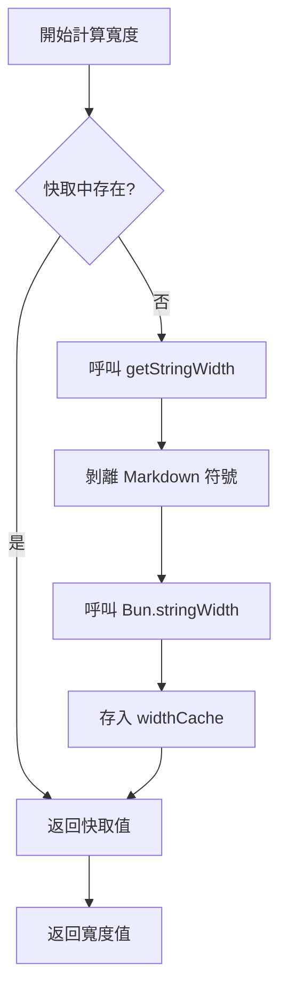

# 技術細節：快取機制與效能優化

## 學完你能做什麼

- 理解外掛的快取機制如何提升效能
- 掌握 widthCache 的資料結構和使用方式
- 了解快取自動清理的觸發條件
- 知道如何分析效能優化的效果

## 你現在的困境

你可能想知道：

> 外掛是如何快速計算表格寬度的？為什麼處理大表格時依然流暢？快取機制是如何設計的？

本課深入分析外掛的內部實作，帶你理解快取機制的設計思路和效能優化策略。

## 核心思路

### 為什麼要用快取？

在格式化 Markdown 表格時，外掛需要計算每個儲存格的**顯示寬度**（display width）。這個計算涉及：

1. **剝離 Markdown 符號**：如 `**粗體**`、`*斜體*`、`~~刪除線~~`
2. **保護行內程式碼**：`` `程式碼` `` 內的 Markdown 符號保持不變
3. **呼叫 `Bun.stringWidth()`**：計算 Unicode 字元的顯示寬度（包括 Emoji、中文字元）

**問題是**：同一個儲存格內容可能重複出現多次（如表頭列名），每次都重新計算這些邏輯會很慢。

**解決方案**：使用快取（Map）儲存「文字內容 → 顯示寬度」的對應，避免重複計算。

## 快取資料結構

外掛使用兩個全域變數管理快取：

### widthCache

```typescript
const widthCache = new Map<string, number>()
```

**用途**：快取字串的顯示寬度計算結果

**結構**：
- **Key**：儲存格的原始文字內容（包含所有 Markdown 語法）
- **Value**：計算後的顯示寬度（字元數）

**範例**：

| 原始文字（Key） | 顯示寬度（Value） | 說明 |
|--- | --- | ---|
| `**姓名**` | 4 | 剝離 `**` 後寬度為 4 |
| `*年齡*` | 4 | 剝離 `*` 後寬度為 4 |
| `` `status` `` | 8 | 程式碼區塊符號也被計入寬度 |
| `張三` | 4 | 中文字元寬度為 1 |

### cacheOperationCount

```typescript
let cacheOperationCount = 0
```

**用途**：記錄快取操作的次數，用於觸發自動清理

**清理閾值**：
- 操作數 > 100 次或
- 快取條目 > 1000 個

## 快取查詢流程

### calculateDisplayWidth 函數

當需要計算儲存格寬度時，外掛會呼叫 `calculateDisplayWidth()` 函數，執行以下流程：

<details>
<summary><strong>📖 查看完整程式碼</strong></summary>

```typescript
function calculateDisplayWidth(text: string): number {
  if (widthCache.has(text)) {
    return widthCache.get(text)!  // 快取命中，直接返回
  }

  const width = getStringWidth(text)  // 計算實際寬度
  widthCache.set(text, width)          // 存入快取
  return width
}
```

</details>

**流程圖**：



**步驟解析**：

| 步驟 | 操作 | 時間複雜度 |
|--- | --- | ---|
| 1 | 檢查 `widthCache.has(text)` | O(1) |
| 2 | 快取命中 → 直接返回 | O(1) |
| 3 | 快取未命中 → 計算寬度 | O(n) |
| 4 | 存入快取 | O(1) |

**關鍵點**：
- **快取命中時**：直接返回，無需任何計算（O(1)）
- **快取未命中時**：執行完整的寬度計算邏輯（O(n)）
- **儲存原始文字**：Key 是完整的 Markdown 文字，保證精確比對

## 快取清理機制

### 為什麼要清理快取？

快取雖然能提升效能，但會佔用記憶體。如果不清理：
- **記憶體佔用持續增長**：每次新的儲存格內容都會被快取
- **可能包含無用資料**：舊的表格內容可能不再需要

### 自動清理觸發條件

外掛在每次格式化完成後，會呼叫 `incrementOperationCount()` 更新操作計數：

<details>
<summary><strong>📖 查看清理程式碼</strong></summary>

```typescript
function incrementOperationCount() {
  cacheOperationCount++

  if (cacheOperationCount > 100 || widthCache.size > 1000) {
    cleanupCache()
  }
}

function cleanupCache() {
  widthCache.clear()
  cacheOperationCount = 0
}
```

</details>

**觸發條件**（滿足任意一個即觸發）：

| 條件 | 閾值 | 說明 |
|--- | --- | ---|
| 操作次數 | > 100 次格式化操作 | 避免頻繁觸發清理 |
| 快取條目 | > 1000 個儲存格 | 防止記憶體佔用過大 |

**清理策略**：
- **完全清空**：`widthCache.clear()` 刪除所有快取
- **重置計數**：`cacheOperationCount = 0`

::: info 清理時機

快取清理發生在**每次格式化完成後**，而不是格式化過程中。這樣不會打斷正在進行的格式化操作。

:::

## 效能優化效果

### 快取命中率分析

假設一個 5 欄 × 10 列的表格，其中：

- **重複內容**：表頭列名在分隔列和資料列重複出現 11 次
- **唯一內容**：每個儲存格的內容都不同

**快取效果**：

| 場景 | 不使用快取 | 使用快取 | 效能提升 |
|--- | --- | --- | ---|
| 5 欄 × 10 列（無重複） | 50 次計算 | 50 次計算 | 無 |
| 5 欄 × 10 列（表頭重複） | 50 次計算 | 10 次計算 + 40 次快取命中 | ~80% |

### 實際影響

**快取帶來的優勢**：

1. **減少計算開銷**：避免重複剝離 Markdown 符號和呼叫 `Bun.stringWidth()`
2. **降低 CPU 佔用**：`getStringWidth()` 涉及正則替換和 Unicode 計算，開銷較大
3. **提升回應速度**：對於包含大量重複儲存格的表格，效果更明顯

**範例場景**：

| 場景 | 快取效果 |
|--- | ---|
| AI 產生對比表格 | ✅ 效果顯著（多欄重複內容） |
| 簡單單列表格 | ⚪ 效果一般（內容唯一） |
| 表格嵌套 Markdown | ✅ 效果顯著（符號剝離開銷大） |

## 效能優化建議

::: tip 給開發者的建議

如果你需要進一步優化效能，可以考慮：

1. **調整快取閾值**：根據實際表格大小調整 `100` 次和 `1000` 條目的閾值
2. **LRU 快取**：使用最近最少使用（LRU）演算法替代完全清空策略
3. **效能監控**：新增日誌統計快取命中率，分析實際效果

:::

## 本課小結

外掛使用 `widthCache` 快取機制優化效能：

- **儲存結構**：`Map<string, number>` 對應原始文字到顯示寬度
- **查詢流程**：先查快取 → 未命中則計算並存入
- **清理機制**：操作數 > 100 或條目 > 1000 時自動清理
- **效能提升**：減少重複計算，降低 CPU 佔用

這一機制讓外掛在處理複雜表格時依然保持流暢，是效能優化的核心實作。

## 下一課預告

> 下一課我們學習 **[更新日誌：版本歷史與變更記錄](../../changelog/release-notes/)**。
>
> 你會學到：
> - 外掛的版本演進歷史
> - 新功能和修復記錄
> - 如何追蹤外掛的更新

---

## 附錄：原始碼參考

<details>
<summary><strong>點擊展開查看原始碼位置</strong></summary>

> 更新時間：2026-01-26

| 功能 | 檔案路徑 | 行號 |
|--- | --- | ---|
| widthCache 定義 | [`source/franlol/opencode-md-table-formatter/index.ts`](https://github.com/franlol/opencode-md-table-formatter/blob/main/index.ts#L6) | 6 |
| cacheOperationCount 定義 | [`source/franlol/opencode-md-table-formatter/index.ts`](https://github.com/franlol/opencode-md-table-formatter/blob/main/index.ts#L7) | 7 |
| calculateDisplayWidth 函數 | [`source/franlol/opencode-md-table-formatter/index.ts`](https://github.com/franlol/opencode-md-table-formatter/blob/main/index.ts#L151-L159) | 151-159 |
| incrementOperationCount 函數 | [`source/franlol/opencode-md-table-formatter/index.ts`](https://github.com/franlol/opencode-md-table-formatter/blob/main/index.ts#L219-L225) | 219-225 |
| cleanupCache 函數 | [`source/franlol/opencode-md-table-formatter/index.ts`](https://github.com/franlol/opencode-md-table-formatter/blob/main/index.ts#L227-L230) | 227-230 |

**關鍵常數**：
- `widthCache = new Map<string, number>()`：快取字串顯示寬度的 Map 結構
- `cacheOperationCount = 0`：快取操作計數器

**關鍵函數**：
- `calculateDisplayWidth(text: string): number`：計算顯示寬度（帶快取），先查快取再計算
- `incrementOperationCount(): void`：遞增操作計數，觸發條件清理
- `cleanupCache(): void`：清空 widthCache 和重置計數器

</details>
