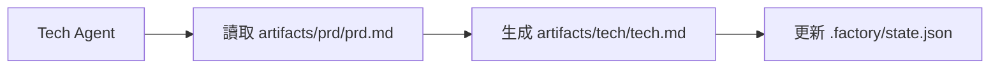

# 上下文最佳化：分會話執行

## 學完你能做什麼

- 使用 `factory continue` 指令在新會話中繼續流水線
- 理解每個階段獨享乾淨上下文的優勢
- 掌握大幅降低 Token 消耗的方法
- 支援中斷恢復，隨時暫停和繼續

## 你現在的困境

當你在 AI 助手（如 Claude Code）中執行完整的 7 階段流水線時，可能會遇到這些問題：

- **Token 越用越多**：隨著對話累積，上下文越來越長，每個階段都要載入之前所有階段的內容
- **成本越來越高**：長對話意味著更多的輸入 Token，費用直線上升
- **回應變慢**：上下文過長可能導致回應時間增加
- **難以恢復**：如果某個階段失敗，重新開始需要重新載入大量上下文

::: tip 核心問題
長對話的上下文累積是 AI 助手的固有特性，但我們可以透過「分會話執行」來規避這個問題。
:::

## 什麼時候用這一招

| 場景                     | 是否使用分會話 | 原因                           |
| ------------------------ | -------------- | ------------------------------ |
| 完整執行 7 階段流水線   | ✅ 強烈推薦     | 每個 Token 都很寶貴             |
| 僅執行 1-2 個階段       | ⚠️ 可選        | 上下文較短，不一定需要          |
| 除錯某個階段            | ⚠️ 可選        | 頻繁重試可能增加會話切換成本    |
| 長時間中斷後恢復        | ✅ 必須使用     | 避免載入過時的上下文            |

## 核心思路

Agent App Factory 支援**分會話執行**，其核心思想是：

**每個階段結束後，用新會話執行下一個階段。**

這樣做的好處：

1. **乾淨上下文**：每個階段只載入必要的輸入檔案，不依賴對話歷史
2. **節省 Token**：避免了將之前所有階段的內容重複傳遞給 AI
3. **可恢復性**：隨時可以中斷，之後用新會話繼續，不會遺失進度
4. **跨平台相容**：適用於所有 AI 助手（Claude Code、OpenCode、Cursor 等）

### 上下文隔離策略

為了實現分會話執行，Agent App Factory 採用了**上下文隔離策略**：

::: info 什麼是上下文隔離？
上下文隔離是指每個 Agent 只依賴檔案輸入，不依賴對話歷史。即使之前發生了什麼，Agent 也只從指定的輸入檔案讀取資訊。
:::

每個 Agent 執行時：

- ✅ **只讀取** `pipeline.yaml` 中定義的 `inputs` 檔案
- ❌ **不使用** 對話歷史中的任何「記憶」
- ❌ **不假設** 自己知道之前階段發生了什麼

例如，Tech Agent 執行時：



Tech Agent 只關心 `artifacts/prd/prd.md`，不會去想「使用者之前說想做什麼應用」，所有資訊都來自輸入檔案。

### 狀態恢復機制

當你執行 `factory continue` 時，系統會：

1. 讀取 `.factory/state.json` 取得目前進度
2. 讀取 `.factory/pipeline.yaml` 確定下一個階段
3. **僅載入該階段所需的輸入檔案**
4. 啟動新的 AI 助手視窗繼續執行

狀態檔案（`.factory/state.json`）是整個系統的「記憶中心」：

```json
{
  "version": 1,
  "status": "waiting_for_confirmation",
  "current_stage": "tech",
  "completed_stages": ["bootstrap", "prd"],
  "last_updated": "2026-01-29T12:00:00Z"
}
```

每個階段完成後，狀態都會更新到這個檔案中。新會話啟動時，只要讀取這個檔案就能知道目前在哪裡。

## 🎒 開始前的準備

::: warning 前置檢查
在開始本教程前，請確保：

- [ ] 已完成 [快速開始](../../start/getting-started/) 並初始化了一個 Factory 專案
- [ ] 已了解 [7 階段流水線概覽](../../start/pipeline-overview/)
- [ ] 已安裝 Claude Code（或其他 AI 助手）

如果還未完成，請先完成這些前置課程。
:::

## 跟我做

讓我們透過一個實際場景來學習如何使用 `factory continue` 指令。

### 場景設定

假設你正在執行一個 7 階段流水線，目前已經完成了 `bootstrap` 和 `prd` 階段，正在 `ui` 階段等待確認。

### 第 1 步：在檢查點選擇「新建會話繼續」

當某個階段完成後，Sisyphus 排程器會顯示一個選項表格：

```
✓ ui 完成！

生成的產物：
- artifacts/ui/ui.schema.yaml
- artifacts/ui/preview.web/index.html
- artifacts/ui/preview.web/styles.css
- artifacts/ui/preview.web/app.js

┌─────────────────────────────────────────────────────────────┐
│  📋 請選擇下一步操作                                         │
│  輸入選項數字（1-5），然後按 Enter 鍵確認                    │
└─────────────────────────────────────────────────────────────┘

┌──────┬──────────────────────────────────────────────────────┐
│ 選項 │ 說明                                                  │
├──────┼──────────────────────────────────────────────────────┤
│  1   │ 繼續下一階段（同一會話）                               │
│      │ 我將繼續執行 tech 階段                                 │
├──────┼──────────────────────────────────────────────────────┤
│  2   │ 新建會話繼續 ⭐ 推薦選項，節省 Token                   │
│      │ 在新的命令列視窗中執行：factory continue               │
│      │ （會自動啟動新的 Claude Code 視窗並繼續流水線）        │
├──────┼──────────────────────────────────────────────────────┤
│  3   │ 重跑該階段                                             │
│      │ 重新執行 ui 階段                                       │
├──────┼──────────────────────────────────────────────────────┤
│  4   │ 修改產物後重新執行                                     │
│      │ 修改 artifacts/prd/prd.md 後重新執行                   │
├──────┼──────────────────────────────────────────────────────┤
│  5   │ 暫停流水線                                             │
│      │ 儲存目前進度，稍後繼續                                 │
└──────┴──────────────────────────────────────────────────────┘

💡 提示：輸入 1-5 之間的數字，然後按 Enter 鍵確認您的選擇
```

**你應該看到**：
- 選項 2 被標記為「⭐ 推薦選項，節省 Token」

在目前會話中，我們可以選擇選項 5（暫停流水線），然後在新的命令列視窗中執行 `factory continue`。

**為什麼**
- 選項 1 是「繼續下一階段（同一會話）」，這會在目前會話中繼續，上下文會累積
- 選項 2 是「新建會話繼續」，這會用新的乾淨上下文執行下一階段，**節省 Token**
- 選項 5 是「暫停流水線」，這會儲存目前進度，之後可以用 `factory continue` 恢復

### 第 2 步：在新命令列視窗執行 `factory continue`

開啟一個新的終端機視窗（或分頁），進入你的專案目錄，然後執行：

```bash
factory continue
```

**你應該看到**：

```
Agent Factory - Continue in New Session

Pipeline Status:
───────────────────────────────────────
Project: my-awesome-app
Status: Waiting
Current Stage: tech
Completed: bootstrap, prd

Starting new Claude Code session...
✓ 新 Claude Code 視窗已啟動
  (Please wait for the window to open)
```

**發生了什麼**：

1. `factory continue` 指令讀取了 `.factory/state.json`，知道目前狀態
2. 顯示了目前專案的狀態資訊
3. 自動啟動了新的 Claude Code 視窗，並傳遞了「請繼續執行流水線」的指令
4. 新視窗會自動從 `tech` 階段繼續執行

### 第 3 步：在新視窗中繼續執行

新的 Claude Code 視窗啟動後，你會看到一個新的對話，但是狀態是從之前儲存的檢查點恢復的。

在新的會話中，Agent 會：

1. 讀取 `.factory/state.json` 取得目前階段
2. 讀取 `.factory/pipeline.yaml` 確定該階段的輸入和輸出
3. **僅載入該階段所需的輸入檔案**（例如 `artifacts/prd/prd.md`）
4. 執行該階段的任務

**關鍵點**：
- 新會話中沒有之前階段的對話歷史
- Agent 只從輸入檔案讀取資訊，不依賴「記憶」
- 這就是**上下文隔離**的體現

### 第 4 步：驗證上下文隔離

為了驗證上下文隔離是否生效，你可以嘗試在新會話中詢問 Agent：

「你知道 bootstrap 階段做了什麼嗎？」

如果上下文隔離生效，Agent 會說類似這樣的話：

「我需要先查看相關檔案來了解之前的工作。讓我讀取一下...」

然後它會嘗試讀取 `input/idea.md` 或其他檔案來取得資訊，而不是直接從對話歷史中「回憶」。

**檢查點 ✅**
- 新會話啟動成功
- 顯示了正確的專案狀態
- Agent 只依賴輸入檔案，不依賴對話歷史

### 第 5 步：繼續執行剩餘階段

每個階段完成後，你都可以選擇：

- 在目前會話中繼續（選項 1）- 適用於短流程
- **新建會話繼續（選項 2）** - **推薦，節省 Token**
- 暫停流水線（選項 5）- 之後再執行 `factory continue`

對於完整的 7 階段流水線，建議每個階段都使用「新建會話繼續」，這樣：

```
bootstrap (會話 1) → prd (會話 2) → ui (會話 3) → tech (會話 4)
→ code (會話 5) → validation (會話 6) → preview (會話 7)
```

每個會話都是乾淨的，不需要載入之前所有階段的內容。

## 踩坑提醒

### 坑 1：忘記執行 `factory continue`

**錯誤做法**：
- 在舊會話中直接開始下一階段
- 或在新視窗中直接開啟 Claude Code 而不執行 `factory continue`

**正確做法**：
- 總是使用 `factory continue` 指令啟動新會話
- 該指令會自動讀取狀態並傳遞正確的指令

### 坑 2：在新會話中重複載入歷史檔案

**錯誤做法**：
- 在新會話中手動要求 AI 讀取之前階段的產物
- 認為 AI 應該「知道」之前發生了什麼

**正確做法**：
- 相信上下文隔離機制，Agent 會自動從輸入檔案讀取資訊
- 只提供該階段需要的輸入檔案

### 坑 3：跨專案使用 `factory continue`

**錯誤做法**：
- 在專案 A 中執行 `factory continue`，但目前目錄是專案 B

**正確做法**：
- `factory continue` 會檢查目前目錄是否為 Factory 專案
- 如果不是，會提示需要先執行 `factory init`

### 坑 4：修改產物後未使用 `factory continue`

**場景**：
- 你在某個階段完成後，手動修改了產物（如修改了 PRD）
- 想繼續執行下一階段

**正確做法**：
- 執行 `factory run`（會從指定階段重新開始）
- 或執行 `factory continue`（會從目前檢查點繼續）
- 不要直接在舊會話中繼續，因為上下文可能不一致

## 本課小結

本課學習了如何使用 `factory continue` 指令進行分會話執行：

### 核心要點

1. **分會話執行**：每個階段完成後，用新會話執行下一階段
2. **上下文隔離**：Agent 只依賴輸入檔案，不依賴對話歷史
3. **狀態恢復**：`.factory/state.json` 記錄目前進度，新會話可以恢復
4. **節省 Token**：避免載入過長的上下文，大幅降低成本

### 指令速查

| 指令             | 作用                         | 使用場景           |
| ---------------- | ---------------------------- | ------------------ |
| `factory continue` | 新建會話繼續執行流水線       | 每個階段完成後     |
| `factory run`      | 在目前會話中執行流水線       | 首次執行或除錯     |
| `factory status`   | 查看目前專案狀態             | 了解進度           |

### 最佳實踐

- ✅ 完整執行 7 階段流水線時，每個階段都使用 `factory continue`
- ✅ 在檢查點選擇「新建會話繼續」（選項 2）
- ✅ 相信上下文隔離機制，不要手動載入歷史檔案
- ✅ 使用 `factory status` 檢查專案進度

## 下一課預告

> 下一課我們學習 **[權限與安全機制](../security-permissions/)**。
>
> 你會學到：
> - 能力邊界矩陣如何防止 Agent 越權
> - 越權處理機制和不可信產物隔離
> - 安全檢查點和權限校驗流程
> - 如何設定 Claude Code 的權限檔案

這節課將幫助你理解 Agent App Factory 的安全機制，確保每個 Agent 只在授權目錄中讀寫檔案。

---

## 附錄：原始碼參考

<details>
<summary><strong>點擊展開查看原始碼位置</strong></summary>

> 更新時間：2026-01-29

| 功能                 | 檔案路徑                                                                                                       | 行號    |
| -------------------- | -------------------------------------------------------------------------------------------------------------- | ------- |
| factory continue 指令 | [`cli/commands/continue.js`](https://github.com/hyz1992/agent-app-factory/blob/main/cli/commands/continue.js) | 1-144   |
| 排程器上下文最佳化    | [`agents/orchestrator.checkpoint.md`](https://github.com/hyz1992/agent-app-factory/blob/main/agents/orchestrator.checkpoint.md) | 113-154  |
| 上下文隔離策略      | [`policies/context-isolation.md`](https://github.com/hyz1992/agent-app-factory/blob/main/policies/context-isolation.md) | 1-64    |

**關鍵函式**：
- `launchClaudeCode(projectDir, nextStage, completedStages)`：啟動新的 Claude Code 視窗
- `commandExists(cmd)`：檢查指令是否可用
- `module.exports(projectDir)`：`factory continue` 指令的主函式

**關鍵常數**：
- `state.json`：狀態檔案路徑（`.factory/state.json`）
- `pipeline.yaml`：流水線定義檔案路徑（`.factory/pipeline.yaml`）
- `config.yaml`：專案設定檔案路徑（`.factory/config.yaml`）

**關鍵業務規則**：
- BR-6-1：每階段獨享乾淨上下文
- BR-6-2：使用 `factory continue` 指令繼續
- BR-6-3：僅載入目前階段所需檔案

</details>
