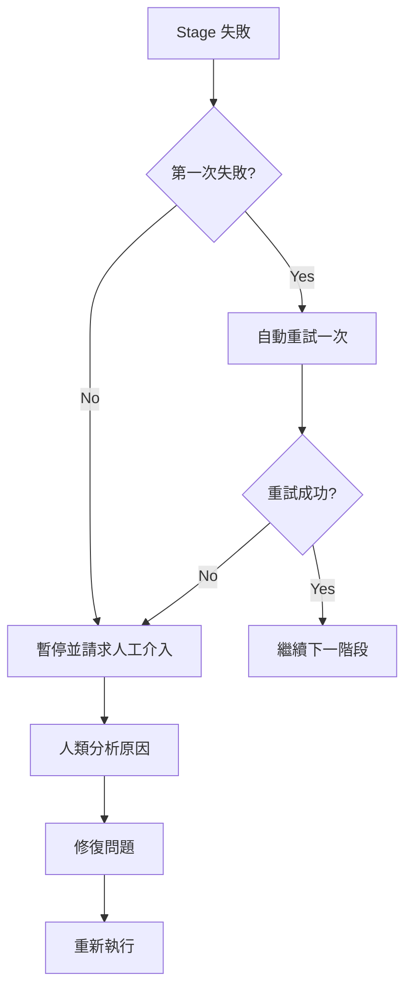
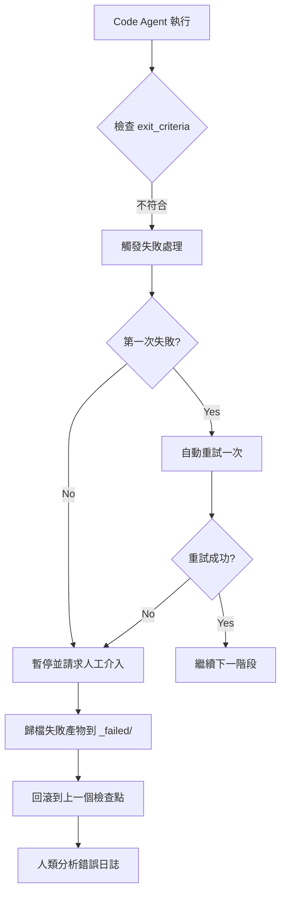
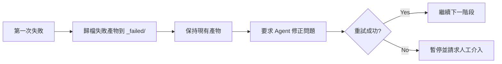
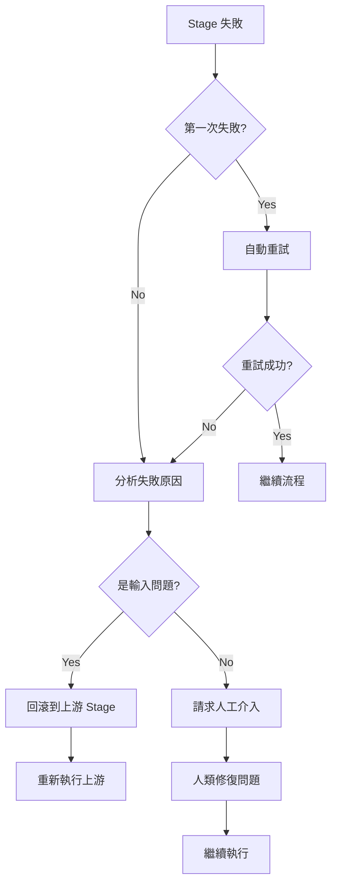

# 失敗處理與回滾：智慧容錯與錯誤恢復

## 學完你能做什麼

- **識別失敗類型**：快速判斷輸出缺失、內容不符、越權寫入等失敗原因
- **理解重試機制**：掌握自動重試一次的策略和失敗歸檔規則
- **執行回滾操作**：學會回滾到最近成功檢查點，恢復穩定狀態
- **人工介入處理**：知道何時需要人工介入，如何分析失敗原因並修復
- **解讀錯誤日誌**：看懂 `pipeline/error.log` 的錯誤報告，快速定位問題

## 你現在的困境

流水線執行時，你最擔心的是：

- **失敗了怎麼辦**：某個階段報錯了，是重試還是從頭開始？
- **資料污染了**：失敗產物會影響後續階段嗎？會被清理嗎？
- **怎麼回滾**：想回到上一個成功狀態，怎麼做？
- **人工介入**：連續失敗了，需要我做什麼？怎麼看日誌？

失敗處理機制就是為了解決這些問題——它定義了識別失敗、自動重試、歸檔失敗產物、回滾到檢查點和人工介入的完整流程。

## 什麼時候用這一招

當流水線出現以下情況時：

- **階段失敗**：Agent 執行失敗，輸出檔案缺失或不符合預期
- **越權操作**：Agent 寫入了未授權目錄，觸發安全檢查
- **連續失敗**：同一階段失敗兩次，需要人工介入分析
- **需要回滾**：想回到之前的成功狀態重新開始
- **日誌分析**：需要查看詳細的錯誤報告和堆疊資訊

## 核心思路

失敗處理策略由 Sisyphus 調度器統一執行，它像一位**容錯工程師**，在流水線出錯時自動處理或請求人工介入。

### 失敗定義

以下情況被視為 Stage 失敗：

| 失敗類型 | 症狀 | 程式碼位置 |
|---------|------|----------|
| **輸出缺失** | `pipeline.yaml` 指定的輸出檔案不存在或命名不符 | `failure.policy.md:9` |
| **不符合 exit_criteria** | 輸出內容未滿足 `pipeline.yaml` 中的退出條件 | `failure.policy.md:10` |
| **越權寫入** | Agent 向未授權的目錄或檔案寫入內容 | `failure.policy.md:11` |
| **其他異常** | 腳本錯誤、無法讀取輸入等導致無法完成任務 | `failure.policy.md:12` |

### 重試機制



**重試規則**（`failure.policy.md:16-18`）：

- 每个 Stage 預設允許 **自動重試一次**
- 重試時，調度器要求 Agent 在保持現有產物的基礎上修正問題，而非完全重做
- 若第二次嘗試仍然失敗，調度器必須暫停流水線並進入人工介入流程

### 回滾與存檔

**失敗歸檔**（`failure.policy.md:22-23`）：

```bash
# 失敗產物移動到 _failed/ 目錄
mv artifacts/<stage>/ artifacts/_failed/<stage-id>/attempt-1/
mv artifacts/<stage>/ artifacts/_failed/<stage-id>/attempt-2/
```

**回滾策略**（`failure.policy.md:23`）：

- 調度器回滾到最近一個成功的檢查點
- 從該 Stage 重新開始執行
- 確保上下遊產物一致，避免資料污染

### 人工介入

**介入時機**（`failure.policy.md:27`）：

- 同一 Stage 連續失敗兩次後
- 檢測到越權寫入時

**介入流程**（`failure.policy.md:27-29`）：

1. 調度器暫停執行並報告失敗原因
2. 人類檢查輸入、設定或技能是否存在問題
3. 人類修改輸入檔案、調整技能或修改參數
4. 繼續執行剩餘流程

::: warning 調度器約束
調度器不得在未得到人類確認的情況下跳過失敗階段或修改輸出。
:::

## 跟我做

### 第 1 步：認識失敗處理流程

當你執行流水線時，如果某個階段失敗，Sisyphus 調度器會自動啟動失敗處理流程。

**範例場景**：Code 階段失敗



### 第 2 步：查看錯誤日誌

失敗時，調度器會記錄詳細的錯誤資訊到 `pipeline/error.log`。

**錯誤日誌格式**（`failure.policy.md:166-200`）：

```bash
cat pipeline/error.log
```

**你應該看到**：

```log
============================================
ERROR REPORT
============================================
Timestamp: 2026-01-29T10:30:00Z
Stage: code
Attempt: 2/2
Status: FAILED

Error Type: TypeScript Compilation Error
Error Message: Cannot find module '@prisma/client'

Stack Trace:
  at Object.<anonymous> (src/lib/prisma.ts:1:1)
  at Module._compile (node:internal/modules/cjs/loader:1198:14)

Exit Criteria Failed:
  - [ ] 後端可啟動且無重大錯誤 (FAILED)
  - [x] 客戶端可渲染並存取
  - [x] 未引入額外的認證或無關功能

Failed Artifacts Moved To:
  artifacts/_failed/code/attempt-2/

Recommended Action:
  1. 檢查 package.json 是否包含 @prisma/client
  2. 執行 npx prisma generate 生成客戶端
  3. 重試 Code 階段

============================================
```

**錯誤日誌解讀**：

| 欄位 | 說明 | 範例 |
|------|------|------|
| **Timestamp** | 失敗發生時間 | 2026-01-29T10:30:00Z |
| **Stage** | 失敗的階段 | code |
| **Attempt** | 重試次數 | 2/2（第二次失敗） |
| **Status** | 當前狀態 | FAILED |
| **Error Type** | 錯誤類型 | TypeScript Compilation Error |
| **Error Message** | 錯誤描述 | Cannot find module '@prisma/client' |
| **Stack Trace** | 堆疊資訊 | src/lib/prisma.ts:1:1 |
| **Exit Criteria Failed** | 未通過的退出條件 | 後端可啟動且無重大錯誤 (FAILED) |
| **Failed Artifacts Moved To** | 失敗產物歸檔位置 | artifacts/_failed/code/attempt-2/ |
| **Recommended Action** | 推薦的修復步驟 | 1. 檢查 package.json... |

### 第 3 步：理解重試機制

當第一次失敗時，Sisyphus 會自動觸發重試。

**重試流程**（`failure.policy.md:16-18`）：



**重要特性**：

- **增量修復**：重試時，調度器要求 Agent 在現有產物基礎上修正問題，而不是完全重做
- **失敗歸檔**：每次失敗的產物都會移動到 `artifacts/_failed/<stage-id>/attempt-N/`，便於對比分析
- **最多一次**：預設只允許自動重試一次，避免無限迴圈

### 第 4 步：查看失敗歸檔

當階段失敗時，所有失敗產物都會被歸檔到 `artifacts/_failed/` 目錄。

**目錄結構**：

```bash
artifacts/
├── _failed/
│   ├── code/
│   │   ├── attempt-1/
│   │   │   ├── backend/
│   │   │   └── client/
│   │   └── attempt-2/
│   │       ├── backend/
│   │       └── client/
│   ├── ui/
│   │   └── attempt-1/
│   └── prd/
│       └── attempt-1/
```

**歸檔目錄命名規則**：

- `artifacts/_failed/<stage-id>/attempt-N/`
  - `<stage-id>`：失敗的階段名稱（如 `code`、`ui`、`prd`）
  - `attempt-N`：嘗試次數（1 表示第一次失敗，2 表示第二次失敗）

**為什麼需要歸檔**：

- **避免污染**：失敗產物不會影響後續階段
- **便於分析**：可以對比不同嘗試的差異，找出問題根源
- **證據保留**：保留失敗產物供後續除錯

### 第 5 步：執行回滾操作

當需要回到之前的狀態時，可以使用回滾功能。

**回滾流程**（`failure.policy.md:23`）：

```bash
# 手動回滾到上一個檢查點
factory run <stage-id>

# 例如：回滾到 tech 階段重新執行
factory run tech
```

**回滾規則**：

- **回滾目標**：回滾到最近一個成功的檢查點
- **重置狀態**：清空當前階段的產物和失敗歸檔
- **重新執行**：從目標階段重新開始執行

**回滾範例**：

假設你在 Code 階段失敗兩次，想回到 Tech 階段重新設計架構：

```bash
# 1. 回滾到 tech 階段
factory run tech

# 2. AI 助手會重新執行 Tech Agent
# 3. 重新生成 artifacts/tech/ 和 artifacts/backend/prisma/
# 4. 然後繼續執行 Code 階段
```

### 第 6 步：人工介入處理

當連續失敗兩次後，Sisyphus 會暫停流水線並請求人工介入。

**介入決策樹**（`failure.policy.md:204-236`）：



**人工介入檢查清單**（`failure.policy.md:240-263`）：

#### 環境檢查

- [ ] Node.js 版本 >= 18
- [ ] npm 版本 >= 9
- [ ] 磁碟空間充足
- [ ] 網路連線正常（npm 下載）

#### 狀態檢查

- [ ] `.factory/state.json` 狀態正確
- [ ] 上游 Stage 產物完整
- [ ] 失敗產物已歸檔到 `_failed/`

#### 修復確認

- [ ] 失敗原因已明確
- [ ] 修復方案已實施
- [ ] 相關設定已更新

#### 恢復執行

- [ ] 從失敗的 Stage 重新開始
- [ ] 監控執行日誌
- [ ] 驗證輸出產物

### 第 7 步：常見失敗場景處理

不同的階段有不同的常見失敗場景，以下是處理方案。

#### 7.1 Bootstrap 階段失敗

**常見錯誤**（`failure.policy.md:35-48`）：

| 錯誤類型 | 症狀 | 原因 | 處理方案 |
|---------|------|------|----------|
| **輸出缺失** | `input/idea.md` 不存在 | Agent 未正確寫入檔案 | 重試，檢查寫入路徑 |
| **內容不完整** | idea.md 缺少關鍵章節 | 使用者輸入資訊不足 | 暫停，請求使用者補充資訊 |
| **格式錯誤** | 不符合範本結構 | Agent 未遵循範本 | 重試，強調範本要求 |

**處理流程**：

```bash
# 1. 檢查 input/ 目錄是否存在
ls -la input/

# 2. 如果不存在，建立目錄
mkdir -p input/

# 3. 重試 Bootstrap 階段
factory run bootstrap
```

#### 7.2 PRD 階段失敗

**常見錯誤**（`failure.policy.md:50-65`）：

| 錯誤類型 | 症狀 | 原因 | 處理方案 |
|---------|------|------|----------|
| **包含技術細節** | PRD 出現技術棧描述 | Agent 越界 | 重試，強調職責邊界 |
| **功能過多** | Must Have > 7 個 | 範圍蔓延 | 重試，要求精簡到 MVP |
| **使用者描述模糊** | 「所有人」、「大部分使用者」 | 未具體化 | 重試，要求具體使用者畫像 |
| **缺少非目標** | Non-Goals 為空 | 未明確邊界 | 重試，要求列出非目標 |

**處理流程**：

```bash
# 1. 驗證 PRD 不包含技術關鍵字
grep -E "(React|API|資料庫)" artifacts/prd/prd.md

# 2. 驗證 Must Have 功能數量 ≤ 7
grep -A 100 "Must Have" artifacts/prd/prd.md | wc -l

# 3. 重試時提供具體的修正要求
factory run prd
```

#### 7.3 UI 階段失敗

**常見錯誤**（`failure.policy.md:67-82`）：

| 錯誤類型 | 症狀 | 原因 | 處理方案 |
|---------|------|------|----------|
| **頁面超限** | 頁面數量 > 8 | 範圍蔓延 | 重試，要求精簡頁面 |
| **預覽無法開啟** | HTML 檔案損毀 | 生成錯誤 | 重試，檢查 HTML 語法 |
| **使用 AI 風格** | Inter 字型 + 紫色漸層 | 未遵循審美指南 | 重試，要求選擇鮮明審美 |
| **Schema 無效** | YAML 解析失敗 | 語法錯誤 | 重試，驗證 YAML 語法 |

**處理流程**：

```bash
# 1. 統計 ui.schema.yaml 中的頁面數量
grep -c "page:" artifacts/ui/ui.schema.yaml

# 2. 嘗試在瀏覽器中開啟預覽
open artifacts/ui/preview.web/index.html

# 3. 驗證 YAML 語法
npx js-yaml artifacts/ui/ui.schema.yaml

# 4. 檢查是否使用禁止的 AI 風格元素
grep -E "(Inter|purple|gradient)" artifacts/ui/ui.schema.yaml
```

#### 7.4 Tech 階段失敗

**常見錯誤**（`failure.policy.md:84-99`）：

| 錯誤類型 | 症狀 | 原因 | 處理方案 |
|---------|------|------|----------|
| **Prisma 語法錯誤** | schema.prisma 無效 | 語法問題 | 重試，執行 prisma validate |
| **過度設計** | 引入微服務/快取 | 違反 MVP 原則 | 重試，要求簡化架構 |
| **資料模型過多** | 表數量 > 10 | 範圍蔓延 | 重試，精簡資料模型 |
| **缺少 API 定義** | tech.md 無端點列表 | 內容不完整 | 重試，要求補充 API |

**處理流程**：

```bash
# 1. 執行 Prisma 驗證
cd artifacts/backend
npx prisma validate

# 2. 檢查 tech.md 是否包含必要章節
grep -E "(API|端點|路由)" artifacts/tech/tech.md

# 3. 統計資料模型數量
grep -c "model " artifacts/backend/prisma/schema.prisma

# 4. 檢查是否引入非必要複雜技術
grep -E "(微服務|快取|佇列)" artifacts/tech/tech.md
```

#### 7.5 Code 階段失敗

**常見錯誤**（`failure.policy.md:101-131`）：

| 錯誤類型 | 症狀 | 原因 | 處理方案 |
|---------|------|------|----------|
| **相依性安裝失敗** | npm install 報錯 | 套件版本衝突 | 檢查 package.json，更新版本 |
| **TypeScript 錯誤** | tsc 編譯失敗 | 類型問題 | 修復類型錯誤，重試 |
| **缺少必要檔案** | 目錄結構不完整 | 生成遺漏 | 重試，檢查檔案清單 |
| **測試失敗** | npm test 失敗 | 程式碼邏輯錯誤 | 修復測試，重試 |
| **API 無法啟動** | 連接埠監聽失敗 | 設定問題 | 檢查環境變數設定 |

**處理流程**：

```bash
# 1. 執行相依性檢查
cd artifacts/backend
npm install --dry-run

# 2. 執行類型檢查
npx tsc --noEmit

# 3. 對照檔案清單檢查目錄結構
ls -la src/

# 4. 執行測試
npm test

# 5. 若以上全部通過，嘗試啟動服務
npm run dev
```

**常見相依性問題修復**（`failure.policy.md:120-131`）：

```bash
# 版本衝突
rm -rf node_modules package-lock.json
npm install

# Prisma 版本不匹配
npm install @prisma/client@latest prisma@latest

# React Native 相依性問題
cd artifacts/client
npx expo install --fix
```

#### 7.6 Validation 階段失敗

**常見錯誤**（`failure.policy.md:133-147`）：

| 錯誤類型 | 症狀 | 原因 | 處理方案 |
|---------|------|------|----------|
| **驗證報告不完整** | report.md 章節缺失 | Agent 未完成 | 重試 |
| **嚴重問題過多** | 錯誤數 > 10 | Code 階段品質差 | 回滾到 Code 階段 |
| **安全問題** | 檢測到硬編碼金鑰 | 安全違規 | 回滾，修復安全問題 |

**處理流程**：

```bash
# 1. 解析 report.md 確認所有章節存在
grep -E "(## 摘要|## 後端|## 前端|## 問題)" artifacts/validation/report.md

# 2. 統計嚴重問題數量
grep -c "嚴重問題" artifacts/validation/report.md

# 3. 若嚴重問題 > 10，建議回滾到 Code 階段
factory run code

# 4. 檢查安全掃描結果
grep -E "(金鑰|密碼|token)" artifacts/validation/report.md
```

#### 7.7 Preview 階段失敗

**常見錯誤**（`failure.policy.md:149-162`）：

| 錯誤類型 | 症狀 | 原因 | 處理方案 |
|---------|------|------|----------|
| **README 不完整** | 缺少安裝步驟 | 內容遺漏 | 重試，補充步驟 |
| **Docker 建置失敗** | Dockerfile 錯誤 | 設定問題 | 修復 Dockerfile |
| **部署設定缺失** | 無 docker-compose | 未生成 | 重試，要求生成設定 |

**處理流程**：

```bash
# 1. 檢查 README.md 包含所有必要章節
grep -E "(## 快速開始|## 安裝|## 執行)" artifacts/preview/README.md

# 2. 嘗試 docker build 驗證 Dockerfile
cd artifacts/preview
docker build -t test-app .

# 3. 檢查部署設定檔是否存在
ls -la docker-compose.yml .github/workflows/
```

## 檢查點 ✅

完成本課後，你應該：

- [ ] 理解失敗處理的 4 種類型（輸出缺失、內容不符、越權、異常）
- [ ] 掌握自動重試一次的機制
- [ ] 知道失敗產物歸檔到 `artifacts/_failed/`
- [ ] 能夠解讀 `pipeline/error.log` 錯誤報告
- [ ] 理解回滾到檢查點的流程
- [ ] 知道何時需要人工介入
- [ ] 掌握常見失敗場景的處理方案

## 踩坑提醒

### 問題 1：重試時產物被完全重做

**症狀**：第二次重試時，所有產物都被重新生成，而不是在現有基礎上修正。

**原因**：Agent 沒有遵循「在現有產物基礎上修正」的規則。

**解決方案**：

在重試時，明確告知 Agent：

```markdown
請在現有產物基礎上修正問題，不要完全重做。
保持已有的正確部分，只修改不符合 exit_criteria 的部分。
```

### 問題 2：失敗產物污染後續階段

**症狀**：失敗產物沒有歸檔，影響了後續階段的執行。

**原因**：歸檔失敗產物的步驟未執行。

**解決方案**：

手動歸檔失敗產物：

```bash
# 將失敗產物移動到 _failed/ 目錄
mv artifacts/<stage-id> artifacts/_failed/<stage-id>/attempt-1/

# 然後重新執行該階段
factory run <stage-id>
```

### 問題 3：回滾後產物不一致

**症狀**：回滾到上游階段後，產物與之前不一致。

**原因**：回滾時只重置了當前階段，沒有清空相依的下游產物。

**解決方案**：

完整回滾流程：

```bash
# 1. 回滾到目標階段
factory run <target-stage>

# 2. 清空所有下游階段產物
rm -rf artifacts/<downstream-stage-1>/
rm -rf artifacts/<downstream-stage-2>/

# 3. 重新執行
factory run
```

### 問題 4：人工介入後繼續執行失敗

**症狀**：修復問題後繼續執行，仍然失敗。

**原因**：修復方案不完整或未儲存修改。

**解決方案**：

人工介入檢查清單：

```bash
# 1. 確認失敗原因已明確
cat pipeline/error.log

# 2. 確認修復方案已實施
# 檢查修改的檔案

# 3. 確認相關設定已更新
cat .factory/state.json

# 4. 重新執行
factory run <failed-stage>
```

### 問題 5：錯誤日誌不完整

**症狀**：`pipeline/error.log` 中缺少關鍵資訊。

**原因**：調度器未正確記錄錯誤日誌。

**解決方案**：

檢查日誌檔是否存在：

```bash
# 如果不存在，手動建立
mkdir -p pipeline
cat > pipeline/error.log << 'EOF'
ERROR REPORT
============================================
Timestamp: $(date -u +"%Y-%m-%dT%H:%M:%SZ")
Stage: <stage-id>
Attempt: 1/1
Status: FAILED

Error Type: Manual Debug
Error Message: Debug information needed

Stack Trace:
  (add stack trace if available)

Exit Criteria Failed:
  - [ ] exit-criteria-1
  - [ ] exit-criteria-2

Failed Artifacts Moved To:
  artifacts/_failed/<stage-id>/attempt-1/

Recommended Action:
  1. Describe the issue
  2. Provide fix steps
  3. Retry the stage

============================================
EOF
```

## 最佳實踐

### 1. 早期失敗

**原則**：盡早發現問題，避免在後續階段浪費時間。

**實踐**：

- 在 Bootstrap 階段驗證使用者輸入是否完整
- 在 PRD 階段檢查是否包含技術細節（違反職責邊界）
- 在 UI 階段驗證頁面數量是否合理

### 2. 詳細日誌

**原則**：記錄足夠的上下文資訊，便於排查問題。

**實踐**：

- 錯誤日誌包含時間戳記、階段、嘗試次數、錯誤類型、堆疊資訊
- 推薦修復步驟具體到檔名和行號
- 歸檔失敗產物便於對比分析

### 3. 原子操作

**原則**：每個階段的輸出應該是原子的，便於回滾。

**實踐**：

- 一次性生成所有產物檔案，而不是逐步寫入
- 如果中途失敗，不保留不完整的產物
- 歸檔整個階段的產物，而不是部分檔案

### 4. 保留證據

**原則**：失敗產物歸檔後再重試，便於對比分析。

**實踐**：

- 每次失敗都歸檔到 `attempt-N/` 子目錄
- 保留多次嘗試的產物，便於對比差異
- 使用 `git diff` 對比不同嘗試的差異

### 5. 漸進重試

**原則**：重試時提供更具體的指導，而非簡單重複。

**實踐**：

```markdown
# 第一次失敗
請生成 PRD 文件。

# 第二次重試（提供具體指導）
請在現有 PRD 基礎上修正以下問題：
1. 刪除所有技術細節（如 React、API 等）
2. 將 Must Have 功能數量從 10 個減少到 7 個
3. 為目標使用者新增具體畫像
4. 補充 Non-Goals 章節並明確邊界
```

## 本課小結

失敗處理機制是 AI App Factory 的容錯保障，它確保流水線在出錯時能夠自動恢復或請求人工介入。

**關鍵要點**：

1. **失敗定義**：輸出缺失、內容不符、越權寫入、其他異常
2. **重試機制**：每個階段允許自動重試一次，第二次失敗後請求人工介入
3. **失敗歸檔**：失敗產物移動到 `artifacts/_failed/<stage-id>/attempt-N/`
4. **回滾策略**：回滾到最近成功檢查點，確保上下遊產物一致
5. **人工介入**：連續失敗兩次後，分析原因、修復問題、重新執行
6. **錯誤日誌**：詳細的錯誤報告包含時間戳記、階段、錯誤類型、堆疊資訊、推薦修復步驟
7. **常見場景**：各階段都有特定的常見錯誤和處理方案

## 下一課預告

> 下一課我們學習 **[常見問題與故障排除](../../faq/troubleshooting/)**。
>
> 你會學到：
> - 初始化階段的常見問題
> - 執行過程中的故障排除
> - 部署相關的問題處理

---

## 附錄：原始碼參考

<details>
<summary><strong>點擊展開查看原始碼位置</strong></summary>

> 更新時間：2026-01-29

| 功能 | 檔案路徑 | 行號 |
|------|----------|------|
| 失敗策略定義 | [`source/hyz1992/agent-app-factory/policies/failure.policy.md`](https://github.com/hyz1992/agent-app-factory/blob/main/policies/failure.policy.md) | 1-276 |
| 調度器失敗處理 | [`source/hyz1992/agent-app-factory/agents/orchestrator.checkpoint.md`](https://github.com/hyz1992/agent-app-factory/blob/main/agents/orchestrator.checkpoint.md) | 38-46 |
| 能力邊界矩陣 | [`source/hyz1992/agent-app-factory/policies/capability.matrix.md`](https://github.com/hyz1992/agent-app-factory/blob/main/policies/capability.matrix.md) | 1-40 |

**失敗定義**（`failure.policy.md:5-13`）：
- 輸出缺失：`pipeline.yaml` 指定的輸出檔案不存在或命名不符
- 不符合 exit_criteria：輸出內容未滿足 `pipeline.yaml` 中該 Stage 的 `exit_criteria`
- 越權寫入：Agent 向未授權的目錄或檔案寫入內容
- 其他異常：腳本錯誤、無法讀取輸入等導致無法完成任務

**重試機制**（`failure.policy.md:16-18`）：
- 每个 Stage 預設允許自動重試一次
- 調度器應要求 Agent 在保持現有產物的基礎上修正問題，而非完全重做
- 若第二次嘗試仍然失敗，調度器必須暫停流水線並進入人工介入流程

**回滾與存檔**（`failure.policy.md:22-23`）：
- 失敗產物移動到 `artifacts/_failed/<stage-id>/` 目錄
- 回滾到最近一個成功的檢查點，從該 Stage 重新開始執行

**人工介入**（`failure.policy.md:27-29`）：
- 同一 Stage 連續失敗兩次時，調度器必須暫停執行並報告失敗原因
- 人類介入後，可以修改輸入檔案、調整技能或修改參數，再繼續執行剩餘流程
- 調度器不得在未得到人類確認的情況下跳過失敗階段或修改輸出

**錯誤日誌格式**（`failure.policy.md:166-200`）：
- Timestamp、Stage、Attempt、Status
- Error Type、Error Message、Stack Trace
- Exit Criteria Failed
- Failed Artifacts Moved To
- Recommended Action

**常見失敗場景**（`failure.policy.md:33-162`）：
- Bootstrap 階段：輸出缺失、內容不完整、格式錯誤
- PRD 階段：包含技術細節、功能過多、使用者描述模糊、缺少非目標
- UI 階段：頁面超限、預覽無法開啟、使用 AI 風格、Schema 無效
- Tech 階段：Prisma 語法錯誤、過度設計、資料模型過多、缺少 API 定義
- Code 階段：相依性安裝失敗、TypeScript 錯誤、缺少必要檔案、測試失敗、API 無法啟動
- Validation 階段：驗證報告不完整、嚴重問題過多、安全問題
- Preview 階段：README 不完整、Docker 建置失敗、部署設定缺失

**調度器失敗處理流程**（`orchestrator.checkpoint.md:38-46`）：
- 讀取 `policies/failure.policy.md`，按照策略執行
- 要求 Agent 在保持現有產物的基礎上修正問題並重新嘗試
- 失敗產物移動到 `artifacts/_failed/<stage-id>/` 目錄
- 連續失敗兩次後暫停流水線，報告失敗原因並等待人類介入

**越權處理**（`orchestrator.checkpoint.md:48-52`）：
- 檢查輸出路徑是否僅限於授權目錄
- 若發現越權寫入，將該產物移動到 `artifacts/_untrusted/<stage-id>/`
- 暫停執行並報告

**人工介入決策樹**（`failure.policy.md:204-236`）：
- 第一次失敗 → 自動重試 → 重試成功? → 繼續 / 第二次失敗
- 第二次失敗 → 分析失敗原因 → 是輸入問題? → 回滾到上游 Stage / 請求人工介入

**失敗恢復檢查清單**（`failure.policy.md:240-263`）：
- 環境檢查：Node.js 版本、npm 版本、磁碟空間、網路連線
- 狀態檢查：`.factory/state.json`、上游 Stage 產物、失敗產物歸檔
- 修復確認：失敗原因、修復方案、相關設定
- 恢復執行：從失敗 Stage 重新開始、監控日誌、驗證產物

**最佳實踐**（`failure.policy.md:267-274`）：
- 早期失敗：盡早發現問題，避免在後續 Stage 浪費時間
- 詳細日誌：記錄足夠的上下文資訊，便於排查問題
- 原子操作：每個 Stage 的輸出應該是原子的，便於回滾
- 保留證據：失敗產物歸檔後再重試，便於對比分析
- 漸進重試：重試時提供更具體的指導，而非簡單重複

</details>
