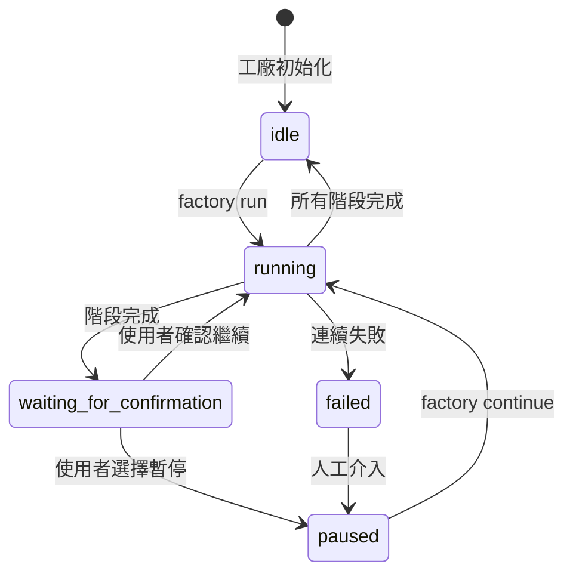
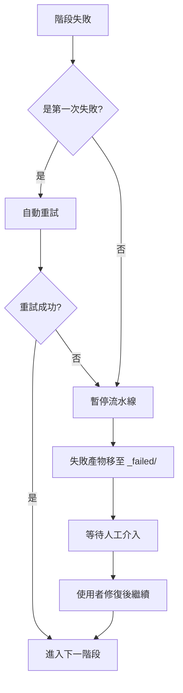

# Sisyphus 調度器詳解：流水線協調與狀態管理

## 學完你能做什麼

- 讀懂調度器如何協調 7 階段流水線執行
- 理解狀態機的工作原理和狀態轉換規則
- 掌握能力邊界矩陣的權限檢查機制
- 學會處理失敗場景（重試、回滾、人工介入）
- 使用 `factory continue` 指令優化 Token 消耗

## 你現在的困境

你已經執行過幾條流水線，但對這些問題可能還不太清楚：

- Sisyphus 到底做了什麼？它和其他 Agent 有什麼區別？
- 為什麼 Agent 只能在某些目錄讀寫，越權會發生什麼？
- 失敗後調度器怎麼處理？為什麼有時候自動重試，有時候需要人工介入？
- `factory continue` 指令為什麼能節省 Token？背後的機制是什麼？

如果你好奇這些問題，這章會幫你徹底搞懂。

## 什麼時候用這一招

當你需要：

- **調試流水線問題**：了解調度器在某個階段做了什麼，為什麼失敗
- **優化 Token 消耗**：使用 `factory continue` 在每個階段新建會話
- **擴展流水線**：添加新的 Agent 或修改現有邏輯
- **處理失敗場景**：理解為什麼某個階段失敗，以及如何恢復
- **檢查權限問題**：確認 Agent 為什麼無法存取某些檔案

## 核心思路

Sisyphus 調度器是整個 AI App Factory 的「指揮官」。

**記住這個類比**：

- 其他 Agent（bootstrap、prd、ui、tech、code、validation、preview）就像是執行任務的工人
- Sisyphus 是負責調度工人、檢查工作品質、處理異常的工頭

**Sisyphus 的獨特之處**：

| 特性 | Sisyphus | 其他 Agent |
| --- | --- | --- |
| **職責** | 協調、驗證、狀態管理 | 生成具體產物 |
| **產出** | 更新 state.json | 生成 PRD、程式碼、文件等 |
| **權限** | 讀寫 state.json | 讀寫特定 artifacts/ 子目錄 |
| **生成內容** | 不生成業務內容 | 生成具體的業務產物 |

**關鍵原則**：

1. **嚴格順序**：必須按 pipeline.yaml 定義執行，不能跳過或並行
2. **單階段執行**：同一時刻只能啟動一個 Agent
3. **職責分離**：Sisyphus 不修改業務產物，只負責協調和驗證
4. **品質把關**：每個階段完成後必須驗證產物符合 exit_criteria

## 狀態機模型

Sisyphus 以狀態機的方式執行整個流程。理解狀態機是掌握調度器的關鍵。

### 5 種狀態



### 狀態詳解

| 狀態 | 說明 | 觸發條件 |
| --- | --- | --- |
| **idle** | 等待啟動 | 專案初始化完成，或流水線全部完成 |
| **running** | 正在執行某個 Stage | factory run 或 factory continue 啟動後 |
| **waiting_for_confirmation** | 等待人工確認 | 當前 Stage 完成後，等待使用者選擇下一步 |
| **paused** | 人工暫停 | 使用者選擇暫停，或連續失敗後暫停 |
| **failed** | 檢測到未處理的失敗 | Agent 連續兩次失敗，或越權寫入 |

::: info 狀態檔案
所有狀態保存在 `.factory/state.json` 檔案中，Sisyphus 擁有唯一更新權限。
:::

### 狀態轉換範例

**場景 1：正常執行**

```
idle → running (factory run)
   ↓
waiting_for_confirmation (bootstrap 完成)
   ↓
running (使用者選擇繼續)
   ↓
waiting_for_confirmation (prd 完成)
   ↓
... (重複直到所有階段完成)
   ↓
idle
```

**場景 2：失敗恢復**

```
running → failed (code 階段連續兩次失敗)
   ↓
paused (人工介入修復程式碼)
   ↓
running (factory continue 重試 code)
   ↓
waiting_for_confirmation
```

## 能力邊界矩陣

### 為什麼需要權限控制？

想像一下：

- 如果 PRD Agent 修改了 UI Agent 生成的檔案，會導致什麼問題？
- 如果 Tech Agent 讀取了 Code Agent 生成的程式碼，會產生什麼後果？

**答案**：職責混亂，產物無法追溯，品質無法保證。

能力邊界矩陣透過限制每個 Agent 的讀寫權限，確保職責分離。

### 權限矩陣

| Agent | 可讀取目錄 | 可寫入目錄 | 說明 |
| --- | --- | --- | --- |
| **bootstrap** | 無 | `input/` | 僅在 `input/` 目錄建立或修改 `idea.md` |
| **prd** | `input/` | `artifacts/prd/` | 讀取想法檔案，生成 PRD |
| **ui** | `artifacts/prd/` | `artifacts/ui/` | 讀取 PRD，生成 UI Schema 與預覽 |
| **tech** | `artifacts/prd/` | `artifacts/tech/`, `artifacts/backend/prisma/` | 讀取 PRD，生成技術設計和資料模型 |
| **code** | `artifacts/ui/`, `artifacts/tech/`, `artifacts/backend/prisma/` | `artifacts/backend/`, `artifacts/client/` | 根據 UI 和技術設計生成程式碼 |
| **validation** | `artifacts/backend/`, `artifacts/client/` | `artifacts/validation/` | 驗證程式碼品質，生成驗證報告 |
| **preview** | `artifacts/backend/`, `artifacts/client/` | `artifacts/preview/` | 讀取已生成的程式碼，編寫示範說明 |

### 權限檢查流程

**執行前**：

1. Sisyphus 讀取 capability.matrix.md
2. 告知 Agent 允許的讀取和寫入目錄
3. Agent 必須在權限範圍內操作

**執行後**：

1. Sisyphus 掃描新建立或修改的檔案
2. 檢查是否在授權目錄範圍內
3. 如果發現越權，立即處理

### 越權處理機制

如果 Agent 寫入了未授權目錄：

1. **隔離產物**：將越權檔案移動到 `artifacts/_untrusted/<stage-id>/`
2. **記錄失敗**：將事件標記為失敗
3. **暫停流水線**：等待人工介入
4. **提供修復建議**：告訴使用者如何處理不可信檔案

**範例**：

```
⚠️  Unauthorized writes detected for stage "prd":
   - artifacts/ui/ui.schema.yaml

Files moved to quarantine: artifacts/_untrusted/prd

Please review these files before proceeding.
```

## 檢查點機制

每個階段完成後，Sisyphus 會暫停並等待人工確認。這就是檢查點機制。

### 檢查點的價值

- **品質控制**：人工驗證每個階段的產物
- **靈活控制**：可以隨時暫停、重試、跳過
- **便於調試**：問題可以在早期發現，避免累積到後期

### 檢查點輸出範本

每個階段完成後，Sisyphus 會按以下格式展示選項：

```
✓ prd 完成！

生成的產物：
- artifacts/prd/prd.md

┌─────────────────────────────────────────────────────────────┐
│  📋 請選擇下一步操作                                         │
│  輸入選項數字（1-5），然後按 Enter 鍵確認                    │
└─────────────────────────────────────────────────────────────┘

┌──────┬──────────────────────────────────────────────────────┐
│ 選項 │ 說明                                                  │
├──────┼──────────────────────────────────────────────────────┤
│  1   │ 繼續下一階段（同一會話）                               │
│      │ 我將繼續執行 ui 階段                                   │
├──────┼──────────────────────────────────────────────────────┤
│  2   │ 新建會話繼續 ⭐ 推薦選項，節省 Token                   │
│      │ 在新的終端機視窗中執行：factory continue               │
│      │ （會自動啟動新的 Claude Code 視窗並繼續流水線）        │
├──────┼──────────────────────────────────────────────────────┤
│  3   │ 重新執行該階段                                         │
│      │ 重新執行 prd 階段                                      │
├──────┼──────────────────────────────────────────────────────┤
│  4   │ 修改產物後重新執行                                     │
│      │ 修改 input/idea.md 後重新執行                         │
├──────┼──────────────────────────────────────────────────────┤
│  5   │ 暫停流水線                                             │
│      │ 儲存當前進度，稍後繼續                                 │
└──────┴──────────────────────────────────────────────────────┘

💡 提示：輸入 1-5 之間的數字，然後按 Enter 鍵確認您的選擇
```

::: tip 推薦做法
**選項 2（新建會話繼續）是最佳實踐**，原因見下一節「上下文優化」。
:::

## 失敗處理策略

當某個階段失敗時，Sisyphus 會按照預定義的策略處理。

### 失敗定義

**Sisyphus 認為失敗的情況**：

- 輸出檔案遺失（要求生成的檔案不存在）
- 輸出內容不符合 exit_criteria（例如 PRD 缺少使用者故事）
- Agent 越權寫入（寫入了未授權目錄）
- Agent 連續執行錯誤（腳本錯誤、無法讀取輸入）

### 失敗處理流程



### 自動重試機制

- **預設規則**：每個階段允許自動重試一次
- **重試策略**：在原有產物基礎上修正問題
- **失敗歸檔**：重試失敗後，產物移動到 `artifacts/_failed/<stage-id>/attempt-2/`

### 人工介入場景

**需要人工介入的情況**：

1. **連續失敗兩次**：自動重試後仍然失敗
2. **越權寫入**：Agent 寫入了未授權目錄
3. **腳本錯誤**：Agent 執行過程中拋出異常

**人工介入流程**：

1. Sisyphus 暫停流水線
2. 顯示失敗原因和錯誤資訊
3. 提供修復建議：
   - 修改輸入檔案
   - 調整 Agent 定義
   - 更新 Skill 檔案
4. 使用者修復後，執行 `factory continue` 繼續

## 上下文優化（節省 Token）

### 問題描述

如果你在同一個會話中連續執行 7 個階段，會面臨以下問題：

- **上下文累積**：AI 需要記住所有歷史對話
- **Token 浪費**：重複讀取歷史產物
- **成本增加**：長會話的 Token 消耗更大

### 解決方案：分會話執行

**核心思路**：每個階段在新的會話中執行。

```
會話 1: bootstrap
  ├─ 生成 input/idea.md
  ├─ 更新 state.json
  └─ 結束會話

會話 2: prd
  ├─ 讀取 state.json（只載入當前狀態）
  ├─ 讀取 input/idea.md（只讀取輸入檔案）
  ├─ 生成 artifacts/prd/prd.md
  ├─ 更新 state.json
  └─ 結束會話

會話 3: ui
  ├─ 讀取 state.json
  ├─ 讀取 artifacts/prd/prd.md
  ├─ 生成 artifacts/ui/ui.schema.yaml
  ├─ 更新 state.json
  └─ 結束會話
```

### 如何使用

**步驟 1**：在當前會話完成某個階段後，選擇「新建會話繼續」

```
┌──────┬──────────────────────────────────────────────────────┐
│ 選項 │ 說明                                                  │
├──────┼──────────────────────────────────────────────────────┤
│  2   │ 新建會話繼續 ⭐ 推薦選項，節省 Token                   │
│      │ 在新的終端機視窗中執行：factory continue               │
│      │ （會自動啟動新的 Claude Code 視窗並繼續流水線）        │
└──────┴──────────────────────────────────────────────────────┘
```

**步驟 2**：打開新的終端機視窗，執行：

```bash
factory continue
```

該指令會自動：
1. 讀取 `.factory/state.json` 獲取當前進度
2. 啟動新的 Claude Code 視窗
3. 從下一個待執行階段繼續

### 上下文隔離的好處

| 好處 | 說明 |
| --- | --- |
| **節省 Token** | 不需要載入歷史對話和產物 |
| **穩定性提升** | 避免上下文爆炸導致 AI 偏離目標 |
| **易於調試** | 每個階段獨立，問題更容易定位 |
| **中斷恢復** | 可以在任何檢查點中斷後恢復 |

## 強制技能使用驗證

某些階段要求使用特定的技能來保證輸出品質。Sisyphus 會驗證這些技能的使用情況。

### bootstrap 階段

**強制要求**：必須使用 `superpowers:brainstorm` 技能

**驗證方法**：

1. 檢查 Agent 輸出訊息中是否明確說明已使用該技能
2. 如果沒有提及，拒絕接受產物
3. 提示重新執行，明確強調必須使用該技能

**失敗提示**：

```
❌ 檢測到未使用 superpowers:brainstorm 技能
請使用該技能深入挖掘使用者想法後再生成 idea.md
```

### ui 階段

**強制要求**：必須使用 `ui-ux-pro-max` 技能

**驗證方法**：

1. 檢查 Agent 輸出訊息中是否明確說明已使用該技能
2. 檢查 `ui.schema.yaml` 中的設計系統配置
3. 如果設計系統配置非專業推薦，拒絕接受產物

**失敗提示**：

```
❌ 檢測到未使用 ui-ux-pro-max 技能
請使用該技能生成專業的設計系統和 UI 原型
```

### 連續失敗處理

如果某個階段連續兩次因為技能驗證失敗：

1. 暫停流水線
2. 請求人工介入
3. 檢查 Agent 定義和 Skill 配置

## 實戰演練：調試一個失敗的階段

假設 code 階段失敗了，我們來看看如何調試。

### 步驟 1：查看 state.json

```bash
cat .factory/state.json
```

**輸出範例**：

```json
{
  "version": "1.0",
  "status": "failed",
  "currentStage": "code",
  "completedStages": ["bootstrap", "prd", "ui", "tech"],
  "failedStages": ["code"],
  "stageHistory": [
    {
      "stageId": "code",
      "status": "failed",
      "startTime": "2026-01-29T10:00:00Z",
      "endTime": "2026-01-29T10:15:00Z",
      "attempts": 2,
      "error": "Exit criteria not met: Missing package.json"
    }
  ],
  "lastCheckpoint": "tech",
  "createdAt": "2026-01-29T09:00:00Z",
  "updatedAt": "2026-01-29T10:15:00Z"
}
```

**關鍵資訊**：

- `status: failed` - 流水線失敗
- `currentStage: code` - 當前失敗階段
- `completedStages` - 已完成 4 個階段
- `error: "Exit criteria not met: Missing package.json"` - 失敗原因

### 步驟 2：檢查失敗產物

```bash
ls -la artifacts/_failed/code/attempt-2/
```

**輸出範例**：

```
drwxr-xr-x  5 user  staff  160 Jan 29 10:15 .
drwxr-xr-x  3 user  staff   96 Jan 29 10:15 ..
-rw-r--r--  1 user  staff 2.1K Jan 29 10:15 server.ts
-rw-r--r--  1 user  staff 1.5K Jan 29 10:15 client.ts
```

**問題發現**：缺少 `package.json` 檔案！

### 步驟 3：查看 exit_criteria

```bash
cat .factory/pipeline.yaml | grep -A 10 'code:'
```

**輸出範例**：

```yaml
code:
  agent: agents/code.agent.md
  inputs:
    - artifacts/ui/ui.schema.yaml
    - artifacts/tech/tech.md
    - artifacts/backend/prisma/schema.prisma
  outputs:
    - artifacts/backend/package.json
    - artifacts/backend/server.ts
    - artifacts/client/package.json
    - artifacts/client/app.ts
  exit_criteria:
    - package.json 存在
    - 包含正確的依賴
    - 程式碼通過類型檢查
```

**確認問題**：Code Agent 沒有生成 `package.json`，違反了 exit_criteria。

### 步驟 4：修復問題

**方案 1**：修改 Code Agent 定義

```bash
nano .factory/agents/code.agent.md
```

在 Agent 定義中明確要求生成 `package.json`：

```markdown
## 必須生成的檔案

你必須生成以下檔案：
- artifacts/backend/package.json（包含正確的依賴）
- artifacts/backend/server.ts
- artifacts/client/package.json
- artifacts/client/app.ts
```

**方案 2**：修改輸入檔案

如果問題出在 Tech 設計階段，可以修改技術設計：

```bash
nano artifacts/tech/tech.md
```

補充明確的依賴說明。

### 步驟 5：繼續流水線

修復問題後，重新執行：

```bash
factory continue
```

Sisyphus 會：
1. 讀取 state.json（狀態為 failed）
2. 從 lastCheckpoint（tech）繼續
3. 重新執行 code 階段
4. 驗證產物是否符合 exit_criteria

## 本課小結

Sisyphus 調度器是 AI App Factory 的「指揮官」，負責：

- **流水線協調**：按順序執行 7 個階段
- **狀態管理**：維護 state.json，追蹤進度
- **權限檢查**：確保 Agent 只在授權目錄讀寫
- **失敗處理**：自動重試、歸檔失敗產物、等待人工介入
- **品質把關**：驗證每個階段的產物是否符合 exit_criteria

**核心原則**：

1. 嚴格按順序執行，不可跳過或並行
2. 同一時刻只能啟動一個 Agent
3. 所有產物必須寫入 artifacts/ 目錄
4. 每個階段完成後必須人工確認
5. 推薦使用 `factory continue` 節省 Token

**記住這個流程圖**：

```
factory run → 讀取 pipeline.yaml → 執行階段 → 驗證產物 → 檢查點確認
     ↑                                                                      │
     └──────────────────── factory continue（新會話）←──────────────────────┘
```

## 下一課預告

> 下一課我們學習 **[上下文優化：分會話執行](../context-optimization/)**。
>
> 你會學到：
> - 如何使用 `factory continue` 指令
> - 為什麼分會話執行能節省 Token
> - 如何在開發環境測試調度器
> - 常見調試技巧和日誌分析

## 附錄：原始碼參考

<details>
<summary><strong>點擊展開查看原始碼位置</strong></summary>

> 更新時間：2026-01-29

| 功能 | 檔案路徑 | 行號 |
| --- | --- | --- |
| 調度器核心定義 | [`source/hyz1992/agent-app-factory/agents/orchestrator.checkpoint.md`](https://github.com/hyz1992/agent-app-factory/blob/main/agents/orchestrator.checkpoint.md) | 全文 |
| 調度器實作指南 | [`source/hyz1992/agent-app-factory/agents/orchestrator-implementation.md`](https://github.com/hyz1992/agent-app-factory/blob/main/agents/orchestrator-implementation.md) | 全文 |
| 能力邊界矩陣 | [`source/hyz1992/agent-app-factory/policies/capability.matrix.md`](https://github.com/hyz1992/agent-app-factory/blob/main/policies/capability.matrix.md) | 全文 |
| 失敗處理策略 | [`source/hyz1992/agent-app-factory/policies/failure.policy.md`](https://github.com/hyz1992/agent-app-factory/blob/main/policies/failure.policy.md) | 全文 |
| 流水線定義 | [`source/hyz1992/agent-app-factory/pipeline.yaml`](https://github.com/hyz1992/agent-app-factory/blob/main/pipeline.yaml) | 全文 |

**關鍵函數**：

- `executeStage()` - 執行單個階段（第 117-189 行）
- `waitForCheckpointConfirmation()` - 等待檢查點確認（第 195-236 行）
- `handleStageFailure()` - 處理階段失敗（第 242-289 行）
- `checkUnauthorizedWrites()` - 檢查越權寫入（第 295-315 行）
- `getPermissions()` - 取得權限矩陣（第 429-467 行）

**關鍵常數**：

- 狀態枚舉：`idle`, `running`, `waiting_for_confirmation`, `paused`, `failed`
- 最大重試次數：2 次（第 269 行）
- 路徑解析優先級：`.factory/` → 根目錄（第 31-33 行）

</details>
