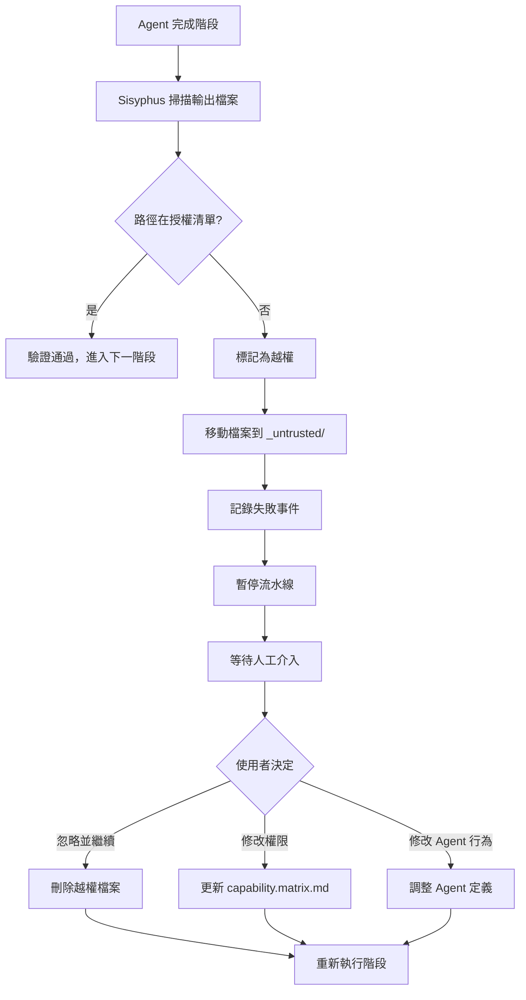

# 權限與安全機制：能力邊界矩陣與越權防護

## 學完你能做什麼

- 理解能力邊界矩陣的設計原理和權限隔離機制
- 學會設定 Claude Code 的權限檔案，避免使用 `--dangerously-skip-permissions`
- 掌握越權操作的處理流程和恢復方法
- 了解強制技能使用驗證的機制
- 能夠識別和修復權限相關的安全問題

## 你現在的困境

你可能遇到過這些情況：

- 不知道為什麼 Agent 無法存取某些檔案
- 執行 `factory run` 時總是被提示需要權限，直接用了 `--dangerously-skip-permissions` 跳過
- 不清楚 Agent 之間的權限邊界，擔心越權操作導致資料汙染
- 越權發生後不知道如何處理和恢復

如果這些問題讓你困擾，這章會幫你建立完整的權限和安全認知。

## 什麼時候用這一招

當你需要：

- **設定 Claude Code**：為 Factory 專案設定正確的權限檔案
- **除錯權限問題**：排查 Agent 為什麼無法讀寫特定檔案
- **處理越權異常**：恢復越權操作導致的中斷流水線
- **擴展 Agent**：新增新的 Agent 時定義其權限邊界
- **安全稽核**：檢查現有專案的權限設定是否合理

## 核心思路

AI App Factory 的安全機制基於**能力邊界矩陣**（Capability Boundary Matrix），確保每個 Agent 只能在授權的目錄中操作。

**記住這個比喻**：

- Agent 就像是工廠裡的**專業工人**
- 能力邊界矩陣就像**工作許可證**，明確規定每個工人可以進入哪些車間、操作哪些設備
- Sisyphus 排程器就像**安全主管**，在工人進出車間時檢查許可證，確保沒有越權行為

**三層防護機制**：

| 層級 | 職責 | 檢查時機 |
| --- | --- | --- |
| **Claude Code 權限** | 檔案系統讀寫權限 | AI 助手啟動時 |
| **能力邊界矩陣** | Agent 目錄存取權限 | 階段執行前後 |
| **強制技能驗證** | 特定階段的技能使用要求 | bootstrap 和 ui 階段 |

## 能力邊界矩陣詳解

### 為什麼需要權限隔離？

想像一下沒有權限限制會發生什麼：

- **PRD Agent 修改了 UI 檔案**：UI 設計被改亂，無法追溯
- **Tech Agent 讀取了 Code 檔案**：技術架構受程式碼實作影響，偏離 MVP 原則
- **Code Agent 修改了 PRD**：需求文件被程式碼邏輯「汙染」，職責混亂

**答案**：職責邊界不清，產物無法追溯，品質無法保證。

能力邊界矩陣通過限制每個 Agent 的讀寫權限，確保職責分離。

### 權限矩陣表格

| Agent | 可讀取目錄 | 可寫入目錄 | 說明 |
| --- | --- | --- | --- |
| **bootstrap** | 無 | `input/` | 僅在 `input/` 目錄建立或修改 `idea.md` |
| **prd** | `input/` | `artifacts/prd/` | 讀取想法檔案，產生 PRD；禁止寫入其他目錄 |
| **ui** | `artifacts/prd/` | `artifacts/ui/` | 讀取 PRD，產生 UI Schema 與預覽 |
| **tech** | `artifacts/prd/` | `artifacts/tech/`, `artifacts/backend/prisma/` | 讀取 PRD，產生技術設計和資料模型 |
| **code** | `artifacts/ui/`, `artifacts/tech/`, `artifacts/backend/prisma/` | `artifacts/backend/`, `artifacts/client/` | 根據 UI 和技術設計產生後端和客戶端程式碼；不得修改上游產物 |
| **validation** | `artifacts/backend/`, `artifacts/client/` | `artifacts/validation/` | 驗證程式碼品質，產生驗證報告；只讀不修改程式碼 |
| **preview** | `artifacts/backend/`, `artifacts/client/` | `artifacts/preview/` | 讀取已產生的服務與客戶端，撰寫演示說明 |

::: tip 核心原則
- **單向依賴**：Agent 只能讀取上游階段的產物，不能讀取下流或同級產物
- **職責獨立**：每個 Agent 只能寫入自己的產出目錄
- **禁止越權**：未授權的讀寫操作會被視為安全違規
:::

### 權限檢查流程

Sisyphus 排程器在每個階段執行前後都會進行權限檢查：

**執行前（告知權限）**：

```
1. Sisyphus 讀取 capability.matrix.md
2. 將目前 Agent 的可讀和可寫目錄傳遞給 AI 助手
3. AI 助手在執行時必須遵守這些限制
```

**執行後（驗證輸出）**：

```
1. Sisyphus 掃描新建立或修改的檔案
2. 檢查檔案路徑是否在 Agent 的授權目錄範圍內
3. 如果發現越權，立即處理（見越權處理機制）
```

::: info 自動化 vs 人工
權限檢查主要由 AI 助手（Claude Code）的權限系統和 Sisyphus 的驗證邏輯自動完成。只有在越權等異常情況下才需要人工介入。
:::

## 設定 Claude Code 權限

### 為什麼不推薦 --dangerously-skip-permissions？

你可能見過這樣的命令：

```bash
claude --dangerously-skip-permissions
```

**這個選項的問題**：

| 問題 | 說明 | 風險 |
| --- | --- | --- |
| **跳過所有檢查** | Claude Code 不再驗證任何檔案操作 | AI 可能誤刪、誤改系統檔案 |
| **安全漏洞** | Agent 可以讀寫任意目錄 | 越權操作無法被攔截 |
| **無法追溯** | 沒有權限邊界，問題難以定位 | 除錯和維護困難 |

### Factory 自動產生權限設定

Factory CLI 在初始化專案時會自動產生 `.claude/settings.local.json`，設定精確的權限：

**產生時機**：`factory init` 命令執行時

**設定內容**（原始碼位置：`cli/utils/claude-settings.js:41-91`）：

```json
{
  "permissions": {
    "allow": [
      // ========== 檔案操作權限 ==========
      "Read(/path/to/project/**)",
      "Write(/path/to/project/**)",
      "Glob(/path/to/project/**)",
      "Edit(/path/to/project/*,**)",
      
      // ========== Git 操作權限 ==========
      "Bash(git add:*)",
      "Bash(git commit:*)",
      "Bash(git push:*)",
      // ... 更多 git 命令
      
      // ========== 建置工具權限 ==========
      "Bash(npm install:*)",
      "Bash(npm run:*)",
      "Bash(npx:*)",
      
      // ========== TypeScript 權限 ==========
      "Bash(tsc:*)",
      "Bash(npx type-check:*)",
      
      // ========== 資料庫 (Prisma) 權限 ==========
      "Bash(npx prisma validate:*)",
      "Bash(npx prisma generate:*)",
      "Bash(npx prisma migrate dev:*)",
      
      // ========== Factory CLI 權限 ==========
      "Bash(factory init:*)",
      "Bash(factory run:*)",
      "Bash(factory continue:*)",
      
      // ========== Docker 權限 ==========
      "Bash(docker compose:*)",
      "Bash(docker build:*)",
      
      // ========== 技能 (Plugins) 權限 ==========
      "Skill(superpowers:brainstorming)",
      "Skill(superpowers:writing-plans)",
      "Skill(ui-ux-pro-max)",
      "Skill(*)",
      
      // ========== Web 操作權限 ==========
      "WebFetch(domain:github.com)",
      "WebFetch(domain:npmjs.org)",
      
      // ========== 通用工具權限 ==========
      "Bash(curl:*)",
      "Bash(grep:*)",
      "Bash(find:*)"
    ]
  },
  "features": {
    "autoSave": true,
    "telemetry": false
  }
}
```

**權限設定的特點**：

| 特性 | 說明 | 範例 |
| --- | --- | --- |
| **專案層級限制** | 只允許讀寫目前專案目錄 | `Read(/Users/xxx/my-app/**)` |
| **命令級精確控制** | 每種命令都有明確的權限模式 | `Bash(npm install:*)` 不允許 `npm install --global` |
| **跨平台支援** | 自動適配 Windows 和 Unix 路徑 | Windows 使用 `//d/**`，Unix 使用 `/path/**` |
| **技能白名單** | 明確列出允許使用的技能 | `Skill(superpowers:brainstorming)` |

**檢查設定是否生效**：

```bash
# 檢視產生的權限設定
cat .claude/settings.local.json

# 驗證檔案存在
ls -la .claude/settings.local.json
```

::: warning 平台差異
Windows 和 Unix/macOS 的路徑格式不同：
- Windows: `//C/**` 或 `//d/**`（磁碟機）
- Unix/macOS: `/Users/username/project/**`

Factory 會自動偵測目前平台並產生正確的路徑格式。
:::

## 越權處理機制

### 什麼是越權操作？

**越權定義**：Agent 寫入了未在其授權清單中的目錄。

**典型場景**：

| Agent | 授權寫入目錄 | 越權寫入目錄 | 問題 |
| --- | --- | --- | --- |
| **prd** | `artifacts/prd/` | `artifacts/ui/` | PRD Agent 越界修改了 UI 檔案 |
| **tech** | `artifacts/tech/` | `artifacts/prd/` | Tech Agent 修改了需求文件 |
| **code** | `artifacts/backend/` | `artifacts/prd/` | Code Agent 逆向修改了上游產物 |

### 越權處理流程

當 Sisyphus 偵測到越權寫入時：



### 越權產物隔離

越權檔案會被移動到 `artifacts/_untrusted/<stage-id>/` 目錄：

**範例**：PRD Agent 越權寫入 `artifacts/ui/`

```
artifacts/
├── prd/
│   └── prd.md
├── ui/
│   └── ui.schema.yaml  ← 原本應該在這裡，但被 PRD Agent 寫入了
└── _untrusted/
    └── prd/
        └── ui/
            └── ui.schema.yaml  ← 越權檔案被移動到這裡
```

**錯誤提示**：

```
⚠️  Unauthorized writes detected for stage "prd":

Untrusted files:
  - artifacts/ui/ui.schema.yaml

Files moved to quarantine: artifacts/_untrusted/prd/artifacts/ui/ui.schema.yaml

Pipeline paused. Please review these files before proceeding.

Choose action:
  1. Delete untrusted files and retry
  2. Adjust permissions in capability.matrix.md
  3. Modify Agent behavior in .factory/agents/prd.agent.md
  4. Continue (accept untrusted files) - Not recommended
```

### 人工介入處理

**方案 1：刪除越權檔案，重新執行**（推薦）

```bash
# 檢視越權檔案
ls -la artifacts/_untrusted/prd/

# 刪除越權檔案
rm -rf artifacts/_untrusted/prd/

# 重新執行階段
factory continue
```

**方案 2：調整權限矩陣**

如果越權是合理的（例如某個 Agent 確實需要寫入額外的目錄）：

```bash
# 編輯權限矩陣
nano .factory/policies/capability.matrix.md

# 修改 Agent 的可寫入目錄
# 例如：給 prd Agent 新增 `artifacts/ui/` 寫入權限

# 重新執行
factory continue
```

**方案 3：修改 Agent 行為**

如果越權是 Agent 誤操作：

```bash
# 編輯 Agent 定義
nano .factory/agents/prd.agent.md

# 明確禁止寫入非授權目錄
# 新增指令："禁止寫入 artifacts/ui/ 或其他非授權目錄"

# 重新執行
factory continue
```

::: danger 警告
選項 4（接受越權檔案）是**極不推薦**的做法，因為：
- 違背了權限隔離的設計原則
- 會導致職責混亂，難以追溯
- 後續階段可能因為錯誤的產物而失敗
:::

## 強制技能使用驗證

某些階段要求使用特定的技能來保證輸出品質。Sisyphus 會驗證這些技能的使用情況。

### bootstrap 階段驗證

**強制要求**：必須使用 `superpowers:brainstorm` 技能

**為什麼**？

- Brainstorming 技能提供結構化的思維框架
- 確保產品想法經過深入挖掘，而非膚淺描述
- 防止 Agent 跳過關鍵的分析步驟

**驗證方法**：

1. 檢查 Agent 輸出訊息中是否明確說明已使用該技能
2. 如果沒有提及，拒絕接受產物
3. 提示重新執行，明確強調必須使用該技能

**失敗提示**：

```
❌ 檢測到未使用 superpowers:brainstorm 技能

Bootstrap Agent 必須使用 superpowers:brainstorm 技能深入挖掘使用者想法。

請重新執行 bootstrap 階段，並在輸出中明確說明：
"我已使用 superpowers:brainstorm 技能分析使用者想法..."
```

**正確範例**：

```
我已使用 superpowers:brainstorm 技能深入分析使用者想法。

通過 brainstorming 技能，我識別了以下關鍵點：
- 核心問題：[問題描述]
- 目標使用者：[使用者畫像]
- 價值主張：[價值點]
- 關鍵假設：[假設清單]

產生的想法文件：input/idea.md
```

### ui 階段驗證

**強制要求**：必須使用 `ui-ux-pro-max` 技能

**為什麼**？

- UI/UX Pro Max 技能提供專業的設計系統框架
- 避免「AI 預設風格」（Inter 字體、紫色漸層等）
- 確保設計方案的一致性和可維護性

**驗證方法**：

1. 檢查 Agent 輸出訊息中是否明確說明已使用該技能
2. 檢查 `ui.schema.yaml` 中的設計系統設定是否專業
3. 如果設計系統設定非專業推薦，拒絕接受產物

**失敗提示**：

```
❌ 檢測到未使用 ui-ux-pro-max 技能

UI Agent 必須使用 ui-ux-pro-max 技能產生專業的設計系統和 UI 原型。

請重新執行 ui 階段，並在輸出中明確說明：
"我已使用 ui-ux-pro-max 技能設計 UI 系統..."
```

**正確範例**：

```
我已使用 ui-ux-pro-max 技能設計 UI 系統和原型。

通過 ui-ux-pro-max 技能，我選擇了：
- 設計方向：[具體風格，如：極簡主義 / 賽博龐克]
- 色彩系統：[配色方案]
- 字體系統：[字體選擇]
- 元件庫：[元件規範]

產生的 UI 產物：
- artifacts/ui/ui.schema.yaml
- artifacts/ui/preview.web/index.html
```

### 連續失敗處理

如果某個階段連續兩次因為技能驗證失敗：

1. 暫停流水線
2. 請求人工介入
3. 檢查以下可能的問題：
   - AI 助手是否安裝了對應的技能（Plugin）
   - Agent 定義中是否明確要求使用該技能
   - Skill 檔案路徑是否正確

## 實戰演練：處理越權異常

假設 PRD Agent 越權寫入了 UI 目錄，我們來看完整的處理流程。

### 步驟 1：識別越權

PRD 階段完成後，Sisyphus 報告：

```
⚠️  Unauthorized writes detected for stage "prd":

Untrusted files:
  - artifacts/ui/ui.schema.yaml

Files moved to quarantine: artifacts/_untrusted/prd/artifacts/ui/ui.schema.yaml

Pipeline paused.
```

### 步驟 2：檢視越權檔案

```bash
# 檢視越權檔案內容
cat artifacts/_untrusted/prd/artifacts/ui/ui.schema.yaml

# 輸出範例：
```
```yaml
# PRD Agent 產生的 UI Schema（越權產物）
pages:
  - name: Home
    components:
      - Hero
      - Features
```

### 步驟 3：分析原因

**可能原因**：

| 原因 | 說明 | 證據 |
| --- | --- | --- |
| **Agent 誤操作** | PRD Agent 錯誤地產生了 UI 檔案 | 檔案內容確實包含 UI 結構 |
| **Prompt 不明確** | Agent 定義未禁止寫入其他目錄 | 需要檢查 `.factory/agents/prd.agent.md` |
| **權限設定錯誤** | PRD Agent 的寫入權限過大 | 需要檢查 `capability.matrix.md` |

**檢查 Agent 定義**：

```bash
cat .factory/agents/prd.agent.md
```

**檢查權限矩陣**：

```bash
cat .factory/policies/capability.matrix.md | grep -A 1 "prd"
```

**輸出**：

```
| **prd** | `input/` | `artifacts/prd/` | 讀取想法檔案，產生 PRD；禁止寫入其他目錄 |
```

權限矩陣是正確的，問題出在 Agent 行為上。

### 步驟 4：修復 Agent 定義

編輯 Agent 定義，新增明確的禁止指令：

```bash
nano .factory/agents/prd.agent.md
```

**新增內容**：

```markdown
## 禁止事項

- ❌ **禁止寫入 `artifacts/ui/` 目錄**：UI 設計由 UI Agent 負責
- ❌ **禁止寫入 `artifacts/tech/` 目錄**：技術架構由 Tech Agent 負責
- ❌ **禁止寫入 `artifacts/backend/` 或 `artifacts/client/`**：程式碼產生由 Code Agent 負責
- ✅ **只能寫入 `artifacts/prd/` 目錄**：產生 PRD 文件
```

### 步驟 5：刪除越權檔案，重新執行

```bash
# 刪除越權檔案
rm -rf artifacts/_untrusted/prd/

# 重新執行 PRD 階段
factory continue
```

### 步驟 6：驗證修復

檢查 PRD 階段是否再次越權：

```bash
# 檢視產生的產物
ls -la artifacts/prd/

# 確認沒有寫入其他目錄
ls -la artifacts/_untrusted/prd/

# 輸出應為空，表示沒有新的越權
```

**成功標誌**：

```
✓ prd 完成！

產生的產物：
- artifacts/prd/prd.md

...（檢查點選項）

沒有出現越權警告
```

## 安全最佳實踐

### 1. 初始化時檢查權限設定

```bash
# 執行 factory init 後立即檢查
cat .claude/settings.local.json

# 驗證以下內容：
# ✅ permissions.allow 陣列存在
# ✅ 專案路徑正確（Windows 為 //d/**，Unix 為 /path/**）
# ✅ 包含必要的命令權限（npm, git, factory, docker 等）
# ✅ 包含技能權限（superpowers, ui-ux-pro-max）
```

### 2. 定期審查權限矩陣

```bash
# 檢查權限矩陣
cat .factory/policies/capability.matrix.md

# 確認：
# ✅ 每個 Agent 的讀寫權限合理
# ✅ 沒有過度授權（例如 Code Agent 不應寫入 PRD）
# ✅ 越權處理機制明確
```

### 3. 監控越權事件

```bash
# 檢視是否有越權檔案
ls -la artifacts/_untrusted/

# 如果存在越權檔案，分析原因：
# - 是 Agent 誤操作？
# - 是權限設定不合理？
# - 是需要調整 Agent 定義？
```

### 4. 使用版本控制保護設定檔

```bash
# 將關鍵設定檔納入 Git
git add .claude/settings.local.json
git add .factory/policies/capability.matrix.md
git commit -m "chore: add security configuration files"
```

**原因**：

- 防止誤刪或誤改設定
- 支援權限設定的版本追溯
- 團隊協作時保持權限一致

::: warning settings.local.json 應該提交嗎？
雖然名字包含 `local`，但 Factory 產生的 `.claude/settings.local.json` 是專案層級的權限設定，應該納入版本控制。團隊所有成員應該使用相同的權限設定。
:::

### 5. 定期更新權限設定

當以下情況發生時，需要更新權限設定：

| 觸發條件 | 需要更新的設定 |
| --- | --- |
| 新增新的 Agent | 更新 `capability.matrix.md` |
| 引入新的建置工具 | 更新 `settings.local.json` 的 Bash 權限 |
| 新增新的技能（Plugin） | 更新 `settings.local.json` 的 Skill 權限 |
| 調整 Agent 職責 | 更新 `capability.matrix.md` |

**更新流程**：

```bash
# 1. 修改設定檔
nano .claude/settings.local.json
# 或
nano .factory/policies/capability.matrix.md

# 2. 提交修改
git add .claude/settings.local.json
git add .factory/policies/capability.matrix.md
git commit -m "security: update permissions for new Agent/Tool"

# 3. 重新初始化權限（可選）
# 如果修改了 capability.matrix.md，無需額外操作，Sisyphus 會自動讀取
# 如果修改了 settings.local.json，可能需要重啟 Claude Code
```

## 常見安全問題排查

### 問題 1：Agent 無法讀取檔案

**症狀**：

```
❌ Error: Cannot read file: artifacts/prd/prd.md
```

**排查步驟**：

1. 檢查檔案是否存在
   ```bash
   ls -la artifacts/prd/prd.md
   ```

2. 檢查 Agent 的讀取權限
   ```bash
   cat .factory/policies/capability.matrix.md | grep -A 1 "prd"
   ```
   確認 Agent 的可讀目錄包含該檔案所在目錄。

3. 檢查 Claude Code 權限設定
   ```bash
   cat .claude/settings.local.json | grep "Read"
   ```
   確認專案目錄的 Read 權限存在。

### 問題 2：Agent 無法寫入檔案

**症狀**：

```
❌ Error: Cannot write file: artifacts/prd/prd.md
```

**排查步驟**：

1. 檢查 Agent 的寫入權限
   ```bash
   cat .factory/policies/capability.matrix.md | grep -A 1 "prd"
   ```
   確認 Agent 的可寫目錄包含目標目錄。

2. 檢查 Claude Code 權限設定
   ```bash
   cat .claude/settings.local.json | grep "Write"
   ```
   確認專案目錄的 Write 權限存在。

3. 檢查目錄是否存在
   ```bash
   ls -la artifacts/prd/
   ```
   如果目錄不存在，Agent 會自動建立，但需要 Write 權限。

### 問題 3：越權警告頻繁出現

**症狀**：

同一 Agent 頻繁出現越權警告。

**排查步驟**：

1. 分析越權模式
   ```bash
   ls -la artifacts/_untrusted/<stage-id>/
   ```
   檢視 Agent 總是寫入哪些目錄。

2. 檢查 Agent 定義
   ```bash
   cat .factory/agents/<stage>.agent.md
   ```
   確認是否有明確的禁止指令。

3. 考慮是否需要調整權限
   - 如果越權是合理的 → 更新 `capability.matrix.md`
   - 如果越權是誤操作 → 修改 Agent 定義

### 問題 4：技能驗證失敗

**症狀**：

```
❌ 檢測到未使用 superpowers:brainstorm 技能
```

**排查步驟**：

1. 確認技能已安裝
   - 檢查 AI 助手是否安裝了對應的 Plugin
   - Claude Code：檢查 `settings.local.json` 的 Skill 權限
   - OpenCode：檢查 Plugin 清單

2. 檢查 Agent 定義
   ```bash
   cat .factory/agents/<stage>.agent.md
   ```
   確認 Agent 明確要求使用該技能。

3. 檢查 Skill 檔案路徑
   ```bash
   ls -la .factory/skills/<stage>/skill.md
   ```
   確認 Skill 檔案存在且路徑正確。

## 本課小結

權限與安全機制是 AI App Factory 的核心防護體系，包括：

**三層防護**：

1. **Claude Code 權限**：檔案系統讀寫權限，由 `settings.local.json` 設定
2. **能力邊界矩陣**：Agent 目錄存取權限，由 `capability.matrix.md` 定義
3. **強制技能驗證**：特定階段的技能使用要求，由 Sisyphus 驗證

**核心原則**：

- 職責分離：每個 Agent 只能讀寫授權目錄
- 單向依賴：Agent 只能讀取上游產物，不能讀取下流或同級產物
- 越權隔離：越權檔案自動移至 `_untrusted/`，等待人工處理
- 技能保證：Bootstrap 和 UI 階段必須使用指定技能

**實踐要點**：

- 初始化時檢查權限設定是否正確產生
- 定期審查能力邊界矩陣，確保權限合理
- 監控越權事件，及時修復 Agent 行為
- 使用版本控制保護設定檔
- 遇到問題時，按照排查流程定位原因

**記住這個流程**：

```
factory init → 產生權限設定 → 執行流水線 → Sisyphus 檢查權限
      ↓                                                      │
      └── 越權? → 移至 _untrusted/ → 人工介入 → 修復 → 繼續 ──┘
```

## 下一課預告

> 下一課我們學習 **[失敗處理與回滾](../failure-handling/)**。
>
> 你會學到：
> - 失敗識別機制（輸出缺失、內容不符、越權）
> - 自動重試策略和失敗歸檔流程
> - 回滾機制和人工介入流程
> - 如何從失敗中恢復流水線

## 附錄：原始碼參考

<details>
<summary><strong>點選展開檢視原始碼位置</strong></summary>

> 更新時間：2026-01-29

| 功能 | 檔案路徑 | 行號 |
| --- | --- | --- |
| 能力邊界矩陣定義 | [`source/hyz1992/agent-app-factory/policies/capability.matrix.md`](https://github.com/hyz1992/agent-app-factory/blob/main/policies/capability.matrix.md) | 全文（1-23 行） |
| Claude Code 權限產生 | [`source/hyz1992/agent-app-factory/cli/utils/claude-settings.js`](https://github.com/hyz1992/agent-app-factory/blob/main/cli/utils/claude-settings.js) | 38-91 行 |
| 權限檢查邏輯 | [`source/hyz1992/agent-app-factory/agents/orchestrator.checkpoint.md`](https://github.com/hyz1992/agent-app-factory/blob/main/agents/orchestrator.checkpoint.md) | 47-53 行 |
| 越權處理策略 | [`source/hyz1992/agent-app-factory/agents/orchestrator.checkpoint.md`](https://github.com/hyz1992/agent-app-factory/blob/main/agents/orchestrator.checkpoint.md) | 19-21 行 |
| Bootstrap 技能驗證 | [`source/hyz1992/agent-app-factory/agents/orchestrator.checkpoint.md`](https://github.com/hyz1992/agent-app-factory/blob/main/agents/orchestrator.checkpoint.md) | 58-70 行 |
| UI 技能驗證 | [`source/hyz1992/agent-app-factory/agents/orchestrator.checkpoint.md`](https://github.com/hyz1992/agent-app-factory/blob/main/agents/orchestrator.checkpoint.md) | 72-84 行 |

**關鍵函式**：

- `generatePermissions(projectDir)` - 產生 Claude Code 權限設定（第 41-91 行）
- `generateClaudeSettings(projectDir)` - 產生並寫入 `settings.local.json`（第 256-275 行）
- `getPathPatterns()` - 取得平台特定的路徑模式（第 14-36 行）

**關鍵常數**：

- 越權隔離目錄：`artifacts/_untrusted/<stage-id>/`
- 技能名稱：
  - Bootstrap: `superpowers:brainstorm`
  - UI: `ui-ux-pro-max`
- 平台路徑格式：
  - Windows: `//{drive}/**`
  - Unix/macOS: `/path/to/project/**`

</details>
