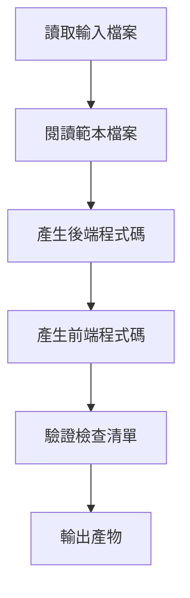

# 階段 5：Code - 產生可執行程式碼

## 學完你能做什麼

- **一鍵產生全端程式碼**：從 UI Schema 和 Tech 設計自動產生可執行的前後端應用程式
- **理解程式碼產生流程**：掌握 Code Agent 如何將設計文件轉化為生產就緒的程式碼
- **驗證程式碼品質**：學會檢查產生程式碼的完整性、測試覆蓋和安全標準
- **除錯常見問題**：解決相依套件安裝、型別檢查和 API 連線問題

## 你現在的困境

你已經完成了產品想法的結構化、PRD 產生、UI 設計和技術架構設計，接下來最頭疼的是：

- **如何把設計變成程式碼**：UI Schema 和 Tech 設計在文件裡，但怎麼實作？
- **全端開發太複雜**：後端要 Express + Prisma，前端要 React Native，從哪開始？
- **程式碼品質難保證**：怎麼確保產生的程式碼有測試、有文件、符合安全規範？
- **時間不夠用**：寫一個 MVP 要好幾天，有沒有更快的方法？

Code 階段就是為了解決這些問題——它自動根據前序階段的設計，產生生產就緒的全端程式碼。

## 什麼時候用這一招

當你需要：

- **快速驗證想法**：用程式碼驗證產品想法是否可行，而不是直接投入開發
- **建立應用程式骨架**：為後續開發提供可執行的基礎，而不是從零開始
- **統一技術堆疊**：確保前後端程式碼遵循統一的架構和規範
- **節省開發時間**：從設計到程式碼，幾分鐘內完成 MVP 框架

## 核心思路

Code Agent 是一個**全端工程師**，它的任務是將前序階段的設計文件轉化為可執行的程式碼。它的核心特點：

### 輸入輸出

| 類型 | 內容 |
|------|------|
| **輸入** | UI Schema（介面結構）、Tech 設計（技術方案）、Prisma Schema（資料模型） |
| **輸出** | `artifacts/backend/`（後端程式碼）、`artifacts/client/`（前端程式碼） |

### 技術堆疊

| 部分 | 技術堆疊 |
|------|--------|
| **後端** | Express + Prisma + TypeScript |
| **前端** | React Native Web + Expo + TypeScript |
| **資料庫** | SQLite（開發）/ PostgreSQL（生產） |

### 執行限制

::: warning 嚴格範圍
Code Agent **只實作** PRD 和 UI Schema 中確認的功能，**不新增**：
- 認證、授權系統
- 複雜的狀態管理（如 Redux）
- 非核心的功能特性
:::

## 跟我做

### 第 1 步：進入 Code 階段

假設你已經完成了 Tech 階段，現在要開始產生程式碼。

```bash
# 如果在 pipeline 中，直接進入下一個階段
factory run code

# 或者從某個階段重新開始
factory run code
```

**你應該看到**：CLI 會顯示 Code 階段的資訊，包括輸入檔案和預期輸出。

### 第 2 步：AI 助手執行 Code Agent

AI 助手會載入 `agents/code.agent.md` 和 `skills/code/skill.md`，然後開始執行。

Code Agent 的執行流程：



**AI 助手會做什麼**：

1. **閱讀範本檔案**（`skills/code/references/backend-template.md` 和 `frontend-template.md`）
   - 理解專案結構和程式碼組織方式
   - 學習如何組織目錄和設定檔

2. **分析輸入檔案**
   - 從 `ui.schema.yaml` 理解頁面結構和元件
   - 從 `tech.md` 理解技術架構和 API 設計
   - 從 `schema.prisma` 理解資料模型

3. **產生後端程式碼**
   - 建立 Express + Prisma 專案結構
   - 產生 API 路由和控制器
   - 實作資料驗證和錯誤處理
   - 新增測試和文件

4. **產生前端程式碼**
   - 建立 React Native + Expo 專案結構
   - 產生頁面元件和 UI 元件
   - 實作資料狀態管理和 API 呼叫
   - 新增測試和導覽設定

5. **驗證檢查清單**
   - 對照 Code Skill 中的檢查清單
   - 確保所有必須項都已完成

6. **輸出產物**
   - 產生 `artifacts/backend/` 和 `artifacts/client/` 目錄

### 第 3 步：驗證產生的程式碼

Code Agent 完成後，會產生完整的程式碼目錄結構。

**後端目錄結構**：

```
backend/
├── package.json          # 相依套件和指令碼
├── tsconfig.json         # TypeScript 設定
├── .env.example          # 環境變數範本
├── .gitignore            # Git 忽略檔案
├── README.md             # 專案說明
├── GETTING_STARTED.md    # 快速啟動指南
├── prisma/
│   ├── schema.prisma     # 資料模型（從 Tech 階段複製）
│   └── seed.ts           # 種子資料
└── src/
    ├── index.ts          # 應用程式入口
    ├── app.ts            # Express 應用程式設定
    ├── config/           # 環境變數設定
    ├── lib/              # Prisma 客戶端
    ├── middleware/       # 錯誤處理、日誌
    ├── routes/           # API 路由
    ├── controllers/      # 控制器
    ├── services/         # 業務邏輯
    ├── validators/       # 輸入驗證（Zod）
    └── __tests__/        # 測試檔案
```

**前端目錄結構**：

```
client/
├── package.json          # 相依套件和指令碼
├── tsconfig.json         # TypeScript 設定
├── app.json              # Expo 設定
├── babel.config.js       # Babel 設定
├── .env.example          # 環境變數範本
├── .gitignore            # Git 忽略檔案
├── README.md             # 專案說明
├── GETTING_STARTED.md    # 快速啟動指南
├── App.tsx               # 應用程式入口
└── src/
    ├── config/           # 環境變數設定
    ├── api/              # API 客戶端
    ├── components/       # UI 元件
    ├── hooks/            # 自定義 Hooks
    ├── navigation/       # 導覽設定
    ├── screens/          # 頁面元件
    ├── styles/           # 主題和樣式
    └── types/            # 型別定義
```

**檢查點 ✅**：確認以下檔案是否存在：

| 檔案 | 後端 | 前端 |
|------|------|------|
| `package.json` | ✅ | ✅ |
| `tsconfig.json` | ✅ | ✅ |
| `.env.example` | ✅ | ✅ |
| `README.md` | ✅ | ✅ |
| `GETTING_STARTED.md` | ✅ | ✅ |
| 測試檔案 | ✅ | ✅ |
| Prisma Schema | ✅ | - |

### 第 4 步：啟動後端服務

按照 `backend/GETTING_STARTED.md` 的指引啟動服務。

```bash
# 進入後端目錄
cd artifacts/backend

# 安裝相依套件
npm install

# 設定環境變數
cp .env.example .env

# 初始化資料庫
npx prisma generate
npx prisma migrate dev
npm run db:seed

# 啟動開發伺服器
npm run dev
```

**你應該看到**：

```
Server running on http://localhost:3000
Environment: development
Database connected
```

**檢查點 ✅**：存取健康檢查端點確認服務正常。

```bash
curl http://localhost:3000/health
```

應該回傳：

```json
{
  "status": "ok",
  "timestamp": "2024-01-29T12:00:00.000Z"
}
```

### 第 5 步：啟動前端應用程式

按照 `client/GETTING_STARTED.md` 的指引啟動應用程式。

```bash
# 新開一個終端機，進入前端目錄
cd artifacts/client

# 安裝相依套件
npm install

# 設定環境變數
cp .env.example .env

# 啟動開發伺服器
npm start
```

**你應該看到**：Metro Bundler 啟動，顯示執行選項。

```
› Metro waiting on exp://192.168.x.x:19000
› Scan the QR code above with Expo Go (Android) or the Camera app (iOS)
› Press a │ open Android
› Press i │ open iOS simulator
› Press w │ open web

Logs for your project will appear below.
```

選擇執行平台：
- 按 `w` - 在瀏覽器中開啟（最方便測試）

**檢查點 ✅**：應用程式能在瀏覽器中開啟，並顯示前端介面。

### 第 6 步：測試前後端整合

1. **存取 API 文件**：http://localhost:3000/api-docs
   - 檢視 Swagger UI 文件
   - 確認所有端點都有定義

2. **測試前端功能**：
   - 建立新資料
   - 編輯資料
   - 刪除資料
   - 列表重新整理

3. **檢查控制台日誌**：
   - 前端是否有 API 呼叫錯誤
   - 後端是否有請求日誌
   - 是否有未處理的例外

### 第 7 步：確認檢查點

在 AI 助手確認 Code 階段完成時，你會看到：

```
✅ Code 階段完成

產生的檔案：
- 後端：artifacts/backend/（Express + Prisma + TypeScript）
- 前端：artifacts/client/（React Native + Expo + TypeScript）

檢查點選項：
[1] 繼續 - 進入 Validation 階段
[2] 重試 - 重新產生程式碼
[3] 暫停 - 儲存目前狀態
```

選擇 **繼續** 進入下一階段。

## 檢查點 ✅

完成 Code 階段後，你應該：

- [ ] 後端程式碼能正常啟動（`npm run dev`）
- [ ] 前端應用程式能在瀏覽器中開啟
- [ ] 健康檢查端點回傳正常
- [ ] API 文件可存取（`/api-docs`）
- [ ] 前端能呼叫後端 API
- [ ] 前端處理了 Loading 和 Error 狀態
- [ ] 測試檔案存在且可執行（`npm test`）

## 踩坑提醒

### 問題 1：相依套件安裝失敗

**症狀**：`npm install` 報錯

**解決方案**：

```bash
# 清除快取重試
rm -rf node_modules package-lock.json
npm cache clean --force
npm install
```

### 問題 2：Prisma 遷移失敗

**症狀**：`npx prisma migrate dev` 報錯

**解決方案**：

```bash
# 重置資料庫
npx prisma migrate reset

# 或手動刪除資料庫檔案
rm prisma/dev.db
npx prisma migrate dev
```

### 問題 3：前端無法連接後端

**症狀**：前端報錯 `Network Error` 或 `ECONNREFUSED`

**檢查清單**：

1. 確認後端已啟動：`curl http://localhost:3000/health`
2. 檢查前端的 `.env` 設定：`EXPO_PUBLIC_API_URL=http://localhost:3000/api`
3. 如果使用真機測試，改為區域網路 IP（如 `http://192.168.1.100:3000/api`）

### 問題 4：測試失敗

**症狀**：`npm test` 報錯

**解決方案**：

- 確認測試檔案存在：`src/__tests__/`
- 檢查測試相依套件是否安裝：`npm install --save-dev vitest @testing-library/react-native`
- 檢視錯誤資訊，修復程式碼中的問題

## Code Agent 特殊要求

Code Agent 有一些特殊的限制和要求，需要特別注意：

### 1. 必須閱讀範本檔案

在產生程式碼前，Code Agent **必須完整閱讀**：
- `skills/code/references/backend-template.md`
- `skills/code/references/frontend-template.md`

這兩個範本檔案展示了生產就緒的專案結構和範例程式碼。

### 2. 禁止新增認證和授權

::: warning 範圍限制
Code Agent **絕對禁止**新增：
- 登入/註冊功能
- Token 認證
- 權限控制
- 複雜的狀態管理（如 Redux）
:::

這些功能會在後續疊代中新增，MVP 階段只關注核心業務邏輯。

### 3. 程式碼品質要求

產生的程式碼必須滿足：

| 要求 | 說明 |
|------|------|
| **TypeScript** | 嚴格模式，無 `any` 型別 |
| **測試** | 健康檢查、CRUD 端點、輸入驗證測試 |
| **API 文件** | Swagger/OpenAPI 規範（`/api-docs`） |
| **錯誤處理** | 統一錯誤處理中介軟體 |
| **日誌** | 結構化日誌（winston/pino） |
| **安全** | Zod 驗證、helmet、CORS 白名單 |
| **文件** | README 和快速啟動指南 |

## 程式碼產生檢查清單

Code Agent 會對照以下檢查清單產生程式碼。

### 後端必須項

- [ ] 環境變數支援（dotenv）
- [ ] 相依套件版本鎖定（Prisma 5.x）
- [ ] 型別定義（JSON 欄位處理）
- [ ] 核心相依套件：Express + Prisma + Zod + Helmet
- [ ] API 端點：健康檢查 + CRUD
- [ ] 統一回應格式
- [ ] 輸入驗證（Zod Schema）
- [ ] 錯誤處理中介軟體
- [ ] 測試檔案（健康檢查 + CRUD + 驗證）
- [ ] Swagger API 文件
- [ ] 種子資料（`prisma/seed.ts`）

### 前端必須項

- [ ] 核心相依套件：React Native Web + Expo + React Navigation
- [ ] 持久化儲存（AsyncStorage）
- [ ] 導覽設定（React Navigation 6+）
- [ ] 安全區域（SafeAreaView）
- [ ] API Client（Axios + 攔截器）
- [ ] 自定義 Hooks（資料管理）
- [ ] 基礎 UI 元件（Button, Input, Card, Loading）
- [ ] 頁面元件（至少主頁和詳情頁）
- [ ] Loading 和 Error 狀態處理
- [ ] 下拉重新整理（RefreshControl）
- [ ] 測試檔案（頁面渲染 + 元件 + Hooks）

## 測試和品質保證

即使是在 MVP 階段，Code Agent 也會產生基礎的測試程式碼。

### 後端測試範例

```typescript
// src/__tests__/items.test.ts
import { describe, it, expect } from 'vitest';
import request from 'supertest';
import app from '../app';

describe('Items API', () => {
  it('should return health check', async () => {
    const res = await request(app).get('/health');
    expect(res.status).toBe(200);
  });

  it('should create a new item', async () => {
    const res = await request(app)
      .post('/api/items')
      .send({ title: 'Test Item', amount: 100 });

    expect(res.status).toBe(201);
    expect(res.body.data).toHaveProperty('id');
  });

  it('should reject invalid item', async () => {
    const res = await request(app)
      .post('/api/items')
      .send({ title: '' }); // 缺少必填欄位

    expect(res.status).toBe(400);
  });
});
```

### 前端測試範例

```typescript
// src/screens/__tests__/HomeScreen.test.tsx
import React from 'react';
import { render, screen } from '@testing-library/react-native';
import HomeScreen from '../HomeScreen';

describe('HomeScreen', () => {
  it('should render without crashing', () => {
    render(<HomeScreen />);
    expect(screen.getByText(/home/i)).toBeTruthy();
  });

  it('should show loading state initially', () => {
    render(<HomeScreen />);
    expect(screen.getByTestId('loading-indicator')).toBeTruthy();
  });
});
```

## 快速啟動指南

每個產生的專案都會包含 `GETTING_STARTED.md`，幫助你在 5 分鐘內執行專案。

### 後端快速啟動

```bash
# 1. 複製專案
cd artifacts/backend

# 2. 安裝相依套件
npm install

# 3. 設定環境變數
cp .env.example .env

# 4. 初始化資料庫
npx prisma generate
npx prisma migrate dev
npm run db:seed

# 5. 啟動服務
npm run dev
```

### 前端快速啟動

```bash
# 1. 複製專案
cd artifacts/client

# 2. 安裝相依套件
npm install

# 3. 設定環境變數
cp .env.example .env

# 4. 啟動應用程式
npm start
```

**注意**：確保後端已啟動，否則前端無法連接 API。

## 本課小結

Code 階段是流水線的核心環節之一，它將前序階段的設計轉化為可執行的程式碼。

**關鍵要點**：

1. **輸入輸出**：Code Agent 根據 UI Schema、Tech 設計和 Prisma Schema 產生前後端程式碼
2. **技術堆疊**：後端使用 Express + Prisma，前端使用 React Native Web + Expo
3. **範圍控制**：只實作 PRD 和 UI Schema 中的功能，不新增認證和授權
4. **品質保證**：產生測試、API 文件和快速啟動指南
5. **驗證標準**：後端可啟動、前端可渲染、API 可呼叫

## 下一課預告

> 下一課我們學習 **[Validation 階段](../stage-validation/)**。
>
> 你會學到：
> - 如何驗證產生的程式碼品質
> - 相依套件安裝和型別檢查
> - Prisma Schema 驗證
> - 產生驗證報告

---

## 附錄：原始碼參考

<details>
<summary><strong>點選展開檢視原始碼位置</strong></summary>

> 更新時間：2026-01-29

| 功能 | 檔案路徑 | 行號 |
|------|----------|------|
| Code Agent 定義 | [`agents/code.agent.md`](https://github.com/hyz1992/agent-app-factory/blob/main/agents/code.agent.md) | 1-82 |
| Code Skill | [`skills/code/skill.md`](https://github.com/hyz1992/agent-app-factory/blob/main/skills/code/skill.md) | 1-1488 |
| 後端範本 | [`skills/code/references/backend-template.md`](https://github.com/hyz1992/agent-app-factory/blob/main/skills/code/references/backend-template.md) | 1-670 |
| 前端範本 | [`skills/code/references/frontend-template.md`](https://github.com/hyz1992/agent-app-factory/blob/main/skills/code/references/frontend-template.md) | 1-1231 |
| 流水線定義 | [`pipeline.yaml`](https://github.com/hyz1992/agent-app-factory/blob/main/pipeline.yaml) | 63-77 |

**關鍵限制**：
- 只實作 PRD 和 UI Schema 中的功能（`code.agent.md:25`）
- 禁止新增認證、授權或複雜狀態管理（`code.agent.md:28`）
- 必須完整閱讀範本檔案（`code/skill.md:1476`）
- 所有資料庫操作透過 Service 層（`backend-template.md:665`）
- 所有輸入必須透過 Zod 驗證（`backend-template.md:666`）

**關鍵檢查清單**：
- 後端必須項：環境變數、相依套件鎖定、型別定義（`code.agent.md:37-47`）
- 前端必須項：核心相依套件、匯入路徑、設定檔（`code.agent.md:50-64`）
- 常見錯誤預防（`code.agent.md:65-74`）

</details>
