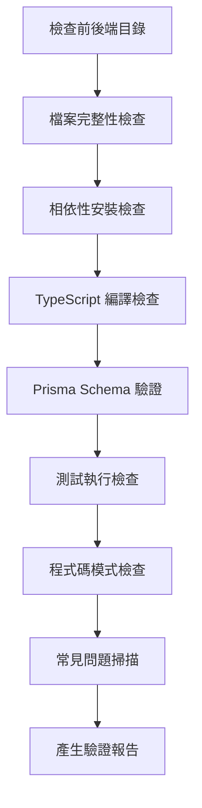

# 階段 6：Validation - 驗證程式碼品質

## 學完你能做什麼

- **自動化程式碼驗證**：一鍵檢查前後端程式碼的相依性安裝、類型檢查和基礎測試
- **解讀驗證報告**：理解 Validation Agent 生成的詳細報告和問題分類
- **快速定位問題**：根據報告中的具體位置和建議修復程式碼錯誤
- **確保程式碼品質**：驗證生成的程式碼符合生產就緒標準

## 你現在的困境

你已經完成了 Code 階段，生成了前後端程式碼，但最頭疼的是：

- **程式碼能不能跑**：相依性都裝對了嗎？類型檢查能過嗎？
- **Prisma 對不對**：schema 語法有問題嗎？能生成客戶端嗎？
- **測試靠譜嗎**：有測試嗎？能通過嗎？
- **有沒有坑**：環境變數配置對嗎？匯入路徑正確嗎？

人工逐一檢查這些問題要花好長時間，而且容易遺漏。Validation 階段就是為了解決這些問題——它自動驗證程式碼品質，生成詳細報告。

## 什麼時候用這一招

當你需要：

- **快速驗證程式碼**：確認生成的程式碼符合基本品質標準
- **發現潛在問題**：在部署前找出相依性、類型、測試等問題
- **程式碼品質保證**：確保前後端程式碼都能通過基本檢查
- **避免部署失敗**：提前發現問題，減少返工成本

## 核心思路

Validation Agent 是一個**品質檢查員**，它的任務是驗證 Code Agent 生成的程式碼是否符合品質標準。它的核心特點：

### 輸入輸出

| 類型 | 內容 |
|------|------|
| **輸入** | `artifacts/backend/`（後端程式碼）、`artifacts/client/`（前端程式碼） |
| **輸出** | `artifacts/validation/report.md`（驗證報告） |

### 驗證檢查項

Validation Agent 會執行 8 大類檢查：

| 檢查項 | 說明 |
|--------|------|
| **檔案完整性** | 確認所有必須檔案都存在 |
| **相依性安裝** | 驗證 `package.json` 相依性可正常解析 |
| **TypeScript 編譯** | 檢查程式碼是否通過類型檢查 |
| **Prisma Schema** | 驗證資料模型語法是否正確 |
| **測試執行** | 確認測試存在且能通過 |
| **程式碼規範** | 檢查 lint 腳本配置 |
| **關鍵模式** | 掃描程式碼中的關鍵模式（錯誤處理、健康檢查等） |
| **常見問題** | 識別已知的錯誤模式 |

### 執行約束

::: warning 唯讀模式
Validation Agent **只驗證不修改**：
- 禁止修改任何程式碼檔案
- 禁止實際安裝相依性（使用 `--dry-run`）
- 禁止執行有副作用的命令
:::

## 跟我做

### 第 1 步：進入 Validation 階段

假設你已經完成了 Code 階段，現在要開始驗證程式碼品質。

```bash
# 如果在 pipeline 中，直接進入下一個階段
factory run validation

# 或者從某個階段重新開始
factory run validation
```

**你應該看到**：CLI 會顯示 Validation 階段的資訊，包括輸入檔案和預期輸出。

### 第 2 步：AI 助手執行 Validation Agent

AI 助手會載入 `agents/validation.agent.md`，然後開始執行。

Validation Agent 的執行流程：



**AI 助手會做什麼**：

1. **檢查後端目錄**
   - 確認 `artifacts/backend/` 存在
   - 檢查必須檔案：`package.json`、`tsconfig.json`、`.env.example`、`prisma/schema.prisma`

2. **檢查前端目錄**
   - 確認 `artifacts/client/` 存在
   - 檢查必須檔案：`package.json`、`tsconfig.json`、`app.json`、`App.tsx`

3. **相依性安裝檢查**
   - 後端：`cd artifacts/backend && npm install --dry-run`
   - 前端：`cd artifacts/client && npm install --dry-run`
   - 驗證相依性是否可以正常解析

4. **TypeScript 編譯檢查**
   - 後端：`cd artifacts/backend && npx tsc --noEmit`
   - 前端：`cd artifacts/client && npx tsc --noEmit`
   - 檢查程式碼是否通過類型檢查

5. **Prisma Schema 驗證**
   - `cd artifacts/backend && npx prisma validate`
   - 驗證資料模型語法是否正確

6. **測試執行檢查**
   - 後端：`cd artifacts/backend && npm test`
   - 前端：`cd artifacts/client && npm test`
   - 確認測試存在且能通過

7. **程式碼模式檢查**
   - 掃描關鍵模式：錯誤處理、健康檢查、SafeAreaView 等
   - 檢查相依性配置：dotenv、React Native Web 等

8. **常見問題掃描**
   - SQLite 使用 `type` 定義
   - 環境變數值有引號
   - 錯誤的匯入路徑
   - 缺少必要的匯入

9. **產生驗證報告**
   - 彙總所有檢查結果
   - 列出發現的問題
   - 提供修復建議
   - 儲存到 `artifacts/validation/report.md`

### 第 3 步：查看驗證報告

Validation Agent 完成後，會產生詳細的驗證報告。

開啟 `artifacts/validation/report.md`：

```bash
cat artifacts/validation/report.md
```

**你應該看到**：

```markdown
# 程式碼驗證報告

**產生時間**: 2026-01-29 12:00:00
**驗證結果**: ✅ 通過

## 摘要

- 後端驗證: ✅
- 前端驗證: ✅
- 總體評估: 程式碼品質符合 MVP 標準，可以進入 Preview 階段

---

## 後端驗證詳情

### 檔案完整性
| 檔案 | 狀態 |
|------|------|
| package.json | ✅ |
| tsconfig.json | ✅ |
| .env.example | ✅ |
| prisma/schema.prisma | ✅ |
| src/index.ts | ✅ |
| src/app.ts | ✅ |

### 相依性安裝
- 狀態: ✅
- 詳情: 所有相依性可正常解析

### TypeScript 編譯
- 狀態: ✅
- 錯誤數量: 0

### Prisma 驗證
- 狀態: ✅
- 詳情: Prisma schema 語法正確

### 測試執行
- 狀態: ✅
- 測試數量: 12
- 通過數量: 12
- 失敗數量: 0

### 程式碼模式檢查
| 檢查項 | 狀態 |
|--------|------|
| 錯誤處理中介軟體 | ✅ |
| 健康檢查端點 | ✅ |
| 環境變數使用 | ✅ |
| Prisma Client 匯入 | ✅ |
| 測試檔案存在 | ✅ |
| dotenv 首行匯入 | ✅ |

---

## 前端驗證詳情

### 檔案完整性
| 檔案 | 狀態 |
|------|------|
| package.json | ✅ |
| tsconfig.json | ✅ |
| app.json | ✅ |
| App.tsx | ✅ |
| src/navigation/index.tsx | ✅ |

### 相依性安裝
- 狀態: ✅
- 詳情: 所有相依性可正常解析

### TypeScript 編譯
- 狀態: ✅
- 錯誤數量: 0

### 測試執行
- 狀態: ✅
- 測試數量: 8
- 通過數量: 8
- 失敗數量: 0

### 程式碼模式檢查
| 檢查項 | 狀態 |
|--------|------|
| SafeAreaView 使用 | ✅ |
| Loading 元件 | ✅ |
| Error 處理 | ✅ |
| API 呼叫封裝 | ✅ |
| React Native Web 相依性 | ✅ |
| async-storage 相依性 | ✅ |

---

## 發現的問題

無嚴重問題或警告

---

## 修復建議

無需修復

---

## 結論

程式碼品質符合 MVP 標準，建議進入 Preview 階段。
```

### 第 4 步：處理驗證失敗的情況

如果驗證失敗，報告中會列出具體問題和修復建議。

**範例：部分通過的驗證報告**

```markdown
**驗證結果**: ⚠️ 部分通過

## 發現的問題

### 嚴重問題 (必須修復)

1. TypeScript 編譯錯誤
   - 位置: src/controllers/items.ts:15
   - 錯誤: Property 'title' does not exist on type 'any'
   - 建議: 新增類型定義 `const item: Item = req.body;`

2. Prisma schema 驗證失敗
   - 位置: prisma/schema.prisma:10
   - 錯誤: Invalid datasource provider 'sqlite'
   - 建議: 將 `provider = "sqlite"` 改為 `provider = "postgresql"`（生產環境）

### 警告 (建議修復)

1. 缺少測試檔案
   - 位置: src/controllers/
   - 建議: 為每個控制器新增測試檔案

2. 環境變數配置不完整
   - 位置: .env.example
   - 建議: 新增 `DATABASE_URL` 範例

## 修復建議

1. 修復 TypeScript 錯誤：在 `src/controllers/items.ts` 中新增類型定義
2. 更新 Prisma schema：修改資料來源 provider
3. 新增測試檔案：為控制器編寫測試
4. 完善環境變數：補充 `.env.example`
```

**修復步驟**：

1. **定位問題檔案**
   ```bash
   # 開啟問題檔案
   vim artifacts/backend/src/controllers/items.ts
   ```

2. **修復程式碼**
   ```typescript
   # 新增類型定義
   const item: Item = req.body;
   ```

3. **更新 Prisma schema**
   ```prisma
   datasource db {
     provider = "postgresql"  # 修改為 postgresql
     url      = env("DATABASE_URL")
   }
   ```

4. **重新驗證**
   ```bash
   # 重新執行 Validation 階段
   factory run validation
   ```

### 第 5 步：確認檢查點

在 AI 助手確認 Validation 階段完成時，你會看到：

```
✅ Validation 階段完成

產生的檔案：
- 驗證報告：artifacts/validation/report.md

驗證結果：✅ 通過 / ⚠️ 部分通過 / ❌ 失敗

檢查點選項：
[1] 繼續 - 進入 Preview 階段
[2] 重試 - 重新驗證程式碼
[3] 暫停 - 儲存目前狀態
```

- 如果驗證通過，選擇 **繼續** 進入下一階段
- 如果有問題，修復後選擇 **重試** 重新驗證
- 如果需要時間修復，選擇 **暫停** 儲存目前狀態

## 檢查點 ✅

完成 Validation 階段後，你應該：

- [ ] 後端和前端的所有必須檔案都存在
- [ ] 相依性可以正常解析（`npm install --dry-run`）
- [ ] TypeScript 編譯無錯誤（`npx tsc --noEmit`）
- [ ] Prisma schema 驗證通過（`npx prisma validate`）
- [ ] 測試檔案存在且能通過（`npm test`）
- [ ] 關鍵模式檢查全部通過
- [ ] 驗證報告已產生（`artifacts/validation/report.md`）

## 踩坑提醒

### 問題 1：相依性安裝失敗

**症狀**：`npm install --dry-run` 報錯

**解決方案**：

```bash
# 檢查 package.json 語法
cat artifacts/backend/package.json

# 常見問題：
# - 缺少引號
# - 相依性名稱錯誤
# - 版本格式不對

# 修復後重新驗證
factory run validation
```

### 問題 2：TypeScript 編譯錯誤

**症狀**：`npx tsc --noEmit` 報錯

**常見錯誤類型**：

| 錯誤 | 原因 | 解決方案 |
|------|------|----------|
| `Property does not exist` | 類型未定義 | 新增類型定義 |
| `Module not found` | 匯入路徑錯誤 | 檢查匯入路徑 |
| `Implicit any` | 隱式 any 類型 | 啟用嚴格模式並新增類型 |

### 問題 3：Prisma schema 驗證失敗

**症狀**：`npx prisma validate` 報錯

**常見錯誤**：

| 錯誤 | 原因 | 解決方案 |
|------|------|----------|
| `Invalid datasource provider` | provider 錯誤 | 使用 `postgresql` 或 `sqlite` |
| `Error parsing` | 語法錯誤 | 檢查 model 定義 |
| `Relation error` | 關係定義錯誤 | 檢查 `@relation` 欄位 |

### 問題 4：測試失敗

**症狀**：`npm test` 報錯

**解決方案**：

```bash
# 檢查測試檔案是否存在
find artifacts/backend -name "*.test.ts"

# 檢查測試相依性是否安裝
cat artifacts/backend/package.json | grep -A 5 "devDependencies"

# 如果缺少測試相依性，手動安裝
cd artifacts/backend
npm install --save-dev vitest @testing-library/react-native
```

### 問題 5：關鍵模式檢查失敗

**症狀**：報告顯示關鍵模式缺失

**常見缺失模式**：

| 模式 | 位置 | 修復方法 |
|------|------|----------|
| 錯誤處理中介軟體 | `src/middleware/error.ts` | 新增錯誤處理中介軟體 |
| 健康檢查端點 | `src/routes/health.ts` | 新增 `/health` 路由 |
| dotenv 首行匯入 | `src/index.ts:1` | 新增 `import 'dotenv/config';` |
| SafeAreaView | `src/screens/Home.tsx` | 用 SafeAreaView 包裹內容 |

## Validation Agent 特殊要求

Validation Agent 有一些特殊的約束和要求，需要特別注意：

### 1. 唯讀模式

::: warning 禁止修改程式碼
Validation Agent **絕對禁止**修改任何程式碼檔案，只執行驗證和報告產生。
:::

### 2. Dry-run 安裝

相依性安裝檢查使用 `--dry-run` 參數，不會實際安裝相依性：

```bash
npm install --dry-run  # 只檢查相依性是否可解析
```

### 3. 完整的報告

Validation Agent **必須**產生完整的驗證報告，包括：

| 部分 | 內容 |
|------|------|
| **摘要** | 後端/前端驗證狀態和總體評估 |
| **後端詳情** | 檔案完整性、相依性、編譯、Prisma、測試、模式檢查 |
| **前端詳情** | 檔案完整性、相依性、編譯、測試、模式檢查 |
| **發現的問題** | 嚴重問題和警告列表 |
| **修復建議** | 針對問題的具體修復步驟 |
| **結論** | 總體評估和下一步建議 |

### 4. 問題分級

Validation Agent 會將問題分為三級：

| 級別 | 標準 | 處理方式 |
|------|------|----------|
| **嚴重問題** | 必須修復才能通過 | 在報告中標記為"必須修復" |
| **警告** | 建議修復但非致命 | 在報告中標記為"建議修復" |
| **資訊** | 僅供參考 | 不影響驗證結果 |

## 驗證結果判定

Validation Agent 會根據檢查結果判定驗證狀態。

### 通過條件 (✅ 通過)

- 所有必須檔案存在
- 相依性安裝無錯誤
- TypeScript 編譯無錯誤
- Prisma schema 驗證通過
- 基礎測試存在且全部通過
- 關鍵模式檢查全部通過

### 部分通過條件 (⚠️ 部分通過)

- 必須檔案存在
- 相依性安裝無錯誤
- TypeScript 編譯有警告但無錯誤
- 測試存在但部分失敗（< 30% 失敗率）
- 存在非關鍵問題

### 失敗條件 (❌ 失敗)

- 必須檔案缺失
- 相依性安裝失敗
- TypeScript 編譯有錯誤
- Prisma schema 驗證失敗
- 測試缺失或大量失敗（≥ 30% 失敗率）

## 程式碼品質檢查清單

Validation Agent 會對照以下檢查清單進行驗證。

### 後端必須項

- [ ] `package.json` 存在
- [ ] `tsconfig.json` 存在
- [ ] `.env.example` 存在
- [ ] `prisma/schema.prisma` 存在
- [ ] `src/index.ts` 存在
- [ ] `src/app.ts` 存在
- [ ] `src/index.ts` 首行匯入 dotenv
- [ ] dotenv 在 dependencies 中
- [ ] 存在錯誤處理中介軟體
- [ ] 存在健康檢查端點 (`/health`)
- [ ] 環境變數使用 `process.env`
- [ ] Prisma Client 匯入正確
- [ ] 存在至少一個測試檔案
- [ ] package.json 包含 `test` 腳本

### 前端必須項

- [ ] `package.json` 存在
- [ ] `tsconfig.json` 存在
- [ ] `app.json` 存在
- [ ] `App.tsx` 存在
- [ ] `src/navigation/index.tsx` 存在
- [ ] 存在 SafeAreaView 使用
- [ ] 存在 Loading 元件
- [ ] 存在 Error 處理
- [ ] API 呼叫透過封裝層
- [ ] 包含 React Native Web 相依性
- [ ] 包含 async-storage 相依性
- [ ] `app.json` 不引用不存在的圖片檔案

## 常見問題掃描

Validation Agent 會掃描以下已知問題模式：

| 檢查項 | 檢測方法 | 修復建議 |
|--------|----------|----------|
| SQLite 使用 `type` 定義 | 檢查 schema.prisma 是否包含 `type Xxx` | 移除 `type` 定義 |
| 環境變數值有引號 | 檢查 .env 是否包含 `="xxx"` 或 `='xxx'` | 移除引號 |
| Prisma 版本是 7.x | 檢查 package.json 中 prisma 版本是否 ^7 | 改用 Prisma 5.x |
| 錯誤的匯入路徑 | 檢查 screens 中是否有 `from './ui/'` | 改為 `from '../components/ui/'` |
| 缺少 View 匯入 | 檢查元件是否使用 View 但未匯入 | 新增 `import { View } from 'react-native'` |
| 字串未終止 | 檢查 .tsx 檔案是否有連續的引號 | 新增缺失的引號 |

## 驗證報告範例

### 通過的驗證報告

```markdown
# 程式碼驗證報告

**產生時間**: 2026-01-29 12:00:00
**驗證結果**: ✅ 通過

## 摘要

- 後端驗證: ✅
- 前端驗證: ✅
- 總體評估: 程式碼品質符合 MVP 標準，可以進入 Preview 階段

---

## 後端驗證詳情

### 檔案完整性
| 檔案 | 狀態 |
|------|------|
| package.json | ✅ |
| tsconfig.json | ✅ |
| .env.example | ✅ |
| prisma/schema.prisma | ✅ |
| src/index.ts | ✅ |
| src/app.ts | ✅ |

### 相依性安裝
- 狀態: ✅
- 詳情: 所有相依性可正常解析

### TypeScript 編譯
- 狀態: ✅
- 錯誤數量: 0

### Prisma 驗證
- 狀態: ✅
- 詳情: Prisma schema 語法正確

### 測試執行
- 狀態: ✅
- 測試數量: 12
- 通過數量: 12
- 失敗數量: 0

### 程式碼模式檢查
| 檢查項 | 狀態 |
|--------|------|
| 錯誤處理中介軟體 | ✅ |
| 健康檢查端點 | ✅ |
| 環境變數使用 | ✅ |
| Prisma Client 匯入 | ✅ |
| 測試檔案存在 | ✅ |
| dotenv 首行匯入 | ✅ |

---

## 前端驗證詳情

### 檔案完整性
| 檔案 | 狀態 |
|------|------|
| package.json | ✅ |
| tsconfig.json | ✅ |
| app.json | ✅ |
| App.tsx | ✅ |
| src/navigation/index.tsx | ✅ |

### 相依性安裝
- 狀態: ✅
- 詳情: 所有相依性可正常解析

### TypeScript 編譯
- 狀態: ✅
- 錯誤數量: 0

### 測試執行
- 狀態: ✅
- 測試數量: 8
- 通過數量: 8
- 失敗數量: 0

### 程式碼模式檢查
| 檢查項 | 狀態 |
|--------|------|
| SafeAreaView 使用 | ✅ |
| Loading 元件 | ✅ |
| Error 處理 | ✅ |
| API 呼叫封裝 | ✅ |
| React Native Web 相依性 | ✅ |
| async-storage 相依性 | ✅ |

---

## 發現的問題

無嚴重問題或警告

---

## 修復建議

無需修復

---

## 結論

程式碼品質符合 MVP 標準，建議進入 Preview 階段。
```

### 失敗的驗證報告

```markdown
# 程式碼驗證報告

**產生時間**: 2026-01-29 12:00:00
**驗證結果**: ❌ 失敗

## 摘要

- 後端驗證: ❌
- 前端驗證: ⚠️
- 總體評估: 後端存在嚴重問題，必須修復後才能繼續

---

## 發現的問題

### 嚴重問題 (必須修復)

1. TypeScript 編譯錯誤
   - 位置: src/controllers/items.ts:15
   - 錯誤: Property 'title' does not exist on type 'any'
   - 建議: 新增類型定義 `const item: Item = req.body;`

2. Prisma schema 驗證失敗
   - 位置: prisma/schema.prisma:10
   - 錯誤: Invalid datasource provider 'sqlite'
   - 建議: 將 `provider = "sqlite"` 改為 `provider = "postgresql"`

3. 缺少必須檔案
   - 位置: src/
   - 檔案: src/middleware/error.ts
   - 建議: 建立錯誤處理中介軟體

### 警告 (建議修復)

1. 前端測試失敗
   - 位置: src/screens/__tests__/HomeScreen.test.tsx
   - 失敗: 2/8 測試失敗
   - 建議: 修復測試案例

2. 缺少 Loading 元件
   - 位置: src/components/
   - 建議: 建立 Loading 元件並正確使用

---

## 修復建議

1. 修復 TypeScript 錯誤：在 `src/controllers/items.ts` 中新增類型定義
2. 更新 Prisma schema：修改資料來源 provider 為 postgresql
3. 建立錯誤處理中介軟體：新增 `src/middleware/error.ts`
4. 修復前端測試：檢查並修復失敗的測試案例
5. 建立 Loading 元件：新增 `src/components/Loading.tsx`

---

## 結論

後端存在嚴重問題，必須修復後才能繼續。建議：
1. 修復 TypeScript 編譯錯誤
2. 更新 Prisma schema
3. 新增缺失的檔案
4. 重新執行 Validation 階段
```

## 本課小結

Validation 階段是流水線的品質保證環節，它確保生成的程式碼符合基本的品質標準。

**關鍵要點**：

1. **驗證流程**：Validation Agent 自動檢查檔案完整性、相依性、編譯、測試等
2. **唯讀模式**：只驗證不修改，使用 `--dry-run` 避免副作用
3. **問題分級**：將問題分為嚴重、警告、資訊三級
4. **詳細報告**：產生包含具體位置和修復建議的驗證報告
5. **結果判定**：根據檢查結果判定通過/部分通過/失敗

## 下一課預告

> 下一課我們學習 **[Preview 階段](../stage-preview/)**。
>
> 你會學到：
> - 如何產生執行說明文件
> - 快速啟動指南
> - 部署配置（Docker、CI/CD）

---

## 附錄：原始碼參考

<details>
<summary><strong>點擊展開查看原始碼位置</strong></summary>

> 更新時間：2026-01-29

| 功能 | 檔案路徑 | 行號 |
|------|----------|------|
| Validation Agent 定義 | [`agents/validation.agent.md`](https://github.com/hyz1992/agent-app-factory/blob/main/agents/validation.agent.md) | 1-320 |
| 流水線定義 | [`pipeline.yaml`](https://github.com/hyz1992/agent-app-factory/blob/main/pipeline.yaml) | 79-96 |

**關鍵約束**：
- 禁止修改任何程式碼檔案（`validation.agent.md:293`）
- 禁止實際安裝相依性，使用 `--dry-run`（`validation.agent.md:294`）
- 必須產生完整的驗證報告（`validation.agent.md:296`）
- 必須提供具體的修復建議（`validation.agent.md:298`）

**驗證檢查項**：
- 檔案完整性檢查（`validation.agent.md:24-42`）
- 相依性安裝檢查（`validation.agent.md:43-53`）
- TypeScript 編譯檢查（`validation.agent.md:55-65`）
- Prisma Schema 驗證（`validation.agent.md:67-73`）
- 測試執行檢查（`validation.agent.md:75-85`）
- 程式碼規範檢查（`validation.agent.md:87-97`）
- 關鍵模式檢查（`validation.agent.md:99-122`）
- 常見問題掃描（`validation.agent.md:124-136`）

**驗證結果判定**：
- 通過條件（`validation.agent.md:268-274`）
- 部分通過條件（`validation.agent.md:276-281`）
- 失敗條件（`validation.agent.md:283-288`）

**執行流程**：
- 操作步驟（`validation.agent.md:303-313`）
- 輸出格式（`validation.agent.md:139-262`）

</details>
