# 7 階段流水線概覽

## 學完你能做什麼

- 理解 7 個階段流水線的完整流程和每個階段的職責
- 知道每個階段的輸入、輸出和退出條件
- 了解檢查點機制如何保證品質
- 理解 Sisyphus 排程器如何協調 Agent 執行
- 掌握權限矩陣如何防止 Agent 越權
- 學會利用「新建會話繼續」節省 Token

## 核心思路

**流水線是什麼？**

AI App Factory 的流水線是一條自動化的生產線，將你的產品想法一步步轉化為可執行的應用程式。就像工廠生產線一樣，原料（產品想法）經過 7 個工序（階段），最終產出成品（完整應用）。

每個工序由專門的 Agent 負責，他們各司其職，互不干擾：

| 階段 | Agent | 職責 | 產出 |
| ----- | ----- | ---- | ---- |
| Bootstrap | Bootstrap Agent | 深入挖掘產品想法 | `input/idea.md` |
| PRD | PRD Agent | 產生產品需求文件 | `artifacts/prd/prd.md` |
| UI | UI Agent | 設計介面和原型 | `artifacts/ui/ui.schema.yaml` + 預覽頁面 |
| Tech | Tech Agent | 設計技術架構 | `artifacts/tech/tech.md` + Prisma Schema |
| Code | Code Agent | 產生可執行程式碼 | `artifacts/backend/` + `artifacts/client/` |
| Validation | Validation Agent | 驗證程式碼品質 | `artifacts/validation/report.md` |
| Preview | Preview Agent | 產生部署指南 | `artifacts/preview/README.md` |

**關鍵特性**

1. **檢查點機制**：每個階段完成後暫停，等待你確認後再繼續
2. **權限隔離**：每個 Agent 只能讀寫授權目錄，防止污染
3. **失敗可回滾**：階段失敗時自動重試，連續失敗則回滾到上一個成功檢查點
4. **上下文最佳化**：支援在新會話中繼續執行，節省 Token

## 流水線全覽

```mermaid
graph LR
    A[Bootstrap<br/>結構化產品想法] -->|idea.md| B[PRD<br/>產生需求文件]
    B -->|prd.md| C[UI<br/>設計介面原型]
    C -->|ui.schema.yaml| D[Tech<br/>設計技術架構]
    D -->|tech.md + schema.prisma| E[Code<br/>產生可執行程式碼]
    E -->|backend + client| F[Validation<br/>驗證程式碼品質]
    F -->|驗證報告| G[Preview<br/>產生部署指南]
    
    style A fill:#e0f2fe
    style B fill:#f0fdf4
    style C fill:#fef3c7
    style D fill:#ede9fe
    style E fill:#fce7f3
    style F fill:#dbeafe
    style G fill:#d1fae5
```



**流水線執行規則**

::: tip 執行規則

1. **嚴格順序**：必須從 Bootstrap 開始，按順序執行到 Preview，不可跳過或並行
2. **單 Agent 啟用**：同一時刻只能有一個 Agent 在工作
3. **不可回溯**：已確認的產物不能修改，只能重新執行該階段

注意：這些是流水線的執行規則，不等於檢查點選項的數量。每個階段完成後，Sisyphus 會提供 5 個檢查點選項（詳見下方「檢查點機制」章節）。

:::

## 各階段詳解

### 階段 1：Bootstrap - 結構化產品想法

**做什麼？**

將你提供的自然語言產品描述轉化為結構化的文件，深入挖掘問題、用戶、價值和假設。

**為什麼重要？**

清晰的產品定義是整個流水線的基礎。如果這一步沒做好，後續所有階段都會偏離方向。

**輸入和輸出**

| 類型 | 路徑 | 說明 |
| ---- | ---- | ---- |
| 輸入 | 用戶自然語言描述 | 例如：「我想做一個記帳應用」 |
| 輸出 | `input/idea.md` | 結構化的產品想法文件 |

**退出條件**

- [ ] `idea.md` 存在
- [ ] 描述了一個連貫的產品想法
- [ ] Agent 使用了 `superpowers:brainstorm` 技能深入挖掘

**強制技能使用**

::: warning 必須使用 superpowers:brainstorm

Bootstrap 階段必須使用 `superpowers:brainstorm` 技能進行深入挖掘，如果 Agent 沒有提及使用該技能，產物會被拒絕，要求重新執行。

:::

### 階段 2：PRD - 產生產品需求文件

**做什麼？**

將結構化的產品想法轉化為 MVP 級的產品需求文件，明確功能範圍、非目標和用戶故事。

**為什麼重要？**

PRD 是設計和開發的「合約」，明確了「做什麼」和「不做什麼」，防止範圍蔓延。

**輸入和輸出**

| 類型 | 路徑 | 說明 |
| ---- | ---- | ---- |
| 輸入 | `input/idea.md` | Bootstrap 階段輸出的結構化想法 |
| 輸出 | `artifacts/prd/prd.md` | MVP 級產品需求文件 |

**退出條件**

- [ ] PRD 包含目標用戶
- [ ] PRD 定義了 MVP 範圍
- [ ] PRD 列出了非目標
- [ ] PRD 不包含任何技術實作細節

**注意：PRD 不包含技術細節**

PRD 應該描述「用戶需要什麼」，而不是「如何實作」。技術實作細節由 Tech 和 Code 階段負責。

### 階段 3：UI - 設計介面與原型

**做什麼？**

基於 PRD 設計 UI 結構、配色方案，並產生可在瀏覽器中預覽的 HTML 原型。

**為什麼重要？**

可視化設計讓團隊和早期用戶直觀理解產品形態，減少開發返工。

**輸入和輸出**

| 類型 | 路徑 | 說明 |
| ---- | ---- | ---- |
| 輸入 | `artifacts/prd/prd.md` | PRD 文件 |
| 輸出 | `artifacts/ui/ui.schema.yaml` | UI 結構定義 |
| 輸出 | `artifacts/ui/preview.web/index.html` | 可預覽的 HTML 原型 |

**退出條件**

- [ ] `ui.schema.yaml` 存在
- [ ] 頁面數量不超過 3
- [ ] 預覽頁面可在瀏覽器中開啟
- [ ] Agent 使用了 `ui-ux-pro-max` 技能

**強制技能使用**

::: warning 必須使用 ui-ux-pro-max

UI 階段必須使用 `ui-ux-pro-max` 技能產生專業的設計系統，該技能包含 67 種樣式、96 種調色板和 100 條產業規則。

:::

### 階段 4：Tech - 設計技術架構

**做什麼？**

設計最小可行的技術架構和資料模型，選擇技術堆疊，定義 API 端點。

**為什麼重要？**

技術架構決定了程式碼的可維護性、擴充性和效能。過度設計會導致開發困難，設計不足則無法支撐需求。

**輸入和輸出**

| 類型 | 路徑 | 說明 |
| ---- | ---- | ---- |
| 輸入 | `artifacts/prd/prd.md` | PRD 文件 |
| 輸出 | `artifacts/tech/tech.md` | 技術架構文件 |
| 輸出 | `artifacts/backend/prisma/schema.prisma` | Prisma 資料模型 |

**退出條件**

- [ ] 技術堆疊明確宣告
- [ ] 資料模型與 PRD 一致
- [ ] 未進行過早最佳化或過度設計

**技術堆疊預設選擇**

- 後端：Node.js + Express + Prisma
- 資料庫：SQLite（開發）/ PostgreSQL（生產）
- 前端：React Native + Expo

### 階段 5：Code - 產生可執行程式碼

**做什麼？**

根據 UI Schema、Tech 設計和 Prisma Schema 產生完整的前後端程式碼、測試、設定和文件。

**為什麼重要？**

這是「從想法到應用」的關鍵一步，產生的程式碼是可執行的、生產就緒的。

**輸入和輸出**

| 類型 | 路徑 | 說明 |
| ---- | ---- | ---- |
| 輸入 | `artifacts/ui/ui.schema.yaml` | UI 結構定義 |
| 輸入 | `artifacts/tech/tech.md` | 技術架構文件 |
| 輸入 | `artifacts/backend/prisma/schema.prisma` | 資料模型 |
| 輸出 | `artifacts/backend/` | 後端程式碼（Express + Prisma） |
| 輸出 | `artifacts/client/` | 前端程式碼（React Native） |

**退出條件**

- [ ] 後端可啟動且無重大錯誤
- [ ] 用戶端可渲染並存取
- [ ] 未引入額外的認證或無關功能

**產生的內容**

Code Agent 會產生以下內容：

**後端**：
- Express 伺服器 + 路由
- Prisma ORM + 資料模型
- 單元測試和整合測試（Vitest）
- API 文件（Swagger/OpenAPI）
- 種子資料（`prisma/seed.ts`）
- Docker 設定
- 日誌和監控

**前端**：
- React Native 頁面和元件
- React Navigation 路由
- 單元測試（Jest + React Testing Library）
- 環境設定

::: info 為什麼不產生認證功能？

AI App Factory 聚焦 MVP，預設不產生認證、授權等複雜功能。這些功能可以在後續迭代中新增。

:::

### 階段 6：Validation - 驗證程式碼品質

**做什麼？**

驗證產生的程式碼能否正常安裝相依套件、通過類型檢查、符合程式碼規範。

**為什麼重要？**

在執行程式碼前發現問題，避免部署後才發現錯誤，節省除錯時間。

**輸入和輸出**

| 類型 | 路徑 | 說明 |
| ---- | ---- | ---- |
| 輸入 | `artifacts/backend/` | 後端程式碼 |
| 輸入 | `artifacts/client/` | 前端程式碼 |
| 輸出 | `artifacts/validation/report.md` | 驗證報告 |

**退出條件**

- [ ] 驗證報告已產生
- [ ] 後端相依套件可正常解析
- [ ] 前端相依套件可正常解析
- [ ] TypeScript 編譯無嚴重錯誤
- [ ] Prisma schema 驗證通過

**驗證內容**

Validation Agent 會檢查：

1. **相依套件解析**：`npm install` 是否成功
2. **類型檢查**：`tsc --noEmit` 是否通過
3. **程式碼規範**：是否符合 `policies/code-standards.md`
4. **Prisma Schema**：`prisma validate` 是否通過
5. **測試通過率**：測試是否存在且能執行

**失敗處理**

如果驗證失敗，Validation Agent 會產生詳細的錯誤報告，指出具體問題和修復建議。

### 階段 7：Preview - 產生部署指南

**做什麼？**

彙總所有產物，產生完整的執行說明、部署設定和演示流程文件。

**為什麼重要？**

這是流水線的最後一環，讓你能快速執行和部署產生的應用程式。

**輸入和輸出**

| 類型 | 路徑 | 說明 |
| ---- | ---- | ---- |
| 輸入 | `artifacts/backend/` | 後端程式碼 |
| 輸入 | `artifacts/client/` | 前端程式碼 |
| 輸出 | `artifacts/preview/README.md` | 完整執行說明 |
| 輸出 | `artifacts/preview/GETTING_STARTED.md` | 快速啟動指南 |

**退出條件**

- [ ] README 包含安裝步驟
- [ ] README 包含執行指令
- [ ] README 列出存取位址和演示流程

**產生的內容**

Preview Agent 會產生：

- 本地執行說明（Web、iOS、Android）
- Docker 部署設定（`docker-compose.yml`）
- CI/CD 設定參考（GitHub Actions）
- Git Hooks 設定參考（Husky）
- 資料庫遷移指南（SQLite → PostgreSQL）

## 檢查點機制

**什麼是檢查點？**

每個階段完成後，流水線會暫停，向你展示產生的產物列表，讓你確認是否符合預期。如果不符合，你可以選擇「重試」或「修改後重新執行」。

**為什麼需要檢查點？**

- **防止錯誤累積**：早期的問題如果不在當前階段解決，後續階段會放大錯誤
- **保證品質**：每個階段都確保輸出符合預期，避免產生不可用的程式碼
- **靈活控制**：你可以在任意檢查點暫停、重試或修改輸入

**檢查點選項**

每個階段完成後，Sisyphus 排程器會展示以下選項：

```
┌──────┬──────────────────────────────────────────────────────┐
│ 選項 │ 說明                                                  │
├──────┼──────────────────────────────────────────────────────┤
│  1   │ 繼續下一階段（同一會話）                               │
│      │ 我將繼續執行 [下一階段名稱] 階段                        │
├──────┼──────────────────────────────────────────────────────┤
│  2   │ 新建會話繼續 ⭐ 推薦選項，節省 Token                   │
│      │ 在新的指令列視窗中執行：factory continue               │
│      │ （會自動啟動新的 Claude Code 視窗並繼續流水線）        │
├──────┼──────────────────────────────────────────────────────┤
│  3   │ 重跑該階段                                             │
│      │ 重新執行 [當前階段名稱] 階段                           │
├──────┼──────────────────────────────────────────────────────┤
│  4   │ 修改產物後重新執行                                     │
│      │ 修改 [某個輸入檔案] 後重新執行                         │
├──────┼──────────────────────────────────────────────────────┤
│  5   │ 暫停流水線                                             │
│      │ 儲存當前進度，稍後繼續                                 │
└──────┴──────────────────────────────────────────────────────┘
```

**推薦做法**

::: tip 選擇「新建會話繼續」節省 Token

每個階段完成後，推薦選擇「新建會話繼續」（選項 2）：

1. 在新的指令列視窗執行 `factory continue`
2. 指令會自動啟動新的 Claude Code 視窗
3. 每個階段獨享乾淨的上下文，避免 Token 累積

:::

## 權限矩陣

**為什麼需要權限隔離？**

如果 Agent 可以隨意讀寫任何目錄，可能會導致：

- Bootstrap Agent 意外修改了已完成的 PRD
- Code Agent 意外刪除了 UI 設計
- Validation Agent 誤改了後端程式碼

**能力邊界矩陣**

Sisyphus 排程器會在每個階段執行前後檢查 Agent 的權限：

| Agent | 可讀取 | 可寫入 |
| ----- | ------ | ------ |
| bootstrap | 無 | `input/` |
| prd | `input/` | `artifacts/prd/` |
| ui | `artifacts/prd/` | `artifacts/ui/` |
| tech | `artifacts/prd/` | `artifacts/tech/`, `artifacts/backend/prisma/` |
| code | `artifacts/ui/`, `artifacts/tech/`, `artifacts/backend/prisma/` | `artifacts/backend/`, `artifacts/client/` |
| validation | `artifacts/backend/`, `artifacts/client/` | `artifacts/validation/` |
| preview | `artifacts/backend/`, `artifacts/client/` | `artifacts/preview/` |

**越權處理**

如果 Agent 寫入了未授權目錄，Sisyphus 排程器會將檔案移動到 `artifacts/_untrusted/<stage-id>/`，暫停流水線並報告。

::: warning 越權例子

假設 PRD Agent 寫入了 `artifacts/ui/ui.schema.yaml`（這不是它的權限範圍），排程器會：

1. 將檔案移動到 `artifacts/_untrusted/prd/ui.schema.yaml`
2. 暫停流水線
3. 報告：偵測到越權寫入，請人工處理

:::

## 失敗處理

**什麼算失敗？**

- 輸出檔案缺失
- 產物內容不符合 `exit_criteria`
- Agent 寫入了未授權目錄
- 腳本錯誤或無法讀取輸入

**預設處理策略**

1. **自動重試**：每個階段允許自動重試一次
2. **失敗歸檔**：失敗的產物移動到 `artifacts/_failed/<stage-id>/`
3. **暫停流水線**：連續失敗兩次後，等待人工介入
4. **回滾機制**：回滾到最近成功的檢查點重新執行

::: tip 人工介入後的處理

如果連續失敗兩次，你可以：

1. 修改輸入檔案（如 `input/idea.md`）
2. 調整 Agent 提示詞
3. 修復權限問題
4. 執行 `factory run [stage]` 從該階段重新開始

:::

## 狀態管理

**狀態檔案**

流水線的所有狀態都保存在 `.factory/state.json`，包括：

```json
{
  "version": 1,
  "status": "waiting_for_confirmation",
  "current_stage": "prd",
  "completed_stages": ["bootstrap"],
  "started_at": "2026-01-29T10:00:00Z",
  "last_updated": "2026-01-29T10:30:00Z"
}
```

**狀態機**

| 狀態 | 含義 | 觸發條件 |
| ---- | ---- | -------- |
| idle | 未啟動 | 等待 `factory run` |
| running | 正在執行 | 開始執行某個 Stage |
| waiting_for_confirmation | 等待確認 | 階段完成 |
| paused | 已暫停 | 用戶選擇暫停 |
| failed | 失敗需介入 | 連續失敗或越權操作 |

只有 Sisyphus 排程器有權限更新狀態。

## 踩坑提醒

### 常見錯誤 1：Bootstrap 階段未使用 brainstorm 技能

**現象**：Sisyphus 拒絕接受 `input/idea.md`，提示「偵測到未使用 superpowers:brainstorm 技能」。

**原因**：Bootstrap Agent 沒有使用 `superpowers:brainstorm` 技能深入挖掘產品想法。

**解決方法**：在確認產物時，選擇「重跑該階段」，明確要求 Agent 使用 `superpowers:brainstorm` 技能。

### 常見錯誤 2：UI 階段設計平庸

**現象**：產生的 UI 設計千篇一律，都是紫色漸層、Inter 字型。

**原因**：UI Agent 沒有使用 `ui-ux-pro-max` 技能。

**解決方法**：在確認產物時，選擇「重跑該階段」，明確要求 Agent 使用 `ui-ux-pro-max` 技能，並指定一個鮮明的審美方向（如「賽博龐克」、「極簡主義」）。

### 常見錯誤 3：Code 階段產生了認證功能

**現象**：產生的後端程式碼包含了 JWT 認證、用戶登入等複雜功能。

**原因**：Code Agent 超出了 MVP 範圍。

**解決方法**：修改 PRD，明確列出「非目標」（如「不支援用戶登入」、「不支援多人協作」），然後重新執行 Code 階段。

### 常見錯誤 4：Token 消耗過大

**現象**：流水線執行到後期，Token 消耗激增，AI 助手回應變慢。

**原因**：在同一會話中執行多個階段，上下文不斷累積。

**解決方法**：**始終選擇「新建會話繼續」**（選項 2），讓每個階段獨享乾淨的上下文。

## 本課小結

- 流水線包含 7 個階段：Bootstrap → PRD → UI → Tech → Code → Validation → Preview
- 每個階段完成後暫停確認，確保輸出符合預期
- Sisyphus 排程器協調 Agent 執行，管理狀態和權限
- 能力邊界矩陣防止 Agent 越權，保證職責分離
- 選擇「新建會話繼續」可以大幅節省 Token

## 下一課預告

> 下一課我們學習 **[Claude Code 整合指南](../../platforms/claude-code/)**。
>
> 你會學到：
> - 如何設定 Claude Code 權限
> - 如何執行流水線
> - Claude Code 的最佳實踐

---

## 附錄：原始碼參考

<details>
<summary><strong>點擊展開查看原始碼位置</strong></summary>

> 更新時間：2026-01-29

| 功能 | 檔案路徑 | 行號 |
| --- | --- | --- |
| 流水線定義 | [`pipeline.yaml`](https://github.com/hyz1992/agent-app-factory/blob/main/pipeline.yaml) | 1-111 |
| 排程器核心 | [`agents/orchestrator.checkpoint.md`](https://github.com/hyz1992/agent-app-factory/blob/main/agents/orchestrator.checkpoint.md) | 1-302 |
| 專案 README | [`README.md`](https://github.com/hyz1992/agent-app-factory/blob/main/README.md) | 1-253 |

**關鍵常數**：
- 流水線模式：`checkpoint`（檢查點模式，每個階段暫停確認）

**關鍵 Agent 定義**：
- **Bootstrap Agent**：使用 `superpowers:brainstorm` 技能，產生 `input/idea.md`
- **PRD Agent**：讀取 `input/idea.md`，產生 `artifacts/prd/prd.md`
- **UI Agent**：使用 `ui-ux-pro-max` 技能，產生 `artifacts/ui/ui.schema.yaml` 和預覽頁面
- **Tech Agent**：產生 `artifacts/tech/tech.md` 和 `artifacts/backend/prisma/schema.prisma`
- **Code Agent**：根據 UI、Tech、Schema 產生 `artifacts/backend/` 和 `artifacts/client/`
- **Validation Agent**：驗證程式碼品質，產生 `artifacts/validation/report.md`
- **Preview Agent**：產生 `artifacts/preview/README.md`

</details>
