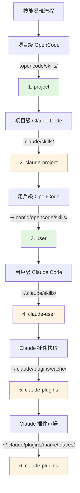

# Claude Code 技能相容性

## 學完你能做什麼

- 理解插件如何自動相容 Claude Code 技能格式
- 掌握工具對應機制，讓 Claude 技能在 OpenCode 中正確運作
- 了解技能發現的完整優先順序規則
- 復用 Claude 插件市場中的現有技能，無需重新編寫

## 你現在的困境

你已經有一些 Claude Code 的技能，或者想用 Claude 插件市場上的技能，但這些技能都是為 Claude Code 編寫的。直接在 OpenCode 中使用會遇到問題：

- Claude 技能中的工具呼叫（如 `TodoWrite`、`Task`）在 OpenCode 中不存在
- 不清楚如何讓 OpenCode 找到已安裝的 Claude 插件技能
- 擔心技能格式不相容，需要重寫所有內容

## 核心思路

OpenCode Agent Skills 插件透過**三層相容機制**，讓你無需修改即可使用 Claude Code 技能：

1. **自動發現** - 從 Claude Code 的標準目錄（`.claude/skills/`、`~/.claude/plugins/`）掃描技能
2. **工具對應** - 載入技能時自動注入工具對應指南，將 Claude 工具名轉為 OpenCode 工具名
3. **格式支援** - 同時支援 Claude 插件的 v1 和 v2 兩種安裝格式

::: info 關鍵概念
**Claude Code 技能格式** - Anthropic 定義的技能規範，使用 `SKILL.md` 檔案描述技能，包含 YAML frontmatter（中繼資料）和 Markdown 內容（指令）。
:::

### 工具對應原理

當插件檢測到載入的是 Claude Code 編寫的技能時，會自動注入工具對應指南：

| Claude Code 工具 | OpenCode 工具 | 對應規則 |
|---|---|---|
| `TodoWrite/TodoRead` | `todowrite/todoread` | 小寫 |
| `Task` (子代理) | `task` (帶 subagent_type 參數) | 改用參數 |
| `Skill` | `use_skill` | 替換工具名 |
| `Read/Write/Edit/Bash/Glob/Grep/WebFetch` | `read/write/edit/bash/glob/grep/webfetch` | 小寫 |

**對應方式**：插件在載入技能時，將對應指南作為 XML 注入到會話上下文中，AI 會自動按照對應呼叫正確的工具。

::: tip 為什麼需要對應？
Claude Code 和 OpenCode 的工具命名風格不同。Claude 使用 PascalCase（如 `TodoWrite`），OpenCode 使用小寫（如 `todowrite`）。工具對應讓 AI 知道如何轉換呼叫。
:::

### 技能發現優先順序

插件按照以下順序發現技能，**第一個匹配的技能生效**（同名技能不會重複）：



**優先順序規則**：
- 項目級技能覆蓋用戶級技能（方便項目定制）
- OpenCode 技能優先於 Claude 技能（避免混淆）
- 同名技能只保留首次發現的版本

::: details 範例：同名技能覆蓋
假設你在兩個位置都有名為 `git-helper` 的技能：
- `.claude/skills/git-helper/SKILL.md` （Claude 版本）
- `.opencode/skills/git-helper/SKILL.md` （OpenCode 版本）

**結果**：OpenCode 版本生效（優先順序更高）
:::

## 🎒 開始前的準備

- 已安裝並設定 OpenCode Agent Skills 插件
- 了解基礎技能概念（推薦先閱讀[什麼是 OpenCode Agent Skills？](../../start/what-is-opencode-agent-skills/)）
- （可選）有 Claude Code 的已安裝插件或技能

## 跟我做

### 第 1 步：檢查 Claude 技能是否被發現

**為什麼**
確認插件能正確掃描到你的 Claude Code 技能目錄。

在 OpenCode 中呼叫工具：

```
get_available_skills()
```

**你應該看到**：返回的技能列表中包含來自 `.claude/skills/`、`~/.claude/skills/`、`~/.claude/plugins/` 的技能，每個技能的 `source` 欄位顯示來源（如 `claude-project`、`claude-user`、`claude-plugins`）。

**檢查點 ✅**：確認列表中包含預期的 Claude 技能。

### 第 2 步：載入 Claude 技能

**為什麼**
驗證工具對應機制是否正常運作。

呼叫工具載入一個 Claude 技能：

```
use_skill(skill="你的技能名稱")
```

**你應該看到**：返回成功訊息，如 `Skill "xxx" loaded.`。

**檢查點 ✅**：AI 現在可以使用該技能的指令。

### 第 3 步：驗證工具對應生效

**為什麼**
確認 AI 能正確呼叫 OpenCode 的工具而非 Claude 的工具。

向 AI 提出一個需要該技能工具的任務，例如：

```
請用技能中的 todo 功能幫我建立任務列表。
```

**你應該看到**：AI 正確呼叫 OpenCode 的 `todowrite` 工具，而不是 Claude 的 `TodoWrite` 工具。

::: tip 如何驗證對應生效？
查看 AI 的工具呼叫日誌（如果啟用了除錯模式），你會看到它呼叫的是 `todowrite` 而非 `TodoWrite`。
:::

**檢查點 ✅**：工具呼叫成功，任務完成。

## 踩坑提醒

### 1. 插件格式不匹配

**問題**：舊版 Claude 插件使用 v1 格式，新版使用 v2 格式，導致某些技能無法被發現。

**原因**：v1 和 v2 的 `installed_plugins.json` 結構不同。

**解決**：插件同時支援兩種格式，無需手動轉換。如果仍無法發現技能，檢查 `~/.claude/plugins/installed_plugins.json` 是否存在且格式正確。

### 2. 工具對應未生效

**問題**：AI 仍呼叫 Claude 工具名，導致報錯。

**原因**：技能內容可能繞過了工具對應指南，或者使用了硬編碼的工具呼叫。

**解決**：
- 確認技能是載入後使用，而非直接呼叫工具
- 如果技能中有程式碼範例，手動將工具名改為 OpenCode 格式

### 3. 技能命名衝突

**問題**：同名技能在不同位置，載入的是錯誤的版本。

**原因**：技能發現優先順序導致的覆蓋。

**解決**：
- 檢查技能的 `source` 欄位，確認來源
- 使用命名空間格式明確指定來源：`use_skill(skill="user:skill-name")` 或 `use_skill(skill="claude-plugins:skill-name")`

::: details 命名空間語法
插件支援 `namespace:skill-name` 格式：
- `project:skill-name` - 專案級 OpenCode 技能
- `claude-project:skill-name` - 專案級 Claude 技能
- `user:skill-name` - 用戶級 OpenCode 技能
- `claude-user:skill-name` - 用戶級 Claude 技能
- `claude-plugins:skill-name` - Claude 插件市場技能
:::

## 本課小結

OpenCode Agent Skills 插件透過三層相容機制，讓你無縫復用 Claude Code 技能：

- **自動發現** - 從 6 個位置掃描技能，覆蓋專案級、用戶級、插件級
- **工具對應** - 自動將 Claude 工具名轉換為 OpenCode 工具名
- **格式支援** - 同時支援 v1 和 v2 兩種 Claude 插件格式

無需重寫技能，直接安裝並使用，插件會自動處理相容性問題。

## 下一課預告

> 下一課我們學習 **[Superpowers 工作流程整合](../superpowers-integration/)**。
>
> 你會學到：
> - 如何啟用 Superpowers 模式
> - Superpowers 技能的自動檢測和載入
> - 嚴格工作流程如何提升開發效率

---

## 附錄：原始碼參考

<details>
<summary><strong>點選展開查看原始碼位置</strong></summary>

> 更新時間：2026-01-24

| 功能 | 檔案路徑 | 行號 |
|---|---|---|
| 工具對應定義 | [`src/claude.ts`](https://github.com/joshuadavidthomas/opencode-agent-skills/blob/main/src/claude.ts#L19-L25) | 19-25 |
| v1/v2 格式型別定義 | [`src/claude.ts`](https://github.com/joshuadavidthomas/opencode-agent-skills/blob/main/src/claude.ts#L35-L61) | 35-61 |
| 插件安裝路徑提取 | [`src/claude.ts`](https://github.com/joshuadavidthomas/opencode-agent-skills/blob/main/src/claude.ts#L68-L77) | 68-77 |
| 發現插件技能 | [`src/claude.ts`](https://github.com/joshuadavidthomas/opencode-agent-skills/blob/main/src/claude.ts#L82-L105) | 82-105 |
| 發現市場技能 | [`src/claude.ts`](https://github.com/joshuadavidthomas/opencode-agent-skills/blob/main/src/claude.ts#L115-L180) | 115-180 |
| 發現快取技能 | [`src/claude.ts`](https://github.com/joshuadavidthomas/opencode-agent-skills/blob/main/src/claude.ts#L193-L253) | 193-253 |
| 技能發現優先順序列表 | [`src/skills.ts`](https://github.com/joshuadavidthomas/opencode-agent-skills/blob/main/src/skills.ts#L241-L254) | 241-254 |
| 同名技能去重邏輯 | [`src/skills.ts`](https://github.com/joshuadavidthomas/opencode-agent-skills/blob/main/src/skills.ts#L256-L260) | 256-260 |
| toolTranslation 匯入 | [`src/tools.ts`](https://github.com/joshuadavidthomas/opencode-agent-skills/blob/main/src/tools.ts#L15) | 15 |
| 工具對應注入 | [`src/tools.ts`](https://github.com/joshuadavidthomas/opencode-agent-skills/blob/main/src/tools.ts#L238-L249) | 238-249 |

**關鍵常數**：
- `toolTranslation`：工具對應指南 XML 字串，在載入技能時注入到會話上下文。在 `src/claude.ts:19-25` 定義，在 `src/tools.ts:15` 匯入

**關鍵函數**：
- `getPluginInstallPaths()`：從 v1/v2 格式中提取插件安裝路徑
- `discoverSkillsFromPluginDir()`：掃描插件目錄的 skills/ 子目錄
- `discoverMarketplaceSkills()`：從 `~/.claude/plugins/marketplaces/` 發現技能（優先）
- `discoverPluginCacheSkills()`：從 `~/.claude/plugins/cache/` 發現技能（作為降級方案）
- `findFile()`：遞迴搜尋指定檔案名（工具函數）

**重要流程**：
1. 插件初始化時呼叫 `discoverAllSkills()` → 遍歷 6 個發現路徑
2. 發現 Claude 插件技能時呼叫 `discoverMarketplaceSkills()` 或 `discoverPluginCacheSkills()`
3. 載入技能時，`use_skill` 工具在 XML 內容中插入 `toolTranslation`（第 244 行）

</details>
