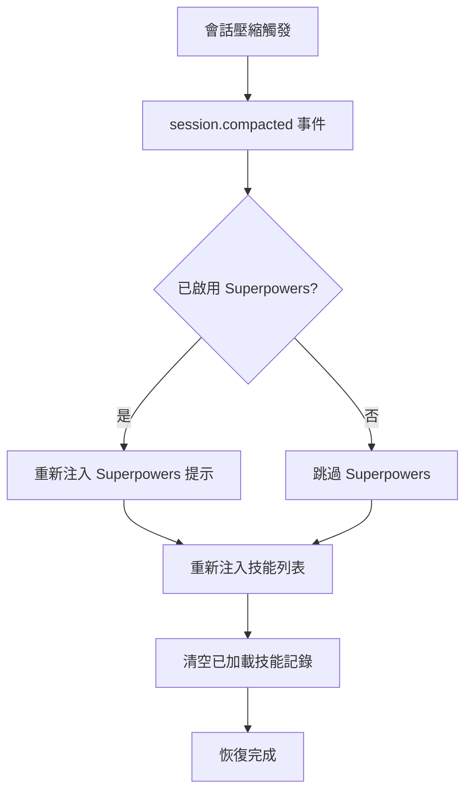

# 上下文壓縮恢復機制

## 學完你能做什麼

- 理解插件如何在會話壓縮後保持技能可用
- 知道壓縮恢復的觸發時機和執行流程
- 能夠驗證壓縮恢復是否正常工作
- 理解 synthetic 消息在恢復機制中的作用

## 你現在的困境

在長會話中，OpenCode 會執行**上下文壓縮**（Context Compaction）以節省 Token。壓縮後的會話只保留最近的消息，早期歷史記錄（包括之前注入的技能內容）會被移除。

這導致一個問題：如果技能內容被壓縮掉了，AI 就不再知道有哪些技能可用，也無法使用已加載的技能。

## 什麼時候用這一招

壓縮恢復機制是**自動運行**的，你無需手動干預。但了解它的原理後，你可以在以下場景排查問題：

- 長會話中 AI 突然"忘記"了技能
- 需要調試技能在壓縮後的可用性
- 想理解插件的會話管理策略

## 核心思路

### 什麼是上下文壓縮？

OpenCode 會話隨著消息增多會越來越長，當 Token 使用量接近上限時，系統會自動執行**上下文壓縮**：

```
[會話初始] → [消息 1] → [消息 2] → ... → [消息 50]
                          ↑ 壓縮點：只保留最近 10 條消息
```

壓縮後，早期消息（包括技能注入內容）會被移除，AI 只能看到最近的消息歷史。

### 壓縮恢復機制的工作原理

插件監聽 `session.compacted` 事件，一旦檢測到壓縮發生，立即執行以下恢復操作：



**關鍵點**：
- 恢復是**自動的**，無需手動觸發
- 恢復後的技能列表包含**所有發現的技能**（不僅僅是之前加載的）
- 已加載技能的記錄會被清空，允許 AI 重新評估需要哪些技能

### Synthetic 消息的作用

插件使用 **Synthetic Message Injection** 機制注入內容：

| 屬性 | 值 | 含義 |
|--- | --- | ---|
| `noReply` | `true` | AI 不會對注入內容本身進行回覆 |
| `synthetic` | `true` | 標記為系統生成內容，不計入用戶輸入，不在 UI 顯示 |

這意味著壓縮恢復注入的內容：
- 對用戶完全透明（看不到）
- 不消耗用戶消息配額
- 但會被 AI 讀取並理解

## 🎒 開始前的準備

本教程需要：
- 已安裝 OpenCode Agent Skills 插件
- 理解技能加載的基礎知識
- 一個長會話用於測試壓縮效果

::: tip
無需額外準備，壓縮恢復機制是插件內置功能。
:::

## 跟我做：驗證壓縮恢復效果

### 第 1 步：啟動新會話

**為什麼**
驗證會話初始化時技能列表是否正常注入

啟動一個新會話，輸入任何消息：

```
你好
```

**你應該看到**：AI 正常回覆，並在後台自動注入了技能列表（對用戶不可見）

### 第 2 步：加載一個技能

**為什麼**
確保技能內容被注入到上下文

調用 `use_skill` 工具：

```
使用 get_available_skills 查看可用技能，然後用 use_skill 加載其中一個技能
```

**你應該看到**：AI 列出可用技能，然後加載你選擇的技能

### 第 3 步：觸發上下文壓縮

**為什麼**
模擬長會話場景，觸發 OpenCode 的壓縮機制

持續發送消息，模擬長對話：

```
消息 1：測試內容
消息 2：繼續測試
...
（重複發送 20-30 條消息）
```

**你應該看到**：
- 隨著消息增多，會話歷史變長
- 達到一定長度後，OpenCode 自動執行壓縮
- 壓縮後，早期消息（包括技能注入）被移除

### 第 4 步：檢查恢復效果

**為什麼**
驗證壓縮後技能列表是否被重新注入

壓縮後，再次讓 AI 使用技能：

```
幫我使用 git-helper 技能創建新分支（假設你已安裝 git-helper 技能）
```

**你應該看到**：
- AI 仍然知道有哪些技能可用（證明技能列表已恢復）
- AI 能夠正常加載和使用技能（證明技能功能未受壓縮影響）

### 第 5 步：驗證 Synthetic 消息注入

**為什麼**
確認恢復機制使用的是 synthetic 消息，不會干擾對話

如果插件支持，可以檢查會話消息歷史（取決於 OpenCode 功能）：

```
使用調試工具查看會話消息歷史
```

**你應該看到**：
- 恢復的技能列表消息標記為 `synthetic: true`
- 這些消息不會顯示在正常對話界面

## 檢查點 ✅

完成上述步驟後，你應該能夠確認：

- [ ] 長會話中 AI 仍能訪問技能列表
- [ ] 壓縮後技能加載功能正常工作
- [ ] 恢復過程對用戶完全透明

## 踩坑提醒

### 問題 1：壓縮後 AI 說"找不到技能"

**可能原因**：
- 插件未正確監聽 `session.compacted` 事件
- 技能目錄路徑發生變化

**解決方法**：

1. **驗證壓縮事件是否觸發**
   - 通過「跟我做」中的第 3 步和第 4 步，確認壓縮後 AI 仍能訪問技能列表
   - 如果 AI 能正常使用技能，說明壓縮恢復機制工作正常

2. **檢查插件是否正確加載**
   - 重啟 OpenCode
   - 啟動新會話後，讓 AI 列出可用技能（`get_available_skills`）
   - 如果能看到技能列表，說明插件已正確加載

### 問題 2：恢復的技能列表為空

**可能原因**：
- 技能發現路徑中沒有技能
- 技能文件格式錯誤

**解決方法**：
```bash
# 手動查詢可用技能
使用 get_available_skills 查看技能列表
```

如果返回空列表，檢查技能目錄和文件格式。

### 問題 3：壓縮後已加載技能狀態丟失

**這是預期行為**，不是 Bug。恢復機制會清空 `loadedSkillsPerSession` 記錄，允許 AI 重新評估需要哪些技能。

**解決方法**：AI 會根據上下文自動決定是否重新加載技能，無需手動干預。

## 本課小結

壓縮恢復機制通過以下方式確保技能在長會話中的可用性：

1. **監聽壓縮事件**：自動檢測 `session.compacted` 事件
2. **重新注入技能列表**：使用 `<available-skills>` 標籤注入所有技能
3. **可選 Superpowers 恢復**：如果啟用，同時恢復 Superpowers 提示
4. **使用 Synthetic 消息**：恢復過程對用戶透明，不影響對話
5. **重置已加載記錄**：清空已加載技能集合，允許重新評估

這套機制確保了：
- 長會話中技能始終可用
- 恢復過程自動化且無感知
- AI 可以根據最新上下文決定使用哪些技能

## 下一課預告

> 下一課我們學習 **[常見問題排查](../../faq/troubleshooting/)**。
>
> 你會學到：
> - 常見錯誤和異常的處理方法
> - 壓縮恢復相關的排查技巧
> - 其他使用問題的解決方案

---

## 附錄：源碼參考

<details>
<summary><strong>點擊展開查看源碼位置</strong></summary>

> 更新時間：2026-01-24

| 功能        | 文件路徑                                                                                    | 行號    |
|--- | --- | ---|
| 壓縮事件監聽 | [`src/plugin.ts`](https://github.com/joshuadavidthomas/opencode-agent-skills/blob/main/src/plugin.ts#L144-L157) | 144-157 |
| 首次消息初始化 | [`src/plugin.ts`](https://github.com/joshuadavidthomas/opencode-agent-skills/blob/main/src/plugin.ts#L70-L105) | 70-105 |
| 技能列表注入 | [`src/skills.ts`](https://github.com/joshuadavidthomas/opencode-agent-skills/blob/main/src/skills.ts#L345-L370) | 345-370 |
| Synthetic 消息注入 | [`src/utils.ts`](https://github.com/joshuadavidthomas/opencode-agent-skills/blob/main/src/utils.ts#L147-L162) | 147-162 |
| 會話狀態管理 | [`src/plugin.ts`](https://github.com/joshuadavidthomas/opencode-agent-skills/blob/main/src/plugin.ts#L25-L35) | 25-35 |

**關鍵變量**：
- `setupCompleteSessions: Set<string>`：記錄已完成初始化的會話 ID
- `loadedSkillsPerSession: Map<string, Set<string>>`：記錄每個會話已加載的技能名稱

**關鍵函數**：
- `injectSkillsList()`：注入可用技能列表到會話
- `injectSyntheticContent()`：使用 synthetic 消息注入內容
- `getSessionContext()`：獲取會話的 model 和 agent 信息

</details>
