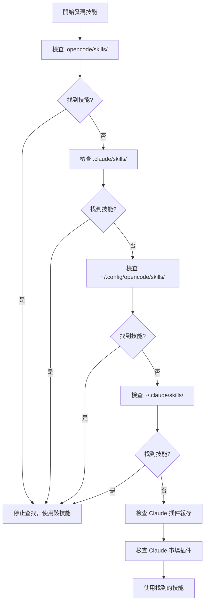

# 技能發現機制詳解

## 學完你能做什麼

- 理解插件從哪些位置自動發現技能
- 掌握技能發現的優先級規則
- 知道如何讓項目級技能覆蓋用戶級技能
- 了解 Claude Code 技能兼容機制

## 你現在的困境

你創建了技能，但 AI 一直說「找不到技能」。你不知道插件會在哪些地方查找技能，也不知道同名技能會發生什麼。結果就是技能放錯了位置，或者被其他位置的技能覆蓋了。

## 什麼時候用這一招

- 需要讓某個技能在項目中生效時
- 想覆蓋用戶級或插件自帶的技能時
- 複用 Claude Code 的技能時

## 🎒 開始前的準備

::: warning 前置知識
請先完成 [安裝 OpenCode Agent Skills](../../start/installation/)。
:::

## 核心思路

OpenCode Agent Skills 會從多個位置自動發現技能，按優先級順序查找。**第一個找到的技能生效，後續同名技能被忽略**。這讓你可以在項目中覆蓋用戶級技能，實現定制化。

### 發現路徑總覽



::: info 技能名稱唯一性
同名技能只會保留第一個發現的，後續的被忽略。這意味著項目級的 `git-helper` 會覆蓋用戶級的 `git-helper`。
:::

## 跟我做

### 第 1 步：查看技能發現邏輯

**為什麼**
了解插件是如何掃描技能目錄的，能幫你定位問題。

查看源碼中的發現路徑定義：

```typescript
// src/skills.ts:241-246
const discoveryPaths: DiscoveryPath[] = [
  { path: path.join(directory, '.opencode', 'skills'), label: 'project', maxDepth: 3 },
  { path: path.join(directory, '.claude', 'skills'), label: 'claude-project', maxDepth: 1 },
  { path: path.join(homedir(), '.config', 'opencode', 'skills'), label: 'user', maxDepth: 3 },
  { path: path.join(homedir(), '.claude', 'skills'), label: 'claude-user', maxDepth: 1 }
];
```

**你應該看到**：
- 4 個本地發現路徑，每個都有 `label`（來源標識）和 `maxDepth`（最大遞歸深度）
- 還有 2 個 Claude 插件路徑（緩存和市場插件），通過 `discoverPluginCacheSkills()` 和 `discoverMarketplaceSkills()` 發現
- `directory` 是項目根目錄，`homedir()` 是用戶主目錄

### 第 2 步：了解遞歸搜索機制

**為什麼**
理解遞歸深度限制，能幫你避免把技能放太深導致找不到。

遞歸搜索函數會遍歷目錄樹，查找 `SKILL.md` 文件：

```typescript
// src/skills.ts:182-207
async function recurse(dir: string, depth: number, relPath: string) {
  if (depth > maxDepth) return;  // 超過深度限制，停止搜索

  const entries = await fs.readdir(dir, { withFileTypes: true });
  for (const entry of entries) {
    const fullPath = path.join(dir, entry.name);
    const stats = await fs.stat(fullPath);

    if (!stats.isDirectory()) continue;  // 跳過文件

    const newRelPath = relPath ? `${relPath}/${entry.name}` : entry.name;
    const found = await findFile(fullPath, newRelPath, 'SKILL.md');

    if (found) {
      results.push({ ...found, label });  // 找到技能，添加結果
    } else {
      await recurse(fullPath, depth + 1, newRelPath);  // 遞歸搜索子目錄
    }
  }
}
```

**你應該看到**：
- 每個目錄深度從 0 開始，超過 `maxDepth` 就停止
- 找到 `SKILL.md` 就返回，否則繼續搜索子目錄

**不同位置的遞歸深度**：

| 位置                | Label           | 最大深度 | 說明                       |
|--- | --- | --- | ---|
| `.opencode/skills/` | project         | 3        | 支持嵌套目錄結構           |
| `.claude/skills/`   | claude-project  | 1        | 只掃描第一層               |
| `~/.config/opencode/skills/` | user   | 3        | 支持嵌套目錄結構           |
| `~/.claude/skills/` | claude-user     | 1        | 只掃描第一層               |

### 第 3 步：理解去重規則

**為什麼**
同名技能只會保留一個，知道這個規則能避免技能被覆蓋。

去重邏輯在 `discoverAllSkills` 函數中：

```typescript
// src/skills.ts:255-262
const skillsByName = new Map<string, Skill>();
for (const { filePath, relativePath, label } of allResults) {
  const skill = await parseSkillFile(filePath, relativePath, label);
  if (!skill || skillsByName.has(skill.name)) continue;  // 跳過已存在的同名技能
  skillsByName.set(skill.name, skill);
}
```

**你應該看到**：
- 使用 `Map` 按 `skill.name` 存儲，確保唯一性
- `skillsByName.has(skill.name)` 檢查是否已存在同名技能
- 後續同名技能被忽略（`continue`）

**場景示例**：

```
項目結構：
.opencode/skills/git-helper/SKILL.md  ← 第一個發現，生效
~/.config/opencode/skills/git-helper/SKILL.md  ← 同名，被忽略
```

### 第 4 步：解析 SKILL.md 文件

**為什麼**
了解 SKILL.md 的解析規則，能幫你避免格式錯誤。

插件會解析 SKILL.md 的 YAML frontmatter：

```typescript
// src/skills.ts:132-152
const frontmatterMatch = content.match(/^---\n([\s\S]*?)\n---\n([\s\S]*)$/);
if (!frontmatterMatch?.[1] || !frontmatterMatch?.[2]) {
  return null;  // 格式錯誤，跳過
}

const frontmatterText = frontmatterMatch[1];
const skillContent = frontmatterMatch[2].trim();

let frontmatterObj: unknown;
try {
  frontmatterObj = parseYamlFrontmatter(frontmatterText);
} catch {
  return null;  // YAML 解析失敗，跳過
}

let frontmatter: SkillFrontmatter;
try {
  frontmatter = SkillFrontmatterSchema.parse(frontmatterObj);
} catch (error) {
  return null;  // 驗證失敗，跳過
}
```

**你應該看到**：
- Frontmatter 必須用 `---` 包圍
- YAML 內容必須符合 Zod Schema 驗證
- 解析失敗的技能會被忽略（不報錯，繼續發現其他技能）

**Frontmatter 驗證規則**：

```typescript
// src/skills.ts:106-114
const SkillFrontmatterSchema = z.object({
  name: z.string()
    .regex(/^[\p{Ll}\p{N}-]+$/u, { message: "Name must be lowercase alphanumeric with hyphens" })
    .min(1, { message: "Name cannot be empty" }),
  description: z.string()
    .min(1, { message: "Description cannot be empty" }),
  license: z.string().optional(),
  "allowed-tools": z.array(z.string()).optional(),
  metadata: z.record(z.string(), z.string()).optional()
});
```

**名稱規範**：
- 只允許小寫字母、數字、連字符（`-`）
- 不允許空格、大寫字母、下劃線

| ❌ 錯誤的技能名稱  | ✅ 正確的技能名稱 |
|--- | ---|
| `MySkill`        | `my-skill`       |
| `git_helper`     | `git-helper`     |
| `Git Helper`     | `git-helper`     |

### 第 5 步：發現可執行腳本

**為什麼**
技能可以包含自動化腳本，了解腳本發現機制能幫你正確配置。

插件會遞歸掃描技能目錄，查找可執行文件：

```typescript
// src/skills.ts:61-93
const scripts: Script[] = [];
const skipDirs = new Set(['node_modules', '__pycache__', '.git', '.venv', 'venv', '.tox', '.nox']);

async function recurse(dir: string, depth: number, relPath: string) {
  if (depth > maxDepth) return;

  const entries = await fs.readdir(dir, { withFileTypes: true });
  for (const entry of entries) {
    if (entry.name.startsWith('.')) continue;  // 跳過隱藏目錄
    if (skipDirs.has(entry.name)) continue;    // 跳過依賴目錄

    const fullPath = path.join(dir, entry.name);
    const stats = await fs.stat(fullPath);

    if (stats.isDirectory()) {
      await recurse(fullPath, depth + 1, newRelPath);
    } else if (stats.isFile()) {
      if (stats.mode & 0o111) {  // 檢查可執行位
        scripts.push({
          relativePath: newRelPath,
          absolutePath: fullPath
        });
      }
    }
  }
}
```

**你應該看到**：
- 只掃描有可執行位（`0o111`）的文件
- 自動跳過隱藏目錄和常見依賴目錄
- 最大遞歸深度為 10 層

**腳本發現規則**：

| 規則              | 說明                                    |
|--- | ---|
| 可執行位檢查      | 文件必須有執行權限（`chmod +x`）       |
| 跳過隱藏目錄      | 不掃描 `.git`、`.venv` 等目錄           |
| 跳過依賴目錄      | 不掃描 `node_modules`、`__pycache__` 等 |
| 最大深度 10 層    | 超過 10 層的嵌套不會被掃描              |

### 第 6 步：兼容 Claude Code 插件

**為什麼**
了解 Claude Code 插件兼容機制，能幫你複用現有技能。

插件會掃描 Claude Code 的插件緩存和市場安裝目錄：

```typescript
// src/claude.ts:115-145
async function discoverMarketplaceSkills(): Promise<LabeledDiscoveryResult[]> {
  const claudeDir = path.join(homedir(), ".claude", "plugins");
  const installedPath = path.join(claudeDir, "installed_plugins.json");

  let installed: InstalledPlugins;
  try {
    const content = await fs.readFile(installedPath, "utf-8");
    installed = JSON.parse(content);
  } catch {
    return [];
  }

  const isV2 = installed.version === 2;

  for (const pluginKey of Object.keys(installed.plugins || {})) {
    const pluginData = installed.plugins[pluginKey];
    if (!pluginData) continue;

    if (isV2 || Array.isArray(pluginData)) {
      // v2 format: use installPath directly from each installation entry
      const installPaths = getPluginInstallPaths(pluginData);
      for (const installPath of installPaths) {
        const skills = await discoverSkillsFromPluginDir(installPath);
        results.push(...skills);
      }
    } else {
      // v1 format: use marketplace manifest to find skills
      // ...
    }
  }
}
```

**你應該看到**：
- 讀取 Claude Code 的 `installed_plugins.json` 文件
- 支持 v1 和 v2 兩種插件格式
- 從插件安裝路徑掃描 `SKILL.md` 文件

**Claude Code 插件結構**：

Cache 目錄結構（插件緩存）：

```
~/.claude/plugins/
├── cache/                    # 插件緩存
│   ├── plugin-name/         # v1 結構
│   │   └── skills/
│   │       └── skill-name/SKILL.md
│   └── marketplace-name/    # v2 結構
│       └── plugin-name/
│           └── version/
│               └── skills/
│                   └── skill-name/SKILL.md
└── installed_plugins.json   # 插件安裝清單
```

**市場插件（v2）**：
- 插件的實際路徑從 `installed_plugins.json` 的 `installPath` 字段讀取
- 路徑不固定，可能是 `managed`、`user`、`project` 或 `local` 作用域的任意位置
- 每個插件目錄下有 `skills/` 子目錄，包含各個技能

## 檢查點 ✅

驗證你掌握了技能發現機制：

- [ ] 知道 6 個技能發現路徑的優先級順序
- [ ] 理解同名技能只會保留第一個發現的
- [ ] 知道不同位置的遞歸深度限制
- [ ] 了解 SKILL.md 的驗證規則
- [ ] 知道如何讓項目級技能覆蓋用戶級技能

## 踩坑提醒

### ❌ 技能放錯位置

**問題**：技能放在 `~/.config/opencode/skills/`，但項目中有同名技能，導致被覆蓋。

**解決**：將項目特定技能放在 `.opencode/skills/`，確保優先級最高。

### ❌ 技能名稱不符合規範

**問題**：SKILL.md 中的 `name` 字段包含大寫字母或空格，導致解析失敗。

**解決**：確保技能名稱符合 `lowercase-alphanumeric-with-hyphens` 規範，如 `git-helper`。

### ❌ 腳本沒有執行權限

**問題**：技能腳本無法被 `run_skill_script` 工具執行。

**解決**：為腳本添加執行權限：
```bash
chmod +x tools/build.sh
```

### ❌ 技能放太深導致找不到

**問題**：技能放在 `~/.config/opencode/skills/category/subcategory/skill/`，超過遞歸深度限制。

**解決**：確保技能目錄深度不超過對應位置的 `maxDepth` 限制。

## 本課小結

OpenCode Agent Skills 從多個位置自動發現技能，按優先級順序查找：

1. **優先級順序**（從高到低）：`.opencode/skills/` → `.claude/skills/` → `~/.config/opencode/skills/` → `~/.claude/skills/` → Claude 插件緩存（`~/.claude/plugins/cache/`）→ Claude 市場插件（從 `installed_plugins.json` 讀取安裝路徑）

2. **去重規則**：同名技能只保留第一個發現的，項目級技能會覆蓋用戶級技能。

3. **遞歸深度**：不同位置的遞歸深度不同，技能放太深可能找不到。

4. **格式驗證**：SKILL.md 的 frontmatter 必須符合 Zod Schema 驗證，否則被忽略。

5. **腳本發現**：只有有可執行位的文件才會被識別為腳本。

## 下一課預告

> 下一課我們學習 **[查詢和列出可用技能](../listing-available-skills/)**。
>
> 你會學到：
> - 使用 `get_available_skills` 工具查看所有可用技能
> - 了解技能命名空間的使用方法
> - 如何用模糊匹配查找技能

---

## 附錄：源碼參考

<details>
<summary><strong>點擊展開查看源碼位置</strong></summary>

> 更新時間：2026-01-24

| 功能           | 文件路徑                                                                                      | 行號    |
|--- | --- | ---|
| 發現路徑定義   | [`src/skills.ts`](https://github.com/joshuadavidthomas/opencode-agent-skills/blob/main/src/skills.ts#L241-L246)     | 241-246 |
| 發現所有技能   | [`src/skills.ts`](https://github.com/joshuadavidthomas/opencode-agent-skills/blob/main/src/skills.ts#L240-L263)     | 240-263 |
| 遞歸搜索技能   | [`src/skills.ts`](https://github.com/joshuadavidthomas/opencode-agent-skills/blob/main/src/skills.ts#L176-L218)     | 176-218 |
| SkillLabel 枚舉 | [`src/skills.ts`](https://github.com/joshuadavidthomas/opencode-agent-skills/blob/main/src/skills.ts#L30)              | 30      |
| 去重邏輯       | [`src/skills.ts`](https://github.com/joshuadavidthomas/opencode-agent-skills/blob/main/src/skills.ts#L255-L262)     | 255-262 |
| Frontmatter 解析 | [`src/skills.ts`](https://github.com/joshuadavidthomas/opencode-agent-skills/blob/main/src/skills.ts#L122-L167)      | 122-167 |
| Schema 驗證    | [`src/skills.ts`](https://github.com/joshuadavidthomas/opencode-agent-skills/blob/main/src/skills.ts#L105-L114)     | 105-114 |
| 腳本發現       | [`src/skills.ts`](https://github.com/joshuadavidthomas/opencode-agent-skills/blob/main/src/skills.ts#L59-L99)       | 59-99   |
| Claude 市場插件發現 | [`src/claude.ts`](https://github.com/joshuadavidthomas/opencode-agent-skills/blob/main/src/claude.ts#L115-L180)     | 115-180 |
| Claude 緩存插件發現 | [`src/claude.ts`](https://github.com/joshuadavidthomas/opencode-agent-skills/blob/main/src/claude.ts#L193-L253)     | 193-253 |

**關鍵常量**：
- `maxDepth`（不同位置不同值）：遞歸深度限制

**關鍵函數**：
- `discoverAllSkills()`: 從所有路徑發現技能
- `findSkillsRecursive()`: 遞歸搜索技能目錄
- `parseSkillFile()`: 解析 SKILL.md 文件
- `discoverMarketplaceSkills()`: 發現 Claude 市場插件
- `discoverPluginCacheSkills()`: 發現 Claude 緩存插件

</details>
