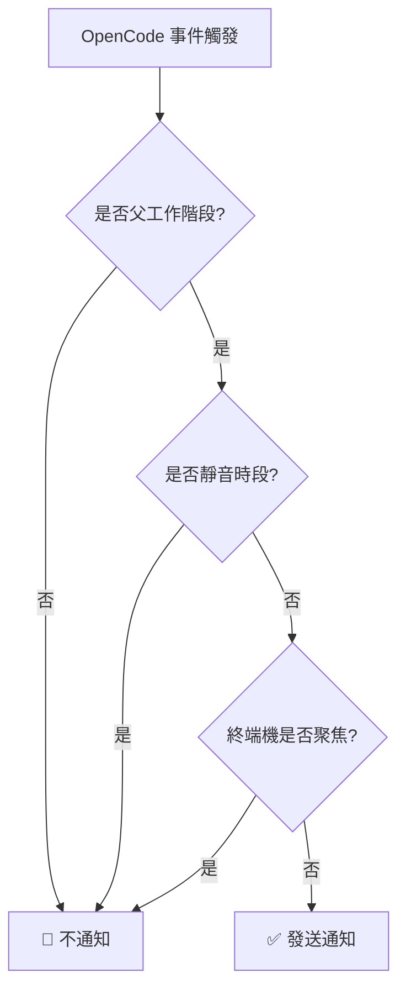

# 靜音時段詳解：避免特定時間段打擾

## 學完你能做什麼

- 在配置檔中啟用靜音時段，避免在休息時間被打擾
- 理解靜音時段的工作原理和時間計算邏輯
- 配置跨午夜時間段（如 22:00 - 08:00）
- 了解靜音時段與其他智慧過濾機制的優先順序關係

## 你現在的困境

你可能遇到過這種情況：晚上 10 點委託了一個任務給 AI，然後去休息了。結果半夜 2 點 AI 完成了任務，「叮」的一聲通知把你吵醒。或者你在午休時讓 AI 處理一些檔案，結果 12:05 通知響了，打斷了你的休息。

::: info 什麼是靜音時段
靜音時段是一個時間段配置，在這個時間段內，opencode-notify 會停止發送所有通知，避免在你不希望被打擾的時間收到提醒。
:::

## 什麼時候用這一招

- **夜間休息**：設定 22:00 - 08:00，避免睡覺時被打擾
- **午休時間**：設定 12:00 - 13:00，避免中午休息時被打擾
- **專注工作時間**：設定 09:00 - 12:00，避免開會時被通知打斷
- **週末不工作**：設定整個週末為靜音時段

靜音時段最適合用來保護你的休息時間或專注工作時間，讓 AI 在背景默默完成任務，等你準備好再來檢查結果。

## 核心思路

靜音時段的工作原理很簡單：

1. **時間檢查**：每次需要發送通知前，外掛程式檢查目前時間是否在配置的靜音時段內
2. **時間段支援**：支援任意時間段，包括跨午夜的時間段（如 22:00 - 08:00）
3. **優先順序中等**：靜音時段的檢查優先順序低於父工作階段檢查，但高於終端機焦點偵測。如果目前是子工作階段且 `notifyChildSessions` 為 false，會直接跳過靜音時段檢查。

::: tip 靜音時段 vs 臨時停用
靜音時段是**定期重複**的時間配置，比如每天的晚上 10 點到早上 8 點。如果你想**臨時停用**通知（比如接下來 1 小時不想要通知），可以在配置檔中設定 `"enabled": false`，或者刪除配置檔返回預設值。
:::

## 跟我做

### 第 1 步：開啟配置檔

配置檔位於：`~/.config/opencode/kdco-notify.json`

如果檔案不存在，你可以先建立它：

::: code-group

```bash [macOS/Linux]
vim ~/.config/opencode/kdco-notify.json
```

```powershell [Windows]
notepad $env:USERPROFILE\.config\opencode\kdco-notify.json
```

:::

你應該看到配置檔內容（如果存在），或者一個空白檔案。

### 第 2 步：新增靜音時段配置

在配置檔中新增或修改 `quietHours` 部分：

```json
{
  "quietHours": {
    "enabled": true,
    "start": "22:00",
    "end": "08:00"
  }
}
```

**配置項說明**：

| 配置項 | 類型 | 預設值 | 說明 |
| --- | --- | --- | --- |
| `enabled` | boolean | `false` | 是否啟用靜音時段 |
| `start` | string | `"22:00"` | 靜音開始時間，格式為 `"HH:MM"` |
| `end` | string | `"08:00"` | 靜音結束時間，格式為 `"HH:MM"` |

### 第 3 步：儲存配置檔

儲存檔案並退出編輯器。

**檢查點 ✅**：執行以下命令驗證配置檔格式是否正確：

```bash
cat ~/.config/opencode/kdco-notify.json | jq .
```

你應該看到格式化的 JSON 內容，沒有錯誤提示。

::: tip 沒有安裝 jq？
如果系統沒有 `jq` 命令，可以跳過此檢查，或者在瀏覽器中複製 JSON 內容到 [JSON 驗證器](https://jsonlint.com/) 檢查。
:::

### 第 4 步：重新啟動 OpenCode

配置檔修改後，需要重新啟動 OpenCode 才能生效。

**檢查點 ✅**：重新啟動後，OpenCode 會自動重新載入配置。

### 第 5 步：測試靜音時段

為了驗證靜音時段是否生效，你可以：

1. 將 `start` 和 `end` 設定為目前時間附近的值（比如現在是 14:00，設定為 13:55 - 14:05）
2. 委託一個簡單的任務給 AI
3. 等待任務完成

你應該看到：**在靜音時段內，不會收到任何通知**。

**注意**：如果目前時間不在靜音時段內，或者 `enabled` 為 `false`，你會正常收到通知。

### 第 6 步：恢復為常用配置

測試完成後，將配置改回常用的時間段（比如 22:00 - 08:00）：

```json
{
  "quietHours": {
    "enabled": true,
    "start": "22:00",
    "end": "08:00"
  }
}
```

儲存配置檔並重新啟動 OpenCode。

## 踩坑提醒

### 常見錯誤 1：忘記啟用靜音時段

**問題**：配置了 `start` 和 `end`，但仍然收到通知。

**原因**：`enabled` 欄位為 `false` 或未設定。

**解決方案**：確保 `enabled` 設定為 `true`：

```json
{
  "quietHours": {
    "enabled": true,
    "start": "22:00",
    "end": "08:00"
  }
}
```

### 常見錯誤 2：時間格式錯誤

**問題**：配置後不生效，或者啟動時報錯。

**原因**：時間格式不是 `"HH:MM"` 格式，或者使用了 12 小時制（AM/PM）。

**錯誤範例**：
```json
{
  "start": "10 PM",  // ❌ 錯誤：不支援 AM/PM
  "end": "8:00"      // ⚠️ 可以工作，但建議使用 "08:00" 保持一致性
}
```

**正確範例**：
```json
{
  "start": "22:00",  // ✅ 正確：24 小時制，推薦使用前導零
  "end": "08:00"     // ✅ 正確：24 小時制，推薦使用前導零
}
```

### 常見錯誤 3：跨午夜時間理解錯誤

**問題**：設定了 22:00 - 08:00，但發現白天某些時間段也被靜音了。

**原因**：誤以為 `start` 必須小於 `end`，導致時間段計算錯誤。

**正確理解**：
- 22:00 - 08:00 表示：**晚上 10 點到次日早上 8 點**
- 這是一個跨午夜的時間段，外掛程式會自動識別
- 不是 08:00 - 22:00（這樣設定的話，整個白天都會被靜音）

::: tip 跨午夜時間段的驗證
如果你想驗證跨午夜時間段是否正確配置，可以在配置檔中設定一個短的測試時段（比如 10 分鐘），然後觀察是否在預期的時間段內不收到通知。
:::

### 常見錯誤 4：未重新啟動 OpenCode

**問題**：修改配置檔後，靜音時段仍然按照舊配置工作。

**原因**：配置檔在外掛程式啟動時載入一次，不會即時監聽檔案變化。

**解決方案**：每次修改配置檔後，必須重新啟動 OpenCode 才能生效。

## 靜音時段與其他過濾機制的關係

靜音時段在智慧過濾機制中的位置：



**關鍵點**：

1. **靜音時段優先順序中等**：父工作階段檢查優先順序最高，靜音時段次之。如果目前是子工作階段且 `notifyChildSessions` 為 false，會直接跳過靜音時段檢查。但通過父工作階段檢查後，無論終端機是否聚焦，只要在靜音時段內，就不會發送通知。
2. **與終端機焦點偵測無關**：即使終端機未聚焦，在靜音時段內也不會發送通知
3. **執行順序**：父工作階段檢查先於靜音時段執行。如果父工作階段檢查通過（即目前是父工作階段或 `notifyChildSessions` 為 true），才會繼續檢查靜音時段。

::: warning 特殊情況：權限請求和問題詢問
權限請求（`permission.updated`）和問題詢問（`tool.execute.before`）在原始碼中**也受靜音時段約束**。這意味著在靜音時段內，即使 AI 被阻塞等待你的授權或回答，也不會發送通知。
:::

## 常用配置範例

### 範例 1：夜間休息

配置晚上 10 點到早上 8 點為靜音時段：

```json
{
  "quietHours": {
    "enabled": true,
    "start": "22:00",
    "end": "08:00"
  }
}
```

### 範例 2：午休時間

配置中午 12 點到下午 1 點為靜音時段：

```json
{
  "quietHours": {
    "enabled": true,
    "start": "12:00",
    "end": "13:00"
  }
}
```

### 範例 3：專注工作時間

配置上午 9 點到中午 12 點為靜音時段（比如在開會時不被通知打擾）：

```json
{
  "quietHours": {
    "enabled": true,
    "start": "09:00",
    "end": "12:00"
  }
}
```

### 範例 4：完整配置

將靜音時段與其他配置項一起使用：

```json
{
  "enabled": true,
  "notifyChildSessions": false,
  "suppressWhenFocused": true,
  "sounds": {
    "idle": "Glass",
    "error": "Basso",
    "permission": "Submarine"
  },
  "quietHours": {
    "enabled": true,
    "start": "22:00",
    "end": "08:00"
  },
  "terminal": "ghostty"
}
```

## 本課小結

靜音時段是 opencode-notify 的一個重要功能，用於避免在特定時間段被打擾：

1. **配置方式**：在 `~/.config/opencode/kdco-notify.json` 中配置 `quietHours` 部分
2. **時間格式**：使用 24 小時制的 `"HH:MM"` 格式，如 `"22:00"` 和 `"08:00"`
3. **跨午夜支援**：支援跨午夜的時間段，如 `"22:00" - "08:00"` 表示晚上 10 點到次日早上 8 點
4. **執行順序**：父工作階段檢查 → 靜音時段 → 終端機焦點偵測。靜音時段在通過父工作階段檢查後才會生效
5. **需要重新啟動**：修改配置檔後必須重新啟動 OpenCode 才能生效

透過合理配置靜音時段，你可以讓 AI 在休息時間或專注工作時默默完成任務，等準備好再來檢查結果。

## 下一課預告

> 下一課我們學習 **[終端機偵測原理](../terminal-detection/)**。
>
> 你會學到：
> - opencode-notify 如何自動偵測你使用的終端機
> - 支援的 37+ 終端機模擬器清單
> - 手動指定終端機類型的方法
> - macOS 焦點偵測的實作原理

---

## 附錄：原始碼參考

<details>
<summary><strong>點選展開查看原始碼位置</strong></summary>

> 更新時間：2026-01-27

| 功能 | 檔案路徑 | 行號 |
| --- | --- | --- |
| 靜音時段檢查 | [`src/notify.ts`](https://github.com/kdcokenny/opencode-notify/blob/main/src/notify.ts#L181-L199) | 181-199 |
| 配置介面定義 | [`src/notify.ts`](https://github.com/kdcokenny/opencode-notify/blob/main/src/notify.ts#L30-L48) | 30-48 |
| 預設配置 | [`src/notify.ts`](https://github.com/kdcokenny/opencode-notify/blob/main/src/notify.ts#L56-L68) | 56-68 |
| 任務完成處理中的靜音檢查 | [`src/notify.ts`](https://github.com/kdcokenny/opencode-notify/blob/main/src/notify.ts#L262) | 262 |
| 錯誤通知處理中的靜音檢查 | [`src/notify.ts`](https://github.com/kdcokenny/opencode-notify/blob/main/src/notify.ts#L300) | 300 |
| 權限請求處理中的靜音檢查 | [`src/notify.ts`](https://github.com/kdcokenny/opencode-notify/blob/main/src/notify.ts#L323) | 323 |
| 問題詢問處理中的靜音檢查 | [`src/notify.ts`](https://github.com/kdcokenny/opencode-notify/blob/main/src/notify.ts#L341) | 341 |

**關鍵常數**：

- `DEFAULT_CONFIG.quietHours`：預設靜音時段配置（第 63-67 行）
  - `enabled: false`：預設不啟用靜音時段
  - `start: "22:00"`：預設靜音開始時間
  - `end: "08:00"`：預設靜音結束時間

**關鍵函式**：

- `isQuietHours(config: NotifyConfig): boolean`：檢查目前時間是否在靜音時段內（第 181-199 行）
  - 首先檢查 `config.quietHours.enabled` 是否為 `true`
  - 將目前時間轉換為分鐘數
  - 將開始和結束時間轉換為分鐘數
  - 處理跨午夜時間段（`startMinutes > endMinutes`）
  - 返回 `true` 表示在靜音時段內，`false` 表示不在

**業務規則**：

- BR-1-3：靜音時段內不發送通知（`notify.ts:262`）
- BR-3-2：靜音時段支援跨午夜（如 22:00-08:00）（`notify.ts:193-196`）
- BR-4-1：目前時間在靜音時段內時不發送通知（`notify.ts:182-198`）
- BR-4-2：支援跨午夜時段（如 22:00-08:00）（`notify.ts:194-196`）

</details>
