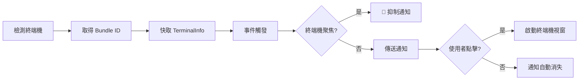
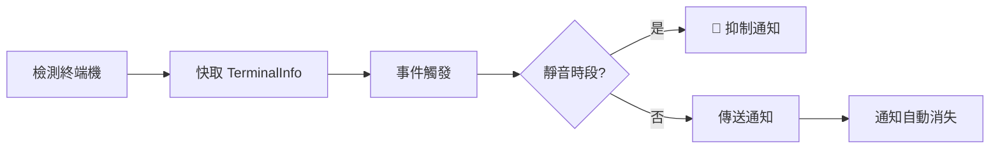

# 終端機檢測原理：自動識別機制與 macOS 焦點檢測詳解

## 學完你能做什麼

- 深入理解終端機自動檢測的工作機制和實作原理
- 掌握 macOS 焦點檢測和 Bundle ID 動態取得的技術細節
- 學會手動覆寫終端機類型以解決檢測失敗問題
- 了解不同平台（macOS/Windows/Linux）的檢測差異
- 看懂終端機檢測相關的原始碼實作

## 你現在的困境

你已經知道 opencode-notify 支援 37+ 終端機，也知道可以手動指定終端機類型。但你想深入了解：

- 終端機檢測是如何在底層實作的？
- macOS 的焦點檢測是透過什麼機制實作的？
- 為什麼 macOS 需要取得 Bundle ID，而 Windows/Linux 不需要？
- 自動檢測失敗時，外掛程式是如何處理的？
- tmux 等終端機多工器是如何被識別的？

本課將帶你深入原始碼，解答這些技術細節。

## 核心思路

終端機檢測的實作分為三個層次：

```
1. 自動檢測層：detect-terminal 函式庫識別終端機類型
    ↓
2. 平台適配層：macOS/Windows/Linux 特定處理
    ↓
3. 功能增強層：焦點檢測、點擊聚焦、Bundle ID 取得
```

**關鍵設計原則**：

- **啟動時檢測一次**：外掛程式啟動時檢測終端機，快取結果用於後續所有通知（效能最佳化）
- **設定覆寫優先**：手動指定的 `terminal` 設定優先於自動檢測
- **失敗降級處理**：檢測失敗時不阻止通知傳送，只是停用智慧過濾功能
- **平台差異適配**：macOS 支援完整功能，Windows/Linux 支援基礎通知

::: info 為什麼要啟動時檢測？
終端機檢測涉及程序掃描、osascript 呼叫等操作，如果每次通知前都檢測，會帶來顯著效能開銷。因此外掛程式在啟動時檢測一次，快取 `TerminalInfo` 物件，後續所有通知複用這個快取。
:::

## 終端機檢測的完整流程

### 原始碼分析：detectTerminalInfo()

讓我們逐行分析核心檢測函式：

```typescript
// src/notify.ts:145-164
async function detectTerminalInfo(config: NotifyConfig): Promise<TerminalInfo> {
    // Use config override if provided
    const terminalName = config.terminal || detectTerminal() || null

    if (!terminalName) {
        return { name: null, bundleId: null, processName: null }
    }

    // Get process name for focus detection
    const processName = TERMINAL_PROCESS_NAMES[terminalName.toLowerCase()] || terminalName

    // Dynamically get bundle ID from macOS (no hardcoding!)
    const bundleId = await getBundleId(processName)

    return {
        name: terminalName,
        bundleId,
        processName,
    }
}
```

**步驟拆解**：

| 步驟 | 程式碼 | 說明 |
| --- | --- | --- |
| 1 | `config.terminal \|\| detectTerminal()` | 優先使用設定覆寫，否則自動檢測 |
| 2 | `!terminalName ? return {...}` | 檢測失敗時回傳空物件 |
| 3 | `TERMINAL_PROCESS_NAMES[...]` | 查找對應表取得 macOS 程序名 |
| 4 | `await getBundleId()` | macOS 動態取得 Bundle ID |
| 5 | `return { name, bundleId, processName }` | 回傳完整的終端機資訊 |

**回傳的 `TerminalInfo` 結構**：

```typescript
interface TerminalInfo {
    name: string | null       // 終端機名稱，如 "ghostty"
    bundleId: string | null   // macOS Bundle ID，如 "com.mitchellh.ghostty"
    processName: string | null // macOS 程序名，如 "Ghostty"
}
```

::: details 為什麼 macOS 需要三個欄位？
- **name**：終端機的通用名稱（來自 detect-terminal 函式庫）
- **processName**：macOS 程序管理器中的程序名（用於焦點檢測）
- **bundleId**：macOS 應用程式的唯一識別碼（用於點擊聚焦）

例如：
- `name = "ghostty"`（detect-terminal 回傳）
- `processName = "Ghostty"`（對應表查找）
- `bundleId = "com.mitchellh.ghostty"`（osascript 動態查詢）
:::

## detect-terminal 函式庫的工作原理

### 什麼是 detect-terminal？

`detect-terminal` 是一個專門用於識別終端機模擬器的 Node.js 函式庫，它透過掃描系統程序來識別目前執行的終端機。

**檢測方法**：

1. **程序掃描**：檢查目前程序的父程序鏈
2. **環境變數檢測**：檢查 `TERM`、`TERM_PROGRAM` 等環境變數
3. **已知程序名比對**：與 37+ 已知終端機的程序名對比

**支援的檢測方式**：

```typescript
// detect-terminal 內部邏輯（簡化）
function detect() {
    // 1. 檢查環境變數
    if (process.env.TERM_PROGRAM) {
        return process.env.TERM_PROGRAM
    }

    // 2. 掃描父程序鏈
    const parentProcess = getParentProcess()
    if (isKnownTerminal(parentProcess.name)) {
        return parentProcess.name
    }

    // 3. 檢查特定環境變數
    if (process.env.TMUX) return 'tmux'
    if (process.env.VSCODE_PID) return 'vscode'

    return null
}
```

**支援的終端機數量**：37+（詳見[完整列表](https://github.com/jonschlinkert/detect-terminal#supported-terminals)）

## macOS 特殊處理

### 1. 程序名對應表

原始碼中定義了終端機名稱到 macOS 程序名的對應：

```typescript
// src/notify.ts:71-84
const TERMINAL_PROCESS_NAMES: Record<string, string> = {
    ghostty: "Ghostty",
    kitty: "kitty",
    iterm: "iTerm2",
    iterm2: "iTerm2",
    wezterm: "WezTerm",
    alacritty: "Alacritty",
    terminal: "Terminal",
    apple_terminal: "Terminal",
    hyper: "Hyper",
    warp: "Warp",
    vscode: "Code",
    "vscode-insiders": "Code - Insiders",
}
```

**為什麼需要對應表？**

- detect-terminal 回傳的終端機名稱可能是小寫或簡寫（如 `"ghostty"`）
- macOS 程序管理器中的程序名可能有大小寫差異（如 `"Ghostty"`）
- 某些終端機有多種寫法（如 `"iterm"` 和 `"iterm2"` 都對應 `"iTerm2"`）

**對應邏輯**：

```typescript
const processName = TERMINAL_PROCESS_NAMES[terminalName.toLowerCase()] || terminalName
```

- 先將終端機名轉為小寫查找對應表
- 找到則使用對應後的程序名
- 找不到則使用原始終端機名

### 2. 動態取得 Bundle ID

**原始碼實作**：

```typescript
// src/notify.ts:135-137
async function getBundleId(appName: string): Promise<string | null> {
    return runOsascript(`id of application "${appName}"`)
}
```

**osascript 指令**：

```applescript
id of application "Ghostty"
-- 回傳: com.mitchellh.ghostty
```

**為什麼不硬編碼 Bundle ID？**

硬編碼的缺點：
- ❌ 終端機更新時 Bundle ID 可能變化
- ❌ 需要手動維護 37+ 終端機的 Bundle ID 清單
- ❌ 新終端機發布時需要更新程式碼

動態取得的優點：
- ✅ 自動適配終端機版本變化
- ✅ 減少維護成本
- ✅ 理論上支援任何 macOS 終端機

### 3. 焦點檢測實作

**原始碼實作**：

```typescript
// src/notify.ts:139-143
async function getFrontmostApp(): Promise<string | null> {
    return runOsascript(
        'tell application "System Events" to get name of first application process whose frontmost is true',
    )
}

// src/notify.ts:166-175
async function isTerminalFocused(terminalInfo: TerminalInfo): Promise<boolean> {
    if (!terminalInfo.processName) return false
    if (process.platform !== "darwin") return false

    const frontmost = await getFrontmostApp()
    if (!frontmost) return false

    // 不區分大小寫比較
    return frontmost.toLowerCase() === terminalInfo.processName.toLowerCase()
}
```

**osascript 指令**：

```applescript
tell application "System Events" to get name of first application process whose frontmost is true
-- 回傳: Ghostty
```

**檢測流程**：

```
1. 檢查平台：非 macOS 直接回傳 false
    ↓
2. 檢查 processName：沒有程序名直接回傳 false
    ↓
3. 取得前台應用程式：透過 osascript 查詢
    ↓
4. 比較程序名：不區分大小寫
    ↓
5. 回傳結果：相同則聚焦，不同則未聚焦
```

**在通知傳送流程中的使用**：

```typescript
// src/notify.ts:264-265
// Check if terminal is focused (suppress notification if user is already looking)
if (await isTerminalFocused(terminalInfo)) return
```

當終端機在前台時，外掛程式會抑制通知傳送，避免重複提醒。

## 設定覆寫機制

### 什麼時候需要手動覆寫？

**適用場景**：

1. **自動檢測失敗**：detect-terminal 無法識別你的終端機
2. **巢狀終端機場景**：在 tmux 中使用 Alacritty，希望識別為 tmux
3. **檢測結果不準確**：誤識別為其他終端機

### 設定方法

**設定檔**：`~/.config/opencode/kdco-notify.json`

```json
{
  "terminal": "ghostty"
}
```

**優先順序邏輯**（原始碼第 147 行）：

```typescript
const terminalName = config.terminal || detectTerminal() || null
```

**優先順序**：

1. **設定覆寫**（`config.terminal`）：最高優先順序
2. **自動檢測**（`detectTerminal()`）：次優先順序
3. **降級處理**（`null`）：檢測失敗時使用 null

::: tip 設定覆寫的適用場景
如果你的終端機能被正確識別，**不建議手動覆寫**。設定覆寫主要用於解決檢測失敗或特殊場景問題。
:::

## 平台差異比較

### macOS

| 功能 | 支援情況 | 實作方式 |
| --- | --- | --- |
| 原生通知 | ✅ | node-notifier (NSUserNotificationCenter) |
| 終端機檢測 | ✅ | detect-terminal 函式庫 |
| 焦點檢測 | ✅ | osascript 查詢前台應用程式 |
| 點擊聚焦 | ✅ | node-notifier activate 參數 |
| Bundle ID 取得 | ✅ | osascript 動態查詢 |
| 自訂音效 | ✅ | node-notifier sound 參數 |

**完整支援流程**：



### Windows

| 功能 | 支援情況 | 實作方式 |
| --- | --- | --- |
| 原生通知 | ✅ | node-notifier (SnoreToast) |
| 終端機檢測 | ✅ | detect-terminal 函式庫 |
| 焦點檢測 | ❌ | 系統限制 |
| 點擊聚焦 | ❌ | 系統限制 |
| Bundle ID 取得 | ❌ | Windows 無此概念 |
| 自訂音效 | ❌ | 使用系統預設聲音 |

**簡化流程**：



### Linux

| 功能 | 支援情況 | 實作方式 |
| --- | --- | --- |
| 原生通知 | ✅ | node-notifier (notify-send) |
| 終端機檢測 | ✅ | detect-terminal 函式庫 |
| 焦點檢測 | ❌ | 系統限制 |
| 點擊聚焦 | ❌ | 系統限制 |
| Bundle ID 取得 | ❌ | Linux 無此概念 |
| 自訂音效 | ❌ | 使用桌面環境預設聲音 |

**流程與 Windows 相同**，只是通知後端使用 `notify-send`。

## 檢測失敗的處理

### 原始碼邏輯

當檢測失敗時，`detectTerminalInfo()` 回傳空物件：

```typescript
if (!terminalName) {
    return { name: null, bundleId: null, processName: null }
}
```

### 對通知功能的影響

| 功能 | 檢測失敗後的行為 |
| --- | --- |
| 原生通知 | ✅ **正常運作**（不依賴終端機檢測） |
| 焦點檢測 | ❌ **失效**（`isTerminalFocused()` 直接回傳 false） |
| 點擊聚焦 | ❌ **失效**（`bundleId` 為 null，不設定 activate 參數） |
| 靜音時段 | ✅ **正常運作**（獨立於終端機檢測） |
| 父工作階段檢查 | ✅ **正常運作**（獨立於終端機檢測） |

**範例程式碼**：

```typescript
// src/notify.ts:166-175
async function isTerminalFocused(terminalInfo: TerminalInfo): Promise<boolean> {
    if (!terminalInfo.processName) return false  // ← 檢測失敗時直接回傳 false
    if (process.platform !== "darwin") return false
    // ...
}

// src/notify.ts:238-240
if (process.platform === "darwin" && terminalInfo.bundleId) {
    notifyOptions.activate = terminalInfo.bundleId  // ← bundleId 為 null 時不設定
}
```

### 如何驗證檢測狀態？

**臨時除錯方法**（需要修改原始碼）：

```typescript
// 在 notify.ts 的外掛程式匯出處新增
export const NotifyPlugin: Plugin = async (ctx) => {
    const { client } = ctx
    const config = await loadConfig()
    const terminalInfo = await detectTerminalInfo(config)

    // 👇 新增除錯紀錄
    console.log("Terminal Info:", JSON.stringify(terminalInfo, null, 2))

    return {
        // ...
    }
}
```

**正常輸出範例**：

```json
{
  "name": "ghostty",
  "bundleId": "com.mitchellh.ghostty",
  "processName": "Ghostty"
}
```

**檢測失敗範例**：

```json
{
  "name": null,
  "bundleId": null,
  "processName": null
}
```

## 特殊場景：tmux 終端機

### tmux 的特殊性

tmux 是一個終端機多工器（terminal multiplexer），它允許在一個終端機視窗中建立多個工作階段和窗格。

**檢測方式**：

```typescript
// detect-terminal 函式庫透過環境變數檢測 tmux
if (process.env.TMUX) return 'tmux'
```

**tmux 的工作流程影響**：

在 `terminals/index.md` 中提到，tmux 工作流程中不進行焦點檢測。這是因為：

1. **多視窗場景**：tmux 可能多個終端機視窗中執行
2. **焦點語意模糊**：無法確定使用者在關注哪個 tmux 窗格
3. **使用者體驗考量**：避免抑制重要通知

**原始碼證據**（`handleQuestionAsked` 函式）：

```typescript
// src/notify.ts:340-341
// Guard: quiet hours only (no focus check for questions - tmux workflow)
if (isQuietHours(config)) return
```

注意：對於 `question` 類型的事件，原始碼明確註解了"no focus check for questions - tmux workflow"。

## 手動設定終端機類型的最佳實踐

### 選擇合適的終端機名稱

**原則**：使用 detect-terminal 函式庫識別的標準名稱。

**常用對照表**：

| 你的終端機 | 設定值 | 檢測結果（detect-terminal） |
| --- | --- | --- |
| Ghostty | `"ghostty"` | ✅ |
| iTerm2 | `"iterm2"` 或 `"iterm"` | ✅ |
| Kitty | `"kitty"` | ✅ |
| WezTerm | `"wezterm"` | ✅ |
| Alacritty | `"alacritty"` | ✅ |
| macOS Terminal.app | `"terminal"` 或 `"apple_terminal"` | ✅ |
| Hyper | `"hyper"` | ✅ |
| Warp | `"warp"` | ✅ |
| VS Code Stable | `"vscode"` | ✅ |
| VS Code Insiders | `"vscode-insiders"` | ✅ |
| Windows Terminal | `"windows-terminal"` 或 `"Windows Terminal"` | ⚠️ 可能需要嘗試兩種 |

### 驗證設定是否生效

**方法 1：檢查紀錄**

如果啟用了除錯紀錄（見上文），你應該看到：

```json
{
  "name": "ghostty",  // ← 應該是你設定的終端機名稱
  "bundleId": "com.mitchellh.ghostty",
  "processName": "Ghostty"
}
```

**方法 2：功能測試**

1. 設定終端機類型後，重新啟動 OpenCode
2. 啟動一個 AI 任務
3. 切換到其他視窗（讓終端機失去焦點）
4. 等待任務完成

你應該看到：收到通知，且點擊通知（macOS）能聚焦到終端機視窗。

## 踩坑提醒

### 常見問題 1：設定後檢測仍然失敗

**現象**：設定了 `"terminal": "ghostty"`，但通知功能異常。

**排查步驟**：

1. **檢查 JSON 格式**：

```bash
cat ~/.config/opencode/kdco-notify.json | jq .
```

2. **檢查終端機名稱拼寫**：

- 確保使用小寫（如 `"ghostty"` 而非 `"Ghostty"`）
- 確保是 detect-terminal 支援的名稱

3. **檢查是否重新啟動 OpenCode**：

設定檔修改後必須重新啟動 OpenCode 才能生效。

### 常見問題 2：macOS 焦點檢測不準確

**現象**：終端機在前台時仍然彈出通知，或終端機在背景時不彈出通知。

**可能原因**：

1. **程序名不匹配**：

檢查對應表中是否有你的終端機程序名：

```typescript
const TERMINAL_PROCESS_NAMES: Record<string, string> = {
    // ... 查看你的終端機是否在清單中
}
```

2. **osascript 執行失敗**：

在終端機中手動測試：

```bash
osascript -e 'tell application "System Events" to get name of first application process whose frontmost is true'
```

應該回傳目前前台應用程式名（如 `Ghostty`）。

3. **大小寫敏感**：

原始碼使用不區分大小寫的比較：

```typescript
return frontmost.toLowerCase() === terminalInfo.processName.toLowerCase()
```

確保對應表中的程序名與實際程序名大小寫一致。

### 常見問題 3：Windows/Linux 手動設定無效

**現象**：在 Windows/Linux 上設定 `"terminal": "xxx"`，但檢測仍然失敗。

**說明**：

Windows/Linux 的終端機檢測依賴 detect-terminal 函式庫，設定覆寫功能在原始碼中是跨平台實作的。如果設定無效，可能原因：

1. **終端機名稱不正確**：確保使用 detect-terminal 支援的名稱
2. **終端機不在支援清單中**：查看 [detect-terminal 完整清單](https://github.com/jonschlinkert/detect-terminal#supported-terminals)

**注意**：Windows/Linux 不支援焦點檢測和點擊聚焦，即使設定正確也只影響終端機檢測，不會啟用這些功能。

### 常見問題 4：巢狀終端機場景檢測錯誤

**場景**：在 tmux 中使用 Alacritty，希望識別為 tmux。

**現象**：自動檢測識別為 `"alacritty"`，但你希望識別為 `"tmux"`。

**解決方法**：

手動設定 `"terminal": "tmux"`：

```json
{
  "terminal": "tmux"
}
```

**注意**：這樣設定後，外掛程式會認為你在使用 tmux，不會進行焦點檢測（符合 tmux 工作流程）。

## 本課小結

終端機檢測是 opencode-notify 智慧過濾功能的基礎：

1. **檢測流程**：啟動時透過 detect-terminal 函式庫自動識別終端機，快取結果
2. **macOS 特殊處理**：
   - 程序名對應表（`TERMINAL_PROCESS_NAMES`）
   - 動態取得 Bundle ID（透過 osascript）
   - 焦點檢測（查詢前台應用程式程序）
3. **設定覆寫**：手動指定終端機類型優先於自動檢測
4. **平台差異**：
   - macOS：完整功能（通知 + 焦點檢測 + 點擊聚焦）
   - Windows/Linux：基礎通知功能
5. **失敗處理**：檢測失敗時不阻止通知，只是停用智慧過濾
6. **特殊場景**：tmux 工作流程不支援焦點檢測，避免抑制重要通知

**關鍵原始碼位置**：

- `detectTerminalInfo()`：終端機檢測主函式（第 145-164 行）
- `TERMINAL_PROCESS_NAMES`：macOS 程序名對應表（第 71-84 行）
- `getBundleId()`：動態取得 Bundle ID（第 135-137 行）
- `isTerminalFocused()`：焦點檢測實作（第 166-175 行）

## 下一課預告

> 下一課我們學習 **[進階用法](../advanced-usage/)**。
>
> 你會學到：
> - 設定技巧和最佳實踐
> - 多終端機環境設定
> - 效能最佳化建議
> - 與其他 OpenCode 外掛程式的協同使用

---

## 附錄：原始碼參考

<details>
<summary><strong>點擊展開查看原始碼位置</strong></summary>

> 更新時間：2026-01-27

| 功能 | 檔案路徑 | 行號 |
| --- | --- | --- |
| 終端機檢測主函式 | [`src/notify.ts`](https://github.com/kdcokenny/opencode-notify/blob/main/src/notify.ts#L145-L164) | 145-164 |
| macOS 程序名對應表 | [`src/notify.ts`](https://github.com/kdcokenny/opencode-notify/blob/main/src/notify.ts#L71-L84) | 71-84 |
| macOS Bundle ID 取得 | [`src/notify.ts`](https://github.com/kdcokenny/opencode-notify/blob/main/src/notify.ts#L135-L137) | 135-137 |
| macOS 前台應用程式檢測 | [`src/notify.ts`](https://github.com/kdcokenny/opencode-notify/blob/main/src/notify.ts#L139-L143) | 139-143 |
| macOS 焦點檢測 | [`src/notify.ts`](https://github.com/kdcokenny/opencode-notify/blob/main/src/notify.ts#L166-L175) | 166-175 |
| osascript 執行封裝 | [`src/notify.ts`](https://github.com/kdcokenny/opencode-notify/blob/main/src/notify.ts#L120-L133) | 120-133 |
| 設定介面定義 | [`src/notify.ts`](https://github.com/kdcokenny/opencode-notify/blob/main/src/notify.ts#L30-L54) | 30-54 |
| 任務完成處理中的焦點檢測 | [`src/notify.ts`](https://github.com/kdcokenny/opencode-notify/blob/main/src/notify.ts#L265) | 265 |
| 錯誤通知處理中的焦點檢測 | [`src/notify.ts`](https://github.com/kdcokenny/opencode-notify/blob/main/src/notify.ts#L303) | 303 |
| 權限請求處理中的焦點檢測 | [`src/notify.ts`](https://github.com/kdcokenny/opencode-notify/blob/main/src/notify.ts#L326) | 326 |
| macOS 點擊聚焦設定 | [`src/notify.ts`](https://github.com/kdcokenny/opencode-notify/blob/main/src/notify.ts#L238-L240) | 238-240 |
| 外掛程式啟動時的終端機檢測 | [`src/notify.ts`](https://github.com/kdcokenny/opencode-notify/blob/main/src/notify.ts#L364) | 364 |

**關鍵常數**：

- `TERMINAL_PROCESS_NAMES`：終端機名稱到 macOS 程序名的對應表（第 71-84 行）
  - `ghostty: "Ghostty"`
  - `kitty: "kitty"`
  - `iterm: "iTerm2"` / `iterm2: "iTerm2"`
  - `wezterm: "WezTerm"`
  - `alacritty: "Alacritty"`
  - `terminal: "Terminal"` / `apple_terminal: "Terminal"`
  - `hyper: "Hyper"`
  - `warp: "Warp"`
  - `vscode: "Code"` / `"vscode-insiders": "Code - Insiders"`

**關鍵函式**：

- `detectTerminalInfo(config: NotifyConfig): Promise<TerminalInfo>`：終端機檢測主函式（第 145-164 行）
  - 優先使用設定覆寫（`config.terminal`）
  - 呼叫 detect-terminal 函式庫自動檢測
  - 查找程序名對應表
  - 動態取得 Bundle ID（macOS）
  - 回傳完整的終端機資訊物件

- `isTerminalFocused(terminalInfo: TerminalInfo): Promise<boolean>`：檢測終端機是否聚焦（第 166-175 行）
  - 檢查平台（僅 macOS）
  - 檢查 processName 是否存在
  - 取得目前前台應用程式（osascript）
  - 不區分大小寫比較程序名
  - 回傳 true 表示終端機在前台

- `getBundleId(appName: string): Promise<string | null>`：動態取得 macOS 應用程式 Bundle ID（第 135-137 行）
  - 使用 osascript 查詢應用程式識別碼
  - 回傳格式如 `"com.mitchellh.ghostty"`

- `getFrontmostApp(): Promise<string | null>`：取得 macOS 前台應用程式名稱（第 139-143 行）
  - 使用 osascript 查詢 System Events
  - 回傳前台應用程式的程序名

- `runOsascript(script: string): Promise<string | null>`：執行 AppleScript 指令（第 120-133 行）
  - 平台檢查（僅 macOS）
  - 使用 Bun.spawn 執行 osascript
  - 擷取輸出並回傳
  - 異常處理回傳 null

**業務規則**：

- BR-2-1：使用 detect-terminal 函式庫識別 37+ 終端機（`notify.ts:147`）
- BR-2-2：終端機名稱到 macOS 程序名的對應表（`notify.ts:71-84`）
- BR-2-3：Bundle ID 動態取得，不硬編碼（`notify.ts:135-137`）
- BR-2-4：透過 TMUX 環境變數檢測 tmux 工作階段（檢測函式庫實作）
- BR-1-2：終端機聚焦時抑制通知（`notify.ts:265`）
- BR-1-6：macOS 支援點擊通知聚焦終端機（`notify.ts:238-240`）

**外部依賴**：

- [detect-terminal](https://github.com/jonschlinkert/detect-terminal)：終端機檢測函式庫，支援 37+ 終端機模擬器
- [node-notifier](https://github.com/mikaelbr/node-notifier)：跨平台原生通知函式庫
- macOS osascript：系統命令列工具，用於執行 AppleScript

</details>
