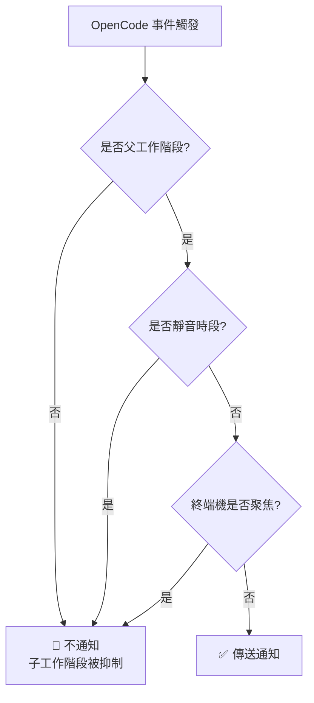
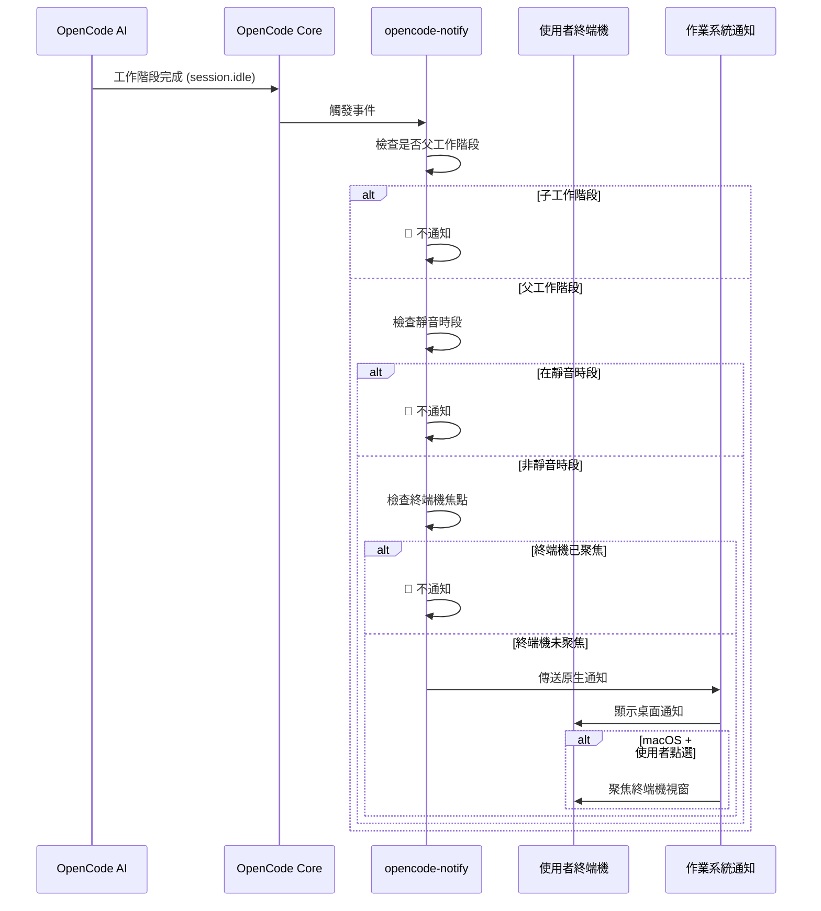

# 運作原理：通知、過濾與觸發機制

## 學完你能做什麼

- 理解 opencode-notify 的四種通知類型及其觸發時機
- 掌握智慧過濾機制的運作原理（為什麼不會收到太多通知）
- 了解通知從觸發到顯示的完整流程
- 知道如何透過設定調整通知行為

## 核心思路

::: tip 設計哲學
opencode-notify 遵循一個核心原則：**「該通知使用者時才通知，而不是為每個微小事件通知」**。
:::

這個外掛程式的運作方式可以拆解為三個關鍵環節：

1. **監聽** - 等待 OpenCode 發生重要事件
2. **過濾** - 決定這個事件是否需要通知
3. **傳送** - 透過作業系統原生通知提醒你

理解這個流程，你就能知道為什麼外掛程式既能及時提醒，又不會像垃圾訊息一樣頻繁打擾。

## 四種通知類型

opencode-notify 監聽四類 OpenCode 事件，每類都有明確的觸發場景：

### 1. 任務完成通知 (session.idle)

**觸發時機**：當 AI 工作階段進入閒置狀態（任務完成）

| 項目 | 說明 |
| --- | ---|
| 通知標題 | Ready for review |
| 通知內容 | 工作階段標題（最多 50 字元） |
| 預設音效 | Glass (macOS) |

**為什麼重要**：這是最常用的通知，讓你知道 AI 已經完成任務，可以過來檢查結果了。

### 2. 錯誤通知 (session.error)

**觸發時機**：當 AI 工作階段執行出錯

| 項目 | 說明 |
| --- | ---|
| 通知標題 | Something went wrong |
| 通知內容 | 錯誤摘要（最多 100 字元） |
| 預設音效 | Basso (macOS) |

**為什麼重要**：錯誤需要及時處理，否則後續操作可能無法正常進行。

### 3. 權限請求通知 (permission.updated)

**觸發時機**：當 AI 需要使用者授權執行某操作（如讀取檔案、存取網路）

| 項目 | 說明 |
| --- | ---|
| 通知標題 | Waiting for you |
| 通知內容 | OpenCode needs your input |
| 預設音效 | Submarine (macOS) |

**為什麼重要**：AI 被阻塞了，需要你手動授權才能繼續，不處理會導致任務卡住。

### 4. 問題詢問通知 (tool.execute.before)

**觸發時機**：當 AI 使用 `question` 工具向你提問

| 項目 | 說明 |
| --- | ---|
| 通知標題 | Question for you |
| 通知內容 | OpenCode needs your input |
| 預設音效 | Submarine (macOS) |

**為什麼重要**：AI 需要更多資訊才能繼續，比如確認某個決策或澄清需求。

::: info 四種通知的優先順序
權限請求和問題詢問的優先順序最高，因為 AI 在這些事件下是完全阻塞的；錯誤通知次之，因為任務已失敗；任務完成通知的優先順序相對較低，因為你可以在方便的時候再檢查。
:::

## 智慧過濾機制

這是 opencode-notify 最大的亮點——透過多層過濾，確保你只收到真正需要關注的通知。

### 過濾層級概覽



### 層級 1：父工作階段檢查

**規則**：預設只通知父工作階段（根工作階段），不通知子工作階段。

**原理**：OpenCode 的任務可能是嵌套的。比如你讓 AI 「最佳化程式碼庫」，它可能會拆分成多個子任務：
- 父工作階段：「最佳化整個程式碼庫」
- 子工作階段 1：「最佳化 src/components 目錄」
- 子工作階段 2：「最佳化 src/utils 目錄」

如果所有子工作階段都通知，你會收到一堆通知。opencode-notify 只在父工作階段完成時通知一次。

::: tip 何時需要子工作階段通知？
如果你正在監控單個 AI 的多個併發任務，可以在設定中設定 `notifyChildSessions: true` 啟用子工作階段通知。
:::

**特殊例外**：
- **權限請求通知**：始終通知，不檢查父工作階段（因為權限問題必須處理）
- **問題詢問通知**：始終通知，不檢查父工作階段

### 層級 2：靜音時段檢查

**規則**：在設定的靜音時間段內，不傳送任何通知。

**原理**：避免在夜間或休息時間被打擾。設定範例：

```json
{
  "quietHours": {
    "enabled": true,
    "start": "22:00",
    "end": "08:00"
  }
}
```

**跨午夜支援**：靜音時段可以跨午夜，比如 `22:00 - 08:00` 會正確識別為晚上 10 點到次日早上 8 點。

::: info 靜音時段檢查優先順序
靜音時段的優先順序高於其他所有檢查。即使在靜音時段內，終端機不聚焦或父工作階段等條件也不會繞過靜音時段。
:::

### 層級 3：終端機焦點偵測

**規則**：當終端機視窗是目前活動視窗時，不傳送通知。

**原理**：你正在看終端機時，AI 完成任務會直接顯示在螢幕上，不需要額外通知。

**平台支援**：
- ✅ **macOS**：完全支援，透過 `osascript` 偵測前台應用
- ❌ **Windows**：不支援
- ❌ **Linux**：不支援

**偵測機制**（macOS）：
1. 使用 `detect-terminal` 函式庫識別你的終端機（支援 37+ 終端機模擬器）
2. 查詢 macOS 取得目前前台應用
3. 比較是否匹配你的終端機程序名
4. 匹配則抑制通知

**特殊例外**：
- **問題詢問通知**：不做焦點檢查（支援 tmux 工作流程）

::: tip tmux 工作流程支援
如果你在 tmux 中使用多個窗格，問題詢問通知不會因焦點偵測被抑制，確保你能在其他窗格工作時收到提醒。
:::

### macOS 特殊功能：點選通知聚焦終端機

在 macOS 上，通知還有一個額外功能：**點選通知後，終端機視窗會自動置頂**。

**原理**：
1. 外掛程式透過 `osascript` 取得你的終端機 Bundle ID（如 `com.ghostty.Ghostty`）
2. 傳送通知時設定 `activate` 選項為該 Bundle ID
3. 點選通知時，系統會自動聚焦到對應的應用

**支援的終端機**：Ghostty, Kitty, iTerm2, WezTerm, Alacritty, macOS Terminal, Hyper, Warp, VS Code 整合終端機等。

::: info 自動終端機偵測
外掛程式會自動偵測你使用的終端機，無需手動設定。如果自動偵測失敗，可以在設定檔中手動指定 `terminal` 欄位。
:::

## 通知觸發流程

### 完整流程圖



### 事件處理優先順序

當多個事件同時觸發時，外掛程式會依照以下優先順序處理：

1. **最高優先順序**：權限請求（`permission.updated`）- AI 被阻塞，必須處理
2. **次高優先順序**：錯誤通知（`session.error`）- 任務失敗，需要關注
3. **低優先順序**：任務完成（`session.idle`）- 可以稍後檢查
4. **特殊**：問題詢問（`tool.execute.before`）- 根據實際需求決定優先順序

::: tip 批次通知處理
如果多個任務同時完成，外掛程式不會分別傳送多個通知，而是只傳送一個通知（基於父工作階段檢查）。這避免了通知轟炸。
:::

## 設定影響

透過設定檔，你可以調整過濾機制的各個層級：

| 設定項 | 影響層級 | 預設值 | 說明 |
| --- | --- | --- | ---|
| `notifyChildSessions` | 父工作階段檢查 | `false` | 設為 `true` 可啟用子工作階段通知 |
| `quietHours.enabled` | 靜音時段檢查 | `false` | 設為 `true` 啟用靜音時段 |
| `quietHours.start` | 靜音時段檢查 | `"22:00"` | 靜音開始時間 |
| `quietHours.end` | 靜音時段檢查 | `"08:00"` | 靜音結束時間 |
| `terminal` | 終端機偵測 | 未設定 | 手動指定終端機類型（覆蓋自動偵測） |

::: details 設定範例

```json
{
  "enabled": true,
  "notifyChildSessions": false,
  "sounds": {
    "idle": "Glass",
    "error": "Basso",
    "permission": "Submarine"
  },
  "quietHours": {
    "enabled": true,
    "start": "22:00",
    "end": "08:00"
  },
  "terminal": "ghostty"
}
```

:::

## 本課小結

opencode-notify 的運作原理可以概括為：

1. **四種通知類型**：任務完成、錯誤、權限請求、問題詢問
2. **三層智慧過濾**：父工作階段檢查 → 靜音時段檢查 → 終端機焦點檢查
3. **平台差異**：macOS 支援焦點偵測和點選聚焦，Windows/Linux 僅支援基礎通知
4. **靈活設定**：透過 JSON 設定檔調整過濾層級和行為

這個設計確保了通知的及時性和低干擾性——只在真正需要你的時候提醒，而不會成為另一個需要頻繁查看的通知中心。

## 下一課預告

> 下一課我們學習 **[macOS 平台特性](../../platforms/macos/)**。
>
> 你會學到：
> - macOS 獨有的焦點偵測機制
> - 如何設定點選通知聚焦功能
> - 自訂音效的完整列表
> - 與 macOS 原生系統的整合細節

---

## 附錄：原始碼參考

<details>
<summary><strong>點選展開檢視原始碼位置</strong></summary>

> 更新時間：2026-01-27

| 功能 | 檔案路徑 | 行號 |
| --- | --- | ---|
| 外掛程式主入口 | [`src/notify.ts`](https://github.com/kdcokenny/opencode-notify/blob/main/src/notify.ts#L357-L406) | 357-406 |
| 設定載入 | [`src/notify.ts`](https://github.com/kdcokenny/opencode-notify/blob/main/src/notify.ts#L90-L114) | 90-114 |
| 預設設定 | [`src/notify.ts`](https://github.com/kdcokenny/opencode-notify/blob/main/src/notify.ts#L56-L68) | 56-68 |
| 終端機偵測 | [`src/notify.ts`](https://github.com/kdcokenny/opencode-notify/blob/main/src/notify.ts#L145-L164) | 145-164 |
| 終端機焦點偵測 | [`src/notify.ts`](https://github.com/kdcokenny/opencode-notify/blob/main/src/notify.ts#L166-L175) | 166-175 |
| 靜音時段檢查 | [`src/notify.ts`](https://github.com/kdcokenny/opencode-notify/blob/main/src/notify.ts#L181-L199) | 181-199 |
| 父工作階段偵測 | [`src/notify.ts`](https://github.com/kdcokenny/opencode-notify/blob/main/src/notify.ts#L205-L214) | 205-214 |
| 任務完成處理 | [`src/notify.ts`](https://github.com/kdcokenny/opencode-notify/blob/main/src/notify.ts#L249-L284) | 249-284 |
| 錯誤通知處理 | [`src/notify.ts`](https://github.com/kdcokenny/opencode-notify/blob/main/src/notify.ts#L286-L313) | 286-313 |
| 權限請求處理 | [`src/notify.ts`](https://github.com/kdcokenny/opencode-notify/blob/main/src/notify.ts#L315-L334) | 315-334 |
| 問題詢問處理 | [`src/notify.ts`](https://github.com/kdcokenny/opencode-notify/blob/main/src/notify.ts#L336-L351) | 336-351 |
| 通知傳送 | [`src/notify.ts`](https://github.com/kdcokenny/opencode-notify/blob/main/src/notify.ts#L227-L243) | 227-243 |
| macOS 前台應用偵測 | [`src/notify.ts`](https://github.com/kdcokenny/opencode-notify/blob/main/src/notify.ts#L139-L143) | 139-143 |
| Bundle ID 取得 | [`src/notify.ts`](https://github.com/kdcokenny/opencode-notify/blob/main/src/notify.ts#L135-L137) | 135-137 |
| 終端機程序名對應 | [`src/notify.ts`](https://github.com/kdcokenny/opencode-notify/blob/main/src/notify.ts#L71-L84) | 71-84 |

**關鍵常數**：

- `DEFAULT_CONFIG`：預設設定（第 56-68 行）
  - `notifyChildSessions: false`：預設不通知子工作階段
  - `sounds.idle: "Glass"`：任務完成音效
  - `sounds.error: "Basso"`：錯誤音效
  - `sounds.permission: "Submarine"`：權限請求音效
  - `quietHours.start: "22:00"`、`quietHours.end: "08:00"`：預設靜音時段

- `TERMINAL_PROCESS_NAMES`：終端機名稱到 macOS 程序名的對應（第 71-84 行）

**關鍵函式**：

- `loadConfig()`：載入並合併設定檔與預設設定
- `detectTerminalInfo()`：偵測終端機資訊（名稱、Bundle ID、程序名）
- `isTerminalFocused()`：檢查終端機是否為目前前台應用（macOS）
- `isQuietHours()`：檢查目前時間是否在靜音時段內
- `isParentSession()`：檢查工作階段是否為父工作階段
- `sendNotification()`：傳送原生通知，支援 macOS 點選聚焦
- `handleSessionIdle()`：處理任務完成事件
- `handleSessionError()`：處理錯誤事件
- `handlePermissionUpdated()`：處理權限請求事件
- `handleQuestionAsked()`：處理問題詢問事件

**業務規則**：

- BR-1-1：預設只通知父工作階段，不通知子工作階段（`notify.ts:256-259`）
- BR-1-2：終端機聚焦時抑制通知（`notify.ts:265`）
- BR-1-3：靜音時段內不傳送通知（`notify.ts:262`）
- BR-1-4：權限請求始終通知，無需父工作階段檢查（`notify.ts:319`）
- BR-1-5：問題詢問不做焦點檢查，支援 tmux 工作流程（`notify.ts:340`）
- BR-1-6：macOS 支援點選通知聚焦終端機（`notify.ts:238-240`）

</details>
