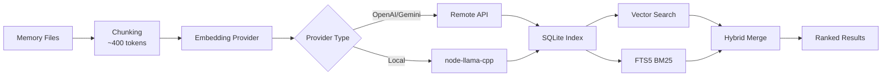

# 記憶系統與向量搜尋完整指南

## 學完你能做什麼

本課學完後，你將能夠：

- 理解 Clawdbot 記憶系統的檔案結構和索引機制
- 設定向量搜尋提供商（OpenAI、Gemini、本機）
- 使用混合搜尋（BM25 + 向量）提升檢索準確率
- 透過 CLI 管理記憶索引和搜尋
- 調整 Embedding 快取和索引效能

## 你現在的困境

你可能遇到了這些情況：

- AI 在新會話中"忘"了之前的對話內容
- 想讓 AI 記住一些持久化的知識和偏好
- 不清楚如何讓 AI"學習"並記住重要資訊
- 搜尋歷史對話時找不到相關的上下文

## 什麼時候用這一招

**記憶系統**適合這些場景：

| 場景 | 示例 | 儲存位置 |
|--- | --- | ---|
| 持久化知識 | "我喜歡素食，記住這個" | MEMORY.md |
| 日常筆記 | "今天的工作進度和待辦" | memory/YYYY-MM-DD.md |
| 會話檢索 | "上次討論的 API 端點是什麼" | 向量索引 |
| 設定資訊 | "Gateway 在連接埠 18789 運作" | MEMORY.md |

---

## 核心思路

### 記憶系統的兩層結構

Clawdbot 使用 **兩層資料** 來管理長期記憶：

| 層級 | 檔案路徑 | 用途 | 載入時機 |
|--- | --- | --- | ---|
| **長期記憶** | `MEMORY.md` | 精選的知識、偏好、重要事實 | 主會話啟動時載入 |
| **每日日誌** | `memory/YYYY-MM-DD.md` | 日常筆記、運作上下文 | 載入今天 + 昨天的 |

::: info 為什麼是兩層？
`MEMORY.md` 類似於"知識庫"，只載入到主會話，確保敏感資訊不會洩漏到群組對話。`memory/*.md` 是"日記本"，記錄日常流水，方便回溯。
:::

### 向量索引的工作流程



### 混合搜尋：BM25 + 向量

向量搜尋擅長"語意匹配"，但弱於"精確匹配"：

| 查詢類型 | 向量搜尋 | BM25 全文 | 混合搜尋 |
|--- | --- | --- | ---|
| "伺服器 IP 位址" | ❌ 弱 | ✅ 強 | ✅ 最佳 |
| "如何部署 Gateway" | ✅ 強 | ⚠️ 中等 | ✅ 最佳 |
| "API 端點 a828e60" | ❌ 弱 | ✅ 強 | ✅ 最佳 |

**融合公式**：
```javascript
finalScore = vectorWeight × vectorScore + textWeight × textScore
```

- `vectorWeight + textWeight` 自動歸一化為 1.0
- 預設：70% 向量 + 30% 關鍵詞
- 可透過 `agents.defaults.memorySearch.query.hybrid.*` 調整

---

## 🎒 開始前的準備

在開始之前，請確保：

::: warning 前置檢查
- [ ] Gateway 已啟動（[啟動 Gateway](../../start/gateway-startup/)）
- [ ] AI 模型已設定（[AI 模型設定](../models-auth/)）
- [ ] 了解基本的 Markdown 檔案編輯
:::

::: tip 推薦設定
- 優先使用 OpenAI 或 Gemini embeddings（速度快、品質高）
- 本機 embeddings 需要 `pnpm rebuild node-llama-cpp`
- 首次索引可能需要幾分鐘，之後增量更新很快
:::

---

## 跟我做

### 第 1 步：建立記憶檔案

**為什麼**：AI 只會索引已存在的檔案，先建立記憶內容

在 Agent 工作目錄（預設 `~/clawd`）建立檔案：

```bash
# 建立長期記憶檔案
cat > ~/clawd/MEMORY.md << 'EOF'
# 個人偏好

- 飲食偏好：素食，不吃辛辣食物
- 工作時間：上午 9 點到下午 6 點
- 常用指令：`clawdbot gateway status`

# 重要設定

- Gateway 連接埠：18789
- 資料庫：PostgreSQL 15
EOF

# 建立今日日誌
cat > ~/clawd/memory/$(date +%Y-%m-%d).md << 'EOF'
# 今日工作進度

- 完成了 Gateway 設定
- 學習了記憶系統
- 待辦：閱讀模型認證文件
EOF
```

**你應該看到**：

```bash
# 查看檔案結構
tree ~/clawd/
# 或
ls -la ~/clawd/
ls -la ~/clawd/memory/

# 輸出示例
~/clawd/
├── MEMORY.md
└── memory/
    └── 2026-01-27.md
```

### 第 2 步：檢查記憶系統狀態

**為什麼**：確認 Embedding 提供商和索引狀態

```bash
# 基本狀態檢查
clawdbot memory status

# 深度檢查（探測 provider 可用性）
clawdbot memory status --deep

# 深度檢查 + 強制重新索引
clawdbot memory status --deep --index
```

**你應該看到**：

```bash
✓ Memory Search enabled
  Store: ~/.clawdbot/memory/main.sqlite
  Provider: openai
  Model: text-embedding-3-small
  Fallback: openai
  Hybrid: enabled (vectorWeight: 0.7, textWeight: 0.3)
  Cache: enabled (maxEntries: 50000)
  Sources: memory
  Indexed: 2 files, 5 chunks
```

::: tip 深度檢查
- `--deep` 會探測 OpenAI/Gemini/Local embeddings 是否可用
- `--index` 在偵測到"髒"索引時自動重新索引
- 首次執行時，索引可能需要幾分鐘
:::

### 第 3 步：手動觸發索引

**為什麼**：確保新建立的記憶檔案被索引

```bash
# 手動觸發索引
clawdbot memory index

# 帶詳細日誌
clawdbot memory index --verbose

# 僅針對特定 agent
clawdbot memory index --agent main
```

**你應該看到**：

```bash
Indexing memory for agent: main
  Provider: openai (text-embedding-3-small)
  Sources: memory
  - MEMORY.md (2 chunks)
  - memory/2026-01-27.md (3 chunks)
✓ Indexed 2 files, 5 chunks
```

### 第 4 步：測試語意搜尋

**為什麼**：驗證向量搜尋和混合搜尋是否正常運作

```bash
# 基礎搜尋
clawdbot memory search "素食"

# 搜尋精確匹配（測試 BM25）
clawdbot memory search "Gateway 連接埠"

# 搜尋模糊語意（測試向量）
clawdbot memory search "我喜歡吃什麼"

# 查看詳細結果
clawdbot memory search "Gateway" --verbose
```

**你應該看到**：

```bash
Searching memory for: "素食"

Results (2):

[1] MEMORY.md:3-5 (score: 0.842)
  - 飲食偏好：素食，不吃辛辣食物

[2] memory/2026-01-27.md:1-3 (score: 0.615)
  - 完成了 Gateway 設定
  - 學習了記憶系統
```

### 第 5 步：設定 Embedding 提供商

**為什麼**：根據需求選擇最適合的提供商（遠端 vs 本機）

#### 方案 A：OpenAI embeddings（推薦）

編輯設定檔 `~/.clawdbot/clawdbot.json`：

```json
{
  "agents": {
    "defaults": {
      "memorySearch": {
        "enabled": true,
        "provider": "openai",
        "model": "text-embedding-3-small",
        "fallback": "openai",
        "remote": {
          "apiKey": "YOUR_OPENAI_API_KEY",
          "batch": {
            "enabled": true,
            "concurrency": 2
          }
        }
      }
    }
  }
}
```

**優點**：
- 速度快、品質高
- 支援批次索引（便宜）
- 適合大規模回填

#### 方案 B：Gemini embeddings

```json
{
  "agents": {
    "defaults": {
      "memorySearch": {
        "provider": "gemini",
        "model": "gemini-embedding-001",
        "remote": {
          "apiKey": "YOUR_GEMINI_API_KEY"
        },
        "fallback": "openai"
      }
    }
  }
}
```

#### 方案 C：本機 embeddings（隱私優先）

```json
{
  "agents": {
    "defaults": {
      "memorySearch": {
        "provider": "local",
        "local": {
          "modelPath": "hf:ggml-org/embeddinggemma-300M-GGUF/embeddinggemma-300M-Q8_0.gguf",
          "modelCacheDir": "~/.cache/embeddings"
        },
        "fallback": "none"
      }
    }
  }
}
```

**注意事項**：

```bash
# 首次使用本機 embeddings 需要建構
pnpm approve-builds
# 選擇 node-llama-cpp
pnpm rebuild node-llama-cpp
```

**你應該看到**：

```bash
✓ node-llama-cpp installed
✓ Local embedding model ready
```

::: warning 本機 embeddings
- 首次會自動下載模型（~600MB）
- 需要編譯 node-llama-cpp（依賴系統環境）
- 速度較遠端慢，但完全離線、隱私優先
:::

### 第 6 步：設定混合搜尋權重

**為什麼**：根據應用場景調整語意和關鍵詞的權重比例

編輯設定：

```json
{
  "agents": {
    "defaults": {
      "memorySearch": {
        "query": {
          "hybrid": {
            "enabled": true,
            "vectorWeight": 0.7,
            "textWeight": 0.3,
            "candidateMultiplier": 4
          }
        }
      }
    }
  }
}
```

**參數說明**：

| 參數 | 預設值 | 說明 | 調整建議 |
|--- | --- | --- | ---|
| `vectorWeight` | 0.7 | 語意搜尋權重 | 提升到 0.8 用於"自然語言"查詢 |
| `textWeight` | 0.3 | 關鍵詞搜尋權重 | 提升到 0.5 用於"程式碼/ID"查詢 |
| `candidateMultiplier` | 4 | 候選倍數 | 增加到 6 提升召回率 |

**對比效果**：

```bash
# 測試語意查詢
clawdbot memory search "部署 Gateway 的方法"
# vectorWeight: 0.7 → 找到語意相關的結果
# textWeight: 0.5 → 找到"部署"、"Gateway"關鍵詞

# 測試精確查詢
clawdbot memory search "API 端點 a828e60"
# vectorWeight: 0.3 → 忽略語意，優先匹配
# textWeight: 0.7 → 精確匹配 "a828e60"
```

### 第 7 步：啟用 SQLite-vec 加速

**為什麼**：將向量查詢下推到 SQLite，避免載入所有 embeddings

編輯設定：

```json
{
  "agents": {
    "defaults": {
      "memorySearch": {
        "store": {
          "vector": {
            "enabled": true,
            "extensionPath": "/path/to/sqlite-vec"
          }
        }
      }
    }
  }
}
```

**檢查 sqlite-vec 是否可用**：

```bash
# 查看索引狀態
clawdbot memory status --deep

# 如果可用，你會看到
✓ SQLite-vec extension loaded
  Vector table: chunks_vec
```

::: info SQLite-vec
- 預設自動嘗試載入
- 如果載入失敗，自動回退到 JS 計算（不影響功能）
- 自訂路徑僅用於特殊建構或非標準安裝
:::

---

## 檢查點 ✅

完成上述步驟後，驗證以下內容：

| 檢查項 | 驗證方法 | 預期結果 |
|--- | --- | ---|
| 記憶檔案存在 | `ls ~/clawd/` | MEMORY.md 和 memory/ 目錄存在 |
| 索引已建立 | `clawdbot memory status` | 顯示 Indexed > 0 chunks |
| 搜尋正常 | `clawdbot memory search "..."` | 傳回相關結果 |
| Provider 正常 | `clawdbot memory status --deep` | 顯示 Provider 類型 |

---

## 踩坑提醒

### 坑 1：Embedding 提供商失敗

**現象**：

```bash
✗ Memory Search disabled
  Error: No API key found for provider
```

**解決**：

```bash
# 檢查設定
cat ~/.clawdbot/clawdbot.json | grep -A 5 "memorySearch"

# 確認 apiKey 存在
# 或者設定環境變數
export OPENAI_API_KEY="sk-..."
export GEMINI_API_KEY="..."
```

### 坑 2：本機 embeddings 無法載入

**現象**：

```bash
✗ Local embedding provider failed
  Error: Cannot find module 'node-llama-cpp'
```

**解決**：

```bash
# 批准建構
pnpm approve-builds

# 重新建構
pnpm rebuild node-llama-cpp
```

### 坑 3：索引不更新

**現象**：

```bash
# 修改了 MEMORY.md
# 但搜尋結果還是舊的
```

**解決**：

```bash
# 方法 1：手動觸發索引
clawdbot memory index

# 方法 2：重啟 Gateway（觸發 onSessionStart 索引）
clawdbot gateway restart

# 方法 3：檢查檔案監聽
clawdbot memory status --verbose
# 檢查 "Watch: true"
```

### 坑 4：搜尋結果不相關

**現象**：搜尋"Gateway"卻傳回了"工作進度"

**可能原因**：

1. **混合權重不合適**：
   - 語意查詢（"如何部署"）→ 提高 `vectorWeight`
   - 關鍵詞查詢（"API 端點"）→ 提高 `textWeight`

2. **索引未完全更新**：
   ```bash
   # 強制重新索引
   rm ~/.clawdbot/memory/main.sqlite
   clawdbot memory index
   ```

3. **Chunk 粒度問題**：
   - 預設 400 tokens，可能切斷了上下文
   - 調整 `agents.defaults.memorySearch.chunking.tokens`

---

## 本課小結

本課我們學習了：

1. **記憶系統架構**
   - 兩層資料結構（MEMORY.md + memory/*.md）
   - 向量索引 + FTS5 全文搜尋
   - 混合檢索（BM25 + 向量）

2. **Embedding 提供商設定**
   - OpenAI/Gemini/本機三種方案
   - 批次索引加速
   - Fallback 機制

3. **CLI 工具使用**
   - `clawdbot memory status` 檢查狀態
   - `clawdbot memory index` 觸發索引
   - `clawdbot memory search` 測試搜尋

4. **效能優化**
   - SQLite-vec 向量加速
   - Embedding 快取
   - 混合權重調優

---

## 下一課預告

> 下一課我們學習 **[安全與沙箱隔離](../security-sandbox/)**。
>
> 你會學到：
> - 工具權限控制和 allowlist
> - Sandbox 會話隔離
> - Exec 審批機制
> - Docker 化部署
> - Tailscale 認證

---

## 附錄：原始碼參考

<details>
<summary><strong>點擊展開查看原始碼位置</strong></summary>

> 更新時間：2026-01-27

| 功能 | 檔案路徑 | 行號 |
|--- | --- | ---|
| 記憶管理器 | [`src/memory/manager.ts`](https://github.com/moltbot/moltbot/blob/main/src/memory/manager.ts) | 1-200 |
| 混合搜尋 | [`src/memory/hybrid.ts`](https://github.com/moltbot/moltbot/blob/main/src/memory/hybrid.ts) | 1-112 |
| Embedding 提供商 | [`src/memory/embeddings.ts`](https://github.com/moltbot/moltbot/blob/main/src/memory/embeddings.ts) | 1-80 |
| OpenAI embeddings | [`src/memory/embeddings-openai.ts`](https://github.com/moltbot/moltbot/blob/main/src/memory/embeddings-openai.ts) | 全文 |
| Gemini embeddings | [`src/memory/embeddings-gemini.ts`](https://github.com/moltbot/moltbot/blob/main/src/memory/embeddings-gemini.ts) | 全文 |
| 本機 embeddings | [`src/memory/node-llama.ts`](https://github.com/moltbot/moltbot/blob/main/src/memory/node-llama.ts) | 全文 |
| SQLite-vec | [`src/memory/sqlite-vec.ts`](https://github.com/moltbot/moltbot/blob/main/src/memory/sqlite-vec.ts) | 全文 |
| 批次索引（OpenAI） | [`src/memory/batch-openai.ts`](https://github.com/moltbot/moltbot/blob/main/src/memory/batch-openai.ts) | 全文 |
| 批次索引（Gemini） | [`src/memory/batch-gemini.ts`](https://github.com/moltbot/moltbot/blob/main/src/memory/batch-gemini.ts) | 全文 |
| 搜尋管理器 | [`src/memory/manager-search.ts`](https://github.com/moltbot/moltbot/blob/main/src/memory/manager-search.ts) | 全文 |
| Memory Schema | [`src/memory/memory-schema.ts`](https://github.com/moltbot/moltbot/blob/main/src/memory/memory-schema.ts) | 全文 |

**關鍵設定**：
- `agents.defaults.memorySearch.enabled`：啟用/停用記憶搜尋
- `agents.defaults.memorySearch.provider`：Embedding 提供商（"openai"、"gemini"、"local"）
- `agents.defaults.memorySearch.query.hybrid.vectorWeight`：向量搜尋權重（預設 0.7）
- `agents.defaults.memorySearch.query.hybrid.textWeight`：BM25 搜尋權重（預設 0.3）
- `agents.defaults.memorySearch.cache.enabled`：Embedding 快取（預設 true）
- `agents.defaults.memorySearch.store.vector.enabled`：SQLite-vec 加速（預設 true）

**關鍵函數**：
- `mergeHybridResults()`：融合向量 + BM25 結果（`src/memory/hybrid.ts:39-111`）
- `bm25RankToScore()`：BM25 排名轉分數（`src/memory/hybrid.ts:34-37`）
- `createEmbeddingProvider()`：建立 Embedding 提供商（`src/memory/embeddings.ts`）
- `getMemorySearchManager()`：取得記憶搜尋管理器（`src/memory/search-manager.ts`）

**CLI 指令**：
- `clawdbot memory status`：檢查狀態（`src/cli/commands/memory-cli.ts`）
- `clawdbot memory index`：觸發索引（`src/cli/commands/memory-cli.ts`）
- `clawdbot memory search`：搜尋記憶（`src/cli/commands/memory-cli.ts`）

</details>
