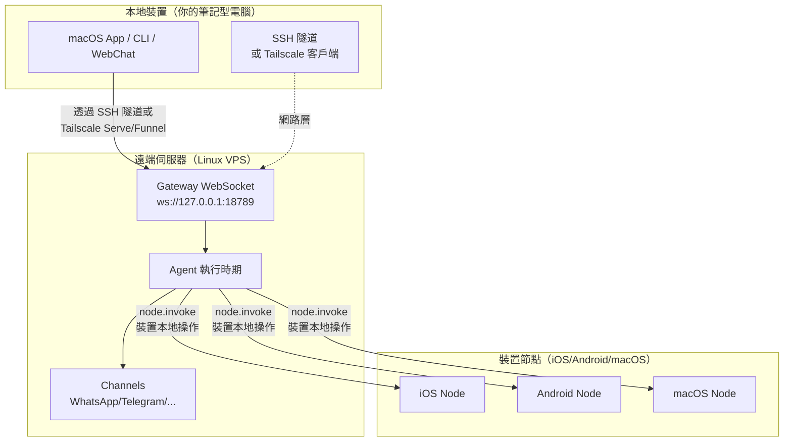

# 遠端 Gateway：透過 Tailscale 和 SSH 隧道存取 Clawdbot | Clawdbot 教學

## 學完你能做什麼

**遠端 Gateway** 讓你擺脫裝置限制，將 AI 助手部署到 Always-on 的 Linux 伺服器。本課學完後，你將能夠：

- ✅ 在 Linux 伺服器或 VPS 上執行 Clawdbot Gateway
- ✅ 透過 Tailscale Serve/Funnel 安全暴露 Gateway 到網路
- ✅ 使用 SSH 隧道從客戶端連線到遠端 Gateway
- ✅ 理解 Gateway 與 Node 的架構差異（exec 在哪裡跑，裝置操作在哪裡跑）
- ✅ 設定安全的遠端存取策略

## 你現在的困境

你可能有這些問題：

- 🤔 "我的筆記型電腦經常休眠，但我想讓 AI 助手一直上線"
- 🤔 "我想在便宜的 VPS 上執行 Gateway，但不知道怎麼安全存取"
- 🤔 "Tailscale Serve 和 Funnel 有什麼區別？我該用哪個？"
- 🤔 "SSH 隧道太麻煩，有沒有更自動化的方案？"

## 什麼時候用這一招

**遠端 Gateway** 適合以下場景：

| 場景 | 推薦方案 | 原因 |
|--- | --- | ---|
| 筆記型電腦經常休眠，需要 AI 常駐 | **Tailscale Serve + Linux VPS** | VPS 不休眠，透過 tailnet 安全存取 |
| 家用桌面執行 Gateway，筆記型電腦遠端控制 | **SSH 隧道** 或 **Tailscale Serve** | 統一 Gateway 會話和設定 |
| 需要從公網存取（臨時測試） | **Tailscale Funnel + 密碼** | 快速暴露，但需密碼保護 |
| 多台裝置共用一個 AI 助手 | **Always-on Gateway** | 所有會話、設定、歷史集中管理 |

::: warning 不推薦場景
如果你只有一台裝置，且經常隨身攜帶，**不需要**遠端 Gateway。直接在本機執行 Gateway 即可。
:::

## 🎒 開始前的準備

在開始前，請確認：

- [ ] 已完成 **[啟動 Gateway](/zh-tw/moltbot/moltbot/start/gateway-startup/)** 課程
- [ ] 了解基本的 SSH 指令（可選，如使用 SSH 隧道）
- [ ] （如使用 Tailscale）已安裝 Tailscale CLI 並登入
- [ ] 準備好遠端 Linux 伺服器或 VPS（推薦 Ubuntu/Debian）

---

## 核心思路

### 遠端 Gateway 架構

遠端 Gateway 的核心理念是：**Gateway 是控制中心，客戶端是終端**。



### 三個關鍵概念

| 概念 | 解釋 | 範例 |
|--- | --- | ---|
| **Gateway 主機** | 執行 Gateway 服務的機器，擁有會話、認證、通道和狀態 | Linux VPS、家用桌面 |
| **客戶端** | 連線到 Gateway 的工具（macOS App、CLI、WebChat） | 你的筆記型電腦、手機 |
| **裝置節點** | 透過 Gateway WebSocket 連線的外設，執行裝置本地操作 | iOS 裝置、Android 裝置、macOS 節點模式 |

### 指令在哪裡執行？

這是最常見的混淆點：

| 操作類型 | 在哪裡執行 | 原因 |
|--- | --- | ---|
| `exec` 工具 | **Gateway 主機** | Shell 指令在 Gateway 機器上跑 |
| `browser` 工具 | **Gateway 主機**（或獨立的瀏覽器控制伺服器） | 瀏覽器在 Gateway 機器上啟動 |
| 節點操作（`camera.snap`、`system.run`）| **裝置節點** | 需要存取裝置本地資源 |

**一句話記住**：
- Gateway 主機 → 執行通用指令和執行 AI
- 裝置節點 → 執行裝置特定的本地操作

---

## 跟我做

### 第 1 步：在遠端伺服器上安裝 Clawdbot

**為什麼**
Linux 伺服器更適合執行長期上線的 Gateway 服務。

在遠端伺服器上執行：

```bash
# 1. 安裝 Node.js (≥22)
curl -fsSL https://deb.nodesource.com/setup_22.x | sudo -E bash -
sudo apt-get install -y nodejs

# 2. 安裝 Clawdbot
npm install -g @clawdbot/cli

# 3. 驗證安裝
clawdbot --version
```

**你應該看到**：
```
clawdbot CLI v<version>
```

### 第 2 步：執行 onboarding 精靈

**為什麼**
透過互動式精靈快速設定基礎設定。

```bash
clawdbot onboard
```

依照精靈完成：
- 選擇通道（如 Telegram）
- 設定 AI 模型（如 OpenAI、Anthropic）
- 設定 Gateway 認證（Token 或 Password）

::: tip 推薦
設定 `gateway.auth.mode: "password"`，方便遠端連線時使用密碼認證：
```bash
export CLAWDBOT_GATEWAY_PASSWORD="your-secure-password"
```
:::

**你應該看到**：
```
✅ Gateway configured successfully
✅ Channels configured: telegram
✅ AI model configured: openai:gpt-4o-mini
```

### 第 3 步：啟動 Gateway 守護行程

**為什麼**
Gateway 需要在背景持續執行。

```bash
# 啟動 Gateway（預設綁定 loopback: 127.0.0.1:18789）
clawdbot gateway start
```

**你應該看到**：
```
🚀 Gateway starting...
📡 WebSocket: ws://127.0.0.1:18789
🔒 Auth mode: password
```

::: tip 使用 systemd 自動啟動（Linux）
建立服務檔案 `/etc/systemd/system/clawdbot.service`：

```ini
[Unit]
Description=Clawdbot Gateway
After=network.target

[Service]
Type=simple
User=your-user
ExecStart=/usr/bin/clawdbot gateway start
Restart=on-failure
RestartSec=5s
Environment="CLAWDBOT_GATEWAY_PASSWORD=your-secure-password"

[Install]
WantedBy=multi-user.target
```

啟動服務：
```bash
sudo systemctl enable clawdbot
sudo systemctl start clawdbot
sudo systemctl status clawdbot
```
:::

---

### 方案 A：使用 Tailscale Serve（推薦）

#### 第 4 步：安裝並登入 Tailscale

**為什麼**
Tailscale Serve 提供安全的 HTTPS 存取，無需公網 IP。

```bash
# 安裝 Tailscale CLI
curl -fsSL https://tailscale.com/install.sh | sh

# 登入 Tailscale
sudo tailscale up
```

**你應該看到**：
```
To authenticate, visit:

    https://login.tailscale.com/a/xxxxx

----------------------------------------------------
Copy the URL and open it in your browser.
```

#### 第 5 步：設定 Tailscale Serve

**為什麼**
透過 Tailscale Serve 暴露 Gateway 到 tailnet，保持 Gateway loopback-only（最安全）。

修改設定檔 `~/.clawdbot/clawdbot.json`：

```json5
{
  "gateway": {
    "bind": "loopback",
    "tailscale": {
      "mode": "serve",
      "resetOnExit": true
    },
    "auth": {
      "mode": "password"
    }
  }
}
```

**設定說明**：
- `bind: "loopback"`：Gateway 只監聽本地回環（最安全）
- `tailscale.mode: "serve"`：透過 Tailscale Serve 暴露到 tailnet
- `resetOnExit: true`：退出時撤銷 Serve 設定

#### 第 6 步：重新啟動 Gateway

**為什麼**
套用新的 Tailscale 設定。

```bash
# 如果使用 systemd
sudo systemctl restart clawdbot

# 或直接重新啟動（如果在前台執行）
clawdbot gateway restart
```

**你應該看到**：
```
🚀 Gateway starting...
📡 WebSocket: ws://127.0.0.1:18789
🌐 Tailscale Serve: https://your-tailnet-name.tailnet-name.ts.net/
🔒 Auth mode: password
```

#### 第 7 步：從客戶端連線

**為什麼**
驗證遠端 Gateway 是否可存取。

在客戶端機器上：

1. **確保已加入同一個 Tailscale tailnet**
2. **存取 Control UI**：
   ```
   https://<magicdns>/  # 或 https://<tailnet-ip>:18789/
   ```
3. **連線 WebSocket**：
   ```bash
   # 驗證連線
   clawdbot health --url ws://<tailnet-ip>:18789 --password your-secure-password
   ```

**你應該看到**：
```
✅ Gateway is healthy
✅ Authenticated successfully
✅ Channels: telegram (connected)
```

---

### 方案 B：使用 SSH 隧道（通用回退）

#### 第 4 步：設定 SSH 金鑰認證

**為什麼**
SSH 金鑰認證比密碼更安全，可以自動化連線。

在客戶端機器上產生金鑰對：

```bash
# 產生金鑰對（如果還沒有）
ssh-keygen -t rsa -b 4096 -f ~/.ssh/clawdbot_gateway
```

**你應該看到**：
```
Generating public/private rsa key pair.
Enter passphrase (empty for no passphrase): [直接按 Enter]
Enter same passphrase again: [直接按 Enter]
Your identification has been saved in ~/.ssh/clawdbot_gateway
Your public key has been saved in ~/.ssh/clawdbot_gateway.pub
```

#### 第 5 步：複製公鑰到遠端伺服器

**為什麼**
讓遠端伺服器信任你的客戶端金鑰。

```bash
# 複製公鑰到遠端伺服器
ssh-copy-id -i ~/.ssh/clawdbot_gateway.pub your-user@remote-server-ip
```

**你應該看到**：
```
Number of key(s) added: 1
Now try logging into the machine with:   "ssh 'your-user@remote-server-ip'"
```

#### 第 6 步：建立 SSH 設定

**為什麼**
簡化 SSH 連線指令，方便後續使用。

編輯客戶端機器的 `~/.ssh/config`：

```txt
Host clawdbot-remote
    HostName <remote-server-ip>
    User your-user
    IdentityFile ~/.ssh/clawdbot_gateway
    LocalForward 18789 127.0.0.1:18789
    ServerAliveInterval 60
    ServerAliveCountMax 3
```

**設定說明**：
- `LocalForward 18789 127.0.0.1:18789`：將本地 18789 連接埠轉發到遠端的 18789
- `ServerAliveInterval 60`：每 60 秒傳送心跳，保持連線活躍

#### 第 7 步：建立 SSH 隧道

**為什麼**
建立本地到遠端 Gateway 的安全通道。

```bash
# 啟動 SSH 隧道（背景執行）
ssh -N -f clawdbot-remote
```

**你應該看到**：
（沒有輸出，指令在背景執行）

#### 第 8 步：驗證連線

**為什麼**
確認 SSH 隧道和 Gateway 都正常運作。

```bash
# 檢查本地連接埠是否轉發成功
lsof -i :18789

# 測試 Gateway 連線
clawdbot health --url ws://127.0.0.1:18789 --password your-secure-password
```

**你應該看到**：
```
COMMAND   PID   USER   FD   TYPE DEVICE SIZE/OFF NODE NAME
ssh      12345  user   4u  IPv4  0x1234      0t0  TCP *:18789 (LISTEN)

✅ Gateway is healthy
✅ Authenticated successfully
```

#### 第 9 步：自動啟動 SSH 隧道（macOS）

**為什麼**
開機自動啟動，無需手動操作。

建立 `~/Library/LaunchAgents/com.clawdbot.ssh-tunnel.plist`：

```xml
<?xml version="1.0" encoding="UTF-8"?>
<!DOCTYPE plist PUBLIC "-//Apple//DTD PLIST 1.0//EN" "http://www.apple.com/DTDs/PropertyList-1.0.dtd">
<plist version="1.0">
<dict>
    <key>Label</key>
    <string>com.clawdbot.ssh-tunnel</string>
    <key>ProgramArguments</key>
    <array>
        <string>/usr/bin/ssh</string>
        <string>-N</string>
        <string>-f</string>
        <string>clawdbot-remote</string>
    </array>
    <key>KeepAlive</key>
    <true/>
    <key>RunAtLoad</key>
    <true/>
</dict>
</plist>
```

載入 Launch Agent：

```bash
launchctl bootstrap gui/$UID ~/Library/LaunchAgents/com.clawdbot.ssh-tunnel.plist
```

**你應該看到**：
（無輸出，隧道在背景自動執行）

::: tip Linux 自動啟動（systemd user service）
建立 `~/.config/systemd/user/clawdbot-ssh-tunnel.service`：

```ini
[Unit]
Description=Clawdbot SSH Tunnel
After=network.target

[Service]
Type=simple
ExecStart=/usr/bin/ssh -N clawdbot-remote
Restart=on-failure
RestartSec=5s

[Install]
WantedBy=default.target
```

啟動服務：
```bash
systemctl --user enable clawdbot-ssh-tunnel
systemctl --user start clawdbot-ssh-tunnel
```
:::

---

### 方案 C：使用 Tailscale Funnel（公開存取，需密碼）

::: danger 安全警告
Tailscale Funnel 會將 Gateway 暴露到公網！
- **必須**使用密碼認證（`gateway.auth.mode: "password"`）
- **僅推薦**用於臨時測試，不適合生產環境
:::

#### 第 4 步：設定 Funnel

**為什麼**
透過 Tailscale Funnel 提供公網 HTTPS 存取。

修改設定檔 `~/.clawdbot/clawdbot.json`：

```json5
{
  "gateway": {
    "bind": "loopback",
    "tailscale": {
      "mode": "funnel",
      "resetOnExit": true
    },
    "auth": {
      "mode": "password",
      "password": "${CLAWDBOT_GATEWAY_PASSWORD}"
    }
  }
}
```

**重要**：
- `tailscale.mode: "funnel"`：使用 Tailscale Funnel（公網存取）
- `auth.mode: "password"`：Funnel 強制要求密碼（否則拒絕啟動）

#### 第 5 步：重新啟動 Gateway

```bash
sudo systemctl restart clawdbot
```

**你應該看到**：
```
🚀 Gateway starting...
🌐 Tailscale Funnel: https://your-funnel-url.ts.net/
🔒 Auth mode: password
```

#### 第 6 步：從公網連線

```bash
clawdbot health --url wss://your-funnel-url.ts.net --password your-secure-password
```

---

## 檢查點 ✅

完成上述任一方案後，驗證以下幾點：

| 檢查項 | 指令 | 預期結果 |
|--- | --- | ---|
| Gateway 是否執行 | `clawdbot gateway status` | ✅ Running |
| WebSocket 是否可存取 | `clawdbot health --url <url>` | ✅ Healthy |
| Channels 是否連線 | `clawdbot channels status` | ✅ connected |
| 節點是否可配對 | `clawdbot nodes list` | 顯示節點列表 |

---

## 踩坑提醒

### 陷阱 1：Gateway 綁定到非 loopback

**問題**：
```json5
{
  "gateway": {
    "bind": "lan"  // ❌ 危險！
  }
}
```

**後果**：
- Gateway 在區域網路公網 IP 上監聽，任何人都可連線
- 如果沒有設定認證，**嚴重安全風險**

**正確做法**：
```json5
{
  "gateway": {
    "bind": "loopback",  // ✅ 最安全
    "tailscale": {
      "mode": "serve"  // ✅ 透過 Tailscale Serve 暴露
    }
  }
}
```

### 陷阱 2：Tailscale Funnel 不設定密碼

**問題**：
```json5
{
  "gateway": {
    "auth": {
      "mode": "token"  // ❌ Funnel 不允許！
    },
    "tailscale": {
      "mode": "funnel"
    }
  }
}
```

**後果**：
- Gateway 拒絕啟動（Funnel 強制要求密碼）

**正確做法**：
```json5
{
  "gateway": {
    "auth": {
      "mode": "password",  // ✅ Funnel 必須用密碼
      "password": "${CLAWDBOT_GATEWAY_PASSWORD}"
    },
    "tailscale": {
      "mode": "funnel"
    }
  }
}
```

### 陷阱 3：SSH 隧道連接埠衝突

**問題**：
```
channel_setup_fwd: listen 127.0.0.1:18789: cannot listen to port: Address already in use
```

**原因**：本地 18789 連接埠已被佔用

**解決**：
```bash
# 查找佔用連接埠的行程
lsof -i :18789

# 終止衝突行程
kill -9 <PID>

# 或使用其他連接埠轉發（需同時修改客戶端 URL）
ssh -N -L 18790:127.0.0.1:18789 clawdbot-remote
```

### 陷阱 4：macOS App Remote over SSH 不生效

**問題**：macOS App 顯示 "Unable to connect to Gateway"

**檢查**：
1. SSH 隧道是否執行：
   ```bash
   ps aux | grep "ssh -N clawdbot-remote" | grep -v grep
   ```
2. Gateway Token 是否設定：
   ```bash
   launchctl getenv CLAWDBOT_GATEWAY_TOKEN
   ```
3. App 設定是否正確：
   - Settings → General → "Clawdbot runs" → "On a remote machine over SSH"

**解決**：
- 重新啟動 SSH 隧道
- 退出並重新啟動 macOS App

---

## 本課小結

### 核心要點

- ✅ **遠端 Gateway** 讓 AI 助手常駐上線，客戶端可以隨時連線
- ✅ **Tailscale Serve** 是最安全的方案（tailnet-only + HTTPS + loopback）
- ✅ **SSH 隧道** 是通用回退方案（無需 Tailscale）
- ✅ **Tailscale Funnel** 適合臨時公開存取（必須用密碼）
- ✅ **Gateway 主機**執行 `exec` 和通用指令，**裝置節點**執行裝置本地操作

### 設定對比

| 方案 | 安全性 | 存取範圍 | 設定複雜度 | 推薦場景 |
|--- | --- | --- | --- | ---|
| Tailscale Serve | ⭐⭐⭐⭐⭐ | Tailnet | 中 | **推薦**：Always-on Gateway |
| SSH 隧道 | ⭐⭐⭐⭐ | SSH 連線可達 | 低 | 通用回退、家用桌面遠端控制 |
| Tailscale Funnel | ⭐⭐ | 公網 | 低 | 臨時測試、Demo |

### 安全檢查清單

- [ ] Gateway 綁定到 `loopback`
- [ ] Tailscale Funnel 使用密碼認證
- [ ] SSH 金鑰已設定（如使用 SSH 隧道）
- [ ] 密碼透過環境變數設定（不寫入設定檔）
- [ ] 定期執行 `clawdbot security audit`

---

## 下一課預告

> 下一課我們學習 **[技能平台與 ClawdHub](../skills-platform/)**。
>
> 你會學到：
> - 技能系統的概念（Bundled/Managed/Workspace）
> - 如何從 ClawdHub 安裝第三方技能
> - 如何建立和管理自訂技能
> - 技能的權限和隔離機制

---

## 附錄：原始碼參考

<details>
<summary><strong>點擊展開查看原始碼位置</strong></summary>

> 更新時間：2026-01-27

| 功能 | 檔案路徑 | 行號 |
|--- | --- | ---|
| Gateway 遠端設定 Schema | [`src/config/types.gateway.ts`](https://github.com/moltbot/moltbot/blob/main/src/config/types.gateway.ts) | 200-220 |
| Gateway Tailscale 設定 Schema | [`src/config/types.gateway.ts`](https://github.com/moltbot/moltbot/blob/main/src/config/types.gateway.ts) | 150-180 |
| Tailscale 整合 | [`src/infra/tailscale.ts`](https://github.com/moltbot/moltbot/blob/main/src/infra/tailscale.ts) | 1-100 |
| 遠端 Gateway 文件 | [`docs/gateway/remote.md`](https://github.com/moltbot/moltbot/blob/main/docs/gateway/remote.md) | 1-123 |
| Tailscale 文件 | [`docs/gateway/tailscale.md`](https://github.com/moltbot/moltbot/blob/main/docs/gateway/tailscale.md) | 1-147 |
| macOS App 遠端存取文件 | [`docs/gateway/remote-gateway-readme.md`](https://github.com/moltbot/moltbot/blob/main/docs/gateway/remote-gateway-readme.md) | 1-154 |
| 安全文件 | [`docs/gateway/security.md`](https://github.com/moltbot/moltbot/blob/main/docs/gateway/security.md) | 1-100 |

**關鍵設定欄位**：

- `gateway.bind`: Gateway 綁定位址（`loopback`/`lan`/`tailnet`/`auto`）
- `gateway.tailscale.mode`: Tailscale 模式（`off`/`serve`/`funnel`）
- `gateway.auth.mode`: 認證模式（`token`/`password`）
- `gateway.auth.allowTailscale`: 是否允許 Tailscale identity headers（`true`/`false`）
- `gateway.remote.url`: 遠端 Gateway URL（CLI 預設）
- `gateway.remote.token`: 遠端 Gateway Token（CLI 認證）
- `gateway.tailscale.resetOnExit`: 退出時撤銷 Serve/Funnel 設定（`true`/`false`）

**關鍵業務規則**：

- Gateway 預設綁定到 loopback（`127.0.0.1`）【事實】
- Tailscale Serve 提供 tailnet-only HTTPS 存取【事實】
- Tailscale Funnel 強制要求密碼認證（`gateway.auth.mode: "password"`）【事實】
- `gateway.remote.token` 僅用於遠端 CLI 呼叫，不啟用本機認證【事實】
- `gateway.bind: "tailnet"` 直接綁定到 Tailnet IP（無需 Serve/Funnel）【事實】

**安全規則**：

- Loopback + SSH/Tailscale Serve 是最安全的預設設定【事實】
- 非綁定設定（`lan`/`tailnet`/`custom`）必須使用認證權杖或密碼【事實】
- Tailscale Serve 可透過 identity headers 認證（`gateway.auth.allowTailscale: true`）【事實】
- Funnel 不注入 Tailscale identity headers【事實】

</details>
