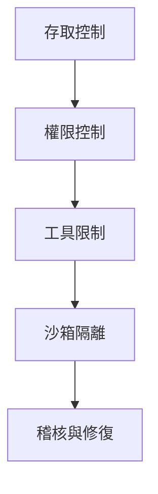

# 安全與沙箱隔離：保護你的 AI 助手

## 學完你能做什麼

- 配置多層安全策略，從存取控制到工具權限
- 使用沙箱隔離限制 AI 助手的檔案系統和網路存取
- 執行安全稽核，发现並修復常见的安全隐患
- 根据不同場景（個人/家庭/公開）调整安全等级

## 你现在的困境

Clawdbot 让你的 AI 助手变得強大，但也带来了新的安全挑战：

- **Shell 存取**：AI 可以執行任意指令，读写檔案
- **網路存取**：AI 可以存取任意 URL 和服務
- **訊息發送**：AI 可以向任何人發送訊息（如配置了 WhatsApp）
- **远程控制**：透過瀏覽器工具控制本地瀏覽器
- **資料暴露**：所有對話历史存储在磁碟上

没有适当的防护，一個被操纵的 AI 模型可能导致灾难性的後果。

## 什麼時候用這一招

- ✅ 你需要執行 AI 助手在自有裝置上，担心安全風險
- ✅ 你想将 AI 助手暴露给多人使用（家庭成员、团队）
- ✅ 你需要限制 AI 存取特定檔案或目錄
- ✅ 你希望隔離不同使用者/會話的存取範圍
- ✅ 你需要让 AI 助手在受限环境中執行（沙箱）

::: info
**重要概念**：安全是分層的，從"誰能存取"到"能做什麼"，最後才是"模型安全"。
:::

## 🎒 開始前的准备

### 前置检查

- [x] 已完成[快速開始](../../start/getting-started/)，了解如何启动 Gateway
- [ ] 已配置至少一個 AI 模型（Anthropic、OpenAI 或 Ollama）
- [ ] 了解你的使用場景（個人使用、家庭共享、公開服務）
- [ ] 了解 Linux 檔案權限概念（chmod）

### 推薦工具

- 指令行工具：Terminal 或 SSH
- 編輯器：你喜欢的程式碼編輯器
- Docker：用于執行沙箱容器（可选）

---

## 核心思路

Clawdbot 的安全模型基於一個核心哲學：**存取控制優先，限制後置安全**。

### 安全分層



1. **存取控制**：決定誰能與你的 AI 助手對話
2. **權限控制**：決定 AI 助手能呼叫哪些工具
3. **沙箱隔離**：決定工具執行在什麼环境中（主机或容器）
4. **稽核與修復**：持續检查和修復安全配置

這個分層设计确保即使模型被操纵，攻擊範圍也被限制在已定义的边界內。

### 存取控制的三層保護

Clawdbot 提供三層存取控制：

| 層级 | 保護內容 | 配置位置 |
|--- | --- | ---|
| **Gateway 認證** | WebSocket 連線 | `gateway.auth` |
| **DM 策略** | 私聊訊息 | `channels.*.dmPolicy` |
| **Group 策略** | 群组訊息 | `channels.*.groupPolicy` / `channels.*.groups` |

每一層都可以独立配置，形成纵深防禦。

---

## 安全稽核：发现風險

Clawdbot 提供內置的安全稽核工具，可以快速发现常见的安全隐患。

### 執行稽核

```bash
# 基础稽核
clawdbot security audit

# 深度稽核（套件括 Gateway 探测）
clawdbot security audit --deep

# 自动修復安全建議
clawdbot security audit --fix
```

### 稽核检查的內容

稽核工具会检查以下方面：

| 检查類別别 | 具體專案 | 風險等级 |
|--- | --- | ---|
| **入站存取** | Gateway 認證、DM 策略、Group 策略 | Critical / Warn |
| **工具存取** | Elevated exec 允許清單、工具 allow/deny | Critical / Warn |
| **網路暴露** | Gateway 繫結模式、Tailscale Serve/Funnel | Critical / Info |
| **瀏覽器控制** | 远程瀏覽器控制認證、URL 協定 | Critical / Warn |
| **檔案權限** | 配置檔案權限、狀態目錄權限 | Critical / Warn |
| **插件信任** | 未显式允許的插件 | Warn |

### 理解稽核输出

稽核报告会按严重级别分類別：

- **Critical（红色）**：立即修復，可能导致远程程式碼執行或資料外洩
- **Warn（黄色）**：建議修復，降低安全边界
- **Info（蓝色）**：資訊提示，非安全问题

### 自动修復

使用 `--fix` 标志時，稽核工具会安全地應用以下修復：

- 将 `groupPolicy="open"` 改为 `allowlist`
- 将 `logging.redactSensitive="off"` 改为 `"tools"`
- 修復檔案權限（配置檔案 600，目錄 700）

::: tip
**最佳實踐**：定期執行稽核，尤其是在更改配置或更新 Gateway 後。
:::

---

## 存取控制：誰能存取你的 AI 助手

存取控制是第一道防線，決定誰能與你的 AI 助手交互。

### Gateway 認證

預設情况下，Gateway 需要認證才能接受 WebSocket 連線。

#### 配置認證方式

```json5
{
  "gateway": {
    "auth": {
      "mode": "token",  // 或 "password"
      "token": "your-long-random-token-please-change-me"
    }
  }
}
```

**認證模式**：

| 模式 | 用途 | 推薦場景 |
|--- | --- | ---|
| `token` | 共享 bearer token | 大多数情况，推薦 |
| `password` | 密码認證 | 本地開发，方便快速测试 |
| Tailscale Identity | Tailscale Serve | 远程存取透過 Tailscale |

::: warning
**重要**：如果 `gateway.bind` 設定为非 loopback（如 `lan`、`tailnet`），必须配置認證，否则拒絕連線。
:::

### DM 策略：私聊保護

DM 策略控制陌生使用者是否能直接與你的 AI 助手對話。

| 策略 | 行为 | 推薦場景 |
|--- | --- | ---|
| `pairing`（預設） | 未知發送者收到配对程式碼，配对前不处理 | 個人使用，推薦 |
| `allowlist` | 未知發送者被拒絕 | 多人可信环境 |
| `open` | 允許任何人 | 公開服務（需 `allowFrom` 套件含 `"*"`） |
| `disabled` | 忽略所有私聊 | 仅使用群组功能 |

#### 配置示例

```json5
{
  "channels": {
    "whatsapp": {
      "dmPolicy": "pairing"
    },
    "telegram": {
      "dmPolicy": "allowlist",
      "allowFrom": ["user123", "user456"]
    }
  }
}
```

#### 管理配对

```bash
# 查看待批准的配对請求
clawdbot pairing list whatsapp

# 批准配对
clawdbot pairing approve whatsapp <配对程式碼>
```

::: tip
**最佳實踐**：預設 `pairing` 模式提供了良好的使用者體验和安全性平衡。仅在你明确信任所有使用者時才使用 `allowlist` 或 `open`。
:::

### Group 策略：群组訊息控制

Group 策略決定 AI 助手如何在群组中回應訊息。

| 策略 | 行为 | 配置位置 |
|--- | --- | ---|
| `allowlist` | 仅接受白名单中的群组 | `channels.whatsapp.groups` |
| `disabled` | 忽略所有群组訊息 | `channels.telegram.groups` |
| `requireMention` | 仅在被 @ 提及或指令触发時回應 | `channels.*.groups.*` |

#### 配置示例

```json5
{
  "channels": {
    "whatsapp": {
      "groups": {
        "*": {
          "requireMention": true
        }
      }
    },
    "discord": {
      "guilds": {
        "your-guild-id": {
          "users": ["user1", "user2"]
        }
      }
    }
  }
}
```

::: tip
**最佳實踐**：在公共群组中啟用 `requireMention`，避免 AI 助手被恶意使用者操控。
:::

### 會話隔離：防止上下文外洩

預設情况下，所有私聊訊息都路由到同一個主會話。当多個使用者可以存取 AI 助手時，這可能导致上下文外洩。

```json5
{
  "session": {
    "dmScope": "per-channel-peer"  // 为每個渠道-發送者建立独立會話
  }
}
```

---

## 工具權限控制：限制 AI 能做什麼

工具權限控制是第二道防線，決定 AI 助手能呼叫哪些工具。

### 工具 Allow/Deny 清單

你可以全局或每個 Agent 配置工具的白名单和黑名单。

```json5
{
  "agents": {
    "defaults": {
      "tools": {
        "allow": ["read", "write", "web_search"],
        "deny": ["exec", "browser", "web_fetch"]
      }
    },
    "list": [
      {
        "id": "read-only",
        "tools": {
          "allow": ["read"],
          "deny": ["write", "edit", "apply_patch", "exec", "browser"]
        }
      }
    ]
  }
}
```

### 常用工具分類別

| 工具類別别 | 具體工具 | 風險等级 |
|--- | --- | ---|
| **檔案操作** | `read`、`write`、`edit`、`apply_patch` | 中等 |
| **Shell 執行** | `exec`、`process` | 高 |
| **瀏覽器控制** | `browser` | 高 |
| **網路存取** | `web_search`、`web_fetch` | 中等 |
| **Canvas 可视化** | `canvas` | 中等 |
| **节點操作** | `nodes_invoke` | 高 |
| **Cron 定時任務** | `cron` | 中等 |
| **訊息發送** | `message`、`sessions_*` | 低 |

### Elevated 模式：主机執行的逃生口

Elevated exec 是一個特殊的逃生口，允許工具在主机上執行，绕过沙箱。

```json5
{
  "tools": {
    "elevated": {
      "enabled": true,
      "allowFrom": {
        "whatsapp": ["your-trusted-user-id"]
      },
      "security": "allowlist",
      "ask": "on"  // 每次執行前询问確認
    }
  }
}
```

::: danger
**重要警告**：Elevated exec 绕过沙箱限制。仅在你完全信任允許的使用者和場景時啟用。
:::

::: tip
**最佳實踐**：对于大多数場景，停用 elevated exec，相依沙箱隔離和严格的工具白名单。
:::

---

## 沙箱隔離：執行在受限环境中

沙箱隔離让工具執行在 Docker 容器中，限制檔案系統和網路存取。

### 沙箱模式

| 模式 | 行为 | 推薦場景 |
|--- | --- | ---|
| `off` | 所有工具在主机上執行 | 個人可信环境 |
| `non-main`（推薦） | 主會話在主机，其他會話在沙箱 | 平衡性能和安全 |
| `all` | 所有會話在沙箱 | 多人环境、公開服務 |

```json5
{
  "agents": {
    "defaults": {
      "sandbox": {
        "mode": "non-main"
      }
    }
  }
}
```

### 工作区存取

工作区存取決定沙箱容器能看到主机的哪些目錄。

| 存取级别 | 行为 | 推薦場景 |
|--- | --- | ---|
| `none`（預設） | 沙箱工作区 `~/.clawdbot/sandboxes` | 最大隔離 |
| `ro` | 代理工作区只读掛載在 `/agent` | 讀取但不寫入檔案 |
| `rw` | 代理工作区读写掛載在 `/workspace` | 需要寫入檔案的 Agent |

```json5
{
  "agents": {
    "defaults": {
      "sandbox": {
        "workspaceAccess": "none"
      }
    }
  }
}
```

### 沙箱範圍

沙箱範圍決定容器隔離粒度。

| 範圍 | 行为 | 容器数量 |
|--- | --- | ---|
| `session`（預設） | 每個會話一個容器 | 较多容器，更好隔離 |
| `agent` | 每個 Agent 一個容器 | 平衡隔離和资源 |
| `shared` | 所有會話共享一個容器 | 节省资源，隔離性最低 |

### Docker 配置

```json5
{
  "agents": {
    "defaults": {
      "sandbox": {
        "docker": {
          "image": "clawdbot-sandbox:bookworm-slim",
          "containerPrefix": "clawdbot-sbx-"
        }
      }
    }
}
```

### 自定义掛載

你可以将主机的额外目錄掛載到沙箱容器。

```json5
{
  "agents": {
    "defaults": {
      "sandbox": {
        "docker": {
          "binds": [
            "/home/user/source:/source:ro",
            "/var/run/docker.sock:/var/run/docker.sock"
          ]
        }
      }
    }
  }
}
```

::: warning
**安全提示**：掛載绕过沙箱檔案系統隔離。敏感掛載（如 docker.sock）应使用 `:ro`（只读）模式。
:::

### 沙箱化瀏覽器

沙箱化瀏覽器将 Chrome 執行個體執行在容器中，隔離瀏覽器操作。

```json5
{
  "agents": {
    "defaults": {
      "sandbox": {
        "browser": {
          "enabled": true,
          "autoStart": true,
          "autoStartTimeoutMs": 10000
        }
      }
    }
  }
}
```

::: tip
**最佳實踐**：沙箱化瀏覽器可以防止 AI 助手存取你日常瀏覽器的登录會話和敏感資料。
:::

---

## 多 Agent 安全配置

不同 Agent 可以有不同的安全配置。

### 場景示例

#### 場景 1：個人 Agent（完全信任）

```json5
{
  "agents": {
    "list": [
      {
        "id": "personal",
        "sandbox": { "mode": "off" },
        "tools": {
          "allow": ["*"],
          "deny": []
        }
      }
    ]
  }
}
```

#### 場景 2：家庭 Agent（只读）

```json5
{
  "agents": {
    "list": [
      {
        "id": "family",
        "workspace": "~/clawd-family",
        "sandbox": {
          "mode": "all",
          "scope": "agent",
          "workspaceAccess": "ro"
        },
        "tools": {
          "allow": ["read"],
          "deny": ["write", "edit", "apply_patch", "exec", "browser"]
        }
      }
    ]
  }
}
```

#### 場景 3：公開 Agent（沙箱 + 严格限制）

```json5
{
  "agents": {
    "list": [
      {
        "id": "public",
        "workspace": "~/clawd-public",
        "sandbox": {
          "mode": "all",
          "scope": "agent",
          "workspaceAccess": "none"
        },
        "tools": {
          "allow": ["web_search", "sessions_list"],
          "deny": ["read", "write", "edit", "apply_patch", "exec", "browser", "web_fetch", "canvas", "nodes", "cron", "gateway", "image"]
        }
      }
    ]
  }
}
```

---

## Docker 化：完全隔離 Gateway

除了工具级别的沙箱，你还可以将整個 Gateway 執行在 Docker 容器中。

### 完全 Docker 化的优势

- 完全隔離 Gateway 程序
- 避免在主机上安裝相依
- 便于部署和管理
- 提供额外的安全边界

::: tip
何時使用 Docker 化 vs 工具沙箱：
- **工具沙箱**：大多数場景，平衡性能和安全
- **Docker 化**：生产环境、多租户部署、需要完全隔離
:::

### Docker 安裝参考

### Docker 安裝参考

详细的 Docker 安裝说明，请参考：[部署選項](../../appendix/deployment/)。

---

## 踩坑提醒

### 常见錯誤

#### ❌ 忘记配置 Gateway 認證

**錯誤配置**：
```json5
{
  "gateway": {
    "bind": "lan"  // 危险！
    "auth": {}
  }
}
```

**後果**：任何能連線到你區域網路的人都能控制你的 AI 助手。

**正确配置**：
```json5
{
  "gateway": {
    "bind": "loopback",  // 或配置強認證
    "auth": {
      "mode": "token",
      "token": "your-secure-token"
    }
  }
}
```

#### ❌ 使用 `dmPolicy: "open"` 但忘记 `allowFrom`

**錯誤配置**：
```json5
{
  "channels": {
    "whatsapp": {
      "dmPolicy": "open"  // 危险！
    }
  }
}
```

**後果**：任何人都能给你的 AI 助手发訊息。

**正确配置**：
```json5
{
  "channels": {
    "whatsapp": {
      "dmPolicy": "open",
      "allowFrom": ["*"]  // 必须显式允許
    }
  }
}
```

#### ❌ 啟用 Elevated exec 但没有配置 allowFrom

**錯誤配置**：
```json5
{
  "tools": {
    "elevated": {
      "enabled": true  // 危险！
    }
  }
}
```

**後果**：任何使用者都能執行主机指令。

**正确配置**：
```json5
{
  "tools": {
    "elevated": {
      "enabled": true,
      "allowFrom": {
        "discord": ["your-user-id"]  // 限制允許的使用者
      },
      "security": "allowlist",
      "ask": "on"  // 要求確認
    }
  }
}
```

#### ❌ 敏感掛載使用读写模式

**錯誤配置**：
```json5
{
  "agents": {
    "defaults": {
      "sandbox": {
        "docker": {
          "binds": [
            "/var/run/docker.sock:/var/run/docker.sock"  // 危险！
          ]
        }
      }
    }
  }
}
```

**後果**：沙箱可以控制 Docker 守护程序。

**正确配置**：
```json5
{
  "agents": {
    "defaults": {
      "sandbox": {
        "docker": {
          "binds": [
            "/var/run/docker.sock:/var/run/docker.sock:ro"  // 只读
          ]
        }
      }
    }
}
```

### 最佳實踐总结

| 實踐 | 原因 |
|--- | ---|
| 預設使用 `pairing` 模式 | 平衡使用者體验和安全 |
| 群组訊息使用 `requireMention` | 避免被操控 |
| 使用工具白名单而非黑名单 | 最小權限原则 |
| 啟用沙箱但設定 `workspaceAccess: "none"` | 隔離工作区存取 |
| 定期執行安全稽核 | 持續安全監控 |
| 将敏感密钥存储在环境变量或配置檔案中 | 避免程式碼外洩 |

---

## 本课小结

本课介绍了 Clawdbot 的安全模型和沙箱隔離功能：

**核心要點**：

1. **安全分層**：存取控制 → 權限控制 → 沙箱隔離 → 稽核與修復
2. **存取控制**：Gateway 認證、DM 策略、Group 策略
3. **工具權限**：allow/deny 清單、Elevated 模式
4. **沙箱隔離**：模式、範圍、工作区存取、Docker 配置
5. **安全稽核**：`clawdbot security audit` 发现和修復问题

**安全第一原则**：
- 從最小權限開始，仅在必要時放宽
- 使用沙箱隔離限制攻擊範圍
- 定期稽核和更新配置
- 对敏感功能（如 Elevated exec）保持谨慎

---

## 下一课预告

> 下一课我们将學習 **[远程 Gateway 與 Tailscale](../remote-gateway/)**。
>
> 你会學到：
> - 透過 Tailscale Serve 暴露 Gateway 到你的 Tailnet
> - 使用 Tailscale Funnel 公開存取（需谨慎）
> - SSH 隧道和反向代理配置
> - 远程存取的安全最佳實踐

---

## 附录：源码参考

<details>
<summary><strong>點击展開查看源码位置</strong></summary>

> 更新時間：2026-01-27

| 功能 | 檔案路徑 | 行号 |
|--- | --- | ---|
| 安全稽核 | [`src/security/audit.ts`](https://github.com/clawdbot/clawdbot/blob/main/src/security/audit.ts#L1-L910) | 1-910 |
| 安全修復 | [`src/security/fix.ts`](https://github.com/clawdbot/clawdbot/blob/main/src/security/fix.ts#L1-L385) | 1-385 |
| 檔案權限检查 | [`src/security/audit-fs.ts`](https://github.com/clawdbot/clawdbot/blob/main/src/security/audit-fs.ts) | 全檔案 |
| Gateway 配置 Schema | [`src/config/zod-schema.core.ts`](https://github.com/clawdbot/clawdbot/blob/main/src/config/zod-schema.core.ts) | 全檔案 |
| Agent Defaults Schema | [`src/config/zod-schema.agent-defaults.ts`](https://github.com/clawdbot/clawdbot/blob/main/src/config/zod-schema.agent-defaults.ts) | 1-172 |
| Sandbox Schema | [`src/config/zod-schema.agent-runtime.ts`](https://github.com/clawdbot/clawdbot/blob/main/src/config/zod-schema.agent-runtime.ts) | 82-511 |
| 沙箱管理 | [`src/agents/sandbox.ts`](https://github.com/clawdbot/clawdbot/blob/main/src/agents/sandbox.ts) | 全檔案 |
| 沙箱配置解析 | [`src/agents/sandbox/config.js`](https://github.com/clawdbot/clawdbot/blob/main/src/agents/sandbox/config.js) | 全檔案 |
| Docker 設定 | [`src/agents/sandbox/docker.js`](https://github.com/clawdbot/clawdbot/blob/main/src/agents/sandbox/docker.js) | 全檔案 |
| 安全文档 | [`docs/gateway/security.md`](https://github.com/clawdbot/clawdbot/blob/main/docs/gateway/security.md) | 全檔案 |
| 沙箱文档 | [`docs/gateway/sandboxing.md`](https://github.com/clawdbot/clawdbot/blob/main/docs/gateway/sandboxing.md) | 全檔案 |
| 沙箱 CLI | [`docs/cli/sandbox.md`](https://github.com/clawdbot/clawdbot/blob/main/docs/cli/sandbox.md) | 全檔案 |

**關键配置欄位**：

```typescript
// Sandbox 配置
sandbox: {
  mode: "off" | "non-main" | "all",  // 沙箱模式
  workspaceAccess: "none" | "ro" | "rw",  // 工作区存取
  scope: "session" | "agent" | "shared",  // 沙箱範圍
  docker: {
    image: string,  // Docker 映像檔
    binds: string[],  // 主机掛載
    network: "bridge" | "none" | "custom"  // 網路模式
  },
  browser: {
    enabled: boolean,  // 是否沙箱化瀏覽器
    autoStart: boolean,  // 自动启动
  },
  prune: {
    idleHours: number,  // 空闲後自动刪除
    maxAgeDays: number,  // 最大保留天数
  }
}

// 工具權限
tools: {
  allow: string[],  // 允許的工具
  deny: string[],  // 拒絕的工具
  elevated: {
    enabled: boolean,  // 是否啟用主机執行
    allowFrom: {  // 每個渠道的允許清單
      [provider: string]: string[] | number[]
    },
    security: "deny" | "allowlist" | "full",  // 安全策略
    ask: "off" | "on-miss" | "always",  // 確認策略
  }
}

// DM 策略
dmPolicy: "pairing" | "allowlist" | "open" | "disabled"

// Group 策略
groupPolicy: "allowlist" | "open" | "disabled"
```

**關键常量**：

- `DEFAULT_SANDBOX_IMAGE`: `"clawdbot-sandbox:bookworm-slim"` - 預設沙箱映像檔
- `DEFAULT_SANDBOX_COMMON_IMAGE`: 預設通用沙箱映像檔

**關键函式**：

- `runSecurityAudit()`: 執行安全稽核
- `fixSecurityFootguns()`: 應用安全修復
- `resolveSandboxConfigForAgent()`: 解析 Agent 的沙箱配置
- `buildSandboxCreateArgs()`: 构建沙箱容器建立参数

</details>
