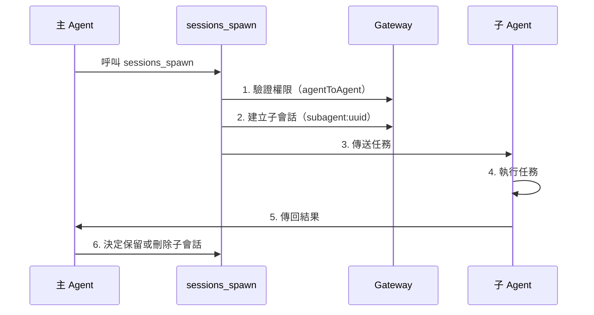

# 會話管理與多 Agent：會話隔離、子 Agent 協作和上下文壓縮

## 學完你能做什麼

- 理解 Clawdbot 的會話模型和會話鍵結構
- 配置不同 Agent 之間的會話隔離
- 使用子 Agent 完成隔離任務
- 管理上下文視窗，避免超出模型限制
- 掌握會話重置和壓縮的最佳實踐

## 你現在的困境

當你的 AI 助手同時服務於多個用戶、多個渠道時，你可能會遇到這些問題：

- **會話串擾**：不同用戶的訊息混在一起，AI 記不住各自的歷史
- **上下文爆炸**：長時間對話後，模型開始"失憶"或回應變慢
- **子任務混亂**：主 Agent 調用子任務時，沒有清晰的隔離邊界
- **資源浪費**：所有 Agent 共享同一套會話，導致儲存和運算資源無法有效利用

Clawdbot 的**會話管理系統**就是為了解決這些問題而設計的。

## 核心思路

**會話**是 Clawdbot 的核心抽象單元——每個會話代表一段獨立的對話歷史，擁有自己的訊息記錄、元資料和生命週期。

Clawdbot 透過**會話鍵（session key）**來識別和隔離不同的會話。會話鍵不僅區分不同的對話物件（用戶、群組、頻道），還區分不同的 Agent 實例。

::: info 什麼是會話鍵？

會話鍵是一個字串識別符，用於唯一識別一個會話。格式範例：
- `agent:main:main`（主 Agent 的主會話）
- `agent:work:main`（工作 Agent 的主會話）
- `agent:main:whatsapp:group:123`（WhatsApp 群組會話）
- `cron:job-id`（定時任務會話）

Clawdbot 根據會話鍵將訊息路由到正確的 Agent，並維護獨立的對話歷史。
:::

## 會話模型

### 會話鍵的組成

Clawdbot 使用結構化的會話鍵來識別不同類型的會話：

| 會話類型 | 鍵格式 | 範例 | 說明 |
|--- | --- | --- | ---|
| **主會話** | `agent:<agentId>:<mainKey>` | `agent:main:main` | 每個 Agent 的預設主會話 |
| **直接訊息** | `agent:<agentId>:dm:<peerId>` | `agent:main:dm:+15551234567` | 按 `dmScope` 設定隔離 |
| **群組/頻道** | `agent:<agentId>:<channel>:group:<id>` | `agent:main:whatsapp:group:123` | 群組和頻道自動隔離 |
| **子 Agent** | `agent:<agentId>:subagent:<uuid>` | `agent:main:subagent:a1b2c3d4` | 子 Agent 的隔離會話 |
| **定時任務** | `cron:<jobId>` | `cron:daily-report` | Cron 任務的專用會話 |
| **Webhook** | `hook:<uuid>` | `hook:xyz789` | Webhook 觸發的會話 |

### 會話儲存

會話資料儲存在兩個位置：

```bash
# 會話索引（元資料）
~/.clawdbot/agents/<agentId>/sessions/sessions.json

# 訊息歷史（每會話一個檔案）
~/.clawdbot/agents/<agentId>/sessions/<sessionId>.jsonl
```

**sessions.json** 是一個對應表，記錄：
- 會話鍵 → 會話元資料（sessionId, updatedAt, model, tokens 等）
- 刪除這些條目是安全的，它們會在需要時自動重建

**JSONL 檔案**儲存完整的對話歷史，每行一條訊息記錄。

::: tip Gateway 是單一真相源

所有會話狀態由 Gateway 擁有。UI 用戶端（macOS 應用程式、WebChat）必須從 Gateway 查詢會話列表和 token 計數，而不是直接讀取本地檔案。

在遠端模式下，你關心的會話儲存在遠端 Gateway 主機上，而不是你的 Mac 上。
:::

## 會話隔離機制

### 單 Agent 模式（預設）

如果不做任何設定，Clawdbot 執行單個 Agent：
- `agentId` 預設為 `main`
- 所有 DM 會話共享主會話鍵（`agent:main:main`）
- 這意味著**同一個用戶從不同渠道發來的訊息會進入同一個會話**

### 多 Agent 模式

**多個 Agent = 多個隔離的大腦**

每個 Agent 擁有自己獨立的：
- **Workspace**（工作區檔案、AGENTS.md、SOUL.md）
- **State directory**（認證設定、模型登錄檔）
- **Session store**（聊天歷史和路由狀態）

#### 為什麼要多 Agent？

| 場景 | 解決方案 |
|--- | ---|
| **多用戶共享伺服器** | 每個用戶有獨立 Agent，會話完全隔離 |
| **不同渠道不同人格** | WhatsApp 用日常 Agent，Telegram 用深度工作 Agent |
| **權限分離** | 家庭 Agent 限制工具，個人 Agent 完全存取 |
| **不同環境** | 開發 Agent、生產 Agent 完全隔離 |

#### 設定多 Agent

**第 1 步：新增新 Agent**

```bash
clawdbot agents add work
```

這會在 `~/.clawdbot/agents/work/` 建立新的 Agent 目錄。

**第 2 步：設定路由規則**

在 `~/.clawdbot/clawdbot.json` 中新增 `bindings`：

```json5
{
  agents: {
    list: [
      { id: "home", workspace: "~/clawd-home", name: "Home" },
      { id: "work", workspace: "~/clawd-work", name: "Work" }
    ]
  },
  bindings: [
    { agentId: "home", match: { channel: "whatsapp", accountId: "personal" } },
    { agentId: "work", match: { channel: "whatsapp", accountId: "biz" } }
  ]
}
```

**第 3 步：驗證設定**

```bash
clawdbot agents list --bindings
```

#### 路由規則（確定性匹配）

當訊息到達時，Clawdbot 按**最具體優先**的順序匹配規則：

1. **peer** 匹配（精確的 DM/group/channel id）
2. **guildId**（Discord）
3. **teamId**（Slack）
4. **accountId** 匹配
5. 渠道層級匹配（`accountId: "*"`）
6. 回退到預設 Agent

::: warning 注意綁定順序

綁定列表中的順序很重要！更具體的規則應該放在前面。

例如，如果你想將一個特定 DM 路由到 `work` Agent，其他 WhatsApp DM 路由到 `home` Agent，必須先寫 peer 規則：
```json5
{
  bindings: [
    { agentId: "work", match: { channel: "whatsapp", peer: { kind: "dm", id: "+15551234567" } } },
    { agentId: "home", match: { channel: "whatsapp" } }
  ]
}
```
:::

### DM 範圍控制

使用 `session.dmScope` 控制直接訊息如何分組：

| 選項 | 行為 | 適用場景 |
|--- | --- | ---|
| `main`（預設） | 所有 DM 共享主會話 | 單用戶多渠道 |
| `per-peer` | 按發送者 ID 隔離 | 多用戶環境 |
| `per-channel-peer` | 按渠道 + 發送者隔離 | 共用收件匣 |

設定範例：

```json5
{
  session: {
    dmScope: "per-channel-peer"  // 每個渠道的每個用戶獨立會話
  }
}
```

### 身份連結（Identity Links）

如果同一個用戶使用多個平台（如 WhatsApp 和 Telegram），你可以透過 `session.identityLinks` 讓他們共享會話：

```json5
{
  session: {
    identityLinks: {
      alice: ["telegram:123456789", "discord:987654321012345678"]
    }
  }
}
```

這樣，Alice 從 Telegram 或 Discord 發來的訊息都會進入 `agent:<agentId>:dm:alice` 會話。

## 子 Agent 協作

### 什麼是子 Agent

**子 Agent**是一個在隔離會話中執行的 Agent 實例，用於執行特定任務而不影響主會話的上下文。

典型使用場景：
- **程式碼審查**：子 Agent 分析程式碼，返回摘要
- **資料提取**：子 Agent 從長文件中提取資訊
- **平行任務**：主 Agent 等待時，子 Agent 在背景執行
- **沙箱隔離**：在受限環境中執行不信任的任務

### sessions_spawn 工具

使用 `sessions_spawn` 工具建立子 Agent：

```json
{
  "task": "分析這個文件並提取關鍵要點",
  "label": "文件分析",
  "model": "anthropic/claude-opus-4-5",
  "thinking": "detailed",
  "runTimeoutSeconds": 300,
  "cleanup": "keep"
}
```

參數說明：

| 參數 | 類型 | 必填 | 說明 |
|--- | --- | --- | ---|
| `task` | string | ✅ | 子 Agent 的任務描述 |
| `label` | string | ❌ | 可讀的任務標籤（用於追蹤） |
| `agentId` | string | ❌ | 目標 Agent ID（預設當前 Agent） |
| `model` | string | ❌ | 模型覆蓋 |
| `thinking` | string | ❌ | 思考等級（`minimal`/`standard`/`detailed`） |
| `runTimeoutSeconds` | number | ❌ | 逾時時間（秒） |
| `cleanup` | string | ❌ | 任務完成後清理策略（`keep`/`delete`） |

### 子 Agent 生命週期



**生命週期步驟**：

1. **權限檢查**：如果跨 Agent 呼叫，驗證 `tools.agentToAgent.allow` 設定
2. **建立子會話**：產生唯一的 `agent:<agentId>:subagent:<uuid>` 鍵
3. **執行任務**：子 Agent 在隔離會話中完成任務
4. **傳回結果**：結果流式傳回到主 Agent
5. **清理策略**：
   - `cleanup: "keep"`：保留子會話用於後續檢查
   - `cleanup: "delete"`：自動刪除子會話

### 設定 Agent 間通訊

預設情況下，Agent 間通訊是停用的。需要明確啟用：

```json5
{
  tools: {
    agentToAgent: {
      enabled: true,
      allow: ["home", "work", "family"]
    }
  }
}
```

權限說明：
- `enabled: false`：完全停用 Agent 間通訊
- `allow: ["*"]`：允許任何 Agent
- `allow: ["home", "work"]`：只允許特定 Agent

::: danger 安全提醒

子 Agent 繼承父 Agent 的部分上下文，但**不會**獲得完整的父會話歷史。這既是特性（節省 token），也是限制（子 Agent 不知道完整上下文）。

對於敏感操作，考慮在主會話中完成而不是透過子 Agent。
:::

## 上下文壓縮

### 什麼是上下文視窗

每個 AI 模型都有一個**上下文視窗（context window）**——它能在一次推理中看到的最大 token 數量。

長時間對話會累積訊息和工具結果。一旦接近模型限制，Clawdbot 會**壓縮（compact）**歷史以騰出空間。

### 自動壓縮

當會話接近或超出上下文視窗時，Clawdbot 自動觸發壓縮：

- **壓縮前**：先執行一個**靜默記憶刷新**，提示模型將持久化筆記寫入磁碟（如果工作區可寫）
- **壓縮過程**：將舊對話總結為壓縮摘要，保留最近的訊息
- **持久化**：壓縮結果寫入 JSONL 歷史檔案
- **重試**：使用壓縮後的上下文重試原始請求

你會看到：
- `🧹 Auto-compaction complete`（在詳細模式下）
- `/status` 顯示 `🧹 Compactions: <count>`

### 手動壓縮

使用 `/compact` 指令手動觸發壓縮：

```
/compact
```

你可以新增壓縮指令：

```
/compact Focus on decisions and open questions
```

這會指導 AI 在總結時關注特定內容。

### 壓縮 vs 剪枝

| 操作 | 作用 | 持久化 | 位置 |
|--- | --- | --- | ---|
| **壓縮（Compaction）** | 總結舊對話 | ✅ | 寫入 JSONL |
| **剪枝（Pruning）** | 移除舊工具結果 | ❌ | 僅記憶體中 |

::: tip 壓縮策略建議

- **壓縮**：儲存資訊摘要，適合需要回顧歷史
- **剪枝**：暫時清理，適合減少單次請求的 token 使用
- **/new**：完全清空會話，用於開始新主題

根據你的使用習慣選擇合適的策略。
:::

### 壓縮設定

在 `~/.clawdbot/clawdbot.json` 中設定壓縮行為：

```json5
{
  agents: {
    defaults: {
      compaction: {
        enabled: true,
        threshold: 0.9,  // 上下文使用 90% 時觸發
        trigger: "auto"  // auto/manual
      }
    }
  }
}
```

## 跟我做：設定會話管理

讓我們透過一個實際場景來設定會話管理。

### 場景

你有一個 WhatsApp 號碼，希望：
1. 個人聯絡人使用 `home` Agent（日常對話）
2. 工作群組使用 `work` Agent（專業回應）
3. 啟用子 Agent 用於隔離任務

### 第 1 步：新增兩個 Agent

```bash
# 新增家庭 Agent
clawdbot agents add home

# 新增工作 Agent
clawdbot agents add work
```

**你應該看到**：提示你輸入工作區路徑等資訊。

### 第 2 步：編輯設定檔

開啟 `~/.clawdbot/clawdbot.json`，新增 Agent 列表和綁定規則：

```json5
{
  agents: {
    list: [
      {
        id: "home",
        name: "Home",
        workspace: "~/clawd-home",
        model: "anthropic/claude-sonnet-4-5"
      },
      {
        id: "work",
        name: "Work",
        workspace: "~/clawd-work",
        model: "anthropic/claude-opus-4-5"
      }
    ]
  },
  bindings: [
    // 個人訊息路由到 home Agent
    { agentId: "home", match: { channel: "whatsapp", peer: { kind: "dm", id: "+15551230001" } } },
    // 工作群組路由到 work Agent
    { agentId: "work", match: { channel: "whatsapp", peer: { kind: "group", id: "120363999999999999@g.us" } } },
    // 其他 WhatsApp 訊息路由到 home Agent（預設）
    { agentId: "home", match: { channel: "whatsapp" } }
  ],
  tools: {
    agentToAgent: {
      enabled: true,
      allow: ["home", "work"]
    }
  }
}
```

### 第 3 步：重新啟動 Gateway

```bash
clawdbot gateway restart
```

**你應該看到**：Gateway 啟動日誌，顯示已載入的 Agent 和綁定規則。

### 第 4 步：測試子 Agent 呼叫

在 `home` Agent 的會話中傳送：

```
請用子 Agent 分析這個 PDF 文件並提取關鍵資訊：/path/to/file.pdf
```

Agent 應該自動呼叫 `sessions_spawn` 工具，你會看到：
- 子 Agent 建立通知
- 任務執行過程
- 結果傳回

### 第 5 步：檢查會話狀態

在聊天中傳送：

```
/status
```

**你應該看到**：
- 當前會話的 token 使用情況
- 壓縮次數
- 模型資訊

## 檢查點 ✅

完成設定後，驗證以下幾點：

- [ ] `clawdbot agents list --bindings` 顯示正確的綁定規則
- [ ] 個人 DM 路由到 `home` Agent
- [ ] 工作群組路由到 `work` Agent
- [ ] 子 Agent 呼叫正常運作
- [ ] `/status` 顯示正確的會話資訊

## 踩坑提醒

### 常見錯誤

| 錯誤 | 原因 | 解決方法 |
|--- | --- | ---|
| **Agent 間呼叫被禁止** | `tools.agentToAgent.enabled` 未啟用或 `allow` 列表不包含目標 Agent | 檢查設定，確保已啟用並新增允許列表 |
| **子 Agent 建立失敗** | 跨 Agent 呼叫時，目標 Agent 不在允許列表中 | 檢查 `tools.agentToAgent.allow` 設定 |
| **會話鍵衝突** | 綁定規則順序錯誤，更具體的規則被覆蓋 | 將 peer 規則放在渠道規則之前 |
| **壓縮失敗** | 上下文過小或模型不支援壓縮 | 檢查模型上下文視窗和壓縮設定 |

### 設定建議

- **從簡單開始**：先用單 Agent 測試，確認功能正常後再新增多 Agent
- **使用標籤**：給子 Agent 任務新增清晰的 `label`，方便追蹤
- **監控 token 使用**：定期檢查 `/status`，了解上下文使用情況
- **備份設定**：修改 `clawdbot.json` 前先備份

## 本課小結

本課介紹了 Clawdbot 的會話管理系統：

- **會話模型**：會話鍵、儲存位置、生命週期
- **會話隔離**：多 Agent 模式、DM 範圍控制、身份連結
- **子 Agent 協作**：`sessions_spawn` 工具、權限控制、清理策略
- **上下文壓縮**：自動/手動壓縮、壓縮 vs 剪枝

透過合理設定會話管理，你可以讓 Clawdbot 同時服務多個用戶和場景，每個都有自己的隔離上下文和歷史。

## 下一課預告

> 下一課我們學習 **[瀏覽器自動化工具](../tools-browser/)**。
>
> 你會學到：
> - 如何設定和使用瀏覽器工具
> - 瀏覽器自動化的安全限制
> - 截圖和表單操作

---

## 附錄：原始碼參考

<details>
<summary><strong>點擊展開查看原始碼位置</strong></summary>

> 更新時間：2026-01-27

| 功能 | 檔案路徑 | 行號 |
|--- | --- | ---|
| 會話鍵解析 | [`src/routing/session-key.ts`](https://github.com/moltbot/moltbot/blob/main/src/routing/session-key.ts) | 1-100 |
| 會話設定 Schema | [`src/config/zod-schema.session.ts`](https://github.com/moltbot/moltbot/blob/main/src/config/zod-schema.session.ts) | 11-83 |
| 子 Agent 產生工具 | [`src/agents/tools/sessions-spawn-tool.ts`](https://github.com/moltbot/moltbot/blob/main/src/agents/tools/sessions-spawn-tool.ts) | 28-269 |
| 會話工具輔助函數 | [`src/agents/tools/sessions-helpers.ts`](https://github.com/moltbot/moltbot/blob/main/src/agents/tools/sessions-helpers.ts) | 1-328 |
| 會話管理文件 | [`docs/concepts/session.md`](https://github.com/moltbot/moltbot/blob/main/docs/concepts/session.md) | 1-151 |
| 多 Agent 路由文件 | [`docs/concepts/multi-agent.md`](https://github.com/moltbot/moltbot/blob/main/docs/concepts/multi-agent.md) | 1-355 |
| 上下文壓縮文件 | [`docs/concepts/compaction.md`](https://github.com/moltbot/moltbot/blob/main/docs/concepts/compaction.md) | 1-50 |

**關鍵常數**：
- `SESSION_ID_RE = /^[0-9a-f]{8}-[0-9a-f]{4}-[0-9a-f]{4}-[0-9a-f]{4}-[0-9a-f]{12}$/i`：會話 ID 正規表示式（`sessions-helpers.ts:96`）

**關鍵類型**：
- `SessionKind = "main" | "group" | "cron" | "hook" | "node" | "other"`：會話類型枚舉（`sessions-helpers.ts:11`）
- `SessionListRow`：會話列表行結構（`sessions-helpers.ts:19-41`）

**關鍵函數**：
- `createSessionsSpawnTool()`：建立子 Agent 產生工具（`sessions-spawn-tool.ts:60-269`）
- `resolveSessionReference()`：解析會話參考（`sessions-helpers.ts:215-253`）
- `classifySessionKind()`：分類會話類型（`sessions-helpers.ts:255-271`）
- `createAgentToAgentPolicy()`：建立 Agent 間通訊策略（`sessions-helpers.ts:72-94`）

</details>
