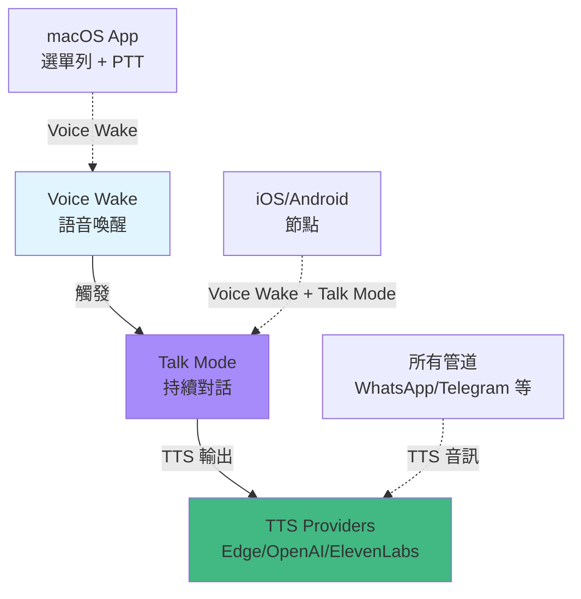

# 語音喚醒與文字轉語音

## 學完你能做什麼

- 設定 Voice Wake 語音喚醒,支援 macOS/iOS/Android 節點
- 使用 Talk Mode 進行持續語音對話（語音輸入 → AI → 語音輸出）
- 設定多個 TTS 供應商（Edge、OpenAI、ElevenLabs）和自動故障切換
- 自訂語音喚醒詞、TTS 聲音和對話參數
- 排查語音功能常見問題（權限、音訊格式、API 錯誤）

## 你現在的困境

語音互動很方便,但設定起來可能讓你困惑:

- 應該用哪個 TTS 供應商?Edge 免費但品質一般,ElevenLabs 品質高但需要付費
- Voice Wake 和 Talk Mode 有什麼區別?什麼時候用哪個?
- 如何設定自訂喚醒詞而不是預設的"clawd"?
- 在不同裝置（macOS、iOS、Android）上如何同步語音設定?
- TTS 輸出格式為什麼有講究?為什麼 Telegram 用 Opus 而其他管道用 MP3?

## 什麼時候用這一招

- **Voice Wake**：需要 hands-free 語音助理體驗時。比如在 macOS 或 iOS/Android 上直接說話喚醒 AI,無需鍵盤操作。
- **Talk Mode**：需要持續語音對話時。比如開車、做飯、走路時,用語音和 AI 多輪對話。
- **TTS 設定**：希望 AI 回覆透過語音播放時。比如為長者或視障使用者提供語音助理,或個人語音助理體驗。
- **自訂語音**：對預設語音不滿意時。比如調整語速、音調、穩定性,或切換到中文語音模型。

## 🎒 開始前的準備

::: warning 前置條件
本教學假設你已完成 [快速開始](../../start/getting-started/),已安裝並啟動了 Gateway。
::

- Gateway 守護程式正在運行
- 至少設定了一個 AI 模型供應商（Anthropic 或 OpenAI）
- **對於 Voice Wake**：macOS/iOS/Android 裝置已安裝並連接到 Gateway
- **對於 Talk Mode**：iOS 或 Android 節點已連接（macOS 選單列應用程式僅支援 Voice Wake）
- **對於 ElevenLabs TTS**：準備好 ElevenLabs API Key（如需高品質語音）
- **對於 OpenAI TTS**：準備好 OpenAI API Key（可選,Edge TTS 免費但品質一般）

::: info 權限提醒
Voice Wake 和 Talk Mode 需要以下權限：
- **麥克風權限**：語音輸入必需
- **語音辨識權限**（Speech Recognition）：語音轉文字
- **輔助功能權限**（macOS）：全域快捷鍵監聽（如 Cmd+Fn push-to-talk）
::

## 核心思路

### 三大語音功能分工明確

Clawdbot 的語音功能分為三個獨立模組,但協同工作：



**核心區別**：

| 功能 | 用途 | 支援平台 | 觸發方式 | 對話輪次 |
|--- | --- | --- | --- | ---|
| | **Voice Wake** | 單次語音指令 | macOS/iOS/Android | 喚醒詞（如"clawd"） | 單次 |
| | **Talk Mode** | 持續語音對話 | iOS/Android | 手動開啟 | 多輪（迴圈） |
| | **TTS** | 文字轉語音 | 所有管道 | AI 回覆自動觸發 | 無（被動） |

### Voice Wake：全域喚醒詞系統

**關鍵設計**：喚醒詞是 **Gateway 全域設定**,不是節點本機設定。

- **儲存位置**：`~/.clawdbot/settings/voicewake.json`（Gateway 主機）
- **預設喚醒詞**：`["clawd", "claude", "computer"]`
- **同步機制**：任何節點/macOS App 修改喚醒詞後,Gateway 廣播到所有裝置

```json
{
  "triggers": ["clawd", "claude", "computer"],
  "updatedAtMs": 1737489200000
}
```

**Push-to-Talk（按住說話）**：
- macOS 支援按住 `Cmd+Fn` 或 `右 Option` 鍵直接開始語音輸入,無需喚醒詞
- iOS/Android 透過 UI 按鈕支援

### Talk Mode：語音對話迴圈

Talk Mode 是一個持續語音對話迴圈：

```
1) 監聽語音輸入（語音辨識）
2) 發送文字到 AI 模型（chat.send）
3) 等待 AI 回覆
4) 透過 TTS 播放回覆（串流播放）
5) 回到步驟 1（迴圈）
```

**關鍵特性**：

| 特性 | 描述 | 平台支援 |
|--- | --- | ---|
| **中斷播放** | 使用者說話時立即停止 TTS 播放 | iOS/Android |
| **狀態轉換** | Listening → Thinking → Speaking 三態迴圈 | iOS/Android |
| **JSON 指令** | AI 可在回覆中嵌入 JSON 控制語音參數 | 所有 |
| **串流 TTS** | ElevenLabs 串流 API,低延遲播放 | iOS/Android/macOS |

### TTS：多供應商自動故障切換

Clawdbot 支援三個 TTS 供應商,按優先順序自動故障切換：

```typescript
// 優先順序（源碼：src/tts/tts.ts:482-484）
const providers = [primaryProvider, ...otherProviders];

// 範例：主選 ElevenLabs,失敗後自動嘗試 OpenAI,最後 Edge
providers = ["elevenlabs", "openai", "edge"];
```

| 供應商 | 品質 | 速度 | 成本 | API Key | 推薦場景 |
|--- | --- | --- | --- | --- | ---|
| **ElevenLabs** | ⭐⭐⭐⭐⭐ | ⭐⭐⭐⭐ | 付費 | 高品質語音、Talk Mode（串流） |
| **OpenAI** | ⭐⭐⭐⭐ | ⭐⭐⭐ | 付費 | 標準品質、穩定可靠 |
| **Edge TTS** | ⭐⭐⭐ | ⭐⭐ | 免費 | 預設免費、測試、備用 |

::: info Edge TTS 說明
Edge TTS 使用微軟 Edge 線上神經 TTS 服務（透過 `node-edge-tts`）,無需 API Key,但無官方 SLA。適合作為免費備用,不建議用於生產環境。
::

### 輸出格式：管道決定格式

TTS 輸出格式由**目標管道**決定,而非設定：

| 管道 | 輸出格式 | 格式說明 | 原因 |
|--- | --- | --- | ---|
| **Telegram** | Opus (`opus_48000_64`) | 48kHz/64kbps | Telegram 語音訊息要求 Opus |
| **其他管道** | MP3 (`mp3_44100_128`) | 44.1kHz/128kbps | 通用相容性好 |
| **Talk Mode** | PCM (`pcm_44100` / `pcm_24000`) | 原始音訊串流 | iOS/Android AudioTrack 播放 |

::: tip 自動格式選擇
Clawdbot 會自動根據管道選擇格式,你無需手動設定。但可以透過 `messages.tts.edge.outputFormat` 自訂 Edge TTS 輸出。
::

## 跟我做

### 第 1 步：設定基礎 TTS（最簡設定）

**為什麼**
Edge TTS 是零設定起點,無需 API Key,適合快速測試。

編輯 `~/.clawdbot/clawdbot.json`：

```yaml
messages:
  tts:
    auto: "always"  # 開啟自動 TTS
    provider: "edge"  # 使用 Edge TTS
    edge:
      enabled: true
      voice: "zh-CN-XiaoxiaoNeural"  # 中文語音
      lang: "zh-CN"
      outputFormat: "audio-24khz-48kbitrate-mono-mp3"
```

**你應該看到**：
- AI 回覆自動附加音訊檔案
- 管道（如 WhatsApp/Telegram）收到語音訊息或音訊連結
- 預設語音為英文（`en-US-MichelleNeural`）,如需中文需修改 `voice` 欄位

::: tip 中文語音範例
Edge TTS 支援中文語音,範例 ID：
- `zh-CN-XiaoxiaoNeural`（女聲,溫柔）
- `zh-CN-YunxiNeural`（男聲）
- `zh-CN-YunyangNeural`（男聲,沈穩）
::

**重啟 Gateway**：

```bash
clawdbot gateway restart
```

### 第 2 步：設定 ElevenLabs TTS（推薦高品質）

**為什麼**
ElevenLabs 提供業界最佳語音品質和表現力,支援串流 TTS（低延遲）,適合 Talk Mode。

#### 2.1 取得 API Key

訪問 [ElevenLabs 控制台](https://elevenlabs.io/app),建立帳戶並產生 API Key。

#### 2.2 設定認證

**方式 A：環境變數（推薦）**

```bash
export ELEVENLABS_API_KEY="xi_..."
# 或使用別名
export XI_API_KEY="xi_..."
```

**方式 B：設定檔**

編輯 `~/.clawdbot/clawdbot.json`：

```yaml
messages:
  tts:
    auto: "always"
    provider: "elevenlabs"  # 主選 ElevenLabs
    elevenlabs:
      apiKey: "xi_..."  # 可選,優先用環境變數
      baseUrl: "https://api.elevenlabs.io"
      voiceId: "pMsXgVXv3BLzUgSXRplE"  # 預設語音
      modelId: "eleven_multilingual_v2"  # 多語言模型
      voiceSettings:
        stability: 0.5  # 穩定性（0-1）
        similarityBoost: 0.75  # 相似度提升（0-1）
        style: 0.0  # 風格（0-1）
        useSpeakerBoost: true
        speed: 1.0  # 語速（0.5-2.0）
```

**你應該看到**：
- AI 回覆音訊品質明顯提升
- Telegram 收到圓形語音訊息氣泡（Opus 格式）
- 可以透過 `/tts provider edge` 切換回備用供應商

### 第 3 步：設定 OpenAI TTS 作為備用

**為什麼**
設定備用供應商確保主供應商（如 ElevenLabs）遇到 API 錯誤或配額限制時自動切換。

編輯 `~/.clawdbot/clawdbot.json`：

```yaml
messages:
  tts:
    auto: "always"
    provider: "elevenlabs"  # 主選
    openai:
      apiKey: "sk-..."  # 可選,優先用環境變數
      model: "gpt-4o-mini-tts"  # OpenAI TTS 模型
      voice: "alloy"  # 語音 ID
```

**自動故障切換邏輯**（源碼：`src/tts/tts.ts:1097-1234`）：

```typescript
// 嘗試順序
for (const provider of ["elevenlabs", "openai", "edge"]) {
  try {
    // 嘗試 provider
    if (provider === "elevenlabs") await elevenLabsTTS(...);
    if (provider === "openai") await openaiTTS(...);
    if (provider === "edge") await edgeTTS(...);
    return { success: true, ... };  // 成功則返回
  } catch (err) {
    lastError = `${provider}: ${err.message}`;
    // 繼續嘗試下一個 provider
  }
}
```

### 第 4 步：設定 Voice Wake 喚醒詞

**為什麼**
自訂喚醒詞讓語音助理更個人化,或避免誤觸發（如預設"computer"可能與日常對話衝突）。

#### 4.1 透過 macOS App 設定

1. 開啟 macOS 選單列應用程式
2. 進入 **Settings** → **Voice Wake**
3. 編輯 **Trigger Words** 表格
4. 新增自訂喚醒詞（如"助理"、"小助"）
5. 儲存自動同步到 Gateway

**你應該看到**：
- `~/.clawdbot/settings/voicewake.json` 更新
- 所有連接的節點（iOS/Android）收到新喚醒詞
- 說出自訂喚醒詞後,語音辨識器啟動

#### 4.2 透過 Gateway RPC 設定（進階）

```bash
# 取得目前喚醒詞
clawdbot gateway rpc voicewake.get

# 設定新喚醒詞
clawdbot gateway rpc voicewake.set '{"triggers":["小助","助理"]}'
```

::: warning 喚醒詞限制
- 每個喚醒詞建議 2-4 個音節（如"clawd" 2 音節）
- 過長喚醒詞（如"嘿你好我的AI助理"）難以辨識
- 預設最多允許 10 個喚醒詞（可修改源碼調整）
::

### 第 5 步：使用 Talk Mode（iOS/Android）

**為什麼**
Talk Mode 提供真正的語音助理體驗：持續對話、中斷播放、即時回饋。

#### 5.1 前置條件檢查

- ✅ iOS 或 Android 節點已連接到 Gateway
- ✅ 已設定 ElevenLabs API Key（推薦用於串流 TTS）
- ✅ 節點已授予麥克風和語音辨識權限

::: info Talk Mode 平台支援
| 平台 | Talk Mode | Voice Wake |
|--- | --- | ---|
| macOS | ❌ 不支援 | ✅ 支援 |
| iOS | ✅ 支援 | ✅ 支援 |
| Android | ✅ 支援 | ✅ 支援 |

Talk Mode 需要串流 TTS,推薦 ElevenLabs。Edge TTS 和 OpenAI 不支援串流播放。
::

#### 5.2 透過 iOS App 開啟 Talk Mode

1. 開啟 iOS Clawdbot 應用程式
2. 點擊 **Talk** 按鈕開啟
3. 授予麥克風權限（如首次使用）
4. 看到覆蓋層顯示 **Listening**（雲朵脈動）

#### 5.3 開始語音對話

**流程體驗**：

```
Listening（傾聽）
  → 辨識到語音
    → Thinking（思考中,AI 產生回覆）
      → Speaking（播放 TTS,雲朵擴散）
        → 回到 Listening（迴圈）
```

**中斷功能**：
- AI 播放時,你可以直接開始說話
- TTS 自動停止,新的語音辨識立即開始
- AI 會看到中斷時間戳,在下一輪對話中知道使用者打斷

#### 5.4 AI 語音指令控制

AI 可以在回覆中嵌入 JSON 指令控制語音參數（源碼：`docs/nodes/talk.md:22-41`）：

**範例回覆**：

```text
好的,這是你要的內容。
{"voice":"21m00Tcm4TlvDq8iq1X","speed":1.2}
開始講解...
```

**支援的參數**：

| 參數 | 類型 | 說明 |
|--- | --- | ---|
| `voice` / `voice_id` | 字串 | ElevenLabs Voice ID |
| `model` / `model_id` | 字串 | TTS 模型 ID |
| `speed` | 數字 | 語速（0.5-2.0） |
| `stability` | 數字 | 穩定性（0-1） |
| `similarityBoost` | 數字 | 相似度提升（0-1） |
| `once` | 布林 | 僅目前回覆有效 |

### 第 6 步：設定 TTS 模式和限制

**為什麼**
控制何時觸發 TTS 和處理長回覆,避免不必要的費用和延遲。

編輯 `~/.clawdbot/clawdbot.json`：

```yaml
messages:
  tts:
    auto: "inbound"  # 觸發模式：off/always/inbound/tagged
    mode: "final"  # TTS 模式：final（僅最終回覆）/all（包括工具呼叫）
    maxTextLength: 4000  # TTS 輸入字元數限制
    summaryModel: "openai/gpt-4o-mini"  # 長文字摘要模型
    modelOverrides:
      enabled: true  # 允許 AI 發出 TTS 指令
```

**TTS 自動模式**（源碼：`docs/tts.md:198-203`）：

| 模式 | 描述 | 使用場景 |
|--- | --- | ---|
| `off` | 關閉自動 TTS | 文字互動 |
| `always` | 所有回覆都轉語音 | 語音助理 |
| `inbound` | 僅回覆語音訊息時轉語音 | 對話式語音 |
| `tagged` | 僅回覆包含 `[[tts]]` 標籤時轉語音 | 精準控制 |

**長文字自動摘要**（源碼：`src/tts/tts.ts:825-903`）：

當 AI 回覆超過 `maxLength`（預設 1500 字元）時：
1. 呼叫 `summaryModel` 摘要（預設使用主 AI 模型）
2. 將文字壓縮到約 `maxLength` 長度
3. 對壓縮後的文字執行 TTS

**停用摘要**：

```bash
# 透過命令列停用
/tts summary off

# 或在設定中停用
messages:
  tts:
    auto: "always"
# 不設定 summaryModel,或設定 summaryModel: null
```

### 第 7 步：驗證設定

**為什麼**
確保所有語音功能正常運作,避免權限或 API 問題。

#### 7.1 驗證 TTS

發送測試訊息：

```bash
clawdbot message send --to +1234567890 --message "請用中文說：你好,這是語音測試"
```

**你應該看到**：
- 管道收到語音訊息（非文字）
- 音訊品質符合設定的供應商
- 無錯誤日誌

**檢查 TTS 狀態**：

```bash
clawdbot gateway rpc tts.status
```

#### 7.2 驗證 Voice Wake（macOS）

1. 確保麥克風權限已授予
2. 說出喚醒詞（如"clawd"）
3. 等待聽到提示音（預設 macOS "Glass" 聲）
4. 看到覆蓋層顯示部分文字
5. 停止說話,看到文字發送

**你應該看到**：
- 喚醒詞觸發後覆蓋層立即出現
- 語音辨識即時顯示部分文字
- 停止說話後自動發送

#### 7.3 驗證 Talk Mode（iOS/Android）

1. 開啟節點應用程式
2. 點擊 **Talk** 按鈕
3. 看到狀態從 **Listening** → **Thinking** → **Speaking** 迴圈
4. 嘗試中斷：AI 說話時直接說話
5. 觀察 TTS 是否立即停止

**你應該看到**：
- 三態迴圈流暢轉換
- 中斷功能正常運作
- AI 回覆透過 TTS 播放（非文字）

## 檢查點 ✅

- [ ] TTS 基礎設定完成（Edge 或 ElevenLabs）
- [ ] 至少一個管道收到 AI 語音回覆
- [ ] Voice Wake 喚醒詞已自訂（如需要）
- [ ] iOS/Android Talk Mode 可以啟動並持續對話
- [ ] TTS 中斷功能正常運作（Talk Mode）
- [ ] 可以透過 `/tts` 指令切換供應商
- [ ] Gateway 日誌無 TTS 相關錯誤

## 踩坑提醒

### Edge TTS 不可用

**問題**：TTS 失敗,日誌顯示 "edge: disabled" 或 "edge output format failed"

**原因**：
- `messages.tts.edge.enabled: false`
- 設定的 `outputFormat` 不被 Edge 服務支援（源碼：`docs/tts.md:26-30`）

**修復**：

```yaml
# ✅ 啟用 Edge TTS
messages:
  tts:
    edge:
      enabled: true
      outputFormat: "audio-24khz-48kbitrate-mono-mp3"  # 安全格式
```

::: warning Edge 格式限制
Edge TTS 不支援所有 Microsoft Speech 格式。推薦使用 `audio-24khz-48kbitrate-mono-mp3` 或 `webm-24khz-16bit-mono-opus`。
::

### ElevenLabs API Key 無效

**問題**：TTS 失敗,日誌顯示 "ElevenLabs API error (401)"

**原因**：
- API Key 格式錯誤（應為 `xi_...`,不是 `sk-...`）
- API Key 已過期或被撤銷

**修復**：

```bash
# 1. 驗證 API Key 格式
echo $ELEVENLABS_API_KEY | grep "^xi_"

# 2. 重新產生 API Key
# 訪問 https://elevenlabs.io/app/settings/api-keys

# 3. 測試新 Key
curl -H "xi-api-key: $ELEVENLABS_API_KEY" \
  https://api.elevenlabs.io/v1/user
```

### Voice Wake 不回應

**問題**：說出喚醒詞後無反應

**原因**：
- 麥克風權限未授予
- 語音辨識服務未啟動（macOS 重啟後失效）
- 喚醒詞過於複雜或發音模糊

**診斷步驟**：

```bash
# 1. 檢查 Gateway 日誌
clawdbot gateway logs

# 2. 查看目前喚醒詞
cat ~/.clawdbot/settings/voicewake.json

# 3. macOS：檢查權限
# 系統設定 → 隱私與安全性 → 麥克風
# 確保 Clawdbot 已勾選

# 4. macOS：檢查語音辨識
# 系統設定 → 鍵盤 → 聽寫
# 確保已啟用
```

**修復**：

```bash
# 重啟 Gateway 守護程式
clawdbot gateway restart

# 恢復預設喚醒詞
clawdbot gateway rpc voicewake.set '{"triggers":[]}'

# macOS：重啟語音辨識服務
sudo killall -9 speechrecognitiond
```

### Talk Mode 無法啟動

**問題**：iOS/Android 點擊 Talk 按鈕後無反應或提示錯誤

**原因**：
- 無連接的行動節點（僅 iOS/Android 支援 Talk Mode）
- ElevenLabs API Key 未設定（Talk Mode 推薦串流 TTS）

**檢查**：

```bash
# 查看已連接節點
clawdbot nodes list

# 測試 ElevenLabs API Key
clawdbot gateway rpc tts.providers
# 應該看到 elevenlabs 在可用列表中
```

**修復**：

1. 確保 iOS/Android 節點已連接（在 Gateway 主機或透過 macOS App）
2. 設定 ElevenLabs API Key（如上第 2 步）
3. 重試啟動 Talk Mode

### TTS 輸出品質差

**問題**：語音品質模糊、卡頓、有雜音

**原因**：
- 使用了 Edge TTS（免費但品質一般）
- 輸出格式不匹配（如低位元率）
- 網路延遲導致串流播放卡頓

**最佳化建議**：

```yaml
# ✅ 使用高品質供應商
messages:
  tts:
    provider: "elevenlabs"
    elevenlabs:
      voiceId: "21m00Tcm4TlvDq8iq1X"  # 嘗試不同語音
      voiceSettings:
        stability: 0.7  # 提高穩定性（減少卡頓）
        useSpeakerBoost: true  # 增強清晰度
```

::: tip 語音選擇
ElevenLabs 提供不同語言和風格的語音：
- **中文**：`21m00Tcm4TlvDq8iq1X`（女聲）、`ErXwobaKq9rZ5Q4FmQ`（男聲）
- **英文**：`pMsXgVXv3BLzUgSXRplE`（中性）、`XB0fD4X1Wf7Jq3hF9I`（溫暖）
訪問 [ElevenLabs Voice Lab](https://elevenlabs.io/app/speech-synthesis/voices) 試聽。
::

### 摘要功能導致資訊遺失

**問題**：長回覆被過度摘要,關鍵資訊遺失

**原因**：
- `maxLength` 設定過小（預設 1500 字元）
- 摘要模型理解偏差

**調整**：

```yaml
messages:
  tts:
    maxTextLength: 4000  # 提高限制
    summaryModel: "anthropic/claude-opus-4-5"  # 使用更強模型摘要
```

或停用摘要（但可能導致 TTS 失敗）：

```bash
# 透過命令列停用
/tts summary off
```

::: info 摘要觸發條件
僅當文字超過 `maxLength` 且 `summarize` 啟用時才摘要。如果摘要失敗,TTS 跳過,返回原始文字。
::

## 進階設定

### AI 驅動的 TTS 指令

**為什麼**
讓 AI 根據內容動態調整語音參數（如嚴肅內容用低語速、幽默內容用高語速）。

**啟用 AI 指令**（源碼：`docs/tts.md:232-274`）：

```yaml
messages:
  tts:
    modelOverrides:
      enabled: true  # 預設開啟
      allowText: true  # 允許 AI 提供表達標籤
      allowVoice: true  # 允許 AI 切換語音
      allowSpeed: true  # 允許 AI 調整語速
```

**AI 指令範例**：

```text
好的,讓我嚴肅地回答這個問題。
[[tts:speed=0.8 stability=0.8]]
這是一個非常重要的決定...
[[tts:text]]（笑聲）當然,開個玩笑啦。[[/tts:text]]
```

**指令解析**（源碼：`src/tts/tts.ts:553-752`）：

- `[[tts:speed=0.8]]`：設定目前回覆語速為 0.8（預設 1.0）
- `[[tts:text]]...[[/tts:text]]`：表達性文字（如笑聲、音效描述）,僅在 TTS 中出現,不影響文字回覆

### 停用特定指令（安全）

**原因**：限制 AI 的控制範圍,防止意外切換語音或調整參數。

```yaml
messages:
  tts:
    modelOverrides:
      enabled: true
      allowProvider: false  # 禁止 AI 切換供應商
      allowVoice: false  # 禁止 AI 切換語音 ID
      allowSeed: false  # 禁止 AI 設定隨機種子
```

### Push-to-Talk 快捷鍵（macOS）

**為什麼**
Push-to-Talk 比語音喚醒更精確,避免誤觸發。

設定（源碼：`docs/platforms/mac/voicewake.md:10-38`）：

1. 開啟 macOS App Settings
2. 啟用 **Hold Cmd+Fn to talk**（需要 macOS ≥ 26）
3. 或使用 **右 Option** 鍵（預設啟用）

**使用**：
1. 按住 `Cmd+Fn` 或 `右 Option`
2. 看到覆蓋層顯示即時語音辨識文字
3. 鬆開按鍵,文字自動發送到 AI

::: info 權限要求
Push-to-Talk 需要 **輔助功能**（Accessibility）權限監聽全域快捷鍵。
::

### 環境變數優先順序

**為什麼**
透過環境變數管理 API Key,避免提交敏感資訊到 Git。

**優先順序**（源碼：`src/tts/tts.ts:467-477`）：

```typescript
// 1. 設定檔中的 API Key
config.elevenlabs.apiKey

// 2. 環境變數
process.env.ELEVENLABS_API_KEY || process.env.XI_API_KEY
process.env.OPENAI_API_KEY

// 3. OpenAI TTS 自訂端點（用於 Kokoro 等相容服務）
process.env.OPENAI_TTS_BASE_URL
```

**範例設定**：

```bash
# ~/.zshrc 或 ~/.bashrc
export ELEVENLABS_API_KEY="xi_..."
export OPENAI_API_KEY="sk-..."
export CLAWDBOT_TTS_PREFS="~/.clawdbot/settings/tts.json"
```

## 常見問題

### Voice Wake vs Talk Mode 有什麼區別？

**Voice Wake**：
- 單次觸發
- 說喚醒詞 → 辨識 → 發送 → 結束
- 支援 macOS/iOS/Android
- 適合快速指令（如"clawd,今天天氣"）

**Talk Mode**：
- 持續迴圈
- 辨識 → AI → 播放 → 辨識 → AI → 播放...
- 僅支援 iOS/Android
- 適合多輪對話（如"你好 → AI 回答 → 再問 → AI 回答..."）

### 如何選擇 TTS 供應商？

| 場景 | 推薦供應商 |
|--- | ---|
| **免費測試** | Edge TTS（無需 API Key） |
| **高品質語音** | ElevenLabs（最佳表現力） |
| **穩定可靠** | OpenAI（標準品質,API 穩定） |
| **Talk Mode** | ElevenLabs（串流 TTS） |
| **生產環境** | ElevenLabs 或 OpenAI（有 SLA 支援） |

::: tip 推薦設定
大多數使用者設定：
- 主選：ElevenLabs（高品質）
- 備選：OpenAI（穩定）
- 應急：Edge TTS（免費）
::

### 為什麼 Telegram 語音是圓形氣泡,其他管道是連結？

**Telegram 要求**：
- 語音訊息必須是 **Opus 格式**（`opus_48000_64`）
- Opus 格式才能觸發圓形語音氣泡 UX

**其他管道**：
- 使用標準 **MP3 格式**（`mp3_44100_128`）
- 顯示為可下載的音訊檔案連結

**自動處理**：
Clawdbot 自動根據管道選擇格式,你無需手動設定（源碼：`src/tts/tts.ts:454-457`）。

### TTS 摘要多長時間？

| 供應商 | 典型延遲 |
|--- | ---|
| Edge TTS | 1-3 秒（取決於網路） |
| OpenAI | 2-4 秒（標準 API） |
| ElevenLabs（串流） | < 1 秒（Talk Mode 即時播放） |

**影響延遲的因素**：
- 網路速度（特別是 Edge TTS）
- 文字長度
- 供應商伺服器負載
- 串流播放緩衝（Talk Mode）

### 如何查看 TTS 除錯資訊？

```bash
# 查看 Gateway 日誌（包含 TTS 轉換時間）
clawdbot gateway logs | grep TTS

# 查看上次 TTS 嘗試狀態
clawdbot gateway rpc tts.status

# 檢查 TTS 設定
cat ~/.clawdbot/clawdbot.json | grep -A 20 "messages.tts"
```

**日誌範例**：

```
TTS: converting text (120 chars) with provider elevenlabs
TTS: conversion successful in 847ms
TTS: skipped long text (2500 > 1500), summarization disabled
```

### Edge TTS 免費嗎？

**官方狀態**：Edge TTS 是微軟的線上服務,未公開定價和配額限制。

**Clawdbot 文件**（源碼：`docs/tts.md:27-30`）：
- 無官方 SLA
- 無配額保證
- 建議作為 **best-effort** 備用

**實作建議**：
- 測試和生產環境使用 OpenAI 或 ElevenLabs
- Edge TTS 僅用於開發除錯或緊急備用

## 本課小結

- Clawdbot 語音功能分為三大模組：Voice Wake（喚醒）、Talk Mode（持續對話）、TTS（文字轉語音）
- TTS 支援三個供應商：Edge（免費）、OpenAI（穩定）、ElevenLabs（高品質）,自動故障切換
- Voice Wake 使用全域喚醒詞設定,儲存在 Gateway,同步到所有節點
- Talk Mode 僅支援 iOS/Android,提供 Listening → Thinking → Speaking 三態迴圈和中斷功能
- TTS 輸出格式由管道決定（Telegram Opus、其他 MP3、Talk Mode PCM）
- AI 可以在回覆中嵌入 TTS 指令動態調整語音參數
- 長文字自動摘要功能可控制或停用
- 推薦設定：主選 ElevenLabs、備選 OpenAI、應急 Edge TTS

## 下一課預告

> 下一課我們學習 **[記憶系統與向量搜尋](../memory-system/)**。
>
> 你會學到：
> - 向量化儲存和語意搜尋原理
> - SQLite-vec 和 FTS5 混合搜尋
> - 記憶系統設定和管理
> - 跨會話的知識持久化

---

## 附錄：源碼參考

<details>
<summary><strong>點擊展開查看源碼位置</strong></summary>

> 更新時間：2026-01-27

| 功能 | 檔案路徑 | 行號 |
|--- | --- | ---|
| TTS 核心邏輯 | [`src/tts/tts.ts`](https://github.com/moltbot/moltbot/blob/main/src/tts/tts.ts) | 1-1472 |
| TTS 設定解析 | [`src/tts/tts.ts`](https://github.com/moltbot/moltbot/blob/main/src/tts/tts.ts) | 248-303 |
| ElevenLabs TTS | [`src/tts/tts.ts`](https://github.com/moltbot/moltbot/blob/main/src/tts/tts.ts) | 916-991 |
| OpenAI TTS | [`src/tts/tts.ts`](https://github.com/moltbot/moltbot/blob/main/src/tts/tts.ts) | 993-1037 |
| Edge TTS | [`src/tts/tts.ts`](https://github.com/moltbot/moltbot/blob/main/src/tts/tts.ts) | 1050-1069 |
| TTS 自動摘要 | [`src/tts/tts.ts`](https://github.com/moltbot/moltbot/blob/main/src/tts/tts.ts) | 825-903 |
| TTS 指令解析 | [`src/tts/tts.ts`](https://github.com/moltbot/moltbot/blob/main/src/tts/tts.ts) | 553-752 |
| Voice Wake 設定管理 | [`src/infra/voicewake.ts`](https://github.com/moltbot/moltbot/blob/main/src/infra/voicewake.ts) | 1-91 |
| Voice Wake Gateway 方法 | [`src/gateway/server-methods/voicewake.ts`](https://github.com/moltbot/moltbot/blob/main/src/gateway/server-methods/voicewake.ts) | 1-35 |
| Talk Mode Gateway 方法 | [`src/gateway/server-methods/talk.ts`](https://github.com/moltbot/moltbot/blob/main/src/gateway/server-methods/talk.ts) | 1-39 |

**關鍵常數**：
- `DEFAULT_ELEVENLABS_VOICE_ID = "pMsXgVXv3BLzUgSXRplE"`（預設語音 ID）
- `DEFAULT_OPENAI_MODEL = "gpt-4o-mini-tts"`（預設 OpenAI TTS 模型）
- `DEFAULT_EDGE_VOICE = "en-US-MichelleNeural"`（預設 Edge 語音）
- `DEFAULT_TTS_MAX_LENGTH = 1500`（預設 TTS 摘要閾值）
- `DEFAULT_TIMEOUT_MS = 30_000`（預設 TTS 超時 30 秒）

**關鍵函數**：
- `resolveTtsConfig()`：解析並合併 TTS 設定（`src/tts/tts.ts:248-303`）
- `textToSpeech()`：主 TTS 函數,支援多供應商故障切換（`src/tts/tts.ts:1071-1240`）
- `maybeApplyTtsToPayload()`：自動為回覆新增 TTS（`src/tts/tts.ts:1336-1458`）
- `parseTtsDirectives()`：解析 AI 的 TTS 指令（`src/tts/tts.ts:553-752`）
- `summarizeText()`：長文字摘要（`src/tts/tts.ts:825-903`）
- `loadVoiceWakeConfig()`：載入喚醒詞設定（`src/infra/voicewake.ts:61-74`）
- `setVoiceWakeTriggers()`：設定喚醒詞並廣播（`src/infra/voicewake.ts:76-90`）

**設定檔位置**：
- `~/.clawdbot/clawdbot.json`：主設定（TTS 設定）
- `~/.clawdbot/settings/voicewake.json`：喚醒詞設定（Gateway 所有）
- `~/.clawdbot/settings/tts.json`：TTS 使用者偏好（可覆蓋設定）

</details>

