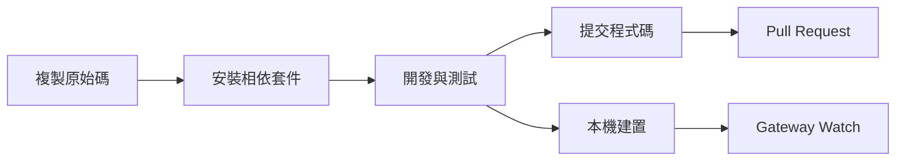

# 開發指南：從原始碼建置到貢獻

## 學完你能做什麼

- 從原始碼建置和執行 Clawdbot
- 開發自訂外掛（頻道、工具、RPC 方法）
- 執行單元測試和端對端測試
- 向專案提交 Pull Request 和貢獻程式碼
- 理解專案架構和外掛系統

## 你現在的困境

你是一名開發者，想要：
- 客製化或擴充 Clawdbot 的功能
- 了解專案內部運作機制
- 向開源社群貢獻程式碼
- 但不知道從哪開始：建置、測試、提交流程？

## 什麼時候用這一招

- 你需要修改原始碼或新增功能時
- 你想開發自訂外掛或頻道時
- 你需要除錯或修復 bug 時
- 你想向專案貢獻程式碼時

## 🎒 開始前的準備

::: warning 前置條件
本教學假設你已具備以下條件：
:::

- **Node.js ≥22** 已安裝（專案要求）
- **pnpm** 套件管理器已安裝（建議用於從原始碼建置）
- **Git** 基礎操作知識
- **TypeScript** 開發經驗
- **終端機**命令列操作能力

建議環境：
- macOS / Linux（主要開發平台）
- Windows 可透過 WSL2

## 核心思路

### 開發流程概覽

Clawdbot 的開發流程分為四個主要階段：



### 關鍵概念

- **建置系統**：使用 TypeScript 編譯，`dist/` 目錄包含輸出
- **外掛架構**：執行時載入的 TypeScript 模組，支援擴充功能
- **Gateway 守護程序**：單例模式，控制平面和訊息路由
- **測試框架**：Vitest 用於單元測試，Docker 用於端對端測試

### 專案結構要點

| 目錄 | 作用 |
| --- | --- |
| `src/` | 所有原始碼（2475 個 TypeScript 檔案）|
| `src/gateway/` | Gateway WebSocket 伺服器 |
| `src/channels/` | 頻道外掛系統 |
| `src/agents/` | AI Agent 執行環境 |
| `src/plugin-sdk/` | 外掛開發 SDK |
| `extensions/` | 內建外掛（如 voice-call）|
| `tests/` | 測試檔案 |

## 跟我做

### 第 1 步：複製原始碼並安裝相依套件

**為什麼**
取得最新的原始碼並安裝所有相依套件是開發的第一步。

```bash
## 複製儲存庫
git clone https://github.com/clawdbot/clawdbot.git
cd clawdbot

## 安裝相依套件（建議使用 pnpm）
pnpm install
```

**你應該看到**：相依套件安裝成功，沒有錯誤提示。

::: info Bun 支援
如果你使用 Bun，可以直接執行 TypeScript 而無需建置（使用 `tsx`）。
:::

### 第 2 步：建置專案

**為什麼**
將 TypeScript 編譯為 JavaScript，產生可發布的 `dist/` 目錄。

```bash
## 完整建置
pnpm build
```

**你應該看到**：
```
src/cli/entry.ts → dist/cli/entry.js
src/gateway/server.ts → dist/gateway/server.js
...
Build completed in X seconds
```

::: tip UI 建置
首次執行 `pnpm ui:build` 會自動安裝 UI 相依套件。
:::

### 第 3 步：啟動開發模式

**為什麼**
開發模式支援自動重新載入，無需手動重新建置。

```bash
## 啟動 Gateway 開發模式（自動重新載入）
pnpm gateway:watch

## 或啟動 CLI 開發模式
CLAWDBOT_PROFILE=dev pnpm clawdbot --dev
```

**你應該看到**：
- Gateway 啟動並監聽 `ws://127.0.0.1:18789`
- 檔案修改時自動重新編譯和重啟

::: tip 跳過頻道載入
開發時可以使用 `CLAWDBOT_SKIP_CHANNELS=1` 跳過頻道初始化，加快啟動速度。
:::

**檢查點 ✅**
- Gateway 成功啟動並監聽連接埠 18789
- 修改 TypeScript 檔案後自動重新編譯

### 第 4 步：執行測試

**為什麼**
確保程式碼修改沒有破壞現有功能。

#### 單元測試

```bash
## 執行所有測試
pnpm test

## 執行測試並監視變化
pnpm test:watch

## 產生覆蓋率報告
pnpm test:coverage
```

**你應該看到**：測試通過率和覆蓋率統計。

#### 端對端測試

```bash
## 執行 Docker 端對端測試
pnpm test:docker:all

## 或執行單一測試套件
pnpm test:docker:live-models
```

**你應該看到**：所有 Docker 測試容器成功執行並結束。

::: warning 測試要求
端對端測試需要 Docker 已安裝並執行。
:::

**檢查點 ✅**
- 所有單元測試通過
- 測試覆蓋率符合要求（≥70%）
- 端對端測試通過

### 第 5 步：程式碼檢查和格式化

**為什麼**
保持程式碼風格一致和型別安全。

```bash
## 執行 linter
pnpm lint

## 格式化程式碼
pnpm format:fix

## 執行 Swift linter（macOS/iOS 開發）
pnpm lint:swift
```

**你應該看到**：沒有 lint 錯誤，程式碼已格式化。

::: tip 自動格式化
專案設定了 pre-commit git hooks，會在提交前自動格式化暫存的檔案。
:::

### 第 6 步：開發外掛（選用）

**為什麼**
擴充 Clawdbot 功能或整合外部服務。

#### 快速建立外掛

1. 建立外掛目錄：
```bash
mkdir extensions/my-plugin
cd extensions/my-plugin
```

2. 建立 `clawdbot.plugin.json`：
```json
{
  "id": "my-plugin",
  "name": "My Plugin",
  "version": "1.0.0",
  "configSchema": {
    "type": "object",
    "properties": {
      "apiKey": { "type": "string" }
    }
  }
}
```

3. 建立外掛進入點 `index.ts`：
```typescript
export default function (api) {
  console.log("My plugin loaded!");
  
  // 註冊工具
  api.registerTool({
    name: "my_tool",
    description: "My custom tool",
    execute: async (params) => {
      return { result: "Hello from my tool!" };
    }
  });
  
  // 註冊 RPC 方法
  api.registerGatewayMethod("myplugin.status", ({ respond }) => {
    respond({ ok: true, status: "running" });
  });
}
```

4. 安裝並測試：
```bash
## 開發模式：連結外掛
clawdbot plugins install -l extensions/my-plugin

## 重新啟動 Gateway
pnpm gateway:watch
```

::: details 外掛類型
Clawdbot 支援以下外掛類型：

- **Agent Tools**：AI 可呼叫的工具
- **Channel Plugins**：新的訊息頻道（WhatsApp、Telegram 等）
- **Gateway RPC**：WebSocket 端點
- **CLI Commands**：命令列工具
- **Background Services**：背景任務
- **Auto-reply Commands**：無需 AI 的快捷指令

詳見 [外掛文件](https://github.com/moltbot/moltbot/blob/main/docs/plugin.md)。
:::

**檢查點 ✅**
- 外掛成功載入
- 可以透過 CLI 或 Gateway 呼叫外掛功能
- 外掛設定正常運作

### 第 7 步：提交程式碼和 Pull Request

**為什麼**
將你的貢獻提交到社群。

```bash
## 建立功能分支
git checkout -b feature/my-feature

## 提交變更
git add .
git commit -m "feat: add my new feature"

## 推送到 GitHub
git push origin feature/my-feature
```

然後在 GitHub 上建立 Pull Request。

::: tip PR 規範
在 PR 描述中說明：
- **做了什麼**：功能或修復的描述
- **為什麼**：解決什麼問題
- **測試狀態**：untested / lightly tested / fully tested
- **AI 輔助**：是否使用 AI 工具協助開發
:::

**檢查點 ✅**
- 程式碼已推送到 GitHub
- Pull Request 建立成功
- CI/CD 檢查通過（如果有）

## 踩坑提醒

### 常見錯誤

| 錯誤 | 原因 | 解決方法 |
| --- | --- | --- |
| `Cannot find module 'xxx'` | 相依套件未安裝 | 執行 `pnpm install` |
| `Port 18789 already in use` | Gateway 已執行 | 檢查並關閉舊執行個體 |
| TypeScript 編譯錯誤 | 型別定義問題 | 執行 `pnpm lint` 檢查 |
| 測試逾時 | Docker 未啟動或網路問題 | 檢查 Docker 狀態 |

### 開發最佳實務

- **小步提交**：每次 PR 只做一件事，便於審查
- **撰寫測試**：新功能必須有測試覆蓋
- **遵循風格**：使用專案設定的 linter 和 formatter
- **文件更新**：修改程式碼時同步更新相關文件
- **AI 標註**：使用 AI 輔助開發時，請在 PR 中標註

## 本課小結

本教學涵蓋了 Clawdbot 的完整開發流程：

✅ **從原始碼建置**：使用 `pnpm install` 和 `pnpm build`
✅ **開發模式**：使用 `pnpm gateway:watch` 實現自動重新載入
✅ **測試框架**：Vitest 單元測試 + Docker 端對端測試
✅ **外掛開發**：基於 TypeScript 的可擴充外掛系統
✅ **貢獻流程**：Git 工作流程和 Pull Request 規範

關鍵指令速查：

| 任務 | 指令 |
| --- | --- |
| 安裝相依套件 | `pnpm install` |
| 建置 | `pnpm build` |
| 開發模式 | `pnpm gateway:watch` |
| 單元測試 | `pnpm test` |
| 程式碼檢查 | `pnpm lint` |
| 格式化 | `pnpm format:fix` |

## 下一課預告

恭喜你完成了開發指南的學習！現在你已經具備了：

- 從原始碼建置和執行 Clawdbot 的能力
- 開發自訂外掛的基礎
- 執行測試和貢獻程式碼的流程

接下來，你可能想深入了解：

- [設定參考](../config-reference/) - 完整的設定項目文件
- [Gateway API 協定](../api-protocol/) - WebSocket 協定規範
- [部署選項](../deployment/) - Docker、Nix 等部署方式

繼續探索，讓 Clawdbot 為你工作！

---

## 附錄：原始碼參考

<details>
<summary><strong>點擊展開檢視原始碼位置</strong></summary>

> 更新時間：2026-01-27

| 功能 | 檔案路徑 | 行號 |
| --- | --- | --- |
| 建置指令碼 | [`package.json`](https://github.com/moltbot/moltbot/blob/main/package.json) | 77-44 |
| 從原始碼安裝 | [`README.md`](https://github.com/moltbot/moltbot/blob/main/README.md) | 83-99 |
| 外掛文件 | [`docs/plugin.md`](https://github.com/moltbot/moltbot/blob/main/docs/plugin.md) | 1-639 |
| 貢獻指南 | [`CONTRIBUTING.md`](https://github.com/moltbot/moltbot/blob/main/CONTRIBUTING.md) | 1-53 |
| 架構文件 | [`docs/concepts/architecture.md`](https://github.com/moltbot/moltbot/blob/main/docs/concepts/architecture.md) | 1-123 |

**關鍵指令**：
- `pnpm build` - 完整建置（package.json:85）
- `pnpm gateway:watch` - 開發模式自動重新載入（package.json:93）
- `pnpm test` - 執行單元測試（package.json:118）
- `pnpm lint` - 程式碼檢查（package.json:110）

**關鍵目錄**：
- `src/` - 原始碼根目錄（2475 個 TypeScript 檔案）
- `src/plugin-sdk/` - 外掛開發 SDK
- `extensions/` - 內建外掛
- `tests/` - 測試檔案
- `dist/` - 建置輸出目錄

**外掛相關**：
- 外掛 manifest 格式：`clawdbot.plugin.json`（plugin.md:8-10）
- 外掛 API：`api.registerTool()`, `api.registerGatewayMethod()`（plugin.md:591-600）
- 外掛設定 Schema：JSON Schema + `uiHints`（plugin.md:36-48）

</details>
