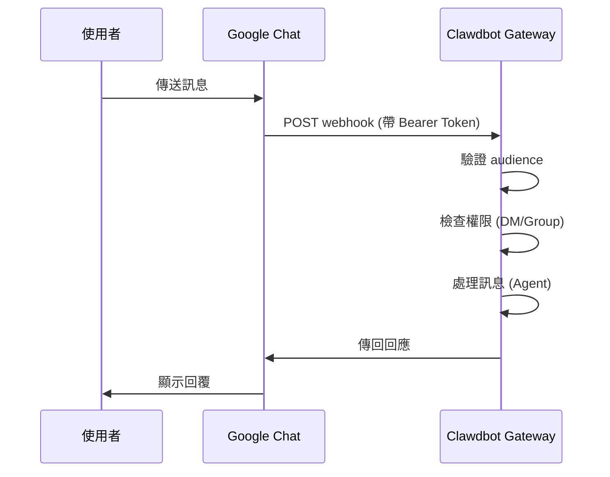

# Google Chat 頻道配置

## 學完你能做什麼

- 在 Google Chat 中與你的 AI 助手進行 1:1 私聊
- 在 Google Chat 空間中使用 @提及觸發 AI 助手
- 掌握 Service Account 認證和 Webhook 配置方法
- 學會使用 Tailscale Funnel 安全暴露公開 URL

## 你現在的困境

你想在公司或團隊中透過 Google Chat 使用 AI 助手，但不知道如何：

- 建立和配置 Google Cloud 專案
- 設定 Service Account 認證
- 配置 Webhook 使 Google Chat 能連接到你的 Gateway
- 安全地將 Gateway 暴露到公網

## 什麼時候用這一招

**適合使用 Google Chat 頻道的場景**：

- 你的團隊主要使用 Google Chat 進行溝通
- 需要在 Google Workspace 環境中使用 AI 助手
- 希望透過 Google Chat Spaces 協作工作
- 需要透過公開 Webhook 接收 Google Chat 訊息

**不適合的場景**：

- 個人使用（推薦 WebChat、Telegram、WhatsApp）
- 需要 OAuth 使用者授權（Google Chat 只支援 Service Account）

## 核心思路

Google Chat 頻道的工作流程：



**關鍵概念**：

| 概念 | 說明 |
|--- | ---|
| **Service Account** | Google Cloud 認證方式，用於機器人身份驗證 |
| **Webhook** | Google Chat POST 訊息到 Gateway 的 HTTP 端點 |
| **Audience** | 用於驗證 webhook 請求的目標（app-url 或 project-number） |
| **DM 配對** | 預設安全機制，陌生發送者需要核准 |

::: tip
Google Chat 頻道僅支援 Service Account 認證，不支援 OAuth 使用者授權。如果需要使用者級權限，考慮使用其他頻道。
:::

## 🎒 開始前的準備

確保你已經：

- ✅ 完成 [快速開始](../../start/getting-started/) 並安裝了 Clawdbot
- ✅ Gateway 正在執行（`clawdbot gateway --port 18789`）
- ✅ 有 Google Cloud 帳戶存取權限
- ✅ 理解基礎的終端機指令使用

::: warning
Google Chat Webhook 需要公開的 HTTPS 端點。本教學會介紹如何使用 Tailscale Funnel 或反向代理安全暴露服務。
:::

## 跟我做

### 第 1 步：建立 Google Cloud 專案並啟用 Chat API

**為什麼**
首先需要一個 Google Cloud 專案來承載 Chat 應用程式和 Service Account。

1. 訪問 [Google Chat API Credentials](https://console.cloud.google.com/apis/api/chat.googleapis.com/credentials)
2. 如果未啟用 API，點擊 **Enable API**

**你應該看到**：
- Chat API 已啟用並顯示為 "API enabled"
- 進入 Credentials 管理頁面

### 第 2 步：建立 Service Account

**為什麼**
Service Account 是機器人身份，用於認證 webhook 請求。

1. 在 Credentials 頁面，點擊 **Create Credentials** > **Service Account**
2. 輸入名稱（例如 `clawdbot-chat`）
3. 點擊 **Continue**（跳過權限設定）
4. 保持存取控制為空，點擊 **Done**

**你應該看到**：
- 新建立的 Service Account 出現在清單中

### 第 3 步：建立並下載 JSON Key

**為什麼**
JSON Key 包含認證憑證，Clawdbot 需要它來驗證 Google Chat 請求。

1. 點擊剛建立的 Service Account
2. 進入 **Keys** 標籤頁
3. 點擊 **Add Key** > **Create new key**
4. 選擇 **JSON** 格式，點擊 **Create**
5. 下載的 JSON 檔案會自動儲存

**你應該看到**：
- 瀏覽器下載一個 `.json` 檔案

::: warning
⚠️ 重要：這個 JSON Key 只會下載一次，請妥善保管！如果遺失，必須重新建立。
:::

### 第 4 步：儲存 Service Account 檔案

**為什麼**
Clawdbot 需要讀取 Key 檔案來驗證 Google Chat 請求。

1. 將下載的 JSON 檔案移動到安全位置：
   ```bash
   mv ~/Downloads/*.json ~/.clawdbot/googlechat-service-account.json
   ```
2. 設定檔案權限（可選但推薦）：
   ```bash
   chmod 600 ~/.clawdbot/googlechat-service-account.json
   ```

**你應該看到**：
- 檔案已儲存在 `~/.clawdbot/` 目錄下
- 權限設定為僅所有者可讀寫

### 第 5 步：建立 Google Chat 應用程式

**為什麼**
Chat App 定義了機器人的外觀、行為和 webhook URL。

1. 訪問 [Google Cloud Console Chat Configuration](https://console.cloud.google.com/apis/api/chat.googleapis.com/hangouts-chat)
2. 填寫 **Application info**：
   - **App name**: `Clawdbot`（或其他名稱）
   - **Avatar URL**: `https://clawd.bot/logo.png`（可選）
   - **Description**: `Personal AI Assistant`（可選）
3. 啟用 **Interactive features**
4. 在 **Functionality** 下，勾選 **Join spaces and group conversations**
5. 在 **Connection settings** 下，選擇 **HTTP endpoint URL**
6. 在 **Visibility** 下，選擇 **Make this Chat app available to specific people and groups in &lt;Your Domain&gt;**
7. 輸入你的 Google Workspace 信箱（例如 `user@example.com`）
8. 點擊頁面底部的 **Save**

**你應該看到**：
- 應用程式配置已儲存
- 頁面顯示 "App status" 部分

### 第 6 步：配置 Webhook Triggers

**為什麼**
Triggers 定義了 Google Chat 何時向 Gateway 傳送訊息。

1. 在儲存後重新整理頁面
2. 找到 **App status** 部分（通常在頂部或底部）
3. 將狀態變更為 **Live - available to users**
4. 再次點擊 **Save**

**你應該看到**：
- App status 顯示為 "Live - available to users"

::: info
💡 提示：Webhook URL 將在第 7 步配置。如果不確定，可以先使用預留位置 `https://example.com/googlechat`，稍後更新。
:::

### 第 7 步：取得 Gateway 的公開 URL

**為什麼**
Google Chat 需要一個公開的 HTTPS URL 來傳送 webhook 請求。

執行以下指令檢視 Gateway 的公開 URL：

```bash
clawdbot status
```

**你應該看到**：
- 輸出中包含公開 URL（例如 `https://your-node.tailnet.ts.net`）

::: warning
如果 Gateway 未配置 Tailscale 或反向代理，你需要先設定公開存取（見下一步）。
:::

### 第 8 步：公開 Webhook 端點（擇一使用）

::: tip
推薦使用 Tailscale Funnel，它可以只暴露 `/googlechat` 路徑，保持其他端點私密。
:::

#### 選項 A：Tailscale Funnel（推薦）

**為什麼 Tailscale Funnel**
- 只暴露特定路徑，提高安全性
- 內網 Gateway 保持私有，僅 Webhook 可存取
- 無需購買網域和配置 SSL

1. **檢查 Gateway 綁定位址**：
   ```bash
   ss -tlnp | grep 18789
   ```
   記錄 IP 位址（例如 `127.0.0.1`、`0.0.0.0` 或 Tailscale IP 如 `100.x.x.x`）

2. **僅向 tailnet 暴露控制面板**（連接埠 8443）：
   ```bash
   # 如果綁定到 localhost (127.0.0.1 或 0.0.0.0):
   tailscale serve --bg --https 8443 http://127.0.0.1:18789
   
   # 如果綁定到 Tailscale IP (例如 100.106.161.80):
   tailscale serve --bg --https 8443 http://100.106.161.80:18789
   ```

3. **公開 Webhook 路徑**：
   ```bash
   # 如果綁定到 localhost (127.0.0.1 或 0.0.0.0):
   tailscale funnel --bg --set-path /googlechat http://127.0.0.1:18789/googlechat
   
   # 如果綁定到 Tailscale IP (例如 100.106.161.80):
   tailscale funnel --bg --set-path /googlechat http://100.106.161.80:18789/googlechat
   ```

4. **授權節點存取 Funnel**（如果提示）：
   - 訪問輸出中顯示的授權 URL
   - 在 Tailscale 管理面板中為該節點啟用 Funnel

5. **驗證配置**：
   ```bash
   tailscale serve status
   tailscale funnel status
   ```

**你應該看到**：
- Serve 和 Funnel 均執行中
- 公開 Webhook URL：`https://<node-name>.<tailnet>.ts.net/googlechat`
- 私有控制面板：`https://<node-name>.<tailnet>.ts.net:8443/`

#### 選項 B：Caddy 反向代理

**為什麼 Caddy**
- 支援自動 HTTPS
- 靈活的路徑路由配置

1. 建立 Caddyfile：
   ```txt
   your-domain.com {
       reverse_proxy /googlechat* localhost:18789
   }
   ```

2. 啟動 Caddy：
   ```bash
   caddy run --config Caddyfile
   ```

**你應該看到**：
- Caddy 已啟動並監聽 443 連接埠
- 只有 `your-domain.com/googlechat` 路徑路由到 Gateway

#### 選項 C：Cloudflare Tunnel

**為什麼 Cloudflare Tunnel**
- 免費的全球 CDN
- 簡單的路徑規則配置

1. 配置隧道入口規則：
   - **Path**: `/googlechat` -> `http://localhost:18789/googlechat`
   - **Default Rule**: HTTP 404 (Not Found)

### 第 9 步：更新 Google Chat Webhook URL

**為什麼**
現在有公開 URL 了，更新 Chat App 配置以指向正確的端點。

1. 返回 Google Cloud Console Chat Configuration 頁面
2. 在 **Triggers** 部分：
   - 選擇 **Use a common HTTP endpoint URL for all triggers**
   - 設定為：`<你的公開 URL>/googlechat`
   - 例如：`https://your-node.tailnet.ts.net/googlechat`
3. 點擊 **Save**

**你應該看到**：
- Triggers 已更新並儲存

### 第 10 步：配置 Clawdbot

**為什麼**
告訴 Clawdbot 使用哪個 Service Account 和 Webhook 路徑。

**方式 A：環境變數**

```bash
export GOOGLE_CHAT_SERVICE_ACCOUNT_FILE="/path/to/service-account.json"
clawdbot gateway restart
```

**方式 B：配置檔案**

編輯 `~/.clawdbot/clawdbot.json`：

```json5
{
  channels: {
    googlechat: {
      enabled: true,
      serviceAccountFile: "/Users/yourname/.clawdbot/googlechat-service-account.json",
      audienceType: "app-url",
      audience: "https://your-node.tailnet.ts.net/googlechat",
      webhookPath: "/googlechat",
      dm: {
        policy: "pairing",
        allowFrom: ["users/1234567890", "your-email@example.com"]
      },
      groupPolicy: "allowlist",
      groups: {
        "spaces/AAAA": {
          allow: true,
          requireMention: true,
          users: ["users/1234567890"],
          systemPrompt: "Short answers only."
        }
      }
    }
  }
}
```

**重新啟動 Gateway**：

```bash
clawdbot gateway restart
```

**你應該看到**：
- Gateway 啟動並顯示 "Google Chat default: enabled, configured, ..."
- 無錯誤日誌

### 第 11 步：將 Bot 新增至 Google Chat

**為什麼**
最後一步，在 Google Chat 中找到並新增機器人。

1. 訪問 [Google Chat](https://chat.google.com/)
2. 點擊 **+**（加號）圖示，在 **Direct Messages** 旁邊
3. 在搜尋框（通常新增聯絡人的地方）輸入 **App name**（第 5 步配置的名稱）
   - **注意**：機器人不會出現在 "Marketplace" 瀏覽清單，因為它是私有應用程式。必須按名稱搜尋。
4. 從結果中選擇你的機器人
5. 點擊 **Add** 或 **Chat** 開始 1:1 對話

**你應該看到**：
- 機器人出現在聯絡人清單中
- 聊天視窗開啟

### 第 12 步：傳送測試訊息

**為什麼**
驗證配置是否正確，訊息是否正常傳遞。

在聊天視窗輸入：

```
Hello
```

**你應該看到**：
- 機器人回覆問候語或確認訊息
- Gateway 日誌顯示收到和處理的訊息

## 檢查點 ✅

驗證配置是否成功：

```bash
# 檢查頻道狀態
clawdbot channels status

# 應該顯示：
# Google Chat default: enabled, configured, webhook listening
```

::: info
如果看到錯誤，執行 `clawdbot channels status --probe` 檢視詳細的診斷資訊。
:::

## 配置詳解

### Service Account 認證

| 配置項 | 類型 | 預設值 | 說明 |
|--- | --- | --- | ---|
| `serviceAccountFile` | string | - | Service Account JSON 檔案路徑 |
| `serviceAccount` | string\|object | - | 內聯 JSON 憑證（替代檔案路徑） |
| `audienceType` | "app-url"\|"project-number" | "app-url" | 驗證類型：URL 或專案編號 |
| `audience` | string | - | Audience 值（URL 或專案編號） |

### DM 策略

預設情況下，陌生發送者需要配對：

| 配置項 | 類型 | 預設值 | 說明 |
|--- | --- | --- | ---|
| `dm.enabled` | boolean | 未定義 | 是否啟用 DM 接收 |
| `dm.policy` | "pairing"|"open" | "pairing" | 存取策略：配對或開放 |
| `dm.allowFrom` | array | [] | 允許的發送者清單（user IDs 或 emails） |

**配對新發送者**：

```bash
clawdbot pairing approve googlechat <配對碼>
```

### 群組策略

| 配置項 | 類型 | 預設值 | 說明 |
|--- | --- | --- | ---|
| `groupPolicy` | "allowlist"|"disabled" | "allowlist" | 群組策略：允許清單或停用 |
| `requireMention` | boolean | true | 是否需要 @提及觸發 |
| `groups` | object | {} | 按空間 ID 的配置 |

**允許特定群組**：

```json5
{
  channels: {
    googlechat: {
      groups: {
        "spaces/AAAA": {
          allow: true,
          requireMention: true,
          users: ["users/1234567890"],
          systemPrompt: "Short answers only."
        }
      }
    }
  }
}
```

### 其他配置

| 配置項 | 類型 | 預設值 | 說明 |
|--- | --- | --- | ---|
| `webhookPath` | string | "/googlechat" | Webhook 路徑 |
| `botUser` | string | - | 機器人使用者資源名稱（用於提及檢測） |
| `typingIndicator` | "none"|"message"|"reaction" | "message" | 打字指示器模式 |
| `actions.reactions` | boolean | false | 是否支援表情反應 |
| `mediaMaxMb` | number | 未定義 | 最大媒體檔案大小（MB） |

## 踩坑提醒

### 405 Method Not Allowed

**症狀**：Google Cloud Logs Explorer 顯示 `405 Method Not Allowed`

**原因**：Webhook 處理程式未註冊

**解決方法**：

1. 確認配置中存在 `channels.googlechat` 部分：
   ```bash
   clawdbot config get channels.googlechat
   ```

2. 檢查外掛狀態：
   ```bash
   clawdbot plugins list | grep googlechat
   ```

3. 如果顯示 "disabled"，新增配置：
   ```json5
   {
     plugins: {
       entries: {
         googlechat: {
           enabled: true
         }
       }
     }
   }
   ```

4. 重新啟動 Gateway：
   ```bash
   clawdbot gateway restart
   ```

### 未收到訊息

**症狀**：傳送訊息後無回應

**排查步驟**：

1. 執行 `clawdbot logs --follow` 並傳送測試訊息
2. 確認 Chat App 的 Webhook URL 和事件訂閱
3. 檢查 `audience` 配置是否正確
4. 如果提及 gating 阻塞回覆，設定 `botUser` 並驗證 `requireMention`

### Tailscale Funnel 無法啟動

**症狀**：`tailscale funnel` 報錯

**原因**：未設定密碼認證

**解決方法**：

在 `~/.clawdbot/clawdbot.json` 中新增：

```json5
{
  gateway: {
    auth: {
      mode: "password"
    }
  }
}
```

## 本課小結

- 建立了 Google Cloud 專案和 Service Account
- 配置了 Google Chat App 和 Webhook
- 使用 Tailscale Funnel 或反向代理公開端點
- 配置了 Clawdbot 使用 Service Account 認證
- 學會了 DM 配對和群組 @提及機制
- 測試了 1:1 和群組訊息

## 下一課預告

> 下一課我們學習 **[Signal 頻道](../signal/)**。
>
> 你會學到：
> - 如何安裝和配置 signal-cli
> - Signal 頻道的權限和存取控制
> - 與 Google Chat 的配置差異

---

## 附錄：原始碼參考

<details>
<summary><strong>點擊展開檢視原始碼位置</strong></summary>

> 更新時間：2026-01-27

| 功能 | 檔案路徑 | 行號 |
|--- | --- | ---|
| Google Chat 配置類型定義 | [`src/config/types.googlechat.ts`](https://github.com/moltbot/moltbot/blob/main/src/config/types.googlechat.ts) | 1-109 |
| Google Chat Zod Schema | [`src/config/zod-schema.providers-core.ts`](https://github.com/moltbot/moltbot/blob/main/src/config/zod-schema.providers-core.ts) | 273-341 |
| 頻道註冊表 | [`src/channels/registry.ts`](https://github.com/moltbot/moltbot/blob/main/src/channels/registry.ts) | 61-67 |
| 群組提及解析 | [`src/channels/plugins/group-mentions.ts`](https://github.com/moltbot/moltbot/blob/main/src/channels/plugins/group-mentions.ts) | 158-175 |
| Google Chat 文件 | [`docs/channels/googlechat.md`](https://github.com/moltbot/moltbot/blob/main/docs/channels/googlechat.md) | 1-221 |

**關鍵類型**：
- `GoogleChatConfig`: 完整的 Google Chat 配置介面
- `GoogleChatDmConfig`: DM 存取策略配置
- `GoogleChatGroupConfig`: 群組空間配置
- `GoogleChatActionConfig`: 動作（如表情反應）配置

**關鍵配置欄位**：
- `audienceType`: "app-url" 或 "project-number"，用於驗證 webhook 請求
- `audience`: Webhook URL 或專案編號，與 `audienceType` 配對
- `dm.policy`: 預設 "pairing"，控制陌生 DM 存取
- `groupPolicy`: 群組存取策略，"allowlist" 或 "disabled"

**認證機制**：
- 使用 Google Service Account JSON 憑證
- Webhook 請求透過 `Authorization: Bearer <token>` 標頭驗證
- Token 與 `audience` 配置項比對以確保請求來自合法來源

</details>
