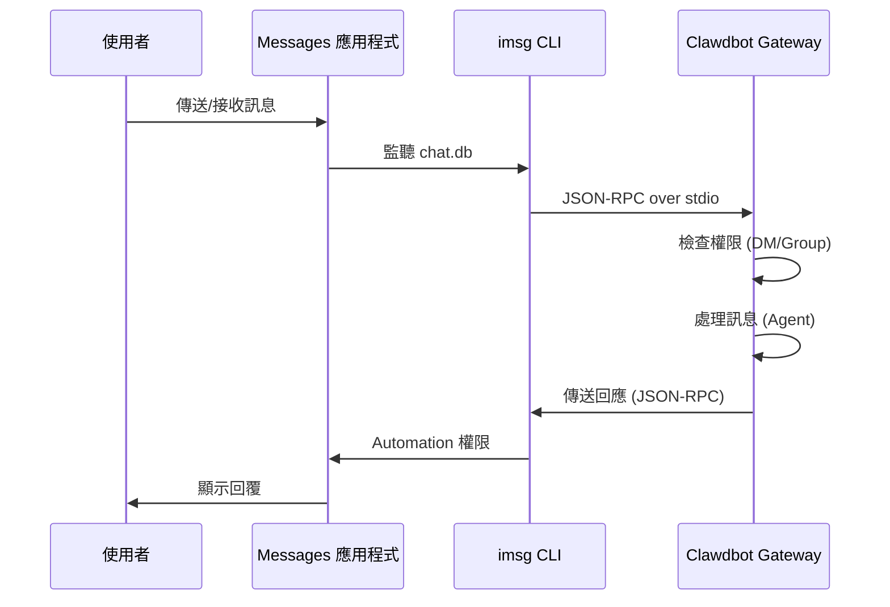

# iMessage 頻道設定

## 學完你能做什麼

- 在 macOS 上透過 iMessage 與 AI 助手進行 1:1 私訊
- 在 iMessage 群組中使用 AI 助手（支援 @提及）
- 設定專用 Mac 使用者以隔離機器人身分
- 透過 SSH/Tailscale 遠端存取另一台 Mac 上的 iMessage
- 掌握 DM 配對和群組 allowlist 存取控制

## 你現在的困境

你想在 macOS 上使用 iMessage 與 AI 助手互動，但不知道如何：

- 安裝和設定 `imsg` CLI 工具
- 給予 Clawdbot Full Disk Access 和 Automation 權限
- 設定本機或遠端 Mac 作為 iMessage 閘道
- 設定多個 iMessage 帳戶
- 控制誰可以向機器人傳送訊息

## 什麼時候用這一招

**適合使用 iMessage 頻道的情境**：

- 你主要在 macOS 上使用 iMessage
- 希望使用本機 iMessage（不依賴第三方伺服器）
- 需要透過 iMessage 與 AI 助手進行文字和媒體互動
- 想要維持與其他頻道（WhatsApp、Telegram）相同的對話體驗

**不適合的情境**：

- 非 macOS 系統（iMessage 頻道僅支援 macOS）
- 需要跨平台同步（考慮使用 WebChat、Telegram）
- 需要群組 @提及功能（iMessage 無原生 mention 機制，需手動設定）

## 核心思路

iMessage 頻道的工作流程：



**關鍵概念**：

| 概念 | 說明 |
|--- | ---|
| **imsg CLI** | 第三方工具，透過 JSON-RPC over stdio 與 Messages 互動 |
| **Full Disk Access** | macOS 權限，允許 Clawdbot 讀取 Messages chat.db |
| **Automation 權限** | macOS 權限，允許 imsg 透過 Automation API 傳送訊息 |
| **chat_id** | 穩定的聊天識別碼，用於路由和對話隔離 |
| **pairing** | 預設 DM 保護機制，陌生傳送者需要核准 |

::: tip
iMessage 頻道透過 `imsg` CLI 實現，而不是直接呼叫 Messages API。`imsg` 透過 JSON-RPC over stdio 與 Clawdbot 通訊，這表示它可以執行在遠端 Mac 上（透過 SSH）。
:::

## 🎒 開始前的準備

確保你已經：

- ✅ 完成 [快速開始](../../start/getting-started/) 並安裝了 Clawdbot
- ✅ Gateway 正在執行（`clawdbot gateway --port 18789`）
- ✅ 在 macOS 上登入 Messages（已啟用 iMessage）
- ✅ 有 Homebrew 存取權限（用於安裝 `imsg`）

::: warning
iMessage 頻道僅支援 macOS。確保你的 Gateway 執行在 macOS 上，或透過 SSH/Tailscale 連接到遠端 Mac。
:::

## 跟我做

### 第 1 步：安裝 imsg CLI

**為什麼**
`imsg` 是 iMessage 頻道的核心依賴，透過 JSON-RPC over stdio 與 Messages 應用程式互動。

1. 使用 Homebrew 安裝：
   ```bash
   brew install steipete/tap/imsg
   ```

**你應該看到**：
- 安裝成功後，`imsg` 指令可用
- 執行 `imsg --version` 顯示版本資訊

**驗證安裝**：

```bash
# 測試 imsg 是否可用
imsg chats --limit 1
```

**你應該看到**：
- 輸出至少一個聊天記錄（如果有）
- 或提示需要授予 Full Disk Access 權限

### 第 2 步：授予 Full Disk Access 權限

**為什麼**
Clawdbot 需要讀取 Messages 的 `chat.db` 資料庫來監聽新訊息。

1. 開啟 **系統設定** > **隱私與安全性**
2. 點擊 **完全磁碟存取權限**
3. 點擊 **+** 新增以下應用程式：
   - `/Applications/Clawdbot.app`（如果使用 macOS 應用程式）
   - `/usr/local/bin/imsg` 或 `imsg` 的實際路徑
4. 重新啟動 Gateway

::: warning
權限變更後必須重新啟動 Gateway 才能生效！
:::

**你應該看到**：
- Gateway 啟動日誌中沒有權限錯誤
- `imsg chats --limit 1` 可以正常輸出聊天列表

### 第 3 步：授予 Automation 權限

**為什麼**
`imsg` 透過 Apple Events Automation API 傳送訊息，需要使用者授權。

1. 首次傳送訊息時，macOS 會彈出權限提示
2. 點擊 **允許** 或 **好**
3. 如果使用專用 Mac 使用者，在該使用者的工作階段中執行一次測試

**測試 Automation 權限**：

```bash
# 傳送測試訊息（替換為實際接收者）
imsg send --to "+15555550123" "Test message"
```

**你應該看到**：
- macOS 彈出權限提示（首次）
- 授予權限後訊息成功傳送
- Messages 應用程式中顯示測試訊息

### 第 4 步：設定 Clawdbot

**為什麼**
告訴 Clawdbot 使用哪個 `imsg` 路徑和 Messages 資料庫位置。

**方式 A：簡單設定（本機 Mac）**

編輯 `~/.clawdbot/clawdbot.json`：

```json5
{
  channels: {
    imessage: {
      enabled: true,
      cliPath: "/usr/local/bin/imsg",
      dbPath: "/Users/<your-username>/Library/Messages/chat.db",
      dmPolicy: "pairing",
      groupPolicy: "allowlist"
    }
  }
}
```

::: info
將 `<your-username>` 替換為你的實際 macOS 使用者名稱。
:::

**方式 B：多帳戶設定**

```json5
{
  channels: {
    imessage: {
      enabled: true,
      accounts: {
        main: {
          name: "Main Account",
          enabled: true,
          cliPath: "/usr/local/bin/imsg",
          dbPath: "/Users/alice/Library/Messages/chat.db"
        },
        bot: {
          name: "Bot Account",
          enabled: true,
          cliPath: "/path/to/imsg-bot-wrapper",  // 見第 5 步
          dbPath: "/Users/botuser/Library/Messages/chat.db"
        }
      }
    }
  }
}
```

**重新啟動 Gateway**：

```bash
clawdbot gateway restart
```

**你應該看到**：
- Gateway 啟動並顯示 "iMessage default: enabled, configured, ..."
- 無權限或路徑錯誤日誌

### 第 5 步：傳送測試訊息

**為什麼**
驗證設定是否正確，訊息是否正常傳遞。

1. 使用 CLI 傳送測試訊息：
   ```bash
   clawdbot message --to imessage:+15555550123 "Hello from Clawdbot!"
   ```

**你應該看到**：
- Messages 應用程式收到訊息
- Gateway 日誌顯示訊息已傳送
- 如果設定了 AI 模型，收到 AI 回覆

::: info
`imessage:+15555550123` 格式表示透過 iMessage 頻道傳送到電話號碼 `+15555550123`。也可以使用郵件地址 `imessage:user@example.com`。
:::

## 檢查點 ✅

驗證設定是否成功：

```bash
# 檢查頻道狀態
clawdbot channels status

# 應該顯示：
# iMessage default: enabled, configured, rpc listening
```

::: info
如果看到錯誤，執行 `clawdbot channels status --probe` 查看詳細的診斷資訊。
:::

## 進階設定

### 設定專用 Mac 使用者（可選）

如果你想使用獨立的 iMessage 身份（不污染你的個人 Messages），可以建立專用 Mac 使用者。

**步驟**：

1. **建立專用 Apple ID**：
   - 瀏覽 [appleid.apple.com](https://appleid.apple.com)
   - 建立新 Apple ID（例如 `my-cool-bot@icloud.com`）

2. **建立 macOS 使用者**：
   - 開啟 **系統設定** > **使用者與群組**
   - 點擊 **+** 建立新使用者（例如 `botuser`）
   - 設定自動登入或記住密碼

3. **登入專用 iMessage 帳戶**：
   - 切換到 `botuser` 使用者
   - 開啟 Messages 應用程式
   - 使用專用 Apple ID 登入 iMessage

4. **啟用遠端登入**：
   - 開啟 **系統設定** > **一般** > **共享**
   - 啟用 **遠端登入**

5. **設定 SSH 免密登入**：
   ```bash
   # 從主使用者測試 SSH
   ssh botuser@localhost true

   # 如果需要密碼，設定 SSH 金鑰：
   ssh-keygen -t ed25519
   ssh-copy-id botuser@localhost
   ```

6. **建立 SSH wrapper 腳本**：

   建立 `~/.clawdbot/scripts/imsg-bot`（`chmod +x`）：

   ```bash
   #!/usr/bin/env bash
   set -euo pipefail

   # 執行互動式 SSH 一次以接受 host keys：
   #   ssh botuser@localhost true
   exec /usr/bin/ssh -o BatchMode=yes -o ConnectTimeout=5 -T botuser@localhost \
     "/usr/local/bin/imsg" "$@"
   ```

7. **設定 Clawdbot**：

   ```json5
   {
     channels: {
       imessage: {
         enabled: true,
         accounts: {
           bot: {
             name: "Bot",
             enabled: true,
             cliPath: "/Users/<your-username>/.clawdbot/scripts/imsg-bot",
             dbPath: "/Users/botuser/Library/Messages/chat.db"
           }
         }
       }
     }
   }
   ```

::: tip
首次設定時，在 `botuser` 工作階段中執行一次 `imsg chats --limit 1` 或 `imsg send ...` 以授予 Automation 權限。
:::

### 遠端 Mac 設定（可選）

如果 Gateway 執行在 Linux/VM 但 iMessage 必須在 Mac 上，可以透過 SSH 遠端連接。

**架構**：

```
┌──────────────────────────────┐          SSH (imsg rpc)          ┌──────────────────────────┐
│ Gateway host (Linux/VM)      │──────────────────────────────────▶│ Mac with Messages + imsg │
│ - clawdbot gateway           │          SCP (attachments)        │ - Messages signed in     │
│ - channels.imessage.cliPath  │◀──────────────────────────────────│ - Remote Login enabled   │
└──────────────────────────────┘                                   └──────────────────────────┘
              ▲
              │ Tailscale tailnet (hostname or 100.x.y.z)
              ▼
        user@remote-mac
```

**設定步驟**：

1. **建立 SSH wrapper**（`~/.clawdbot/scripts/imsg-ssh`）：

   ```bash
   #!/usr/bin/env bash
   exec ssh -T bot@remote-mac imsg "$@"
   ```

2. **設定 Clawdbot**：

   ```json5
   {
     channels: {
       imessage: {
         enabled: true,
         cliPath: "/Users/<your-username>/.clawdbot/scripts/imsg-ssh",
         remoteHost: "bot@remote-mac",
         includeAttachments: true,
         dbPath: "/Users/bot/Library/Messages/chat.db"
       }
     }
   }
   ```

::: info
`remoteHost` 用於 SCP 附件傳輸。如果未設定，Clawdbot 會嘗試從 SSH 指令中自動偵測。顯式設定更可靠。
:::

**Tailscale 設定範例**：

```bash
# SSH wrapper
#!/usr/bin/env bash
exec ssh -T bot@mac-mini.tailnet-1234.ts.net imsg "$@"
```

```json5
{
  channels: {
    imessage: {
      enabled: true,
      cliPath: "~/.clawdbot/scripts/imsg-ssh",
      remoteHost: "bot@mac-mini.tailnet-1234.ts.net",
      includeAttachments: true,
      dbPath: "/Users/bot/Library/Messages/chat.db"
    }
  }
}
```

## 設定詳解

### 基本設定

| 設定項 | 類型 | 預設值 | 說明 |
|--- | --- | --- | ---|
| `enabled` | boolean | false | 是否啟用 iMessage 頻道 |
| `cliPath` | string | "imsg" | imsg CLI 路徑（可以是 SSH wrapper） |
| `dbPath` | string | - | Messages chat.db 路徑 |
| `remoteHost` | string | - | SSH 主機（用於 SCP 附件傳輸） |

### DM 策略

| 設定項 | 類型 | 預設值 | 說明 |
|--- | --- | --- | ---|
| `dmPolicy` | "pairing"|"allowlist"|"open"|"disabled" | "pairing" | DM 存取策略 |
| `allowFrom` | array | [] | 允許的傳送者列表（handles、emails、E.164、`chat_id:*`） |

**配對新傳送者**：

```bash
# 列出待配對程式碼
clawdbot pairing list imessage

# 核准配對
clawdbot pairing approve imessage <CODE>
```

::: tip
iMessage 沒有使用者名稱概念，使用 handles（電話號碼或郵件地址）或 chat targets（`chat_id`、`chat_guid`、`chat_identifier`）。
:::

### 群組策略

| 設定項 | 類型 | 預設值 | 說明 |
|--- | --- | --- | ---|
| `groupPolicy` | "allowlist"|"open"|"disabled" | "allowlist" | 群組存取策略 |
| `groupAllowFrom` | array | [] | 允許在群組中觸發 AI 的傳送者 |
| `groups` | object | {} | 按 chat_id 的群組設定 |

**群組設定範例**：

```json5
{
  channels: {
    imessage: {
      groupPolicy: "allowlist",
      groupAllowFrom: ["+15555550123", "alice@example.com"],
      groups: {
        "42": {
          requireMention: false,
          allowFrom: ["bob@example.com"]
        }
      }
    }
  }
}
```

### 媒體和文字限制

| 設定項 | 類型 | 預設值 | 說明 |
|--- | --- | --- | ---|
| `includeAttachments` | boolean | false | 是否將附件包含在上下文中 |
| `mediaMaxMb` | number | 16 | 最大媒體檔案大小（MB） |
| `textChunkLimit` | number | 4000 | 出站文字分塊大小（字元） |
| `chunkMode` | "length"|"newline" | "length" | 分塊模式：按長度或按空行 |

### 歷史記錄

| 設定項 | 類型 | 預設值 | 說明 |
|--- | --- | --- | ---|
| `historyLimit` | number | - | 群組最大歷史訊息數（0 停用） |
| `dmHistoryLimit` | number | - | DM 歷史訊息限制（使用者輪次） |
| `dms["<handle>"].historyLimit` | number | - | 按 handle 覆寫 DM 歷史限制 |

## 踩坑提醒

### imsg rpc 指令不可用

**症狀**：Gateway 日誌顯示 "imsg CLI does not support 'rpc' subcommand"

**原因**：`imsg` 版本過舊，不支援 `rpc` 子指令

**解決方法**：

1. 更新 `imsg`：
   ```bash
   brew upgrade steipete/tap/imsg
   ```

2. 驗證版本：
   ```bash
   imsg rpc --help
   ```

### Full Disk Access 權限問題

**症狀**：`imsg chats --limit 1` 無輸出或報錯 "Permission denied"

**解決方法**：

1. 確保已新增 Clawdbot 和 `imsg` 到完全磁碟存取權限
2. 重新啟動 Gateway
3. 如果問題持續，嘗試重新啟動 Mac

### Automation 權限問題

**症狀**：傳送訊息無反應，Gateway 日誌顯示逾時

**原因**：macOS 未授予 Automation 權限

**解決方法**：

1. 在 Messages 應用程式中手動傳送一條訊息
2. macOS 應該彈出權限提示
3. 點擊 **允許**
4. 如果使用專用 Mac 使用者，切換到該使用者並重複步驟

### 遠端 Mac 連接失敗

**症狀**：SSH wrapper 逾時或連接被拒絕

**解決方法**：

1. 測試 SSH 連接：
   ```bash
   ssh -T bot@remote-mac imsg --version
   ```

2. 確保 Remote Login 已啟用（遠端 Mac）

3. 檢查防火牆和連接埠設定

4. 使用 Tailscale 簡化內網穿透

## 本課小結

- 安裝了 `imsg` CLI 工具
- 設定了 Full Disk Access 和 Automation 權限
- 學會了本機和遠端 Mac 設定方法
- 掌握了 DM 配對和群組 allowlist 機制
- 理解了 chat_id、chat_guid、chat_identifier 的差異
- 測試了 1:1 和群組訊息

## 下一課預告

> 下一課我們學習 **[LINE 頻道](../line/)**。
>
> 你會學到：
> - 如何取得 LINE Messaging API 憑證
> - 設定 LINE Bot 的 Webhook 端點
> - LINE 頻道的訊息格式和限制
> - 與 iMessage 頻道的設定差異

---

## 附錄：原始碼參考

<details>
<summary><strong>點擊展開查看原始碼位置</strong></summary>

> 更新時間：2026-01-27

| 功能 | 檔案路徑 | 行號 |
|--- | --- | ---|
| iMessage 設定型別定義 | [`src/config/types.imessage.ts`](https://github.com/moltbot/moltbot/blob/main/src/config/types.imessage.ts) | 1-80 |
| iMessage 帳戶解析 | [`src/imessage/accounts.ts`](https://github.com/moltbot/moltbot/blob/main/src/imessage/accounts.ts) | 1-83 |
| iMessage 探測 | [`src/imessage/probe.ts`](https://github.com/moltbot/moltbot/blob/main/src/imessage/probe.ts) | 1-92 |
| iMessage 傳送 | [`src/imessage/send.ts`](https://github.com/moltbot/moltbot/blob/main/src/imessage/send.ts) | 1-135 |
| iMessage 監控提供者 | [`src/imessage/monitor/monitor-provider.ts`](https://github.com/moltbot/moltbot/blob/main/src/imessage/monitor/monitor-provider.ts) | 1-600+ |
| 目標地址解析 | [`src/imessage/targets.ts`](https://github.com/moltbot/moltbot/blob/main/src/imessage/targets.ts) | 1-200+ |
| Onboarding 介接卡 | [`src/channels/plugins/onboarding/imessage.ts`](https://github.com/moltbot/moltbot/blob/main/src/channels/plugins/onboarding/imessage.ts) | 1-262 |
| iMessage 文件 | [`docs/channels/imessage.md`](https://github.com/moltbot/moltbot/blob/main/docs/channels/imessage.md) | 1-262 |

**關鍵型別**：
- `IMessageConfig`: 完整的 iMessage 設定介面
- `IMessageAccountConfig`: 單一帳戶設定
- `IMessageService`: "imessage" | "sms" | "auto"
- `IMessageTargetKind`: "chat_id" | "chat_guid" | "chat_identifier" | "handle"

**關鍵設定欄位**：
- `cliPath`: imsg CLI 路徑，可以是本機路徑或 SSH wrapper 腳本
- `dbPath`: Messages chat.db 資料庫路徑
- `remoteHost`: SSH 主機（用於 SCP 附件傳輸），自動偵測或顯式設定
- `dmPolicy`: 預設 "pairing"，控制陌生 DM 存取
- `groupPolicy`: 群組存取策略，"allowlist" 或 "open"
- `groups`: 按 `chat_id` 的群組設定，支援隔離對話和自訂策略

**關鍵函式**：
- `probeIMessage()`: 探測 imsg CLI 是否可用並支援 rpc 子指令（`probe.ts`）
- `sendMessageIMessage()`: 傳送 iMessage 訊息，支援文字和媒體（`send.ts`）
- `monitorIMessageProvider()`: 監控 iMessage 事件串流（`monitor-provider.ts`）
- `parseIMessageTarget()`: 解析目標地址（chat_id、handle、email 等）（`targets.ts`）

**通訊機制**：
- 透過 `imsg rpc` 子指令實現 JSON-RPC over stdio 通訊
- 每個帳戶有獨立的 RPC 用戶端實例（`createIMessageRpcClient`）
- 訊息事件透過 `monitor-provider.ts` 串流推送到 Gateway
- 傳送訊息時支援 `chat_id`（推薦）、`chat_guid`、`chat_identifier` 或直接 handle

**多帳戶支援**：
- 使用 `channels.imessage.accounts` map 設定多個帳戶
- 每個帳戶有獨立的 `cliPath`、`dbPath` 和策略設定
- 預設帳戶 ID 為 "default"，可透過 `accountId` 欄位指定

</details>
