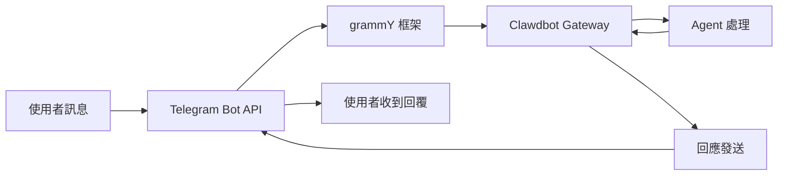

# Telegram 頻道設定與使用

## 學完你能做什麼

- 🤖 在 Telegram 中建立 Bot 並取得 Bot Token
- ⚙️ 設定 Telegram 頻道連接到 Clawdbot
- 🔒 控制 DM 和群組的存取權限(配對機制和白名單)
- 📡 設定群組提及規則和回應策略
- 🔌 設定 Webhook 模式(可選)
- 🎯 使用 Telegram Bot API 特性(內聯按鈕、主題、回覆)

## 你現在的困境

你已經在 Telegram 上使用 Clawdbot,但遇到了這些問題:

- ❌ 不清楚如何正確設定 Bot Token
- ❌ 陌生人給 Bot 發訊息後,Bot 沒有回應
- ❌ 在群組中,Bot 不回應非提及訊息
- ❌ 想要精細控制誰能存取 Bot,但不知道如何設定
- ❌ 聽說過 Webhook 和 Long-polling 的區別,不知道選哪個

這教學會幫你一步步解決這些問題。

## 什麼時候用這一招

適合使用 Telegram 頻道的場景:

- ✅ 你已經在使用 Telegram,希望在這個平台與 AI 助手對話
- ✅ 你需要 Bot 在群組中回應特定使用者或指令
- ✅ 你希望使用 Telegram Bot API 的特殊功能(內聯按鈕、Forum 主題)
- ✅ 你的伺服器網路環境適合使用 Long-polling 或 Webhook

**如果主要使用 WhatsApp 或其他頻道**:這課可以跳過,專注於你使用的頻道。

## 🎒 開始前的準備

在開始之前,確保你已經:

- [ ] 完成了 [快速開始](../../start/getting-started/) 教學,Clawdbot 已安裝並可以啟動
- [ ] 有一個 Telegram 帳戶(不需要是 Premium 使用者)
- [ ] 了解基本的 Telegram Bot 概念(Bot、Token、隱私模式)

::: info 設定檔位置
預設情況下,Clawdbot 的設定檔位於:
- **Linux/macOS**: `~/.clawdbot/clawdbot.json`
- **Windows**: `%USERPROFILE%\.clawdbot\clawdbot.json`
:::

## 核心思路

### Telegram Bot API vs 其他頻道

與其他即時通訊平台不同,Telegram 使用**Bot API** 架構:

| 特性 | Telegram | WhatsApp | Slack |
|--- | --- | --- | ---|
| 連線方式 | Bot API(HTTP) | Web Client | Bot API + WebSocket |
| 訊息模式 | 推送(Bot 主動發送) | 拉取(監聽 Web Client) | 拉取(監聽 WebSocket) |
| 隱私模式 | **支援**(Bot 可選擇) | N/A | N/A |
| 群組支援 | SuperGroup + Forum | Groups | Channels + Workspace |
| 特殊功能 | Forum 主題、內聯按鈕 | - | - |

### Clawdbot 的整合方式

Clawdbot 使用 [grammY](https://grammy.dev/) Bot API 框架整合 Telegram:



**關鍵點**:
- **Long-polling**:預設模式,Clawdbot 主動拉取 Telegram 更新
- **Webhook**:可選模式,Telegram 推送更新到你的伺服器
- **DM 配對**:預設啟用,陌生人需要先配對才能發送訊息
- **群組提及**:預設啟用,Bot 只回應 `@botname` 或設定的提及模式

### 存取控制機制

Clawdbot 提供三層存取控制:

1. **DM 層面**(`dmPolicy`)
   - `pairing`:陌生使用者收到配對碼,必須先批准
   - `allowlist`:只允許白名單中的使用者
   - `open`:允許所有 DM(需設定 `allowFrom: ["*"]`)

2. **群組層面**(`groups` + `groupPolicy`)
   - 列出哪些群組可以存取 Bot
   - 設定每個群組的 `requireMention` 規則

3. **發送者層面**(`allowFrom` + `groupAllowFrom`)
   - 在已允許的 DM/群組中,進一步限制誰可以發送訊息

::: warning 安全預設
預設 DM 策略是 `pairing`,這是最安全的預設值。陌生人發送的訊息會被忽略,直到你批准配對碼。
:::

## 跟我做

### 第 1 步:建立 Telegram Bot 並取得 Token

**為什麼**
Telegram Bot 需要 Bot Token 才能透過 Bot API 存取和發送訊息。這個 Token 相當於 Bot 的「身分憑證」。

**操作**

1. 在 Telegram 中搜尋並開啟 **@BotFather**
2. 發送指令 `/newbot`
3. 按照提示操作:
   - 輸入 Bot 名稱(例如:`My Clawdbot Assistant`)
   - 輸入 Bot 使用者名稱(必須以 `bot` 結尾,例如:`my_clawdbot_bot`)
4. BotFather 會返回 Bot Token,格式如:`123456:ABC-DEF123456`

**你應該看到**:
```
Done! Congratulations on your new bot.

You can find it at t.me/my_clawdbot_bot. You can now add a description,
about section and profile picture for it, see /help for a list of commands.

Use this token to access the HTTP API:
123456:ABC-DEF1234567890

Keep your token secure and store it safely, it can be used by anyone
to control your bot.
```

::: tip 安全建議
- 🔐 立即將 Token 複製並儲存到安全的地方(如密碼管理器)
- ⚠️ **絕不要**在公開儲存庫、社群媒體或與他人分享 Token
- 🔄 如果 Token 外洩,立即在 @BotFather 中使用 `/revoke` 指令撤銷
:::

**可選 BotFather 設定**(推薦)

1. 設定群組權限:
   - `/setjoingroups` → 選擇是否允許 Bot 被新增到群組
   - `/setprivacy` → 控制是否看到所有群組訊息

2. 設定 Bot 資訊:
   - `/setdescription` → 新增描述
   - `/setabouttext` → 新增關於文字
   - `/setuserpic` → 上傳頭像

### 第 2 步:設定 Telegram 頻道

**為什麼**
設定檔告訴 Clawdbot 如何連接到 Telegram Bot API,以及如何處理訊息和權限。

**操作**

建立或編輯 `~/.clawdbot/clawdbot.json`:

```json5
{
  "channels": {
    "telegram": {
      "enabled": true,
      "botToken": "123456:ABC-DEF1234567890",
      "dmPolicy": "pairing"
    }
  }
}
```

**設定欄位說明**:

| 欄位 | 類型 | 預設值 | 說明 |
|--- | --- | --- | ---|
| `enabled` | boolean | `true` | 是否啟動 Telegram 頻道 |
| `botToken` | string | - | Bot Token(必需) |
| `dmPolicy` | string | `"pairing"` | DM 存取策略 |
| `allowFrom` | array | `[]` | DM 白名單(使用者 ID 或 @使用者名稱) |
| `groupPolicy` | string | `"allowlist"` | 群組存取策略 |
| `groupAllowFrom` | array | `[]` | 群組發送者白名單 |
| `groups` | object | `{}` | 群組詳細設定 |

**環境變數方式**(可選)

你也可以使用環境變數(適用於預設帳戶):

```bash
export TELEGRAM_BOT_TOKEN="123456:ABC-DEF1234567890"
```

::: tip 環境變數優先順序
如果同時設定了環境變數和設定檔:
- **設定檔優先**(`channels.telegram.botToken`)
- 環境變數作為**預設帳戶的後備**
:::

### 第 3 步:啟動 Gateway 並驗證連線

**為什麼**
啟動 Gateway 讓它根據設定連接到 Telegram Bot API,並開始監聽訊息。

**操作**

1. 在終端機中啟動 Gateway:

```bash
# 方式 1:直接啟動
clawdbot gateway --verbose

# 方式 2:使用守護程序
clawdbot gateway --port 18789 --verbose
```

2. 觀察 Gateway 的啟動日誌,尋找 Telegram 相關資訊

**你應該看到**:
```
[INFO] Starting Gateway...
[INFO] Loading config from ~/.clawdbot/clawdbot.json
[INFO] Starting channels...
[INFO] Starting Telegram channel...
[INFO] Telegram bot connected: @my_clawdbot_bot
[INFO] Listening for updates (long-polling)...
```

::: tip 查看詳細日誌
使用 `--verbose` 標誌可以看到更詳細的日誌,包括:
- 接收到的每條訊息
- 會話路由決策
- 權限檢查結果
:::

**檢查點 ✅**

- [ ] Gateway 成功啟動且沒有報錯
- [ ] 日誌顯示 "Telegram bot connected"
- [ ] 沒有出現 "Authentication failed" 或 "Invalid token" 錯誤

### 第 4 步:在 Telegram 中測試 Bot

**為什麼**
發送第一條訊息驗證 Bot 正確連線、設定生效、可以接收和回覆訊息。

**操作**

1. 在 Telegram 中搜尋你的 Bot 使用者名稱(如 `@my_clawdbot_bot`)
2. 點擊 "Start" 按鈕或發送 `/start` 指令
3. 如果是第一次 DM 聯絡,你應該收到配對碼

**你應該看到**:
```
👋 Hi! I'm your Clawdbot assistant.

To get started, please approve this pairing code:
CLAW-ABC123

Run this command in your terminal:
clawdbot pairing approve telegram CLAW-ABC123
```

**如果 Bot 沒有回應**:

| 問題 | 可能原因 | 解決方法 |
|--- | --- | ---|
| Bot 無回應 | Bot Token 錯誤 | 檢查 `clawdbot.json` 中的 `botToken` 值 |
| Bot 無回應 | Gateway 未啟動 | 執行 `clawdbot gateway --verbose` 查看錯誤 |
| Bot 無回應 | 網路問題 | 檢查伺服器是否能存取 `api.telegram.org` |
| Bot 無回應 | Bot 被封鎖 | 在 @BotFather 中檢查 Bot 狀態 |

### 第 5 步:批准 DM 配對(如果適用)

**為什麼**
預設 DM 策略是 `pairing`,陌生人需要你批准後才能發送訊息給 Bot。這保證了安全性。

**操作**

1. 在終端機中執行配對指令:

```bash
# 查看待批准的配對
clawdbot pairing list telegram

# 批准配對碼
clawdbot pairing approve telegram CLAW-ABC123
```

2. 配對成功後,使用者可以正常發送訊息給 Bot

**你應該看到**:
```
✅ Pairing approved: telegram:user:123456789

User @username can now send messages to the bot.
```

::: tip 配對碼過期
配對碼在 1 小時後過期。使用者需要重新發送 `/start` 指令取得新碼。
:::

## 群組設定

### 取得群組 Chat ID

要設定群組存取控制,首先需要知道群組的 Chat ID。

**方法 1:使用第三方 Bot(快速但不推薦)**

1. 將你的 Bot 新增到群組
2. 在群組中轉發任意訊息到 `@userinfobot`
3. Bot 會返回群組資訊,包括 Chat ID

**方法 2:使用 Gateway 日誌(推薦)**

1. 在群組中發送任意訊息給 Bot
2. 執行:

```bash
clawdbot logs --follow
```

3. 在日誌中尋找 `chat.id` 欄位,群組 ID 通常是負數(如 `-1001234567890`)

**你應該看到**:
```
[INFO] Received message from chat: -1001234567890
```

### 設定群組存取

**方式 1:允許所有群組**

```json5
{
  "channels": {
    "telegram": {
      "groups": {
        "*": {
          "requireMention": true
        }
      }
    }
  }
}
```

**方式 2:僅允許特定群組**

```json5
{
  "channels": {
    "telegram": {
      "groups": {
        "-1001234567890": {
          "requireMention": false
        },
        "-1009876543210": {
          "requireMention": true
        }
      }
    }
  }
}
```

**方式 3:群組中始終回應(不要求提及)**

```json5
{
  "channels": {
    "telegram": {
      "groups": {
        "-1001234567890": {
          "requireMention": false
        }
      }
    }
  }
}
```

### Telegram 隱私模式設定

如果群組中 Bot **不回應非提及訊息**,可能是隱私模式限制。

**檢查步驟**:

1. 在 @BotFather 中執行 `/setprivacy`
2. 選擇 **Disable**(關閉隱私模式)
3. **重要**:Telegram 要求你從群組中移除並重新新增 Bot,設定才會生效
4. 重新新增 Bot 到群組

::: warning 隱私模式影響
- ✅ **隱私模式 OFF**:Bot 可以看到所有群組訊息(需要 `requireMention: false` 才會回應所有訊息)
- ⚠️ **隱私模式 ON**:Bot 只看到 @提及 或 Bot 被回覆的訊息(預設)
- 🛡️ **Bot 是管理員**:管理員 Bot 可以看到所有訊息,無論隱私模式如何
:::

### 會話內群組啟用

你也可以使用指令動態切換群組回應行為(會話層級,重啟後失效):

- `/activation always` — 群組中回應所有訊息
- `/activation mention` — 只回應提及(預設)

::: tip 推薦使用設定
為了持久化行為,推薦在 `clawdbot.json` 中設定 `groups.requireMention`,而不是依賴指令。
:::

## 進階設定

### Webhook 模式(可選)

預設使用 **Long-polling**(主動拉取更新)。如果你有公開伺服器,可以使用 Webhook 模式。

**設定 Webhook**:

```json5
{
  "channels": {
    "telegram": {
      "webhookUrl": "https://your-domain.com/telegram-webhook",
      "webhookSecret": "your-secret-token"
    }
  }
}
```

**Webhook vs Long-polling**:

| 特性 | Long-polling | Webhook |
|--- | --- | ---|
| 網路要求 | 需要主動存取 `api.telegram.org` | 需要公開 HTTPS 端點 |
| 延遲 | ~1-3 秒輪詢間隔 | 近乎即時推送 |
| 伺服器資源 | 較高(持續輪詢) | 較低(被動接收) |
| 適用場景 | 家用伺服器、無公開 IP | VPS、有網域名稱 |

::: tip 本地 Webhook 測試
如果你想在本地測試 Webhook:
- 使用 `ngrok` 或 `localtunnel` 建立臨時通道
- 將通道 URL 設定為 `webhookUrl`
- Gateway 會在 `0.0.0.0:8787` 監聽 `/telegram-webhook`
:::

### 媒體大小限制

控制 Telegram 中發送和接收的媒體檔案大小:

```json5
{
  "channels": {
    "telegram": {
      "mediaMaxMb": 10
    }
  }
}
```

- 預設:5MB
- 超出限制的媒體會被拒絕

### 訊息分塊設定

Telegram 對單條訊息的文字長度有限制(約 4096 字元)。Clawdbot 會自動分塊長訊息。

```json5
{
  "channels": {
    "telegram": {
      "textChunkLimit": 4000,
      "chunkMode": "length"
    }
  }
}
```

**分塊模式**:

- `"length"`:按字元數分塊(預設)
- `"newline"`:先按空行分割(保留段落),再按長度分塊

### Forum 主題支援

Telegram Forum 超級群支援主題。Clawdbot 會為每個主題建立獨立會話。

```json5
{
  "channels": {
    "telegram": {
      "groups": {
        "-1001234567890": {
          "topics": {
            "12345": {
              "requireMention": false,
              "systemPrompt": "You are a specialist in this topic."
            }
          }
        }
      }
    }
  }
}
```

**主題會話金鑰格式**:
```
agent:main:telegram:group:-1001234567890:topic:12345
```

### 內聯按鈕

Telegram 支援互動式按鈕(Inline Buttons)。

**啟用按鈕**:

```json5
{
  "channels": {
    "telegram": {
      "capabilities": {
        "inlineButtons": "allowlist"
      }
    }
  }
}
```

**按鈕作用域**:

- `"off"`:停用按鈕
- `"dm"`:僅在 DM 中允許
- `"group"`:僅在群組中允許
- `"all"`:DM + 群組
- `"allowlist"`:DM + 群組,但只允許 `allowFrom` 中的發送者

**透過 Agent 發送按鈕**:

使用 `telegram` 工具的 `sendMessage` 操作:

```json5
{
  "action": "send",
  "channel": "telegram",
  "to": "123456789",
  "message": "Choose an option:",
  "buttons": [
    [
      {"text": "Yes", "callback_data": "yes"},
      {"text": "No", "callback_data": "no"}
    ],
    [
      {"text": "Cancel", "callback_data": "cancel"}
    ]
  ]
}
```

**按鈕回呼處理**:

當使用者點擊按鈕時,Agent 會收到格式如 `callback_data: value` 的訊息。

### 反應通知

控制 Agent 是否接收使用者對訊息的反應(emoji)。

```json5
{
  "channels": {
    "telegram": {
      "reactionNotifications": "all",
      "reactionLevel": "minimal"
    }
  }
}
```

**反應通知模式**:

- `"off"`:忽略所有反應
- `"own"`:只通知使用者對 Bot 訊息的反應(預設)
- `"all"`:通知所有反應

**Agent 反應層級**:

- `"off"`:Agent 不能發送反應
- `"ack"`:處理時發送確認反應 👀
- `"minimal"`:謹慎使用反應(每 5-10 次交換 1 次,預設)
- `"extensive"`:自由使用反應

## 踩坑提醒

### 常見設定錯誤

| 錯誤 | 症狀 | 原因 | 解決方法 |
|--- | --- | --- | ---|
| Token 格式錯誤 | "Invalid token" 錯誤 | 複製了不完整的 Token | 檢查 Token 是否完整(包含冒號) |
| 環境變數衝突 | Bot 使用不同的 Token | 環境變數覆蓋了設定檔 | 優先使用 `channels.telegram.botToken` |
| 群組無回應 | Bot 不處理群組訊息 | 隱私模式未關閉 | 在 @BotFather 中執行 `/setprivacy` |
| Webhook 失敗 | "Webhook setup failed" | URL 無法存取或 HTTPS 不正確 | 檢查伺服器和憑證 |

### 網路問題

**IPv6 路由問題**:

一些伺服器優先使用 IPv6 解析 `api.telegram.org`,如果 IPv6 網路有問題會導致請求失敗。

**症狀**:
- Bot 啟動但很快停止回應
- 日誌顯示 "HttpError: Network request failed"

**解決方法**:

1. 檢查 DNS 解析:

```bash
dig +short api.telegram.org A    # IPv4
dig +short api.telegram.org AAAA # IPv6
```

2. 強制使用 IPv4(新增到 `/etc/hosts` 或修改 DNS 設定)

```bash
# /etc/hosts 範例
123.45.67.89 api.telegram.org
```

3. 重新啟動 Gateway

### 隱私模式陷阱

**問題**:
- 關閉隱私模式後,Bot 仍然看不到群組訊息

**原因**:
- Telegram 要求你從群組中**移除並重新新增** Bot

**解決方法**:
1. 在群組中移除 Bot
2. 重新新增 Bot 到群組
3. 等待 30 秒後測試

## 本課小結

本課你學會了:

- ✅ 在 Telegram 中建立 Bot 並取得 Token
- ✅ 設定 Clawdbot 連接到 Telegram Bot API
- ✅ 理解和使用 DM 配對機制
- ✅ 設定群組存取控制(白名單 + 提及規則)
- ✅ 了解 Webhook vs Long-polling 的區別
- ✅ 設定進階功能(媒體限制、分塊、Forum 主題、內聯按鈕)
- ✅ 處理常見網路和設定問題

**關鍵設定欄位回顧**:

| 欄位 | 推薦值 | 說明 |
|--- | --- | ---|
| `dmPolicy` | `"pairing"` | 最安全的預設 DM 策略 |
| `groups.*.requireMention` | `true` | 群組預設要求提及 |
| `reactionNotifications` | `"own"` | 只回應 Bot 訊息的反應 |
| `streamMode` | `"partial"` | 啟用草稿串流更新 |

## 下一課預告

> 下一課我們學習 **[Slack 頻道](../../platforms/slack/)**。
>
> 你會學到:
> - 如何建立 Slack App 並取得 Bot Token
> - 設定 Slack Bot Token 和 App Token
> - 理解 Slack 的 Workspace 和 Channel 概念
> - 設定 Slack 特有的功能(執行緒、捷徑、App Home)

---

## 附錄:原始碼參考

<details>
<summary><strong>點擊展開查看原始碼位置</strong></summary>

> 更新時間:2026-01-27

| 功能 | 檔案路徑 | 行號 |
|--- | --- | ---|
| Telegram Bot 建立 | [`src/telegram/bot.ts`](https://github.com/moltbot/moltbot/blob/main/src/telegram/bot.ts) | 106-452 |
| 設定類型定義 | [`src/config/types.telegram.ts`](https://github.com/moltbot/moltbot/blob/main/src/config/types.telegram.ts) | 14-157 |
| Telegram 文件 | [`docs/channels/telegram.md`](https://github.com/moltbot/moltbot/blob/main/docs/channels/telegram.md) | 1-547 |
| Bot 訊息處理器 | [`src/telegram/bot-message.ts`](https://github.com/moltbot/moltbot/blob/main/src/telegram/bot-message.ts) | 全檔案 |
| Bot 指令處理器 | [`src/telegram/bot-handlers.ts`](https://github.com/moltbot/moltbot/blob/main/src/telegram/bot-handlers.ts) | 全檔案 |
| 原生指令註冊 | [`src/telegram/bot-native-commands.ts`](https://github.com/moltbot/moltbot/blob/main/src/telegram/bot-native-commands.ts) | 全檔案 |

**關鍵設定欄位**:

- `dmPolicy`: DM 存取策略(`"pairing"` | `"allowlist"` | `"open"` | `"disabled"`)
- `groupPolicy`: 群組策略(`"open"` | `"allowlist"` | `"disabled"`)
- `requireMention`: 群組是否要求提及(`boolean`)
- `reactionNotifications`: 反應通知模式(`"off"` | `"own"` | `"all"`)
- `reactionLevel`: Agent 反應層級(`"off"` | `"ack"` | `"minimal"` | `"extensive"`)

**關鍵函數**:

- `createTelegramBot()`: 建立 Telegram Bot 實例並設定 grammY 框架
- `createTelegramWebhookCallback()`: 建立 Webhook 回呼處理器
- `getTelegramSequentialKey()`: 產生會話金鑰,支援 Forum 主題和普通群組

**相依函式庫**:

- [grammY](https://grammy.dev/): Telegram Bot API 框架
- @grammyjs/runner: 順序化更新處理
- @grammyjs/transformer-throttler: API 節流限制

</details>
