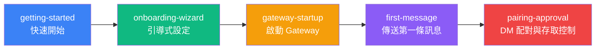

# 快速上手：從安裝到第一條訊息

歡迎使用 Clawdbot！本章節將引導你完成從零開始使用 Clawdbot 的完整流程。無論你是想快速體驗 AI 助手，還是深入了解設定選項，這裡都有對應的教學。

---

## 章節概述

本章節包含 5 個教學，覆蓋了 Clawdbot 的完整上手流程：從安裝軟體、設定 AI 模型和通訊頻道，到啟動 Gateway 背景程序、傳送第一條訊息，最後了解預設的安全保護機制。完成本章節後，你將擁有一個可以正常使用的個人 AI 助手。

---

## 學習路徑建議

我們推薦按照以下順序學習這些教學：

**學習順序說明**：

1. **快速開始**（必須）：完成基礎安裝和設定，這是所有後續學習的前提
2. **引導式設定**（推薦）：深入了解引導的各個選項，適合想要精細設定的使用者
3. **啟動 Gateway**（必須）：了解如何啟動和管理 Gateway 背景程序
4. **傳送第一條訊息**（必須）：驗證設定是否正確，開始使用 AI 助手
5. **DM 配對與存取控制**（推薦）：了解預設的安全機制，保護你的 AI 助手

::: tip 快速通道
如果你只想快速體驗，可以只學習「快速開始」和「啟動 Gateway」兩個教學，然後直接傳送訊息。其他教學可以後續按需學習。
:::

---

## 前置條件

在學習本章節之前，請確保：

- **Node.js**：≥ 22.12.0（使用 `node -v` 檢查）
- **作業系統**：macOS / Linux / Windows (WSL2)
- **套件管理員**：npm / pnpm / bun
- **AI 模型帳戶**（推薦）：
  - Anthropic Claude 帳戶（Pro/Max 訂閱），支援 OAuth 流程
  - 或準備好 OpenAI / DeepSeek / OpenRouter 等提供商的 API Key

::: warning Windows 使用者請注意
Windows 上強烈推薦使用 **WSL2**，因為：
- 許多頻道依賴本機二進位檔案
- 背景程序（launchd/systemd）在 Windows 上無法使用
:::

---

## 子頁面導覽

### [1. 快速開始](./getting-started/) ⭐ 核心教學

**學完你能做什麼**：
- ✅ 在你的裝置上安裝 Clawdbot
- ✅ 設定 AI 模型認證（Anthropic / OpenAI / 其他提供商）
- ✅ 啟動 Gateway 背景程序
- ✅ 透過 WebChat 或設定的頻道傳送第一條訊息

**適合人群**：所有使用者，必讀教學

**預計時間**：15-20 分鐘

**主要內容**：
- 使用 npm/pnpm/bun 安裝 Clawdbot
- 執行 onboarding 引導完成基礎設定
- 啟動 Gateway 並驗證狀態
- 透過 CLI 或頻道傳送測試訊息

**前置條件**：無

---

### [2. 引導式設定](./onboarding-wizard/)

**學完你能做什麼**：
- ✅ 使用互動式引導完成完整設定
- ✅ 理解 QuickStart 和 Manual 兩種模式的區別
- ✅ 設定 Gateway 網路、認證和 Tailscale
- ✅ 設定 AI 模型提供商（setup-token 和 API Key）
- ✅ 啟用通訊頻道（WhatsApp、Telegram 等）
- ✅ 安裝和管理技能包

**適合人群**：想要精細設定的使用者，了解進階選項

**預計時間**：20-30 分鐘

**主要內容**：
- QuickStart vs Manual 模式選擇
- Gateway 網路設定（連接埠、綁定、認證）
- AI 模型認證方式（setup-token 推薦）
- 通訊頻道設定流程
- 技能系統介紹

**前置條件**：[快速開始](./getting-started/)

---

### [3. 啟動 Gateway](./gateway-startup/) ⭐ 核心教學

**學完你能做什麼**：
- ✅ 使用命令列啟動 Gateway 前台程序
- ✅ 設定 Gateway 為背景背景程序（macOS LaunchAgent / Linux systemd / Windows Scheduled Task）
- ✅ 理解不同綁定模式（loopback / LAN / Tailnet）和認證方式
- ✅ 在開發模式和生產模式之間切換
- ✅ 使用 `--force` 強制釋放被佔用的連接埠

**適合人群**：所有使用者，必讀教學

**預計時間**：15-20 分鐘

**主要內容**：
- 前台模式 vs 背景程序模式
- 綁定模式選擇（loopback / LAN / Tailnet / Auto）
- 認證方式設定（Token / Password / Tailscale Identity）
- 開發模式（`--dev`）和生產模式
- 服務管理命令（install / start / stop / restart）
- 連接埠衝突處理（`--force`）

**前置條件**：[引導式設定](./onboarding-wizard/)

---

### [4. 傳送第一條訊息](./first-message/) ⭐ 核心教學

**學完你能做什麼**：
- ✅ 透過 WebChat 介面傳送訊息
- ✅ 透過已設定頻道（WhatsApp / Telegram / Slack 等）與 AI 助手對話
- ✅ 理解訊息路由和回應流程
- ✅ 使用 AI 助手執行基本任務（查詢、摘要、程式碼生成等）

**適合人群**：所有使用者，必讀教學

**預計時間**：10-15 分鐘

**主要內容**：
- WebChat 介面使用
- 各頻道訊息傳送方式
- 訊息格式和回覆機制
- 常見任務範例（查詢資訊、生成程式碼、摘要文字）
- 除錯和故障排查

**前置條件**：[啟動 Gateway](./gateway-startup/)

---

### [5. DM 配對與存取控制](./pairing-approval/)

**學完你能做什麼**：
- ✅ 了解預設的 DM 配對保護機制
- ✅ 核准或拒絕陌生傳送者的配對請求
- ✅ 設定白名單和黑名單
- ✅ 設定存取控制策略
- ✅ 理解配對模式和安全最佳實踐

**適合人群**：關注安全的使用者，推薦學習

**預計時間**：10-15 分鐘

**主要內容**：
- DM 配對機制原理
- 配對流程和使用者體驗
- 白名單和黑名單設定
- 存取控制策略設定
- 安全最佳實踐

**前置條件**：[傳送第一條訊息](./first-message/)

---

## 常見問題

### Q: 我應該學習所有教學嗎？

**A**: 不一定。如果你想快速上手，只需學習「快速開始」和「啟動 Gateway」兩個核心教學，然後就可以開始使用 Clawdbot 了。其他教學可以根據需要按需學習。

### Q: 跳過某些教學會有影響嗎？

**A**: 不會。每個教學都是獨立的，但「快速開始」是基礎，包含了安裝和基本設定，建議首先學習。其他教學可以根據你的需求選擇性學習。

### Q: 我已經熟悉 AI 助手，可以跳過基礎教學嗎？

**A**: 可以。如果你已經熟悉類似的 AI 助手工具，可以跳過「快速開始」，直接學習「引導式設定」和「啟動 Gateway」來了解 Clawdbot 的特定設定和啟動方式。

### Q: 學習完本章節後，我可以做什麼？

**A**: 完成本章節後，你將擁有一個可以正常使用的 Clawdbot 系統，能夠：
- 透過 WebChat 或多個頻道與 AI 助手對話
- 讓 AI 執行基本任務（查詢資訊、生成程式碼、摘要文字等）
- 使用 DM 配對機制保護安全
- 繼續學習進階功能（多頻道設定、工具系統、技能平台等）

---

## 下一步指引

完成本章節後，你可以繼續學習：

- **[多頻道系統概覽](../../platforms/channels-overview/)**：了解 Clawdbot 支援的所有通訊頻道及其特點
- **[WhatsApp 頻道](../../platforms/whatsapp/)**：深入學習 WhatsApp 頻道的設定和使用
- **[Telegram 頻道](../../platforms/telegram/)**：深入學習 Telegram 頻道的設定和使用
- **[WebChat 介面](../../platforms/webchat/)**：了解內建的 WebChat 介面功能

::: tip 提示
根據你的使用需求，選擇對應的頻道進行深入學習。如果你主要使用某個頻道（如 WhatsApp 或 Telegram），可以優先學習該頻道的專門教學。
:::
