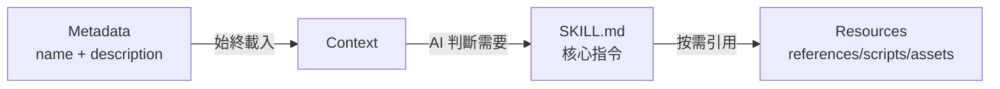

# 技能結構詳解

## 學完你能做什麼

- 精確理解 SKILL.md 的所有欄位要求和格式規範
- 掌握 references/、scripts/、assets/ 的設計原理和使用場景
- 最佳化技能的 token 使用和載入效能
- 避免常見的格式錯誤和路徑解析問題
- 使用漸進式載入提升 AI 上下文效率

## 你現在的困境

你已經學會了建立基本技能，但對 SKILL.md 的完整規範還不夠了解。你的技能可能遇到以下問題：

- SKILL.md 超長，導致 token 消耗過高
- 不確定哪些內容應該放在 references/ 而不是 SKILL.md
- AI 代理無法正確載入 scripts/ 或 assets/ 中的資源
- YAML frontmatter 格式錯誤導致安裝失敗

## 什麼時候用這一招

- **技能審查**：檢查已有技能是否符合 Anthropic 規範
- **效能最佳化**：解決技能載入慢或 token 超限的問題
- **資源重構**：將大型技能拆分為 SKILL.md + bundled resources
- **複雜技能開發**：編寫包含 API 文件、可執行腳本的完整技能

## 🎒 開始前的準備

::: warning 前置檢查

在開始前，請確保：

- ✅ 已閱讀 [建立自訂技能](../create-skills/)
- ✅ 安裝過至少一個技能（了解基本流程）
- ✅ 熟悉 YAML 和 Markdown 基礎語法

:::

## 核心思路

### SKILL.md 的設計哲學

**SKILL.md** 是 Anthropic 技能系統的核心，採用**漸進式載入**設計：



**三層載入的優勢**：

1. **Metadata 層**：所有技能的 `name` 和 `description` 始終在上下文中，AI 能快速了解可用技能
2. **SKILL.md 層**：只在相關時載入，包含核心指令（< 5000 詞）
3. **Resources 層**：詳細文件和可執行檔案按需載入，避免浪費 token

### Bundled Resources 的分類

| 目錄      | 是否載入到上下文 | 使用場景              | 範例類型                |
|--- | --- | --- | ---|
| `references/` | ✅ 按需載入      | 詳細文件、API 說明      | API docs、資料庫 schema  |
| `scripts/`  | ❌ 不載入        | 可執行程式碼            | Python/Bash 腳本        |
| `assets/`   | ❌ 不載入        | 範本、輸出檔案、圖片  | JSON 範本、樣板程式碼     |

## 跟我做

### 第 1 步：理解 YAML Frontmatter 完整規範

**為什麼**：YAML frontmatter 是技能的後設資料，必須符合嚴格規範

SKILL.md 必須以 `---` 開頭和結尾：

```yaml
---
name: my-skill
description: Use this skill when you need to demonstrate proper format.
---
```

**必需欄位**：

| 欄位       | 類型     | 格式要求                          | 範例                    |
|--- | --- | --- | ---|
| `name`     | string   | 連字元格式（kebab-case），不能有空格 | `pdf-editor`、`api-client` |
| `description` | string | 1-2 句話，第三人稱                | `Use this skill to edit PDF files` |

::: danger 常見錯誤

| 錯誤範例 | 問題 | 修正方法 |
|--- | --- | ---|
| `name: My Skill` | 包含空格 | 改為 `name: my-skill` |
| `name: my_skill` | 底線格式 | 改為 `name: my-skill` |
| `description: You should use this when...` | 第二人稱 | 改為 `description: Use this skill when...` |
| `description:` 太長 | 超過 100 詞 | 精簡為 1-2 句話概述 |
| 缺少結尾 `---` | YAML 未正確關閉 | 新增結尾分隔符 |

:::

**原始碼驗證**：OpenSkills 使用非貪婪正則驗證格式

```typescript
// src/utils/yaml.ts
export function hasValidFrontmatter(content: string): boolean {
  return content.trim().startsWith('---');
}

export function extractYamlField(content: string, field: string): string {
  const match = content.match(new RegExp(`^${field}:\\s*(.+?)$`, 'm'));
  return match ? match[1].trim() : '';
}
```

---

### 第 2 步：編寫 SKILL.md 正文（Imperative Form）

**為什麼**：AI 代理期望命令式指令，不是對話式描述

**正確定位**：

```markdown
## Instructions

To execute this task:

1. Read the input file
2. Process data using the algorithm
3. Generate output in specified format
```

**錯誤定位**（避免）：

```markdown
## Instructions

You should execute this task by:

1. Reading the input file
2. Processing data using the algorithm
3. Generating output in specified format
```

**對比表**：

| ✅ 正確（Imperative/Infinitive） | ❌ 錯誤（Second Person） |
|--- | ---|
| "Load this skill when X"       | "If you need Y"        |
| "To accomplish Z, execute A"   | "You should do Z"      |
| "See references/guide.md"     | "When you want to Z"   |

**寫作口訣**：

1. **動詞開頭**：`Create` → `Use` → `Return`
2. **省略 "You"**：不說 "You should"
3. **明確路徑**：引用資源時使用 `references/`、`scripts/`、`assets/` 前綴

---

### 第 3 步：使用 references/ 管理詳細文件

**為什麼**：保持 SKILL.md 簡潔，詳細文件按需載入

**適用場景**：

- API 文件（超過 500 詞的 endpoint 說明）
- 資料庫 schema（表結構、欄位定義）
- 詳細指南（配置項說明、常見問題）
- 程式碼範例（大型程式碼片段）

**目錄結構**：

```
my-skill/
├── SKILL.md              (~2,000 詞，核心指令)
└── references/
    ├── api-docs.md       (詳細 API 文件)
    ├── database-schema.md (資料庫結構)
    └── troubleshooting.md (故障排除指南)
```

**SKILL.md 中的引用方式**：

```markdown
## Instructions

To interact with the API:

1. Read the request parameters
2. Call the API endpoint
3. For detailed response format, see `references/api-docs.md`
4. Parse the response
5. Handle errors (see `references/troubleshooting.md`)
```

**references/api-docs.md 範例**：

```markdown
# API Documentation

## Overview

This API provides endpoints for data processing.

## Endpoints

### POST /api/process

**Request:**
```json
{
  "input": "data to process",
  "options": {
    "format": "json"
  }
}
```

**Response:**
```json
{
  "status": "success",
  "result": {
    "output": "processed data"
  }
}
```

**Error Codes:**
- `400`: Invalid input format
- `500`: Server error
```

::: tip 最佳實踐

**references/ 的檔案大小建議**：
- 單個檔案：建議 < 10,000 詞
- 總大小：建議 < 50,000 詞（多個檔案拆分）
- 命名：使用連字元格式（`api-docs.md` 而非 `API_Docs.md`）

:::

---

### 第 4 步：使用 scripts/ 執行確定性任務

**為什麼**：可執行腳本不需要載入到上下文，適合重複性任務

**適用場景**：

- 資料轉換（JSON → CSV、格式轉換）
- 檔案處理（壓縮、解壓、重新命名）
- 程式碼生成（從範本生成程式碼）
- 測試執行（單元測試、整合測試）

**目錄結構**：

```
my-skill/
├── SKILL.md
└── scripts/
    ├── process.py       (Python 腳本)
    ├── transform.sh     (Bash 腳本)
    └── validate.js     (Node.js 腳本)
```

**SKILL.md 中的引用方式**：

```markdown
## Instructions

To process the input data:

1. Validate the input file format
2. Execute the processing script:
   ```bash
   python scripts/process.py --input data.json --output result.json
   ```
3. Verify the output file
4. If validation fails, see `scripts/validate.py` for error messages
```

**scripts/process.py 範例**：

```python
#!/usr/bin/env python3
import json
import sys

def main():
    input_file = sys.argv[1]
    output_file = sys.argv[2]

    with open(input_file, 'r') as f:
        data = json.load(f)

    # Processing logic
    result = transform_data(data)

    with open(output_file, 'w') as f:
        json.dump(result, f, indent=2)

    print(f"✅ Processed {input_file} → {output_file}")

if __name__ == "__main__":
    main()
```

::: info scripts/ 的優勢

相比在 SKILL.md 中內聯程式碼：

| 特性       | 內聯程式碼        | scripts/            |
|--- | --- | ---|
| Token 消耗 | ✅ 高           | ❌ 低              |
| 可複用性   | ❌ 差           | ✅ 好              |
| 可測試性   | ❌ 難           | ✅ 易              |
| 複雜度限制 | ❌ 受 token 限制 | ✅ 無限制          |

:::

---

### 第 5 步：使用 assets/ 儲存範本和輸出檔案

**為什麼**：範本和輸出檔案不需要載入到上下文，節省 token

**適用場景**：

- 輸出範本（JSON、XML、Markdown 範本）
- 樣板程式碼（專案腳手架、設定檔）
- 圖片和圖表（流程圖、架構圖）
- 測試資料（範例輸入、預期輸出）

**目錄結構**：

```
my-skill/
├── SKILL.md
└── assets/
    ├── template.json    (JSON 範本)
    ├── boilerplate.js   (樣板程式碼)
    └── diagram.png     (流程圖)
```

**SKILL.md 中的引用方式**：

```markdown
## Instructions

To generate the output file:

1. Load the template: `assets/template.json`
2. Replace placeholders with actual data
3. Write to output file
4. For boilerplate code, see `assets/boilerplate.js`
```

**assets/template.json 範例**：

```json
{
  "title": "{{ title }}",
  "description": "{{ description }}",
  "version": "{{ version }}",
  "author": "{{ author }}",
  "created_at": "{{ timestamp }}"
}
```

**在腳本中使用範本**：

```python
import json
from string import Template

def generate_output(data, template_path):
    with open(template_path, 'r') as f:
        template_str = f.read()

    template = Template(template_str)
    output = template.safe_substitute(data)

    return output
```

::: warning assets/ 的注意事項

- **不載入到上下文**：AI 代理不能直接讀取內容，必須透過腳本載入
- **路徑解析**：使用相對路徑，如 `assets/template.json`
- **檔案大小**：建議單個檔案 < 10MB（避免傳輸延遲）

:::

---

### 第 6 步：最佳化檔案大小和效能

**為什麼**：檔案大小直接影響 AI 上下文的 token 消耗和載入速度

**檔案大小指南**（官方推薦）：

| 目錄      | 大小限制        | 載入行為          |
|--- | --- | ---|
| SKILL.md  | < 5,000 詞     | 始終載入（需要時） |
| references/ | 無嚴格限制      | 按需載入         |
| scripts/  | 不計入 token    | 不載入，只執行     |
| assets/   | 不載入到上下文  | 不載入，只複製     |

**效能最佳化技巧**：

1. **拆分 references/**：
   ```bash
   # ❌ 單個大檔案（20,000 詞）
   references/all-docs.md

   # ✅ 拆分為多個小檔案（每篇 < 5,000 詞）
   references/
   ├── api-docs.md
   ├── database-schema.md
   └── troubleshooting.md
   ```

2. **使用 scripts/ 處理資料**：
   ```markdown
   # ❌ 在 SKILL.md 中內聯大程式碼區塊（消耗 token）
   ## Instructions
   Execute this code:
   ```python
   # 500 lines of code...
   ```

   # ✅ 引用 scripts/（不消耗 token）
   ## Instructions
   Execute: `python scripts/processor.py`
   ```

3. **精簡 SKILL.md**：
   - 只保留核心指令和步驟
   - 將詳細說明移到 `references/`
   - 使用簡潔的命令式語言

**驗證檔案大小**：

```bash
# 統計 SKILL.md 詞數
wc -w my-skill/SKILL.md

# 統計 references/ 總詞數
find my-skill/references -name "*.md" -exec wc -w {} + | tail -1

# 檢查 scripts/ 檔案大小
du -sh my-skill/scripts/
```

---

### 第 7 步：理解資源解析機制

**為什麼**：了解路徑解析規則，避免引用錯誤

**base directory 的概念**：

當 AI 代理載入技能時，`openskills read` 會輸出 base directory：

```
Reading: my-skill
Base directory: /path/to/project/.claude/skills/my-skill
```

**相對路徑解析規則**：

| 引用路徑              | 解析結果                                                  |
|--- | ---|
| `references/api.md`   | `/base/directory/references/api.md`                          |
| `scripts/process.py`  | `/base/directory/scripts/process.py`                         |
| `assets/template.json` | `/base/directory/assets/template.json`                       |

**原始碼驗證**：

```typescript
// src/commands/read.ts
export function readSkill(skillNames: string[] | string): void {
  const skill = findSkill(name);
  const content = readFileSync(skill.path, 'utf-8');

  // 輸出 base directory，供 AI 解析相對路徑
  console.log(`Base directory: ${skill.baseDir}`);
  console.log(content);
}
```

::: danger 路徑錯誤範例

| ❌ 錯誤寫法                      | 問題                | ✅ 正確寫法              |
|--- | --- | ---|
| `/absolute/path/to/api.md`      | 使用絕對路徑         | `references/api.md`     |
| `../other-skill/references/api.md` | 跨技能引用           | `references/api.md`     |
| `~/references/api.md`           | 使用波浪號擴展      | `references/api.md`     |

:::

---

### 第 8 步：驗證技能格式

**為什麼**：在安裝前驗證格式，避免執行時報錯

**使用 openskills 驗證**：

```bash
npx openskills install ./my-skill
```

**你應該看到**：

```
✔ Found skill: my-skill
  Description: Use this skill when you need to demonstrate proper format.
  Size: 2.1 KB

? Select skills to install: (Use arrow keys)
❯ ☑ my-skill
```

**驗證清單**：

- [ ] SKILL.md 以 `---` 開頭
- [ ] 包含 `name` 欄位（連字元格式）
- [ ] 包含 `description` 欄位（1-2 句話）
- [ ] YAML 以 `---` 結尾
- [ ] 正文使用 imperative/infinitive 形式
- [ ] 所有 `references/`、`scripts/`、`assets/` 引用使用相對路徑
- [ ] SKILL.md 詞數 < 5,000 詞
- [ ] references/ 檔案命名使用連字元格式

**手動驗證 YAML frontmatter**：

```bash
# 檢查是否以 --- 開頭
head -1 my-skill/SKILL.md

# 驗證 YAML 欄位（使用 yq 或其他工具）
yq eval '.name' my-skill/SKILL.md
```

---

### 第 9 步：測試技能載入

**為什麼**：確保技能能正確載入到 AI 上下文

**使用 openskills read 測試**：

```bash
npx openskills read my-skill
```

**你應該看到**：

```
Reading: my-skill
Base directory: /path/to/project/.claude/skills/my-skill

---
name: my-skill
description: Use this skill when you need to demonstrate proper format.
---

# My Skill

## Instructions

To execute this task...

## Bundled Resources

For detailed information: see `references/skill-format.md`

Skill read: my-skill
```

**檢查點**：

- ✅ 輸出包含 `Base directory`（用於路徑解析）
- ✅ SKILL.md 內容完整（包括 YAML 和正文）
- ✅ 沒有 "Invalid SKILL.md" 錯誤
- ✅ 所有引用路徑正確顯示

## 檢查點 ✅

完成以上步驟後，你應該：

- ✅ 理解 SKILL.md 的完整欄位規範
- ✅ 掌握 references/、scripts/、assets/ 的使用場景
- ✅ 能夠最佳化技能的檔案大小和載入效能
- ✅ 知道如何驗證技能格式和測試載入
- ✅ 理解資源解析機制和 base directory

## 踩坑提醒

### 問題 1：SKILL.md 超過 5000 詞導致 token 超限

**原因**：SKILL.md 包含過多詳細文件

**解決方法**：
1. 將詳細內容移到 `references/` 目錄
2. 在 SKILL.md 中引用：`See references/guide.md for details`
3. 使用 `wc -w SKILL.md` 檢查詞數

---

### 問題 2：scripts/ 腳本無法執行

**原因**：
- 腳本缺少執行權限
- 使用了絕對路徑而非相對路徑

**解決方法**：
```bash
# 新增執行權限
chmod +x my-skill/scripts/*.sh

# 在 SKILL.md 中使用相對路徑
## Instructions
Execute: `python scripts/process.py`  # ✅ 正確
Execute: `/path/to/my-skill/scripts/process.py`  # ❌ 錯誤
```

---

### 問題 3：references/ 檔案按需載入但 AI 未能讀取

**原因**：AI 代理沒有正確解析 `references/` 路徑

**解決方法**：
1. 確認 `openskills read` 輸出了 `Base directory`
2. 在引用時明確說明：`See references/api-docs.md in base directory`
3. 避免使用絕對路徑或跨技能引用

---

### 問題 4：assets/ 檔案過大導致傳輸延遲

**原因**：assets/ 儲存了大型二進位檔案（> 10MB）

**解決方法**：
- 壓縮圖片：使用 PNG 而非 BMP，最佳化 JPEG 品質
- 拆分資料：將大型資料集拆分為多個小檔案
- 使用外部儲存：對於超大檔案，提供下載連結而非直接包含

---

### 問題 5：YAML frontmatter 格式錯誤

**原因**：
- 缺少結尾的 `---`
- 欄位值包含特殊字元（冒號、井號）未加引號

**解決方法**：
```yaml
# ❌ 錯誤：缺少結尾 ---
---
name: my-skill
description: Use this skill: for testing
# 缺少 ---

# ✅ 正確：完整閉合
---
name: my-skill
description: "Use this skill: for testing"
---
```

---

### 問題 6：指令使用第二人稱（Second Person）

**原因**：習慣性使用 "You should"、"When you want"

**解決方法**：
- 使用動詞開頭的命令式語言
- 使用 "To do X, execute Y" 取代 "You should do Y"
- 使用 "Load this skill when Z" 取代 "If you need Z"

**對照表**：

| 第二人稱（❌ 避免）     | 命令式（✅ 推薦）         |
|--- | ---|
| "You should execute..." | "To execute X, run..."   |
| "When you want to..."  | "Load this skill when..."  |
| "If you need..."       | "Use X to accomplish Y"    |

## 本課小結

技能結構的核心要點：

1. **YAML frontmatter**：必需欄位 `name`（連字元格式）和 `description`（1-2 句話）
2. **正文格式**：使用 imperative/infinitive 形式，避免 second person
3. **references/**：存放詳細文件，按需載入到上下文（< 10,000 詞/檔案）
4. **scripts/**：存放可執行腳本，不載入到上下文，適合確定性任務
5. **assets/**：存放範本和輸出檔案，不載入到上下文
6. **檔案大小**：SKILL.md < 5,000 詞，references/ 可拆分，scripts/ 無限制
7. **路徑解析**：使用相對路徑（`references/`、`scripts/`、`assets/`），基於 base directory 解析
8. **驗證方法**：使用 `openskills install` 驗證格式，`openskills read` 測試載入

## 下一課預告

> 下一課我們學習 **[CI/CD 整合](../ci-integration/)**。
>
> 你會學到：
> - 如何在 CI/CD 環境中使用 `-y/--yes` 標誌
> - 自動化技能安裝和同步流程
> - 在 GitHub Actions、GitLab CI 中整合 OpenSkills

---

## 附錄：原始碼參考

<details>
<summary><strong>點選展開查看原始碼位置</strong></summary>

> 更新時間：2026-01-24

| 功能           | 檔案路徑                                                                 | 行號    |
|--- | --- | ---|
| YAML frontmatter 驗證 | [`src/utils/yaml.ts`](https://github.com/numman-ali/openskills/blob/main/src/utils/yaml.ts) | 12-14   |
| YAML 欄位提取  | [`src/utils/yaml.ts`](https://github.com/numman-ali/openskills/blob/main/src/utils/yaml.ts) | 4-7     |
| 技能讀取命令  | [`src/commands/read.ts`](https://github.com/numman-ali/openskills/blob/main/src/commands/read.ts) | 1-49    |
| Base directory 輸出 | [`src/commands/read.ts`](https://github.com/numman-ali/openskills/blob/main/src/commands/read.ts) | 42      |
| 安裝時驗證格式  | [`src/commands/install.ts`](https://github.com/numman-ali/openskills/blob/main/src/commands/install.ts) | 242, 291, 340 |

**範例技能檔案**：
- [`examples/my-first-skill/SKILL.md`](https://github.com/numman-ali/openskills/blob/main/examples/my-first-skill/SKILL.md) - 完整結構範例
- [`examples/my-first-skill/references/skill-format.md`](https://github.com/numman-ali/openskills/blob/main/examples/my-first-skill/references/skill-format.md) - 格式規範參考

**關鍵函式**：
- `hasValidFrontmatter(content: string): boolean` - 驗證 SKILL.md 是否以 `---` 開頭
- `extractYamlField(content: string, field: string): string` - 提取 YAML 欄位值（非貪婪匹配）
- `readSkill(skillNames: string[] | string): void` - 讀取技能到標準輸出（供 AI 使用）

</details>
