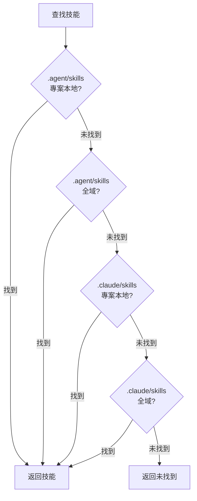

# Universal 模式：多代理環境

## 學完你能做什麼

- 理解 Universal 模式的核心價值和設計目的
- 掌握 `--universal` 標誌的使用方法
- 了解 `.agent/skills` 與 `.claude/skills` 的區別
- 理解 4 級搜索優先級規則
- 在多代理環境中統一管理技能，避免衝突
- 為 Claude Code、Cursor、Windsurf、Aider 等多個代理共享同一套技能

::: info 前置知識

本教程假設你已經了解了 [全域安裝 vs 專案本地安裝](../../platforms/global-vs-project/) 和 [同步技能到 AGENTS.md](../../start/sync-to-agents/)，理解基本的安裝位置和同步流程。

:::

---

## 你現在的困境

你可能已經學會了如何安裝和同步技能，但是：

- **多個代理如何共享技能？**：同時使用 Claude Code 和 Cursor，但各自安裝技能，管理混亂
- **Claude Code Marketplace 衝突**：安裝技能後與 Claude Code 原生插件市場產生衝突
- **AGENTS.md 位置不統一**：不同代理需要的 AGENTS.md 路徑不同，維護困難
- **技能重複安裝**：每個代理都要安裝一套技能，浪費磁碟空間

其實 OpenSkills 提供了 Universal 模式，專門解決多代理環境的技能管理問題。

---

## 什麼時候用這一招

**Universal 模式的適用場景**：

| 場景 | 是否需要 Universal 模式 | 示例 |
|--- | --- | ---|
| **單一代理**（僅 Claude Code） | ❌ 否 | 只使用 Claude Code，直接使用預設的 `.claude/skills` |
| **多代理**（Claude Code + 其他） | ✅ 是 | 同時使用 Claude Code 和 Cursor/Windsurf/Aider |
| **避免 Marketplace 衝突** | ✅ 是 | 不想與 Claude Code 原生插件市場衝突 |
| **統一 AGENTS.md 管理** | ✅ 是 | 多個代理共享同一個 AGENTS.md 檔案 |

::: tip 推薦做法

- **單一代理用預設模式**：只使用 Claude Code 時，使用預設的 `.claude/skills` 安裝
- **多代理用 Universal 模式**：同時使用多個代理時，使用 `--universal` 安裝到 `.agent/skills`
- **團隊協作統一標準**：團隊內明確約定使用哪種模式，避免混亂

:::

---

## 核心思路：統一目錄，多代理共享

OpenSkills 提供兩種技能目錄模式：

**預設模式（`.claude/skills`）**：
- 專為 Claude Code 設計
- 與 Claude Code Marketplace 相容
- 安裝位置：`./.claude/skills/` 或 `~/.claude/skills/`

**Universal 模式（`.agent/skills`）**：
- 專為多代理環境設計
- 避免 Claude Code Marketplace 衝突
- 安裝位置：`./.agent/skills/` 或 `~/.agent/skills/`

::: info 重要概念

**Universal 模式**：使用 `--universal` 標誌將技能安裝到 `.agent/skills/` 目錄，讓多個 AI 編碼代理（Claude Code、Cursor、Windsurf、Aider 等）共享同一套技能，統一透過 AGENTS.md 管理。

:::

**4 級搜索優先級**（原始碼 `dirs.ts:18-24`）：

```typescript
export function getSearchDirs(): string[] {
  return [
    join(process.cwd(), '.agent/skills'),   // 1. Project universal (最高優先級)
    join(homedir(), '.agent/skills'),        // 2. Global universal
    join(process.cwd(), '.claude/skills'),  // 3. Project claude
    join(homedir(), '.claude/skills'),       // 4. Global claude
  ];
}
```

**優先級說明**：
1. **Project Universal**（最高）：`.agent/skills/` 優先於 `.claude/skills/`
2. **Global Universal**：其次查找全域的 `.agent/skills/`
3. **Project Claude**：然後是專案本地的 `.claude/skills/`
4. **Global Claude**（最低）：最後是全域的 `.claude/skills/`

---

## 跟我做

### 第 1 步：使用 Universal 模式安裝技能

**為什麼**
先學會如何使用 `--universal` 標誌安裝技能。

打開終端，在任意專案中執行：

```bash
# 使用 Universal 模式安裝技能
npx openskills install anthropics/skills --universal -y

# 查看技能列表
npx openskills list
```

**你應該看到**：技能列表中每個技能後面有 `(project)` 標籤

```
  codebase-reviewer         (project)
    Review code changes for issues...

Summary: 3 project, 0 global (3 total)
```

**解釋**：
- 使用 `--universal` 標誌後，技能安裝在 `./.agent/skills/` 目錄
- `list` 指令仍然顯示 `(project)` 或 `(global)` 標籤
- `.agent/skills/` 與預設的 `.claude/skills/` 並不衝突

---

### 第 2 步：查看技能安裝位置

**為什麼**
確認技能檔案的實際儲存位置，理解 Universal 模式的目錄結構。

在專案根目錄執行：

```bash
# 查看 Universal 模式的技能目錄
ls -la .agent/skills/

# 查看技能目錄內容
ls -la .agent/skills/codebase-reviewer/
```

**你應該看到**：

```
.agent/skills/
├── codebase-reviewer/
│   ├── SKILL.md
│   └── .openskills.json    # 安裝元資料
├── file-writer/
│   ├── SKILL.md
│   └── .openskills.json
└── ...
```

**解釋**：
- Universal 模式的技能安裝在 `.agent/skills/` 目錄
- 每個技能有自己的目錄和元資料
- 這與預設的 `.claude/skills/` 結構完全相同

---

### 第 3 步：對比兩種模式的目錄結構

**為什麼**
透過實際對比，理解 `.claude/skills` 和 `.agent/skills` 的區別。

執行以下指令：

```bash
# 查看兩種模式的技能目錄
echo "=== .claude/skills (預設模式) ==="
ls -la .claude/skills/ 2>/dev/null || echo "目錄不存在"

echo "=== .agent/skills (Universal 模式) ==="
ls -la .agent/skills/

# 查看全域安裝的目錄
echo "=== ~/.claude/skills (全域預設) ==="
ls -la ~/.claude/skills/ 2>/dev/null || echo "目錄不存在"

echo "=== ~/.agent/skills (全域 Universal) ==="
ls -la ~/.agent/skills/ 2>/dev/null || echo "目錄不存在"
```

**你應該看到**：

```
=== .claude/skills (預設模式) ===
目錄不存在

=== .agent/skills (Universal 模式) ===
codebase-reviewer
file-writer

=== ~/.claude/skills (全域預設) ===
git-helper
test-generator

=== ~/.agent/skills (全域 Universal) ===
目錄不存在
```

**解釋**：
- `.claude/skills/` 和 `.agent/skills/` 是兩個獨立的目錄
- 可以同時存在，互不干擾
- 支援專案本地和全域兩種安裝方式

---

### 第 4 步：全域 Universal 安裝

**為什麼**
了解如何全域安裝 Universal 技能，服務所有專案。

執行：

```bash
# 全域 Universal 安裝技能
npx openskills install anthropics/skills --universal --global -y

# 查看技能列表
npx openskills list
```

**你應該看到**：

```
  codebase-reviewer         (project)
    Review code changes for issues...
  file-writer              (global)
    Write files with format...

Summary: 1 project, 2 global (3 total)
```

**解釋**：
- `--universal` 和 `--global` 可以組合使用
- 安裝到 `~/.agent/skills/` 目錄
- 所有專案都可以使用這些技能

---

### 第 5 步：驗證 4 級搜索優先級

**為什麼**
理解 OpenSkills 如何在 4 個目錄中查找技能。

執行：

```bash
# 在 4 個位置安裝同名技能（不同版本）
# 1. Project Universal
npx openskills install anthropics/skills --universal -y
# 2. Global Universal
npx openskills install anthropics/skills --universal --global -y
# 3. Project Claude
npx openskills install anthropics/skills -y
# 4. Global Claude
npx openskills install anthropics/skills --global -y

# 讀取技能（會優先使用 Project Universal 版本）
npx openskills read codebase-reviewer | head -5
```

**你應該看到**：輸出的是 `.agent/skills/`（Project Universal）版本的技能內容。

**搜索優先級視覺化**：



**解釋**：
- `.agent/skills/` 的優先級高於 `.claude/skills/`
- 專案本地優先級高於全域
- 當同名技能同時存在時，優先使用 Project Universal 版本
- 這樣可以實現"Universal 優先"的靈活配置

---

### 第 6 步：避免 Claude Code Marketplace 衝突

**為什麼**
了解 Universal 模式如何解決與 Claude Code Marketplace 的衝突。

執行：

```bash
# 使用 Universal 模式安裝技能
npx openskills install anthropics/skills --universal -y

# 同步到 AGENTS.md
npx openskills sync

# 查看 AGENTS.md
cat AGENTS.md
```

**你應該看到**：AGENTS.md 中包含技能列表，不會與 Claude Code Marketplace 衝突。

**解釋**：
- Universal 模式使用 `.agent/skills/`，與 Claude Code 的 `.claude/skills/` 分離
- 避免 OpenSkills 安裝的技能與 Claude Code Marketplace 插件衝突
- 多個代理可以共享同一個 AGENTS.md，統一管理

---

## 檢查點 ✅

完成以下檢查，確認你掌握了本課內容：

- [ ] 能夠區分 `.claude/skills` 和 `.agent/skills` 兩種模式
- [ ] 知道 `--universal` 標誌的作用
- [ ] 理解 4 級搜索優先級規則
- [ ] 能夠根據場景選擇合適的安裝模式
- [ ] 知道如何在多代理環境中統一管理技能
- [ ] 理解 Universal 模式如何避免 Marketplace 衝突

---

## 踩坑提醒

### 常見錯誤 1：單一代理誤用 Universal 模式

**錯誤場景**：只使用 Claude Code，但使用了 Universal 模式

```bash
# ❌ 錯誤：單一代理不需要 Universal 模式
npx openskills install anthropics/skills --universal
```

**問題**：
- 增加了不必要的複雜度
- 無法與 Claude Code Marketplace 插件協同工作
- AGENTS.md 位置可能不符合 Claude Code 期望

**正確做法**：

```bash
# ✅ 正確：單一代理使用預設模式
npx openskills install anthropics/skills
```

---

### 常見錯誤 2：多代理未使用 Universal 模式

**錯誤場景**：同時使用多個代理，但未使用 Universal 模式

```bash
# ❌ 錯誤：每個代理獨立安裝技能，管理混亂
npx openskills install anthropics/skills  # Claude Code 用
npx openskills install anthropics/skills --global  # Cursor 用
```

**問題**：
- 技能重複安裝，浪費磁碟空間
- 不同代理使用的技能版本可能不一致
- AGENTS.md 需要分別維護

**正確做法**：

```bash
# ✅ 正確：多代理使用 Universal 模式統一管理
npx openskills install anthropics/skills --universal
# 所有代理共享同一套技能和 AGENTS.md
```

---

### 常見錯誤 3：忘記 Universal 模式的搜索優先級

**錯誤場景**：在 `.claude/skills` 和 `.agent/skills` 都安裝了同名技能，但期望使用 `.claude/skills` 版本

```bash
# .agent/skills 和 .claude/skills 都有 codebase-reviewer
# 但想用 .claude/skills 版本
npx openskills install anthropics/skills --universal  # 安裝新版到 .agent/skills
npx openskills install anthropics/skills  # 安裝舊版到 .claude/skills
npx openskills read codebase-reviewer  # ❌ 還是讀到 .agent/skills 版本
```

**問題**：
- `.agent/skills` 的優先級高於 `.claude/skills`
- 即使 `.claude/skills` 安裝了新版本，仍然讀取 `.agent/skills` 版本

**正確做法**：

```bash
# 方案 1：刪除 .agent/skills 版本
npx openskills remove codebase-reviewer  # 刪除 .agent/skills 版本
npx openskills read codebase-reviewer  # ✅ 現在讀取 .claude/skills 版本

# 方案 2：更新 .agent/skills 版本
npx openskills update codebase-reviewer  # 更新 .agent/skills 版本
```

---

### 常見錯誤 4：AGENTS.md 路徑配置錯誤

**錯誤場景**：多個代理需要的 AGENTS.md 路徑不同

```bash
# Claude Code 期望 AGENTS.md 在根目錄
# Cursor 期望 AGENTS.md 在 .cursor/ 目錄
# Windsurf 期望 AGENTS.md 在 .windsurf/ 目錄
npx openskills sync  # 只生成一個 AGENTS.md
```

**問題**：
- 不同代理無法找到 AGENTS.md
- 技能載入失敗

**正確做法**：

```bash
# 為不同代理生成不同位置的 AGENTS.md
npx openskills sync -o AGENTS.md           # Claude Code
npx openskills sync -o .cursor/AGENTS.md    # Cursor
npx openskills sync -o .windsurf/AGENTS.md  # Windsurf
```

---

## 本課小結

**核心要點**：

1. **Universal 模式用於多代理環境**：使用 `--universal` 安裝到 `.agent/skills/`
2. **4 級搜索優先級**：Project Universal > Global Universal > Project Claude > Global Claude
3. **避免 Marketplace 衝突**：`.agent/skills/` 與 Claude Code 的 `.claude/skills/` 分離
4. **統一 AGENTS.md 管理**：多個代理共享同一個 AGENTS.md 檔案
5. **推薦原則**：單一代理用預設模式，多代理用 Universal 模式

**決策流程**：

```
[需要安裝技能] → [是否使用多個代理？]
                      ↓ 是
              [使用 Universal 模式（--universal）]
                      ↓ 否
              [僅使用 Claude Code？]
                      ↓ 是
              [使用預設模式（.claude/skills）]
                      ↓ 否
              [查看具體代理文件，選擇合適模式]
```

**記憶口訣**：

- **單一代理**：預設模式最簡單，Claude Code 用 `.claude`
- **多代理**：Universal 模式統一管，`.agent/skills` 避免衝突

---

## 下一課預告

> 下一課我們學習 **[自訂輸出路徑](../custom-output-path/)**。
>
> 你會學到：
> - 如何使用 `--output/-o` 標誌自訂 AGENTS.md 輸出路徑
> - 如何為不同代理生成不同位置的 AGENTS.md
> - 如何在 CI/CD 環境中使用自訂輸出路徑
> - 如何整合到現有的文件系統

---

## 附錄：原始碼參考

<details>
<summary><strong>點擊展開查看原始碼位置</strong></summary>

> 更新時間：2026-01-24

| 功能        | 檔案路徑                                                                                          | 行號    |
|--- | --- | ---|
| 目錄路徑工具 | [`src/utils/dirs.ts`](https://github.com/numman-ali/openskills/blob/main/src/utils/dirs.ts#L7-L25)     | 7-25    |
| 安裝位置判斷 | [`src/commands/install.ts`](https://github.com/numman-ali/openskills/blob/main/src/commands/install.ts#L84-L92) | 84-92   |
| 命令列參數定義 | [`src/cli.ts`](https://github.com/numman-ali/openskills/blob/main/src/cli.ts#L48)                    | 48      |

**關鍵常數**：
- `.claude/skills`：預設技能目錄（Claude Code 相容）
- `.agent/skills`：通用技能目錄（多代理環境）

**關鍵函數**：
- `getSkillsDir(projectLocal, universal)`：根據標誌返回技能目錄路徑
- `getSearchDirs()`：返回技能搜索目錄列表（4 級優先級）

**業務規則**：
- Universal 模式使用 `.agent/skills/` 目錄
- 4 級搜索優先級：Project Universal > Global Universal > Project Claude > Global Claude
- `--universal` 和 `--global` 可組合使用

</details>
