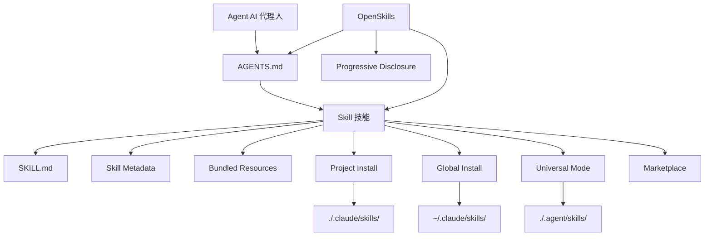

# 術語表

本術語表解釋 OpenSkills 和 AI 技能系統中的關鍵概念，幫助你快速理解專業術語。

::: info 提示
本術語表按字母順序排列，術語之間的關聯會在定義中標註。
:::

---

## A

### Agent（AI 代理人）

**定義**：AI 代理人是指能夠執行編碼任務的 AI 工具，如 Claude Code、Cursor、Windsurf、Aider 等。

**特點**：
- 能夠讀取 `AGENTS.md` 設定檔案
- 支援 SKILL.md 格式的技能載入
- 可以透過命令列呼叫外部工具（如 `npx openskills read`）

**在 OpenSkills 中的角色**：OpenSkills 讓任何支援讀取 AGENTS.md 的代理人都能使用 Anthropic 的技能格式。

**相關術語**：[Skill](#skill)、[AGENTS.md](#agentsmd)

---

## B

### Base Directory（基礎目錄）

**定義**：技能目錄的完整路徑，用於解析技能中的相對路徑引用。

**作用**：
- 提供技能目錄的絕對路徑
- 用於解析 `references/`、`scripts/`、`assets/` 等綑綁資源的相對路徑

**範例**：
```
Base directory: /path/to/my-first-skill
```

當技能引用 `references/skill-format.md` 時，實際解析為：
```
/path/to/my-first-skill/references/skill-format.md
```

**相關術語**：[Skill](#skill)、[Bundled Resources](#bundled-resources)

---

### Bundled Resources（綑綁資源）

**定義**：技能目錄下附帶的資源檔案，提供技能執行所需的詳細資訊或工具。

**類型**：
- **`references/`** - 參考文件、API 文件等
- **`scripts/`** - 可執行的腳本檔案
- **`assets/`** - 範本、範例檔案等

**用途**：
- 將詳細文件移到 `references/`，保持 SKILL.md 簡潔
- 將可執行程式放在 `scripts/`，便於呼叫
- 將範本和範例放在 `assets/`，供使用者參考

**範例**：
```
my-skill/
├── SKILL.md
├── references/
│   └── api-docs.md
├── scripts/
│   └── helper.py
└── assets/
    └── template.json
```

**相關術語**：[Skill](#skill)、[SKILL.md](#skillmd)

---

## G

### Global Install（全域安裝）

**定義**：將技能安裝到使用者主目錄下的 `.claude/skills` 目錄，使所有專案都能存取該技能。

**命令範例**：
```bash
npx openskills install anthropics/skills --global
```

**目標路徑**：
- macOS/Linux: `~/.claude/skills/`
- Windows: `%USERPROFILE%\.claude\skills\`

**適用場景**：
- 希望在多個專案中使用相同技能
- 不希望技能隨專案倉庫版本化

**優先順序**：在查找技能時，全域安裝的優先順序低於專案本地安裝（見 [Skill 查找優先順序](#skill-查找優先順序)）。

**相關術語**：[Project Install](#project-install)、[Skill 查找優先順序](#skill-查找優先順序)

---

## M

### Marketplace（市集）

**定義**：存放技能的 GitHub 倉庫，用於發布和發現技能。

**Anthropic Marketplace**：
- 官方技能倉庫：`anthropics/skills`
- 提供官方維護的技能（如 pdf、git-workflow、skill-creator 等）

**第三方市集**：
- 任何 GitHub 倉庫都可以作為技能來源
- 支援私有倉庫

**從市集安裝**：
```bash
# 從 Anthropic 官方市集安裝
npx openskills install anthropics/skills

# 從第三方倉庫安裝
npx openskills install your-org/your-skills

# 從私有倉庫安裝
npx openskills install git@github.com:your-org/private-skills.git
```

**相關術語**：[Skill](#skill)、[Global Install](#global-install)

---

## O

### OpenSkills

**定義**：OpenSkills 是 Anthropic 技能系統的通用載入器，讓任何 AI 編碼代理都能使用標準的 SKILL.md 格式技能。

**核心價值**：
- **統一標準** - 所有代理使用相同的技能格式和 AGENTS.md 描述
- **漸進式載入** - 按需載入技能，保持上下文精簡
- **多代理支援** - 一套技能服務多個代理
- **開源友好** - 支援本地路徑和私有 git 倉庫
- **相容性強** - 與 Claude Code 格式完全相容

**主要命令**：
- `install` - 安裝技能
- `list` - 列出已安裝技能
- `read` - 讀取技能內容（供 AI 代理使用）
- `sync` - 同步技能到 AGENTS.md
- `update` - 更新已安裝技能
- `manage` / `remove` - 刪除技能

**官方倉庫**：https://github.com/numman-ali/openskills

**相關術語**：[Skill](#skill)、[SKILL.md](#skillmd)、[AGENTS.md](#agentsmd)

---

## P

### Progressive Disclosure（漸進式載入）

**定義**：只在實際需要時才載入技能，避免一次性載入所有技能導致的上下文膨脹。

**工作原理**：
1. 技能資訊以簡短描述儲存在 AGENTS.md 中
2. 當使用者請求某任務時，AI 代理檢查是否有匹配的技能
3. 如果有，透過 `npx openskills read <skill-name>` 載入完整技能內容
4. 技能內容只在當前任務上下文中有效

**優勢**：
- 保持 AI 代理的上下文精簡
- 降低 token 使用量
- 提高回應速度

**範例**：
```xml
<!-- AGENTS.md 中只包含簡短描述 -->
<available_skills>
  <skill>
    <name>pdf</name>
    <description>Comprehensive PDF manipulation toolkit...</description>
  </skill>
</available_skills>

<!-- 使用者請求 PDF 處理時才載入完整內容 -->
npx openskills read pdf
```

**相關術語**：[AGENTS.md](#agentsmd)、[Skill](#skill)

---

### Project Install（專案本地安裝）

**定義**：將技能安裝到專案目錄下的 `.claude/skills` 或 `.agent/skills` 目錄，使技能隨專案倉庫版本化。

**命令範例**：
```bash
# 專案本地安裝（預設）
npx openskills install anthropics/skills

# 專案本地安裝到 .agent/skills（通用模式）
npx openskills install anthropics/skills --universal
```

**目標路徑**：
- 預設：`./.claude/skills/`
- Universal 模式：`./.agent/skills/`

**適用場景**：
- 專案需要特定技能
- 希望技能隨專案倉庫版本化
- 團隊協作時統一技能版本

**優先順序**：在查找技能時，專案本地安裝的優先順序高於全域安裝（見 [Skill 查找優先順序](#skill-查找優先順序)）。

**相關術語**：[Global Install](#global-install)、[Universal Mode](#universal-mode)、[Skill 查找優先順序](#skill-查找優先順序)

---

## S

### Skill（技能）

**定義**：給 AI 代理提供特定任務執行指導的文件，包含詳細指令、步驟和綑綁資源。

**核心特點**：
- **靜態指令** - 只包含文字和資源，不包含動態邏輯
- **可組合** - 多個技能可以組合使用
- **可版本化** - 隨專案倉庫管理

**技能組成**：
```
skill-name/
├── SKILL.md              # 技能主檔案
├── .openskills.json      # 安裝中繼資料（自動產生）
├── references/           # 參考文件（選用）
├── scripts/             # 可執行腳本（選用）
└── assets/              # 範本和範例（選用）
```

**使用場景**：
- 使用者請求任務時，AI 代理檢查是否有匹配的技能
- 如果有，透過 `npx openskills read <name>` 載入技能
- AI 代理根據技能指令完成任務

**範例技能**：
- `pdf` - PDF 處理工具
- `git-workflow` - Git 工作流
- `check-branch-first` - 分支檢查

**相關術語**：[SKILL.md](#skillmd)、[Bundled Resources](#bundled-resources)、[Agent](#agent)

---

### Skill Metadata（技能中繼資料）

**定義**：記錄技能安裝來源資訊的 JSON 檔案（`.openskills.json`），用於支援技能更新。

**檔案位置**：技能目錄下的 `.openskills.json`

**欄位說明**：
```json
{
  "source": "anthropics/skills",
  "sourceType": "github",
  "repoUrl": "https://github.com/anthropics/skills",
  "subpath": "skills/pdf",
  "installedAt": "2025-01-24T10:30:00.000Z"
}
```

**作用**：
- 記錄技能來源（GitHub、本地路徑等）
- 支援 `openskills update` 命令從源重新整理技能
- 識別需要更新但未記錄來源的技能

**相關術語**：[Skill](#skill)、[Global Install](#global-install)、[Project Install](#project-install)

---

### Skill 查找優先順序

**定義**：OpenSkills 在查找技能時，按照固定的優先順序在多個目錄中搜尋。

**優先順序**（從高到低）：

| 優先順序 | 目錄 | 安裝方式 | 適用場景 |
| --- | --- | --- | --- |
| 1 | `./.agent/skills/` | `--universal` | 多代理人環境，避免與 Claude Code 衝突 |
| 2 | `~/.agent/skills/` | `--universal --global` | 多代理人環境全域技能 |
| 3 | `./.claude/skills/` | 預設（專案本地） | 專案本地技能（預設選擇） |
| 4 | `~/.claude/skills/` | `--global` | 全域技能 |

**查找規則**：
- 按優先順序查找
- 找到第一個匹配的技能即停止
- 專案本地技能會覆蓋同名全域技能

**範例**：
```bash
# 查找名為 "pdf" 的技能
# 1. 先檢查 ./.agent/skills/pdf
# 2. 再檢查 ~/.agent/skills/pdf
# 3. 再檢查 ./.claude/skills/pdf
# 4. 最後檢查 ~/.claude/skills/pdf
```

**相關術語**：[Project Install](#project-install)、[Global Install](#global-install)、[Universal Mode](#universal-mode)

---

### SKILL.md

**定義**：技能的標準格式檔案，使用 YAML frontmatter 和 Markdown 內容定義技能的中繼資料和指令。

**檔案格式**：
```markdown
---
name: my-skill
description: When to use this skill
---

# Skill Instructions

Detailed instructions for the AI agent...

## Bundled Resources

See `references/skill-format.md` for details.
```

**必要欄位**：
- `name` - 技能名稱（唯一識別）
- `description` - 技能描述（顯示在 AGENTS.md 中）

**選用欄位**：
- `context` - 上下文提示（指導 AI 代理人如何使用技能）

**最佳實踐**：
- 使用祈使句/不定式：`"To do X, execute Y"`
- 避免第二人稱：不要寫 `"You should..."`
- 保持在 5,000 字以內
- 將詳細內容移到 `references/` 目錄

**相關術語**：[Skill](#skill)、[AGENTS.md](#agentsmd)、[Bundled Resources](#bundled-resources)

---

## U

### Universal Mode（通用模式）

**定義**：多代理人環境下的安裝模式，將技能安裝到 `.agent/skills/` 目錄，避免與 Claude Code 的 Marketplace 衝突。

**命令範例**：
```bash
npx openskills install anthropics/skills --universal
```

**目標路徑**：`./.agent/skills/` 或 `~/.agent/skills/`（配合 `--global`）

**適用場景**：
- 同時使用 Claude Code 和其他 AI 代理人（如 Cursor、Windsurf）
- 希望所有代理人共用同一套技能
- 避免技能安裝衝突

**查找優先順序**：Universal 模式安裝的技能優先順序最高（見 [Skill 查找優先順序](#skill-查找優先順序)）。

**相關術語**：[Project Install](#project-install)、[Skill 查找優先順序](#skill-查找優先順序)

---

## A

### AGENTS.md

**定義**：AI 代理人讀取的設定檔，包含可用技能列表和使用說明，採用 XML 格式。

**檔案位置**：專案根目錄或使用者自訂路徑（預設為專案根目錄）

**檔案格式**：
```xml
<skills_system priority="1">

## Available Skills

<!-- SKILLS_TABLE_START -->
<usage>
When users ask you to perform tasks, check if any of the available skills below can help complete the task more effectively.

How to use skills:
- Invoke: `npx openskills read <skill-name>` (run in your shell)
- The skill content will load with detailed instructions
- Base directory provided in output for resolving bundled resources
</usage>

<available_skills>

<skill>
<name>pdf</name>
<description>Comprehensive PDF manipulation toolkit...</description>
<location>project</location>
</skill>

</available_skills>
<!-- SKILLS_TABLE_END -->

</skills_system>
```

**作用**：
- 宣告可用技能列表
- 提供技能使用說明
- 支援技能更新時保留自訂內容

**產生方式**：
```bash
npx openskills sync
```

**更新方式**：
```bash
# 重新產生 AGENTS.md（會覆蓋現有內容）
npx openskills sync -y

# 輸出到自訂檔案
npx openskills sync -o custom-agents.md
```

**相關術語**：[OpenSkills](#openskills)、[Skill](#skill)、[Progressive Disclosure](#progressive-disclosure)

---

## 術語關係圖

以下是核心術語之間的關聯關係：



---

## 下一課預告

> 術語表到此結束。你已經了解了 OpenSkills 的核心概念。
>
> 接下來你可以：
> - 返回 [快速開始](../../start/quick-start/) 實踐安裝和使用
> - 查閱 [CLI API 參考](../cli-api/) 了解完整命令
> - 閱讀 [故障排除](../../faq/troubleshooting/) 解決常見問題

---

## 附錄：原始碼參考

<details>
<summary><strong>點擊展開檢視原始碼位置</strong></summary>

> 更新時間：2026-01-24

| 術語/功能 | 檔案路徑 | 行號 |
| --- | --- | --- |
| Skill 類型定義 | [`src/types.ts`](https://github.com/numman-ali/openskills/blob/main/src/types.ts#L1-L6) | 1-6 |
| SkillLocation 類型 | [`src/types.ts`](https://github.com/numman-ali/openskills/blob/main/src/types.ts#L8-L12) | 8-12 |
| InstallOptions 類型 | [`src/types.ts`](https://github.com/numman-ali/openskills/blob/main/src/types.ts#L14-L18) | 14-18 |
| SkillMetadata 類型 | [`src/types.ts`](https://github.com/numman-ali/openskills/blob/main/src/types.ts#L20-L24) | 20-24 |
| 技能查找邏輯 | [`src/utils/skills.ts`](https://github.com/numman-ali/openskills/blob/main/src/utils/skills.ts) | 全文 |
| 目錄路徑計算 | [`src/utils/dirs.ts`](https://github.com/numman-ali/openskills/blob/main/src/utils/dirs.ts) | 全文 |
| AGENTS.md 產生 | [`src/utils/agents-md.ts`](https://github.com/numman-ali/openskills/blob/main/src/utils/agents-md.ts) | 全文 |
| Skill Metadata 讀寫 | [`src/utils/skill-metadata.ts`](https://github.com/numman-ali/openskills/blob/main/src/utils/skill-metadata.ts) | 全文 |

**關鍵常數**：
- 無（邏輯基於參數和目錄計算）

**關鍵函式**：
- `findAllSkills()` - 查找所有已安裝技能
- `findSkill(name)` - 查找指定技能（按優先順序）
- `getSkillsDir(options)` - 計算技能安裝目錄
- `generateSkillsXml(skills)` - 產生 AGENTS.md XML 內容

</details>
