# OpenSkills快速開始：5分鐘上手 AI 技能系統

## 學完你能做什麼

完成本課後，你將能夠：

- 在 5 分鐘內完成 OpenSkills 的安裝和第一個技能的部署
- 使用 `openskills install` 和 `openskills sync` 指令管理技能
- 讓 AI 代理（Claude Code、Cursor、Windsurf 等）識別並使用安裝的技能
- 理解 OpenSkills 的核心價值：統一技能格式、漸進式載入、多代理支援

## 你現在的困境

你可能遇到過這些問題：

- **技能無法跨代理使用**：Claude Code 的技能無法在 Cursor 或 Windsurf 中複用
- **上下文爆炸**：載入太多技能導致 AI 代理的 token 消耗過快
- **技能格式混亂**：不同代理使用不同的技能定義方式，學習成本高
- **私有技能無法分享**：公司內部的技能無法方便地分發給團隊成員

OpenSkills 解決了這些問題。

## 什麼時候用這一招

當你需要：

- 為 AI 編碼代理安裝專用技能（如 PDF 處理、Git 工作流程、程式碼審查等）
- 在多個 AI 代理之間統一技能管理
- 使用私有的或客製化的技能倉庫
- 讓 AI 按需載入技能，保持上下文精簡

## 🎒 開始前的準備

::: warning 前置檢查

在開始之前，請確認：

1. **Node.js 20.6 或更高版本**
   ```bash
   node --version
   ```
   輸出應該顯示 `v20.6.0` 或更高版本

2. **Git 已安裝**（用於從 GitHub 倉庫複製技能）
   ```bash
   git --version
   ```

:::

## 核心思路

OpenSkills 的工作原理可以概括為三步：

```mermaid
graph LR
    A[1. 安裝技能] --> B[2. 同步到 AGENTS.md]
    B --> C[3. AI 代理按需載入]
```



### 步驟 1：安裝技能

使用 `openskills install` 從 GitHub、本機路徑或私有倉庫安裝技能。技能會被複製到專案的 `.claude/skills/` 目錄。

### 步驟 2：同步到 AGENTS.md

使用 `openskills sync` 生成 AGENTS.md 檔案，其中包含技能清單的 XML 標記。AI 代理會讀取這個檔案來了解可用的技能。

### 步驟 3：AI 代理按需載入

當使用者請求特定任務時，AI 代理會透過 `npx openskills read <skill-name>` 動態載入對應的技能內容，而不是一次性載入所有技能。

::: info 為什麼是"漸進式載入"？

傳統方式：所有技能預載入到上下文 → token 消耗大、回應慢
OpenSkills：按需載入 → 只載入需要的技能 → 上下文精簡、回應快

:::

---

## 跟我做

現在我們一步步完成安裝和使用流程。

### 第 1 步：進入你的專案目錄

首先，進入你正在開發的專案目錄：

```bash
cd /path/to/your/project
```

**為什麼**

OpenSkills 預設將技能安裝到專案的 `.claude/skills/` 目錄，這樣技能可以隨專案版本控制，團隊成員也能共享。

**你應該看到**：

你的專案目錄應該包含以下內容之一：

- `.git/` （Git 倉庫）
- `package.json` （Node.js 專案）
- 其他專案檔案

::: tip 推薦做法

即使是一個新的專案，也建議先初始化 Git 倉庫，這樣可以更好地管理技能檔案。

:::

---

### 第 2 步：安裝第一個技能

使用以下指令從 Anthropic 官方技能倉庫安裝技能：

```bash
npx openskills install anthropics/skills
```

**為什麼**

`anthropics/skills` 是 Anthropic 官方維護的技能倉庫，包含高品質的技能範例，適合第一次體驗。

**你應該看到**：

指令會啟動一個互動式選擇介面：

```
? Select skills to install: (Press <space> to select, <a> to toggle all, <i> to invert selection, and <enter> to proceed)
❯ ◉ pdf                 Comprehensive PDF manipulation toolkit for extracting text and tables...
  ◯ check-branch-first  Git workflow: Always check current branch before making changes...
  ◯ git-workflow        Git workflow: Best practices for commits, branches, and PRs...
  ◯ skill-creator       Guide for creating effective skills...
```

使用空白鍵選擇你要安裝的技能，然後按 Enter 確認。

::: tip 小技巧

第一次建議只選擇 1-2 個技能（如 `pdf` 和 `git-workflow`），熟悉流程後再安裝更多。

:::

**你應該看到**（安裝成功後）：

```
✓ Installed: pdf
✓ Installed: git-workflow

Skills installed to: /path/to/your/project/.claude/skills/

Next steps:
  Run: npx openskills sync
  This will update AGENTS.md with your installed skills
```

---

### 第 3 步：同步技能到 AGENTS.md

現在執行同步指令：

```bash
npx openskills sync
```

**為什麼**

`sync` 指令會生成 AGENTS.md 檔案，其中包含技能清單的 XML 標記。AI 代理會讀取這個檔案來了解可用的技能。

**你應該看到**：

```
? Select skills to sync: (Press <space> to select, <a> to toggle all, <i> to invert selection, and <enter> to proceed)
❯ ◉ pdf                 [project]
  ◯ git-workflow        [project]
```

同樣使用空白鍵選擇要同步的技能，然後按 Enter 確認。

**你應該看到**（同步成功後）：

```
✓ Synced: pdf
✓ Synced: git-workflow

Updated: AGENTS.md
```

---

### 第 4 步：檢查 AGENTS.md 檔案

查看生成的 AGENTS.md 檔案：

```bash
cat AGENTS.md
```

**你應該看到**：

```xml
<skills_system priority="1">

## Available Skills

<!-- SKILLS_TABLE_START -->
<usage>
When users ask you to perform tasks, check if any of available skills below can help complete task more effectively.

How to use skills:
- Invoke: `npx openskills read <skill-name>` (run in your shell)
- The skill content will load with detailed instructions
- Base directory provided in output for resolving bundled resources

Usage notes:
- Only use skills listed in <available_skills> below
- Do not invoke a skill that is already loaded in your context
</usage>

<available_skills>

<skill>
<name>pdf</name>
<description>Comprehensive PDF manipulation toolkit for extracting text and tables...</description>
<location>project</location>
</skill>

<skill>
<name>git-workflow</name>
<description>Git workflow: Best practices for commits, branches, and PRs...</description>
<location>project</location>
</skill>

</available_skills>
<!-- SKILLS_TABLE_END -->

</skills_system>
```

---

### 第 5 步：查看已安裝的技能

使用 `list` 指令查看已安裝的技能：

```bash
npx openskills list
```

**你應該看到**：

```
Installed Skills:

pdf              [project]
  Comprehensive PDF manipulation toolkit for extracting text and tables...

git-workflow     [project]
  Git workflow: Best practices for commits, branches, and PRs...

Total: 2 skills (project: 2, global: 0)
```

**你應該看到**（說明）：

- 技能名稱在左側
- `[project]` 標籤表示這是專案本機安裝的技能
- 技能描述顯示在下方

---

## 檢查點 ✅

完成上述步驟後，你應該確認：

- [ ] `.claude/skills/` 目錄已建立，包含你安裝的技能
- [ ] `AGENTS.md` 檔案已生成，包含技能清單的 XML 標記
- [ ] 執行 `openskills list` 能看到已安裝的技能

如果所有檢查都通過，恭喜你！你已經成功安裝並配置了 OpenSkills。

---

## 踩坑提醒

### 問題 1：`npx` 指令找不到

**錯誤訊息**：

```
command not found: npx
```

**原因**：Node.js 沒有安裝或沒有配置到 PATH

**解決方法**：

1. 重新安裝 Node.js（建議使用 [nvm](https://github.com/nvm-sh/nvm) 管理 Node.js 版本）
2. 確認安裝後重新啟動終端機

---

### 問題 2：安裝時網路逾時

**錯誤訊息**：

```
Error: git clone failed
```

**原因**：GitHub 存取受限或網路不穩定

**解決方法**：

1. 檢查網路連線
2. 配置代理伺服器（如果需要）：
   ```bash
   git config --global http.proxy http://proxy.example.com:8080
   ```
3. 使用鏡像來源（如有）

---

### 問題 3：權限錯誤

**錯誤訊息**：

```
Error: EACCES: permission denied
```

**原因**：目標目錄沒有寫入權限

**解決方法**：

1. 檢查目錄權限：
   ```bash
   ls -la .claude/
   ```
2. 如果目錄不存在，先建立：
   ```bash
   mkdir -p .claude/skills
   ```
3. 如果權限不足，修改權限（謹慎使用）：
   ```bash
   chmod -R 755 .claude/
   ```

---

## 本課小結

本課我們學習了：

1. **OpenSkills 的核心價值**：統一技能格式、漸進式載入、多代理支援
2. **三步工作流程**：安裝技能 → 同步到 AGENTS.md → AI 代理按需載入
3. **基本指令**：
   - `npx openskills install <source>` - 安裝技能
   - `npx openskills sync` - 同步技能到 AGENTS.md
   - `npx openskills list` - 查看已安裝技能
4. **常見問題排查**：網路問題、權限問題等

現在你可以在讓 AI 代理使用這些技能了。當 AI 代理需要執行 PDF 處理或 Git 操作時，它會自動呼叫 `npx openskills read <skill-name>` 來載入對應的技能內容。

---

## 下一課預告

> 下一課我們學習 **[什麼是 OpenSkills？](../what-is-openskills/)**
>
> 你會學到：
> - OpenSkills 與 Claude Code 的關係
> - 技能系統的核心概念
> - 為什麼選擇 CLI 而不是 MCP

---

## 附錄：原始碼參考

<details>
<summary><strong>點擊展開查看原始碼位置</strong></summary>

> 更新時間：2026-01-24

### 核心功能

| 功能            | 檔案路徑                                                                                     | 行號      |
|--- | --- | ---|
| 安裝技能        | [`src/commands/install.ts`](https://github.com/numman-ali/openskills/blob/main/src/commands/install.ts) | 83-424    |
| 同步到 AGENTS.md | [`src/commands/sync.ts`](https://github.com/numman-ali/openskills/blob/main/src/commands/sync.ts)     | 18-109    |
| 列出技能        | [`src/commands/list.ts`](https://github.com/numman-ali/openskills/blob/main/src/commands/list.ts)     | 7-43      |
| 查找所有技能    | [`src/utils/skills.ts`](https://github.com/numman-ali/openskills/blob/main/src/utils/skills.ts)     | 30-64     |
| 生成 XML        | [`src/utils/agents-md.ts`](https://github.com/numman-ali/openskills/blob/main/src/utils/agents-md.ts) | 23-93     |
| 目錄路徑工具    | [`src/utils/dirs.ts`](https://github.com/numman-ali/openskills/blob/main/src/utils/dirs.ts)        | 18-25     |

### 關鍵函數

**install.ts**
- `installSkill(source, options)` - 主安裝函數，支援 GitHub、本機路徑和私有倉庫
- `isLocalPath(source)` - 判斷是否為本機路徑
- `isGitUrl(source)` - 判斷是否為 Git URL
- `getRepoName(repoUrl)` - 從 Git URL 提取倉庫名
- `isPathInside(targetPath, targetDir)` - 路徑遍歷安全檢查

**sync.ts**
- `syncAgentsMd(options)` - 同步技能到 AGENTS.md，支援互動式選擇
- 支援自訂輸出路徑（`--output` 標誌）
- 預選目前檔案中已啟用的技能

**agents-md.ts**
- `parseCurrentSkills(content)` - 解析 AGENTS.md 中的目前技能
- `generateSkillsXml(skills)` - 生成 Claude Code 格式的 XML
- `replaceSkillsSection(content, xml)` - 替換檔案中的技能部分

**skills.ts**
- `findAllSkills()` - 查找所有已安裝技能，按優先級去重
- `findSkill(skillName)` - 查找指定技能
- 支援符號連結檢測和去重

**dirs.ts**
- `getSkillsDir(projectLocal, universal)` - 獲取技能目錄路徑
- `getSearchDirs()` - 返回搜尋目錄清單（優先級：.agent 專案 → .agent 全域 → .claude 專案 → .claude 全域）

### 重要常量

- `.claude/skills/` - 預設專案本機安裝路徑
- `.agent/skills/` - Universal 模式安裝路徑
- `~/.claude/skills/` - 全域安裝路徑
- `AGENTS.md` - 預設同步輸出檔案

</details>
