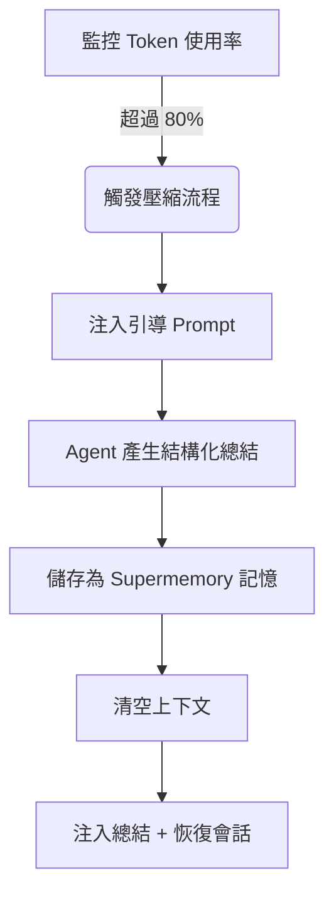

# 搶佔式壓縮原理：防止上下文遺忘

## 學完你能做什麼

學完本課，你將能夠：
1.  **理解** 為什麼長會話中 Agent 會「變笨」以及 Supermemory 如何解決這個問題。
2.  **掌握** 搶佔式壓縮（Preemptive Compaction）的觸發條件和工作流程。
3.  **配置** 適合你專案的壓縮閾值，平衡成本與記憶品質。
4.  **驗證** 壓縮是否正常工作，並查看產生的會話總結。

## 你現在的困境

在與 AI 結對程式設計時，你可能遇到過這些情況：
*   **聊著聊著「失憶」了**：在一個漫長的重構任務中，Agent 突然忘記了最開始約定的變數命名規則。
*   **被迫重開會話**：上下文視窗（Context Window）滿了，IDE 提示必須清空歷史，導致你遺失了所有已完成工作的上下文。
*   **總結品質差**：普通的自動壓縮只是簡單截斷或模糊摘要，遺失了「下一步該做什麼」的關鍵資訊。

## 什麼時候用這一招

*   當你進行**大型重構**或**複雜功能開發**，預計會話會持續很長時間時。
*   當你使用的模型上下文視窗較小（如 32k/128k），容易觸頂時。
*   當你希望 Agent 在清空上下文後，依然能精準記得「我們做到哪一步了」。

---

## 核心思路：搶佔式 vs 被動式

傳統的上下文管理往往是**被動**的：等到上下文徹底滿了（100%），才被迫丟棄舊訊息。這就像等到硬碟滿了才開始刪檔案，往往來不及整理。

Supermemory 採用**搶佔式壓縮（Preemptive Compaction）**：

1.  **提前介入**：預設在 Token 使用率达到 **80%** 時觸發，預留足夠的空間進行思考和總結。
2.  **結構化引導**：不是讓 Agent 隨便寫個摘要，而是注入特定的 Prompt，強制它按「目標-進度-待辦」的格式總結。
3.  **記憶持久化**：產生的總結不僅用於當前會話的恢復，還會被儲存為 `conversation` 類型的記憶，供未來檢索。

### 工作流程圖解



---

## 觸發機制詳解

Supermemory 會即時監控每個會話的 Token 使用情況。壓縮流程由以下三個硬性條件共同觸發：

### 1. Token 使用率閾值
預設情況下，當總 Token 數（輸入 + 輸出 + 快取）超過模型上限的 **80%** 時觸發。

*   **配置項**：`compactionThreshold`
*   **預設值**：`0.80`
*   **原始碼依據**：[`src/services/compaction.ts`](https://github.com/supermemoryai/opencode-supermemory/blob/main/src/services/compaction.ts#L11)

### 2. 最小 Token 限制
為了防止在短會話中誤觸發（例如模型上下文很大，但只聊了幾句），系統硬編碼了一個下限。只有當使用量超過 **50,000 Tokens** 時，才會考慮壓縮。

*   **常數**：`MIN_TOKENS_FOR_COMPACTION`
*   **值**：`50,000`
*   **原始碼依據**：[`src/services/compaction.ts`](https://github.com/supermemoryai/opencode-supermemory/blob/main/src/services/compaction.ts#L12)

### 3. 冷卻時間
為了防止連續觸發導致死循環，兩次壓縮之間至少間隔 **30 秒**。

*   **常數**：`COMPACTION_COOLDOWN_MS`
*   **值**：`30,000` (ms)
*   **原始碼依據**：[`src/services/compaction.ts`](https://github.com/supermemoryai/opencode-supermemory/blob/main/src/services/compaction.ts#L13)

---

## 結構化總結模板

當壓縮觸發時，Supermemory 會向 Agent 注入一個特殊的 System Prompt（`[COMPACTION CONTEXT INJECTION]`），強制要求總結包含以下 5 個部分：

| 章節 | 內容說明 | 目的 |
| :--- | :--- | :--- |
| **1. User Requests** | 使用者原始需求（原樣保留） | 防止需求漂移 |
| **2. Final Goal** | 最終要達成的目標 | 明確終局狀態 |
| **3. Work Completed** | 已完成的工作、修改的檔案 | 避免重複勞動 |
| **4. Remaining Tasks** | 剩餘待辦事項 | 明確下一步行動 |
| **5. MUST NOT Do** | 明確禁止的事項、失敗的嘗試 | 避免重蹈覆轍 |

::: details 點擊查看注入的 Prompt 原始碼
```typescript
// src/services/compaction.ts

return `[COMPACTION CONTEXT INJECTION]

When summarizing this session, you MUST include the following sections in your summary:

## 1. User Requests (As-Is)
- List all original user requests exactly as they were stated
...

## 2. Final Goal
...

## 3. Work Completed
...

## 4. Remaining Tasks
...

## 5. MUST NOT Do (Critical Constraints)
...
This context is critical for maintaining continuity after compaction.
`;
```
:::

---

## 跟我做：配置與驗證

### 第 1 步：調整壓縮閾值（可選）

如果你覺得 80% 太早或太晚，可以在 `~/.config/opencode/supermemory.jsonc` 中調整。

```jsonc
// ~/.config/opencode/supermemory.jsonc
{
  // ... 其他配置
  "compactionThreshold": 0.90
}
```

::: warning 衝突警告
如果你安裝了 `oh-my-opencode` 或其他上下文管理外掛，**必須停用** 它們自帶的壓縮功能（如 `context-window-limit-recovery`），否則會導致雙重壓縮或邏輯衝突。
:::

### 第 2 步：觀測壓縮觸發

當你在長會話中達到閾值時，留意 IDE 右下角的 Toast 提示。

**你應該看到**：

1.  **預警提示**：
    > "Preemptive Compaction: Context at 81% - compacting with Supermemory context..."

    此時系統正在產生總結。

2.  **完成提示**：
    > "Compaction Complete: Session compacted with Supermemory context. Resuming..."

    此時上下文已清空，並注入了新的總結。

### 第 3 步：驗證記憶儲存

壓縮完成後，產生的總結會自動儲存到 Supermemory。你可以透過 CLI 驗證。

**操作**：
在終端機執行以下指令查看最近的記憶：

```bash
opencode run supermemory list --scope project --limit 1
```

**你應該看到**：
一條類型為 `conversation` 的記憶，內容正是剛才的結構化總結。

```json
{
  "id": "mem_123abc",
  "content": "[Session Summary]\n## 1. User Requests\n...",
  "type": "conversation",
  "scope": "opencode_project_..."
}
```

---

## 常見問題 (FAQ)

### Q: 為什麼我的會話很長了還沒觸發壓縮？
**A**: 檢查以下幾點：
1.  **Token 總量**：是否超過了 50,000 Tokens？（短會話即使比例高也不會觸發）。
2.  **模型限制**：OpenCode 是否正確識別了當前模型的上下文上限？如果識別失敗，會回退到預設的 200k，導致比例計算偏低。
3.  **冷卻時間**：距離上次壓縮是否不足 30 秒？

### Q: 壓縮後的總結會佔用多少 Token？
**A**: 這取決於總結的詳細程度，通常在 500-2000 Tokens 之間。相比於原始的 100k+ 上下文，這是極大的節省。

### Q: 我能手動觸發壓縮嗎？
**A**: 目前版本（v1.0）不支援手動觸發，完全由演算法自動託管。

---

## 本課小結

搶佔式壓縮是 Supermemory 的「長跑秘訣」。它透過**提前介入**和**結構化總結**，將線性的對話流轉換成了精煉的記憶快照。這不僅解決了上下文溢出的問題，更重要的是，它讓 Agent 即使在「失憶」（清空上下文）後，依然能透過讀取快照，無縫銜接之前的工作。

## 下一課預告

> 下一課我們學習 **[深度配置詳解](../configuration/index.md)**。
>
> 你會學到：
> - 如何自訂記憶的儲存路徑
> - 配置搜尋結果的數量限制
> - 調整隱私過濾的規則

---

## 附錄：原始碼參考

<details>
<summary><strong>點擊展開查看原始碼位置</strong></summary>

> 更新時間：2026-01-23

| 功能 | 檔案路徑 | 行號 |
| :--- | :--- | :--- |
| 閾值常數定義 | [`src/services/compaction.ts`](https://github.com/supermemoryai/opencode-supermemory/blob/main/src/services/compaction.ts#L11-L14) | 11-14 |
| 引導 Prompt 產生 | [`src/services/compaction.ts`](https://github.com/supermemoryai/opencode-supermemory/blob/main/src/services/compaction.ts#L58-L98) | 58-98 |
| 觸發偵測邏輯 | [`src/services/compaction.ts`](https://github.com/supermemoryai/opencode-supermemory/blob/main/src/services/compaction.ts#L317-L358) | 317-358 |
| 總結儲存邏輯 | [`src/services/compaction.ts`](https://github.com/supermemoryai/opencode-supermemory/blob/main/src/services/compaction.ts#L294-L315) | 294-315 |
| 配置項定義 | [`src/config.ts`](https://github.com/supermemoryai/opencode-supermemory/blob/main/src/config.ts#L22) | 22 |

**關鍵常數**：
- `DEFAULT_THRESHOLD = 0.80`：預設觸發閾值
- `MIN_TOKENS_FOR_COMPACTION = 50_000`：最小觸發 Token 數
- `COMPACTION_COOLDOWN_MS = 30_000`：冷卻時間（毫秒）

</details>
