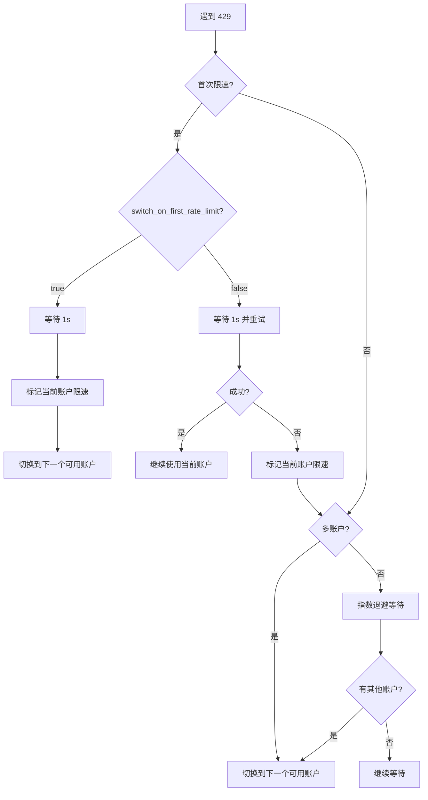

# 速率限制处理：自动重试和账户切换机制

## 学完你能做什么

理解并掌握 Antigravity Auth 的智能速率限制处理机制：
- 区分 5 种不同类型的 429 错误（配额耗尽、速率限制、容量耗尽等）
- 理解自动重试的指数退避算法
- 掌握多账户场景下的自动切换逻辑
- 配置首次限速立即切换或重试两次后切换
- 使用 Gemini 双配额池 fallback 提高可用性

不再被"所有账户都被限速，但配额还没用完"困扰。

## 你现在的困境

使用多 Google 账户时遇到：
- 经常遇到 429 速率限制，不知道该重试还是切换账户
- 不同类型 429 的等待时间差异很大，不知道该等多久
- 所有账户都被限速，但实际配额没用完，因为限速判断不准确
- Gemini 的双配额池切换时机不清楚，导致配额浪费

## 什么时候用这一招

当你：
- 配置了多个账户，但频繁遇到 429 错误
- 想优化多账户场景下的请求成功率
- 需要调整重试策略（如首次限速立即切换）
- 使用 Gemini 模型，想利用双配额池

## 核心思路

### 什么是速率限制处理

Antigravity Auth 插件在遇到 429 错误时，会自动执行以下操作：

1. **检测限速类型**：解析响应中的 `reason` 或 `message`，区分 5 种限速类型
2. **计算退避时间**：根据限速类型和失败次数，智能计算等待时间
3. **执行策略**：
   - **多账户**：优先切换到可用账户
   - **单账户**：指数退避重试
4. **记录状态**：更新账户的限速状态，供后续请求参考

::: info 为什么需要智能处理？
Google 对每个账户都有速率限制。如果简单地"遇到 429 就切换"，可能导致频繁切换，错过快速恢复的账户；如果简单地"等待重试"，又可能浪费其他可用账户的配额。智能处理需要在"切换"和"等待"之间找到最优平衡点。
:::

### 5 种速率限制类型

Antigravity Auth 会根据 API 响应中的 `reason` 字段或 `message` 内容，区分以下 5 种限速类型：

| 类型 | 原因 | 退避策略 | 典型场景 |
|--- | --- | --- | ---|
| `QUOTA_EXHAUSTED` | 配额用完（日配额或月配额） | 递增退避：1min → 5min → 30min → 120min | 日配额耗尽 |
| `RATE_LIMIT_EXCEEDED` | 请求过快（每分钟限制） | 固定 30 秒 | 短时间大量请求 |
| `MODEL_CAPACITY_EXHAUSTED` | 模型服务器容量不足 | 固定 15 秒 | 高峰时段 |
| `SERVER_ERROR` | 服务器内部错误（5xx） | 固定 20 秒 | 服务不稳定 |
| `UNKNOWN` | 未知原因 | 固定 60 秒 | 无法解析的错误 |

**退避时间计算公式**（accounts.ts:51-75）：

```typescript
// QUOTA_EXHAUSTED：递增退避（基于连续失败次数）
// 失败 1 次：1min (60_000ms)
// 失败 2 次：5min (300_000ms)
// 失败 3 次：30min (1_800_000ms)
// 失败 4+ 次：120min (7_200_000ms)

// 其他类型：固定退避
// RATE_LIMIT_EXCEEDED：30s
// MODEL_CAPACITY_EXHAUSTED：15s
// SERVER_ERROR：20s
// UNKNOWN：60s
```

### 指数退避算法

Antigravity Auth 使用**带去重的指数退避**算法：

**核心逻辑**（plugin.ts:509-567）：

```typescript
// 1. 去重窗口：2 秒内的并发 429 视为同一事件
const RATE_LIMIT_DEDUP_WINDOW_MS = 2000;

// 2. 状态重置：2 分钟无 429 后重置计数
const RATE_LIMIT_STATE_RESET_MS = 120_000;

// 3. 指数退避：baseDelay * 2^(attempt-1)，最大 60s
const expBackoff = Math.min(baseDelay * Math.pow(2, attempt - 1), 60000);
```

**为什么需要去重窗口？**

假设你有 3 个并发请求同时触发 429：
- **无去重**：每个请求计数器 +1，导致 attempt=3，退避 4s（2^2 × 1s）
- **有去重**：视为同一事件，attempt=1，退避 1s

去重窗口可以避免并发请求过度放大退避时间。

### 多账户切换逻辑

Antigravity Auth 在多账户场景下采用**优先切换，重试兜底**的策略：

**决策流程**：



**关键配置**（config/schema.ts:256-259）：

| 配置项 | 默认值 | 说明 |
|--- | --- | ---|
| `switch_on_first_rate_limit` | `true` | 首次限速是否立即切换账户（等待 1s 后） |
| `max_rate_limit_wait_seconds` | `300` | 所有账户限速时的最大等待时间（5 分钟） |

**推荐配置**：

- **多账户（2+）**：`switch_on_first_rate_limit: true`，立即切换，避免浪费配额
- **单账户**：该配置无效，自动使用指数退避重试

### Gemini 双配额池 Fallback

Gemini 模型支持两个独立的配额池：
- **Antigravity 配额池**：优先使用，但容量较小
- **Gemini CLI 配额池**：备选使用，容量较大

**Fallback 逻辑**（plugin.ts:1318-1345）：

```
1. 使用 Antigravity 配额池发起请求
2. 遇到 429 限速
3. 检查是否有其他账户的 Antigravity 配额可用
   - 有：切换账户，继续使用 Antigravity
   - 无：如果 quota_fallback=true，切换到 Gemini CLI 配额池
```

**配置选项**（config/schema.ts:179）：

```json
{
  "quota_fallback": true  // 默认 false
}
```

**示例**：

你有 2 个账户，都遇到 429：

| 状态 | quota_fallback=false | quota_fallback=true |
|--- | --- | ---|
| 账户 1（Antigravity） | 限速 | 限速 → 尝试 Gemini CLI |
| 账户 2（Antigravity） | 限速 | 限速 → 尝试 Gemini CLI |
| 结果 | 等待 5 分钟后重试 | 切换到 Gemini CLI，无需等待 |

::: tip 双配额池的优势
Gemini CLI 配额池通常更大， fallback 可以显著提高请求成功率。但注意：
- 显式使用 `:antigravity` 后缀的模型不会 fallback
- 仅当所有账户的 Antigravity 配额都用完后才 fallback
:::

### 单账户重试逻辑

如果只有一个账户，Antigravity Auth 使用**指数退避重试**：

**重试公式**（plugin.ts:1373-1375）：

```typescript
// 首次：1s
// 第 2 次：2s (1s × 2^1)
// 第 3 次：4s (1s × 2^2)
// 第 4 次：8s (1s × 2^3)
// ...
// 最大：60s
const expBackoffMs = Math.min(1000 * Math.pow(2, attempt - 1), 60000);
```

**重试流程**：

```
第 1 次：遇到 429
  ↓ 等待 1s 并重试（快速重试）
第 2 次：仍然 429
  ↓ 等待 2s 并重试
第 3 次：仍然 429
  ↓ 等待 4s 并重试
...
```

**与多账户的区别**：

| 场景 | 策略 | 等待时间 |
|--- | --- | ---|
| 单账户 | 指数退避重试 | 1s → 2s → 4s → 8s → ... → 60s |
| 多账户 | 切换账户 | 1s（首次）或 5s（第 2 次） |

## 🎒 开始前的准备

::: warning 前置检查
确保你已完成：
- [x] 多账户设置（至少 2 个 Google 账户）
- [x] 理解 [账户选择策略](/zh/NoeFabris/opencode-antigravity-auth/advanced/account-selection-strategies/)
- [x] 理解 [双配额系统](/zh/NoeFabris/opencode-antigravity-auth/platforms/dual-quota-system/)
:::

## 跟我做

### 第 1 步：启用调试日志观察速率限制

**为什么**
调试日志可以显示速率限制的详细信息，帮助你理解插件的工作原理。

**操作**

启用调试日志：

```bash
export OPENCODE_ANTIGRAVITY_DEBUG=1
```

发起请求触发速率限制：

```bash
# 发起多个并发请求（确保触发 429）
for i in {1..10}; do
  opencode run "Test $i" --model=google/antigravity-gemini-3-pro &
done
wait
```

**你应该看到**：

```
[RateLimit] 429 on Account 0 family=claude retryAfterMs=60000
  message: You have exceeded the quota for this request.
  quotaResetTime: 2026-01-23T12:00:00Z
  retryDelayMs: 60000
  reason: QUOTA_EXHAUSTED

Rate limited. Quick retry in 1s... (toast 通知)
```

**日志解读**：

- `429 on Account 0 family=claude`：账户 0 的 Claude 模型限速
- `retryAfterMs=60000`：服务器建议等待 60 秒
- `reason: QUOTA_EXHAUSTED`：配额耗尽（退避时间递增）

### 第 2 步：配置首次限速立即切换

**为什么**
如果你有多个账户，首次限速立即切换可以最大化配额利用率，避免等待。

**操作**

修改配置文件：

```bash
cat > ~/.config/opencode/antigravity.json << 'EOF'
{
  "$schema": "https://raw.githubusercontent.com/NoeFabris/opencode-antigravity-auth/main/assets/antigravity.schema.json",
  "switch_on_first_rate_limit": true
}
EOF
```

**你应该看到**：配置文件已更新。

**验证配置生效**：

发起多个请求，观察首次限速后的行为：

```bash
export OPENCODE_ANTIGRAVITY_DEBUG=1
for i in {1..5}; do
  opencode run "Test $i" --model=google/antigravity-gemini-3-pro &
done
wait
```

**你应该看到**：

```
[RateLimit] 429 on Account 0 family=gemini retryAfterMs=30000
Server at capacity. Switching account in 1s... (toast 通知)
[AccountContext] Selected account: user2@gmail.com (index: 1)
```

**关键点**：
- 首次 429 后等待 1s
- 自动切换到下一个可用账户（index: 1）
- 不再重试当前账户

### 第 3 步：禁用首次限速立即切换

**为什么**
如果希望先重试当前账户（避免频繁切换），可以禁用该选项。

**操作**

修改配置文件：

```bash
cat > ~/.config/opencode/antigravity.json << 'EOF'
{
  "$schema": "https://raw.githubusercontent.com/NoeFabris/opencode-antigravity-auth/main/assets/antigravity.schema.json",
  "switch_on_first_rate_limit": false
}
EOF
```

**你应该看到**：配置文件已更新。

**验证配置生效**：

再次发起多个请求：

```bash
export OPENCODE_ANTIGRAVITY_DEBUG=1
for i in {1..5}; do
  opencode run "Test $i" --model=google/antigravity-gemini-3-pro &
done
wait
```

**你应该看到**：

```
[RateLimit] 429 on Account 0 family=gemini retryAfterMs=30000
Rate limited. Quick retry in 1s... (toast 通知)
[RateLimit] 429 on Account 0 family=gemini retryAfterMs=30000
Rate limited again. Switching account in 5s... (toast 通知)
[AccountContext] Selected account: user2@gmail.com (index: 1)
```

**关键点**：
- 首次 429：等待 1s 并**重试当前账户**
- 第 2 次 429：等待 5s 后**切换账户**
- 如果重试成功，继续使用当前账户

### 第 4 步：启用 Gemini 双配额池 Fallback

**为什么**
Gemini 模型支持双配额池，启用 fallback 可以显著提高请求成功率。

**操作**

修改配置文件：

```bash
cat > ~/.config/opencode/antigravity.json << 'EOF'
{
  "$schema": "https://raw.githubusercontent.com/NoeFabris/opencode-antigravity-auth/main/assets/antigravity.schema.json",
  "quota_fallback": true
}
EOF
```

**你应该看到**：配置文件已更新。

**验证配置生效**：

发起 Gemini 请求（确保触发 Antigravity 配额池限速）：

```bash
export OPENCODE_ANTIGRAVITY_DEBUG=1
for i in {1..5}; do
  opencode run "Test $i" --model=google/antigravity-gemini-3-pro &
done
wait
```

**你应该看到**：

```
[RateLimit] 429 on Account 0 family=gemini retryAfterMs=30000
Antigravity quota exhausted for gemini-3-pro. Switching to Gemini CLI quota... (toast 通知)
[DEBUG] quota fallback: gemini-cli
```

**关键点**：
- 所有账户的 Antigravity 配额用完后
- 自动切换到 Gemini CLI 配额池
- 无需等待，直接重试

**强制使用 Antigravity 配额**（不 fallback）：

```bash
# 使用显式后缀 :antigravity
opencode run "Test" --model=google/antigravity-gemini-3-pro:antigravity
```

### 第 5 步：配置最大等待时间

**为什么**
如果所有账户都被限速，插件会等待最短的重置时间。你可以配置最大等待时间，避免无限等待。

**操作**

修改配置文件：

```bash
cat > ~/.config/opencode/antigravity.json << 'EOF'
{
  "$schema": "https://raw.githubusercontent.com/NoeFabris/opencode-antigravity-auth/main/assets/antigravity.schema.json",
  "max_rate_limit_wait_seconds": 60
}
EOF
```

**你应该看到**：配置文件已更新。

**验证配置生效**：

触发所有账户限速：

```bash
export OPENCODE_ANTIGRAVITY_DEBUG=1
for i in {1..20}; do
  opencode run "Test $i" --model=google/antigravity-claude-opus-4.5 &
done
wait
```

**你应该看到**：

```
[RateLimit] 429 on Account 0 family=claude retryAfterMs=60000
[RateLimit] 429 on Account 1 family=claude retryAfterMs=60000
[DEBUG] All accounts rate limited. Min wait time: 60s, max wait: 60s
Rate limited. Retrying in 60s... (toast 通知)
```

**关键点**：
- 所有账户限速时，等待最短的重置时间
- 如果最短重置时间 > `max_rate_limit_wait_seconds`，使用最大值
- 默认最大等待 300 秒（5 分钟）

## 检查点 ✅

::: tip 如何验证配置生效？
1. 查看配置文件确认配置项正确
2. 启用调试日志：`OPENCODE_ANTIGRAVITY_DEBUG=1`
3. 观察日志中的 `[RateLimit]` 事件
4. 观察切换账户行为（`AccountContext` 日志）
5. 检查 toast 通知是否按预期显示
:::

## 踩坑提醒

### ❌ 忽略去重窗口，误解退避时间

**错误行为**：
- 发起 10 个并发请求，都遇到 429
- 以为退避时间是 2^10 × 1s = 1024s
- 实际是 1s（因为去重窗口）

**正确做法**：理解 2 秒去重窗口，并发请求不会被重复计数。

### ❌ 混用 `switch_on_first_rate_limit` 和单账户

**错误行为**：
- 只有 1 个账户，却配置了 `switch_on_first_rate_limit: true`
- 以为会切换账户，实际没有其他账户可切

**正确做法**：单账户场景下该配置无效，自动使用指数退避重试。

### ❌ Gemini 显式后缀阻止 fallback

**错误行为**：
- 使用 `google/antigravity-gemini-3-pro:antigravity`
- 配置了 `quota_fallback: true`
- 但遇到 429 时不会 fallback 到 Gemini CLI

**正确做法**：显式后缀会强制使用指定配额池，如果需要 fallback，不要使用后缀。

### ❌ 所有账户限速后等待时间过长

**错误行为**：
- 配置了 `max_rate_limit_wait_seconds: 600`（10 分钟）
- 所有账户限速 60s，但等待了 10 分钟

**正确做法**：`max_rate_limit_wait_seconds` 是**最大值**，实际等待时间是最短重置时间，不会超过最大值。

## 本课小结

| 机制 | 核心特点 | 适用场景 |
|--- | --- | ---|
| **速率限制检测** | 区分 5 种类型（QUOTA_EXHAUSTED、RATE_LIMIT_EXCEEDED 等） | 所有场景 |
| **指数退避** | 失败次数越多，等待时间越长（1s → 2s → 4s → ... → 60s） | 单账户 |
| **账户切换** | 多账户优先切换，单账户退避重试 | 多账户 |
| **去重窗口** | 2 秒内的并发 429 视为同一事件 | 并发场景 |
| **双配额池 fallback** | Antigravity 限速后尝试 Gemini CLI | Gemini 模型 |

**关键配置**：

| 配置项 | 默认值 | 推荐值 | 说明 |
|--- | --- | --- | ---|
| `switch_on_first_rate_limit` | `true` | `true`（多账户） | 首次限速立即切换 |
| `quota_fallback` | `false` | `true`（Gemini） | 启用双配额池 fallback |
| `max_rate_limit_wait_seconds` | `300` | `300` | 最大等待时间（秒） |

**调试方法**：

- 启用调试日志：`OPENCODE_ANTIGRAVITY_DEBUG=1`
- 查看 `[RateLimit]` 事件：了解限速类型和退避时间
- 查看 `[AccountContext]` 日志：观察账户切换行为

## 下一课预告

> 下一课我们学习 **[会话恢复](/zh/NoeFabris/opencode-antigravity-auth/advanced/session-recovery/)**。
>
> 你会学到：
> - 如何自动恢复中断的工具调用
> - Thinking 模型的会话恢复机制
> - Synthetic tool_result 注入原理

---

## 附录：源码参考

<details>
<summary><strong>点击展开查看源码位置</strong></summary>

> 更新时间：2026-01-23

| 功能 | 文件路径 | 行号 |
|--- | --- | ---|
| 速率限制类型定义 | [`src/plugin/accounts.ts`](https://github.com/NoeFabris/opencode-antigravity-auth/blob/main/src/plugin/accounts.ts#L10-L20) | 10-20 |
| 解析限速原因 | [`src/plugin/accounts.ts`](https://github.com/NoeFabris/opencode-antigravity-auth/blob/main/src/plugin/accounts.ts#L29-L49) | 29-49 |
| 计算退避时间 | [`src/plugin/accounts.ts`](https://github.com/NoeFabris/opencode-antigravity-auth/blob/main/src/plugin/accounts.ts#L51-L75) | 51-75 |
| 指数退避算法 | [`src/plugin.ts`](https://github.com/NoeFabris/opencode-antigravity-auth/blob/main/src/plugin.ts#L532-L567) | 532-567 |
| 标记账户限速 | [`src/plugin/accounts.ts`](https://github.com/NoeFabris/opencode-antigravity-auth/blob/main/src/plugin/accounts.ts#L434-L461) | 434-461 |
| 检查账户是否限速 | [`src/plugin/accounts.ts`](https://github.com/NoeFabris/opencode-antigravity-auth/blob/main/src/plugin/accounts.ts#L134-L152) | 134-152 |
| 429 错误处理 | [`src/plugin.ts`](https://github.com/NoeFabris/opencode-antigravity-auth/blob/main/src/plugin.ts#L1260-L1396) | 1260-1396 |
| Gemini 双配额池 fallback | [`src/plugin.ts`](https://github.com/NoeFabris/opencode-antigravity-auth/blob/main/src/plugin.ts#L1318-L1345) | 1318-1345 |
| 速率限制日志 | [`src/plugin/debug.ts`](https://github.com/NoeFabris/opencode-antigravity-auth/blob/main/src/plugin/debug.ts#L354-L396) | 354-396 |
| 配置 Schema | [`src/plugin/config/schema.ts`](https://github.com/NoeFabris/opencode-antigravity-auth/blob/main/src/plugin/config/schema.ts#L256-L221) | 256-221 |

**关键常量**：

- `QUOTA_EXHAUSTED_BACKOFFS = [60_000, 300_000, 1_800_000, 7_200_000]`：配额耗尽递增退避时间（accounts.ts:22）
- `RATE_LIMIT_EXCEEDED_BACKOFF = 30_000`：速率限制固定退避 30 秒（accounts.ts:23）
- `MODEL_CAPACITY_EXHAUSTED_BACKOFF = 15_000`：容量耗尽固定退避 15 秒（accounts.ts:24）
- `SERVER_ERROR_BACKOFF = 20_000`：服务器错误固定退避 20 秒（accounts.ts:25）
- `RATE_LIMIT_DEDUP_WINDOW_MS = 2000`：去重窗口 2 秒（plugin.ts:509）
- `RATE_LIMIT_STATE_RESET_MS = 120_000`：状态重置 2 分钟（plugin.ts:510）
- `FIRST_RETRY_DELAY_MS = 1000`：首次快速重试 1 秒（plugin.ts:1304）

**关键函数**：

- `parseRateLimitReason(reason?, message?)`：解析限速原因（accounts.ts:29）
- `calculateBackoffMs(reason, consecutiveFailures, retryAfterMs?)`：计算退避时间（accounts.ts:51）
- `markRateLimitedWithReason(account, family, headerStyle, model, reason, retryAfterMs?)`：标记账户限速（accounts.ts:445）
- `isRateLimitedForHeaderStyle(account, family, headerStyle, model?)`：检查账户是否限速（accounts.ts:536）
- `getRateLimitBackoff(accountIndex, quotaKey, serverRetryAfterMs)`：获取去重后的退避时间（plugin.ts:532）
- `resetRateLimitState(accountIndex, quotaKey)`：重置限速状态（plugin.ts:573）

</details>
