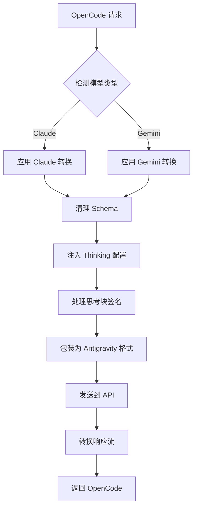

# 请求转换机制：兼容多模型协议

## 学完你能做什么

- 理解插件如何在 OpenCode 和 Antigravity API 之间转换请求格式
- 掌握 Claude 和 Gemini 模型的协议差异及转换规则
- 排查 Schema 不兼容导致的 400 错误
- 优化 Thinking 配置以获得最佳性能

## 你现在的困境

你可能遇到这些问题：

- ❌ MCP 服务器返回 `400 Unknown name 'parameters'` 错误
- ❌ 使用 Gemini 模型时提示 `400 Unknown name 'const'`
- ❌ Thinking 模型的思考块显示格式不正确
- ❌ 工具调用失败，提示签名验证错误
- ❌ 不理解为什么插件能同时支持 Claude 和 Gemini

## 什么时候用这一招

当你需要：

| 场景 | 为什么需要理解转换机制 |
|--- | ---|
| 开发自定义 MCP 服务器 | 确保工具 Schema 兼容 Antigravity API |
| 排查 400/500 错误 | 判断是 Schema 问题还是转换逻辑问题 |
| 优化 Thinking 性能 | 理解思考块签名和缓存机制 |
| 调试工具调用失败 | 检查工具 ID 分配和参数签名 |

::: warning 前置检查
开始本教程前，请确保你已经：
- ✅ 安装了 opencode-antigravity-auth 插件
- ✅ 了解可用模型及其变体
- ✅ 理解 Thinking 模型的基本概念

[模型列表教程](../../platforms/available-models/) | [Thinking 模型教程](../../platforms/thinking-models/)
:::

## 核心思路

请求转换是插件的核心机制，它做三件事：

1. **拦截 OpenCode 请求** — 拦截 `fetch(generativeLanguage.googleapis.com)` 调用
2. **应用模型转换** — 根据模型类型（Claude/Gemini）转换格式
3. **包装并发送** — 包装为 Antigravity 格式并调用 API
4. **转换响应** — 将响应转换回 OpenCode 可识别的格式

**转换流程图**：



**关键转换点**：

| 转换类型 | 目的 | 源码位置 |
|--- | --- | ---|
| Schema 清理 | 移除 Antigravity API 不支持的字段 | `src/plugin/request-helpers.ts` |
| Thinking 配置 | 根据模型族注入正确的思考配置 | `src/plugin/transform/claude.ts`, `src/plugin/transform/gemini.ts` |
| 思考块处理 | 剥离历史思考块并注入签名 | `src/plugin/request.ts` |
| 响应流转换 | 将 SSE 事件转换为 OpenCode 格式 | `src/plugin/core/streaming.ts` |

## 跟我做

### 第 1 步：理解 Claude 转换规则

**为什么**
Claude 模型使用不同的协议格式（snake_case、VALIDATED 模式），需要特殊处理。

**关键转换规则**

| 原始格式 | 转换后格式 | 说明 |
|--- | --- | ---|
| `toolConfig.functionCallingConfig.mode` | `"VALIDATED"` | 强制启用工具调用验证 |
| `thinkingConfig.includeThoughts` | `include_thoughts` | snake_case 格式 |
| `thinkingConfig.thinkingBudget` | `thinking_budget` | snake_case 格式 |
| `maxOutputTokens` | 自动调整至 64,000 | Thinking 模型需要更大输出空间 |

**代码位置**：[`src/plugin/transform/claude.ts:43-56`](https://github.com/NoeFabris/opencode-antigravity-auth/blob/main/src/plugin/transform/claude.ts#L43-L56)

**示例**

```typescript
// 转换前（OpenCode 格式）
{
  "toolConfig": {
    "functionCallingConfig": {
      "mode": "AUTO"
    }
  },
  "thinkingConfig": {
    "includeThoughts": true,
    "thinkingBudget": 32000
  }
}

// 转换后（Antigravity 格式）
{
  "toolConfig": {
    "functionCallingConfig": {
      "mode": "VALIDATED"  // 强制 VALIDATED
    }
  },
  "thinkingConfig": {
    "include_thoughts": true,  // snake_case
    "thinking_budget": 32000   // snake_case
  },
  "generationConfig": {
    "maxOutputTokens": 64000   // Thinking 模型自动调整
  }
}
```

**你应该看到**：
- Claude 模型的所有转换都遵循 snake_case 命名
- `maxOutputTokens` 会自动调整为足够大的值（`CLAUDE_THINKING_MAX_OUTPUT_TOKENS = 64,000`）

### 第 2 步：理解 Gemini 转换规则

**为什么**
Gemini 模型使用 camelCase 格式，且对 JSON Schema 有严格要求（type 大写）。

**关键转换规则**

| 原始格式 | 转换后格式 | 说明 |
|--- | --- | ---|
| JSON Schema `type: "object"` | `type: "OBJECT"` | 类型必须大写 |
| `additionalProperties: false` | 移除 | Gemini API 不支持 |
| `$ref: "#/$defs/Foo"` | 转换为 `description: "See: Foo"` | 引用转换为描述 |
| `const: "foo"` | `enum: ["foo"]` | const 转换为 enum |
| `enum: ["a", "b"]` | 添加描述提示 `(Allowed: a, b)` | 2-10 项枚举自动添加提示 |

**代码位置**：[`src/plugin/transform/gemini.ts:52-124`](https://github.com/NoeFabris/opencode-antigravity-auth/blob/main/src/plugin/transform/gemini.ts#L52-L124)

**示例**

```json
// 转换前（OpenCode 格式）
{
  "parameters": {
    "type": "object",
    "properties": {
      "status": {
        "type": "string",
        "const": "active",
        "enum": ["active", "inactive"]
      }
    }
  }
}

// 转换后（Gemini 格式）
{
  "parameters": {
    "type": "OBJECT",  // 大写
    "properties": {
      "status": {
        "type": "STRING",  // 大写
        "enum": ["active", "inactive"],  // const 被移除
        "description": "(Allowed: active, inactive)"  // 自动添加提示
      }
    }
  }
}
```

**你应该看到**：
- Gemini Schema 的所有类型都转为大写（`STRING`、`OBJECT`、`ARRAY`）
- `const` 字段被移除并转换为 `enum`
- 不支持的字段（`$ref`、`additionalProperties`）被移除

### 第 3 步：理解 Schema 清理流程

**为什么**
Antigravity API 使用严格的 protobuf-backed 验证，不支持标准 JSON Schema 的所有字段。

**四阶段清理流程**

1. **Phase 1a：转换 $ref 为描述**
   - `$ref: "#/$defs/Foo"` → `{ description: "See: Foo" }`

2. **Phase 1b：转换 const 为 enum**
   - `const: "foo"` → `enum: ["foo"]`

3. **Phase 1c：添加枚举提示**
   - `enum: ["a", "b"]` → 添加 `(Allowed: a, b)` 到描述

4. **Phase 1d：移除不支持的字段**
   - 删除：`$schema`、`$defs`、`additionalProperties`、`pattern`、`minLength`、`maxLength` 等

**代码位置**：[`src/plugin/request-helpers.ts:20-280`](https://github.com/NoeFabris/opencode-antigravity-auth/blob/main/src/plugin/request-helpers.ts#L20-L280)

**不受支持的字段列表**：

| 字段 | 为什么不支持 | 替代方案 |
|--- | --- | ---|
| `$ref` | 不允许引用 | 转换为描述提示 |
| `const` | 不允许常量 | 使用 `enum` |
| `additionalProperties` | 不验证额外属性 | 在描述中注明 |
| `$schema`、`$defs` | 不使用 JSON Draft | 移除 |
| `pattern`、`minLength`、`maxLength` | 字符串约束由服务端处理 | 移除 |
| `minItems`、`maxItems` | 数组约束由服务端处理 | 移除 |

**你应该看到**：
- MCP 服务器的 Schema 被清理为 Antigravity 兼容的格式
- 400 错误减少，错误信息更清晰

### 第 4 步：理解思考块处理机制

**为什么**
Claude 和 Gemini 3 模型需要稳定的思考块签名，否则会导致签名验证错误。

**三步处理流程**

1. **剥离历史思考块**
   - 递归移除所有历史 `thinking` 块（避免签名冲突）
   - 使用缓存验证签名有效性

2. **注入新的思考签名**
   - 为新的思考块生成稳定的签名
   - 缓存签名用于多轮对话

3. **确保思考块顺序**
   - Claude：thinking 必须在 tool_use 之前
   - Gemini：thinking 可以出现在任何位置

**代码位置**：
- [`src/plugin/request.ts:711-724`](https://github.com/NoeFabris/opencode-antigravity-auth/blob/main/src/plugin/request.ts#L711-L724)

**思考块签名示例**：

```typescript
// Claude Thinking 块格式
{
  "type": "thinking",
  "text": "需要分析用户需求...",
  "signature": "sig-abc123",  // 插件注入的签名
  "cache_control": { "type": "ephemeral" }  // 缓存控制
}

// 历史思考块（被剥离）
{
  "type": "thinking",
  "text": "旧的分析...",  // 被移除
  "signature": "sig-old456"  // 签名失效
}
```

**你应该看到**：
- 多轮对话中，历史思考块不会重复显示
- 新思考块带有正确的签名
- 工具调用前有完整的思考过程

### 第 5 步：理解响应流式转换

**为什么**
Antigravity API 返回 SSE（Server-Sent Events）流，需要转换为 OpenCode 可识别的格式。

**关键转换规则**

| 原始格式 | 转换后格式 | 说明 |
|--- | --- | ---|
| `thought: true` | `type: "reasoning"` | 思考块格式转换 |
| `text` | 保持不变 | 文本内容 |
| `tool_use` | 保持不变 | 工具调用 |
| `tool_result` | 保持不变 | 工具结果 |

**代码位置**：[`src/plugin/core/streaming.ts`](https://github.com/NoeFabris/opencode-antigravity-auth/blob/main/src/plugin/core/streaming.ts)

**SSE 事件示例**：

```
// Antigravity API 返回
data: {"type": "thinking", "text": "分析中...", "thought": true}

// 转换后
data: {"type": "reasoning", "text": "分析中..."}

// 文本事件
data: {"type": "text", "text": "你好"}

// 工具调用事件
data: {"type": "tool_use", "id": "tool-123", "name": "my_function"}
```

**你应该看到**：
- 思考块在界面中正确显示为 `reasoning` 类型
- 流式响应无延迟，逐行转换
- 工具调用事件格式正确

## 检查点 ✅

完成上述步骤后，你应该能回答以下问题：

- [ ] Claude 模型的 `toolConfig.mode` 会被设置为什么？
- [ ] Gemini Schema 的 `type: "string"` 会被转换为什么？
- [ ] 为什么要剥离历史思考块？
- [ ] `const` 字段会被转换为什么格式？
- [ ] 思考块的签名有什么作用？

## 踩坑提醒

### 坑 1：MCP Schema 包含 $ref 导致 400 错误

**错误信息**：`400 Unknown name 'parameters'`

**原因**：MCP 服务器使用了 JSON Schema 的 `$ref` 引用，Antigravity API 不支持。

**解决方案**：
- 检查 MCP 服务器的 Schema 定义
- 移除 `$ref`，直接展开对象结构
- 或修改 MCP 服务器代码

**示例**：

```json
// ❌ 错误：使用 $ref
{
  "properties": {
    "data": { "$ref": "#/$defs/DataModel" }
  },
  "$defs": {
    "DataModel": { "type": "string" }
  }
}

// ✅ 正确：直接展开
{
  "properties": {
    "data": { "type": "string" }
  }
}
```

### 坑 2：const 字段导致 Gemini 模型 400 错误

**错误信息**：`400 Unknown name 'const'`

**原因**：Antigravity API 的 Gemini 端点不支持 `const` 字段。

**解决方案**：
- 手动将 `const` 转换为 `enum`
- 或依赖插件的自动转换（已实现）

**示例**：

```json
// ❌ 错误：使用 const
{
  "properties": {
    "status": { "type": "string", "const": "active" }
  }
}

// ✅ 正确：使用 enum
{
  "properties": {
    "status": { "type": "string", "enum": ["active"] }
  }
}
```

### 坑 3：Thinking 模型显示乱码

**错误信息**：思考块显示为 `[object Object]` 或格式不正确

**原因**：响应转换逻辑有 bug，或签名缓存失效。

**解决方案**：
1. 检查调试日志：`opencode --debug`
2. 清除签名缓存：删除 `~/.config/opencode/antigravity-accounts.json` 中的缓存字段
3. 重启 OpenCode

### 坑 4：工具调用失败，提示签名错误

**错误信息**：`tool_result_missing` 或签名验证失败

**原因**：
- 思考块顺序错误（thinking 必须在 tool_use 之前）
- 签名缓存不一致
- 工具 ID 分配错误

**解决方案**：
- 插件会自动重试（会话恢复机制）
- 启用调试模式查看详细错误
- 检查工具定义是否正确

## 本课小结

请求转换机制的核心要点：

1. **模型族决定转换规则** — Claude（snake_case、VALIDATED）vs Gemini（camelCase、Schema 大写）
2. **Schema 清理是必须的** — 移除 `$ref`、`const`、`additionalProperties` 等不支持的字段
3. **思考块签名是关键** — 稳定的签名确保多轮对话的一致性
4. **响应流式转换** — 将 SSE 事件实时转换为 OpenCode 格式

**关键源码位置**：
- 主请求转换：[`src/plugin/request.ts:585`](https://github.com/NoeFabris/opencode-antigravity-auth/blob/main/src/plugin/request.ts#L585)
- Claude 转换：[`src/plugin/transform/claude.ts`](https://github.com/NoeFabris/opencode-antigravity-auth/blob/main/src/plugin/transform/claude.ts)
- Gemini 转换：[`src/plugin/transform/gemini.ts`](https://github.com/NoeFabris/opencode-antigravity-auth/blob/main/src/plugin/transform/gemini.ts)
- Schema 清理：[`src/plugin/request-helpers.ts`](https://github.com/NoeFabris/opencode-antigravity-auth/blob/main/src/plugin/request-helpers.ts)
- 流式转换：[`src/plugin/core/streaming.ts`](https://github.com/NoeFabris/opencode-antigravity-auth/blob/main/src/plugin/core/streaming.ts)

## 下一课预告

> 下一课我们学习 **[会话恢复机制](../session-recovery/)**。
>
> 你会学到：
> - 会话恢复的工作原理
> - 如何自动处理工具调用失败
> - 如何修复损坏的思考块顺序

---

## 附录：源码参考

<details>
<summary><strong>点击展开查看源码位置</strong></summary>

> 更新时间：2026-01-23

| 功能 | 文件路径 | 行号 |
|--- | --- | ---|
| 主请求转换入口 | [`src/plugin/request.ts`](https://github.com/NoeFabris/opencode-antigravity-auth/blob/main/src/plugin/request.ts#L585) | 585-1443 |
| 响应转换入口 | [`src/plugin/request.ts`](https://github.com/NoeFabris/opencode-antigravity-auth/blob/main/src/plugin/request.ts#L1445) | 1445-1663 |
| Claude 模型检测 | [`src/plugin/transform/claude.ts`](https://github.com/NoeFabris/opencode-antigravity-auth/blob/main/src/plugin/transform/claude.ts#L27) | 27-29 |
| Claude Thinking 配置 | [`src/plugin/transform/claude.ts`](https://github.com/NoeFabris/opencode-antigravity-auth/blob/main/src/plugin/transform/claude.ts#L62) | 62-72 |
| Claude Tool 配置 | [`src/plugin/transform/claude.ts`](https://github.com/NoeFabris/opencode-antigravity-auth/blob/main/src/plugin/transform/claude.ts#L43) | 43-57 |
| Gemini 模型检测 | [`src/plugin/transform/gemini.ts`](https://github.com/NoeFabris/opencode-antigravity-auth/blob/main/src/plugin/transform/gemini.ts#L129) | 129-132 |
| Gemini 3 Thinking 配置 | [`src/plugin/transform/gemini.ts`](https://github.com/NoeFabris/opencode-antigravity-auth/blob/main/src/plugin/transform/gemini.ts) | 查找 `buildGemini3ThinkingConfig` |
| Gemini Schema 转换 | [`src/plugin/transform/gemini.ts`](https://github.com/NoeFabris/opencode-antigravity-auth/blob/main/src/plugin/transform/gemini.ts#L52) | 52-124 |
|--- | --- | ---|
|--- | --- | ---|
|--- | --- | ---|
| 思考块剥离 | [`src/plugin/request-helpers.ts`](https://github.com/NoeFabris/opencode-antigravity-auth/blob/main/src/plugin/request-helpers.ts) | 查找 `deepFilterThinkingBlocks` |
| 思考块签名注入 | [`src/plugin/request.ts`](https://github.com/NoeFabris/opencode-antigravity-auth/blob/main/src/plugin/request.ts#L715) | 715-720 |
| 流式响应转换 | [`src/plugin/core/streaming.ts`](https://github.com/NoeFabris/opencode-antigravity-auth/blob/main/src/plugin/core/streaming.ts) | 全文 |

**关键常量**：
- `CLAUDE_THINKING_MAX_OUTPUT_TOKENS = 64_000`（[`src/plugin/transform/claude.ts:18`](https://github.com/NoeFabris/opencode-antigravity-auth/blob/main/src/plugin/transform/claude.ts#L18)）：Claude Thinking 模型的最大输出 token 限制
- `UNSUPPORTED_SCHEMA_FIELDS`（[`src/plugin/transform/gemini.ts:27`](https://github.com/NoeFabris/opencode-antigravity-auth/blob/main/src/plugin/transform/gemini.ts#L27)）：Gemini API 不支持的 Schema 字段集合

**关键函数**：
- `prepareAntigravityRequest()`（[`src/plugin/request.ts:585`](https://github.com/NoeFabris/opencode-antigravity-auth/blob/main/src/plugin/request.ts#L585)）：准备 Antigravity API 请求的主函数
- `transformAntigravityResponse()`（[`src/plugin/request.ts:1445`](https://github.com/NoeFabris/opencode-antigravity-auth/blob/main/src/plugin/request.ts#L1445)）：转换 Antigravity API 响应的主函数
- `toGeminiSchema()`（[`src/plugin/transform/gemini.ts:52`](https://github.com/NoeFabris/opencode-antigravity-auth/blob/main/src/plugin/transform/gemini.ts#L52)）：将 JSON Schema 转换为 Gemini 兼容格式
- `cleanJSONSchemaForAntigravity()`（[`src/plugin/request-helpers.ts`](https://github.com/NoeFabris/opencode-antigravity-auth/blob/main/src/plugin/request-helpers.ts)）：四阶段 Schema 清理
- `createStreamingTransformer()`（[`src/plugin/core/streaming.ts`](https://github.com/NoeFabris/opencode-antigravity-auth/blob/main/src/plugin/core/streaming.ts)）：创建 SSE 流式转换器

</details>
