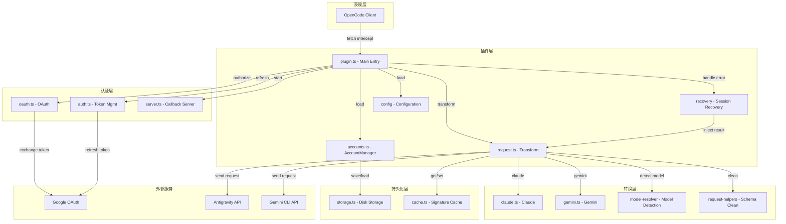
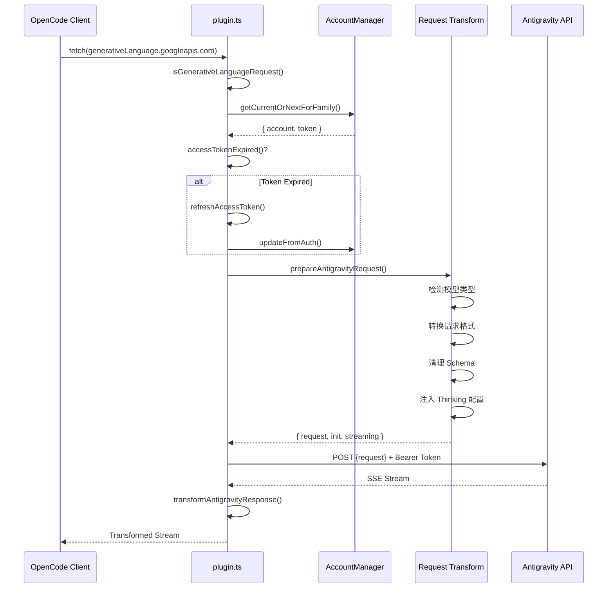
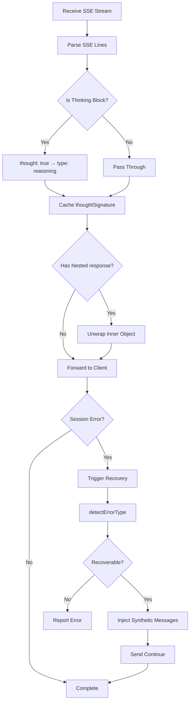
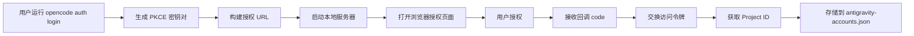

# 插件架构概览：理解 OpenCode Antigravity Auth 的内部设计

## 学完你能做什么

本课程将带你深入理解 Antigravity Auth 插件的架构设计和内部工作原理。完成学习后，你将能够：

- 理解插件的模块结构和各模块的职责
- 掌握请求从 OpenCode 到 Antigravity API 的完整处理流程
- 了解多账户管理的负载均衡机制
- 理解会话恢复的工作原理
- 掌握请求格式转换的技术细节

## 插件的核心价值

Antigravity Auth 插件的核心作用是在 OpenCode 和 Antigravity API 之间架设一座「翻译桥」：

1. **协议转换** - 将 OpenCode 的请求格式转换为 Antigravity API 要求的格式
2. **认证管理** - 通过 Google OAuth 2.0 PKCE 安全获取和刷新访问令牌
3. **负载均衡** - 多账户池化，自动轮换避免速率限制
4. **错误恢复** - 自动检测和修复会话中断问题

::: info 为什么需要架构理解？
了解插件架构能帮助你：
- 快速定位问题所在模块
- 理解配置项的作用范围
- 优化多账户使用策略
- 参与插件开发和调试
:::

## 模块结构总览

插件采用分层架构，各模块职责清晰：



### 各模块职责

| 模块 | 文件 | 职责 |
|--- | --- | ---|
| **主入口** | `plugin.ts` | fetch 拦截器、插件初始化、事件处理 |
| **账户管理** | `accounts.ts` | 多账户池、负载均衡策略、速率限制追踪 |
| **请求转换** | `request.ts` | 请求格式转换、响应流式处理 |
| **模型转换** | `transform/` | Claude/Gemini 特定转换逻辑 |
| **OAuth 认证** | `antigravity/oauth.ts` | PKCE 认证流程、令牌交换 |
| **会话恢复** | `recovery/` | 错误检测、自动修复中断会话 |
| **配置管理** | `config/` | 配置加载、Schema 验证 |
| **存储层** | `storage.ts` | 账户持久化（JSON 文件） |
| **缓存层** | `cache.ts` | 签名缓存、减少重复计算 |
| **调试日志** | `debug.ts` | 结构化日志、故障排查 |

## 请求处理流程

当一个模型请求从 OpenCode 发出时，插件会经历完整的处理链路：



### 步骤详解

**第 1 步：请求拦截**
- 插件通过 `fetch` 拦截器捕获所有对 `generativelanguage.googleapis.com` 的请求
- 使用 `isGenerativeLanguageRequest()` 判断是否为 Antigravity 相关请求
- 非目标请求直接透传，避免影响其他功能

**第 2 步：账户选择**
- 从账户池中选择可用账户（根据配置的策略：sticky/round-robin/hybrid）
- 检查令牌是否过期，过期则自动刷新
- 应用 PID 偏移（如果启用），确保多代理场景下账户分布均匀

**第 3 步：请求转换** (`request.ts`)
- **模型检测**：识别是 Claude 还是 Gemini 模型
- **Thinking 处理**：
  - Claude：剥离所有历史思考块，避免签名冲突
  - Gemini：添加 `thinkingConfig` 配置
- **Tool 转换**：将 OpenCode tools 转换为 `functionDeclarations` 格式
- **Schema 清理**：移除不支持的 JSON Schema 字段（`const`, `$ref`, `$defs` 等）
- **请求包装**：封装为 `{ project, model, request: {...} }` 格式

**第 4 步：发送请求**
- 添加 Antigravity 专用 headers（User-Agent, Client-Metadata）
- 使用 Bearer Token 认证
- 支持 endpoint fallback（daily → autopush → prod）

**第 5 步：响应转换**
- SSE 流式接收，逐行转换
- 将 `thought: true` 转换为 `type: "reasoning"`
- 缓存 thinking 签名用于后续请求
- 展开内层 `response` 对象，保持格式一致性

## 响应处理流程

响应处理主要涉及流式转换和会话恢复：



### 关键处理机制

**1. 思考块转换**

Antigravity API 返回的思考块格式为：
```json
{ "thought": true, "text": "思考内容" }
```

插件将其转换为 OpenCode 兼容格式：
```json
{ "type": "reasoning", "reasoning": "思考内容" }
```

**2. 签名缓存**

Claude 和 Gemini 3 模型在多轮对话中需要匹配思考块签名：
- 从响应中提取 `thoughtSignature`
- 使用 `cacheSignature()` 存储到内存和磁盘
- 下次请求时通过 `getCachedSignature()` 获取并注入

::: tip 为什么需要签名缓存？
Claude 和 Gemini 3 API 要求工具调用前的思考块必须有正确的签名。缓存签名可以：
- 避免签名错误导致的请求失败
- 减少重复生成相同思考内容
- 提升多轮对话的连续性
:::

**3. 会话恢复**

当检测到会话错误时：
1. 通过 `session.error` 事件捕获错误
2. 调用 `detectErrorType()` 判断是否可恢复
3. 对于 `tool_result_missing` 错误：
   - 提取失败的 `tool_use` IDs
   - 注入 synthetic `tool_result` 消息
   - 自动发送 "continue"（如果启用）
4. 对于思考块顺序错误：
   - 分析对话状态
   - 关闭损坏的 turn
   - 启动新 turn 让模型重新生成

## 核心机制详解

### OAuth 认证机制

插件使用 OAuth 2.0 with PKCE（Proof Key for Code Exchange）流程：



**PKCE 安全性**：
- 生成随机的 `code_verifier` 和 `code_challenge`
- 授权 URL 包含 `code_challenge`，防止中间人攻击
- 令牌交换时验证 `code_verifier`，确保请求来自同一客户端

**令牌管理**：
- Access Token：默认 1 小时过期，过期前 30 分钟自动刷新
- Refresh Token：长期有效，用于获取新的 Access Token
- 持久化到 `~/.config/opencode/antigravity-accounts.json`

### 多账户管理机制

多账户管理是插件的核心特性之一，包含以下几个关键组件：

**1. 账户池结构**

```typescript
interface AccountPool {
  version: 3;
  accounts: Account[];
  activeIndex: number;
  activeIndexByFamily: {
    claude: number;
    gemini: number;
  };
}
```

**2. 账户选择策略**

| 策略 | 描述 | 适用场景 |
|--- | --- | ---|
| **sticky** | 保持当前账户直到速率限制 | 单会话使用，保留提示词缓存 |
| **round-robin** | 每次请求轮换到下一个账户 | 多会话并行，最大化吞吐量 |
| **hybrid** | 健康评分 + Token bucket + LRU 综合决策 | 默认策略，平衡性能和可靠性 |

**3. 速率限制追踪**

每个账户按模型族独立追踪：
- `claude`：Claude 模型配额
- `gemini-antigravity`：Gemini Antigravity 配额
- `gemini-cli`：Gemini CLI 配额

速率限制状态包含：
- `rateLimitResetTimes`：各配额的重置时间
- `cooldownEndAt`：账户冷却结束时间
- `consecutiveFailures`：连续失败次数

**4. 双配额池（Gemini 专用）**

Gemini 模型支持两个独立的配额池：
- **Antigravity 配额**：日常沙盒环境
- **Gemini CLI 配额**：生产环境

通过 `quota_fallback` 配置：
- 优先使用首选配额（由模型后缀决定）
- 首选配额耗尽后，尝试备用配额
- 双池都耗尽时，切换到下一个账户

**5. PID 偏移优化**

启用 `pid_offset_enabled` 后：
- 不同进程（PID）的代理从不同账户开始
- 避免所有代理竞争同一账户
- 适用于多代理并行场景

### 请求转换机制

请求转换是插件最复杂的部分，需要处理不同模型的协议差异：

**Claude 模型转换要点**：

1. **思考块处理**
   ```typescript
   // 剥离所有历史思考块（避免签名冲突）
   const filteredContents = deepFilterThinkingBlocks(contents);

   // 构建新的 thinkingConfig
   const thinkingConfig = {
     budgetTokens: variantThinkingConfig?.budget || DEFAULT_THINKING_BUDGET,
   };
   ```

2. **Tool Schema 清理**
   - 白名单保留：`type`, `properties`, `required`, `description`, `enum`, `items`
   - 移除字段：`const`, `$ref`, `$defs`, `default`, `examples`, `additionalProperties`, `$schema`, `title`
   - 特殊转换：`const: "value"` → `enum: ["value"]`

3. **工具注入参数签名**
   ```typescript
   injectParameterSignatures(tool, signature) {
     tool.description += `\n\nParameters: ${signature}`;
   }
   ```

**Gemini 模型转换要点**：

1. **Thinking 配置**
   ```typescript
   // Gemini 3 Pro/Flash
   if (isGemini3Model(model)) {
     request.thinkingConfig = {
       thinkingLevel: "high" | "medium" | "low" | "minimal",
     };
   }

   // Gemini 2.5
   else if (isGemini2Model(model)) {
     request.thinkingConfig = {
       thinkingLevel: "high" | "medium" | "low",
     };
   }
   ```

2. **Google Search Grounding**
   ```typescript
   if (webSearchConfig) {
     request.generationConfig = {
       ...request.generationConfig,
       dynamicRetrievalConfig: {
         mode: webSearchConfig.mode, // "auto" | "off"
         dynamicRetrievalConfig: {
           scoreThreshold: webSearchConfig.threshold, // 0.0 - 1.0
         },
       },
     };
   }
   ```

3. **图片生成配置**
   ```typescript
   if (isImageGenerationModel(model)) {
     request.generationConfig = {
       ...request.generationConfig,
       responseModalities: ["IMAGE", "TEXT"],
     };
   }
   ```

### 会话恢复机制

会话恢复机制确保对话在意外中断后能够继续：

**1. 错误检测**

```typescript
function detectErrorType(error: unknown): RecoverableError | null {
  if (errorString.includes("tool_use ids were found without tool_result")) {
    return { type: "tool_result_missing" };
  }
  if (errorString.includes("Expected thinking but found text")) {
    return { type: "thinking_order_error" };
  }
  return null;
}
```

**2. Turn 边界检测**

```typescript
// Turn 边界 = 用户消息后第一个 assistant 消息
function analyzeConversationState(messages: Message[]): ConversationState {
  const lastUserMessage = findLastMessageByRole(messages, "user");
  const firstAssistantAfterUser = messages.find(m =>
    m.role === "assistant" && m.timestamp > lastUserMessage.timestamp
  );

  return {
    isTurnStart: true,
    turnAssistantMessage: firstAssistantAfterUser,
  };
}
```

**3. Synthetic 消息注入**

```typescript
// 注入 synthetic tool_result
function createSyntheticErrorResponse(toolUseIds: string[]): Message[] {
  return toolUseIds.map(id => ({
    type: "tool_result",
    tool_use_id: id,
    content: "Operation cancelled",
    isSynthetic: true,
  }));
}

// 关闭损坏的 turn
function closeToolLoopForThinking(sessionId: string): Message[] {
  return [
    {
      type: "text",
      text: "[Conversation turn closed due to error]",
      isSynthetic: true,
    },
  ];
}
```

**4. Auto-Resume**

启用 `auto_resume` 后，恢复流程会自动发送继续指令：
```typescript
await client.session.prompt({
  path: { id: sessionID },
  body: { parts: [{ type: "text", text: config.resume_text }] },
  query: { directory },
});
```

## 本课小结

本课程深入解析了 Antigravity Auth 插件的架构设计：

**核心架构**：
- 分层模块设计，职责清晰
- 插件层、认证层、转换层、持久化层各司其职
- 通过 `plugin.ts` 作为统一入口协调各模块

**请求流程**：
- 拦截 → 账户选择 → 令牌刷新 → 请求转换 → 发送请求 → 响应转换
- 每个步骤都有详细的错误处理和重试机制

**关键机制**：
- **OAuth 2.0 PKCE**：安全认证流程
- **多账户管理**：负载均衡、速率限制追踪、双配额池
- **请求转换**：协议兼容、Schema 清理、Thinking 处理
- **会话恢复**：自动检测错误、注入 synthetic 消息、Auto-Resume

理解这些机制将帮助你更好地使用和优化插件配置，以及参与插件的开发和调试。

## 下一课预告

> 下一课我们学习 **[Antigravity API 内部规范](../api-spec/)**。
>
> 你将学到：
> - Antigravity API 的请求和响应格式
> - 各端点的功能和参数
> - 错误码和状态码含义
> - 高级功能和实验性特性

---

## 附录：源码参考

<details>
<summary><strong>点击展开查看源码位置</strong></summary>

> 更新时间：2026-01-23

| 功能 | 文件路径 | 行号 |
|--- | --- | ---|
| 插件主入口、fetch 拦截器 | [`src/plugin.ts`](https://github.com/NoeFabris/opencode-antigravity-auth/blob/main/src/plugin.ts) | 654-1334 |
| 账户管理器、负载均衡 | [`src/plugin/accounts.ts`](https://github.com/NoeFabris/opencode-antigravity-auth/blob/main/src/plugin/accounts.ts) | 1-715 |
| 请求转换、响应流式 | [`src/plugin/request.ts`](https://github.com/NoeFabris/opencode-antigravity-auth/blob/main/src/plugin/request.ts) | 1-1664 |
| Claude 模型转换 | [`src/plugin/transform/claude.ts`](https://github.com/NoeFabris/opencode-antigravity-auth/blob/main/src/plugin/transform/claude.ts) | 全文 |
| Gemini 模型转换 | [`src/plugin/transform/gemini.ts`](https://github.com/NoeFabris/opencode-antigravity-auth/blob/main/src/plugin/transform/gemini.ts) | 全文 |
| 会话恢复 | [`src/plugin/recovery/index.ts`](https://github.com/NoeFabris/opencode-antigravity-auth/blob/main/src/plugin/recovery/index.ts) | 全文 |
| 思考块恢复 | [`src/plugin/recovery/thinking-recovery.ts`](https://github.com/NoeFabris/opencode-antigravity-auth/blob/main/src/plugin/recovery/thinking-recovery.ts) | 全文 |
| OAuth 认证 | [`src/antigravity/oauth.ts`](https://github.com/NoeFabris/opencode-antigravity-auth/blob/main/src/antigravity/oauth.ts) | 1-271 |
| 令牌管理 | [`src/plugin/token.ts`](https://github.com/NoeFabris/opencode-antigravity-auth/blob/main/src/plugin/token.ts) | 全文 |
| 配置 Schema | [`src/plugin/config/schema.ts`](https://github.com/NoeFabris/opencode-antigravity-auth/blob/main/src/plugin/config/schema.ts) | 1-373 |
| 账户存储 | [`src/plugin/storage.ts`](https://github.com/NoeFabris/opencode-antigravity-auth/blob/main/src/plugin/storage.ts) | 全文 |
| 签名缓存 | [`src/plugin/cache.ts`](https://github.com/NoeFabris/opencode-antigravity-auth/blob/main/src/plugin/cache.ts) | 全文 |
| 调试日志 | [`src/plugin/debug.ts`](https://github.com/NoeFabris/opencode-antigravity-auth/blob/main/src/plugin/debug.ts) | 全文 |

**关键常量**：
- `MAX_OAUTH_ACCOUNTS = 10`：最大账户数
- `RATE_LIMIT_DEDUP_WINDOW_MS = 2000`：速率限制去重窗口（2 秒）
- `RATE_LIMIT_STATE_RESET_MS = 120000`：速率限制状态重置时间（2 分钟）
- `FAILURE_COOLDOWN_MS = 30000`：账户冷却时间（30 秒）

**关键函数**：
- `createAntigravityPlugin()`：插件主入口函数
- `prepareAntigravityRequest()`：请求转换主函数
- `transformAntigravityResponse()`：响应流式转换函数
- `AccountManager.getCurrentOrNextForFamily()`：账户选择函数
- `handleSessionRecovery()`：会话恢复处理函数
- `refreshAccessToken()`：令牌刷新函数

</details>
