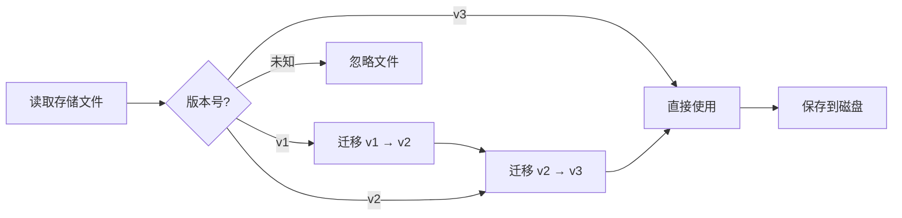

# 账户存储格式与版本管理

## 学完你能做什么

- 理解账户存储文件的结构和各字段含义
- 手动编辑存储文件（仅在必要时）
- 了解版本迁移机制和兼容性
- 跨机器迁移账户配置

## 你现在的困境

你可能遇到以下情况：

- 想备份或迁移账户到另一台机器
- 手动修改 `projectId` 或删除失效账户
- 看到版本警告或迁移日志，想了解发生了什么
- 多台机器间同步账户状态

## 文件位置

账户存储文件位于：

| 操作系统   | 路径                                                       |
| ---------- | ---------------------------------------------------------- |
| macOS/Linux | `~/.config/opencode/antigravity-accounts.json`             |
| Windows    | `%APPDATA%\opencode\antigravity-accounts.json`                |

::: warning 安全提醒
此文件包含 **OAuth refresh tokens**，相当于密码文件。请勿分享给他人，也不要提交到 Git 仓库。
:::

## 存储格式版本

存储格式有版本控制，当前是 **v3**。插件会自动处理版本迁移，无需手动干预。

### v3 格式（当前版本）

```json
{
  "version": 3,
  "accounts": [
    {
      "email": "user1@gmail.com",
      "refreshToken": "1//0abc...",
      "projectId": "my-gcp-project",
      "managedProjectId": "managed-project-123",
      "addedAt": 1737600000000,
      "lastUsed": 1737603600000,
      "lastSwitchReason": "initial",
      "rateLimitResetTimes": {
        "claude": 1737607200000,
        "gemini-antigravity": 1737607200000,
        "gemini-cli": 1737607200000
      },
      "coolingDownUntil": 1737600000000,
      "cooldownReason": "auth-failure"
    }
  ],
  "activeIndex": 0,
  "activeIndexByFamily": {
    "claude": 0,
    "gemini": 0
  }
}
```

**字段说明**：

| 字段                  | 类型    | 必填 | 说明 |
| --------------------- | ------- | ---- | ---- |
| `version`             | number  | Y    | 存储格式版本（固定为 3） |
| `accounts`            | array   | Y    | 账户列表 |
| `activeIndex`         | number  | Y    | 当前活动账户索引（从 0 开始） |
| `activeIndexByFamily` | object  | N    | 按模型族分别跟踪活动账户（`claude`/`gemini`） |

**账户对象字段**：

| 字段                  | 类型    | 必填 | 说明 |
| --------------------- | ------- | ---- | ---- |
| `email`               | string  | N    | Google 账户邮箱 |
| `refreshToken`        | string  | Y    | OAuth refresh 令牌（唯一标识） |
| `projectId`           | string  | N    | GCP 项目 ID（Gemini CLI 模型需要） |
| `managedProjectId`     | string  | N    | 托管项目 ID |
| `addedAt`             | number  | Y    | 添加时间戳（Unix 毫秒） |
| `lastUsed`            | number  | Y    | 最后使用时间戳 |
| `lastSwitchReason`    | string  | N    | 切换原因：`"rate-limit"` / `"initial"` / `"rotation"` |
| `rateLimitResetTimes` | object  | N    | 速率限制重置时间（按配额池分别跟踪） |
| `coolingDownUntil`    | number  | N    | 账户冷却结束时间戳 |
| `cooldownReason`      | string  | N    | 冷却原因：`"auth-failure"` / `"network-error"` / `"project-error"` |

### v2 格式（历史版本）

v2 格式与 v3 类似，但有以下差异：

- `rateLimitResetTimes` 只有 `claude` 和 `gemini` 两个字段
- 没有 `coolingDownUntil` 和 `cooldownReason`
- 没有 `activeIndexByFamily`（所有模型共用一个活动账户）

迁移时，`gemini` 字段会被映射到 `gemini-antigravity`，`gemini-cli` 配额池初始化为空。

### v1 格式（历史版本）

v1 格式使用布尔标记和单一时间戳：

```json
{
  "version": 1,
  "accounts": [
    {
      "email": "user1@gmail.com",
      "refreshToken": "1//0abc...",
      "isRateLimited": true,
      "rateLimitResetTime": 1737607200000
    }
  ],
  "activeIndex": 0
}
```

迁移时，如果 `isRateLimited` 为 `true` 且 `rateLimitResetTime` 未过期，会同时设置 `claude` 和 `gemini` 的重置时间。

## 版本迁移机制

插件在加载存储文件时会自动检测版本并执行迁移：



**迁移规则**：

1. **自动迁移**：迁移后自动保存新格式到磁盘
2. **保留数据**：未过期的速率限制状态会被保留
3. **失败降级**：如果保存失败，继续在内存中使用迁移后的数据
4. **向前兼容**：新版本插件可以读取旧格式文件

## 存储机制细节

### 文件锁定

使用 `proper-lockfile` 确保多进程安全访问：

- **锁定机制**：写入时创建锁文件（`.antigravity-accounts.json.lock`）
- **超时设置**：锁文件 10 秒后过期（防止死锁）
- **重试策略**：最多重试 5 次，退避时间 100ms → 1000ms
- **原子写入**：先写入临时文件（`.tmp`），再重命名到目标文件

### 账户合并

当多个进程同时写入存储文件时，会执行合并策略：

```typescript
// 合并逻辑
function mergeAccountStorage(existing, incoming) {
  // 以 refreshToken 为 key 合并账户
  // 保留手动配置的 projectId/managedProjectId
  // 合并 rateLimitResetTimes
  // 保留较大的 lastUsed
}
```

### 去重机制

基于 `email` 去重，保留每个邮箱的最新账户（按 `lastUsed`，其次按 `addedAt`）：

```typescript
// 去重规则
1. 无 email 的账户 → 保留（无法去重）
2. 相同 email 的账户 → 保留 lastUsed 最大的
3. lastUsed 相同 → 保留 addedAt 最大的
```

## 手动编辑指南

::: danger 手动编辑风险
编辑存储文件时，插件进程不应运行，否则可能被覆盖。建议在编辑前停止 OpenCode。
:::

### 添加账户

手动添加账户时，至少需要提供 `refreshToken`：

```json
{
  "accounts": [
    {
      "refreshToken": "从其他机器复制或从 OAuth 流程获取",
      "email": "user@example.com",
      "addedAt": Date.now(),
      "lastUsed": Date.now()
    }
  ]
}
```

### 删除账户

从 `accounts` 数组中删除对应条目，然后调整 `activeIndex`：

```json
{
  "accounts": [
    { "email": "user1@gmail.com", "refreshToken": "..." },  // 保留
    // { "email": "user2@gmail.com", "refreshToken": "..." },  // 删除
    { "email": "user3@gmail.com", "refreshToken": "..." }   // 保留
  ],
  "activeIndex": 0  // 确保索引在有效范围内
}
```

### 修改 projectId

为账户添加或修改 `projectId`：

```json
{
  "accounts": [
    {
      "email": "user@gmail.com",
      "refreshToken": "1//0abc...",
      "projectId": "your-gcp-project-id"  // 添加或修改
    }
  ]
}
```

### 清除速率限制状态

手动清除速率限制标记：

```json
{
  "accounts": [
    {
      "email": "user@gmail.com",
      "refreshToken": "1//0abc...",
      "rateLimitResetTimes": {}  // 清空或删除此字段
    }
  ]
}
```

## 跨机器迁移

### 简单迁移

直接复制存储文件到目标机器的配置目录：

```bash
# macOS/Linux
cp ~/.config/opencode/antigravity-accounts.json /path/to/backup/

# Windows
copy %APPDATA%\opencode\antigravity-accounts.json backup\
```

### 合并账户

如果目标机器已有账户，插件会自动合并（基于 `refreshToken` 去重）。

**手动合并步骤**：

1. 备份两台机器的存储文件
2. 打开两个文件，复制目标账户数组到源文件
3. 调整 `activeIndex` 和 `activeIndexByFamily`
4. 保存并重启插件

## 常见问题

### 迁移失败怎么办？

如果迁移失败，插件会在日志中记录警告：

```
Failed to persist migrated storage: { error: "..." }
```

**解决方法**：

1. 检查文件权限
2. 确认磁盘空间充足
3. 手动备份旧文件后删除，重新添加账户

### 版本不兼容错误

如果看到「Unknown storage version」错误：

```json
{
  "version": 99  // 未知版本
}
```

**解决方法**：

1. 备份当前文件
2. 手动将 `version` 改为 `2` 或 `3`
3. 重启插件触发迁移
4. 如果迁移失败，删除文件重新添加账户

### 账户去重丢失

如果发现重复账户被删除：

**原因**：插件基于 `email` 去重，保留最新使用的账户。

**解决方法**：如果需要保留两个相同邮箱的账户（罕见场景），手动编辑文件，确保 `email` 字段为空或不同。

## 本课小结

- 存储文件位置：`~/.config/opencode/antigravity-accounts.json`
- 当前版本：v3，支持双配额池和冷却机制
- 自动迁移：v1/v2 会自动升级到 v3
- 文件锁定：使用 `proper-lockfile` 确保并发安全
- 手动编辑：建议停止插件后再编辑，避免被覆盖

## 下一课预告

> 下一课我们学习 **[所有配置选项](../all-config-options/)**。
>
> 你会学到：
> - 完整的配置选项列表
> - 每个选项的默认值和作用域
> - 高级配置技巧

---

## 附录：源码参考

<details>
<summary><strong>点击展开查看源码位置</strong></summary>

> 更新时间：2026-01-23

| 功能           | 文件路径                                                                                                      | 行号    |
| -------------- | ------------------------------------------------------------------------------------------------------------- | ------- |
| 存储格式定义   | [`src/plugin/storage.ts`](https://github.com/NoeFabris/opencode-antigravity-auth/blob/main/src/plugin/storage.ts)      | 128-198 |
| v1 → v2 迁移  | [`src/plugin/storage.ts`](https://github.com/NoeFabris/opencode-antigravity-auth/blob/main/src/plugin/storage.ts)      | 366-395 |
| v2 → v3 迁移  | [`src/plugin/storage.ts`](https://github.com/NoeFabris/opencode-antigravity-auth/blob/main/src/plugin/storage.ts)      | 397-431 |
| 加载账户       | [`src/plugin/storage.ts`](https://github.com/NoeFabris/opencode-antigravity-auth/blob/main/src/plugin/storage.ts)      | 433-518 |
| 保存账户       | [`src/plugin/storage.ts`](https://github.com/NoeFabris/opencode-antigravity-auth/blob/main/src/plugin/storage.ts)      | 520-536 |
| 文件锁定机制   | [`src/plugin/storage.ts`](https://github.com/NoeFabris/opencode-antigravity-auth/blob/main/src/plugin/storage.ts)      | 219-257 |
| 账户合并       | [`src/plugin/storage.ts`](https://github.com/NoeFabris/opencode-antigravity-auth/blob/main/src/plugin/storage.ts)      | 259-299 |
| 去重机制       | [`src/plugin/storage.ts`](https://github.com/NoeFabris/opencode-antigravity-auth/blob/main/src/plugin/storage.ts)      | 301-364 |

**关键类型定义**：

- `AccountStorageV1`：v1 存储格式
- `AccountStorageV2`：v2 存储格式
- `AccountStorageV3`：v3 存储格式（当前）
- `RateLimitStateV3`：v3 速率限制状态（支持多配额池）

**关键函数**：

- `loadAccounts()`：加载账户并执行迁移
- `saveAccounts()`：保存账户（带文件锁定和合并）
- `migrateV1ToV2()`：v1 → v2 迁移
- `migrateV2ToV3()`：v2 → v3 迁移
- `mergeAccountStorage()`：合并两个存储对象
- `deduplicateAccountsByEmail()`：基于 email 去重

</details>
