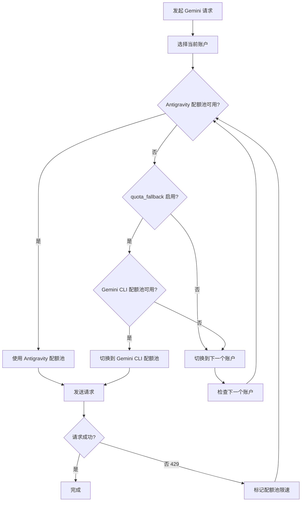

# 双配额系统：理解 Antigravity 和 Gemini CLI 配额池

## 学完你能做什么

- 理解每个账户如何拥有两个独立的 Gemini 配额池
- 启用自动在 Antigravity 和 Gemini CLI 配额池之间 fallback
- 显式指定模型使用某个特定的配额池
- 通过双配额系统最大化你的配额利用率

---

## 你现在的困境

你正在用 Antigravity Auth 插件调用 Gemini 模型，经常遇到配额限制，但可能不了解**双配额系统**：

- 一个请求被限速后，需要等待配额重置才能继续
- 虽然配置了多个账户，但每个账户的 Gemini 配额还是不够用
- 不清楚为什么有的模型可以请求，有的却频繁 429

**核心痛点**：你以为每个账户只有一个 Gemini 配额池，但实际上每个账户拥有 **两个独立** 的配额池，如果配置得当，可以翻倍你的 Gemini 配额。

---

## 核心思路

### 什么是双配额系统？

**双配额系统**是 Antigravity Auth 插件为每个账户维护两个独立 Gemini 配额池的机制。Antigravity 和 Gemini CLI 配额池独立追踪限速状态，当 Antigravity 限速时可切换到 CLI 配额池，实现配额翻倍。

Antigravity Auth 插件为每个 Google 账户维护 **两个独立的 Gemini 配额池**：

| 配额池 | 类型 | 优先级 | 重置规则 |
| ------ | ---- | ---- | -------- |
| **Antigravity** | 主要配额池 | 优先使用 | 根据服务端返回的重置时间动态计算 |
| **Gemini CLI** | 备用配额池 | fallback 使用 | 根据服务端返回的重置时间动态计算 |

每个配额池的速率限制状态独立追踪，互不影响。这意味着：

- Antigravity 配额池限速时，如果 Gemini CLI 配额池还可用，可以自动切换
- 相当于每个账户的 Gemini 配额**翻倍**

### 显式指定 vs 自动 fallback

有两种方式使用双配额系统：

1. **显式指定**：在模型名后添加 `:antigravity` 或 `:gemini-cli` 后缀，强制使用某个配额池
2. **自动 fallback**：启用 `quota_fallback` 配置，让插件自动在两个配额池之间切换

**默认行为**：不启用自动 fallback，只使用 Antigravity 配额池

---

## 跟我做

### 第 1 步：启用自动 fallback

打开你的 `~/.config/opencode/antigravity.json` 配置文件：

```bash
cat ~/.config/opencode/antigravity.json
```

添加或修改 `quota_fallback` 配置：

```json
{
  "quota_fallback": true
}
```

**为什么**：默认情况下 `quota_fallback` 为 `false`，插件只使用 Antigravity 配额池。启用后，当 Antigravity 限速时会自动尝试 Gemini CLI 配额池。

你应该看到配置文件被更新。

---

### 第 2 步：观察自动 fallback 行为

发起一个 Gemini 模型请求（例如使用 Gemini 3 Flash）：

```bash
opencode run "解释什么是量子计算" --model=google/antigravity-gemini-3-flash
```

如果 Antigravity 配额池限速，你会看到以下自动 fallback 行为：

```
[Toast 提示] Antigravity quota exhausted, using Gemini CLI quota
```

插件会：

1. 检测到 Antigravity 配额池限速（429 响应）
2. 尝试切换到 Gemini CLI 配额池（如果未限速）
3. 使用新的配额池重新发送请求
4. 显示 toast 通知告知切换行为

**为什么**：这是自动 fallback 的核心逻辑——在同一账户的两个配额池之间切换，而不是立即切换到下一个账户。

你应该看到请求成功完成，而不是因配额限制失败。

---

### 第 3 步：显式指定配额池

如果你想强制使用某个特定的配额池，可以在模型名后添加后缀：

**使用 Antigravity 配额池**（通过 `antigravity-` 前缀）：

```bash
opencode run "解释什么是量子计算" --model=google/antigravity-gemini-3-flash
```

**使用 Gemini CLI 配额池**（不带 `antigravity-` 前缀）：

```bash
opencode run "解释什么是量子计算" --model=google/gemini-3-flash-preview
```

**为什么**：通过 `antigravity-` 前缀可以显式指定使用 Antigravity 配额池；不带前缀则使用 Gemini CLI 配额池。此时插件会忽略 `quota_fallback` 配置，如果指定的配额池限速，会立即切换到下一个账户，而不是尝试另一个配额池。

你应该看到请求被路由到指定的配额池。

---

### 第 4 步：查看配额状态（调试模式）

如果你想查看每个配额池的速率限制状态，启用调试模式：

编辑 `~/.config/opencode/antigravity.json`：

```json
{
  "quota_fallback": true,
  "debug": true
}
```

发起请求后，查看日志文件：

```bash
tail -f ~/.config/opencode/antigravity-logs/*.log
```

你会看到类似的日志：

```
[DEBUG] headerStyle=antigravity explicit=false
[DEBUG] quota fallback: gemini-cli
[INFO] rate-limit triggered for account 0, family gemini, quota: gemini-antigravity
```

**为什么**：调试日志可以让你清楚看到插件选择了哪个配额池，以及何时触发了 fallback。这对排查配额问题非常有帮助。

你应该看到详细的配额切换日志。

---

## 检查点 ✅

### 验证自动 fallback 已启用

```bash
cat ~/.config/opencode/antigravity.json | grep quota_fallback
```

你应该看到：

```json
"quota_fallback": true
```

### 验证显式指定后缀

尝试使用带后缀的模型名，确认不会报错：

```bash
opencode run "测试" --model=google/antigravity-gemini-3-flash:gemini-cli
```

你应该看到请求成功完成。

### 验证调试日志

```bash
ls -la ~/.config/opencode/antigravity-logs/
```

你应该看到日志文件存在，且包含配额切换相关信息。

---

## 踩坑提醒

### 坑 1：显式指定后缀时不会 fallback

**问题**：你在模型名后添加了 `:antigravity` 或 `:gemini-cli` 后缀，但 `quota_fallback` 似乎不工作。

**原因**：显式指定后缀时，插件会忽略 `quota_fallback` 配置，强制使用指定的配额池。如果该配额池限速，会立即切换到下一个账户，而不是尝试另一个配额池。

**解决方案**：
- 如果你想用自动 fallback，不要在模型名后添加后缀
- 如果你想强制使用某个配额池，添加后缀即可

### 坑 2：Claude 模型没有双配额系统

**问题**：你启用了 `quota_fallback`，但 Claude 模型似乎没有 fallback 行为。

**原因**：双配额系统**仅适用于 Gemini 模型**。Claude 模型只使用 Antigravity 配额池，没有 Gemini CLI 配额池。

**解决方案**：
- Claude 模型不需要配置双配额系统
- 只有多账户轮换可以提升 Claude 配额

### 坑 3：调试日志过多影响性能

**问题**：启用了 `debug: true`，但日志文件增长过快。

**原因**：调试模式会记录所有请求细节，包括配额切换、账户选择等。

**解决方案**：
- 调试完成后，关闭 `debug` 配置
- 或定期清理日志文件：`rm ~/.config/opencode/antigravity-logs/*.log`

---

## 双配额系统工作流程图

以下是自动 fallback 的工作流程：



---

## 双配额池的独立追踪机制

### 配额键定义

插件使用以下配额键来追踪速率限制（源码：`accounts.ts:77`）：

| 配额键 | 含义 |
| ------ | ---- |
| `claude` | Claude 模型配额 |
| `gemini-antigravity` | Gemini Antigravity 配额池 |
| `gemini-cli` | Gemini CLI 配额池 |

每个账户的 `rateLimitResetTimes` 对象存储这些配额键的重置时间戳：

```json
{
  "rateLimitResetTimes": {
    "claude": 1234567890,
    "gemini-antigravity": 1234567890,
    "gemini-cli": 1234567890
  }
}
```

### 可用配额池检查

当选择配额池时，插件会按以下顺序检查（源码：`accounts.ts:545-557`）：

1. **Antigravity 配额池**：如果未限速，直接使用
2. **Gemini CLI 配额池**：如果 Antigravity 限速且此池可用，使用此池
3. **返回 null**：两个池都限速，触发账户切换

---

## 配额池切换的触发条件

自动 fallback 会在以下条件满足时触发：

| 条件 | 说明 | 源码位置 |
| ---- | ---- | -------- |
| `quota_fallback = true` | 配置已启用自动 fallback | `config/schema.ts:234` |
| 当前账户的 Antigravity 配额池限速 | 收到 429 响应 | `plugin.ts:1149` |
| 模型未显式指定配额池 | 模型名不包含 `:antigravity` 或 `:gemini-cli` 后缀 | `plugin.ts:1151` |
| 当前账户的 Gemini CLI 配额池可用 | 未限速 | `accounts.ts:553` |

如果任何一条不满足，插件会直接切换到下一个账户，而不是尝试 fallback。

---

## 本课小结

本课我们学习了 Antigravity Auth 插件的双配额系统：

- **双配额池**：每个账户拥有 Antigravity 和 Gemini CLI 两个独立的 Gemini 配额池
- **自动 fallback**：启用 `quota_fallback` 后，Antigravity 限速时自动尝试 Gemini CLI 配额池
- **显式指定**：使用 `:antigravity` 或 `:gemini-cli` 后缀强制使用某个配额池
- **独立追踪**：每个配额池的速率限制状态独立存储和检查
- **仅限 Gemini**：双配额系统只适用于 Gemini 模型，Claude 模型只有 Antigravity 配额池

通过合理使用双配额系统，你可以将每个账户的 Gemini 配额翻倍，减少因配额限制导致的请求失败。

---

## 下一课预告

> 下一课我们学习 **[多账户设置：配置负载均衡提升配额](../../advanced/multi-account-setup/)**。
>
> 你会学到：
> - 如何添加多个 Google 账户
> - 配置不同账户选择策略的最佳实践
> - 多账户场景下的配额池使用技巧

---

## 附录：源码参考

<details>
<summary><strong>点击展开查看源码位置</strong></summary>

> 更新时间：2026-01-23

| 功能 | 文件路径 | 行号 |
| --- | --- | --- |
| 配额键定义（BaseQuotaKey） | [`src/plugin/accounts.ts`](https://github.com/NoeFabris/opencode-antigravity-auth/blob/main/src/plugin/accounts.ts#L77-L78) | 77-78 |
| 获取配额键（getQuotaKey） | [`src/plugin/accounts.ts`](https://github.com/NoeFabris/opencode-antigravity-auth/blob/main/src/plugin/accounts.ts#L107-L116) | 107-116 |
| 检查配额池限速状态 | [`src/plugin/accounts.ts`](https://github.com/NoeFabris/opencode-antigravity-auth/blob/main/src/plugin/accounts.ts#L134-L152) | 134-152 |
| 获取可用配额池 | [`src/plugin/accounts.ts`](https://github.com/NoeFabris/opencode-antigravity-auth/blob/main/src/plugin/accounts.ts#L545-L557) | 545-557 |
| quota_fallback 配置定义 | [`src/plugin/config/schema.ts`](https://github.com/NoeFabris/opencode-antigravity-auth/blob/main/src/plugin/config/schema.ts#L224-L234) | 224-234 |
| 自动 fallback 逻辑 | [`src/plugin/plugin.ts`](https://github.com/NoeFabris/opencode-antigravity-auth/blob/main/src/plugin/plugin.ts#L1151-L1163) | 1151-1163 |
| 双配额系统文档 | [`docs/MULTI-ACCOUNT.md`](https://github.com/NoeFabris/opencode-antigravity-auth/blob/main/docs/MULTI-ACCOUNT.md#L21-L31) | 21-31 |

**关键常量**：
- `BaseQuotaKey = "claude" | "gemini-antigravity" | "gemini-cli"`：配额键类型定义

**关键函数**：
- `getAvailableHeaderStyle()`：根据当前账户的配额池状态返回可用的配额池
- `isRateLimitedForHeaderStyle()`：检查指定配额池是否限速
- `getQuotaKey()`：根据模型族和 headerStyle 生成配额键

</details>
