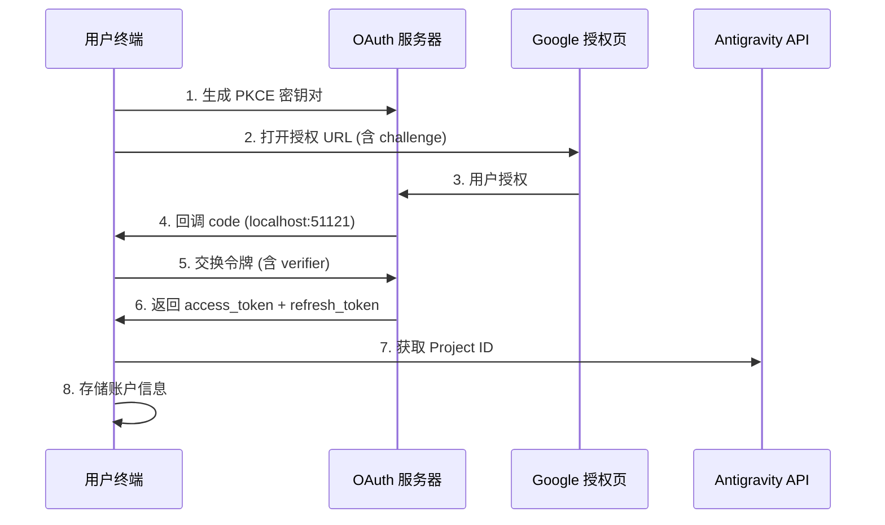

# OAuth 2.0 PKCE 认证：完成首次登录

## 学完你能做什么

- 理解 OAuth 2.0 PKCE 认证流程的安全机制
- 完成插件首次登录，获取 Antigravity API 访问权限
- 理解 Project ID 的自动获取和存储机制
- 了解令牌刷新的自动化处理

## 你现在的困境

你已经安装了插件，配置好模型定义，但还没真正用过。每次运行 `opencode run` 都提示"需要认证"，但你不知道：

- OAuth 是什么？为什么要用这么复杂的认证方式？
- 认证过程中到底发生了什么？安全吗？
- 首次登录需要准备什么？会有哪些选择？
- 令牌过期了怎么办？需要重新登录吗？

## 什么时候用这一招

- **首次安装插件后**：第一次使用前必须完成认证
- **添加新账户时**：配置多账户轮换，需要逐一认证
- **令牌失效后**：如果账户被撤销或密码更改，需重新认证
- **切换到新设备时**：迁移账户时需要在新设备重新登录

## 🎒 开始前的准备

::: warning 前置检查

请确认已完成以下步骤：

1. **插件已安装**：参考 [快速安装](/zh/NoeFabris/opencode-antigravity-auth/start/quick-install/)
2. **模型已配置**：已将模型定义添加到 `~/.config/opencode/opencode.json`
3. **有可用的 Google 账户**：建议使用已建立信任的账户，避免使用新创建的账户

:::

## 核心思路

### 什么是 OAuth 2.0 PKCE？

**OAuth 2.0**（Open Authorization 2.0）是一个授权协议，让第三方应用（本插件）在不直接获取用户密码的情况下，获得对 Google API 的访问权限。

**PKCE**（Proof Key for Code Exchange）是 OAuth 2.0 的安全扩展，专为公开客户端（如 CLI 工具）设计。它通过以下机制防止授权码拦截攻击：

```
┌─────────────────────────────────────────────────────────────────┐
│  PKCE 防护机制                                            │
├─────────────────────────────────────────────────────────────────┤
│  1. 客户端生成一对密钥：                                   │
│     - code_verifier（随机字符串，保密）                        │
│     - code_challenge（verifier 的哈希值，公开）                │
│  2. 授权 URL 包含 code_challenge                           │
│  3. 回调服务器收到 code，再用 code_verifier 验证             │
│  4. 攻击者即使拦截了 code，没有 verifier 也无法交换令牌         │
└─────────────────────────────────────────────────────────────────┘
```

::: info

**PKCE vs 传统 OAuth**

传统 OAuth 使用 `client_secret` 验证身份，但这要求客户端能安全存储密钥。CLI 工具无法做到这点，所以 PKCE 用动态生成的 `verifier` 代替静态密钥，同样安全但不依赖预存储的秘密。

:::

### 认证流程概览



## 跟我做

### 第 1 步：启动 OAuth 登录

**为什么**

`opencode auth login` 命令会启动本地 OAuth 服务器，生成授权 URL，并等待 Google 的回调。

**执行命令**：

```bash
opencode auth login
```

**你应该看到**：

```
🔑 Initializing Antigravity OAuth...
📋 Starting local OAuth server on http://127.0.0.1:51121
🌐 Opening browser for authorization...

If the browser doesn't open, visit this URL manually:
https://accounts.google.com/o/oauth2/v2/auth?client_id=...&code_challenge=...
```

::: tip

**环境检测**

插件会自动检测运行环境：

| 环境 | 绑定地址 | 原因 |
|--- | --- | ---|
| 本地 macOS/Linux/Windows | `127.0.0.1` | 最安全，只接受本地连接 |
| WSL / Docker / SSH 远程 | `0.0.0.0` | 允许浏览器从宿主机访问 |

你可以通过环境变量 `OPENCODE_ANTIGRAVITY_OAUTH_BIND` 覆盖默认设置。

:::

### 第 2 步：在浏览器中授权

**为什么**

Google 授权页面会显示插件请求的权限（Scope），需要你明确同意。

**你会看到**：

Google OAuth 授权页面，显示：
- 请求方：Antigravity Auth Plugin
- 请求权限：
  - 查看您的电子邮件地址
  - 查看您的个人资料信息
  - 访问您的 Cloud Platform 项目
  - 访问 Google Cloud 的日志和实验配置

**操作**：

1. 确认请求的权限符合预期（没有超出范围的敏感权限）
2. 点击"允许"或"授权"按钮
3. 等待页面跳转到 `http://localhost:51121/oauth-callback`

**你应该看到**：

```html
<!DOCTYPE html>
<html>
  <!-- ... -->
  <h1>All set!</h1>
  <p>You've successfully authenticated with Antigravity.</p>
  <!-- ... -->
</html>
```

::: warning

**授权页面关闭问题**

如果授权成功后浏览器没有自动关闭，手动关闭标签页即可。这是浏览器的安全限制，不影响认证结果。

:::

### 第 3 步：自动交换令牌并获取 Project ID

**为什么**

授权码只是临时凭证，需要交换为长期有效的 `refresh_token`，同时获取 Antigravity 项目所需的 `Project ID`。

**后台自动发生**：

插件会自动执行以下操作（无需你干预）：

1. **验证 PKCE**：用 `code_verifier` 验证授权码的有效性
2. **交换令牌**：向 `oauth2.googleapis.com/token` 发送 POST 请求

   ```typescript
   // 源码：src/antigravity/oauth.ts:209
   POST https://oauth2.googleapis.com/token
   Content-Type: application/x-www-form-urlencoded

   {
     client_id: "...",
     client_secret: "...",
     code: "授权码",
     grant_type: "authorization_code",
     redirect_uri: "http://localhost:51121/oauth-callback",
     code_verifier: "PKCE verifier"
   }
   ```

3. **获取用户信息**：验证邮箱地址

   ```typescript
   // 源码：src/antigravity/oauth.ts:231
   GET https://www.googleapis.com/oauth2/v1/userinfo?alt=json
   Authorization: Bearer {access_token}
   ```

4. **自动获取 Project ID**：尝试从 Antigravity API 获取你的项目 ID

   ```typescript
   // 源码：src/antigravity/oauth.ts:131
   // 按优先级尝试多个端点
   - https://cloudcode-pa.googleapis.com/v1internal:loadCodeAssist (prod)
   - https://daily-cloudcode-pa.sandbox.googleapis.com/v1internal:loadCodeAssist (daily)
   - https://autopush-cloudcode-pa.sandbox.googleapis.com/v1internal:loadCodeAssist (autopush)
   ```

5. **存储账户信息**：保存到 `~/.config/opencode/antigravity-accounts.json`

   ```json
   {
     "version": 3,
     "accounts": [
       {
         "email": "your.email@gmail.com",
         "refreshToken": "1//0g...|rising-fact-p41fc",
         "projectId": "rising-fact-p41fc",
         "addedAt": 1737609600000,
         "lastUsed": 1737609600000
       }
     ]
   }
   ```

::: details

**Project ID 的作用**

Project ID 是 Google Cloud 项目的唯一标识，用于确定 API 调用归属于哪个项目。Antigravity 会根据 Project ID 追踪配额使用情况。

- **自动获取成功**：使用你的真实 Project ID（推荐）
- **自动获取失败**：使用默认 Project ID (`rising-fact-p41fc`)

:::

**你应该看到**：

```
✅ Authentication successful
📧 Account: your.email@gmail.com
🆔 Project ID: rising-fact-p41fc
💾 Saved to: ~/.config/opencode/antigravity-accounts.json
```

### 检查点 ✅

**验证账户已正确存储**：

```bash
cat ~/.config/opencode/antigravity-accounts.json
```

**期望输出**：

```json
{
  "version": 3,
  "accounts": [
    {
      "email": "your.email@gmail.com",
      "refreshToken": "1//0g...|rising-fact-p41fc",
      "projectId": "rising-fact-p41fc",
      "addedAt": 1737609600000,
      "lastUsed": 1737609600000
    }
  ]
}
```

::: tip

**账户存储格式**

`refreshToken` 字段的格式为：`{refresh_token}|{project_id}`，这种设计允许在单个字段中存储令牌和项目 ID，简化存储逻辑。

:::

## 踩坑提醒

### 坑 1：端口被占用

**错误提示**：

```
❌ Port 51121 is already in use.
Another process is occupying this port.
```

**原因**：另一个 OpenCode 进程正在运行，或其他程序占用了端口。

**解决方案**：

1. 检查并终止占用端口的进程：

   ```bash
   # macOS/Linux
   lsof -ti:51121 | xargs kill -9

   # Windows
   netstat -ano | findstr :51121
   taskkill /PID <PID> /F
   ```

2. 重新运行 `opencode auth login`

### 坑 2：浏览器未自动打开

**原因**：WSL、Docker 或远程环境中，`localhost` 不等于宿主机地址。

**解决方案**：

插件会自动检测环境并显示手动访问 URL：

```
🌐 Opening browser for authorization...

If the browser doesn't open, visit this URL manually:
https://accounts.google.com/o/oauth2/v2/auth?...
```

复制 URL 到宿主机浏览器中访问即可。

### 坑 3：Project ID 获取失败

**警告提示**：

```
⚠️ Failed to resolve Antigravity project via loadCodeAssist
Using default project ID: rising-fact-p41fc
```

**原因**：某些企业账户或特殊权限配置下，`loadCodeAssist` API 无法访问。

**解决方案**：

1. 如果只使用 Antigravity 模型（带 `:antigravity` 后缀），可以使用默认 Project ID
2. 如果需要使用 Gemini CLI 模型（如 `gemini-2.5-pro`），手动配置 Project ID：

   ```json
   // 编辑 ~/.config/opencode/antigravity-accounts.json
   {
     "accounts": [
       {
         "email": "your.email@gmail.com",
         "refreshToken": "1//0g...|your-custom-project-id",
         "projectId": "your-custom-project-id"
       }
     ]
   }
   ```

   获取 Project ID 的步骤：
   - 访问 [Google Cloud Console](https://console.cloud.google.com/)
   - 创建或选择一个项目
   - 启用 **Gemini for Google Cloud API**
   - 复制项目 ID（格式：`rising-fact-p41fc`）

### 坑 4：invalid_grant 错误

**错误提示**：

```
❌ Token exchange failed: invalid_grant
```

**原因**：
- 授权码已过期（有效期通常 10 分钟）
- 用户在授权后撤销了应用访问权限
- 账户密码更改或触发安全事件

**解决方案**：重新运行 `opencode auth login`

## 令牌刷新机制

**自动刷新**：你不需要关心令牌过期问题。

插件会在以下情况自动刷新：

| 触发条件 | 行为 | 源码位置 |
|--- | --- | ---|
| 令牌过期前 60 秒 | 自动刷新 | `src/plugin/auth.ts:33` |
| 收到 401 Unauthorized | 尝试刷新 | `src/plugin/auth.ts:33` |
| 刷新失败 | 提示用户重新登录 | `src/plugin.ts:995` |

**刷新逻辑**：

```typescript
// 源码：src/plugin/auth.ts:33
export function accessTokenExpired(auth: OAuthAuthDetails): boolean {
  // 提前 60 秒刷新（预留时钟偏差）
  return auth.expires <= Date.now() + 60 * 1000;
}
```

## 本课小结

OAuth 2.0 PKCE 认证流程的核心要点：

1. **PKCE 安全机制**：用动态 `verifier` 代替静态密钥，防止授权码拦截
2. **本地回调服务器**：监听 `localhost:51121`，接收 Google 授权回调
3. **令牌交换**：用授权码换取 `access_token` 和 `refresh_token`
4. **自动 Project ID**：尝试从 Antigravity API 获取，失败则使用默认值
5. **自动刷新**：令牌过期前 60 秒自动刷新，无需手动干预
6. **账户存储**：所有信息保存在 `~/.config/opencode/antigravity-accounts.json`

你现在可以发起第一个模型请求了！

## 下一课预告

> 下一课我们学习 **[发起第一个模型请求](/zh/NoeFabris/opencode-antigravity-auth/start/first-request/)**。
>
> 你会学到：
> - 如何使用 `opencode run` 发起请求
> - 验证认证是否成功
> - 理解模型变体的配置方式

---

## 附录：源码参考

<details>
<summary><strong>点击展开查看源码位置</strong></summary>

> 更新时间：2026-01-23

| 功能        | 文件路径                                                                                               | 行号    |
|--- | --- | ---|
| PKCE 密钥生成 | [`src/antigravity/oauth.ts`](https://github.com/NoeFabris/opencode-antigravity-auth/blob/main/src/antigravity/oauth.ts#L91-L113)         | 91-113  |
| 构建授权 URL   | [`src/antigravity/oauth.ts`](https://github.com/NoeFabris/opencode-antigravity-auth/blob/main/src/antigravity/oauth.ts#L91-L113)         | 91-113  |
| 交换令牌     | [`src/antigravity/oauth.ts`](https://github.com/NoeFabris/opencode-antigravity-auth/blob/main/src/antigravity/oauth.ts#L201-L270)         | 201-270 |
| 获取用户信息   | [`src/antigravity/oauth.ts`](https://github.com/NoeFabris/opencode-antigravity-auth/blob/main/src/antigravity/oauth.ts#L231-L242)         | 231-242 |
| 自动获取 Project ID | [`src/antigravity/oauth.ts`](https://github.com/NoeFabris/opencode-antigravity-auth/blob/main/src/antigravity/oauth.ts#L131-L196)      | 131-196 |
| 环境检测       | [`src/plugin/server.ts`](https://github.com/NoeFabris/opencode-antigravity-auth/blob/main/src/plugin/server.ts#L31-L134)           | 31-134  |
| OAuth 回调服务器 | [`src/plugin/server.ts`](https://github.com/NoeFabris/opencode-antigravity-auth/blob/main/src/plugin/server.ts#L140-L366)           | 140-366 |
| 令牌过期检查   | [`src/plugin/auth.ts`](https://github.com/NoeFabris/opencode-antigravity-auth/blob/main/src/plugin/auth.ts#L33-L38)               | 33-38   |
| 计算令牌过期时间 | [`src/plugin/auth.ts`](https://github.com/NoeFabris/opencode-antigravity-auth/blob/main/src/plugin/auth.ts#L45-L52)               | 45-52   |

**关键常量**：
- `ANTIGRAVITY_CLIENT_ID`：OAuth 客户端 ID（`constants.ts:4`）
- `ANTIGRAVITY_CLIENT_SECRET`：OAuth 客户端密钥（`constants.ts:9`）
- `ANTIGRAVITY_REDIRECT_URI`：OAuth 回调地址 `http://localhost:51121/oauth-callback`（`constants.ts:25`）
- `ANTIGRAVITY_SCOPES`：请求的权限列表（`constants.ts:14-20`）
- `ANTIGRAVITY_DEFAULT_PROJECT_ID`：默认项目 ID `rising-fact-p41fc`（`constants.ts:71`）

**关键函数**：
- `authorizeAntigravity()`：生成 PKCE 密钥对和授权 URL（`oauth.ts:91`）
- `exchangeAntigravity()`：交换授权码为访问令牌（`oauth.ts:201`）
- `fetchProjectID()`：从 Antigravity API 获取项目 ID（`oauth.ts:131`）
- `startOAuthListener()`：启动本地 OAuth 服务器（`server.ts:140`）
- `accessTokenExpired()`：检查令牌是否过期（`auth.ts:33`）

**重要业务规则**：
- PKCE 使用 S256 哈希算法（`oauth.ts:100`）
- 令牌过期前 60 秒自动刷新（`auth.ts:3`）
- 支持离线访问（`access_type=offline`）（`oauth.ts:105`）
- Project ID 端点回退顺序：prod → daily → autopush（`oauth.ts:141-143`）

</details>
