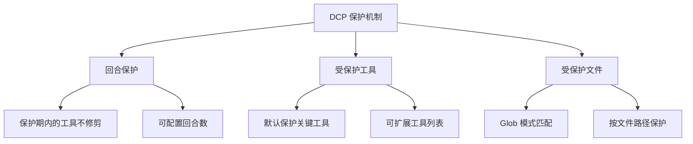

# 保护机制：避免误修剪关键内容

## 学完你能做什么

- 配置回合保护，让 AI 有时间引用最近的工具输出
- 扩展受保护工具列表，防止关键操作被修剪
- 设置受保护文件模式，保护特定文件不被误修剪
- 理解子代理保护机制，避免影响总结行为

## 你现在的困境

DCP 会自动修剪对话历史中的冗余工具调用，这很省 Token，但有时候会出问题：

- AI 刚读取了一个文件，想基于内容做分析，结果被 DCP 修剪了
- 你用 `write` 工具写了一个配置文件，后面还要读取，结果修剪后找不到文件路径
- AI 说"根据上面的代码"，但代码已经不在上下文里了

这些情况都说明：**有些内容必须保护起来，不能被修剪**。

## 什么时候用这一招

- AI 需要引用之前读取的文件内容时
- 需要保护关键操作（如写配置、任务规划）时
- 某些文件路径（如 secrets、密钥）需要特殊保护时
- 开发子代理功能时（DCP 会自动跳过）

## 核心思路

DCP 提供了**三层保护机制**，从不同维度防止关键内容被误修剪：



**保护层级**：
1. **回合保护**（时间维度）：最近 N 回合的工具自动保护
2. **工具保护**（工具维度）：特定工具永远不会被修剪
3. **文件保护**（路径维度）：操作特定文件的工具不会被修剪

三者可以组合使用，形成多层次的保护网。

---

## 回合保护

### 什么是回合保护

回合保护（Turn Protection）是 DCP 提供的**时间窗口保护机制**。启用后，在保护期内的工具调用不会被添加到修剪缓存中，也就不会被任何策略修剪。

**作用**：给 AI 时间引用最近的工具输出，避免"刚说完就删"的尴尬。

### 配置回合保护

在配置文件中添加：

```jsonc
{
  "turnProtection": {
    "enabled": true,
    "turns": 4
  }
}
```

**参数说明**：
- `enabled`：是否启用回合保护（默认 `false`）
- `turns`：保护回合数（默认 `4`），表示最近 4 回合的工具不会修剪

### 回合保护的工作原理

DCP 在同步工具缓存时（每次 AI 发送消息前），会计算每个工具的回合数：

```typescript
// 如果当前回合 - 工具创建回合 < 保护回合数
// 则该工具不会被修剪
state.currentTurn - turnCounter < turnProtectionTurns
```

**示例**：
- 当前回合：10
- 工具创建回合：8
- 保护回合数：4
- 结果：10 - 8 = 2 < 4 → **受保护，不修剪**

**效果**：
- 在保护期内，工具不会出现在 `<prunable-tools>` 列表中
- 不会受自动策略影响（去重、覆盖写入、清除错误）
- AI 无法通过 `discard`/`extract` 工具修剪它们

### 推荐配置

| 场景                     | 推荐回合数 | 说明                             |
|--- | --- | ---|
| 长对话（10+ 回合）      | 4-6        | 给 AI 足够时间引用历史内容       |
| 短对话（< 5 回合）      | 2-3        | 不需要太长的保护期               |
| 高度依赖上下文的任务     | 6-8        | 如代码重构、长篇文档分析         |
| 默认（不依赖上下文）     | 0-2        | 不启用或用最小值                |

::: tip 注意
回合保护会增加上下文大小，因为更多工具输出会被保留。如果发现 Token 消耗增长明显，可以适当降低保护回合数。
:::

---

## 受保护工具

### 默认受保护工具

DCP 默认保护以下工具，它们**永远不会**被修剪：

| 工具名       | 说明                             |
|--- | ---|
| `task`       | 任务管理工具                       |
| `todowrite`  | 写入待办事项                     |
| `todoread`   | 读取待办事项                     |
| `discard`    | DCP 的丢弃工具（修剪操作本身）     |
| `extract`    | DCP 的提取工具（修剪操作本身）     |
| `batch`      | 批量操作工具                     |
| `write`      | 写入文件工具                     |
| `edit`       | 编辑文件工具                     |
| `plan_enter` | 规划入口标记                     |
| `plan_exit`  | 规划出口标记                     |

**为什么这些工具受保护**：
- `task`、`todowrite`、`todoread`：任务管理是会话状态的核心，删除会导致上下文丢失
- `discard`、`extract`：它们是 DCP 自己的修剪工具，不能修剪自己
- `batch`、`write`、`edit`：文件操作是 AI 与用户代码交互的核心
- `plan_enter`、`plan_exit`：规划标记帮助理解会话结构

### 扩展受保护工具列表

如果你需要保护更多工具，可以在配置中扩展：

```jsonc
{
  "tools": {
    "settings": {
      "protectedTools": [
        "task",
        "todowrite",
        "todoread",
        "discard",
        "extract",
        "batch",
        "write",
        "edit",
        "plan_enter",
        "plan_exit",
        // 添加你需要保护的工具
        "read",
        "filesearch"
      ]
    }
  }
}
```

**全局工具保护**：
- `tools.settings.protectedTools` 中的工具会在所有策略中受保护
- 适用于不想让任何策略修剪的工具

### 策略级别的工具保护

你也可以为特定策略设置受保护工具：

```jsonc
{
  "strategies": {
    "deduplication": {
      "enabled": true,
      "protectedTools": [
        "read",  // 去重时保护 read 工具
        "filesearch"
      ]
    },
    "purgeErrors": {
      "enabled": true,
      "turns": 4,
      "protectedTools": [
        "write"  // 清除错误时保护 write 工具
      ]
    }
  }
}
```

**使用场景**：
- 只在某个策略中保护工具，其他策略可以修剪
- 例如：允许去重修剪 `read`，但清除错误策略不能修剪 `write`

::: info 工具保护与回合保护的区别
- **工具保护**：无论工具是哪个回合创建的，只要在保护列表中，就永远不会被修剪
- **回合保护**：所有工具（除了受保护工具）在保护期内不被修剪，但保护期过后可以被修剪
:::

---

## 受保护文件模式

### 什么是受保护文件模式

受保护文件模式允许你通过 Glob 模式，**保护特定文件路径上的操作不被修剪**。

**适用场景**：
- 保护密钥文件（`.env`、`secrets.json`）
- 保护配置文件（重要配置不能丢失）
- 保护项目核心文件（入口文件、核心库）
- 保护敏感目录（如 `src/api/`、`tests/fixtures/`）

### 配置受保护文件模式

在配置文件中添加：

```jsonc
{
  "protectedFilePatterns": [
    "**/.env*",
    "**/secrets.json",
    "**/config/*.json",
    "src/core/**/*.ts",
    "tests/fixtures/**/*"
  ]
}
```

### Glob 模式说明

DCP 支持标准的 Glob 模式：

| 模式       | 说明                       | 示例匹配路径                           |
|--- | --- | ---|
| `**`       | 匹配任意层级的目录         | `src/`、`src/components/`、`a/b/c/`   |
| `*`        | 匹配单层目录下的任意文件   | `src/*.ts` 匹配 `src/index.ts`        |
| `?`        | 匹配单个字符             | `file?.txt` 匹配 `file1.txt`、`file2.txt` |
| `*.json`   | 匹配特定扩展名           | `config.json`、`data.json`             |
| `**/*.json` | 匹配任意层级下的 JSON 文件 | `a/b/c.json`、`d.json`                |

**注意事项**：
- `*` 和 `?` 不会匹配 `/`（目录分隔符）
- 匹配是针对完整文件路径进行的
- 路径分隔符统一为 `/`（即使在 Windows 上）

### 实战案例

#### 案例 1：保护环境变量文件

```jsonc
{
  "protectedFilePatterns": [
    "**/.env",
    "**/.env.local",
    "**/.env.production"
  ]
}
```

**效果**：任何操作 `.env` 文件的工具都不会被修剪。

#### 案例 2：保护项目核心文件

```jsonc
{
  "protectedFilePatterns": [
    "src/index.ts",
    "src/core/**/*.ts",
    "src/api/**/*.ts"
  ]
}
```

**效果**：操作核心模块和 API 的工具输出会被保留，确保 AI 能始终看到项目结构。

#### 案例 3：保护测试固定数据

```jsonc
{
  "protectedFilePatterns": [
    "tests/fixtures/**/*",
    "tests/mocks/**/*.json"
  ]
}
```

**效果**：测试用的模拟数据和固定输入不会被修剪，避免测试结果不一致。

---

## 子代理保护

### 什么是子代理

子代理（Subagent）是 OpenCode 的一种机制，主代理可以派生子代理处理特定任务（如文件搜索、代码分析）。子代理会将结果总结后返回给主代理。

### DCP 的子代理保护

DCP 会自动检测子代理会话，并**跳过所有修剪操作**。

**实现原理**：
```typescript
// lib/state/utils.ts
export async function isSubAgentSession(client: any, sessionID: string): Promise<boolean> {
    const result = await client.session.get({ path: { id: sessionID } })
    return !!result.data?.parentID  // 如果有 parentID，说明是子代理
}
```

**为什么需要保护**：
- 子代理的输出是给主代理看的总结
- 如果修剪子代理的工具输出，主代理可能无法理解上下文
- 子代理的任务是"高效执行"，不是"省 Token"

::: info 用户感知
子代理保护是自动的，你不需要配置任何内容。DCP 会在日志中记录检测到的子代理会话。
:::

---

## 跟我做：配置保护机制

### 第 1 步：编辑配置文件

打开全局配置文件（或项目配置文件）：

```bash
# macOS/Linux
code ~/.config/opencode/dcp.jsonc

# Windows
code $env:APPDATA\opencode\dcp.jsonc
```

### 第 2 步：添加保护配置

```jsonc
{
  "$schema": "https://raw.githubusercontent.com/Opencode-DCP/opencode-dynamic-context-pruning/main/dcp.schema.json",
  "enabled": true,
  "debug": false,

  // 回合保护
  "turnProtection": {
    "enabled": true,
    "turns": 4
  },

  // 受保护文件模式
  "protectedFilePatterns": [
    "**/.env*",
    "**/secrets.json"
  ],

  // 扩展受保护工具
  "tools": {
    "settings": {
      "nudgeEnabled": true,
      "nudgeFrequency": 10,
      "protectedTools": [
        "task",
        "todowrite",
        "todoread",
        "discard",
        "extract",
        "batch",
        "write",
        "edit",
        "plan_enter",
        "plan_exit",
        "read"
      ]
    },
    "discard": {
      "enabled": true
    },
    "extract": {
      "enabled": true,
      "showDistillation": false
    }
  },

  // 策略级别的保护
  "strategies": {
    "deduplication": {
      "enabled": true,
      "protectedTools": ["filesearch"]
    },
    "supersedeWrites": {
      "enabled": false
    },
    "purgeErrors": {
      "enabled": true,
      "turns": 4,
      "protectedTools": ["write"]
    }
  }
}
```

### 第 3 步：重启 OpenCode

修改配置后，重启 OpenCode 使配置生效：

- macOS/Linux：点击 Dock 中的 OpenCode 图标右键 → 退出 → 重新打开
- Windows：在任务栏右键 OpenCode → 关闭窗口 → 重新打开

### 第 4 步：验证保护机制

在 OpenCode 对话中输入 `/dcp context`，查看当前上下文分析：

```
Session Context Breakdown:
──────────────────────────────────────────────────────────

System         15.2% │████████████████▒▒▒▒▒▒▒▒▒▒▒▒▒▒▒▒▒▒▒▒▒▒▒│  25.1K tokens
User            5.1% │████▒▒▒▒▒▒▒▒▒▒▒▒▒▒▒▒▒▒▒▒▒▒▒▒▒▒▒▒▒▒▒▒▒▒▒▒▒▒│   8.4K tokens
Assistant       35.8% │██████████████████████████████████████▒▒▒▒▒▒▒│  59.2K tokens
Tools (45)      43.9% │████████████████████████████████████████████████│  72.6K tokens

──────────────────────────────────────────────────────────

Summary:
  Pruned:          12 tools (~15.2K tokens)
  Current context: ~165.3K tokens
  Without DCP:     ~180.5K tokens
```

**你应该看到**：
- `Pruned` 数量可能会减少（因为受保护的工具不会被修剪）
- `Current context` 可能会增大（因为回合保护保留了更多内容）

---

## 踩坑提醒

### ❌ 误区 1：过度保护导致 Token 浪费

**问题**：设置过长的保护回合数或添加太多受保护工具，导致上下文一直很大。

**解决**：
- 回合保护一般设置 2-4 回合即可
- 只保护真正关键的工具（如 `task`、`write`）
- 定期查看 `/dcp context`，监控上下文大小

### ❌ 误区 2：Glob 模式匹配失败

**问题**：设置了 `*.json`，但某些 JSON 文件还是被修剪了。

**原因**：`*` 不会匹配 `/`，所以 `a/b/c.json` 不会被匹配。

**解决**：使用 `**/*.json` 匹配任意层级的 JSON 文件。

### ❌ 误区 3：忘记重启 OpenCode

**问题**：修改配置后，保护机制没有生效。

**原因**：DCP 只在启动时加载配置文件。

**解决**：修改配置后必须重启 OpenCode。

### ❌ 误区 4：受保护工具出现在修剪列表中

**问题**：设置了受保护工具，但它们还是出现在 `<prunable-tools>` 列表中。

**原因**：受保护工具不会被修剪，但如果它们在保护期外，仍会出现在 `<prunable-tools>` 列表中（供 AI 查看），只是 AI 尝试修剪时会失败。

**解决**：这是正常行为。AI 尝试修剪受保护工具时，DCP 会拒绝操作并返回错误。

---

## 本课小结

DCP 的保护机制包含三层：

1. **回合保护**：在保护期内的工具不会被修剪，给 AI 时间引用历史内容
2. **受保护工具**：特定工具（如 `task`、`write`）永远不会被修剪，可扩展自定义列表
3. **受保护文件模式**：通过 Glob 模式保护特定文件路径上的操作
4. **子代理保护**：DCP 自动检测并跳过子代理会话的修剪操作

**推荐配置策略**：
- 开发阶段：启用回合保护（2-4 回合），保护配置文件和核心模块
- 生产阶段：根据实际需求调整，平衡 Token 节省和上下文完整性
- 关键任务：启用所有保护机制，确保关键内容不会丢失

---

## 下一课预告

> 下一课我们学习 **[状态持久化](../state-persistence/)**。
>
> 你会学到：
> - DCP 如何跨会话保留修剪状态和统计数据
> - 持久化文件的位置和格式
> - 如何查看累计 Token 节省效果
> - 清理持久化数据的方法

---

## 附录：源码参考

<details>
<summary><strong>点击展开查看源码位置</strong></summary>

> 更新时间：2026-01-23

| 功能             | 文件路径                                                                                              | 行号     |
|--- | --- | ---|
| 回合保护逻辑     | [`lib/state/tool-cache.ts`](https://github.com/Opencode-DCP/opencode-dynamic-context-pruning/blob/main/lib/state/tool-cache.ts#L39-L44) | 39-44    |
| 默认受保护工具   | [`lib/config.ts`](https://github.com/Opencode-DCP/opencode-dynamic-context-pruning/blob/main/lib/config.ts#L68-L79)         | 68-79    |
| 受保护文件匹配   | [`lib/protected-file-patterns.ts`](https://github.com/Opencode-DCP/opencode-dynamic-context-pruning/blob/main/lib/protected-file-patterns.ts#L77-L82) | 77-82    |
| 子代理检测       | [`lib/state/utils.ts`](https://github.com/Opencode-DCP/opencode-dynamic-context-pruning/blob/main/lib/state/utils.ts#L1-L8)           | 1-8      |
| 去重策略保护检查 | [`lib/strategies/deduplication.ts`](https://github.com/Opencode-DCP/opencode-dynamic-context-pruning/blob/main/lib/strategies/deduplication.ts#L49-L57) | 49-57    |
| Discard 工具保护检查 | [`lib/strategies/tools.ts`](https://github.com/Opencode-DCP/opencode-dynamic-context-pruning/blob/main/lib/strategies/tools.ts#L89-L112)   | 89-112   |

**关键常量**：
- `DEFAULT_PROTECTED_TOOLS = ["task", "todowrite", "todoread", "discard", "extract", "batch", "write", "edit", "plan_enter", "plan_exit"]`：默认受保护工具列表

**关键函数**：
- `isProtectedFilePath(filePath, patterns)`：检查文件路径是否匹配保护模式
- `isSubAgentSession(client, sessionID)`：检测会话是否为子代理

</details>
