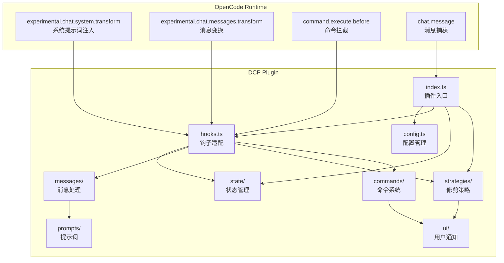
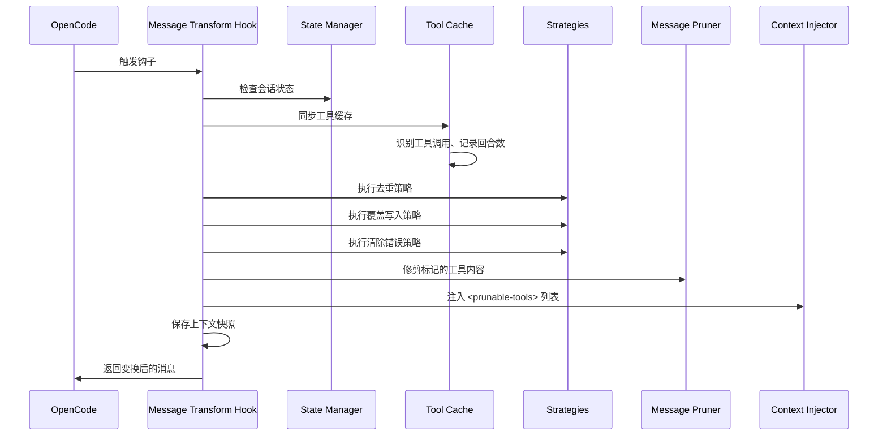
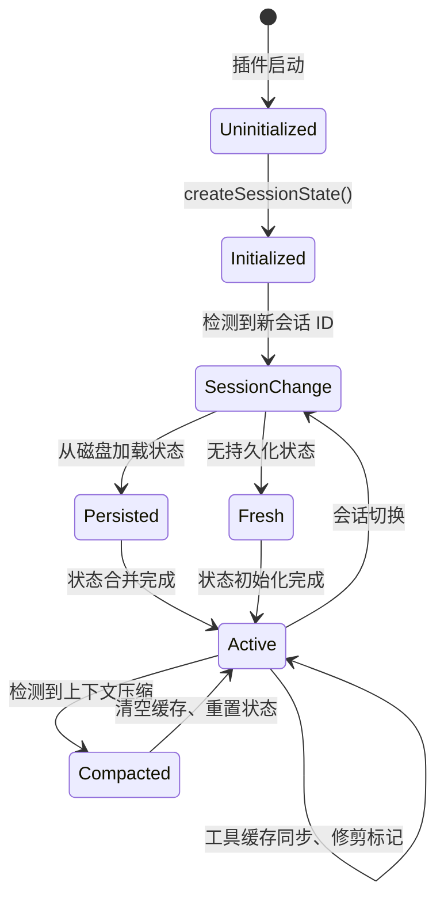
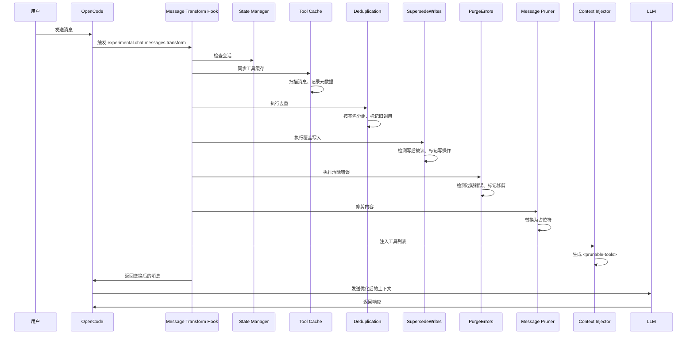
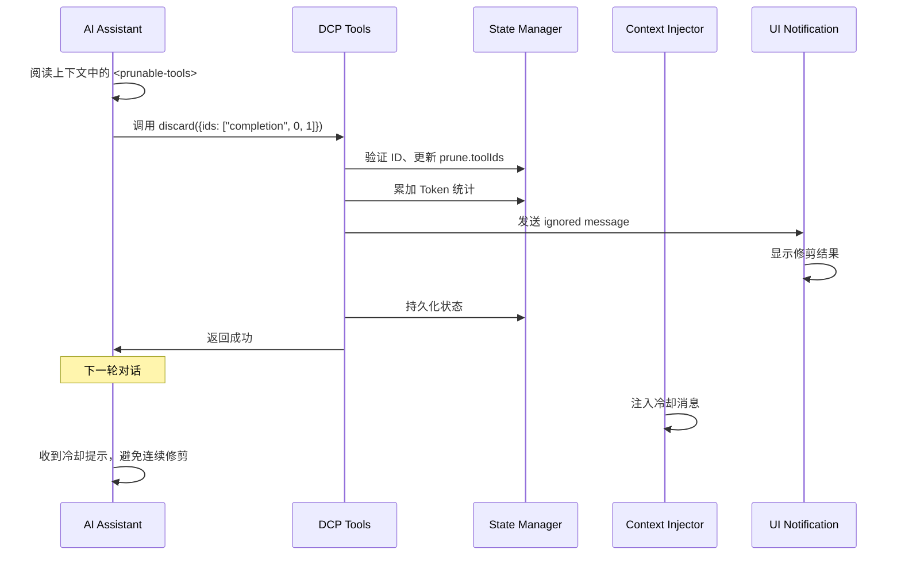

# 架构概览：DCP 内部工作原理

## 学完你能做什么

本节不涉及操作，而是帮助你深入理解 DCP 的内部设计。学完后，你将能够：
- 理解 DCP 如何通过 OpenCode 钩子系统与对话流程集成
- 掌握各个模块的职责边界和交互方式
- 理解从消息接收到修剪完成的完整调用链路
- 了解状态管理、消息处理和修剪策略的设计思路

## 核心思路

DCP 是一个基于 OpenCode Plugin SDK 的插件，通过注册钩子和工具来扩展 OpenCode 的对话能力。整个系统围绕"消息变换"（message transform）这一核心概念展开——每次 AI 准备响应用户之前，DCP 会对对话历史进行扫描、分析和修剪，然后才将优化后的上下文发送给 LLM。

::: info 为什么是"消息变换"？

OpenCode 提供了 `experimental.chat.messages.transform` 钩子，允许插件在消息发送给 LLM 之前修改它们。这正是 DCP 需要的能力——在 LLM 看到上下文之前，移除冗余的工具调用。

:::

系统采用模块化设计，每个模块职责清晰：
- **config**：配置管理，支持多层级覆盖
- **state**：状态管理，维护会话级运行时状态
- **messages**：消息处理，执行实际的修剪和注入操作
- **strategies**：修剪策略，定义自动清理规则
- **commands**：命令系统，提供手动控制和统计查询
- **hooks**：钩子适配，连接 OpenCode 和 DCP 模块
- **ui**：用户通知，展示修剪结果和统计信息

## 模块架构图



## 插件入口与初始化

插件入口定义在 `index.ts` 中，是 DCP 与 OpenCode Plugin API 的唯一连接点。

### 插件注册流程

```typescript
const plugin: Plugin = (async (ctx) => {
    const config = getConfig(ctx)
    if (!config.enabled) {
        return {}
    }

    const logger = new Logger(config.debug)
    const state = createSessionState()

    return {
        "experimental.chat.system.transform": createSystemPromptHandler(...),
        "experimental.chat.messages.transform": createChatMessageTransformHandler(...),
        "chat.message": async (input, _output) => { /* 缓存 variant */ },
        "command.execute.before": createCommandExecuteHandler(...),
        tool: {
            discard: createDiscardTool(...),
            extract: createExtractTool(...),
        },
        config: async (opencodeConfig) => { /* 修改 OpenCode 配置 */ },
    }
}) satisfies Plugin
```

**初始化阶段**：
1. 加载配置（支持多层级合并：默认值 → 全局 → 环境变量 → 项目）
2. 如果插件被禁用，立即返回空对象
3. 创建日志系统和会话状态对象
4. 注册四个钩子和两个工具

**配置修改阶段**：
- 通过 `config` 钩子，将 `discard` 和 `extract` 工具添加到 `experimental.primary_tools`
- 注册 `/dcp` 命令

## 钩子系统与消息变换

`hooks.ts` 负责将 OpenCode 的钩子事件转换为 DCP 内部模块调用。这是 DCP 的核心调度层。

### 系统提示词注入钩子

```typescript
createSystemPromptHandler(state, logger, config)
```

**调用时机**：每次构建系统提示词时

**主要职责**：
1. 检测子代理会话（如果是子代理，跳过注入）
2. 检测内部代理（如对话摘要生成器，跳过注入）
3. 根据配置选择合适的提示词模板：
   - 同时启用 discard 和 extract：`system/system-prompt-both`
   - 仅启用 discard：`system/system-prompt-discard`
   - 仅启用 extract：`system/system-prompt-extract`
4. 将工具说明注入到系统提示词

**为什么需要系统提示词注入？**

AI 需要知道可以使用 `discard` 和 `extract` 工具来优化上下文。通过在系统提示词中描述这些工具的用途，AI 才能自主决策何时调用它们。

### 消息变换钩子

```typescript
createChatMessageTransformHandler(ctx.client, state, logger, config)
```

**调用时机**：每次 AI 准备响应消息时（发送给 LLM 之前）

**处理流程**：



**核心步骤**：

1. **会话检查**（`checkSession`）
   - 检测会话 ID 是否变化
   - 如果是新会话，从磁盘加载持久化状态
   - 检测上下文压缩（OpenCode 的 summary 机制），如果检测到压缩，清空工具缓存

2. **工具缓存同步**（`syncToolCache`）
   - 扫描所有消息中的工具调用
   - 记录每个工具的 `callID`、工具名、参数、状态、回合数
   - 跳过受保护的工具和回合保护期内的工具
   - 维护 `nudgeCounter`（未修剪工具计数）

3. **执行自动策略**
   - `deduplicate`：去重，保留最新调用
   - `supersedeWrites`：清理已被读取覆盖的写操作
   - `purgeErrors`：清理过期错误工具的输入

4. **修剪内容**（`prune`）
   - 替换已标记工具的 `output` 为占位符
   - 替换错误工具的 `input` 为占位符

5. **注入工具列表**（`insertPruneToolContext`）
   - 生成 `<prunable-tools>` 列表（包含数字 ID、工具名、参数摘要）
   - 根据需要注入提醒消息（nudge）
   - 如果上次操作是修剪，注入冷却消息

6. **保存上下文快照**
   - 将变换后的消息保存到日志目录，便于调试

### 命令拦截钩子

```typescript
createCommandExecuteHandler(ctx.client, state, logger, config, ctx.directory)
```

**调用时机**：用户执行命令时

**主要职责**：
- 拦截 `/dcp` 开头的命令
- 分发到对应的命令处理器：
  - `/dcp` → 显示帮助
  - `/dcp context` → 显示 Token 使用分析
  - `/dcp stats` → 显示累计修剪统计
  - `/dcp sweep [n]` → 手动修剪工具
- 通过抛出特殊错误（`__DCP_*_HANDLED__`）阻止 OpenCode 执行默认命令处理

## 状态管理

`state/` 模块负责维护会话级运行时状态和持久化。

### 核心数据结构

**SessionState**（内存状态）：
```typescript
{
    sessionId: string | null,           // 当前会话 ID
    isSubAgent: boolean,               // 是否为子代理会话
    prune: { toolIds: string[] },       // 已标记修剪的工具 ID 列表
    stats: {
        pruneTokenCounter: number,      // 当前会话修剪 Token 数
        totalPruneTokens: number,       // 历史累计修剪 Token 数
    },
    toolParameters: Map<string, ToolParameterEntry>,  // 工具调用缓存
    nudgeCounter: number,               // 未修剪工具计数（用于触发提醒）
    lastToolPrune: boolean,             // 上次操作是否为修剪工具
    lastCompaction: number,             // 最后一次上下文压缩时间戳
    currentTurn: number,                // 当前回合数
    variant: string | undefined,       // 模型变体（如 claude-3.5-sonnet）
}
```

**ToolParameterEntry**（工具元数据）：
```typescript
{
    tool: string,                       // 工具名称
    parameters: any,                    // 工具参数
    status: ToolStatus | undefined,     // 执行状态
    error: string | undefined,          // 错误信息
    turn: number,                       // 创建该调用的回合数
}
```

### 状态生命周期



**关键状态转换**：

1. **会话初始化**（`ensureSessionInitialized`）
   - 检测 `sessionID` 变化
   - 检测是否为子代理（通过 `session.parentID`）
   - 从磁盘加载 `PersistedSessionState`
   - 初始化回合计数器和压缩时间戳

2. **上下文压缩处理**
   - 检测 OpenCode 的 `summary` 消息（`msg.info.summary === true`）
   - 清空工具缓存和修剪列表
   - 记录压缩时间戳，防止重复清理

3. **持久化**
   - 修剪操作完成后异步保存到 `~/.local/share/opencode/storage/plugin/dcp/{sessionId}.json`
   - 包含会话名称、修剪列表、统计数据、最后更新时间

## 消息处理模块

`messages/` 模块负责实际的修剪和注入操作。

### 修剪操作（prune.ts）

**核心函数**：`prune(state, logger, config, messages)`

**三个子函数**：

1. **`pruneToolOutputs`**
   - 替换已标记工具的 `output` 为占位符
   - 只处理状态为 `completed` 的工具
   - 跳过 `question` 工具（问题工具的特殊处理）

2. **`pruneToolInputs`**
   - 仅处理 `question` 工具
   - 替换 `questions` 字段为占位符（保留用户答案）

3. **`pruneToolErrors`**
   - 清理错误工具的输入参数
   - 保留错误消息，仅移除字符串输入（可能很大的参数）

**占位符设计**：
```
[Output removed to save context - information superseded or no longer needed]
[input removed due to failed tool call]
[questions removed - see output for user's answers]
```

### 上下文注入（inject.ts）

**核心函数**：`insertPruneToolContext(state, config, logger, messages)`

**流程**：

1. **生成工具列表**（`buildPrunableToolsList`）
   - 遍历工具缓存，排除：
     - 已修剪的工具
     - 受保护工具（`task`、`write`、`edit` 等）
     - 受保护文件路径（匹配 `protectedFilePatterns`）
   - 为每个工具生成描述：`{numericId}: {toolName}, {paramKey}`
   - 示例：`3: read, src/config.ts`

2. **包装为 `<prunable-tools>` 标签**
   ```html
   <prunable-tools>
   The following tools have been invoked and are available for pruning. This list does not mandate immediate action. Consider your current goals and resources you need before discarding valuable tool inputs or outputs. Consolidate your prunes for efficiency; it is rarely worth pruning a single tiny tool output. Keep your context free of noise.
   0: read, src/config.ts
   1: read, src/config.ts
   2: read, src/utils.ts
   </prunable-tools>
   ```

3. **处理冷却状态**
   - 如果上次操作是 `discard` 或 `extract`，注入冷却消息：
   ```html
   <prunable-tools>
   Context management was just performed. Do not use discard or extract tools again. A fresh list will be available after your next tool use.
   </prunable-tools>
   ```

4. **注入提醒消息**
   - 如果 `nudgeCounter >= nudgeFrequency`，追加提醒文本
   - 提醒格式：`"You have not used context pruning in a while. Consider using discard/extract tools to reduce token usage."`

5. **选择消息插入位置**
   - 如果最后一条消息是用户消息，插入合成用户消息
   - 否则，插入合成助手消息
   - 使用 `variant` 确保消息格式兼容不同的模型

## 修剪策略模块

`strategies/` 模块定义自动清理规则。

### 去重策略（deduplication.ts）

**核心函数**：`deduplicate(state, logger, config, messages)`

**算法**：
1. 构建所有工具 ID 的按时间顺序列表
2. 为每个工具计算"签名"：`tool::normalizedParameters`
   - 归一化参数：移除 `null`/`undefined`
   - 排序键顺序：确保 `{"b":1,"a":2}` 和 `{"a":2,"b":1}` 生成相同签名
3. 按签名分组
4. 每组中，保留最后一个（最新），标记其他为修剪

**示例**：
```typescript
// 原始工具调用
Tool Call 1: read({filePath: "src/config.ts"})
Tool Call 2: read({filePath: "src/config.ts"})
Tool Call 3: read({filePath: "src/utils.ts"})

// 签名分组
Signature 1: "read::{\"filePath\":\"src/config.ts\"}" → [Tool Call 1, Tool Call 2]
Signature 2: "read::{\"filePath\":\"src/utils.ts\"}" → [Tool Call 3]

// 修剪结果
标记修剪: [Tool Call 1]  // 保留 Tool Call 2（最新）
保留: [Tool Call 2, Tool Call 3]
```

### 覆盖写入策略（supersede-writes.ts）

**核心函数**：`supersedeWrites(state, logger, config, messages)`

**算法**：
1. 扫描所有工具调用，按时间顺序
2. 维护文件跟踪表：
   ```typescript
   {
       "src/config.ts": {
           lastWrite: callId,
           lastWriteTime: timestamp,
           lastRead: callId,
           lastReadTime: timestamp,
       }
   }
   ```
3. 检测模式：
   - 如果文件的 `lastWriteTime < lastReadTime`，说明写操作已被读取覆盖
   - 标记该写操作的 `input` 为修剪

**场景**：
```typescript
// 时间线
Turn 1: write({filePath: "src/config.ts", content: "..."})  // lastWrite = call1
Turn 2: read({filePath: "src/config.ts"})                 // lastRead = call2 (覆盖了写操作)
Turn 3: read({filePath: "src/config.ts"})                 // 保留最新的读取

// 修剪结果
标记修剪: [Turn 1 的 write 调用]
```

### 清除错误策略（purge-errors.ts）

**核心函数**：`purgeErrors(state, logger, config, messages)`

**算法**：
1. 扫描所有状态为 `error` 的工具
2. 检查当前回合数与工具创建回合的差值
3. 如果差值 > `strategies.purgeErrors.turns`（默认 4），标记修剪

**保护机制**：
- 错误消息保留（`part.state.error`）
- 仅移除输入参数（`part.state.input`），因为错误输入可能很大

**场景**：
```typescript
Turn 1: read({filePath: "nonexistent.txt"}) → error
Turn 2-5: 其他操作
Turn 6: 用户继续对话

// 如果 purgeErrors.turns = 4
// Turn 6 - Turn 1 = 5 > 4
// 标记修剪 Turn 1 的错误输入
```

### LLM 驱动工具（tools.ts）

**Discard 工具**：
```typescript
{
    name: "discard",
    description: "Remove completed task or noise tool outputs",
    parameters: {
        ids: ["completion", 0, 1, 2]  // 首元素为原因：'completion' 或 'noise'
    }
}
```

**Extract 工具**：
```typescript
{
    name: "extract",
    description: "Extract key findings then remove original tool outputs",
    parameters: {
        ids: [0, 1, 2],
        distillation: ["key finding 1", "key finding 2", "key finding 3"]
    }
}
```

**处理流程**：
1. AI 调用工具，提供数字 ID 列表
2. 将数字 ID 映射回真实的 `callID`
3. 验证工具不在保护列表中
4. 更新 `prune.toolIds`
5. 通过 `ignored message` 显示修剪结果
6. 持久化状态

## 命令系统

`commands/` 模块提供手动控制和统计查询。

### Context 命令

```bash
/dcp context
```

**输出**：Token 使用分析（分条形图）
```
╭───────────────────────────────────────────────────────────╮
│                  DCP Context Analysis                     │
╰───────────────────────────────────────────────────────────╯

Session Context Breakdown:
───────────────────────────────────────────────────────────

System         15.2% │████████████████▒▒▒▒▒▒▒▒▒▒▒▒▒▒▒▒▒▒▒▒▒▒▒│  25.1K tokens
User            5.1% │████▒▒▒▒▒▒▒▒▒▒▒▒▒▒▒▒▒▒▒▒▒▒▒▒▒▒▒▒▒▒▒▒▒▒▒▒▒▒│   8.4K tokens
Assistant       35.8% │██████████████████████████████████████▒▒▒▒▒▒▒│  59.2K tokens
Tools (45)      43.9% │████████████████████████████████████████████████│  72.6K tokens

───────────────────────────────────────────────────────────

Summary:
  Pruned:          12 tools (~15.2K tokens)
  Current context: ~165.3K tokens
  Without DCP:     ~180.5K tokens
```

**计算逻辑**：
- System：`firstAssistant.input + cache.read - tokenizer(firstUserMessage)`
- User：`tokenizer(all user messages)`
- Tools：`tokenizer(toolInputs + toolOutputs) - prunedTokens`
- Assistant：残差计算

### Stats 命令

```bash
/dcp stats
```

**输出**：累计修剪统计
```
╭───────────────────────────────────────────────────────────╮
│                      DCP Statistics                      │
╰───────────────────────────────────────────────────────────╯

Session Pruning:
  Tools pruned: 12
  Tokens saved: ~15.2K
  Last prune:   discard (2 turns ago)

Lifetime Statistics:
  Total tokens saved: ~145.8K
```

### Sweep 命令

```bash
/dcp sweep [n]
```

**两种模式**：
1. 默认：修剪上一条用户消息后的所有工具
2. 指定：`/dcp sweep 5`，修剪最后 5 个工具

**处理流程**：
1. 找到上一条用户消息的位置
2. 提取后续的工具调用
3. 过滤受保护工具和受保护文件
4. 标记修剪
5. 显示结果和 Token 节省

## 配置系统

`config.ts` 负责配置加载和验证。

### 配置优先级

```
默认值 (1) < 全局 (2) < 环境变量 (3) < 项目 (4)
```

**配置路径**：
- 全局：`~/.config/opencode/dcp.jsonc`
- 环境变量：`$OPENCODE_CONFIG_DIR/dcp.jsonc`
- 项目：`<project>/.opencode/dcp.jsonc`

### 配置合并流程

```typescript
const defaultConfig = { /* 硬编码默认值 */ }
const globalConfig = loadConfig(globalPath) || {}
const envConfig = loadConfig(envPath) || {}
const projectConfig = loadConfig(projectPath) || {}

const finalConfig = {
    ...defaultConfig,
    ...globalConfig,
    ...envConfig,
    ...projectConfig,
}
```

### 验证机制

- 使用 Zod Schema 定义配置结构
- 如果配置无效，使用 Toast 警告并降级到默认值
- 配置文件不存在时自动创建默认配置

## 模块依赖关系

| 模块        | 职责               | 依赖模块                              | 被依赖模块                  |
|--- | --- | --- | ---|
| config      | 配置管理           | -                                     | index, hooks, strategies, commands |
| hooks       | 钩子适配           | config, state, logger, messages, strategies, commands | index |
| state       | 状态管理           | logger                                | index, hooks, strategies    |
| messages    | 消息处理           | state, logger, prompts, ui, protected-file-patterns | hooks |
| strategies   | 修剪策略           | state, logger, messages, ui, protected-file-patterns | hooks |
| commands     | 命令处理           | state, logger, messages, ui, strategies | hooks |
| ui          | 用户通知           | state, logger, prompts                | strategies, commands        |
| prompts     | 提示词管理         | -                                     | hooks, messages, strategies |
| logger      | 日志系统           | -                                     | index, config, hooks, strategies, state, ui, commands |

## 完整调用链路

### 自动修剪流程



### LLM 驱动修剪流程



## 性能考虑

### 工具缓存限制

- 最大容量：1000 条（`MAX_TOOL_CACHE_SIZE`）
- 清理策略：FIFO（先进先出）
- 触发条件：每次同步后检查大小

### 日志系统

- 调试日志：`~/.config/opencode/logs/dcp/daily/YYYY-MM-DD.log`
- 上下文快照：`~/.config/opencode/logs/dcp/context/{sessionId}/`
- 日志级别：可配置（`config.debug`）

### 子代理检测

- 检测方式：`session.parentID` 是否存在
- 处理策略：跳过所有修剪操作（避免重复修剪）

## 本课小结

DCP 的架构设计围绕"消息变换"这一核心展开，通过 OpenCode 的钩子系统与对话流程无缝集成。系统采用模块化设计，每个模块职责清晰：

- **插件入口**（`index.ts`）负责注册钩子和工具
- **钩子系统**（`hooks.ts`）负责事件分发和调度
- **状态管理**（`state/`）负责会话级状态和持久化
- **消息处理**（`messages/`）负责实际的修剪和注入
- **修剪策略**（`strategies/`）定义自动清理规则
- **命令系统**（`commands/`）提供手动控制
- **配置系统**（`config.ts`）支持多层级配置

整个流程在 `experimental.chat.messages.transform` 钩子中完成：工具缓存同步 → 自动策略执行 → 内容修剪 → 工具列表注入。这种设计确保了 DCP 在 LLM 看到上下文之前完成优化，同时保持了插件的可维护性和扩展性。

---

## 附录：源码参考

<details>
<summary><strong>点击展开查看源码位置</strong></summary>

> 更新时间：2026-01-23

| 功能        | 文件路径                                                                                    | 行号    |
|--- | --- | ---|
| 插件入口和钩子注册 | [`index.ts`](https://github.com/Opencode-DCP/opencode-dynamic-context-pruning/blob/main/index.ts) | 12-102 |
| 系统提示词注入钩子 | [`lib/hooks.ts`](https://github.com/Opencode-DCP/opencode-dynamic-context-pruning/blob/main/lib/hooks.ts) | 20-53 |
| 消息变换钩子 | [`lib/hooks.ts`](https://github.com/Opencode-DCP/opencode-dynamic-context-pruning/blob/main/lib/hooks.ts) | 55-82 |
| 命令拦截钩子 | [`lib/hooks.ts`](https://github.com/Opencode-DCP/opencode-dynamic-context-pruning/blob/main/lib/hooks.ts) | 84-156 |
| 会话状态管理 | [`lib/state/state.ts`](https://github.com/Opencode-DCP/opencode-dynamic-context-pruning/blob/main/lib/state/state.ts) | 7-143 |
| 工具缓存同步 | [`lib/state/tool-cache.ts`](https://github.com/Opencode-DCP/opencode-dynamic-context-pruning/blob/main/lib/state/tool-cache.ts) | 11-86 |
| 状态持久化 | [`lib/state/persistence.ts`](https://github.com/Opencode-DCP/opencode-dynamic-context-pruning/blob/main/lib/state/persistence.ts) | - |
| 消息修剪 | [`lib/messages/prune.ts`](https://github.com/Opencode-DCP/opencode-dynamic-context-pruning/blob/main/lib/messages/prune.ts) | 11-106 |
| 上下文注入 | [`lib/messages/inject.ts`](https://github.com/Opencode-DCP/opencode-dynamic-context-pruning/blob/main/lib/messages/inject.ts) | 102-157 |
| 去重策略 | [`lib/strategies/deduplication.ts`](https://github.com/Opencode-DCP/opencode-dynamic-context-pruning/blob/main/lib/strategies/deduplication.ts) | 13-83 |
| 覆盖写入策略 | [`lib/strategies/supersede-writes.ts`](https://github.com/Opencode-DCP/opencode-dynamic-context-pruning/blob/main/lib/strategies/supersede-writes.ts) | - |
| 清除错误策略 | [`lib/strategies/purge-errors.ts`](https://github.com/Opencode-DCP/opencode-dynamic-context-pruning/blob/main/lib/strategies/purge-errors.ts) | - |
| LLM 驱动工具 | [`lib/strategies/tools.ts`](https://github.com/Opencode-DCP/opencode-dynamic-context-pruning/blob/main/lib/strategies/tools.ts) | - |
| Context 命令 | [`lib/commands/context.ts`](https://github.com/Opencode-DCP/opencode-dynamic-context-pruning/blob/main/lib/commands/context.ts) | - |
| Stats 命令 | [`lib/commands/stats.ts`](https://github.com/Opencode-DCP/opencode-dynamic-context-pruning/blob/main/lib/commands/stats.ts) | - |
| Sweep 命令 | [`lib/commands/sweep.ts`](https://github.com/Opencode-DCP/opencode-dynamic-context-pruning/blob/main/lib/commands/sweep.ts) | - |
| 配置管理 | [`lib/config.ts`](https://github.com/Opencode-DCP/opencode-dynamic-context-pruning/blob/main/lib/config.ts) | - |
| 日志系统 | [`lib/logger.ts`](https://github.com/Opencode-DCP/opencode-dynamic-context-pruning/blob/main/lib/logger.ts) | - |

**关键常量**：
- `MAX_TOOL_CACHE_SIZE = 1000`：工具缓存最大容量，防止内存无限增长（`lib/state/tool-cache.ts:6`）

**关键函数**：
- `createSystemPromptHandler()`：创建系统提示词注入钩子，负责向 AI 说明可用的修剪工具（`lib/hooks.ts:20-53`）
- `createChatMessageTransformHandler()`：创建消息变换钩子，是 DCP 的核心调度器，协调状态管理、策略执行、消息修剪和上下文注入（`lib/hooks.ts:55-82`）
- `syncToolCache()`：同步工具参数缓存，记录每个工具调用的元数据（callID、参数、状态、回合数），用于后续的修剪策略（`lib/state/tool-cache.ts:11-86`）
- `deduplicate()`：去重策略，通过签名匹配识别重复工具调用，保留最新的（`lib/strategies/deduplication.ts:13-83`）
- `supersedeWrites()`：覆盖写入策略，清理已被后续读取覆盖的写操作输入（`lib/strategies/supersede-writes.ts`）
- `purgeErrors()`：清除错误策略，清理过期错误工具的输入参数（`lib/strategies/purge-errors.ts`）
- `prune()`：消息修剪主函数，调用三个子函数分别修剪工具输出、工具输入、错误输入（`lib/messages/prune.ts:11-20`）
- `insertPruneToolContext()`：注入 `<prunable-tools>` 列表到上下文，提供给 AI 识别可修剪的工具（`lib/messages/inject.ts:102-157`）
- `createDiscardTool()`：创建 discard 工具规范，允许 AI 移除已完成任务或噪声工具输出（`lib/strategies/tools.ts`）
- `createExtractTool()`：创建 extract 工具规范，允许 AI 提取关键发现后移除原始工具输出（`lib/strategies/tools.ts`）
- `createSessionState()`：创建新的会话状态对象，初始化所有状态字段（`lib/state/state.ts:42-60`）
- `ensureSessionInitialized()`：确保会话初始化，处理会话切换、子代理检测、状态加载（`lib/state/state.ts:80-116`）

**关键数据结构**：
- `SessionState`：会话级运行时状态，包含 sessionId、修剪列表、统计数据、工具缓存、回合计数器等（`lib/state/types.ts:27-38`）
- `ToolParameterEntry`：单个工具调用的元数据缓存，包含工具名、参数、状态、错误信息、回合数（`lib/state/types.ts:10-16`）
- `Prune`：修剪状态，记录已标记修剪的工具调用 ID 列表（`lib/state/types.ts:23-25`）
- `SessionStats`：会话统计数据，包含当前会话修剪 Token 数和历史累计修剪 Token 数（`lib/state/types.ts:18-21`）

**关键类型定义**：
- `ToolStatus`：工具执行状态枚举，包括 pending（等待执行）、running（执行中）、completed（已完成）、error（失败）（`lib/state/types.ts:8`）

</details>

---

## 下一课预告

> 下一课我们学习 **[Token 计算原理](../token-calculation/)**。
>
> 你会学到：
> - DCP 如何精确计算 Token 使用量
> - 不同消息类型（System、User、Assistant、Tools）的计算方式
> - Token 节省统计的累积机制
> - 如何调试 Token 计算问题
