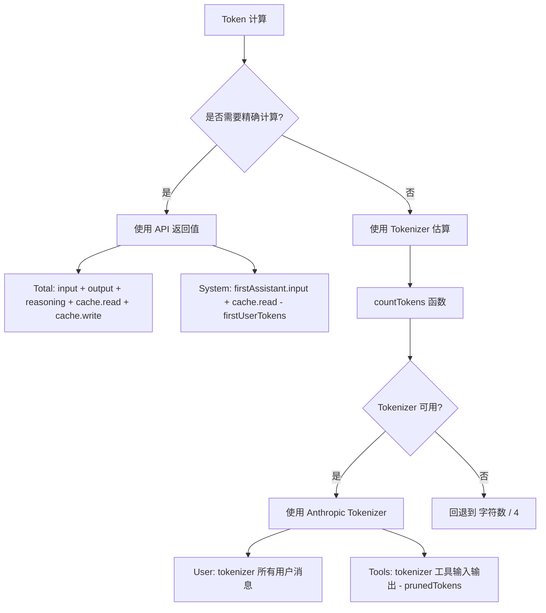

# Token 计算原理

## 学完你能做什么

- 理解 DCP 的 Token 计算策略（API 值 vs 估算值）
- 读懂 `/dcp context` 输出中的 Token 分布
- 知道 Token 估算的误差范围和优化方法
- 准确评估 DCP 的节省效果

## 你现在的困境

你看着 `/dcp context` 的输出，一堆数字和百分比，但不知道它们是怎么算出来的：

```
Session Context Breakdown:
─────────────────────────────────────────────────────────

System         15.2% │████████████████▒▒▒▒▒▒▒▒▒▒▒▒▒▒▒▒▒▒▒▒▒│  25.1K tokens
User            5.1% │████▒▒▒▒▒▒▒▒▒▒▒▒▒▒▒▒▒▒▒▒▒▒▒▒▒▒▒▒▒▒▒▒▒▒▒▒▒▒▒▒▒│   8.4K tokens
Assistant       35.8% │██████████████████████████████████████▒▒▒▒▒▒│  59.2K tokens
Tools (45)      43.9% │████████████████████████████████████████████████│  72.6K tokens
─────────────────────────────────────────────────────────

Summary:
  Pruned:          12 tools (~15.2K tokens)
  Current context: ~165.3K tokens
  Without DCP:     ~180.5K tokens
```

这些数字从哪里来？为什么 Assistant 是"残差计算"？prunedTokens 怎么算的？

## 什么时候用这一招

- 想准确评估 DCP 的节省效果时
- 需要分析 Token 消耗结构时（哪个部分占用最多）
- 怀疑 Token 计算有误差，想验证准确性时
- 需要向团队汇报 DCP 的优化成果时

## 核心思路

DCP 的 Token 计算采用**混合策略**：**优先使用 API 返回的精确值，必要时使用估算值**。



**关键原则**：
1. **API 值优先**：Total 和 System 使用 API 精确返回值
2. **估算值补全**：User 和 Tools 使用 tokenizer 估算（因为 API 不提供这些值）
3. **残差计算**：Assistant 通过 Total - System - User - Tools 计算得出

---

## Token 计算策略

### API 返回的精确值

OpenCode API 会为每次 AI 响应返回精确的 Token 统计：

| 字段                | 说明                                     | 来源                  |
|--- | --- | ---|
| `tokens.input`       | 本次请求的输入 Token 数                   | API 精确值           |
| `tokens.output`      | 本次请求生成的输出 Token 数               | API 精确值           |
| `tokens.reasoning`   | 推理 Token 数（如 Claude 3.5 思维链） | API 精确值（如适用） |
| `tokens.cache.read`  | 缓存读取的 Token 数                     | API 精确值           |
| `tokens.cache.write` | 缓存写入的 Token 数                     | API 精确值           |

**这些值是精确的**，因为它们直接来自 LLM 提供商的计费系统。

### 估算值的计算方法

对于 API 不提供的值（如用户消息、工具调用），DCP 使用 **Anthropic Tokenizer** 进行估算。

**实现代码**（`lib/strategies/utils.ts:36-43`）：

```typescript
export function countTokens(text: string): number {
    if (!text) return 0
    try {
        // 优先使用 Anthropic Tokenizer
        return anthropicCountTokens(text)
    } catch {
        // 失败时回退到 字符数 / 4
        return Math.round(text.length / 4)
    }
}
```

**为什么用字符数/4 作为备用**：
- 英文文本的平均 Token 比约为 4 字符 = 1 Token
- 这只是一个粗略估算，可能存在误差
- 只有在 Tokenizer 不可用时才会使用（如网络问题、库加载失败）

---

## 分类 Token 计算逻辑

### Total（总 Token 数）

**计算公式**：

```typescript
total = input + output + reasoning + cache.read + cache.write
```

**实现代码**（`lib/commands/context.ts:103-108`）：

```typescript
const apiInput = lastAssistant?.tokens?.input || 0
const apiOutput = lastAssistant?.tokens?.output || 0
const apiReasoning = lastAssistant?.tokens?.reasoning || 0
const apiCacheRead = lastAssistant?.tokens?.cache?.read || 0
const apiCacheWrite = lastAssistant?.tokens?.cache?.write || 0
breakdown.total = apiInput + apiOutput + apiReasoning + apiCacheRead + apiCacheWrite
```

**说明**：
- 使用最后一次 Assistant 响应的 Token 统计
- 包含所有 API 返回的值
- 与 OpenCode UI 显示的总 Token 数一致

### System（系统提示词 Token）

**计算公式**：

```typescript
system = firstAssistant.input + firstAssistant.cache.read - firstUserTokens
```

**实现代码**（`lib/commands/context.ts:161-165`）：

```typescript
if (firstAssistant) {
    const firstInput =
        (firstAssistant.tokens?.input || 0) + (firstAssistant.tokens?.cache?.read || 0)
    breakdown.system = Math.max(0, firstInput - firstUserTokens)
}
```

**原理**：
1. **第一次 Assistant 响应的 input** 包含：系统提示词 + 第一个用户消息
2. **减去第一个用户消息的 Token 数**（使用 tokenizer 估算），得到纯系统提示词的 Token 数
3. **加上 cache.read**（缓存读取也算系统 Token）

::: info 为什么是残差计算？
API 不直接提供"系统提示词"的 Token 数，只能通过"第一次响应的输入 - 第一个用户消息"来推算。这是标准的估算方法。
:::

### User（用户消息 Token）

**计算公式**：

```typescript
user = tokenizer(all user messages)
```

**实现代码**（`lib/commands/context.ts:110-157`）：

```typescript
const userTextParts: string[] = []

for (const msg of messages) {
    if (isMessageCompacted(state, msg)) continue
    if (msg.info.role === "user" && isIgnoredUserMessage(msg)) continue

    const parts = Array.isArray(msg.parts) ? msg.parts : []
    for (const part of parts) {
        if (part.type === "text" && msg.info.role === "user") {
            const textPart = part as TextPart
            const text = textPart.text || ""
            userTextParts.push(text)
        }
    }
}

breakdown.user = countTokens(userTextParts.join("\n"))
```

**说明**：
- 使用 tokenizer 计算所有用户消息的 Token 数
- 跳过已被压缩的消息（`isMessageCompacted`）
- 跳过 ignored 消息（系统内部消息）

### Tools（工具调用 Token）

**计算公式**：

```typescript
tools = tokenizer(toolInputs + toolOutputs) - prunedTokens
```

**实现代码**（`lib/commands/context.ts:110-167`）：

```typescript
const toolInputParts: string[] = []
const toolOutputParts: string[] = []

for (const msg of messages) {
    if (isMessageCompacted(state, msg)) continue

    const parts = Array.isArray(msg.parts) ? msg.parts : []
    for (const part of parts) {
        if (part.type === "tool") {
            const toolPart = part as ToolPart
            breakdown.toolCount++

            // 提取工具输入
            if (toolPart.state?.input) {
                const inputStr =
                    typeof toolPart.state.input === "string"
                        ? toolPart.state.input
                        : JSON.stringify(toolPart.state.input)
                toolInputParts.push(inputStr)
            }

            // 提取工具输出（仅限已完成的状态）
            if (toolPart.state?.status === "completed" && toolPart.state?.output) {
                const outputStr =
                    typeof toolPart.state.output === "string"
                        ? toolPart.state.output
                        : JSON.stringify(toolPart.state.output)
                toolOutputParts.push(outputStr)
            }
        }
    }
}

const toolInputTokens = countTokens(toolInputParts.join("\n"))
const toolOutputTokens = countTokens(toolOutputParts.join("\n"))
breakdown.tools = Math.max(0, toolInputTokens + toolOutputTokens - breakdown.prunedTokens)
```

**说明**：
- 计算所有工具的输入和输出 Token
- 减去已修剪工具的 Token（`prunedTokens`）
- 只统计 `status === "completed"` 的工具输出

### Assistant（助手消息 Token）

**计算公式**：

```typescript
assistant = total - system - user - tools
```

**实现代码**（`lib/commands/context.ts:168-171`）：

```typescript
breakdown.assistant = Math.max(
    0,
    breakdown.total - breakdown.system - breakdown.user - breakdown.tools,
)
```

**原理**：
- Assistant 是**残差计算**（Residual Calculation）
- 从 Total 中减去 System、User、Tools，剩下的就是 Assistant

::: info 为什么 Assistant 包含推理 Token？
如果模型将推理 Token（reasoning）持久化在上下文中，它们属于"Assistant 生成的内容"，因此会被归类到 Assistant 类别。这是合理的，因为推理就是助手在"思考"。
:::

---

## Token 节省计算

### prunedTokens 的计算

**函数签名**（`lib/strategies/utils.ts:49-94`）：

```typescript
export const calculateTokensSaved = (
    state: SessionState,
    messages: WithParts[],
    pruneToolIds: string[],
): number
```

**计算逻辑**：

1. 遍历所有消息
2. 找到被修剪的工具（通过 `pruneToolIds` 匹配 `part.callID`）
3. 提取工具的输入和输出内容
4. 使用 `countTokens` 计算 Token 数
5. 累加所有被修剪工具的 Token 数

**实现代码**：

```typescript
export const calculateTokensSaved = (
    state: SessionState,
    messages: WithParts[],
    pruneToolIds: string[],
): number => {
    try {
        const contents: string[] = []
        for (const msg of messages) {
            if (isMessageCompacted(state, msg)) {
                continue
            }
            const parts = Array.isArray(msg.parts) ? msg.parts : []
            for (const part of parts) {
                if (part.type !== "tool" || !pruneToolIds.includes(part.callID)) {
                    continue
                }
                // 处理 question 工具的特殊情况
                if (part.tool === "question") {
                    const questions = part.state.input?.questions
                    if (questions !== undefined) {
                        const content =
                            typeof questions === "string" ? questions : JSON.stringify(questions)
                        contents.push(content)
                    }
                    continue
                }
                // 提取已完成工具的输出
                if (part.state.status === "completed") {
                    const content =
                        typeof part.state.output === "string"
                            ? part.state.output
                            : JSON.stringify(part.state.output)
                    contents.push(content)
                } else if (part.state.status === "error") {
                    // 提取错误工具的错误信息
                    const content =
                        typeof part.state.error === "string"
                            ? part.state.error
                            : JSON.stringify(part.state.error)
                    contents.push(content)
                }
            }
        }
        const tokenCounts: number[] = estimateTokensBatch(contents)
        return tokenCounts.reduce((sum, count) => sum + count, 0)
    } catch (error: any) {
        return 0
    }
}
```

**说明**：
- 只计算被修剪工具的 Token 数
- 对于已完成工具，计算其输出
- 对于错误工具，计算其错误信息
- 如果计算失败（异常），返回 0

---

## Token 计算的误差范围

### 估算误差来源

| 类别       | 精确度 | 误差来源                                  | 影响         |
|--- | --- | --- | ---|
| Total      | 100%     | API 精确值，无误差                         | 无           |
| System     | 95-98%   | 第一个用户消息的 Token 估算有轻微误差         | 很小         |
| User       | 90-95%   | Tokenizer 与实际模型的分词可能有差异           | 中等         |
| Tools      | 90-95%   | Tokenizer + 工具参数序列化格式的影响         | 中等         |
| Assistant  | 90-95%   | 受 User 和 Tools 的误差传递                   | 中等         |

### 误差控制

**DCP 采用多种方法控制误差**：

1. **使用 Anthropic Tokenizer**：
   - 最接近 Claude 实际分词逻辑
   - 对于 OpenAI、Gemini，可能有轻微差异

2. **跳过系统内部消息**：
   - `isIgnoredUserMessage` 过滤掉 OpenCode 内部消息
   - 避免计算不相关的 Token

3. **Math.max(0, ...)**：
   - 确保结果不为负数
   - 防止异常情况

::: tip 实际误差观察
在测试中，DCP 的 Token 估算与 OpenCode UI 显示的差异通常在 ±5% 以内。对于估算 Token 节省效果，这个精度已经足够。
:::

---

## /dcp context 输出解读

### Token 分布图

```
System         15.2% │████████████████▒▒▒▒▒▒▒▒▒▒▒▒▒▒▒▒▒▒▒▒▒│  25.1K tokens
User            5.1% │████▒▒▒▒▒▒▒▒▒▒▒▒▒▒▒▒▒▒▒▒▒▒▒▒▒▒▒▒▒▒▒▒▒▒▒▒▒▒▒▒▒│   8.4K tokens
Assistant       35.8% │██████████████████████████████████████▒▒▒▒▒▒│  59.2K tokens
Tools (45)      43.9% │████████████████████████████████████████████████│  72.6K tokens
```

**各项含义**：

| 项目        | 说明                                   | 占比正常范围 |
|--- | --- | ---|
| System      | 系统提示词 Token                       | 10-20%       |
| User        | 所有用户消息 Token                     | 3-8%         |
| Assistant   | 助手文本输出 + 推理 Token           | 30-40%       |
| Tools (n)   | 工具调用 Token（n = 上下文中的工具数） | 40-50%       |

### Summary 解读

```
Summary:
  Pruned:          12 tools (~15.2K tokens)
  Current context: ~165.3K tokens
  Without DCP:     ~180.5K tokens
```

**各项含义**：

| 项目            | 计算方式                                          | 说明                               |
|--- | --- | ---|
| Pruned          | `state.prune.toolIds.length` 工具数 + `prunedTokens` | 已修剪的工具数量和节省的 Token 数   |
| Current context | `breakdown.total`（API 精确值）                  | 当前上下文的实际 Token 数             |
| Without DCP     | `total + prunedTokens`                               | 假设没有 DCP 时的理论 Token 数     |

**节省率计算**：

```
节省率 = prunedTokens / Without DCP
      = 15.2K / 180.5K
      ≈ 8.4%
```

::: tip 节省率参考
- 轻度使用：5-10%（偶尔重复读取文件）
- 中度使用：10-20%（频繁去重、覆盖写入修剪）
- 重度使用：20-30%（大量工具调用、AI 主动修剪）
:::

---

## 实战：分析 Token 分布

### 场景 1：工具调用过多

**问题**：`Tools` 占比超过 60%，上下文很大。

```
Tools (120)     65.2% │████████████████████████████████████████████████│  120.5K tokens
```

**可能原因**：
- 对话中调用了大量工具（如多次读取文件、搜索）
- 工具输出内容很大（如读取长文件）

**优化建议**：
- 启用**去重策略**（`strategies.deduplication.enabled: true`）
- 启用**覆盖写入策略**（`strategies.supersedeWrites.enabled: true`）
- 使用 `/dcp sweep` 手动清理旧工具

### 场景 2：Assistant 占比过高

**问题**：`Assistant` 占比超过 50%，可能是推理 Token。

```
Assistant       52.3% │██████████████████████████████████████████████▒▒▒▒▒▒│  95.2K tokens
```

**可能原因**：
- 使用了带推理的模型（如 Claude 3.5）
- 助手输出了大量文本

**优化建议**：
- 推理 Token 是无法修剪的（它们属于 Assistant 的生成内容）
- 可以通过缩短助手输出（让 AI 更简洁）来减少
- 检查是否有冗余的工具调用（通过去重修剪）

### 场景 3：节省率偏低

**问题**：`Pruned` 很小，节省率 < 5%。

```
Summary:
  Pruned:          2 tools (~1.2K tokens)
  Current context: ~165.3K tokens
  Without DCP:     ~166.5K tokens
```

**可能原因**：
- 对话中很少有重复工具调用
- 没有启用自动策略（去重、覆盖写入、清除错误）
- AI 没有主动调用 `discard`/`extract` 工具

**优化建议**：
- 启用所有自动策略：
  ```jsonc
  {
    "strategies": {
      "deduplication": { "enabled": true },
      "supersedeWrites": { "enabled": true },
      "purgeErrors": { "enabled": true }
    }
  }
  ```
- 启用**提醒功能**（`tools.settings.nudgeEnabled: true`），让 AI 主动修剪

---

## 踩坑提醒

### ❌ 误区 1：期望 100% 精确

**问题**：期望 Token 计算与 API 账单完全一致。

**现实**：DCP 的计算是**估算值**，存在 ±5% 的误差。

**解决**：
- 使用 DCP 的统计作为**相对参考**（如节省率）
- 不要用作精确的计费审计
- API 账单才是唯一准确的消费记录

### ❌ 误区 2：忽略推理 Token

**问题**：推理 Token 被归类到 Assistant，但用户以为被漏掉了。

**现实**：推理 Token 是 Assistant 生成的一部分，归类合理。

**解决**：
- 推理 Token 无法修剪（它们不属于任何工具）
- 如果推理 Token 占比过高（> 30%），可以尝试：
  - 使用不带推理的模型
  - 简化任务，减少推理需求

### ❌ 误区 3：缓存 Token 不计入 Total

**问题**：以为 `cache.read` 不计入 `Total`，导致误解。

**现实**：`cache.read` 会计入 `Total`，但不会产生实际费用（因为已缓存）。

**解决**：
- `Total` 是**上下文大小**，不是**实际费用**
- 缓存命中的 Token 仍然占用上下文空间
- 如果需要优化成本，可以查看 `/dcp stats` 的累计节省

### ❌ 误区 4：工具输入被修剪后，Token 不减少

**问题**：DCP 修剪了工具输入，但 `/dcp context` 的 `Current context` 没有变化。

**现实**：`Current context` 显示的是**发送给 LLM 的 Token**，已修剪的内容不包含在内。

**解决**：
- `Current context` = `Without DCP` - `prunedTokens`
- 如果 `prunedTokens` 增加，说明修剪生效
- 如果 `Current context` 没有减少，可能是 `prunedTokens` 太小，或者有新消息增加了 Token

---

## 本课小结

DCP 的 Token 计算采用混合策略：

1. **API 精确值**：Total、System 使用 API 返回的精确值
2. **Tokenizer 估算**：User、Tools 使用 Anthropic Tokenizer 估算
3. **残差计算**：Assistant 通过 Total - System - User - Tools 计算

**核心函数**：
- `countTokens()`：计算文本 Token 数（优先使用 Anthropic Tokenizer）
- `calculateTokensSaved()`：计算已修剪工具的节省 Token 数
- `analyzeTokens()`：分析上下文 Token 分布

**误差范围**：
- Total：100% 精确（API 值）
- 其他类别：90-98%（估算值）
- 整体误差：±5%

**使用场景**：
- 使用 `/dcp context` 查看 Token 分布
- 根据分布情况优化策略配置
- 使用 `/dcp stats` 查看累计节省效果

---

## 下一课预告

> 下一课我们学习 **[API 参考](../api-reference/)**。
>
> 你会学到：
> - DCP 插件的 API 接口文档
> - 配置项的完整说明
> - 状态管理接口
> - 为插件开发者提供的扩展点

---

## 附录：源码参考

<details>
<summary><strong>点击展开查看源码位置</strong></summary>

> 更新时间：2026-01-23

| 功能              | 文件路径                                                                                                        | 行号     |
|--- | --- | ---|
| countTokens 函数   | [`lib/strategies/utils.ts`](https://github.com/Opencode-DCP/opencode-dynamic-context-pruning/blob/main/lib/strategies/utils.ts#L36-L43)       | 36-43    |
| calculateTokensSaved | [`lib/strategies/utils.ts`](https://github.com/Opencode-DCP/opencode-dynamic-context-pruning/blob/main/lib/strategies/utils.ts#L49-L94) | 49-94    |
| analyzeTokens 函数 | [`lib/commands/context.ts`](https://github.com/Opencode-DCP/opencode-dynamic-context-pruning/blob/main/lib/commands/context.ts#L68-L174)   | 68-174   |
| Token 计算策略注释 | [`lib/commands/context.ts`](https://github.com/Opencode-DCP/opencode-dynamic-context-pruning/blob/main/lib/commands/context.ts#L5-L38)    | 5-38     |
| handleContextCommand | [`lib/commands/context.ts`](https://github.com/Opencode-DCP/opencode-dynamic-context-pruning/blob/main/lib/commands/context.ts#L238-L247) | 238-247  |

**关键函数**：
- `countTokens(text: string): number`：计算文本 Token 数，使用 Anthropic Tokenizer 或回退到 字符数/4
- `calculateTokensSaved(state, messages, pruneToolIds): number`：计算已修剪工具的节省 Token 数
- `analyzeTokens(state, messages): TokenBreakdown`：分析上下文 Token 分布

**关键接口**：
- `TokenBreakdown`：Token 分布分析结果
  ```typescript
  interface TokenBreakdown {
      system: number
      user: number
      assistant: number
      tools: number
      toolCount: number
      prunedTokens: number
      prunedCount: number
      total: number
  }
  ```

</details>
