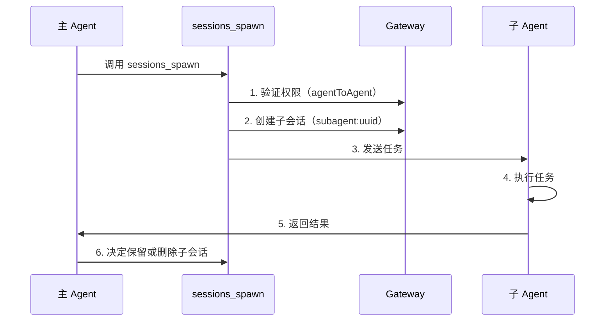

# 会话管理与多 Agent：会话隔离、子 Agent 协作和上下文压缩

## 学完你能做什么

- 理解 Clawdbot 的会话模型和会话键结构
- 配置不同 Agent 之间的会话隔离
- 使用子 Agent 完成隔离任务
- 管理上下文窗口，避免超出模型限制
- 掌握会话重置和压缩的最佳实践

## 你现在的困境

当你的 AI 助手同时服务于多个用户、多个渠道时，你可能会遇到这些问题：

- **会话串扰**：不同用户的消息混在一起，AI 记不住各自的历史
- **上下文爆炸**：长时间对话后，模型开始"失忆"或响应变慢
- **子任务混乱**：主 Agent 调用子任务时，没有清晰的隔离边界
- **资源浪费**：所有 Agent 共享同一套会话，导致存储和计算资源无法有效利用

Clawdbot 的**会话管理系统**就是为了解决这些问题而设计的。

## 核心思路

**会话**是 Clawdbot 的核心抽象单元——每个会话代表一段独立的对话历史，拥有自己的消息记录、元数据和生命周期。

Clawdbot 通过**会话键（session key）**来标识和隔离不同的会话。会话键不仅区分不同的对话对象（用户、群组、频道），还区分不同的 Agent 实例。

::: info 什么是会话键？

会话键是一个字符串标识符，用于唯一标识一个会话。格式示例：
- `agent:main:main`（主 Agent 的主会话）
- `agent:work:main`（工作 Agent 的主会话）
- `agent:main:whatsapp:group:123`（WhatsApp 群组会话）
- `cron:job-id`（定时任务会话）

Clawdbot 根据会话键将消息路由到正确的 Agent，并维护独立的对话历史。
:::

## 会话模型

### 会话键的组成

Clawdbot 使用结构化的会话键来标识不同类型的会话：

| 会话类型 | 键格式 | 示例 | 说明 |
|---------|---------|-------|------|
| **主会话** | `agent:<agentId>:<mainKey>` | `agent:main:main` | 每个 Agent 的默认主会话 |
| **直接消息** | `agent:<agentId>:dm:<peerId>` | `agent:main:dm:+15551234567` | 按 `dmScope` 配置隔离 |
| **群组/频道** | `agent:<agentId>:<channel>:group:<id>` | `agent:main:whatsapp:group:123` | 群组和频道自动隔离 |
| **子 Agent** | `agent:<agentId>:subagent:<uuid>` | `agent:main:subagent:a1b2c3d4` | 子 Agent 的隔离会话 |
| **定时任务** | `cron:<jobId>` | `cron:daily-report` | Cron 任务的专用会话 |
| **Webhook** | `hook:<uuid>` | `hook:xyz789` | Webhook 触发的会话 |

### 会话存储

会话数据存储在两个位置：

```bash
# 会话索引（元数据）
~/.clawdbot/agents/<agentId>/sessions/sessions.json

# 消息历史（每会话一个文件）
~/.clawdbot/agents/<agentId>/sessions/<sessionId>.jsonl
```

**sessions.json** 是一个映射表，记录：
- 会话键 → 会话元数据（sessionId, updatedAt, model, tokens 等）
- 删除这些条目是安全的，它们会在需要时自动重建

**JSONL 文件**存储完整的对话历史，每行一条消息记录。

::: tip Gateway 是单一真相源

所有会话状态由 Gateway 拥有。UI 客户端（macOS 应用、WebChat）必须从 Gateway 查询会话列表和 token 计数，而不是直接读取本地文件。

在远程模式下，你关心的会话存储在远程 Gateway 主机上，而不是你的 Mac 上。
:::

## 会话隔离机制

### 单 Agent 模式（默认）

如果不做任何配置，Clawdbot 运行单个 Agent：
- `agentId` 默认为 `main`
- 所有 DM 会话共享主会话键（`agent:main:main`）
- 这意味着**同一个用户从不同渠道发来的消息会进入同一个会话**

### 多 Agent 模式

**多个 Agent = 多个隔离的大脑**

每个 Agent 拥有自己独立的：
- **Workspace**（工作区文件、AGENTS.md、SOUL.md）
- **State directory**（认证配置、模型注册表）
- **Session store**（聊天历史和路由状态）

#### 为什么要多 Agent？

| 场景 | 解决方案 |
|--------|---------|
| **多用户共享服务器** | 每个用户有独立 Agent，会话完全隔离 |
| **不同渠道不同人格** | WhatsApp 用日常 Agent，Telegram 用深度工作 Agent |
| **权限分离** | 家庭 Agent 限制工具，个人 Agent 完全访问 |
| **不同环境** | 开发 Agent、生产 Agent 完全隔离 |

#### 配置多 Agent

**第 1 步：添加新 Agent**

```bash
clawdbot agents add work
```

这会在 `~/.clawdbot/agents/work/` 创建新的 Agent 目录。

**第 2 步：配置路由规则**

在 `~/.clawdbot/clawdbot.json` 中添加 `bindings`：

```json5
{
  agents: {
    list: [
      { id: "home", workspace: "~/clawd-home", name: "Home" },
      { id: "work", workspace: "~/clawd-work", name: "Work" }
    ]
  },
  bindings: [
    { agentId: "home", match: { channel: "whatsapp", accountId: "personal" } },
    { agentId: "work", match: { channel: "whatsapp", accountId: "biz" } }
  ]
}
```

**第 3 步：验证配置**

```bash
clawdbot agents list --bindings
```

#### 路由规则（确定性匹配）

当消息到达时，Clawdbot 按**最具体优先**的顺序匹配规则：

1. **peer** 匹配（精确的 DM/group/channel id）
2. **guildId**（Discord）
3. **teamId**（Slack）
4. **accountId** 匹配
5. 渠道级别匹配（`accountId: "*"`）
6. 回退到默认 Agent

::: warning 注意绑定顺序

绑定列表中的顺序很重要！更具体的规则应该放在前面。

例如，如果你想将一个特定 DM 路由到 `work` Agent，其他 WhatsApp DM 路由到 `home` Agent，必须先写 peer 规则：
```json5
{
  bindings: [
    { agentId: "work", match: { channel: "whatsapp", peer: { kind: "dm", id: "+15551234567" } } },
    { agentId: "home", match: { channel: "whatsapp" } }
  ]
}
```
:::

### DM 范围控制

使用 `session.dmScope` 控制直接消息如何分组：

| 选项 | 行为 | 适用场景 |
|------|-------|---------|
| `main`（默认） | 所有 DM 共享主会话 | 单用户多渠道 |
| `per-peer` | 按发送者 ID 隔离 | 多用户环境 |
| `per-channel-peer` | 按渠道 + 发送者隔离 | 共享收件箱 |

配置示例：

```json5
{
  session: {
    dmScope: "per-channel-peer"  // 每个渠道的每个用户独立会话
  }
}
```

### 身份链接（Identity Links）

如果同一个用户使用多个平台（如 WhatsApp 和 Telegram），你可以通过 `session.identityLinks` 让他们共享会话：

```json5
{
  session: {
    identityLinks: {
      alice: ["telegram:123456789", "discord:987654321012345678"]
    }
  }
}
```

这样，Alice 从 Telegram 或 Discord 发来的消息都会进入 `agent:<agentId>:dm:alice` 会话。

## 子 Agent 协作

### 什么是子 Agent

**子 Agent**是一个在隔离会话中运行的 Agent 实例，用于执行特定任务而不影响主会话的上下文。

典型使用场景：
- **代码审查**：子 Agent 分析代码，返回摘要
- **数据提取**：子 Agent 从长文档中提取信息
- **并行任务**：主 Agent 等待时，子 Agent 在后台运行
- **沙箱隔离**：在受限环境中执行不信任的任务

### sessions_spawn 工具

使用 `sessions_spawn` 工具创建子 Agent：

```json
{
  "task": "分析这个文档并提取关键要点",
  "label": "文档分析",
  "model": "anthropic/claude-opus-4-5",
  "thinking": "detailed",
  "runTimeoutSeconds": 300,
  "cleanup": "keep"
}
```

参数说明：

| 参数 | 类型 | 必填 | 说明 |
|------|------|-------|------|
| `task` | string | ✅ | 子 Agent 的任务描述 |
| `label` | string | ❌ | 可读的任务标签（用于追踪） |
| `agentId` | string | ❌ | 目标 Agent ID（默认当前 Agent） |
| `model` | string | ❌ | 模型覆盖 |
| `thinking` | string | ❌ | 思考级别（`minimal`/`standard`/`detailed`） |
| `runTimeoutSeconds` | number | ❌ | 超时时间（秒） |
| `cleanup` | string | ❌ | 任务完成后清理策略（`keep`/`delete`） |

### 子 Agent 生命周期



**生命周期步骤**：

1. **权限检查**：如果跨 Agent 调用，验证 `tools.agentToAgent.allow` 配置
2. **创建子会话**：生成唯一的 `agent:<agentId>:subagent:<uuid>` 键
3. **执行任务**：子 Agent 在隔离会话中完成任务
4. **返回结果**：结果流式返回到主 Agent
5. **清理策略**：
   - `cleanup: "keep"`：保留子会话用于后续检查
   - `cleanup: "delete"`：自动删除子会话

### 配置 Agent 间通信

默认情况下，Agent 间通信是禁用的。需要显式启用：

```json5
{
  tools: {
    agentToAgent: {
      enabled: true,
      allow: ["home", "work", "family"]
    }
  }
}
```

权限说明：
- `enabled: false`：完全禁用 Agent 间通信
- `allow: ["*"]`：允许任何 Agent
- `allow: ["home", "work"]`：只允许特定 Agent

::: danger 安全提醒

子 Agent 继承父 Agent 的部分上下文，但**不会**获得完整的父会话历史。这既是特性（节省 token），也是限制（子 Agent 不知道完整上下文）。

对于敏感操作，考虑在主会话中完成而不是通过子 Agent。
:::

## 上下文压缩

### 什么是上下文窗口

每个 AI 模型都有一个**上下文窗口（context window）**——它能在一次推理中看到的最大 token 数量。

长时间对话会累积消息和工具结果。一旦接近模型限制，Clawdbot 会**压缩（compact）**历史以腾出空间。

### 自动压缩

当会话接近或超出上下文窗口时，Clawdbot 自动触发压缩：

- **压缩前**：先运行一个**静默记忆刷新**，提示模型将持久化笔记写入磁盘（如果工作区可写）
- **压缩过程**：将旧对话总结为压缩摘要，保留最近的消息
- **持久化**：压缩结果写入 JSONL 历史文件
- **重试**：使用压缩后的上下文重试原始请求

你会看到：
- `🧹 Auto-compaction complete`（在详细模式下）
- `/status` 显示 `🧹 Compactions: <count>`

### 手动压缩

使用 `/compact` 命令手动触发压缩：

```
/compact
```

你可以添加压缩指令：

```
/compact Focus on decisions and open questions
```

这会指导 AI 在总结时关注特定内容。

### 压缩 vs 剪枝

| 操作 | 作用 | 持久化 | 位置 |
|------|-------|---------|------|
| **压缩（Compaction）** | 总结旧对话 | ✅ | 写入 JSONL |
| **剪枝（Pruning）** | 移除旧工具结果 | ❌ | 仅内存中 |

::: tip 压缩策略建议

- **压缩**：保存信息摘要，适合需要回顾历史
- **剪枝**：临时清理，适合减少单次请求的 token 使用
- **/new**：完全清空会话，用于开始新主题

根据你的使用习惯选择合适的策略。
:::

### 压缩配置

在 `~/.clawdbot/clawdbot.json` 中配置压缩行为：

```json5
{
  agents: {
    defaults: {
      compaction: {
        enabled: true,
        threshold: 0.9,  // 上下文使用 90% 时触发
        trigger: "auto"  // auto/manual
      }
    }
  }
}
```

## 跟我做：配置会话管理

让我们通过一个实际场景来配置会话管理。

### 场景

你有一个 WhatsApp 号码，希望：
1. 个人联系人使用 `home` Agent（日常对话）
2. 工作群组使用 `work` Agent（专业响应）
3. 启用子 Agent 用于隔离任务

