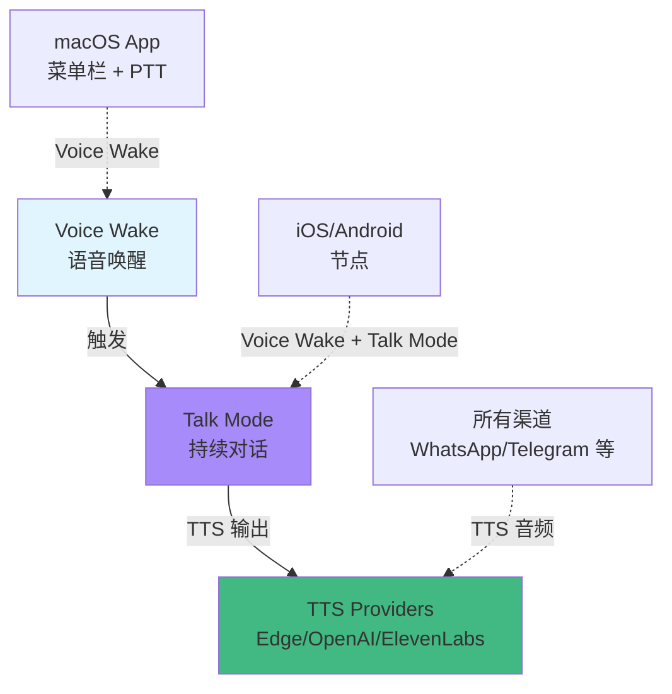

# 语音唤醒与文本转语音

## 学完你能做什么

- 配置 Voice Wake 语音唤醒，支持 macOS/iOS/Android 节点
- 使用 Talk Mode 进行持续语音对话（语音输入 → AI → 语音输出）
- 配置多个 TTS 提供商（Edge、OpenAI、ElevenLabs）和自动故障切换
- 自定义语音唤醒词、TTS 声音和对话参数
- 排查语音功能常见问题（权限、音频格式、API 错误）

## 你现在的困境

语音交互很方便，但配置起来可能让你困惑：

- 应该用哪个 TTS 提供商？Edge 免费但质量一般，ElevenLabs 质量高但需要付费
- Voice Wake 和 Talk Mode 有什么区别？什么时候用哪个？
- 如何设置自定义唤醒词而不是默认的"clawd"？
- 在不同设备（macOS、iOS、Android）上如何同步语音配置？
- TTS 输出格式为什么有讲究？为什么 Telegram 用 Opus 而其他渠道用 MP3？

## 什么时候用这一招

- **Voice Wake**：需要 hands-free 语音助手体验时。比如在 macOS 或 iOS/Android 上直接说话唤醒 AI，无需键盘操作。
- **Talk Mode**：需要持续语音对话时。比如开车、做饭、走路时，用语音和 AI 多轮对话。
- **TTS 配置**：希望 AI 回复通过语音播放时。比如为老人或视障用户提供语音助手，或个人语音助手体验。
- **自定义语音**：对默认语音不满意时。比如调整语速、音调、稳定性，或切换到中文语音模型。

## 🎒 开始前的准备

::: warning 前置条件
本教程假设你已完成 [快速开始](../../start/getting-started/)，已安装并启动了 Gateway。
::

- Gateway 守护进程正在运行
- 至少配置了一个 AI 模型提供商（Anthropic 或 OpenAI）
- **对于 Voice Wake**：macOS/iOS/Android 设备已安装并连接到 Gateway
- **对于 Talk Mode**：iOS 或 Android 节点已连接（macOS 菜单栏应用仅支持 Voice Wake）
- **对于 ElevenLabs TTS**：准备好 ElevenLabs API Key（如需高质量语音）
- **对于 OpenAI TTS**：准备好 OpenAI API Key（可选，Edge TTS 免费但质量一般）

::: info 权限提醒
Voice Wake 和 Talk Mode 需要以下权限：
- **麦克风权限**：语音输入必需
- **语音识别权限**（Speech Recognition）：语音转文字
- **辅助功能权限**（macOS）：全局快捷键监听（如 Cmd+Fn push-to-talk）
::

## 核心思路

### 三大语音功能分工明确

Clawdbot 的语音功能分为三个独立模块，但协同工作：



**核心区别**：

| 功能 | 用途 | 支持平台 | 触发方式 | 对话轮次 |
|-----|-------|----------|---------|---------|
| **Voice Wake** | 单次语音命令 | macOS/iOS/Android | 唤醒词（如"clawd"） | 单次 |
| **Talk Mode** | 持续语音对话 | iOS/Android | 手动开启 | 多轮（循环） |
| **TTS** | 文本转语音 | 所有渠道 | AI 回复自动触发 | 无（被动） |

### Voice Wake：全局唤醒词系统

**关键设计**：唤醒词是 **Gateway 全局配置**，不是节点本地配置。

- **存储位置**：`~/.clawdbot/settings/voicewake.json`（Gateway 主机）
- **默认唤醒词**：`["clawd", "claude", "computer"]`
- **同步机制**：任何节点/macOS App 修改唤醒词后，Gateway 广播到所有设备

```json
{
  "triggers": ["clawd", "claude", "computer"],
  "updatedAtMs": 1737489200000
}
```

**Push-to-Talk（按住说话）**：
- macOS 支持按住 `Cmd+Fn` 或 `右 Option` 键直接开始语音输入，无需唤醒词
- iOS/Android 通过 UI 按钮支持

### Talk Mode：语音对话循环

Talk Mode 是一个持续语音对话循环：

```
1) 监听语音输入（语音识别）
2) 发送文字到 AI 模型（chat.send）
3) 等待 AI 回复
4) 通过 TTS 播放回复（流式播放）
5) 回到步骤 1（循环）
```

**关键特性**：

| 特性 | 描述 | 平台支持 |
|-----|-------|---------|
| **中断播放** | 用户说话时立即停止 TTS 播放 | iOS/Android |
| **状态转换** | Listening → Thinking → Speaking 三态循环 | iOS/Android |
| **JSON 指令** | AI 可在回复中嵌入 JSON 控制语音参数 | 所有 |
| **流式 TTS** | ElevenLabs 流式 API，低延迟播放 | iOS/Android/macOS |

### TTS：多提供商自动故障切换

Clawdbot 支持三个 TTS 提供商，按优先级自动故障切换：

```typescript
// 优先级顺序（源码：src/tts/tts.ts:482-484）
const providers = [primaryProvider, ...otherProviders];

// 示例：主选 ElevenLabs，失败后自动尝试 OpenAI，最后 Edge
providers = ["elevenlabs", "openai", "edge"];
```

| 提供商 | 质量 | 速度 | 成本 | API Key | 推荐场景 |
|-------|-------|------|------|---------|---------|
| **ElevenLabs** | ⭐⭐⭐⭐⭐ | ⭐⭐⭐⭐ | 付费 | 高质量语音、Talk Mode（流式） |
| **OpenAI** | ⭐⭐⭐⭐ | ⭐⭐⭐ | 付费 | 标准质量、稳定可靠 |
| **Edge TTS** | ⭐⭐⭐ | ⭐⭐ | 免费 | 默认免费、测试、备用 |

::: info Edge TTS 说明
Edge TTS 使用微软 Edge 在线神经 TTS 服务（通过 `node-edge-tts`），无需 API Key，但无官方 SLA。适合作为免费备用，不建议用于生产环境。
::

### 输出格式：渠道决定格式

TTS 输出格式由**目标渠道**决定，而非配置：

| 渠道 | 输出格式 | 格式说明 | 原因 |
|-------|---------|---------|------|
| **Telegram** | Opus (`opus_48000_64`) | 48kHz/64kbps | Telegram 语音消息要求 Opus |
| **其他渠道** | MP3 (`mp3_44100_128`) | 44.1kHz/128kbps | 通用兼容性好 |
| **Talk Mode** | PCM (`pcm_44100` / `pcm_24000`) | 原始音频流 | iOS/Android AudioTrack 播放 |

::: tip 自动格式选择
Clawdbot 会自动根据渠道选择格式，你无需手动配置。但可以通过 `messages.tts.edge.outputFormat` 自定义 Edge TTS 输出。
::

## 跟我做

### 第 1 步：配置基础 TTS（最简配置）

**为什么**
Edge TTS 是零配置起点，无需 API Key，适合快速测试。

编辑 `~/.clawdbot/clawdbot.json`：

```yaml
messages:
  tts:
    auto: "always"  # 开启自动 TTS
    provider: "edge"  # 使用 Edge TTS
    edge:
      enabled: true
      voice: "zh-CN-XiaoxiaoNeural"  # 中文语音
      lang: "zh-CN"
      outputFormat: "audio-24khz-48kbitrate-mono-mp3"
```

**你应该看到**：
- AI 回复自动附加音频文件
- 渠道（如 WhatsApp/Telegram）收到语音消息或音频链接
- 默认语音为英文（`en-US-MichelleNeural`），如需中文需修改 `voice` 字段

::: tip 中文语音示例
Edge TTS 支持中文语音，示例 ID：
- `zh-CN-XiaoxiaoNeural`（女声，温柔）
- `zh-CN-YunxiNeural`（男声）
- `zh-CN-YunyangNeural`（男声，沉稳）
::

**重启 Gateway**：

```bash
clawdbot gateway restart
```

### 第 2 步：配置 ElevenLabs TTS（推荐高质量）

**为什么**
ElevenLabs 提供业界最佳语音质量和表现力，支持流式 TTS（低延迟），适合 Talk Mode。

#### 2.1 获取 API Key

访问 [ElevenLabs 控制台](https://elevenlabs.io/app)，创建账户并生成 API Key。

#### 2.2 配置认证

**方式 A：环境变量（推荐）**

```bash
export ELEVENLABS_API_KEY="xi_..."
# 或使用别名
export XI_API_KEY="xi_..."
```

**方式 B：配置文件**

编辑 `~/.clawdbot/clawdbot.json`：

```yaml
messages:
  tts:
    auto: "always"
    provider: "elevenlabs"  # 主选 ElevenLabs
    elevenlabs:
      apiKey: "xi_..."  # 可选，优先用环境变量
      baseUrl: "https://api.elevenlabs.io"
      voiceId: "pMsXgVXv3BLzUgSXRplE"  # 默认语音
      modelId: "eleven_multilingual_v2"  # 多语言模型
      voiceSettings:
        stability: 0.5  # 稳定性（0-1）
        similarityBoost: 0.75  # 相似度提升（0-1）
        style: 0.0  # 风格（0-1）
        useSpeakerBoost: true
        speed: 1.0  # 语速（0.5-2.0）
```

**你应该看到**：
- AI 回复音频质量明显提升
- Telegram 收到圆形语音消息气泡（Opus 格式）
- 可以通过 `/tts provider edge` 切换回备用提供商

### 第 3 步：配置 OpenAI TTS 作为备用

**为什么**
配置备用提供商确保主提供商（如 ElevenLabs）遇到 API 错误或配额限制时自动切换。

编辑 `~/.clawdbot/clawdbot.json`：

```yaml
messages:
  tts:
    auto: "always"
    provider: "elevenlabs"  # 主选
    openai:
      apiKey: "sk-..."  # 可选，优先用环境变量
      model: "gpt-4o-mini-tts"  # OpenAI TTS 模型
      voice: "alloy"  # 语音 ID
```

**自动故障切换逻辑**（源码：`src/tts/tts.ts:1097-1234`）：

```typescript
// 尝试顺序
for (const provider of ["elevenlabs", "openai", "edge"]) {
  try {
    // 尝试 provider
    if (provider === "elevenlabs") await elevenLabsTTS(...);
    if (provider === "openai") await openaiTTS(...);
    if (provider === "edge") await edgeTTS(...);
    return { success: true, ... };  // 成功则返回
  } catch (err) {
    lastError = `${provider}: ${err.message}`;
    // 继续尝试下一个 provider
  }
}
```

### 第 4 步：配置 Voice Wake 唤醒词

**为什么**
自定义唤醒词让语音助手更个性化，或避免误触发（如默认"computer"可能与日常对话冲突）。

#### 4.1 通过 macOS App 配置

1. 打开 macOS 菜单栏应用
2. 进入 **Settings** → **Voice Wake**
3. 编辑 **Trigger Words** 表格
4. 添加自定义唤醒词（如"助手"、"小助"）
5. 保存自动同步到 Gateway

**你应该看到**：
- `~/.clawdbot/settings/voicewake.json` 更新
- 所有连接的节点（iOS/Android）收到新唤醒词
- 说出自定义唤醒词后，语音识别器激活

#### 4.2 通过 Gateway RPC 配置（高级）

```bash
# 获取当前唤醒词
clawdbot gateway rpc voicewake.get

# 设置新唤醒词
clawdbot gateway rpc voicewake.set '{"triggers":["小助","助手"]}'
```

::: warning 唤醒词限制
- 每个唤醒词建议 2-4 个音节（如"clawd" 2 音节）
- 过长唤醒词（如"嘿你好我的AI助手"）难以识别
- 默认最多允许 10 个唤醒词（可修改源码调整）
::

### 第 5 步：使用 Talk Mode（iOS/Android）

**为什么**
Talk Mode 提供真正的语音助手体验：持续对话、中断播放、实时反馈。

#### 5.1 前置条件检查

- ✅ iOS 或 Android 节点已连接到 Gateway
- ✅ 已配置 ElevenLabs API Key（推荐用于流式 TTS）
- ✅ 节点已授予麦克风和语音识别权限

::: info Talk Mode 平台支持
| 平台 | Talk Mode | Voice Wake |
|-------|----------|------------|
| macOS | ❌ 不支持 | ✅ 支持 |
| iOS | ✅ 支持 | ✅ 支持 |
| Android | ✅ 支持 | ✅ 支持 |

Talk Mode 需要流式 TTS，推荐 ElevenLabs。Edge TTS 和 OpenAI 不支持流式播放。
::

#### 5.2 通过 iOS App 开启 Talk Mode

1. 打开 iOS Clawdbot 应用
2. 点击 **Talk** 按钮开启
3. 授予麦克风权限（如首次使用）
4. 看到覆盖层显示 **Listening**（云朵脉动）

#### 5.3 开始语音对话

**流程体验**：

```
Listening（倾听）
  → 识别到语音
    → Thinking（思考中，AI 生成回复）
      → Speaking（播放 TTS，云朵扩散）
        → 回到 Listening（循环）
```

**中断功能**：
- AI 播放时，你可以直接开始说话
- TTS 自动停止，新的语音识别立即开始
- AI 会看到中断时间戳，在下一轮对话中知道用户打断

#### 5.4 AI 语音指令控制

AI 可以在回复中嵌入 JSON 指令控制语音参数（源码：`docs/nodes/talk.md:22-41`）：

**示例回复**：

```text
好的，这是你要的内容。
{"voice":"21m00Tcm4TlvDq8iq1X","speed":1.2}
开始讲解...
```

**支持的参数**：

| 参数 | 类型 | 说明 |
|-----|------|------|
| `voice` / `voice_id` | 字符串 | ElevenLabs Voice ID |
| `model` / `model_id` | 字符串 | TTS 模型 ID |
| `speed` | 数字 | 语速（0.5-2.0） |
| `stability` | 数字 | 稳定性（0-1） |
| `similarityBoost` | 数字 | 相似度提升（0-1） |
| `once` | 布尔 | 仅当前回复有效 |

### 第 6 步：配置 TTS 模式和限制

**为什么**
控制何时触发 TTS 和处理长回复，避免不必要的费用和延迟。

编辑 `~/.clawdbot/clawdbot.json`：

```yaml
messages:
  tts:
    auto: "inbound"  # 触发模式：off/always/inbound/tagged
    mode: "final"  # TTS 模式：final（仅最终回复）/all（包括工具调用）
    maxTextLength: 4000  # TTS 输入字符数限制
    summaryModel: "openai/gpt-4o-mini"  # 长文本摘要模型
    modelOverrides:
      enabled: true  # 允许 AI 发出 TTS 指令
```

**TTS 自动模式**（源码：`docs/tts.md:198-203`）：

| 模式 | 描述 | 使用场景 |
|-----|-------|---------|
| `off` | 关闭自动 TTS | 文本交互 |
| `always` | 所有回复都转语音 | 语音助手 |
| `inbound` | 仅回复语音消息时转语音 | 对话式语音 |
| `tagged` | 仅回复包含 `[[tts]]` 标签时转语音 | 精准控制 |

**长文本自动摘要**（源码：`src/tts/tts.ts:825-903`）：

当 AI 回复超过 `maxLength`（默认 1500 字符）时：
1. 调用 `summaryModel` 摘要（默认使用主 AI 模型）
2. 将文本压缩到约 `maxLength` 长度
3. 对压缩后的文本执行 TTS

**禁用摘要**：

```bash
# 通过命令行禁用
/tts summary off

# 或在配置中禁用
messages:
  tts:
    auto: "always"
# 不设置 summaryModel，或设置 summaryModel: null
```

### 第 7 步：验证配置

**为什么**
确保所有语音功能正常工作，避免权限或 API 问题。

#### 7.1 验证 TTS

发送测试消息：

```bash
clawdbot message send --to +1234567890 --message "请用中文说：你好，这是语音测试"
```

**你应该看到**：
- 渠道收到语音消息（非文本）
- 音频质量符合配置的提供商
- 无错误日志

**检查 TTS 状态**：

```bash
clawdbot gateway rpc tts.status
```

#### 7.2 验证 Voice Wake（macOS）

1. 确保麦克风权限已授予
2. 说出唤醒词（如"clawd"）
3. 等待听到提示音（默认 macOS "Glass" 声）
4. 看到覆盖层显示部分文字
5. 停止说话，看到文字发送

**你应该看到**：
- 唤醒词触发后覆盖层立即出现
- 语音识别实时显示部分文字
- 停止说话后自动发送

#### 7.3 验证 Talk Mode（iOS/Android）

1. 打开节点应用
2. 点击 **Talk** 按钮
3. 看到状态从 **Listening** → **Thinking** → **Speaking** 循环
4. 尝试中断：AI 说话时直接说话
5. 观察 TTS 是否立即停止

**你应该看到**：
- 三态循环流畅转换
- 中断功能正常工作
- AI 回复通过 TTS 播放（非文本）

## 检查点 ✅

- [ ] TTS 基础配置完成（Edge 或 ElevenLabs）
- [ ] 至少一个渠道收到 AI 语音回复
- [ ] Voice Wake 唤醒词已自定义（如需要）
- [ ] iOS/Android Talk Mode 可以启动并持续对话
- [ ] TTS 中断功能正常工作（Talk Mode）
- [ ] 可以通过 `/tts` 命令切换提供商
- [ ] Gateway 日志无 TTS 相关错误

## 踩坑提醒

### Edge TTS 不可用

**问题**：TTS 失败，日志显示 "edge: disabled" 或 "edge output format failed"

**原因**：
- `messages.tts.edge.enabled: false`
- 配置的 `outputFormat` 不被 Edge 服务支持（源码：`docs/tts.md:26-30`）

**修复**：

```yaml
# ✅ 启用 Edge TTS
messages:
  tts:
    edge:
      enabled: true
      outputFormat: "audio-24khz-48kbitrate-mono-mp3"  # 安全格式
```

::: warning Edge 格式限制
Edge TTS 不支持所有 Microsoft Speech 格式。推荐使用 `audio-24khz-48kbitrate-mono-mp3` 或 `webm-24khz-16bit-mono-opus`。
::

### ElevenLabs API Key 无效

**问题**：TTS 失败，日志显示 "ElevenLabs API error (401)"

**原因**：
- API Key 格式错误（应为 `xi_...`，不是 `sk-...`）
- API Key 已过期或被撤销

**修复**：

```bash
# 1. 验证 API Key 格式
echo $ELEVENLABS_API_KEY | grep "^xi_"

# 2. 重新生成 API Key
# 访问 https://elevenlabs.io/app/settings/api-keys

# 3. 测试新 Key
curl -H "xi-api-key: $ELEVENLABS_API_KEY" \
  https://api.elevenlabs.io/v1/user
```

### Voice Wake 不响应

**问题**：说出唤醒词后无反应

**原因**：
- 麦克风权限未授予
- 语音识别服务未启动（macOS 重启后失效）
- 唤醒词过于复杂或发音模糊

**诊断步骤**：

```bash
# 1. 检查 Gateway 日志
clawdbot gateway logs

# 2. 查看当前唤醒词
cat ~/.clawdbot/settings/voicewake.json

# 3. macOS：检查权限
# 系统设置 → 隐私与安全性 → 麦克风
# 确保 Clawdbot 已勾选

# 4. macOS：检查语音识别
# 系统设置 → 键盘 → 听写
# 确保已启用
```

**修复**：

```bash
# 重启 Gateway 守护进程
clawdbot gateway restart

# 恢复默认唤醒词
clawdbot gateway rpc voicewake.set '{"triggers":[]}'

# macOS：重启语音识别服务
sudo killall -9 speechrecognitiond
```

### Talk Mode 无法启动

**问题**：iOS/Android 点击 Talk 按钮后无反应或提示错误

**原因**：
- 无连接的移动节点（仅 iOS/Android 支持 Talk Mode）
- ElevenLabs API Key 未配置（Talk Mode 推荐流式 TTS）

**检查**：

```bash
# 查看已连接节点
clawdbot nodes list

# 测试 ElevenLabs API Key
clawdbot gateway rpc tts.providers
# 应该看到 elevenlabs 在可用列表中
```

**修复**：

1. 确保 iOS/Android 节点已连接（在 Gateway 主机或通过 macOS App）
2. 配置 ElevenLabs API Key（如上第 2 步）
3. 重试启动 Talk Mode

### TTS 输出质量差

**问题**：语音质量模糊、卡顿、有杂音

**原因**：
- 使用了 Edge TTS（免费但质量一般）
- 输出格式不匹配（如低比特率）
- 网络延迟导致流式播放卡顿

**优化建议**：

```yaml
# ✅ 使用高质量提供商
messages:
  tts:
    provider: "elevenlabs"
    elevenlabs:
      voiceId: "21m00Tcm4TlvDq8iq1X"  # 尝试不同语音
      voiceSettings:
        stability: 0.7  # 提高稳定性（减少卡顿）
        useSpeakerBoost: true  # 增强清晰度
```

::: tip 语音选择
ElevenLabs 提供不同语言和风格的语音：
- **中文**：`21m00Tcm4TlvDq8iq1X`（女声）、`ErXwobaKq9rZ5Q4FmQ`（男声）
- **英文**：`pMsXgVXv3BLzUgSXRplE`（中性）、`XB0fD4X1Wf7Jq3hF9I`（温暖）
访问 [ElevenLabs Voice Lab](https://elevenlabs.io/app/speech-synthesis/voices) 试听。
::

### 摘要功能导致信息丢失

**问题**：长回复被过度摘要，关键信息丢失

**原因**：
- `maxLength` 设置过小（默认 1500 字符）
- 摘要模型理解偏差

**调整**：

```yaml
messages:
  tts:
    maxTextLength: 4000  # 提高限制
    summaryModel: "anthropic/claude-opus-4-5"  # 使用更强模型摘要
```

或禁用摘要（但可能导致 TTS 失败）：

```bash
# 通过命令行禁用
/tts summary off
```

::: info 摘要触发条件
仅当文本超过 `maxLength` 且 `summarize` 启用时才摘要。如果摘要失败，TTS 跳过，返回原始文本。
::

## 高级配置

### AI 驱动的 TTS 指令

**为什么**
让 AI 根据内容动态调整语音参数（如严肃内容用低语速、幽默内容用高语速）。

**启用 AI 指令**（源码：`docs/tts.md:232-274`）：

```yaml
messages:
  tts:
    modelOverrides:
      enabled: true  # 默认开启
      allowText: true  # 允许 AI 提供表达标签
      allowVoice: true  # 允许 AI 切换语音
      allowSpeed: true  # 允许 AI 调整语速
```

**AI 指令示例**：

```text
好的，让我严肃地回答这个问题。
[[tts:speed=0.8 stability=0.8]]
这是一个非常重要的决定...
[[tts:text]](笑声) 当然，开个玩笑啦。[[/tts:text]]
```

**指令解析**（源码：`src/tts/tts.ts:553-752`）：

- `[[tts:speed=0.8]]`：设置当前回复语速为 0.8（默认 1.0）
- `[[tts:text]]...[[/tts:text]]`：表达性文本（如笑声、音效描述），仅在 TTS 中出现，不影响文字回复

### 禁用特定指令（安全）

**原因**：限制 AI 的控制范围，防止意外切换语音或调整参数。

```yaml
messages:
  tts:
    modelOverrides:
      enabled: true
      allowProvider: false  # 禁止 AI 切换提供商
      allowVoice: false  # 禁止 AI 切换语音 ID
      allowSeed: false  # 禁止 AI 设置随机种子
```

### Push-to-Talk 快捷键（macOS）

**为什么**
Push-to-Talk 比语音唤醒更精确，避免误触发。

配置（源码：`docs/platforms/mac/voicewake.md:10-38`）：

1. 打开 macOS App Settings
2. 启用 **Hold Cmd+Fn to talk**（需要 macOS ≥ 26）
3. 或使用 **右 Option** 键（默认启用）

**使用**：
1. 按住 `Cmd+Fn` 或 `右 Option`
2. 看到覆盖层显示实时语音识别文字
3. 松开按键，文字自动发送到 AI

::: info 权限要求
Push-to-Talk 需要 **辅助功能**（Accessibility）权限监听全局快捷键。
::

### 环境变量优先级

**为什么**
通过环境变量管理 API Key，避免提交敏感信息到 Git。

**优先级顺序**（源码：`src/tts/tts.ts:467-477`）：

```typescript
// 1. 配置文件中的 API Key
config.elevenlabs.apiKey

// 2. 环境变量
process.env.ELEVENLABS_API_KEY || process.env.XI_API_KEY
process.env.OPENAI_API_KEY

// 3. OpenAI TTS 自定义端点（用于 Kokoro 等兼容服务）
process.env.OPENAI_TTS_BASE_URL
```

**示例配置**：

```bash
# ~/.zshrc 或 ~/.bashrc
export ELEVENLABS_API_KEY="xi_..."
export OPENAI_API_KEY="sk-..."
export CLAWDBOT_TTS_PREFS="~/.clawdbot/settings/tts.json"
```

## 常见问题

### Voice Wake vs Talk Mode 有什么区别？

**Voice Wake**：
- 单次触发
- 说唤醒词 → 识别 → 发送 → 结束
- 支持 macOS/iOS/Android
- 适合快速命令（如"clawd，今天天气"）

**Talk Mode**：
- 持续循环
- 识别 → AI → 播放 → 识别 → AI → 播放...
- 仅支持 iOS/Android
- 适合多轮对话（如"你好 → AI 回答 → 再问 → AI 回答..."）

### 如何选择 TTS 提供商？

| 场景 | 推荐提供商 |
|-------|-----------|
| **免费测试** | Edge TTS（无需 API Key） |
| **高质量语音** | ElevenLabs（最佳表现力） |
| **稳定可靠** | OpenAI（标准质量，API 稳定） |
| **Talk Mode** | ElevenLabs（流式 TTS） |
| **生产环境** | ElevenLabs 或 OpenAI（有 SLA 支持） |

::: tip 推荐配置
大多数用户配置：
- 主选：ElevenLabs（高质量）
- 备选：OpenAI（稳定）
- 应急：Edge TTS（免费）
::

### 为什么 Telegram 语音是圆形气泡，其他渠道是链接？

**Telegram 要求**：
- 语音消息必须是 **Opus 格式**（`opus_48000_64`）
- Opus 格式才能触发圆形语音气泡 UX

**其他渠道**：
- 使用标准 **MP3 格式**（`mp3_44100_128`）
- 显示为可下载的音频文件链接

**自动处理**：
Clawdbot 自动根据渠道选择格式，你无需手动配置（源码：`src/tts/tts.ts:454-457`）。

### TTS 摘要多长时间？

| 提供商 | 典型延迟 |
|-------|----------|
| Edge TTS | 1-3 秒（取决于网络） |
| OpenAI | 2-4 秒（标准 API） |
| ElevenLabs（流式） | < 1 秒（Talk Mode 实时播放） |

**影响延迟的因素**：
- 网络速度（特别是 Edge TTS）
- 文本长度
- 提供商服务器负载
- 流式播放缓冲（Talk Mode）

### 如何查看 TTS 调试信息？

```bash
# 查看 Gateway 日志（包含 TTS 转换时间）
clawdbot gateway logs | grep TTS

# 查看上次 TTS 尝试状态
clawdbot gateway rpc tts.status

# 检查 TTS 配置
cat ~/.clawdbot/clawdbot.json | grep -A 20 "messages.tts"
```

**日志示例**：

```
TTS: converting text (120 chars) with provider elevenlabs
TTS: conversion successful in 847ms
TTS: skipped long text (2500 > 1500), summarization disabled
```

### Edge TTS 免费吗？

**官方状态**：Edge TTS 是微软的在线服务，未公开定价和配额限制。

**Clawdbot 文档**（源码：`docs/tts.md:27-30`）：
- 无官方 SLA
- 无配额保证
- 建议作为 **best-effort** 备用

**实践建议**：
- 测试和生产环境使用 OpenAI 或 ElevenLabs
- Edge TTS 仅用于开发调试或紧急备用

## 本课小结

- Clawdbot 语音功能分为三大模块：Voice Wake（唤醒）、Talk Mode（持续对话）、TTS（文本转语音）
- TTS 支持三个提供商：Edge（免费）、OpenAI（稳定）、ElevenLabs（高质量），自动故障切换
- Voice Wake 使用全局唤醒词配置，存储在 Gateway，同步到所有节点
- Talk Mode 仅支持 iOS/Android，提供 Listening → Thinking → Speaking 三态循环和中断功能
- TTS 输出格式由渠道决定（Telegram Opus、其他 MP3、Talk Mode PCM）
- AI 可以在回复中嵌入 TTS 指令动态调整语音参数
- 长文本自动摘要功能可控制或禁用
- 推荐配置：主选 ElevenLabs、备选 OpenAI、应急 Edge TTS

## 下一课预告

> 下一课我们学习 **[记忆系统与向量搜索](../memory-system/)**。
>
> 你会学到：
> - 向量化存储和语义搜索原理
> - SQLite-vec 和 FTS5 混合搜索
> - 记忆系统配置和管理
> - 跨会话的知识持久化

---

## 附录：源码参考

<details>
<summary><strong>点击展开查看源码位置</strong></summary>

> 更新时间：2026-01-27

| 功能 | 文件路径 | 行号 |
| ----- | --------- | ---- |
| TTS 核心逻辑 | [`src/tts/tts.ts`](https://github.com/clawdbot/clawdbot/blob/main/src/tts/tts.ts) | 1-1472 |
| TTS 配置解析 | [`src/tts/tts.ts`](https://github.com/clawdbot/clawdbot/blob/main/src/tts/tts.ts) | 248-303 |
| ElevenLabs TTS | [`src/tts/tts.ts`](https://github.com/clawdbot/clawdbot/blob/main/src/tts/tts.ts) | 916-991 |
| OpenAI TTS | [`src/tts/tts.ts`](https://github.com/clawdbot/clawdbot/blob/main/src/tts/tts.ts) | 993-1037 |
| Edge TTS | [`src/tts/tts.ts`](https://github.com/clawdbot/clawdbot/blob/main/src/tts/tts.ts) | 1050-1069 |
| TTS 自动摘要 | [`src/tts/tts.ts`](https://github.com/clawdbot/clawdbot/blob/main/src/tts/tts.ts) | 825-903 |
| TTS 指令解析 | [`src/tts/tts.ts`](https://github.com/clawdbot/clawdbot/blob/main/src/tts/tts.ts) | 553-752 |
| Voice Wake 配置管理 | [`src/infra/voicewake.ts`](https://github.com/clawdbot/clawdbot/blob/main/src/infra/voicewake.ts) | 1-91 |
| Voice Wake Gateway 方法 | [`src/gateway/server-methods/voicewake.ts`](https://github.com/clawdbot/clawdbot/blob/main/src/gateway/server-methods/voicewake.ts) | 1-35 |
| Talk Mode Gateway 方法 | [`src/gateway/server-methods/talk.ts`](https://github.com/clawdbot/clawdbot/blob/main/src/gateway/server-methods/talk.ts) | 1-39 |

**关键常量**：
- `DEFAULT_ELEVENLABS_VOICE_ID = "pMsXgVXv3BLzUgSXRplE"`（默认语音 ID）
- `DEFAULT_OPENAI_MODEL = "gpt-4o-mini-tts"`（默认 OpenAI TTS 模型）
- `DEFAULT_EDGE_VOICE = "en-US-MichelleNeural"`（默认 Edge 语音）
- `DEFAULT_TTS_MAX_LENGTH = 1500`（默认 TTS 摘要阈值）
- `DEFAULT_TIMEOUT_MS = 30_000`（默认 TTS 超时 30 秒）

**关键函数**：
- `resolveTtsConfig()`：解析并合并 TTS 配置（`src/tts/tts.ts:248-303`）
- `textToSpeech()`：主 TTS 函数，支持多提供商故障切换（`src/tts/tts.ts:1071-1240`）
- `maybeApplyTtsToPayload()`：自动为回复添加 TTS（`src/tts/tts.ts:1336-1458`）
- `parseTtsDirectives()`：解析 AI 的 TTS 指令（`src/tts/tts.ts:553-752`）
- `summarizeText()`：长文本摘要（`src/tts/tts.ts:825-903`）
- `loadVoiceWakeConfig()`：加载唤醒词配置（`src/infra/voicewake.ts:61-74`）
- `setVoiceWakeTriggers()`：设置唤醒词并广播（`src/infra/voicewake.ts:76-90`）

**配置文件位置**：
- `~/.clawdbot/clawdbot.json`：主配置（TTS 设置）
- `~/.clawdbot/settings/voicewake.json`：唤醒词配置（Gateway 所有）
- `~/.clawdbot/settings/tts.json`：TTS 用户偏好（可覆盖配置）

</details>
