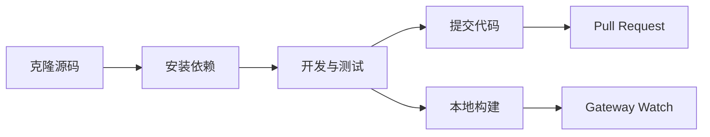

# 开发指南：从源码构建到贡献

## 学完你能做什么

- 从源码构建和运行 Clawdbot
- 开发自定义插件（渠道、工具、RPC 方法）
- 运行单元测试和端到端测试
- 向项目提交 Pull Request 和贡献代码
- 理解项目架构和插件系统

## 你现在的困境

你是一名开发者，想要：
- 定制或扩展 Clawdbot 的功能
- 了解项目内部工作机制
- 向开源社区贡献代码
- 但不知道从哪开始：构建、测试、提交流程？

## 什么时候用这一招

- 你需要修改源码或添加新功能时
- 你想开发自定义插件或渠道时
- 你需要调试或修复 bug 时
- 你想向项目贡献代码时

## 🎒 开始前的准备

::: warning 前置条件
本教程假设你已具备以下条件：
:::

- **Node.js ≥22** 已安装（项目要求）
- **pnpm** 包管理器已安装（推荐用于从源码构建）
- **Git** 基础操作知识
- **TypeScript** 开发经验
- **终端**命令行操作能力

推荐环境：
- macOS / Linux (主要开发平台)
- Windows 可通过 WSL2

## 核心思路

### 开发流程概览

Clawdbot 的开发流程分为四个主要阶段：



### 关键概念

- **构建系统**：使用 TypeScript 编译，`dist/` 目录包含输出
- **插件架构**：运行时加载的 TypeScript 模块，支持扩展功能
- **Gateway 守护进程**：单例模式，控制平面和消息路由
- **测试框架**：Vitest 用于单元测试，Docker 用于端到端测试

### 项目结构要点

| 目录 | 作用 |
|------|------|
| `src/` | 所有源代码（2475 个 TypeScript 文件）|
| `src/gateway/` | Gateway WebSocket 服务器 |
| `src/channels/` | 渠道插件系统 |
| `src/agents/` | AI Agent 运行时 |
| `src/plugin-sdk/` | 插件开发 SDK |
| `extensions/` | 内置插件（如 voice-call）|
| `tests/` | 测试文件 |

## 跟我做

### 第 1 步：克隆源码并安装依赖

**为什么**
获取最新的源码并安装所有依赖是开发的第一步。

```bash
## 克隆仓库
git clone https://github.com/clawdbot/clawdbot.git
cd clawdbot

## 安装依赖（推荐使用 pnpm）
pnpm install
```

**你应该看到**：依赖安装成功，没有错误提示。

::: info Bun 支持
如果你使用 Bun，可以直接运行 TypeScript 而无需构建（使用 `tsx`）。
:::

### 第 2 步：构建项目

**为什么**
将 TypeScript 编译为 JavaScript，生成可分发的 `dist/` 目录。

```bash
## 完整构建
pnpm build
```

**你应该看到**：
```
src/cli/entry.ts → dist/cli/entry.js
src/gateway/server.ts → dist/gateway/server.js
...
Build completed in X seconds
```

::: tip UI 构建
首次运行 `pnpm ui:build` 会自动安装 UI 依赖。
:::

### 第 3 步：启动开发模式

**为什么**
开发模式支持自动重载，无需手动重新构建。

```bash
## 启动 Gateway 开发模式（自动重载）
pnpm gateway:watch

## 或启动 CLI 开发模式
CLAWDBOT_PROFILE=dev pnpm clawdbot --dev
```

**你应该看到**：
- Gateway 启动并监听 `ws://127.0.0.1:18789`
- 文件修改时自动重新编译和重启

::: tip 跳过渠道加载
开发时可以使用 `CLAWDBOT_SKIP_CHANNELS=1` 跳过渠道初始化，加快启动速度。
:::

**检查点 ✅**
- Gateway 成功启动并监听端口 18789
- 修改 TypeScript 文件后自动重新编译

### 第 4 步：运行测试

**为什么**
确保代码修改没有破坏现有功能。

#### 单元测试

```bash
## 运行所有测试
pnpm test

## 运行测试并监视变化
pnpm test:watch

## 生成覆盖率报告
pnpm test:coverage
```

**你应该看到**：测试通过率和覆盖率统计。

#### 端到端测试

```bash
## 运行 Docker 端到端测试
pnpm test:docker:all

## 或运行单个测试套件
pnpm test:docker:live-models
```

**你应该看到**：所有 Docker 测试容器成功运行并退出。

::: warning 测试要求
端到端测试需要 Docker 已安装并运行。
:::

**检查点 ✅**
- 所有单元测试通过
- 测试覆盖率符合要求（≥70%）
- 端到端测试通过

### 第 5 步：代码检查和格式化

**为什么**
保持代码风格一致和类型安全。

```bash
## 运行 linter
pnpm lint

## 格式化代码
pnpm format:fix

## 运行 Swift linter（macOS/iOS 开发）
pnpm lint:swift
```

**你应该看到**：没有 lint 错误，代码已格式化。

::: tip 自动格式化
项目配置了 pre-commit git hooks，会在提交前自动格式化暂存的文件。
:::

### 第 6 步：开发插件（可选）

**为什么**
扩展 Clawdbot 功能或集成外部服务。

#### 快速创建插件

1. 创建插件目录：
```bash
mkdir extensions/my-plugin
cd extensions/my-plugin
```

2. 创建 `clawdbot.plugin.json`：
```json
{
  "id": "my-plugin",
  "name": "My Plugin",
  "version": "1.0.0",
  "configSchema": {
    "type": "object",
    "properties": {
      "apiKey": { "type": "string" }
    }
  }
}
```

3. 创建插件入口 `index.ts`：
```typescript
export default function (api) {
  console.log("My plugin loaded!");
  
  // 注册工具
  api.registerTool({
    name: "my_tool",
    description: "My custom tool",
    execute: async (params) => {
      return { result: "Hello from my tool!" };
    }
  });
  
  // 注册 RPC 方法
  api.registerGatewayMethod("myplugin.status", ({ respond }) => {
    respond({ ok: true, status: "running" });
  });
}
```

4. 安装并测试：
```bash
## 开发模式：链接插件
clawdbot plugins install -l extensions/my-plugin

## 重启 Gateway
pnpm gateway:watch
```

::: details 插件类型
Clawdbot 支持以下插件类型：

- **Agent Tools**：AI 可调用的工具
- **Channel Plugins**：新的消息渠道（WhatsApp、Telegram 等）
- **Gateway RPC**：WebSocket 端点
- **CLI Commands**：命令行工具
- **Background Services**：后台任务
- **Auto-reply Commands**：无需 AI 的快捷命令

详见 [插件文档](https://github.com/clawdbot/clawdbot/blob/main/docs/plugin.md)。
:::

**检查点 ✅**
- 插件成功加载
- 可以通过 CLI 或 Gateway 调用插件功能
- 插件配置正常工作

### 第 7 步：提交代码和 Pull Request

**为什么**
将你的贡献提交到社区。

```bash
## 创建功能分支
git checkout -b feature/my-feature

## 提交更改
git add .
git commit -m "feat: add my new feature"

## 推送到 GitHub
git push origin feature/my-feature
```

然后在 GitHub 上创建 Pull Request。

::: tip PR 规范
在 PR 描述中说明：
- **做了什么**：功能或修复的描述
- **为什么**：解决什么问题
- **测试状态**：untested / lightly tested / fully tested
- **AI 辅助**：是否使用 AI 工具协助开发
:::

**检查点 ✅**
- 代码已推送到 GitHub
- Pull Request 创建成功
- CI/CD 检查通过（如果有）

## 踩坑提醒

### 常见错误

| 错误 | 原因 | 解决方法 |
|-------|-------|---------|
| `Cannot find module 'xxx'` | 依赖未安装 | 运行 `pnpm install` |
| `Port 18789 already in use` | Gateway 已运行 | 检查并关闭旧实例 |
| TypeScript 编译错误 | 类型定义问题 | 运行 `pnpm lint` 检查 |
| 测试超时 | Docker 未启动或网络问题 | 检查 Docker 状态 |

### 开发最佳实践

- **小步提交**：每次 PR 只做一件事，便于审查
- **写测试**：新功能必须有测试覆盖
- **遵循风格**：使用项目配置的 linter 和 formatter
- **文档更新**：修改代码时同步更新相关文档
- **AI 标注**：使用 AI 辅助开发时，请在 PR 中标注

## 本课小结

本教程涵盖了 Clawdbot 的完整开发流程：

✅ **从源码构建**：使用 `pnpm install` 和 `pnpm build`
✅ **开发模式**：使用 `pnpm gateway:watch` 实现自动重载
✅ **测试框架**：Vitest 单元测试 + Docker 端到端测试
✅ **插件开发**：基于 TypeScript 的可扩展插件系统
✅ **贡献流程**：Git 工作流和 Pull Request 规范

关键命令速查：

| 任务 | 命令 |
|------|-------|
| 安装依赖 | `pnpm install` |
| 构建 | `pnpm build` |
| 开发模式 | `pnpm gateway:watch` |
| 单元测试 | `pnpm test` |
| 代码检查 | `pnpm lint` |
| 格式化 | `pnpm format:fix` |

## 下一课预告

恭喜你完成了开发指南的学习！现在你已经具备了：

- 从源码构建和运行 Clawdbot 的能力
- 开发自定义插件的基础
- 运行测试和贡献代码的流程

接下来，你可能想深入了解：

- [配置参考](../config-reference/) - 完整的配置项文档
- [Gateway API 协议](../api-protocol/) - WebSocket 协议规范
- [部署选项](../deployment/) - Docker、Nix 等部署方式

继续探索，让 Clawdbot 为你工作！

---

## 附录：源码参考

<details>
<summary><strong>点击展开查看源码位置</strong></summary>

> 更新时间：2026-01-27

| 功能 | 文件路径 | 行号 |
|------|----------|------|
| 构建脚本 | [`package.json`](https://github.com/clawdbot/clawdbot/blob/main/package.json) | 77-44 |
| 从源码安装 | [`README.md`](https://github.com/clawdbot/clawdbot/blob/main/README.md) | 83-99 |
| 插件文档 | [`docs/plugin.md`](https://github.com/clawdbot/clawdbot/blob/main/docs/plugin.md) | 1-639 |
| 贡献指南 | [`CONTRIBUTING.md`](https://github.com/clawdbot/clawdbot/blob/main/CONTRIBUTING.md) | 1-53 |
| 架构文档 | [`docs/concepts/architecture.md`](https://github.com/clawdbot/clawdbot/blob/main/docs/concepts/architecture.md) | 1-123 |

**关键命令**：
- `pnpm build` - 完整构建（package.json:85）
- `pnpm gateway:watch` - 开发模式自动重载（package.json:93）
- `pnpm test` - 运行单元测试（package.json:118）
- `pnpm lint` - 代码检查（package.json:110）

**关键目录**：
- `src/` - 源代码根目录（2475 个 TypeScript 文件）
- `src/plugin-sdk/` - 插件开发 SDK
- `extensions/` - 内置插件
- `tests/` - 测试文件
- `dist/` - 构建输出目录

**插件相关**：
- 插件 manifest 格式：`clawdbot.plugin.json`（plugin.md:8-10）
- 插件 API：`api.registerTool()`, `api.registerGatewayMethod()`（plugin.md:591-600）
- 插件配置 Schema：JSON Schema + `uiHints`（plugin.md:36-48）

</details>
