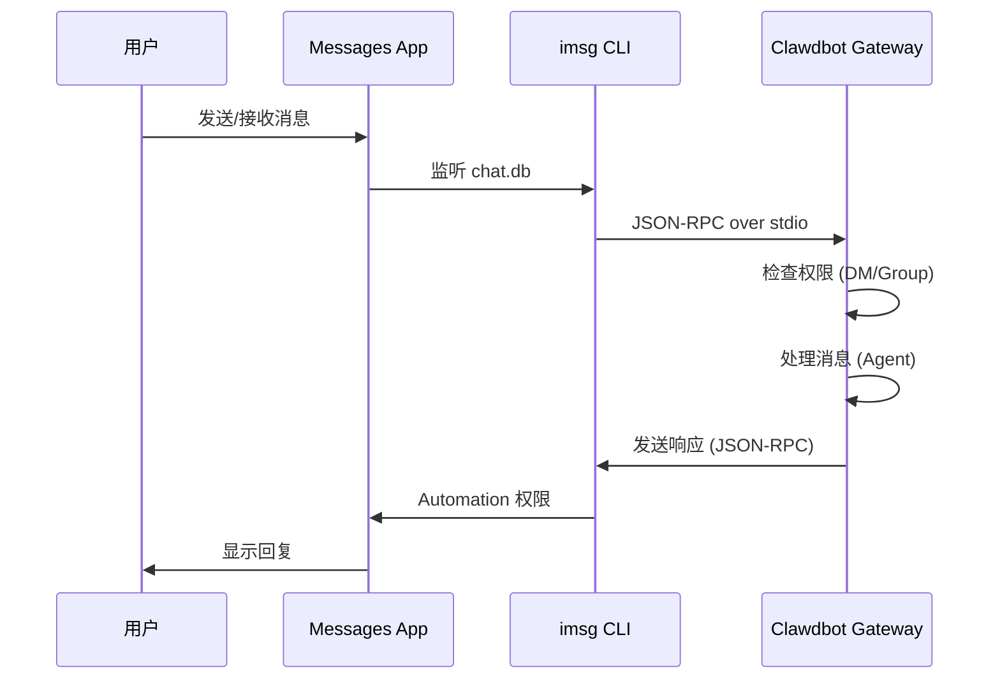

# iMessage 渠道配置

## 学完你能做什么

- 在 macOS 上通过 iMessage 与 AI 助手进行 1:1 私聊
- 在 iMessage 群组中使用 AI 助手（支持 @提及）
- 配置专用 Mac 用户以隔离机器人身份
- 通过 SSH/Tailscale 远程访问另一台 Mac 上的 iMessage
- 掌握 DM 配对和群组 allowlist 访问控制

## 你现在的困境

你想在 macOS 上使用 iMessage 与 AI 助手交互，但不知道如何：

- 安装和配置 `imsg` CLI 工具
- 给予 Clawdbot Full Disk Access 和 Automation 权限
- 配置本地或远程 Mac 作为 iMessage 网关
- 设置多个 iMessage 账户
- 控制谁可以向机器人发送消息

## 什么时候用这一招

**适合使用 iMessage 渠道的场景**：

- 你主要在 macOS 上使用 iMessage
- 希望使用本地 iMessage（不依赖第三方服务器）
- 需要通过 iMessage 与 AI 助手进行文本和媒体交互
- 想要保持与其他渠道（WhatsApp、Telegram）相同的会话体验

**不适合的场景**：

- 非 macOS 系统（iMessage 渠道仅支持 macOS）
- 需要跨平台同步（考虑使用 WebChat、Telegram）
- 需要群组 @提及功能（iMessage 无原生 mention 机制，需手动配置）

## 核心思路

iMessage 渠道的工作流程：



**关键概念**：

| 概念 | 说明 |
|--- | ---|
| **imsg CLI** | 第三方工具，通过 JSON-RPC over stdio 与 Messages 交互 |
| **Full Disk Access** | macOS 权限，允许 Clawdbot 读取 Messages chat.db |
| **Automation 权限** | macOS 权限，允许 imsg 通过 Automation API 发送消息 |
| **chat_id** | 稳定的聊天标识符，用于路由和会话隔离 |
| **pairing** | 默认 DM 保护机制，陌生发送者需要批准 |

::: tip
iMessage 渠道通过 `imsg` CLI 实现，而不是直接调用 Messages API。`imsg` 通过 JSON-RPC over stdio 与 Clawdbot 通信，这意味着它可以运行在远程 Mac 上（通过 SSH）。
:::

## 🎒 开始前的准备

确保你已经：

- ✅ 完成 [快速开始](../../start/getting-started/) 并安装了 Clawdbot
- ✅ Gateway 正在运行（`clawdbot gateway --port 18789`）
- ✅ 在 macOS 上登录 Messages（已启用 iMessage）
- ✅ 有 Homebrew 访问权限（用于安装 `imsg`）

::: warning
iMessage 渠道仅支持 macOS。确保你的 Gateway 运行在 macOS 上，或通过 SSH/Tailscale 连接到远程 Mac。
:::

## 跟我做

### 第 1 步：安装 imsg CLI

**为什么**
`imsg` 是 iMessage 渠道的核心依赖，通过 JSON-RPC over stdio 与 Messages 应用交互。

1. 使用 Homebrew 安装：
   ```bash
   brew install steipete/tap/imsg
   ```

**你应该看到**：
- 安装成功后，`imsg` 命令可用
- 运行 `imsg --version` 显示版本信息

**验证安装**：

```bash
# 测试 imsg 是否可用
imsg chats --limit 1
```

**你应该看到**：
- 输出至少一个聊天记录（如果有）
- 或提示需要授予 Full Disk Access 权限

### 第 2 步：授予 Full Disk Access 权限

**为什么**
Clawdbot 需要读取 Messages 的 `chat.db` 数据库来监听新消息。

1. 打开 **系统设置** > **隐私与安全性**
2. 点击 **完全磁盘访问权限**
3. 点击 **+** 添加以下应用：
   - `/Applications/Clawdbot.app`（如果使用 macOS 应用）
   - `/usr/local/bin/imsg` 或 `imsg` 的实际路径
4. 重启 Gateway

::: warning
权限更改后必须重启 Gateway 才能生效！
:::

**你应该看到**：
- Gateway 启动日志中没有权限错误
- `imsg chats --limit 1` 可以正常输出聊天列表

### 第 3 步：授予 Automation 权限

**为什么**
`imsg` 通过 Apple Events Automation API 发送消息，需要用户授权。

1. 首次发送消息时，macOS 会弹出权限提示
2. 点击 **允许** 或 **好**
3. 如果使用专用 Mac 用户，在该用户的会话中执行一次测试

**测试 Automation 权限**：

```bash
# 发送测试消息（替换为实际接收者）
imsg send --to "+15555550123" "Test message"
```

**你应该看到**：
- macOS 弹出权限提示（首次）
- 授予权限后消息成功发送
- Messages 应用中显示测试消息

### 第 4 步：配置 Clawdbot

**为什么**
告诉 Clawdbot 使用哪个 `imsg` 路径和 Messages 数据库位置。

**方式 A：简单配置（本地 Mac）**

编辑 `~/.clawdbot/clawdbot.json`：

```json5
{
  channels: {
    imessage: {
      enabled: true,
      cliPath: "/usr/local/bin/imsg",
      dbPath: "/Users/<your-username>/Library/Messages/chat.db",
      dmPolicy: "pairing",
      groupPolicy: "allowlist"
    }
  }
}
```

::: info
将 `<your-username>` 替换为你的实际 macOS 用户名。
:::

**方式 B：多账户配置**

```json5
{
  channels: {
    imessage: {
      enabled: true,
      accounts: {
        main: {
          name: "Main Account",
          enabled: true,
          cliPath: "/usr/local/bin/imsg",
          dbPath: "/Users/alice/Library/Messages/chat.db"
        },
        bot: {
          name: "Bot Account",
          enabled: true,
          cliPath: "/path/to/imsg-bot-wrapper",  // 见第 5 步
          dbPath: "/Users/botuser/Library/Messages/chat.db"
        }
      }
    }
  }
}
```

**重启 Gateway**：

```bash
clawdbot gateway restart
```

**你应该看到**：
- Gateway 启动并显示 "iMessage default: enabled, configured, ..."
- 无权限或路径错误日志

### 第 5 步：发送测试消息

**为什么**
验证配置是否正确，消息是否正常传递。

1. 使用 CLI 发送测试消息：
   ```bash
   clawdbot message --to imessage:+15555550123 "Hello from Clawdbot!"
   ```

**你应该看到**：
- Messages 应用收到消息
- Gateway 日志显示消息已发送
- 如果配置了 AI 模型，收到 AI 回复

::: info
`imessage:+15555550123` 格式表示通过 iMessage 渠道发送到电话号码 `+15555550123`。也可以使用邮件地址 `imessage:user@example.com`。
:::

## 检查点 ✅

验证配置是否成功：

```bash
# 检查渠道状态
clawdbot channels status

# 应该显示：
# iMessage default: enabled, configured, rpc listening
```

::: info
如果看到错误，运行 `clawdbot channels status --probe` 查看详细的诊断信息。
:::

## 高级配置

### 配置专用 Mac 用户（可选）

如果你想使用独立的 iMessage 身份（不污染你的个人 Messages），可以创建专用 Mac 用户。

**步骤**：

1. **创建专用 Apple ID**：
   - 访问 [appleid.apple.com](https://appleid.apple.com)
   - 创建新 Apple ID（例如 `my-cool-bot@icloud.com`）

2. **创建 macOS 用户**：
   - 打开 **系统设置** > **用户与群组**
   - 点击 **+** 创建新用户（例如 `botuser`）
   - 设置自动登录或记住密码

3. **登录专用 iMessage 账户**：
   - 切换到 `botuser` 用户
   - 打开 Messages 应用
   - 使用专用 Apple ID 登录 iMessage

4. **启用远程登录**：
   - 打开 **系统设置** > **通用** > **共享**
   - 启用 **远程登录**

5. **设置 SSH 免密登录**：
   ```bash
   # 从主用户测试 SSH
   ssh botuser@localhost true

   # 如果需要密码，配置 SSH 密钥：
   ssh-keygen -t ed25519
   ssh-copy-id botuser@localhost
   ```

6. **创建 SSH wrapper 脚本**：

   创建 `~/.clawdbot/scripts/imsg-bot`（`chmod +x`）：

   ```bash
   #!/usr/bin/env bash
   set -euo pipefail

   # 运行交互式 SSH 一次以接受 host keys：
   #   ssh botuser@localhost true
   exec /usr/bin/ssh -o BatchMode=yes -o ConnectTimeout=5 -T botuser@localhost \
     "/usr/local/bin/imsg" "$@"
   ```

7. **配置 Clawdbot**：

   ```json5
   {
     channels: {
       imessage: {
         enabled: true,
         accounts: {
           bot: {
             name: "Bot",
             enabled: true,
             cliPath: "/Users/<your-username>/.clawdbot/scripts/imsg-bot",
             dbPath: "/Users/botuser/Library/Messages/chat.db"
           }
         }
       }
     }
   }
   ```

::: tip
首次配置时，在 `botuser` 会话中运行一次 `imsg chats --limit 1` 或 `imsg send ...` 以授予 Automation 权限。
:::

### 远程 Mac 配置（可选）

如果 Gateway 运行在 Linux/VM 但 iMessage 必须在 Mac 上，可以通过 SSH 远程连接。

**架构**：

```
┌──────────────────────────────┐          SSH (imsg rpc)          ┌──────────────────────────┐
│ Gateway host (Linux/VM)      │──────────────────────────────────▶│ Mac with Messages + imsg │
│ - clawdbot gateway           │          SCP (attachments)        │ - Messages signed in     │
│ - channels.imessage.cliPath  │◀──────────────────────────────────│ - Remote Login enabled   │
└──────────────────────────────┘                                   └──────────────────────────┘
              ▲
              │ Tailscale tailnet (hostname or 100.x.y.z)
              ▼
        user@remote-mac
```

**配置步骤**：

1. **创建 SSH wrapper**（`~/.clawdbot/scripts/imsg-ssh`）：

   ```bash
   #!/usr/bin/env bash
   exec ssh -T bot@remote-mac imsg "$@"
   ```

2. **配置 Clawdbot**：

   ```json5
   {
     channels: {
       imessage: {
         enabled: true,
         cliPath: "/Users/<your-username>/.clawdbot/scripts/imsg-ssh",
         remoteHost: "bot@remote-mac",
         includeAttachments: true,
         dbPath: "/Users/bot/Library/Messages/chat.db"
       }
     }
   }
   ```

::: info
`remoteHost` 用于 SCP 附件传输。如果未设置，Clawdbot 会尝试从 SSH 命令中自动检测。显式配置更可靠。
:::

**Tailscale 配置示例**：

```bash
# SSH wrapper
#!/usr/bin/env bash
exec ssh -T bot@mac-mini.tailnet-1234.ts.net imsg "$@"
```

```json5
{
  channels: {
    imessage: {
      enabled: true,
      cliPath: "~/.clawdbot/scripts/imsg-ssh",
      remoteHost: "bot@mac-mini.tailnet-1234.ts.net",
      includeAttachments: true,
      dbPath: "/Users/bot/Library/Messages/chat.db"
    }
  }
}
```

## 配置详解

### 基本配置

| 配置项 | 类型 | 默认值 | 说明 |
|--- | --- | --- | ---|
| `enabled` | boolean | false | 是否启用 iMessage 渠道 |
| `cliPath` | string | "imsg" | imsg CLI 路径（可以是 SSH wrapper） |
| `dbPath` | string | - | Messages chat.db 路径 |
| `remoteHost` | string | - | SSH 主机（用于 SCP 附件传输） |

### DM 策略

| 配置项 | 类型 | 默认值 | 说明 |
|--- | --- | --- | ---|
| `dmPolicy` | "pairing"|"allowlist"|"open"|"disabled" | "pairing" | DM 访问策略 |
| `allowFrom` | array | [] | 允许的发送者列表（handles、emails、E.164、`chat_id:*`） |

**配对新发送者**：

```bash
# 列出待配对代码
clawdbot pairing list imessage

# 批准配对
clawdbot pairing approve imessage <CODE>
```

::: tip
iMessage 没有用户名概念，使用 handles（电话号码或邮件地址）或 chat targets（`chat_id`、`chat_guid`、`chat_identifier`）。
:::

### 群组策略

| 配置项 | 类型 | 默认值 | 说明 |
|--- | --- | --- | ---|
| `groupPolicy` | "allowlist"|"open"|"disabled" | "allowlist" | 群组访问策略 |
| `groupAllowFrom` | array | [] | 允许在群组中触发 AI 的发送者 |
| `groups` | object | {} | 按 chat_id 的群组配置 |

**群组配置示例**：

```json5
{
  channels: {
    imessage: {
      groupPolicy: "allowlist",
      groupAllowFrom: ["+15555550123", "alice@example.com"],
      groups: {
        "42": {
          requireMention: false,
          allowFrom: ["bob@example.com"]
        }
      }
    }
  }
}
```

### 媒体和文本限制

| 配置项 | 类型 | 默认值 | 说明 |
|--- | --- | --- | ---|
| `includeAttachments` | boolean | false | 是否将附件包含在上下文中 |
| `mediaMaxMb` | number | 16 | 最大媒体文件大小（MB） |
| `textChunkLimit` | number | 4000 | 出站文本分块大小（字符） |
| `chunkMode` | "length"|"newline" | "length" | 分块模式：按长度或按空行 |

### 历史记录

| 配置项 | 类型 | 默认值 | 说明 |
|--- | --- | --- | ---|
| `historyLimit` | number | - | 群组最大历史消息数（0 禁用） |
| `dmHistoryLimit` | number | - | DM 历史消息限制（用户轮数） |
| `dms["<handle>"].historyLimit` | number | - | 按 handle 覆盖 DM 历史限制 |

## 踩坑提醒

### imsg rpc 命令不可用

**症状**：Gateway 日志显示 "imsg CLI does not support 'rpc' subcommand"

**原因**：`imsg` 版本过旧，不支持 `rpc` 子命令

**解决方法**：

1. 更新 `imsg`：
   ```bash
   brew upgrade steipete/tap/imsg
   ```

2. 验证版本：
   ```bash
   imsg rpc --help
   ```

### Full Disk Access 权限问题

**症状**：`imsg chats --limit 1` 无输出或报错 "Permission denied"

**解决方法**：

1. 确保已添加 Clawdbot 和 `imsg` 到完全磁盘访问权限
2. 重启 Gateway
3. 如果问题持续，尝试重启 Mac

### Automation 权限问题

**症状**：发送消息无反应，Gateway 日志显示超时

**原因**：macOS 未授予 Automation 权限

**解决方法**：

1. 在 Messages 应用中手动发送一条消息
2. macOS 应该弹出权限提示
3. 点击 **允许**
4. 如果使用专用 Mac 用户，切换到该用户并重复步骤

### 远程 Mac 连接失败

**症状**：SSH wrapper 超时或连接被拒绝

**解决方法**：

1. 测试 SSH 连接：
   ```bash
   ssh -T bot@remote-mac imsg --version
   ```

2. 确保 Remote Login 已启用（远程 Mac）

3. 检查防火墙和端口设置

4. 使用 Tailscale 简化内网穿透

## 本课小结

- 安装了 `imsg` CLI 工具
- 配置了 Full Disk Access 和 Automation 权限
- 学会了本地和远程 Mac 配置方法
- 掌握了 DM 配对和群组 allowlist 机制
- 理解了 chat_id、chat_guid、chat_identifier 的区别
- 测试了 1:1 和群组消息

## 下一课预告

> 下一课我们学习 **[LINE 渠道](../line/)**。
>
> 你会学到：
> - 如何获取 LINE Messaging API 凭据
> - 配置 LINE Bot 的 Webhook 端点
> - LINE 渠道的消息格式和限制
> - 与 iMessage 渠道的配置差异

---

## 附录：源码参考

<details>
<summary><strong>点击展开查看源码位置</strong></summary>

> 更新时间：2026-01-27

| 功能 | 文件路径 | 行号 |
|--- | --- | ---|
| iMessage 配置类型定义 | [`src/config/types.imessage.ts`](https://github.com/clawdbot/clawdbot/blob/main/src/config/types.imessage.ts) | 1-80 |
| iMessage 账户解析 | [`src/imessage/accounts.ts`](https://github.com/clawdbot/clawdbot/blob/main/src/imessage/accounts.ts) | 1-83 |
| iMessage 探测 | [`src/imessage/probe.ts`](https://github.com/clawdbot/clawdbot/blob/main/src/imessage/probe.ts) | 1-92 |
| iMessage 发送 | [`src/imessage/send.ts`](https://github.com/clawdbot/clawdbot/blob/main/src/imessage/send.ts) | 1-135 |
| iMessage 监控提供者 | [`src/imessage/monitor/monitor-provider.ts`](https://github.com/clawdbot/clawdbot/blob/main/src/imessage/monitor/monitor-provider.ts) | 1-600+ |
| 目标地址解析 | [`src/imessage/targets.ts`](https://github.com/clawdbot/clawdbot/blob/main/src/imessage/targets.ts) | 1-200+ |
| Onboarding 适配器 | [`src/channels/plugins/onboarding/imessage.ts`](https://github.com/clawdbot/clawdbot/blob/main/src/channels/plugins/onboarding/imessage.ts) | 1-262 |
| iMessage 文档 | [`docs/channels/imessage.md`](https://github.com/clawdbot/clawdbot/blob/main/docs/channels/imessage.md) | 1-262 |

**关键类型**：
- `IMessageConfig`: 完整的 iMessage 配置接口
- `IMessageAccountConfig`: 单账户配置
- `IMessageService`: "imessage" | "sms" | "auto"
- `IMessageTargetKind`: "chat_id" | "chat_guid" | "chat_identifier" | "handle"

**关键配置字段**：
- `cliPath`: imsg CLI 路径，可以是本地路径或 SSH wrapper 脚本
- `dbPath`: Messages chat.db 数据库路径
- `remoteHost`: SSH 主机（用于 SCP 附件传输），自动检测或显式配置
- `dmPolicy`: 默认 "pairing"，控制陌生 DM 访问
- `groupPolicy`: 群组访问策略，"allowlist" 或 "open"
- `groups`: 按 `chat_id` 的群组配置，支持隔离会话和自定义策略

**关键函数**：
- `probeIMessage()`: 探测 imsg CLI 是否可用并支持 rpc 子命令（`probe.ts`）
- `sendMessageIMessage()`: 发送 iMessage 消息，支持文本和媒体（`send.ts`）
- `monitorIMessageProvider()`: 监控 iMessage 事件流（`monitor-provider.ts`）
- `parseIMessageTarget()`: 解析目标地址（chat_id、handle、email 等）（`targets.ts`）

**通信机制**：
- 通过 `imsg rpc` 子命令实现 JSON-RPC over stdio 通信
- 每个账户有独立的 RPC 客户端实例（`createIMessageRpcClient`）
- 消息事件通过 `monitor-provider.ts` 流式推送到 Gateway
- 发送消息时支持 `chat_id`（推荐）、`chat_guid`、`chat_identifier` 或直接 handle

**多账户支持**：
- 使用 `channels.imessage.accounts` map 配置多个账户
- 每个账户有独立的 `cliPath`、`dbPath` 和策略配置
- 默认账户 ID 为 "default"，可通过 `accountId` 字段指定

</details>
