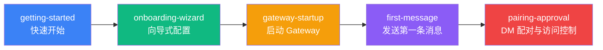

# 快速上手：从安装到第一条消息

欢迎使用 Clawdbot！本章节将引导你完成从零开始使用 Clawdbot 的完整流程。无论你是想快速体验 AI 助手，还是深入了解配置选项，这里都有对应的教程。

---

## 章节概述

本章节包含 5 个教程，覆盖了 Clawdbot 的完整上手流程：从安装软件、配置 AI 模型和通信渠道，到启动 Gateway 守护进程、发送第一条消息，最后了解默认的安全保护机制。完成本章节后，你将拥有一个可以正常使用的个人 AI 助手。

---

## 学习路径建议

我们推荐按照以下顺序学习这些教程：

**学习顺序说明**：

1. **快速开始**（必须）：完成基础安装和配置，这是所有后续学习的前提
2. **向导式配置**（推荐）：深入了解向导的各个选项，适合想要精细配置的用户
3. **启动 Gateway**（必须）：了解如何启动和管理 Gateway 守护进程
4. **发送第一条消息**（必须）：验证配置是否正确，开始使用 AI 助手
5. **DM 配对与访问控制**（推荐）：了解默认的安全机制，保护你的 AI 助手

::: tip 快速通道
如果你只想快速体验，可以只学习「快速开始」和「启动 Gateway」两个教程，然后直接发送消息。其他教程可以后续按需学习。
:::

---

## 前置条件

在学习本章节之前，请确保：

- **Node.js**：≥ 22.12.0（使用 `node -v` 检查）
- **操作系统**：macOS / Linux / Windows (WSL2)
- **包管理器**：npm / pnpm / bun
- **AI 模型账户**（推荐）：
  - Anthropic Claude 账户（Pro/Max 订阅），支持 OAuth 流程
  - 或准备好 OpenAI / DeepSeek / OpenRouter 等提供商的 API Key

::: warning Windows 用户请注意
Windows 上强烈推荐使用 **WSL2**，因为：
- 许多渠道依赖本地二进制文件
- 守护进程（launchd/systemd）在 Windows 上不可用
:::

---

## 子页面导航

### [1. 快速开始](./getting-started/) ⭐ 核心教程

**学完你能做什么**：
- ✅ 在你的设备上安装 Clawdbot
- ✅ 配置 AI 模型认证（Anthropic / OpenAI / 其他提供商）
- ✅ 启动 Gateway 守护进程
- ✅ 通过 WebChat 或配置的渠道发送第一条消息

**适合人群**：所有用户，必读教程

**预计时间**：15-20 分钟

**主要内容**：
- 使用 npm/pnpm/bun 安装 Clawdbot
- 运行 onboarding 向导完成基础配置
- 启动 Gateway 并验证状态
- 通过 CLI 或渠道发送测试消息

**前置条件**：无

---

### [2. 向导式配置](./onboarding-wizard/)

**学完你能做什么**：
- ✅ 使用交互式向导完成完整配置
- ✅ 理解 QuickStart 和 Manual 两种模式的区别
- ✅ 配置 Gateway 网络、认证和 Tailscale
- ✅ 设置 AI 模型提供商（setup-token 和 API Key）
- ✅ 启用通信渠道（WhatsApp、Telegram 等）
- ✅ 安装和管理技能包

**适合人群**：想要精细配置的用户，了解高级选项

**预计时间**：20-30 分钟

**主要内容**：
- QuickStart vs Manual 模式选择
- Gateway 网络配置（端口、绑定、认证）
- AI 模型认证方式（setup-token 推荐）
- 通信渠道配置流程
- 技能系统介绍

**前置条件**：[快速开始](./getting-started/)

---

### [3. 启动 Gateway](./gateway-startup/) ⭐ 核心教程

**学完你能做什么**：
- ✅ 使用命令行启动 Gateway 前台进程
- ✅ 配置 Gateway 为后台守护进程（macOS LaunchAgent / Linux systemd / Windows Scheduled Task）
- ✅ 理解不同绑定模式（loopback / LAN / Tailnet）和认证方式
- ✅ 在开发模式和生产模式之间切换
- ✅ 使用 `--force` 强制释放被占用的端口

**适合人群**：所有用户，必读教程

**预计时间**：15-20 分钟

**主要内容**：
- 前台模式 vs 守护进程模式
- 绑定模式选择（loopback / LAN / Tailnet / Auto）
- 认证方式配置（Token / Password / Tailscale Identity）
- 开发模式（`--dev`）和生产模式
- 服务管理命令（install / start / stop / restart）
- 端口冲突处理（`--force`）

**前置条件**：[向导式配置](./onboarding-wizard/)

---

### [4. 发送第一条消息](./first-message/) ⭐ 核心教程

**学完你能做什么**：
- ✅ 通过 WebChat 界面发送消息
- ✅ 通过已配置渠道（WhatsApp / Telegram / Slack 等）与 AI 助手对话
- ✅ 理解消息路由和响应流程
- ✅ 使用 AI 助手执行基本任务（查询、总结、代码生成等）

**适合人群**：所有用户，必读教程

**预计时间**：10-15 分钟

**主要内容**：
- WebChat 界面使用
- 各渠道消息发送方式
- 消息格式和回复机制
- 常见任务示例（查询信息、生成代码、总结文本）
- 调试和故障排查

**前置条件**：[启动 Gateway](./gateway-startup/)

---

### [5. DM 配对与访问控制](./pairing-approval/)

**学完你能做什么**：
- ✅ 了解默认的 DM 配对保护机制
- ✅ 批准或拒绝陌生发送者的配对请求
- ✅ 配置白名单和黑名单
- ✅ 设置访问控制策略
- ✅ 理解配对模式和安全最佳实践

**适合人群**：关注安全的用户，推荐学习

**预计时间**：10-15 分钟

**主要内容**：
- DM 配对机制原理
- 配对流程和用户体验
- 白名单和黑名单配置
- 访问控制策略设置
- 安全最佳实践

**前置条件**：[发送第一条消息](./first-message/)

---

## 常见问题

### Q: 我应该学习所有教程吗？

**A**: 不一定。如果你想快速上手，只需学习「快速开始」和「启动 Gateway」两个核心教程，然后就可以开始使用 Clawdbot 了。其他教程可以根据需要按需学习。

### Q: 跳过某些教程会有影响吗？

**A**: 不会。每个教程都是独立的，但「快速开始」是基础，包含了安装和基本配置，建议首先学习。其他教程可以根据你的需求选择性学习。

### Q: 我已经熟悉 AI 助手，可以跳过基础教程吗？

**A**: 可以。如果你已经熟悉类似的 AI 助手工具，可以跳过「快速开始」，直接学习「向导式配置」和「启动 Gateway」来了解 Clawdbot 的特定配置和启动方式。

### Q: 学习完本章节后，我可以做什么？

**A**: 完成本章节后，你将拥有一个可以正常使用的 Clawdbot 系统，能够：
- 通过 WebChat 或多个渠道与 AI 助手对话
- 让 AI 执行基本任务（查询信息、生成代码、总结文本等）
- 使用 DM 配对机制保护安全
- 继续学习进阶功能（多渠道配置、工具系统、技能平台等）

---

## 下一步指引

完成本章节后，你可以继续学习：

- **[多渠道系统概览](../../platforms/channels-overview/)**：了解 Clawdbot 支持的所有通信渠道及其特点
- **[WhatsApp 渠道](../../platforms/whatsapp/)**：深入学习 WhatsApp 渠道的配置和使用
- **[Telegram 渠道](../../platforms/telegram/)**：深入学习 Telegram 渠道的配置和使用
- **[WebChat 界面](../../platforms/webchat/)**：了解内置的 WebChat 界面功能

::: tip 提示
根据你的使用需求，选择对应的渠道进行深入学习。如果你主要使用某个渠道（如 WhatsApp 或 Telegram），可以优先学习该渠道的专门教程。
:::
