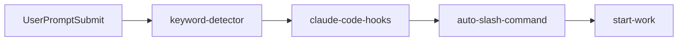
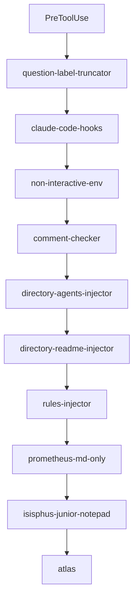
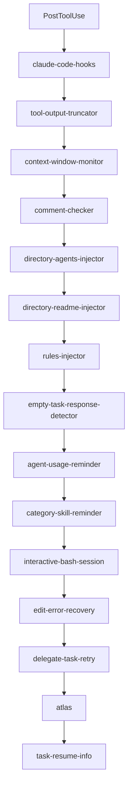
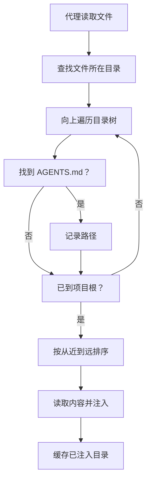
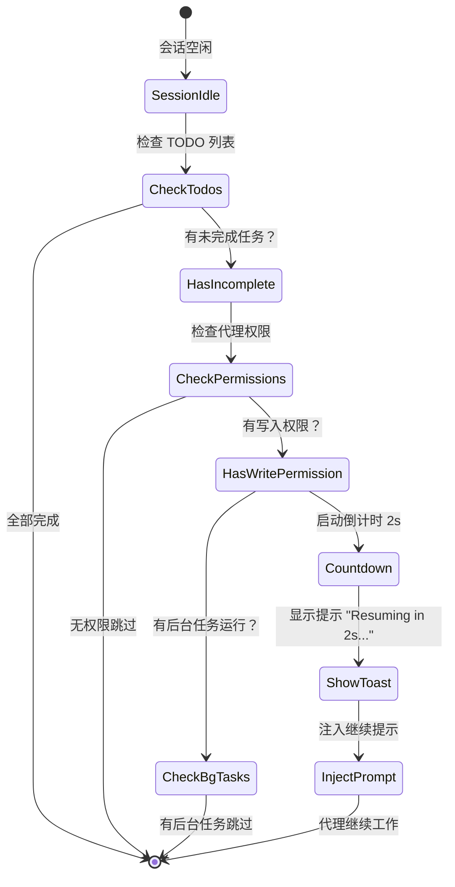
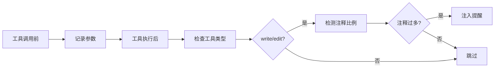

# 生命周期钩子：自动化上下文与质量控制

## 学完你能做什么

- 自动为 AI 代理注入项目上下文（AGENTS.md、README.md）
- 防止代理半途而废，强制完成 TODO 列表
- 自动截断过大的工具输出，避免上下文窗口溢出
- 启用 Ultrawork 模式，一键激活全部专业代理
- 自定义钩子配置，禁用不需要的功能

## 你现在的困境

你是否遇到过这些问题：

- AI 代理总是忘记项目规范，重复犯错？
- 代理写到一半就停下来，TODO 列表没完成？
- 代码库搜索输出太大，把上下文窗口撑爆了？
- 每次都要手动告诉代理用什么模式工作？

## 什么时候用这一招

生命周期钩子适合以下场景：

::: tip 典型场景
- **项目上下文管理**：自动注入 AGENTS.md 和 README.md
- **质量控制**：检查代码注释、验证思维块
- **任务连续性**：强制代理完成所有 TODO 任务
- **性能优化**：动态截断输出、上下文窗口管理
- **工作流自动化**：关键词触发模式、自动命令执行
:::

## 核心思路

### 什么是生命周期钩子？

**生命周期钩子**是一种事件驱动机制，允许你在代理工作的关键时间点插入自定义逻辑。比如自动注入项目文档、强制完成 TODO 任务、截断过大输出等。这些钩子监听 4 种事件类型：工具执行前、工具执行后、用户提交提示词时、会话空闲时。通过合理配置钩子，你可以让 AI 代理更智能、更符合你的工作习惯。

::: info 钩子 vs 中间件
钩子和 Web 框架的中间件很像，都是"在特定时刻做特定事"的机制。不同之处在于：
- **中间件**：线性执行，可以中断请求
- **钩子**：事件驱动，不能中断，只能修改数据
:::

### 32 个钩子，7 大类别

oh-my-opencode 提供了 32 个内置钩子，分为 7 大类别：

| 类别 | 钩子数量 | 主要作用 |
|--- | --- | ---|
| **上下文注入** | 4 | 自动注入项目文档、规则 |
| **生产力与控制** | 6 | 关键词检测、模式切换、循环管理 |
| **质量与安全** | 4 | 代码注释检查、思维块验证 |
| **恢复与稳定性** | 3 | 会话恢复、错误处理 |
| **截断与上下文管理** | 2 | 输出截断、窗口监控 |
| **通知与 UX** | 3 | 版本更新、后台任务通知、空闲提醒 |
| **任务管理** | 2 | 任务恢复、委托重试 |

## 钩子事件类型

钩子监听以下 4 种事件：

### 1. PreToolUse（工具执行前）

**触发时机**：代理调用工具之前

**能做什么**：
- 阻止工具执行
- 修改工具参数
- 注入上下文

**示例钩子**：`comment-checker`、`directory-agents-injector`

### 2. PostToolUse（工具执行后）

**触发时机**：工具执行完成后

**能做什么**：
- 修改工具输出
- 添加警告信息
- 注入后续指令

**示例钩子**：`tool-output-truncator`、`directory-readme-injector`

### 3. UserPromptSubmit（用户提交提示词时）

**触发时机**：用户发送消息到会话

**能做什么**：
- 阻止提交（罕见）
- 修改提示词内容
- 注入系统消息
- 激活工作模式

**示例钩子**：`keyword-detector`、`auto-slash-command`

### 4. Stop（会话空闲时）

**触发时机**：代理停止工作，会话进入空闲状态

**能做什么**：
- 注入后续提示词
- 发送通知
- 检查任务状态

**示例钩子**：`todo-continuation-enforcer`、`session-notification`

## 钩子执行顺序

钩子按固定顺序执行，确保逻辑正确性：

### UserPromptSubmit 事件



**顺序说明**：
1. `keyword-detector`：检测关键词（ultrawork、search、analyze）
2. `claude-code-hooks`：执行 Claude Code 兼容层钩子
3. `auto-slash-command`：自动执行斜杠命令
4. `start-work`：处理 `/start-work` 命令

### PreToolUse 事件



**顺序说明**：
1. `question-label-truncator`：截断工具标签
2. `claude-code-hooks`：Claude Code 兼容层
3. `non-interactive-env`：处理非交互式环境
4. `comment-checker`：检查代码注释
5. `directory-agents-injector`：注入 AGENTS.md
6. `directory-readme-injector`：注入 README.md
7. `rules-injector`：注入项目规则
8. `prometheus-md-only`：强制 Prometheus 只输出 Markdown
9. `sisyphus-junior-notepad`：为 Sisyphus Junior 注入提示
10. `atlas`：Atlas 主编排逻辑

### PostToolUse 事件



**顺序说明**：
1. `claude-code-hooks`：Claude Code 兼容层
2. `tool-output-truncator`：截断工具输出
3. `context-window-monitor`：监控上下文窗口
4. `comment-checker`：检查代码注释
5. `directory-agents-injector`：注入 AGENTS.md
6. `directory-readme-injector`：注入 README.md
7. `rules-injector`：注入项目规则
8. `empty-task-response-detector`：检测空响应
9. `agent-usage-reminder`：提醒使用专业代理
10. `category-skill-reminder`：提醒使用 Category/Skill
11. `interactive-bash-session`：管理交互式 Bash 会话
12. `edit-error-recovery`：恢复编辑错误
13. `delegate-task-retry`：重试失败的委托任务
14. `atlas`：Atlas 主编排逻辑
15. `task-resume-info`：提供任务恢复信息

## 核心钩子详解

### 1. directory-agents-injector（AGENTS.md 注入）

**触发事件**：PostToolUse

**功能**：当代理读取文件时，自动从文件目录向上遍历到项目根目录，收集所有路径上的 `AGENTS.md` 文件，并注入到代理的上下文中。

**工作流程**：



**示例**：

项目结构：
```
project/
├── AGENTS.md              # 项目级上下文
├── src/
│   ├── AGENTS.md          # src 级上下文
│   └── components/
│       ├── AGENTS.md      # components 级上下文
│       └── Button.tsx
```

当代理读取 `Button.tsx` 时，会自动注入：
1. `components/AGENTS.md`（最先注入）
2. `src/AGENTS.md`
3. `AGENTS.md`（项目根）

::: tip 最佳实践
- 在每个主要目录创建 `AGENTS.md`，说明该目录的职责和规范
- AGENTS.md 遵循"从近到远"原则，最近的最优先
- 已注入的目录会被缓存，避免重复注入
:::

**源码位置**：`src/hooks/directory-agents-injector/index.ts` (183 行)

### 2. todo-continuation-enforcer（TODO 强制继续）

**触发事件**：Stop

**功能**：检测代理的 TODO 列表，如果有未完成的 TODO，强制代理继续工作，防止半途而废。

**工作流程**：



**倒计时机制**：
- 默认倒计时 2 秒
- 显示 Toast 提示："Resuming in 2s... (X tasks remaining)"
- 用户可以在倒计时内手动取消

**跳过条件**：
1. 代理没有写入权限（read-only 代理）
2. 代理在跳过列表中（prometheus、compaction）
3. 有后台任务正在运行
4. 会话正在恢复中

**源码位置**：`src/hooks/todo-continuation-enforcer.ts` (490 行)

### 3. keyword-detector（关键词检测）

**触发事件**：UserPromptSubmit

**功能**：检测用户提示词中的关键词，自动激活对应模式：

| 关键词 | 激活模式 | 说明 |
|--- | --- | ---|
| `ultrawork` / `ulw` | **最大性能模式** | 激活所有专业代理和并行任务 |
| `search` / `find` | **并行探索模式** | 并行启动 explore/librarian |
| `analyze` / `investigate` | **深度分析模式** | 激活深度探索和分析 |

**使用示例**：

```
用户输入：
ultrawork 开发一个 REST API，包含认证和授权

系统响应：
[✅ Ultrawork Mode Activated]
Maximum precision engaged. All agents at your disposal.
```

**实现细节**：
- 关键词检测支持变体（ultrawork = ulw）
- 主会话和非主会话的处理不同
- 模式设置通过 `message.variant` 传递给代理
- 后台任务会话不进行关键词检测

**源码位置**：`src/hooks/keyword-detector/index.ts` (101 行)

### 4. tool-output-truncator（工具输出截断）

**触发事件**：PostToolUse

**功能**：动态截断过大的工具输出，保留 50% 的上下文窗口 headroom，最大截断到 50k tokens。

**支持的工具**：

```typescript
const TRUNCATABLE_TOOLS = [
  "grep", "Grep", "safe_grep",
  "glob", "Glob", "safe_glob",
  "lsp_diagnostics",
  "ast_grep_search",
  "interactive_bash", "Interactive_bash",
  "skill_mcp",
  "webfetch", "WebFetch",
]
```

**特殊限制**：
- `webfetch` 最大 10k tokens（网页内容需要更激进的截断）
- 其他工具最大 50k tokens

**截断策略**：
1. 根据剩余上下文窗口动态计算截断点
2. 保留输出头部和尾部，中间用省略号代替
3. 添加截断提示：`[Note: Content was truncated to save context window space. For full context, please read file directly: {path}]`

::: warning 启用更激进的截断
在 `oh-my-opencode.json` 中配置：
```json
{
  "experimental": {
    "truncate_all_tool_outputs": true
  }
}
```
这会截断所有工具输出，不仅仅是 TRUNCATABLE_TOOLS 列表中的工具。
:::

**源码位置**：`src/hooks/tool-output-truncator.ts` (62 行)

### 5. comment-checker（代码注释检查）

**触发事件**：PreToolUse / PostToolUse

**功能**：检查代理是否写入过多注释，智能忽略 BDD、指令、文档字符串。

**工作流程**：



**智能忽略规则**：
- BDD（行为驱动开发）注释
- 指令性注释（如 `// TODO`, `// FIXME`）
- 文档字符串（Docstrings）

**配置方式**：

```json
{
  "comment_checker": {
    "custom_prompt": "你的自定义提示词"
  }
}
```

**源码位置**：`src/hooks/comment-checker/index.ts` (172 行)

## 钩子配置

### 启用/禁用钩子

在 `oh-my-opencode.json` 中配置：

```json
{
  "disabled_hooks": [
    "comment-checker",
    "auto-update-checker",
    "keyword-detector"
  ]
}
```

### 常见配置场景

#### 场景 1：禁用注释检查

```json
{
  "disabled_hooks": ["comment-checker"]
}
```

#### 场景 2：禁用关键词检测

```json
{
  "disabled_hooks": ["keyword-detector"]
}
```

#### 场景 3：禁用 TODO 强制继续

```json
{
  "disabled_hooks": ["todo-continuation-enforcer"]
}
```

#### 场景 4：启用激进的输出截断

```json
{
  "experimental": {
    "truncate_all_tool_outputs": true
  }
}
```

## 本课小结

本课介绍了 oh-my-opencode 的 32 个生命周期钩子：

**核心概念**：
- 钩子是事件驱动的拦截机制
- 4 种事件类型：PreToolUse、PostToolUse、UserPromptSubmit、Stop
- 按固定顺序执行，确保逻辑正确性

**常用钩子**：
- `directory-agents-injector`：自动注入 AGENTS.md
- `todo-continuation-enforcer`：强制完成 TODO 列表
- `keyword-detector`：关键词检测激活模式
- `tool-output-truncator`：动态截断输出
- `comment-checker`：检查代码注释

**配置方法**：
- 通过 `disabled_hooks` 数组禁用不需要的钩子
- 通过 `experimental` 配置启用实验性功能

## 下一课预告

> 下一课我们学习 **[斜杠命令：预设工作流](../slash-commands/)**。
>
> 你会学到：
> - 6 个内置斜杠命令的使用方法
> - `/ralph-loop` 自动完成工作
> - `/refactor` 智能重构
> - `/start-work` 执行 Prometheus 计划
> - 如何创建自定义斜杠命令

---

## 附录：源码参考

<details>
<summary><strong>点击展开查看源码位置</strong></summary>

> 更新时间：2026-01-26

| 功能 | 文件路径 | 行号 |
|--- | --- | ---|
|--- | --- | ---|
|--- | --- | ---|
|--- | --- | ---|
|--- | --- | ---|
|--- | --- | ---|
|--- | --- | ---|
|--- | --- | ---|
|--- | --- | ---|

**关键常量**：
- `AGENTS_FILENAME = "AGENTS.md"`：代理上下文文件名（`src/hooks/directory-agents-injector/constants.ts`）
- `DEFAULT_MAX_TOKENS = 50_000`：默认最大截断 tokens（`src/hooks/tool-output-truncator.ts`）
- `WEBFETCH_MAX_TOKENS = 10_000`：webfetch 最大截断 tokens（`src/hooks/tool-output-truncator.ts`）
- `COUNTDOWN_SECONDS = 2`：TODO 继续倒计时秒数（`src/hooks/todo-continuation-enforcer.ts`）

**关键函数**：
- `createDirectoryAgentsInjectorHook(ctx)`：创建 AGENTS.md 注入钩子
- `createTodoContinuationEnforcer(ctx, options)`：创建 TODO 强制继续钩子
- `createKeywordDetectorHook(ctx, collector)`：创建关键词检测钩子
- `createToolOutputTruncatorHook(ctx, options)`：创建工具输出截断钩子
- `createCommentCheckerHooks(config)`：创建代码注释检查钩子

</details>
