# LSP 与 AST-Grep：IDE 级别的代码分析和操作能力

## 学完你能做什么

- 使用 LSP 工具在代码库中跳转、查找符号、获取诊断信息
- 使用 AST-Grep 进行精确的代码模式搜索和替换
- 理解 LSP 和 AST-Grep 的区别及适用场景
- 让代理具备 IDE 级别的代码理解和操作能力

## 你现在的困境

传统代码搜索和重构工具存在明显局限：

| 问题 | 传统方案 | 实际需求 |
|------|---------|---------|
| **符号跳转不准确** | 简单字符串匹配 | 需要理解代码语义，跳转到真实定义 |
| **查找引用漏项** | 正则表达式搜索 | 需要跨文件、跨作用域的精确引用追踪 |
| **重构不安全** | 手动替换 + grep | 需要理解代码结构，避免破坏性修改 |
| **模式匹配笨拙** | 正则表达式 | 需要基于 AST 的结构化模式匹配 |

::: info 关键概念
**LSP (Language Server Protocol)** 是 IDE 和语言服务器之间的标准协议，通过统一的接口提供代码补全、跳转定义、查找引用、重命名符号、获取诊断信息、符号大纲等功能，让编辑器具备强大的代码理解能力，同时支持类型信息、继承关系等高级特性。**AST-Grep** 是基于抽象语法树的代码模式匹配工具，能够理解代码结构而非单纯文本，支持使用元变量（如 `$VAR` 匹配单个节点、`$$$` 匹配多个节点）进行灵活的模式匹配和批量重构，涵盖 25 种编程语言（包括 TypeScript、Python、Go、Rust 等），是代码重构、规范检查和结构化搜索的强大工具。
:::

## 什么时候用这一招

| 工具 | 适用场景 | 示例 |
|------|---------|------|
| **LSP 工具** | 需要 IDE 功能时 | 跳转到定义、查找所有引用、获取错误列表、重命名符号 |
| **AST-Grep** | 需要代码模式匹配 | 搜索特定代码结构、批量重构、检查代码规范 |
| **Grep/Glob** | 简单文本搜索 | 查找函数名、文件名匹配 |

## 🎒 开始前的准备

在使用 LSP 和 AST-Grep 工具之前，请确保：

1. **已安装 Language Server**
   - TypeScript/JavaScript: `npm install -g typescript-language-server`
   - Python: `pip install basedpyright` 或 `pip install ruff`
   - Go: `go install golang.org/x/tools/gopls@latest`
   - Rust: `rustup component add rust-analyzer`

2. **已安装 AST-Grep CLI**
   ```bash
   bun add -D @ast-grep/cli
   ```

3. **配置了 LSP 服务器**
   - LSP 服务器配置在 OpenCode 的 `opencode.json` 中
   - oh-my-opencode 会自动读取并使用这些配置

::: tip 检查环境
使用以下命令检查环境：
```bash
# 检查 LSP 服务器
oh-my-opencode doctor

# 检查 AST-Grep
which sg
```
:::

## 核心思路

### LSP 工具：IDE 级别的代码理解

LSP 工具让 AI 代理具备与 IDE 相同的代码理解能力：

```mermaid
graph LR
  A[代理调用 LSP 工具] --> B[LSP 服务器]
  B --> C[语义分析]
  C --> D[返回结构化结果]
  D --> E[代理理解代码上下文]
```



**核心优势**：
- ✅ 语义理解，而非简单字符串匹配
- ✅ 跨文件、跨作用域的精确追踪
- ✅ 支持类型信息、继承关系等高级特性
- ✅ 与项目配置完全一致（使用相同的 LSP 服务器）

### AST-Grep：结构化代码模式匹配

AST-Grep 让 AI 代理能够进行精确的代码结构匹配：

```mermaid
graph LR
  A[AST-Grep 模式] --> B[解析代码为 AST]
  B --> C[结构化匹配]
  C --> D[提取/替换代码节点]
  D --> E[批量重构/检查]
```



**核心优势**：
- ✅ 基于代码结构，而非文本
- ✅ 支持元变量（`$VAR`、`$$$`）进行模式匹配
- ✅ 支持多种语言（25 种）
- ✅ 可用于重构、检查、代码规范验证

## 跟我做

### 第 1 步：使用 LSP 跳转到定义

**为什么**
当你需要查看某个符号的定义位置时，LSP 的 `goto_definition` 工具能提供精确的跳转，比字符串搜索更可靠。

在 OpenCode 中，代理可以自动调用：

```typescript
// 代理会自动调用
lsp_goto_definition({
  filePath: "src/utils.ts",
  line: 15,
  character: 10
})
```

**你应该看到**：
```
→ Definition found:
  File: src/types.ts
  Line: 45
  Text: export interface UserConfig {
```

::: tip 实际使用
你不需要手动调用这些工具，AI 代理会自动使用它们来理解代码。你可以直接问："跳转到这个函数的定义"或"这个变量在哪里定义的？"
:::

### 第 2 步：查找所有引用

**为什么**
当你需要修改一个符号时，先查找所有引用可以确保修改不会破坏其他地方的使用。

代理可以调用：

```typescript
lsp_find_references({
  filePath: "src/api.ts",
  line: 10,
  character: 5,
  includeDeclaration: true  // 是否包含定义本身
})
```

**你应该看到**：
```
Found 15 references (showing first 200):
  src/api.ts:10:5  - [definition] fetchData
  src/components/List.tsx:23:12 - [usage] fetchData()
  src/pages/Home.tsx:45:8 - [usage] fetchData()
  ...
```

### 第 3 步：获取文件符号和工作区符号

**为什么**
理解文件结构或在整个项目中搜索特定符号类型时，`lsp_symbols` 工具非常有用。

**文件大纲**（scope="document"）：

```typescript
lsp_symbols({
  filePath: "src/app.tsx",
  scope: "document"
})
```

**你应该看到**：
```
Found 12 symbols:
  [Component] App (line: 10-150)
    [Function] useEffect (line: 25-35)
    [Function] handleClick (line: 40-55)
    [Variable] count (line: 15)
  ...
```

**工作区搜索**（scope="workspace"）：

```typescript
lsp_symbols({
  filePath: "src/app.tsx",
  scope: "workspace",
  query: "fetchData"
})
```

### 第 4 步：获取诊断信息

**为什么**
在运行代码之前，LSP 的诊断工具可以提前发现错误、警告和提示。

```typescript
lsp_diagnostics({
  filePath: "src/utils.ts",
  severity: "error"  // 可选: "error", "warning", "information", "hint", "all"
})
```

**你应该看到**：
```
Found 3 diagnostics:
  [Error] src/utils.ts:23:5 - 'result' is used before being assigned
  [Warning] src/utils.ts:45:12 - Unused variable 'temp'
  [Hint] src/utils.ts:67:8 - This can be simplified to const x = value
```

::: tip 预检查
让 AI 代理在编写代码前使用 `lsp_diagnostics` 检查潜在问题，可以避免反复修改。
:::

### 第 5 步：安全重命名符号

**为什么**
重命名符号是常见的重构操作，但手动替换容易出错。LSP 的 `lsp_rename` 工具可以安全地在整个工作区重命名符号。

**步骤 1：验证重命名**

```typescript
lsp_prepare_rename({
  filePath: "src/api.ts",
  line: 10,
  character: 5
})
```

**你应该看到**：
```
Rename validation:
  Current name: fetchData
  Placeholder range: line 10, column 5-14
  Status: ✅ Valid
```

**步骤 2：执行重命名**

```typescript
lsp_rename({
  filePath: "src/api.ts",
  line: 10,
  character: 5,
  newName: "fetchUserData"
})
```

**你应该看到**：
```
Applied rename to 15 files:
  src/api.ts:10:5 - fetchData → fetchUserData
  src/components/List.tsx:23:12 - fetchData() → fetchUserData()
  src/pages/Home.tsx:45:8 - fetchData → fetchUserData()
  ...
```

### 第 6 步：使用 AST-Grep 搜索代码模式

**为什么**
当你需要查找特定的代码结构（如所有使用了 `console.log` 的地方）时，AST-Grep 比 grep 更精确。

**基础模式搜索**：

```typescript
ast_grep_search({
  pattern: "console.log($MSG)",
  lang: "typescript",
  paths: ["src"],
  context: 2  // 显示匹配前后的上下文行数
})
```

**你应该看到**：
```
src/utils.ts:15:
  13 | function debug(message) {
  14 |   console.log(message)
  15 |   console.log("Debug mode")
  16 | }
  17 | }

src/components/App.tsx:23:
  21 | useEffect(() => {
  22 |   console.log("Component mounted")
  23 | }, [])
```

**使用元变量**：

```typescript
// 匹配所有函数调用
ast_grep_search({
  pattern: "$FUNC($$$)",
  lang: "typescript",
  paths: ["src"]
})
```

```typescript
// 匹配所有异步函数
ast_grep_search({
  pattern: "async function $NAME($$$) { $$$ }",
  lang: "typescript",
  paths: ["src"]
})
```

::: warning 重要：模式必须是完整的 AST 节点
❌ 错误：`export async function $NAME`
✅ 正确：`export async function $NAME($$$) { $$$ }`

模式必须是有效的代码片段，包含完整的函数签名和函数体。
:::

### 第 7 步：使用 AST-Grep 批量替换

**为什么**
当你需要批量重构代码（如将所有 `console.log` 替换为 `logger.info`）时，AST-Grep 的替换功能非常强大。

**预览替换**（dry-run）：

```typescript
ast_grep_replace({
  pattern: "console.log($MSG)",
  rewrite: "logger.info($MSG)",
  lang: "typescript",
  paths: ["src"],
  dryRun: true  // 默认为 true，只预览不修改
})
```

**你应该看到**：
```
Preview changes (dry-run):
  src/utils.ts:15:2 - console.log("Debug mode")
                 → logger.info("Debug mode")
  src/components/App.tsx:23:4 - console.log("Component mounted")
                              → logger.info("Component mounted")

Total: 2 changes
```

**应用替换**：

```typescript
ast_grep_replace({
  pattern: "console.log($MSG)",
  rewrite: "logger.info($MSG)",
  lang: "typescript",
  paths: ["src"],
  dryRun: false  // 设置为 false 以应用更改
})
```

**你应该看到**：
```
Applied 2 changes:
  src/utils.ts:15:2 - console.log("Debug mode")
                 → logger.info("Debug mode")
  src/components/App.tsx:23:4 - console.log("Component mounted")
                              → logger.info("Component mounted")
```

::: danger 破坏性操作
`ast_grep_replace` 的 `dryRun: false` 会直接修改文件。建议：
1. 先用 `dryRun: true` 预览
2. 确认无误后再应用
3. 如果项目使用 Git，可以先提交当前状态
:::

## 检查点 ✅

**验证 LSP 工具**：
- [ ] 能否跳转到符号定义？
- [ ] 能否查找所有引用？
- [ ] 能否获取诊断信息？
- [ ] 能否安全重命名符号？

**验证 AST-Grep 工具**：
- [ ] 能否搜索代码模式？
- [ ] 能否使用元变量匹配？
- [ ] 能否预览和执行替换？

## 踩坑提醒

### LSP 工具常见问题

| 问题 | 原因 | 解决方法 |
|------|------|---------|
| **找不到定义** | LSP 服务器未启动或配置错误 | 检查 `opencode.json` 中的 LSP 配置 |
| **引用列表不完整** | 代码中有错误，LSP 服务器未完全分析 | 先修复代码中的错误 |
| **重命名失败** | 新名称与现有符号冲突 | 使用更具体的名称 |

### AST-Grep 常见问题

| 问题 | 原因 | 解决方法 |
|------|------|---------|
| **模式不匹配** | 模式不完整或语法错误 | 确保模式是完整的 AST 节点 |
| **Python 模式尾随冒号** | Python 的 `def` 和 `class` 不需要冒号 | ❌ `def func():` → ✅ `def func($$$):` |
| **匹配过多** | 模式过于宽泛 | 使用更具体的上下文或限制路径 |

### 性能优化建议

```typescript
// ✅ 好：限制搜索范围
ast_grep_search({
  pattern: "$FUNC($$$)",
  lang: "typescript",
  paths: ["src/api"],  // 只搜索特定目录
  globs: ["*.ts"]      // 只匹配特定文件
})

// ❌ 差：搜索整个项目
ast_grep_search({
  pattern: "$FUNC($$$)",
  lang: "typescript",
  paths: ["./"]  // 搜索所有文件
})
```

## LSP 工具完整列表

| 工具 | 功能 | 参数 |
|------|------|------|
| `lsp_goto_definition` | 跳转到符号定义 | `filePath`, `line`, `character` |
| `lsp_find_references` | 查找所有引用 | `filePath`, `line`, `character`, `includeDeclaration?` |
| `lsp_symbols` | 获取文件大纲或工作区符号 | `filePath`, `scope`, `query?`, `limit?` |
| `lsp_diagnostics` | 获取错误和警告 | `filePath`, `severity?` |
| `lsp_prepare_rename` | 验证重命名操作 | `filePath`, `line`, `character` |
| `lsp_rename` | 执行重命名操作 | `filePath`, `line`, `character`, `newName` |

**限制**：
- 最多返回 200 个符号、引用或诊断（可配置）
- LSP 服务器必须已配置并运行

## AST-Grep 工具完整列表

| 工具 | 功能 | 参数 |
|------|------|------|
| `ast_grep_search` | AST 模式搜索 | `pattern`, `lang`, `paths?`, `globs?`, `context?` |
| `ast_grep_replace` | AST 模式替换 | `pattern`, `rewrite`, `lang`, `paths?`, `globs?`, `dryRun?` |

**支持的语言**（25 种）：
`bash`, `c`, `cpp`, `csharp`, `css`, `elixir`, `go`, `haskell`, `html`, `java`, `javascript`, `json`, `kotlin`, `lua`, `nix`, `php`, `python`, `ruby`, `rust`, `scala`, `solidity`, `swift`, `typescript`, `tsx`, `yaml`

**元变量**：
- `$VAR` - 匹配单个节点
- `$$$` - 匹配多个节点

## 实战案例

### 案例 1：重构 API 调用

**场景**：将所有 `fetch` 调用添加错误处理

**使用 AST-Grep 查找模式**：

```typescript
ast_grep_search({
  pattern: "fetch($URL).then($RES => $BODY)",
  lang: "typescript",
  paths: ["src/api"]
})
```

**使用 AST-Grep 替换**：

```typescript
ast_grep_replace({
  pattern: "fetch($URL).then($RES => $BODY)",
  rewrite: "fetch($URL).then($RES => $BODY).catch(err => handleError(err))",
  lang: "typescript",
  paths: ["src/api"],
  dryRun: true  // 先预览
})
```

### 案例 2：查找未使用的导入

**使用 LSP 查找引用**：

```typescript
// 对于每个导入
lsp_find_references({
  filePath: "src/utils.ts",
  line: 1,  // import 所在行
  character: 10
})

// 如果只返回 1 个引用（导入本身），则未使用
```

### 案例 3：重命名配置变量

**步骤 1：验证重命名**

```typescript
lsp_prepare_rename({
  filePath: "src/config.ts",
  line: 10,
  character: 4
})
```

**步骤 2：执行重命名**

```typescript
lsp_rename({
  filePath: "src/config.ts",
  line: 10,
  character: 4,
  newName: "API_BASE_URL"
})
```

## 本课小结

本课介绍了 oh-my-opencode 的 LSP 工具和 AST-Grep 工具：

**LSP 工具**：
- 提供 IDE 级别的代码理解和操作能力
- 支持跳转定义、查找引用、获取诊断、重命名符号
- 使用项目配置的 LSP 服务器，与 IDE 行为一致

**AST-Grep 工具**：
- 基于 AST 的结构化代码模式匹配
- 支持元变量进行灵活匹配
- 支持批量替换和重构

**最佳实践**：
- LSP 用于需要语义理解的场景
- AST-Grep 用于结构化代码重构
- 替换前先用 dryRun 预览

## 下一课预告

> 下一课我们将学习 **[Categories 和 Skills：动态代理组合](../categories-skills/)**。
>
> 你会学到：
> - 如何使用 Categories 自动选择最优模型
> - 如何组合不同 Skills 创建专业代理
> - v3.0 新特性的实际应用场景

---

## 附录：源码参考

<details>
<summary><strong>点击展开查看源码位置</strong></summary>

> 更新时间：2026-01-26

### LSP 工具

| 功能 | 文件路径 | 行号 |
|------|----------|------|
| LSP 工具定义 | [`src/tools/lsp/tools.ts`](https://github.com/code-yeongyu/oh-my-opencode/blob/main/src/tools/lsp/tools.ts) | 29-261 |
| LSP 客户端实现 | [`src/tools/lsp/client.ts`](https://github.com/code-yeongyu/oh-my-opencode/blob/main/src/tools/lsp/client.ts) | 1-596 |
| LSP 常量定义 | [`src/tools/lsp/constants.ts`](https://github.com/code-yeongyu/oh-my-opencode/blob/main/src/tools/lsp/constants.ts) | 1-391 |
| LSP 类型定义 | [`src/tools/lsp/types.ts`](https://github.com/code-yeongyu/oh-my-opencode/blob/main/src/tools/lsp/types.ts) | 1-246 |

### AST-Grep 工具

| 功能 | 文件路径 | 行号 |
|------|----------|------|
| AST-Grep 工具定义 | [`src/tools/ast-grep/tools.ts`](https://github.com/code-yeongyu/oh-my-opencode/blob/main/src/tools/ast-grep/tools.ts) | 35-110 |
| AST-Grep 常量定义 | [`src/tools/ast-grep/constants.ts`](https://github.com/code-yeongyu/oh-my-opencode/blob/main/src/tools/ast-grep/constants.ts) | 1-262 |
| AST-Grep CLI 集成 | [`src/tools/ast-grep/cli.ts`](https://github.com/code-yeongyu/oh-my-opencode/blob/main/src/tools/ast-grep/cli.ts) | 1-169 |
| AST-Grep 类型定义 | [`src/tools/ast-grep/types.ts`](https://github.com/code-yeongyu/oh-my-opencode/blob/main/src/tools/ast-grep/types.ts) | 1-112 |

**关键常量**：
- `DEFAULT_MAX_REFERENCES = 200` - 最大返回引用数
- `DEFAULT_MAX_SYMBOLS = 200` - 最大返回符号数
- `DEFAULT_MAX_DIAGNOSTICS = 200` - 最大返回诊断数
- `CLI_LANGUAGES` - 25 种支持的语言列表
- `DEFAULT_MAX_MATCHES = 500` - AST-Grep 最大匹配数

**关键工具函数**：
- `withLspClient()` - 获取 LSP 客户端并执行操作
- `runSg()` - 执行 AST-Grep CLI 命令
- `formatLocation()` - 格式化位置信息
- `formatDiagnostic()` - 格式化诊断信息

**支持的 LSP 服务器**（部分）：
- TypeScript: `typescript-language-server`
- Python: `basedpyright`, `pyright`, `ty`, `ruff`
- Go: `gopls`
- Rust: `rust-analyzer`
- C/C++: `clangd`

</details>
