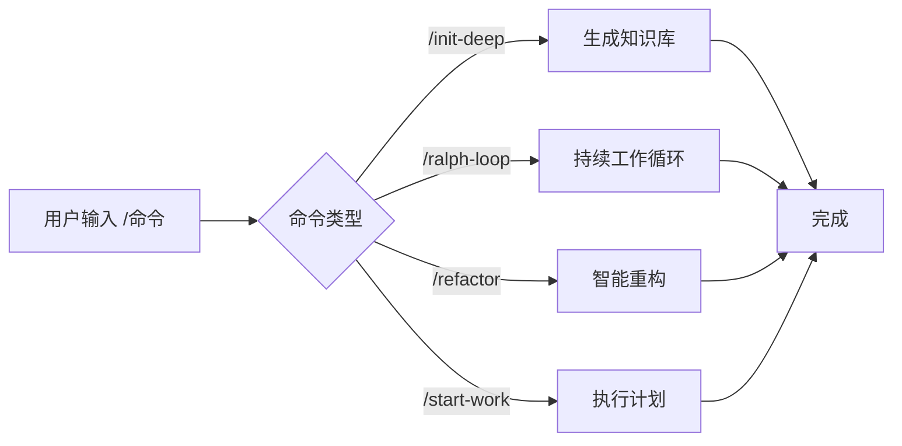

# 斜杠命令：预设工作流，一键触发复杂任务

## 学完你能做什么

- 使用 `/init-deep` 一键生成项目知识库
- 用 `/ralph-loop` 让代理持续工作直到任务完成
- 通过 `/refactor` 执行智能重构，自动验证每一步
- 用 `/start-work` 从 Prometheus 计划开始系统化开发

## 你现在的困境

重复执行相同的复杂任务时，每次都要输入长指令：

```
"请帮我分析这个项目的结构，找出所有关键模块，为每个目录生成 AGENTS.md，然后并行探索代码库模式..."
```

这种长指令既浪费时间，还容易遗漏步骤。

## 什么时候用这一招

**斜杠命令**是一键触发的预设工作流模板。这些命令涵盖了常见的开发场景：

| 场景 | 使用命令 |
|--- | ---|
| 初始化项目知识库 | `/init-deep` |
| 让 AI 持续工作 | `/ralph-loop` |
| 智能重构代码 | `/refactor` |
| 从计划开始工作 | `/start-work` |

## 核心思路

**斜杠命令**（Slash Commands）是预定义的工作流模板，通过 `/` 开头的触发词快速执行复杂任务。

**工作原理**：



oh-my-opencode 内置了 6 个斜杠命令：

| 命令 | 功能 | 复杂度 |
|--- | --- | ---|
| `/init-deep` | 生成分层级 AGENTS.md 文件 | 中 |
| `/ralph-loop` | 自我参考的开发循环 | 高 |
| `/ulw-loop` | Ultrawork 版本的 ralph-loop | 高 |
| `/cancel-ralph` | 取消活跃的 Ralph Loop | 低 |
| `/refactor` | 智能重构，完整工具链 | 高 |
| `/start-work` | 从 Prometheus 计划开始工作 | 中 |

::: info 自定义命令
除了内置命令，你可以在 `.opencode/command/` 或 `.claude/commands/` 目录下创建自定义命令（Markdown 文件）。
:::

## 🎒 开始前的准备

- ✅ 已完成 oh-my-opencode 安装
- ✅ 已配置至少一个 AI Provider
- ✅ 了解基础的代理使用（建议先学习《初识 Sisyphus：主编排器》）

## 跟我做

### 第 1 步：生成项目知识库

**为什么**
AI 代理需要了解项目结构和约定才能高效工作。`/init-deep` 命令会自动分析项目并生成分层的 AGENTS.md 文件。

**在 OpenCode 中输入**：

```
/init-deep
```

**你应该看到**：代理开始并发分析项目结构、探索代码模式、生成 AGENTS.md 文件。

**进阶用法**：

```bash
# 重新生成所有文件（删除旧的）
/init-deep --create-new

# 限制生成深度
/init-deep --max-depth=2
```

**输出示例**：

```
=== init-deep Complete ===

Mode: update

Files:
  [OK] ./AGENTS.md (root, 120 lines)
  [OK] ./src/hooks/AGENTS.md (45 lines)
  [OK] ./src/agents/AGENTS.md (38 lines)

Dirs Analyzed: 12
AGENTS.md Created: 3
```

### 第 2 步：让 AI 持续工作

**为什么**
有些任务需要多次迭代才能完成（比如修复复杂 bug）。`/ralph-loop` 命令会让代理持续工作直到任务完成，而不是中途停止。

**在 OpenCode 中输入**：

```
/ralph-loop "修复登录页面的认证问题，确保所有错误情况都被处理"
```

**你应该看到**：代理开始工作，完成后自动继续，直到输出完成标记。

**进阶用法**：

```bash
# 自定义完成标记
/ralph-loop "编写单元测试" --completion-promise="TESTS_DONE"

# 限制最大迭代次数
/ralph-loop "优化性能" --max-iterations=50
```

**Ultrawork 版本**（激活所有专业代理）：

```bash
/ulw-loop "开发 REST API，包含认证、授权、限流功能"
```

**检查点** ✅

- 代理是否在每次迭代后自动继续？
- 完成后是否看到 "Ralph Loop Complete!" 提示？

### 第 3 步：取消循环

**为什么**
如果任务方向不对或你想手动干预，需要取消循环。

**在 OpenCode 中输入**：

```
/cancel-ralph
```

**你应该看到**：循环停止，状态文件被清理。

### 第 4 步：智能重构

**为什么**
重构代码时，盲目修改会引入 bug。`/refactor` 命令使用完整的工具链（LSP、AST-Grep、测试验证）确保安全重构。

**在 OpenCode 中输入**：

```bash
# 重命名符号
/refactor "AuthService 类重构为 UserService"

# 重构模块
/refactor src/auth --scope=module --strategy=safe

# 模式匹配重构
/refactor "所有使用 deprecated API 的地方迁移到新 API"
```

**你应该看到**：代理执行 6 个阶段的重构流程：

1. **意图网关** - 确认重构目标
2. **代码库分析** - 并行探索依赖关系
3. **Codemap 构建** - 绘制影响范围
4. **测试评估** - 检查测试覆盖率
5. **计划生成** - 创建详细重构计划
6. **执行重构** - 逐步执行并验证

**进阶用法**：

```bash
# 激进策略（允许更大变更）
/refactor "架构重构" --strategy=aggressive

# 文件范围
/refactor "utils.ts 中的函数优化" --scope=file
```

::: warning 测试覆盖要求
如果目标代码的测试覆盖率低于 50%，`/refactor` 会拒绝执行激进策略。建议先添加测试。
:::

### 第 5 步：从计划开始工作

**为什么**
使用 Prometheus 规划后，需要系统化执行计划中的任务。`/start-work` 命令会自动加载计划并使用 Atlas 代理执行。

**在 OpenCode 中输入**：

```bash
# 自动选择单个计划
/start-work

# 选择特定计划
/start-work "auth-api-plan"
```

**你应该看到**：

- 如果只有一个计划：自动选择并开始执行
- 如果有多个计划：列出所有计划供选择

**输出示例**：

```
Available Work Plans

Current Time: 2026-01-26T10:30:00Z
Session ID: abc123

1. [auth-api-plan.md] - Modified: 2026-01-25 - Progress: 3/10 tasks
2. [migration-plan.md] - Modified: 2026-01-26 - Progress: 0/5 tasks

Which plan would you like to work on? (Enter number or plan name)
```

**检查点** ✅

- 计划是否正确加载？
- 任务是否按顺序执行？
- 完成的任务是否被标记？

## 踩坑提醒

### 1. `/init-deep` 忽略已有文件

**问题**：默认模式下，`/init-deep` 会保留现有的 AGENTS.md，只更新或创建缺失的部分。

**解决**：使用 `--create-new` 参数重新生成所有文件。

### 2. `/ralph-loop` 无限循环

**问题**：如果代理无法完成任务，循环会持续到最大迭代次数（默认 100）。

**解决**：
- 设置合理的 `--max-iterations`（如 20-30）
- 使用 `/cancel-ralph` 手动取消
- 提供更明确的任务描述

### 3. `/refactor` 测试覆盖率低

**问题**：目标代码没有测试，重构会失败。

**解决**：
```bash
# 让代理先添加测试
"请为 AuthService 添加完整的单元测试，覆盖所有边界情况"

# 然后再重构
/refactor "AuthService 类重构"
```

### 4. `/start-work` 找不到计划

**问题**：Prometheus 生成的计划没有保存在 `.sisyphus/plans/` 目录。

**解决**：
- 检查 Prometheus 输出是否包含计划文件路径
- 确认计划文件扩展名是 `.md`

### 5. 命令参数格式错误

**问题**：参数位置或格式不正确。

**解决**：
```bash
# ✅ 正确
/ralph-loop "任务描述" --completion-promise=DONE

# ❌ 错误
/ralph-loop --completion-promise=DONE "任务描述"
```

## 本课小结

| 命令 | 核心功能 | 使用频率 |
|--- | --- | ---|
| `/init-deep` | 自动生成项目知识库 | 初始设置 |
| `/ralph-loop` | 持续工作循环 | 高 |
| `/ulw-loop` | Ultrawork 版本的循环 | 中 |
| `/cancel-ralph` | 取消循环 | 低 |
| `/refactor` | 安全智能重构 | 高 |
| `/start-work` | 执行 Prometheus 计划 | 中 |

**最佳实践**：
- 新项目首次使用 `/init-deep` 建立知识库
- 复杂任务用 `/ralph-loop` 让 AI 持续工作
- 重构代码时首选 `/refactor`，确保安全
- 配合 Prometheus 使用 `/start-work` 系统化开发

## 下一课预告

下一课我们学习 **[配置深度定制](../advanced-configuration/)**。

你会学到：
- 如何覆盖代理的默认模型和提示词
- 如何配置权限和安全限制
- 如何自定义 Categories 和 Skills
- 如何调整后台任务并发控制

---

## 附录：源码参考

<details>
<summary><strong>点击展开查看源码位置</strong></summary>

> 更新时间：2026-01-26

| 功能 | 文件路径 | 行号 |
|--- | --- | ---|
| 命令定义 | [`src/features/builtin-commands/commands.ts`](https://github.com/code-yeongyu/oh-my-opencode/blob/main/src/features/builtin-commands/commands.ts) | 8-73 |
| 命令加载器 | [`src/features/builtin-commands/index.ts`](https://github.com/code-yeongyu/oh-my-opencode/blob/main/src/features/builtin-commands/index.ts) | 75-89 |
| init-deep 模板 | [`src/features/builtin-commands/templates/init-deep.ts`](https://github.com/code-yeongyu/oh-my-opencode/blob/main/src/features/builtin-commands/templates/init-deep.ts) | 全文 |
| ralph-loop 模板 | [`src/features/builtin-commands/templates/ralph-loop.ts`](https://github.com/code-yeongyu/oh-my-opencode/blob/main/src/features/builtin-commands/templates/ralph-loop.ts) | 全文 |
| refactor 模板 | [`src/features/builtin-commands/templates/refactor.ts`](https://github.com/code-yeongyu/oh-my-opencode/blob/main/src/features/builtin-commands/templates/refactor.ts) | 全文 |
| start-work 模板 | [`src/features/builtin-commands/templates/start-work.ts`](https://github.com/code-yeongyu/oh-my-opencode/blob/main/src/features/builtin-commands/templates/start-work.ts) | 全文 |
| Ralph Loop Hook 实现 | [`src/hooks/ralph-loop/index.ts`](https://github.com/code-yeongyu/oh-my-opencode/blob/main/src/hooks/ralph-loop/index.ts) | 全文 |
| 命令类型定义 | [`src/features/builtin-commands/types.ts`](https://github.com/code-yeongyu/oh-my-opencode/blob/main/src/features/builtin-commands/types.ts) | 全文 |

**关键函数**：
- `loadBuiltinCommands()`：加载内置命令定义，支持禁用特定命令
- `createRalphLoopHook()`：创建 Ralph Loop 生命周期钩子
- `startLoop()`：启动循环，设置状态和参数
- `cancelLoop()`：取消活跃循环，清理状态文件

**关键常量**：
- `DEFAULT_MAX_ITERATIONS = 100`：默认最大迭代次数
- `DEFAULT_COMPLETION_PROMISE = "DONE"`：默认完成标记

**配置位置**：
- 禁用命令：`oh-my-opencode.json` 中的 `disabled_commands` 字段
- 循环配置：`oh-my-opencode.json` 中的 `ralph_loop` 对象

</details>
