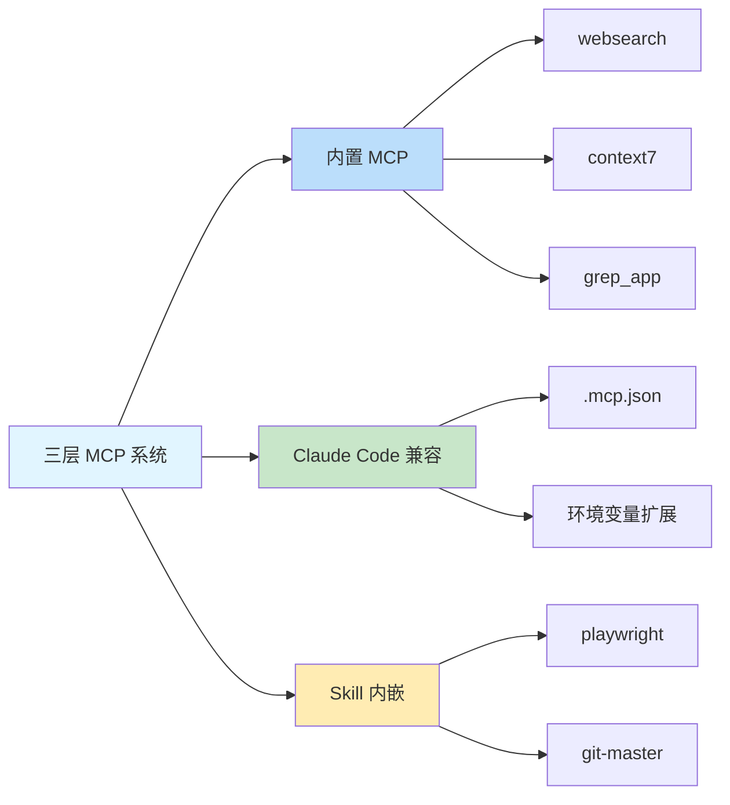

# 内置 MCP 服务器：网络搜索、文档查询和代码搜索

## 学完你能做什么

- 理解 3 个内置 MCP 服务器的功能和使用场景
- 知道如何配置 Exa Websearch 的 API Key
- 学会禁用不需要的 MCP 服务
- 了解三层 MCP 系统的架构和工作原理

## 你现在的困境

AI 代理只能访问本地文件和网络请求，但缺乏专业的搜索和文档查询能力。你希望代理能够：
- 实时搜索网络获取最新信息
- 查阅官方文档获取准确的 API 说明
- 在 GitHub 仓库中搜索实现示例

但这些功能需要手动实现，增加了开发复杂度。

## 什么时候用这一招

当你需要扩展 AI 代理的能力时：

| 场景 | 推荐使用的 MCP |
|-----|--------------|
| 需要获取最新技术信息、新闻、行业动态 | **websearch** (Exa) |
| 查询库或框架的官方 API 文档 | **context7** |
| 在 GitHub 仓库中查找实现示例 | **grep_app** (Grep.app) |

## 核心思路：什么是 MCP？

**MCP (Model Context Protocol)** 是一种标准协议，让 AI 代理能够访问外部工具和数据源。简单理解：

::: info 什么是 MCP？
MCP 就像给 AI 代理配备了一个「工具箱」，里面装着各种专业工具（搜索、数据库、API 等）。代理可以按需调用这些工具，获取本地无法提供的能力。
:::

Oh-My-OpenCode 提供了**三层 MCP 系统**：



**本课重点介绍第一层：内置 MCP 服务器**。

---

## 三个内置 MCP 服务器

Oh-My-OpenCode 内置了 3 个远程 MCP 服务器，无需额外配置即可使用（部分需要 API Key）。

### 1. websearch (Exa AI)

**功能**：实时网络搜索，由 [Exa AI](https://exa.ai) 提供支持。

**适用场景**：
- 搜索最新技术文章和新闻
- 查找特定问题的解决方案
- 获取行业趋势和最佳实践

**配置要求**：

需要设置 `EXA_API_KEY` 环境变量：

::: code-group

```bash [macOS/Linux]
export EXA_API_KEY="your-api-key-here"
```

```powershell [Windows]
setx EXA_API_KEY "your-api-key-here"
```

:::

::: tip 获取 Exa API Key
1. 访问 [Exa AI](https://exa.ai)
2. 注册账号
3. 在 Dashboard 中创建 API Key
4. 将 Key 添加到环境变量
:::

**源码位置**：`src/mcp/websearch.ts`（第 1-11 行）

---

### 2. context7

**功能**：官方文档查询，支持任何编程库或框架。

**适用场景**：
- 查询 React、Vue、Next.js 等库的 API 文档
- 获取 Node.js、Python 等运行时的官方说明
- 查阅开源项目的使用指南

**配置要求**：无需配置，开箱即用。

**源码位置**：`src/mcp/context7.ts`（第 1-7 行）

---

### 3. grep_app (Grep.app)

**功能**：超快速的 GitHub 代码搜索，用于查找实现示例。

**适用场景**：
- 在开源项目中查找特定模式的实现
- 学习别人的代码写法
- 寻找解决特定问题的代码片段

**配置要求**：无需配置，开箱即用。

**源码位置**：`src/mcp/grep-app.ts`（第 1-7 行）

---

## 配置与禁用 MCP

### 默认行为

所有内置 MCP 服务器**默认启用**。Oh-My-OpenCode 会在启动时自动注册这些服务。

### 禁用不需要的 MCP

如果某些 MCP 服务不需要，可以在配置文件中禁用：

```jsonc
// ~/.config/opencode/oh-my-opencode.json 或 .opencode/oh-my-opencode.json
{
  "$schema": "./assets/oh-my-opencode.schema.json",

  // 禁用不需要的 MCP 服务器
  "disabled_mcps": [
    "websearch",    // 禁用网络搜索（如果不需要 Exa API Key）
    "grep_app"      // 禁用 GitHub 代码搜索
  ]
}
```

::: warning 为什么禁用 MCP？
禁用不需要的 MCP 可以：
1. **节省资源**：减少不必要的连接和请求
2. **简化配置**：避免提示需要未设置的 API Key
3. **提高稳定性**：减少潜在的网络故障点
:::

### 配置优先级

内置 MCP 的禁用配置优先级：

| 配置位置 | 优先级 |
|---------|--------|
| 用户配置 `~/.config/opencode/oh-my-opencode.json` | 高（覆盖项目配置） |
| 项目配置 `.opencode/oh-my-opencode.json` | 中 |
| 代码默认值 | 低（全部启用） |

---

## 工作原理：远程 MCP 配置

所有内置 MCP 服务器都使用**远程（remote）模式**，通过 HTTP/SSE 协议连接到外部服务。

**配置模式**（源码定义）：

```typescript
// src/mcp/websearch.ts
export const websearch = {
  type: "remote" as const,        // 固定为 "remote"
  url: "https://mcp.exa.ai/mcp?tools=web_search_exa",  // MCP 服务器地址
  enabled: true,                   // 启用状态（会被 disabled_mcps 覆盖）
  headers: process.env.EXA_API_KEY  // 可选的请求头（API Key）
    ? { "x-api-key": process.env.EXA_API_KEY }
    : undefined,
  oauth: false as const,            // 禁用 OAuth 自动检测
}
```

**配置字段说明**：

| 字段 | 类型 | 说明 |
|-----|------|------|
| `type` | `"remote"` | 固定值，表示远程 MCP |
| `url` | `string` | MCP 服务器的 HTTP 地址 |
| `enabled` | `boolean` | 是否启用（代码中固定为 `true`，由 `disabled_mcps` 控制） |
| `headers` | `object` | 可选的 HTTP 请求头（用于认证） |
| `oauth` | `false` | 禁用 OAuth 自动检测（Exa 使用 API Key） |

---

## 踩坑提醒

### 问题 1：websearch 需要 API Key

**症状**：代理尝试使用 websearch 时失败，提示缺少 API Key。

**解决方法**：

```bash
# 检查环境变量是否设置
echo $EXA_API_KEY

# 如果为空，设置 API Key
export EXA_API_KEY="your-actual-api-key"

# 或永久添加到 shell 配置（~/.bashrc, ~/.zshrc 等）
echo 'export EXA_API_KEY="your-actual-api-key"' >> ~/.zshrc
```

::: tip 验证 API Key
设置后，可以重启 OpenCode 或运行诊断命令验证：
```bash
oh-my-opencode doctor --verbose
```
:::

### 问题 2：禁用后仍提示 MCP

**症状**：即使禁用了某个 MCP，代理仍尝试使用它。

**解决方法**：

1. 检查配置文件路径是否正确：
   - 用户配置：`~/.config/opencode/oh-my-opencode.json`
   - 项目配置：`.opencode/oh-my-opencode.json`

2. 确认 JSON 格式正确（注意逗号、引号）：

```jsonc
{
  "disabled_mcps": ["websearch"]  // ✅ 正确
  // "disabled_mcps": ["websearch"],  // ❌ 错误：末尾不能有逗号
}
```

3. 重启 OpenCode 使配置生效。

### 问题 3：Grep.app 结果不准确

**症状**：grep_app 返回的结果与预期不符。

**可能原因**：
- 搜索关键词太泛化
- 目标仓库不活跃或已删除
- 搜索语法不正确

**解决方法**：
- 使用更具体的搜索词
- 在搜索时指定文件类型或语言
- 直接访问 [Grep.app](https://grep.app) 手动验证

---

## 本课小结

本课介绍了 Oh-My-OpenCode 的 3 个内置 MCP 服务器：

| MCP | 功能 | 配置要求 | 主要用途 |
|-----|------|---------|---------|
| **websearch** | 实时网络搜索 | EXA_API_KEY | 获取最新信息 |
| **context7** | 官方文档查询 | 无 | 查阅 API 文档 |
| **grep_app** | GitHub 代码搜索 | 无 | 查找实现示例 |

**关键要点**：

1. **三层 MCP 系统**：内置 → Claude Code 兼容 → Skill 内嵌
2. **默认启用**：所有内置 MCP 默认开启，可通过 `disabled_mcps` 禁用
3. **远程模式**：所有内置 MCP 使用 HTTP/SSE 协议连接外部服务
4. **Exa 需要 Key**：websearch 需要 `EXA_API_KEY` 环境变量

这些 MCP 服务器大大扩展了 AI 代理的能力，让它们能够访问实时信息和专业知识库。

---

## 附录：源码参考

<details>
<summary><strong>点击展开查看源码位置</strong></summary>

> 更新时间：2026-01-26

| 功能 | 文件路径 | 行号 |
|------|---------|------|
| MCP 工厂函数 | [`src/mcp/index.ts`](https://github.com/code-yeongyu/oh-my-opencode/blob/main/src/mcp/index.ts) | 22-32 |
| websearch 配置 | [`src/mcp/websearch.ts`](https://github.com/code-yeongyu/oh-my-opencode/blob/main/src/mcp/websearch.ts) | 1-11 |
| context7 配置 | [`src/mcp/context7.ts`](https://github.com/code-yeongyu/oh-my-opencode/blob/main/src/mcp/context7.ts) | 1-7 |
| grep_app 配置 | [`src/mcp/grep-app.ts`](https://github.com/code-yeongyu/oh-my-opencode/blob/main/src/mcp/grep-app.ts) | 1-7 |
| McpNameSchema | [`src/mcp/types.ts`](https://github.com/code-yeongyu/oh-my-opencode/blob/main/src/mcp/types.ts) | 1-10 |
| disabled_mcps 字段 | [`src/config/schema.ts`](https://github.com/code-yeongyu/oh-my-opencode/blob/main/src/config/schema.ts) | 331 |

**关键常量**：
- `allBuiltinMcps`：内置 MCP 配置对象，包含 websearch、context7、grep_app（`src/mcp/index.ts:16-20`）

**关键函数**：
- `createBuiltinMcps(disabledMcps)`：创建启用的 MCP 列表，过滤掉被禁用的 MCP（`src/mcp/index.ts:22-32`）

</details>
